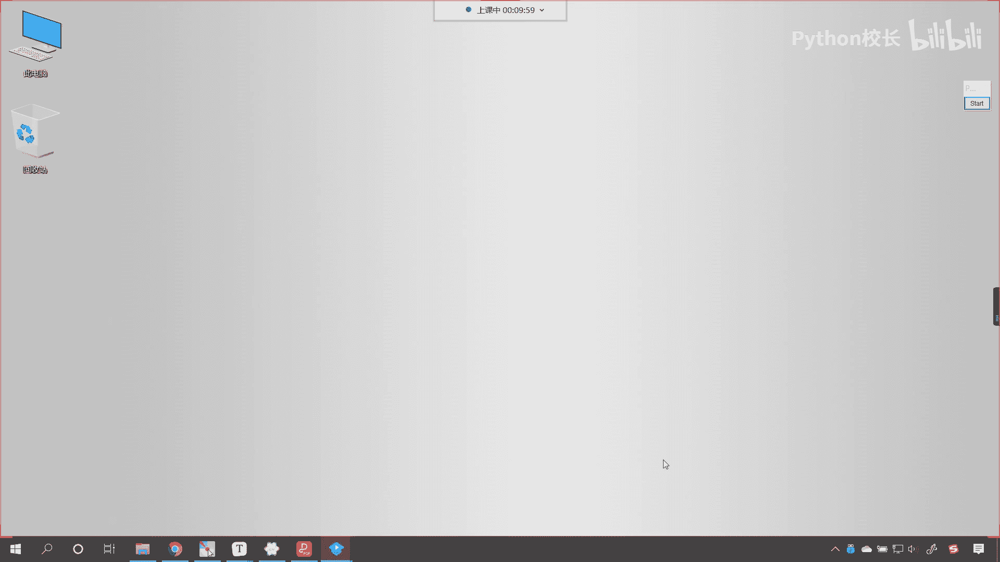
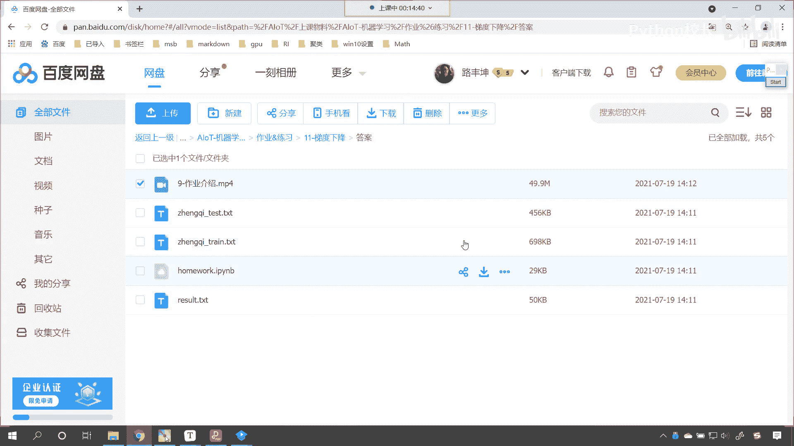

# P67：1-知识点回顾作业介绍 - 程序大本营 - BV1KL411z7WA

好来打开的打开我们的梯度下降好，那么我们简单回顾一下，咱们上一上一节课所讲的内容好，那么我们上一节课呢，咱们就介绍了这什么是梯度下降，以及呢它相应的概念包，包括学习率呀，梯度下降的公式。

还有无约束最优化问题，大家对于这个无约束最优化问题，这个概念你要了解一下，后面咱们再讲到线性分类支持向量机的时候，在这儿呢我们会讲一个和它对应的，叫做有约束的最优化，这一对比你就知道了什么叫无约束。

无约束最优化，那呃上一节课呢咱们使用代码，我们进行了梯度下降的这个模拟好，那么大家也能够看到，那这个方程呢其实是任意的啊，这个其实就是一个一元二次方程，它就是一个抛物线，对不对呀。

方程当中的这个方程当中的系数，这个都是可以调整的好，那么嗯在上一节课呢，嗯咱们讲到了该如何使用梯度下降，来使用代码来进行演示和操作，对不对呀，那我们这个地方的这个核心操作啊，咱们呢就是一个死循环。

死循环当中有相应的判断退出条件，以及呢有这个数据的更新，那么只要满足条件，咱们的for循环就会退出，然后我们对这个更新的数据，咱们进行了相应的这个数据可视化，我们也能够发现咱们梯度下降。

它就是沿着梯度一点一点逼近咱们的最优点好，那么这个呢它是一种解决问题的方式，那很多时候呢，这个我们再去解决这个真实现实问题的时候，它不像咱们有具体的公式可以直接套用，往往没有公式直接套用，那这个时候呢。

我们就得需要使用梯度下降的方式唉，来找到一个最优解，咱们要这个梯度下降就相当于是一个方向啊，梯度下降相当于是一个方向，那我们在这个方向上去走，在这个方向上去摸索，最后的话我们就会找到最优解，好。

那么呃希望各位小伙伴呢，把咱们梯度下降的代码一定要这个理解，一定要弄明白，并且呢自己能够写出来好，那么这个是我们上一节课主要的内容，那咱们呢在上一节课还留了相应的作业，对不对，那么大家就能够看到啊。

我们这个作业呢，咱们已经上传到咱们的百度网盘了，哎大家看啊，就在这儿呢，在这个百度网盘当中呢，我为你录制了视频好，那么这个视频呢十几分钟，咱们就使用我们已经学到的这个线性回归，咱们将天池工业蒸汽量的唉。

这个数据对他进行了训练，对于测试数据进行了预测，那么有可能你使用咱们的线性回归，将这个数据进行了学习，然后对于测试数据进行了预测，上传到天池工业蒸汽量的这个嗯，这个测评的这个平台，让他给你打一下分。

我们发现这个分数呢不高是吧，你可能没有排名，那么随着咱们呃线性回归，以及后面更高级算法学习的深入，那么我们还可以回过头来继续做这个，继续做这个项目啊，争取呢咱们把这个天池排名是吧。

把这个分数给它提升上去，好这个呢是咱们上一节课知识点的一个回顾，以及呢咱们作业的一个介绍好。

