# P68：2-三种梯度下降对比 - 程序大本营 - BV1KL411z7WA

继续往下看，咱们看今天我们要学习的知识。

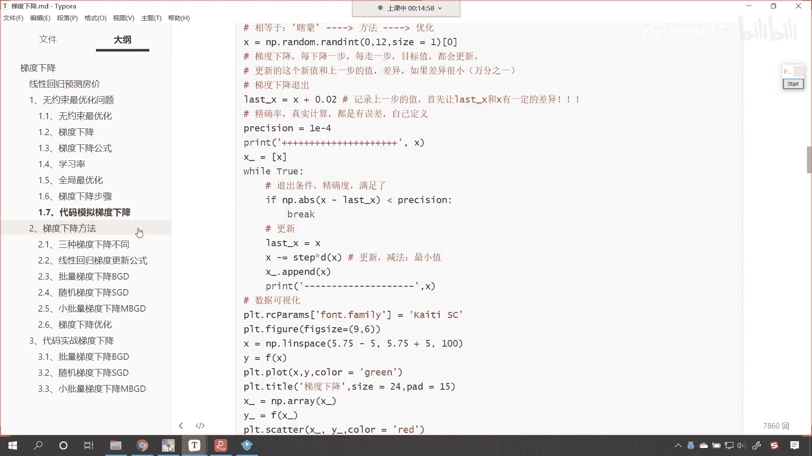

那上一节课咱们讲解了梯度下降的思想，那这一节课呢我们就看一下梯度下降，它真实的一个应用，因为我们说啊在咱们机器学习当中，甚至后面深度学习当中，我们的优化，我们寻找答案，都是通过梯度下降的方式来找到的。

咱们的梯度下降呢一共分为三种类型，叫做批量梯度下降，小批量梯度下降和随机梯度下降，那么这三种梯度下降呢，它的原理是一样的，操作方式会有一点不同，这什么是这个批量梯度下降呢。

就是我们使用全部的数据来进行训练，就是计算的时候呢，咱们使用全量数据进行计算，那什么是小批量梯度下降呢，小批量梯度下降，就是从全部数据当中进行数据抽样，比如说原来的数据有500个样本。

我们从中只拿取32个数据，64个数据，咱们随机取出来的这小批量的数据，咱们进行特征的抽取，我们进行学习，还有呢叫做随机梯度下降，这个呢做得更绝，那随机梯度下降呢就是从样本当中，我们随机抽取一个样本。

咱们来进行模型的训练和学习好，那么这三种梯度下降有什么样不一样的地方呢。

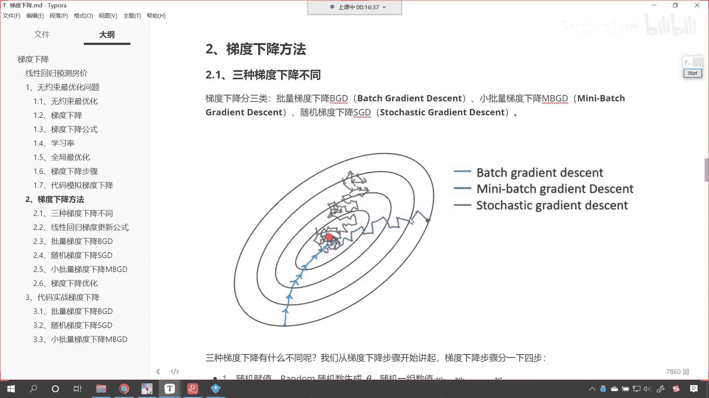

大家能够看到这一张图，你看如果说我用批量梯度下降，就是咱们对应的蓝色这条线，那么我们梯度下降是不是，就像我们道士下山一样呀，对啊一步一步找咱们的这个最低点，那就是山谷的位置，是不是。

那你看批量梯度下降呢，就是蓝色这条线是吧，每走一步，因为他考察了所有的数据，所以说他走的步数比较少，但是呢它的计算量比较大，我们知道任何一个事物，是不是都有正面和反面啊，只要它有优点，那么它一定有缺点。

好，咱们接下来呢，我们看一下咱们的小批量梯度下降，在这儿呢我们就能够看到是不是绿色的这条线，那么小批量梯度下降，那我们就能够发现它在进行这个梯度下降，也就是说寻找最优解的过程当中。

我们就发现这个是拐弯的，是不是啊，这个忽上忽下的，为什么呀，因为它没有使用到全部的数据，那我们如果有全部的数据，那么那么我们获取的就是全部数据的特征，那如果说我们只用一部分数据，那你想咱们得到的规律。

它是不是就有一定的偏差呀，那最后咱们再看紫色的这条线，紫色的这条线呢叫做随机梯度下降，随机梯度下降，咱们刚才在做概念解释的时候，咱们说了，它其实就是从所有样本当中选择一个样本。

来进行咱们这个梯度下降的计算，那如果只选择一个样本，那大家可以想象一下，它的随机性波动是不是就比较严重呀，那随机性波动比较严重，这个时候你这个时候各位就能够看到，你看我们梯度下降的这个步骤。

是不是就会多一些是吧，哎曲流拐弯的，这个时候这个波动就更加大是吧，最后走着走着走着，是不是哎我们就走到哪了呀，唉最后走着走着咱们就走到这个最低点了，就是无论这三种方式我们选哪种方式。

最后呢咱们都能够找到它的最优解，那这个特别像什么呢，看这个特别像什么，我给你举一个例子啊，假设说你现在呢在原始森林当中迷路了，那你该怎么办呢是吧，你怎么才能走出去呢，你没有地图。

那这个时候你如果想要走出去是吧，那你就得沿着这个沿着这个水流走，沿着水流走，有一个特点，水流呢它会拐弯啊，它会拐弯，所以说你沿着水流走，你一定会走弯路，但是这个水流呢它小的水流汇集成大的水流。

大的水流呢它汇集成这个汇集成这个呃浆，你沿着这个河流是吧，一定能够走到这个海边，所以说你沿着这个河流走，一定能够出去，这就像咱们随机梯度下降一样，哎虽然你是这个沿着一个方向走，你会走弯路，你会拐弯。

但是他一定能够出去，知道吧，他一定能够出去啊，唉这是咱们刚才做了一个这个比喻。

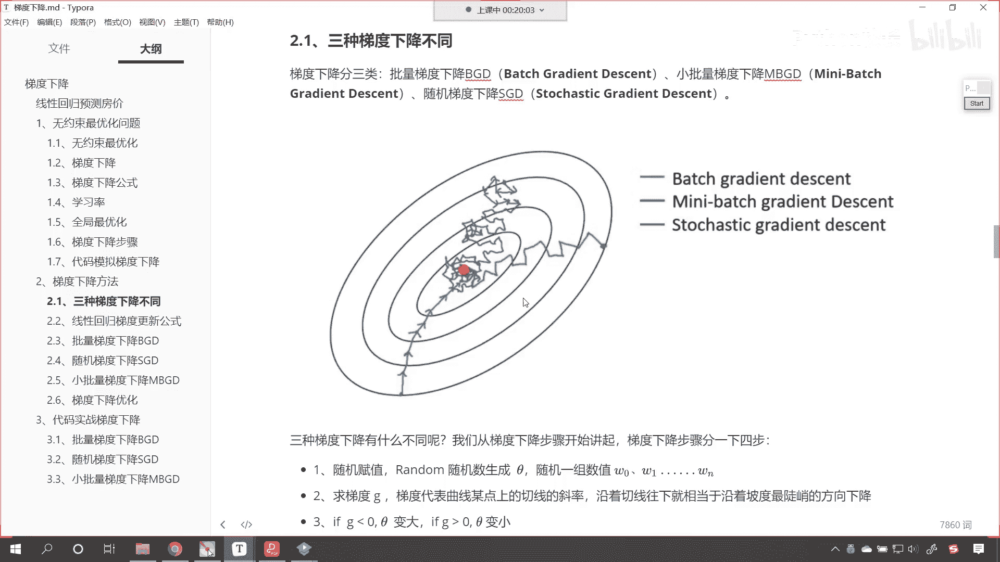

那我们看一下咱们的三种梯度下降，有什么不同呢，那我们首先看一下咱们梯度下降的步骤好不好，根据咱们上一讲，咱们使用代码模拟的这个梯度下降，看咱们使用代码模拟的梯度下降。

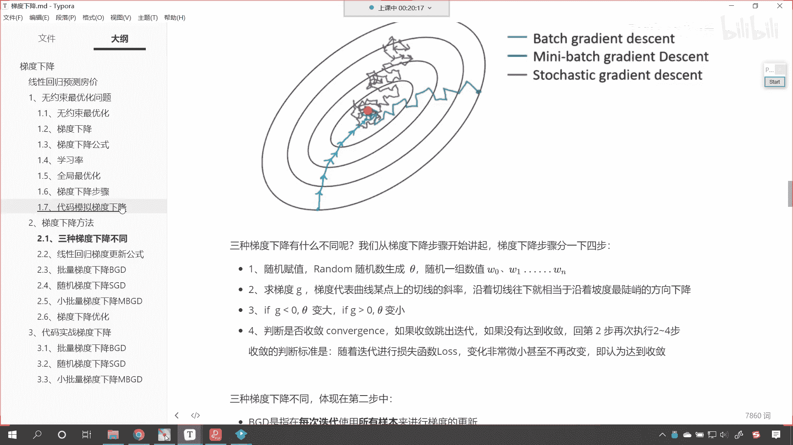

那我就知道呢这个步骤是怎么进行操作的呢。

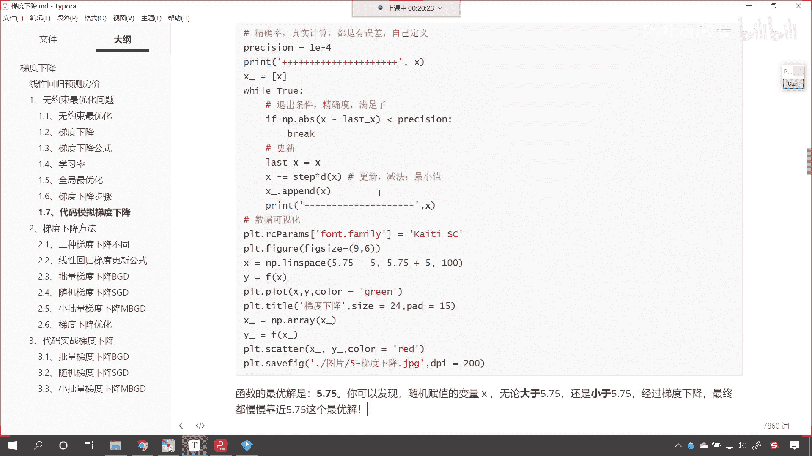

首先咱们是不是这个随机声明一个变量x呀。

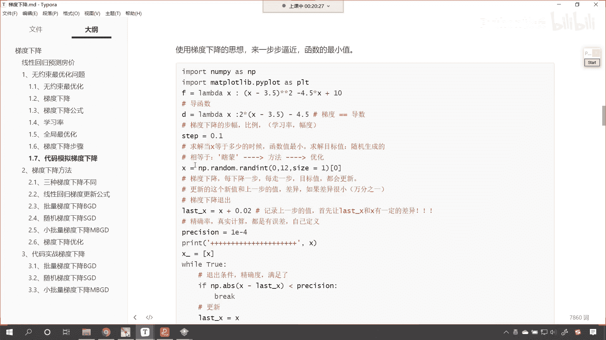

然后咱们在while true循环当中，是不是对它进行更新呀，你看这一步就是更新，更新完之后呢，咱们在while循环当中对它进行判断，是不是这个精确度达到了，如果要达到了。

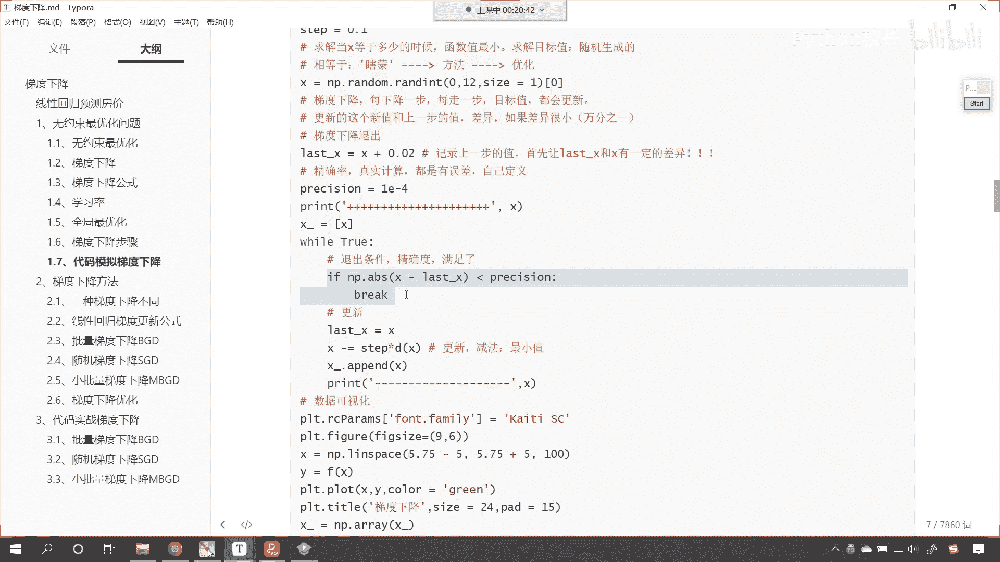

咱们是不是就退出呀，那咱们三种梯度下降也是类似的操作，大家看这第一步叫随机赋值，你看我们random随机数生成咱们的theta，这个c塔就是咱们多元线性方程的系数是吧。

那这一组变量呢就对应了w0 w1 w n，第二步呢咱们就是求它的梯度，那我们求的这个梯度它对应着谁呢，哎对应着咱们最小二乘法的那个公式，大家要注意啊，咱们在进行梯度下降的时候。

虽然我们不知道这个方程它长什么样，但是呢我们已经假定了，那这个数据呢它符合正态分布对吧，那它所对应的这个损失函数，就是高斯推导出来的这个梯度下降，所以说在这个地方我们不做证明，咱们直接用。

以后你出去面试知道吗，以后你出去面试也没有面试官去问，你说这个呃这个为什么这个数据正态分布，它的概率密度是这样推出来的，是不是你直接回答，你直接告诉他说，你说这个公式呢是高斯推导出来的。

我们呢没有必要再重新推导一遍，我们直接用就可以了，是不是，那这个时候他如果要非要为难你是吧，那你可以反问一下他，你说请问高斯当时的推导过程是什么样的呀，他也说不出来，知道吗，他可能知道一个大概。

但是你真的让他推倒是吧，那他肯定推导不出来是吧，那他又不是高斯在世，是不是，那你想真正的这个推导和这个论证的一个过程，那肯定是相当复杂的，所以说我们呢就是站在巨人的肩膀上，直接用第二步呢。

咱们就是求梯度，第三步呢哎大家看if咱们的g小于零，那我们的theta就变大，if咱们的g大于零，那么咱们的theta就变小，因为咱们梯度下降，是咱们梯度下降是不是减去一个不符乘以，咱们的这个g呀对吧。

你想这个g的前边它有一个减法，是不是，哎你看我们是这样的啊，我们有一个g是吧，咱们的这个c它梯度下降的更新呢就等于theta，是不是啊，然后减去叫一塔，我们这个一塔呢就是咱们的不符乘以谁呢。

哎乘以咱们的导数，我们就把它写成g吧，那这个时候你看如果咱们的g小于零，那你想theta是不是就是变大呀，对不对，theta就变大，如果我是北京联通官，如果咱们的这个如果咱们的这个g大于零。

那你想一个数据减去一个大的数，那它是不是就变小了，对不对啊，这个theta就变小，哎所以说这个无论哪种方式，那么它的更新规则呢哎都是用梯度下降。

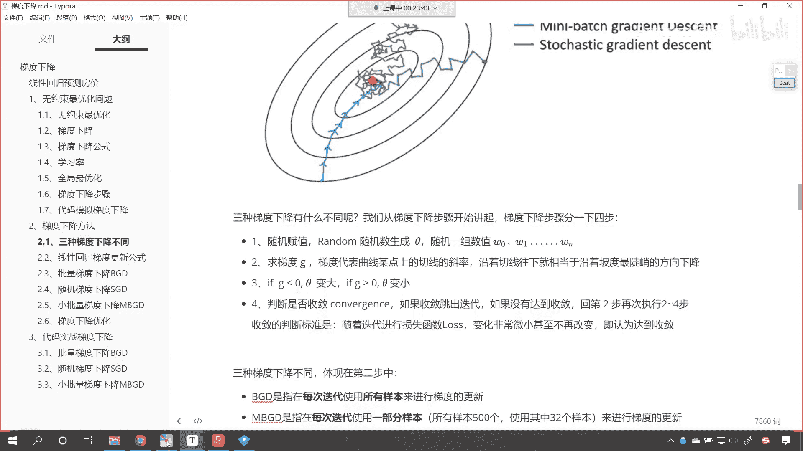

那第四步呢就是判断是否收敛，如果收敛的话，咱们就跳出迭代，跳出循环，如果没有收敛，那咱们就继续执行2~4步是吧，收敛的判断标准就是随着迭代进行，咱们的损失函数是吧，变化甚小，甚至不再改变。

也就是说它的精确度不再发生变化了，我们也可以认为这个达到咱们的这个精确度了。

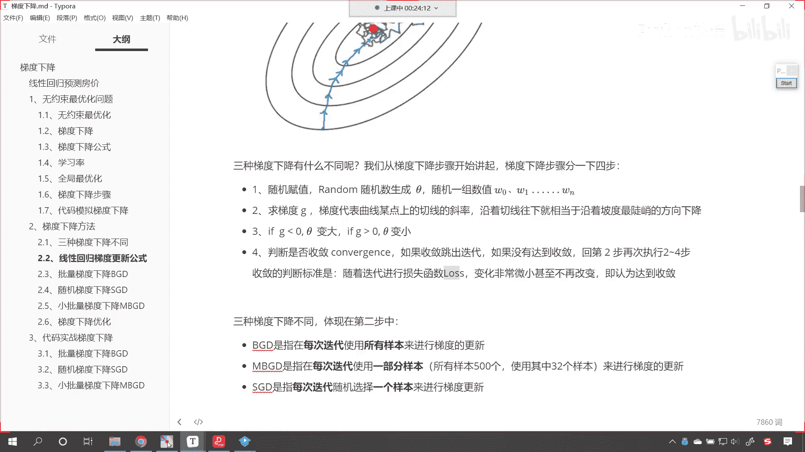

继任为收敛，很多时候呢，很多时候啊，咱们在进行梯度下降的时候，咱们可以给一个for循环，比如说我们让它循环这个呃1000次，让它循环5000次，甚至让它循环1万次，那一般情况下。

在这么多次的循环过程当中。

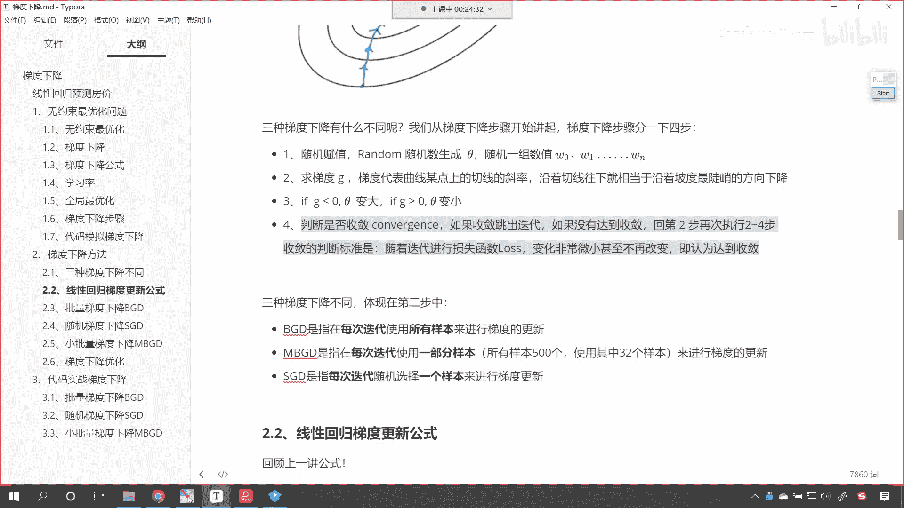

咱们就可以找到这个最优解，好咱们三种梯度下降不同体现在第二步当中，你看我们的第二步是不是就是求梯度呀，对不对，第二步就是求梯度，咱们的bgd就是批量梯度下降，那他呢是在每次迭代。

使用所有的样本来进行梯度的更新，小批量梯度下降呢就是使用一部分样本举例，比如说样本是500个，我们选取其中的32个样本来进行更新，s g d呢就是每次迭代，咱们随机选择一个样本来进行梯度的更新。

那我们一开始的时候，咱们介绍的是理论的部分，诶大家呢要对于这个理论的部分呢有一个概念，那后面咱们会使用代码实战梯度下降，结合这些概念，结合咱们的代码，你再一次对于梯度下降有一个深刻的认识。

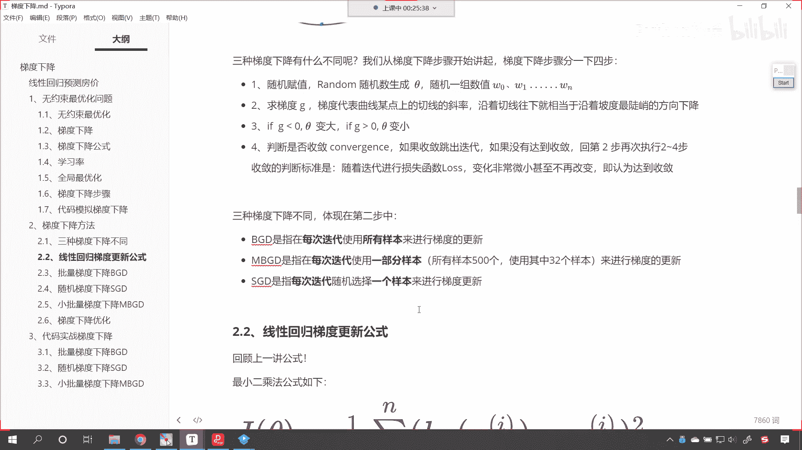