# P69：3-线性回归梯度下降更新公式 - 程序大本营 - BV1KL411z7WA

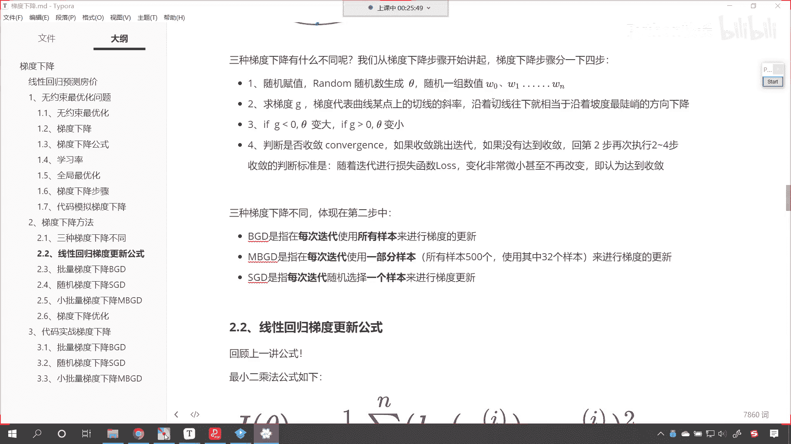

咱们继续向下看好，那么我们就看一下，无论是哪种梯度下降，它是不是都对应着一个具体的公式啊，对不对，那我们就看一下啊，咱们线性回归，梯度下降的这个更新公式是怎样的，既然是线性回归。

那我们的回归方程有可能简单，也有可能复杂，简单的，你比如说是一元一次方程，它只有一个未知数，是不是复杂的，你比如说呃咱们给各位留的作业叫天池，工业蒸汽量预测，在这个方程当中，大家想它是不是有38个属性。

38个属性是不是就对应着38个系数呀，对不对，哎那我们天池工业蒸汽量那个方程，就是38元一次方程，明白吗，它呢就是38元一次方程，它是这样的一个这个方程好，那么呃咱们呢往下看啊。

我们说无论你简单还是复杂，你只要是线性回归，那么是不是就要用到咱们高斯所推导出来的，这个最小二乘法呀，咱们在最一开始的时候，我们就带着各位进行了最小二乘法公式的推导，那我们这个推导的这个原理呢。

咱们其实就是来自正态分布，是不是就是来自高斯分布，当时咱们介绍了一个极大自然，唉，还有印象吗，一个罐子当中放着黑球和白球，是不是啊，我们如何确定罐子当中黑球白球的比例。

是不是唉那个地方讲到了这个极大自然好。

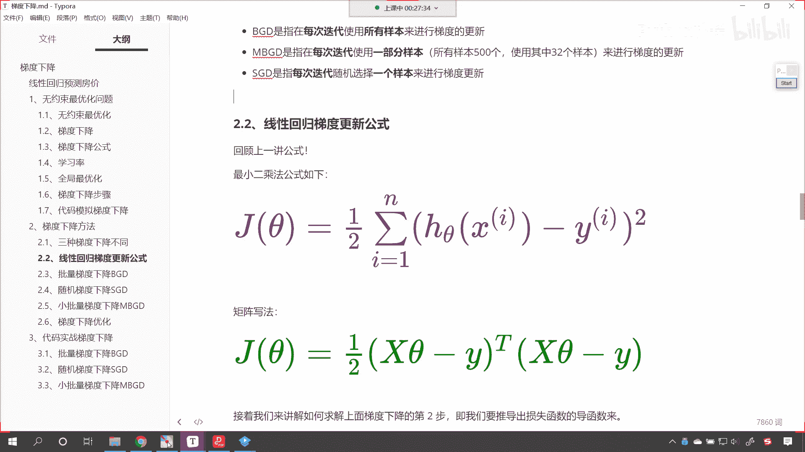

那么大家看这个公式呢，就是1/2，是不是啊，这个求和符号，然后让咱们每一个预测值，减去咱们每一个真实值，然后它的平方是不是这个公式也很简单啊，你感性的理解一下，是不是啊，为什么说是感性的理解一下。

就是通过你的感觉，你看这是啥意思啊，你看也就是说，我希望咱们的这个真实值和预测值，你看我希望真实值和预测值接近，那么怎么，那这个最小二乘法就是衡量它接近的一个标准，那就是衡量它接如果这两个数据相减。

它的平方是吧，那越来越小，是不是，就说明咱们的预测值和这个真实值，就越来越接近呀，你想一下他的理想状况，理想状况是不是就是零，对不对呀，你看最完美的情况，最理想的情况是不是就是这个jc他是零呀。

这个时候你想hc塔x和咱们的yi，它是不是两者一模一样呀，对不对，哎但是一般情况下我们真实数据是吧，哎它都存在一定的误差，它都存在一个这个正态分布，所以说呢那即使你存在不一样是吧，存在一定的变化。

只要你整体的这个jc a越小，那就说明咱们所拟合出来的这个线性方程，我们所使用机器学习求解出来的这个模型，这个方程，那么它就越接近咱们这个平方换成绝对值，是不是平方换成绝对值，咱们再进行求导的时候。

那这个就不太，那这个就不方便了，知道吧，平方换成绝对值也可以知道吗，我给你，我告诉你啊，也可以，但是唉有一个问题就是你求导怎么样了，就不方便了，对不对啊，求导就不方便了，因为什么呀。

因为绝对值函数它是没有导数的，那这就是为什么这个高这个高斯，它高级的地方是不是为啥呀，因为有了这个有了这个平方，我是不是可以不区分正和负呀，对不对，你如果说你这个地方要是个绝对值。

你看你这个地方是一个绝对值，你想它俩相减，你得怎么样，你是不是得考虑正负呀，对不对，你考虑正负，那有了一个平方是吧，无论正负求导都是相应的一个结果，那只要它可以求导，我们把这个叫做自动求导。

那么咱们在代码当中就可以进行嗯计算了，知道吧，就可以就是使用代码把它写出来，无论我们遇到的是什么样的问题，遇到的是简单的线性回归也好，还是复杂的线性回归也好，都可以把它求解出来，如果说这要是一个。

但如果说这要是一个绝对值的话是吧，那就不行了，好咱们继续往下看啊，上面是最小二乘法，咱们求和的一个公式，下面是矩阵写法是吧，咱们直接演示好，那么之前的时候咱们有小伙伴就问到了，说老师呃。

我们这个最小二乘法的公式，这个地方带着一个1/2是吧，为什么要带1/2呢，我告诉你1/2是一个常量，咱们带和不带对于结果影响不大，待会儿咱们再进行求导的时候，你就明白了，数学家都有强迫症，知道吗。

数学家都有强迫症，那经过求导之后呢，你看你求导之后，你的右下右上角是不是二，这个二是不是就写到前面了呀，看到了吧，这个二是不是就写到前面了，二写到前面的话，我们这个二和这个1/2乘，它是不是就变成一了。

哎那这个时候是不是就化简了，这个方程是不是看着就更加的这个简洁呀。

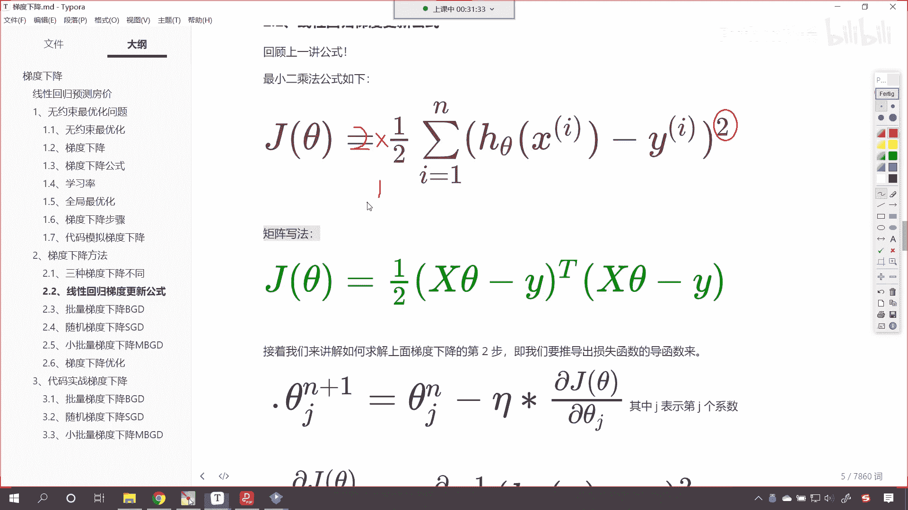

其实就是为了简洁嗯，所以说它的作用是这样的啊。

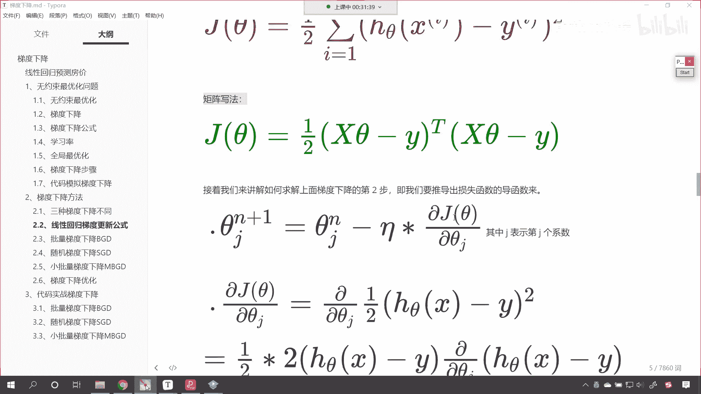

好那么我们接下来我们看一下啊，那咱们知道梯度下降的这个概念了。

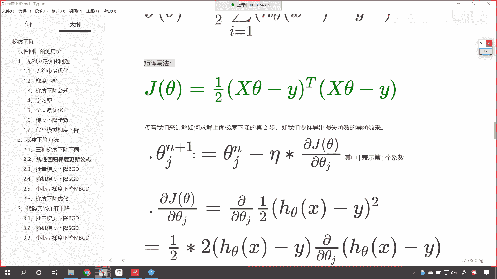

对不对呀，你看我们知道梯度下降的这个公式，我们在上一节课咱们就介绍到了，我们说这个theta n加一呢，也就是说这是啊，这个n呢就表示第n次梯度下降的这个啊，这个系数值，那这个n加一呢。

就是咱们又进行了一次梯度下降，看到了吗，这是n加一次梯度下降，它所对应的系数值，这是第n次，那既然梯度下降是一次一次的走，那么我们n加一次这个值该怎么计算呢，就是咱们第n次。

也就是上一次的这个系数减去阿尔法乘以，gradient，我们说这个gradient呢，哎就是咱们的导数，对不对呀，那导数该怎么求呢，是不是导数该怎么求呀，导数是不是就是这个偏j theta偏c塔呀。

对不对，现在我们呢有了具体的公式了。

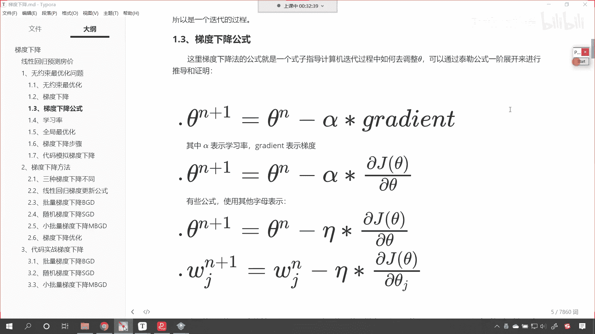

大家看到了吧，线性回归它对应着一个最小二乘法。

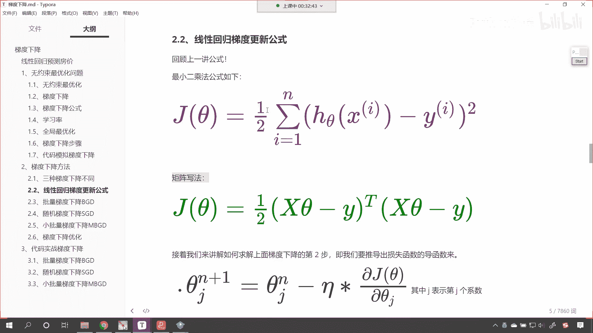

这个就是它具体的公式，那么咱们就根据咱们上一节课是吧，梯度下降的公式，你看我是不是就可以写成这种样式呀，看到了我是不是就可以写成这种样式，看到了吗，那这个j呢就表示d这个系数是吧。

这个j就表示d这个系数呃，因为咱们这是一个通用的公式，我们线性方程当中，是不是有可能会有多个系数呀，是不是哎，那这个j呢我们也可以用w1 w2 w3 呀，来表示，是不是嗯，所以说这是dj的系数。

然后对他求了一个偏导，你看到如果要是有多个系数，咱们其实就是求偏导好，那么这个时候呢，咱们就把上面这个公式给它带进来好不好，你看到了吧，那我们如果要对它求偏导，大家看下面这是具体的公式，看到了吗。

下面这是具体的公式，那你1/2，然后乘以2h c塔x减y，然后再偏是偏西塔g h c塔x减y。

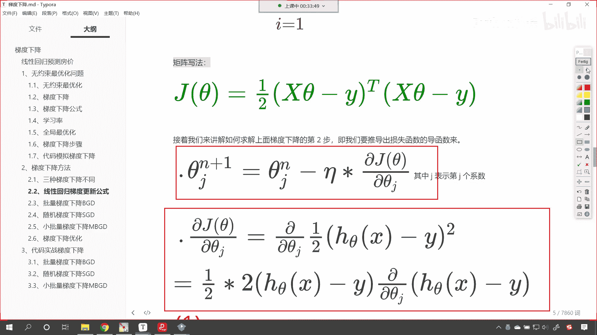

我们继续往下滑，咱们呢其实可以进行相应的化解，对不对呀，看咱们可以进行相应的化解，这个时候呢你看啊，这个时候咱们将上面那个公式，我们是不是可以给它展开呀，看到了吧，上面这个公式可以进行展开。

你想一下为什么可以这样写，看来想一下为什么可以这样写，你想h c大x这个是不是代表一个方程，对不对，h c塔x它代表一个方程，也就是说咱们嗯如果要是这个方程的话，那其实就是这个方程的系数。

比如咱们第一个呢是咱们第一个是c塔零是吧，然后乘以x0 对吧，然后呢再加上我们第二个系数，那就是西塔一是吧，然后乘以咱们x1 ，一直加上是吧，点点点省略号，然后加上咱们的c a看c a n。

假设说我们有n个变量，那就乘以x n，大家回想一下咱们之前所讲到的八元一次方程，是不是就是这种结构呀，对不对，唉，那么所以这个地方呢，我们就可以把它写成一个求和，看到了吧，那就是c a a乘以x i。

你看这个地方就可以写成一个求和好，那么如果这个时候我们对它进行求偏导数。

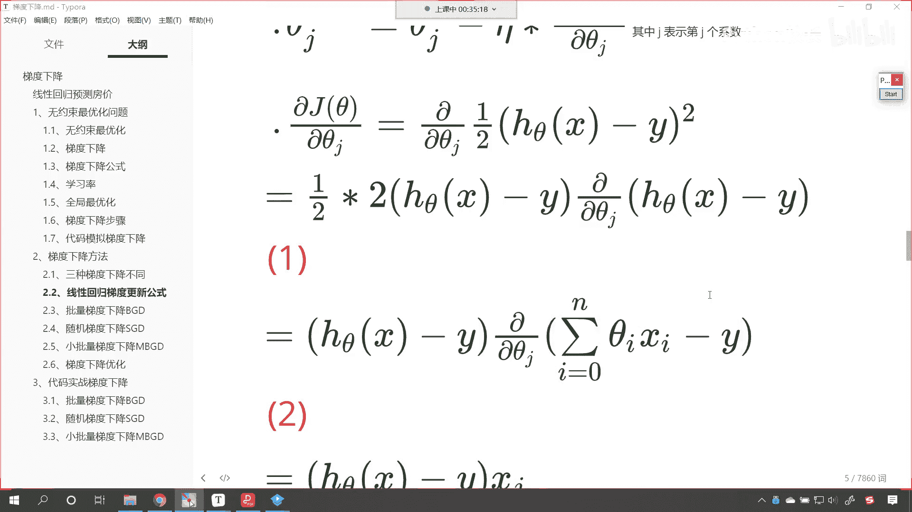

大家看啊，注意啊，什么是求偏导数呢，我们将这个词儿呢咱们给它写出来啊，嗯叫做偏导数，啥是偏导数，就是我们认为这个方程当中，theta g它呢是未知的数据，其他的都是已知的，如果要对它求偏导。

大家想既然其他的都是已已知的，那么其他的数据是不是就可以求导，是不是就是零呀，那这个地方咱们的y看这个地方，咱们的y它呢求完导之后也是零上了，所以经过求偏导。

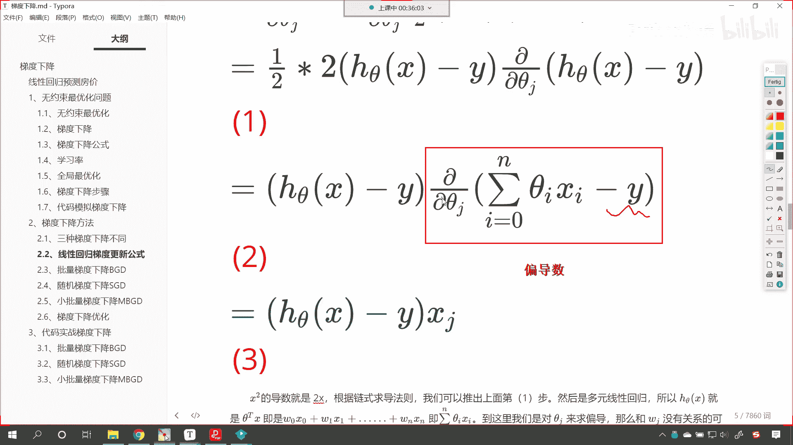

咱们求偏导和咱们导数呢是一样的啊。

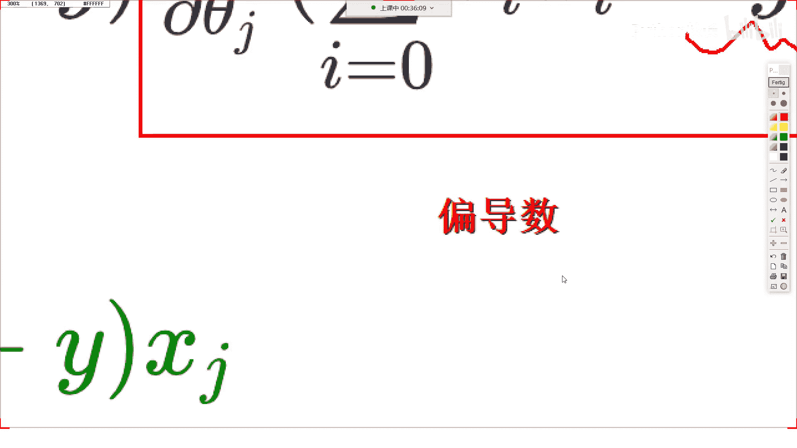

大家看啊，求偏导和咱们导数是一样的，明白吗啊，求偏导和咱们这个导数呢是一样的啊，来现在的话看我们把这个最终的结果，咱们进行一个说明，为什么最后求完之后，咱们得到的结果是xg上面咱们求偏导。

你能够发现咱们是不是求的，theta j这个系数的偏导数呀，对不对，好，我们求的是c a g这个未知变量的偏导数啊，求的是这个，变量的偏导数，那么你想其他的数据是不是都是零呀，对不对，其他的数据都是零。

咱们这个方程是不是就可以简化，是不是就可以变成这样了，你看到了吧，此时就有了具体的公式了，这个呢就是咱们具体的公式，这个公式呢就是咱们梯度下降的，就是咱们梯度下降的这个导数，看到了吧，有了具体的公式了。

那有了具体的公式，咱们是不是就可以根据梯度下降的更新，更新公式来进行操作了。

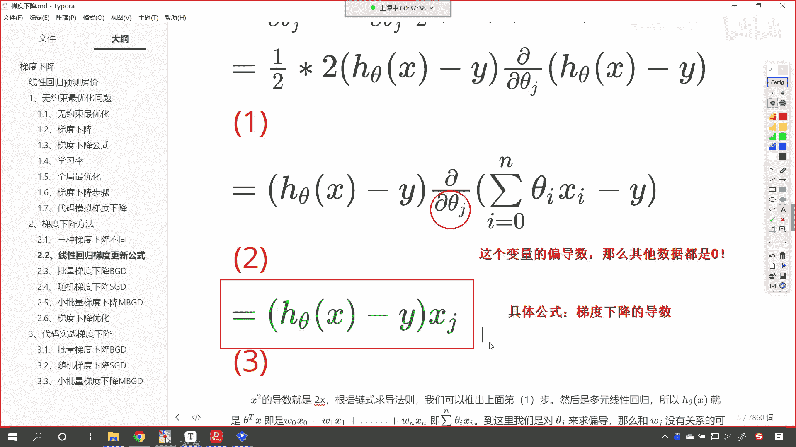

对不对，好，到此为止呢，哎咱们就进行了这个相应的介绍，你看x方的导数就是2x，咱们根据链式求导法则啊，根据啥是链式求导法则呀，就是一层一层往里面求导数，这就是链式求导法则，咱们多元，咱们多元线性方程。

hc，它就是c a t x其实就是w0 x0 w1 x11 ，直到w n x a即咱们的c塔a乘以x i，大家这个时候要注意一下啊，这个时候注意一下，你看我们在写这个方程的时候。

我们起的名字是不是叫做h c塔x呀，这个字母念theta，但是咱们在写方程的时候，你看我是不是又写成了w0 x0 w1 x一啊，记住啊，这只是符号的差异，明白这个只是符号的差异。

其实你想这个方程我们用什么样的符号写，不代表它呢，是不是你看我是不是也可以写成叫做c a一啊，叫做c a0 x0 ，是不是，然后加上西塔一，x一你看这个是不是一模一样的呀，对不对。

只不过我为什么要这样写呢，因为不同的书上大家注意啊，不同的书上它的公式呢不太一样，知道吗，很多书上用的都是这个c塔，所以我在表示的时候，我我也用西塔来进行表示了，但是为了能够让各位更加明白。

这个c塔表示什么，所以说我用c a和w唉，咱们进行了一个联合使用好，那么接下来咱们再来看啊，你看有了这个公式呢，我们可以得出结论，就是咱们的c a g对应的梯度与咱们的预测值。

y冒号和咱们的真实值y你看它是有关的，看到了吧，这里的这个戴帽子的y唉就是咱们的预测值，y呢是列向量及多个数据，因为我们的样本是多个，是不是啊，所以你看如果我们要把它展开来写。

那就是j0 j1 jj是吧，jj就表示对这个数据啊，你无论是哪个数据，你看是不是都是这样的一种写法呀，对不对，那我们总结一下，看到了吧，总结一下，那么咱们线性回归梯度的更新公式。

哎就是咱们这个那就是c a d n加一次，和咱们的这个第n次是什么关系呢，我们使用梯度下降来对它进行更新，那就是减去咱们的一塔，这个一塔就表示学习率，就表示咱们的不符乘以多少呢，h c塔x减y。

然后再乘以x g在咱们这个公式当中，我们既有n对不对，看到了咱们既有n，咱们也有这，那么这个g和n有什么关系呢，大家要注意我们在这个讨论区，咱们在这个写字的时候是吧，呃你的大写的j和小写的g是吧。

唉要分清一下啊，咱们这个地方的n，看这个地方的n表示呢我们是n元一次方程，看这个地方的n表示我们是n元一次方程，那这个地方是不是又有一个n，这个n呢和上面这个n也不一样，看到了吧。

就是这个n和咱们上面那个n它也是不同的，而这个n它就表示咱们梯度下降更新了多少次，看这个n就表示，嗯这个n它表示梯度下降，更新的次数，你比如说我梯度下降想更新多少次，是不是根据我的这个要求不同而不同呀。

对不对，那我可以更新100次，如果我想要计算出来的结果更加准确的话，我这个n是不是可以更新一次呀，对不对，那我就想练着玩，我更新10万次，100万次，这谁能管得住呢，是不是管不住呀，对不对。

所以说这个n呢是梯度下降的次数，咱们上面还有一个n，你看到了吧，这个方程当中的n嗯，这个方程当中的n它表示什么呢，表示呢咱们有n个，他表示咱们有n个特征，这个呢就是咱们的数据量，举一个例子，上一节课。

咱们天池工业蒸汽量，是不是就有38个特征呀，38个特征，如果我们要把方程写出来，你想一下咱们是不是就是x38 是吧，假如说我们从x一开始，那这个地方w0 x0 ，咱们可以认为这个是截距看吧。

w0 x0 你可以认为它是截距好，那么我们还有一个符号g是不是大家看啊，这个地方是不是还有一个符号g啊，那这个g表示什么呢，哎就是咱们d这个就是咱们的这个系数，看它表示d这个系数。

其实这个地方这个j和上面这个n，它俩是对应的，所以我们的符号呢这个表示稍微有点多，大家呢看懂的标志就是你把这个公式看懂了，是什么样的一个标志呢，你不会将这个符号当中的这个n和下面这个n。

你不会把它这个给混给混淆了，是不是啊，哎通过我的讲解，我也希望你不要混淆，那么希望你不要混淆啊，当然你看咱把这个n，你看我们把这个最后总结得到的这个更新公式，我把这个n写成t是不是也一样的呀。

你看咱们就把这个更新多少次呀，看把这个n就写成t是不是哎，把这个n写成t，是不是t是不是就表示次数呀一样的啊，我们说这个符号表示可能各不相同，但是他的意思无论中方西方都是一样的是吧，无论谁学习。

他理解到的这个本意都是一样的，咱们呢就是突破符号的这个限制是吧，我们领会到它的本意好。

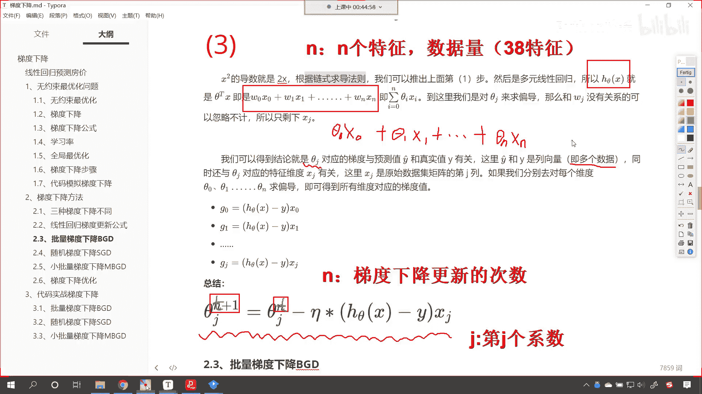