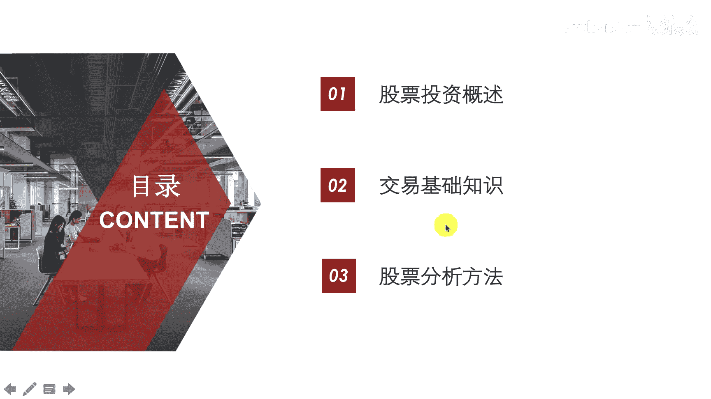
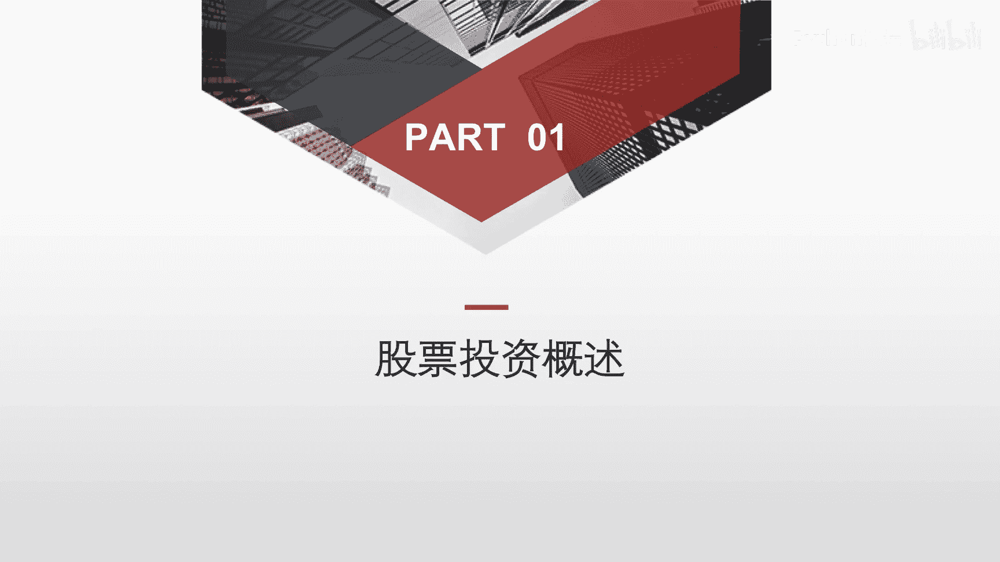
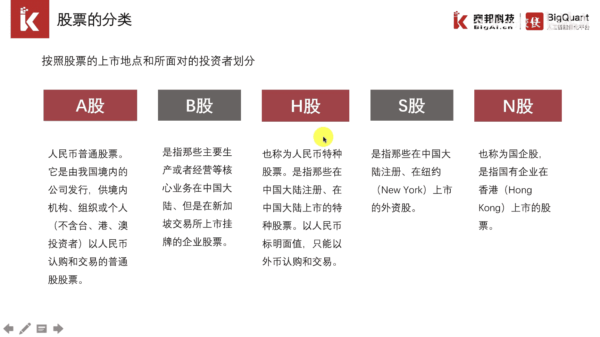
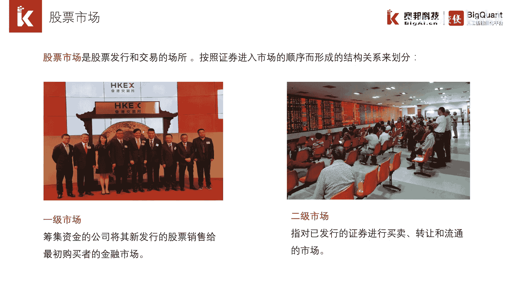
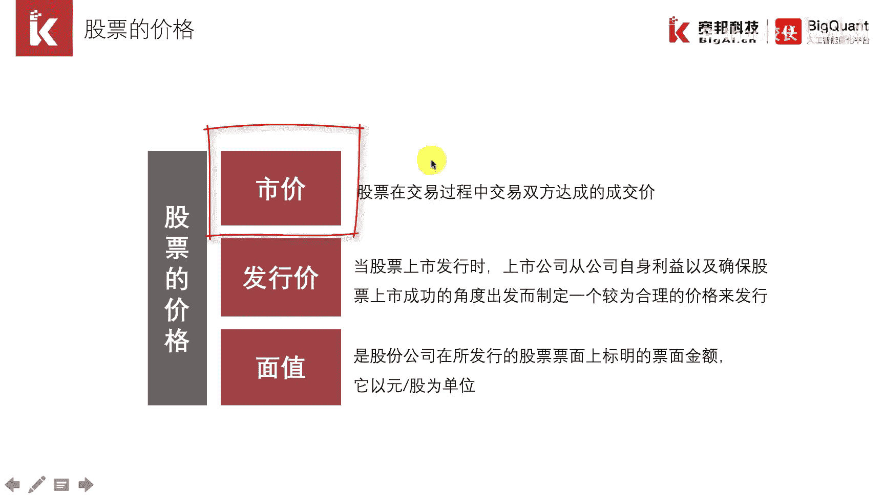
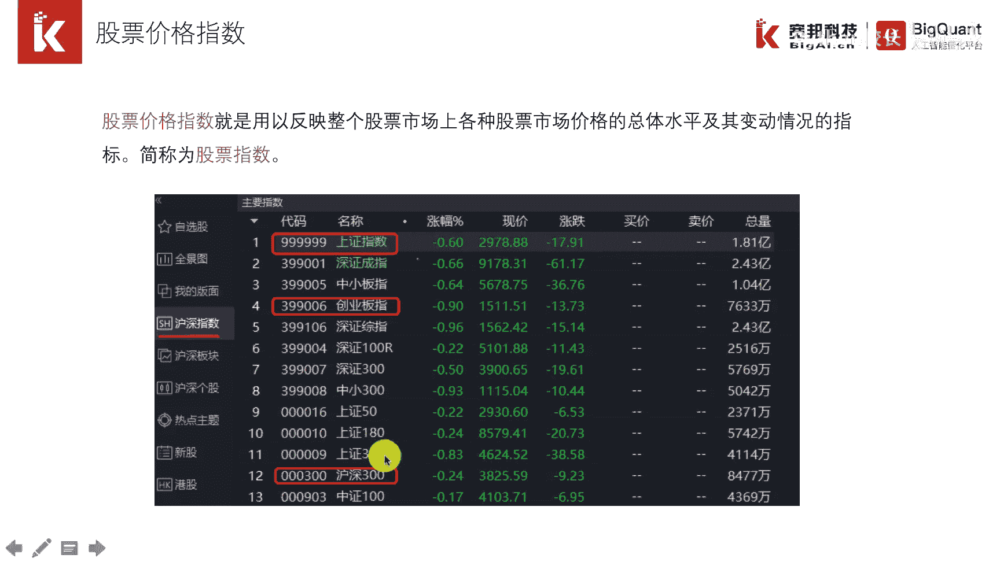

# P7：1.3.1股票投资概述 - 程序大本营 - BV1KL411z7WA

大家好，本次培训的主题是ai，量化是将ai技术应用在金融投资领域，因此需要了解一些金融基础知识，尤其是咱们的学员里面，很多大部分不是金融科班出身，那么更需要补充相关行业领域知识。

否则简单机械地将ai应用在金融市场，往往效果不佳，本章主要有三小节，第一节是股票投资的概述，第二节介绍交易相关的基础知识，最后一节介绍比较重要的股票投资分析方法。

这是我们的第一节股票投资概述。

股票是一种凭证，类似于咱们生活中的电影票，车票，演唱会门票，电影票有看电影的权利，车票有上车的权利，那么股票就会有取得股息和红利的权利，如果是明星的演唱会门票，那么甚至可以高价转手，股票也是如此。

可以在交易场所内进行交易，如果低买高卖的话，还可以赚取差价，最早的时候股票是纸质版的，现如今电子信息技术的发展，股票已经完全实现了无纸化，如果依据股票的上市地点和面临的投资者，来进行划分。

我们可以将股票分为a股，b股h股s股n股，这里的分类大家了解一下就可以，我们在后面的培训里面。

主要是针对a股股票的投资交易，股票市场是指股票发行和交易的场所，前者称为一级市场，后者称为二级市场，还是以刚才演唱会门票来举例，如果在开始放票的时候在官网购买，那么就是一级市场，如果开始没有抢到票。

后面在黄牛手里花高价钱买到的门票。

那么就是二级市场，我国a股的交易主要在两个市场，一南一北，分别是上海证券交易所和深圳证券交易所，两个交易所都是在90年代出产业，按照约定，上交所的股票代码是以600开头，以零开头或者以三开头的股票。

都是在深交所进行交易，其中三开头的股票代表的是创业板，每只股票都有自己的股票代码，都是六位数字，熟悉这类代码有助于我们对交易品种的理解，比如我们选股的时候想去除创业板的股票。

我们就可以直接把三开头的股票代码，直接过滤掉，股票有三个价格，其中我们最关心的是在交易所买卖的价格，如果低买高卖的话。

我们是可以实现盈利，最后我们介绍股票价格指数，我们通常在交易软件上可以看到上证指数，创业板指数，沪深300指数，那这样的价格指数是怎么计算出来的呢，其实是通过计算一个股票池，全部股票的加权平均价格。

这样就得到价格指数，价格指数，能够反映整个股票市场的一个变动情况，如果是上海a股，那么就是上证指数，如果是创业板，那么就是创业板指数，一般量化策略里都是拿沪深300作为对比，如果比沪深300跑得好。

那么可以算得上是一个不错的策略，因为在实际交易的过程中，我们可以做空沪深300股指期货。

