# P70：4-BGD更新公式 - 程序大本营 - BV1KL411z7WA

看到我们继续往下看。

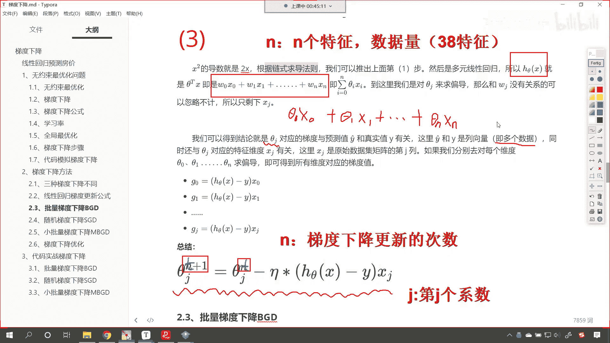

有了梯度下降的更新公式了，咱们接下来就看我们批量梯度下降。

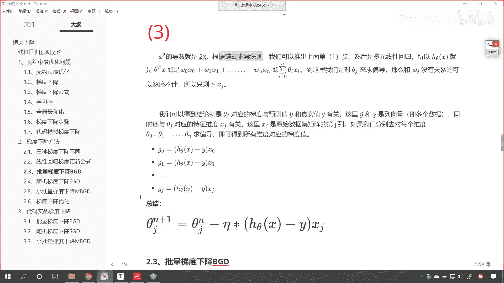

那我们说一共有三种，是不是，咱们先看批量梯度下降，那啥是批量梯度下降呢，这个最容易理解就是我们在每次迭代的时候，咱们使用所有的样本来进行梯度的更新，每次迭代咱们参数更新的公式就如下。

这个时候你看是不是套用咱们上面那个公式呀。

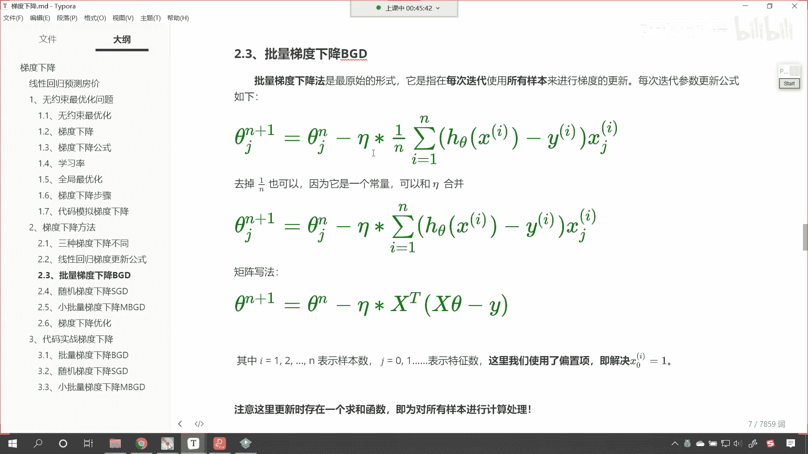

他说套用上面那个公式，一套呢就是咱们的看一塔呢，就是咱们的学习率乘以n减一，这为什么要乘以n减一呢，我们这个地方是所有样本，所有样本咱们进行了这个计算之后呢，咱们求了一下它的平均数。

所以说来了一个n减一，一塔也好，n减一也好，这个是不是都是常量呀，看到了吗，都是常量，既然都是常量，那为了这个公式方便简单，咱们呢就可以把这个n分之一合并到一塔当中，所以大家看咱们上面那个公式。

我们就把这两个数啊给它合并起来了啊，这两个数进行了合并，有时候这个数学呢比较难，难的原因呢是没有人带着你去看，数学家进行了相应的化简，但是他没有告诉你原因，所以说你越看越头疼，越看越头大是吧。

唉干脆就不看了，现在呢我带着你是吧，从每一步是怎么走的，咱们呢哎自己走一遍，我们知道每一步的操作到底是唉怎样的一个，过程好，所以这个时候各位就能够看到，你看我们既然是所有样本。

那咱们是不是就来了一个求和呀，看到了吧，a等于一，是不是一直到n，这个是不是就是一个累加和累加和，是不是就囊括了所有的样本呀，是不是，然后这个那它的公式呢，依然是hc塔x a减去y然后乘以x g i。

是不是啊，乘完之后呢，哎大家看啊，上面这个是咱们这个算数和的一个公式，来咱们把它描述一下啊，我们把上面这个叫做算数和是吧，哎也就是咱们从小就学习的算数和，那下面呢就是咱们矩阵的写法。

你看咱们使用矩阵的写法，这个时候咱们是不是使用了这个xt呀，看到了吗，xt咱们是不是表示进行转置呀，上面再进行写的时候，其实是一个样本乘以它的x g这个数据是吧。

一个样本乘以x这个数据乘以x g这个数据，那咱们如果要是统一的写法，那其实咱们就可以，把他们都表示成矩阵，那矩阵乘法，看矩阵乘法是什么样的一个这个公式呢，是不是就是一行乘以咱们的一列呀，对不对啊。

就是行乘一列，这样的话咱们就刚好可以实现，咱们上面的这个操作，看到了吧，那这个矩阵就表示上面这个算数和，那这个矩阵就表示上面的算数和，大家还能够发现一个地方不一样，上面咱们这个c塔。

我们是对于d这个看上面这个上面这个theta，我们是对于特定的一个系数，是不是进行了更新呀，下面这个是不是对于全部呀，对不对，因为theta它本来就是一个向量，就是一个矩阵，这个当中呢可以有多个。

然后这个当中可以有多个，比如咱们的c a一是吧，然后逗号ca 2是吧，然后逗号theta 3，它呢可以有多个是吧，一直都省略号点点点，是不是一直到sa一直到theta g是吧，它可以有多个，是不是。

那我们也可以使用矩阵的形式把它表示出来，因为无论你是哪一个c塔，是不是都是上面这个公式呀，那为了统一去写，咱们是不是就可以c塔n加一等于c塔n减去，一塔乘以x t x theta减yi呀。

所以说这个公式各位看到的这个绿色的公式诶，就是咱们矩阵的写法，我们使用矩阵写法往往就比较简单啊，在咱们具体的代码当中，咱们操作起来呢也是比较简单的。

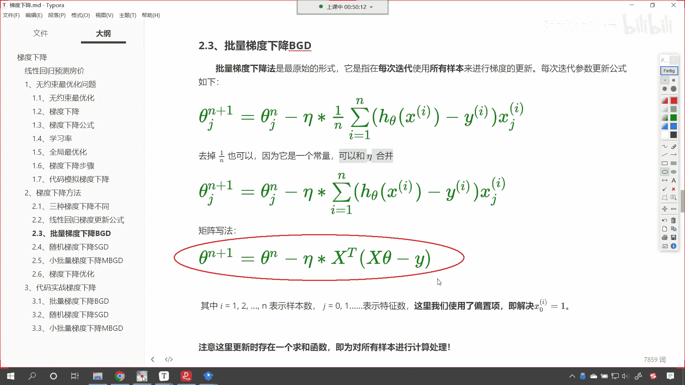

嗯好那么咱们继续向下看啊。

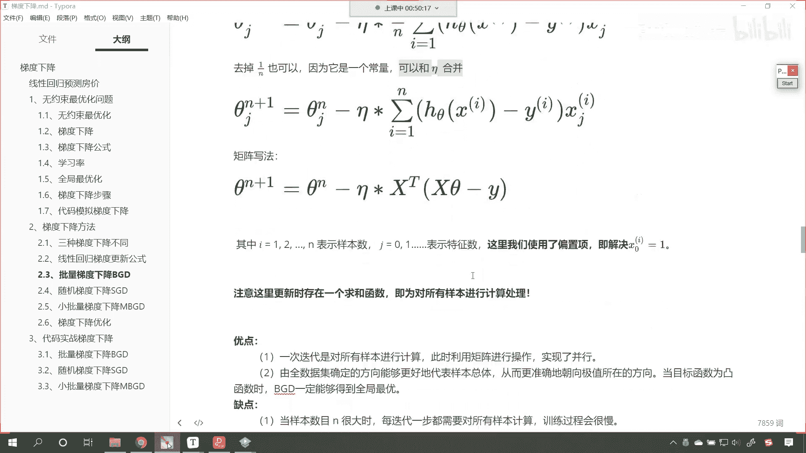

其中的这个i大家注意啊，i呢就是123n到n，它表示呢样本数参数当中的g0 ，一二表示咱们的特征数量。

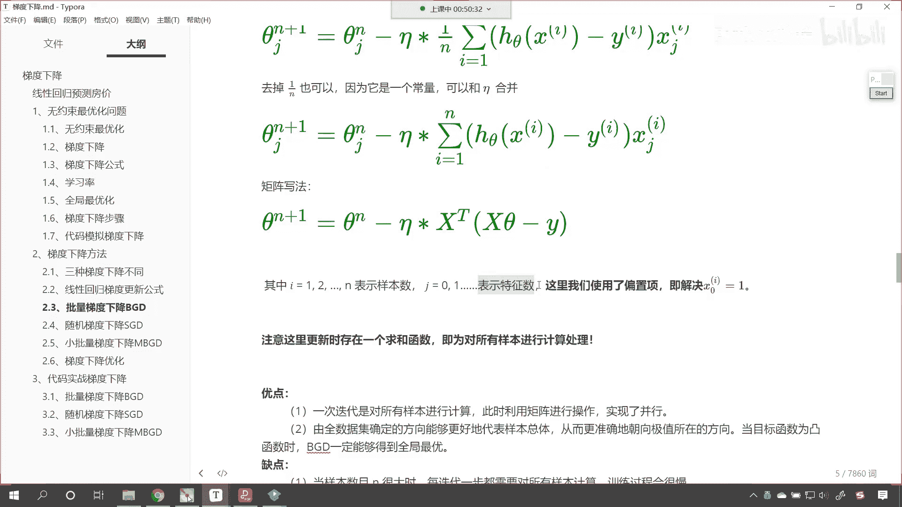

这里呢咱们使用了偏置项，我们让这个我们让这个x0 。

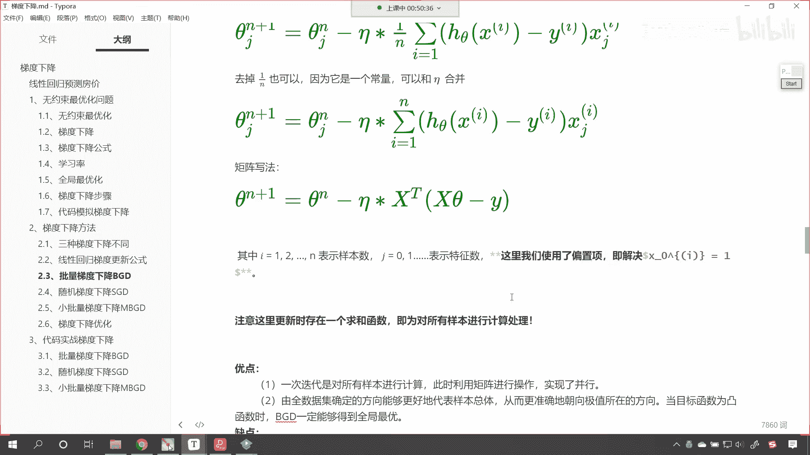

我们让它等于一，这什么是偏置项呢，就是我们认为看这个地方介绍到了一个偏置项，看啥是偏置项呢，那就是我们认为咱们的截距啊，咱们认为咱们的截距b，看它呢也相当于咱们的一个w，只不过呢它是w0 。

那如果把它当成w0 的话，其实是不是w0 乘以一呀，所以说我们给它增加了一个偏置项，这个时候所有的x都对应数字一，咱们之前的课程当中，咱们是不是介绍过呀，咱们在讲正规方程的时候，是不是啊。

大家回忆一下咱们之前的八元一次方程当中，唉我们就进行了这个偏置项。

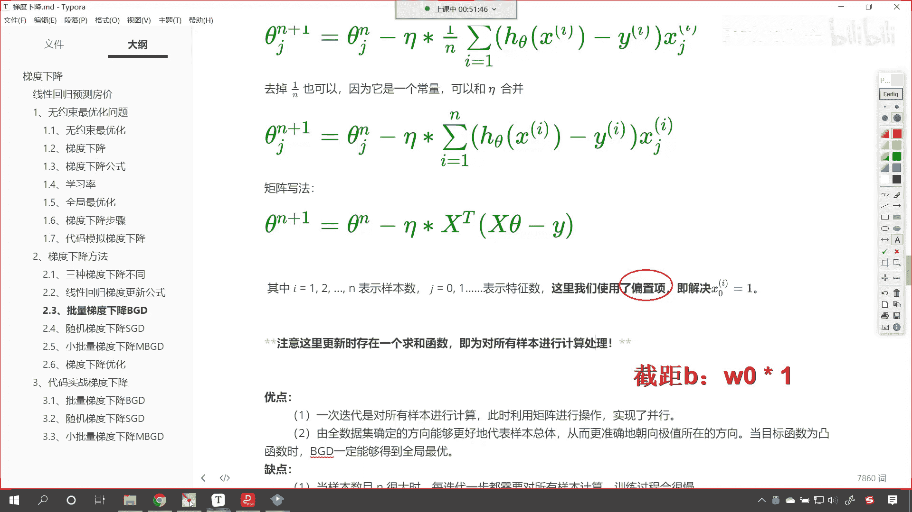

好那么咱们呢接下来继续往下看啊，既然这个公式都求解出来了。

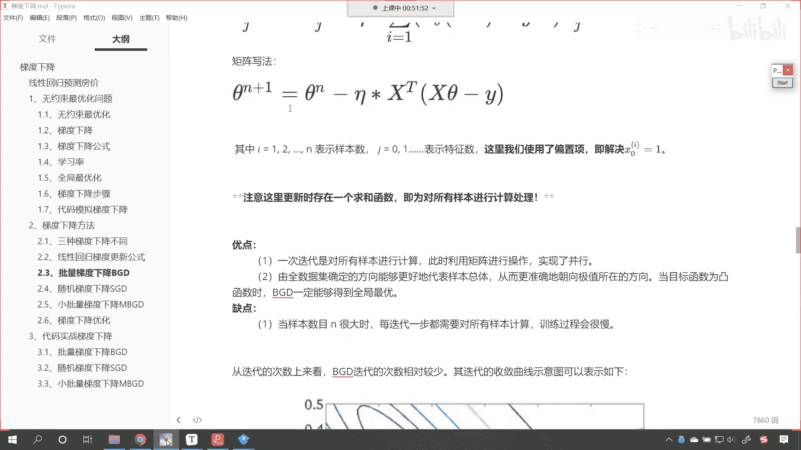

是不是，那我们看一下它的优点和缺点，那批量梯度下降呢，它是一次迭代，我们将所有的数据进行计算，此时呢咱们利用矩阵进行操作，实现了并行，就是所有的数据唉全操作进去了，那么由于咱们的全数据集确定了方向。

能够更好地代表总体数据，就是你所有的数据是吧，哎一定是一个求解出来的数据，一定是一个最准确的方向，从而呢咱们更准确的朝向极值所在的方向，进行梯度下降，当目标函数为凸函数时。

咱们的bgd一定能够得到全局最优。

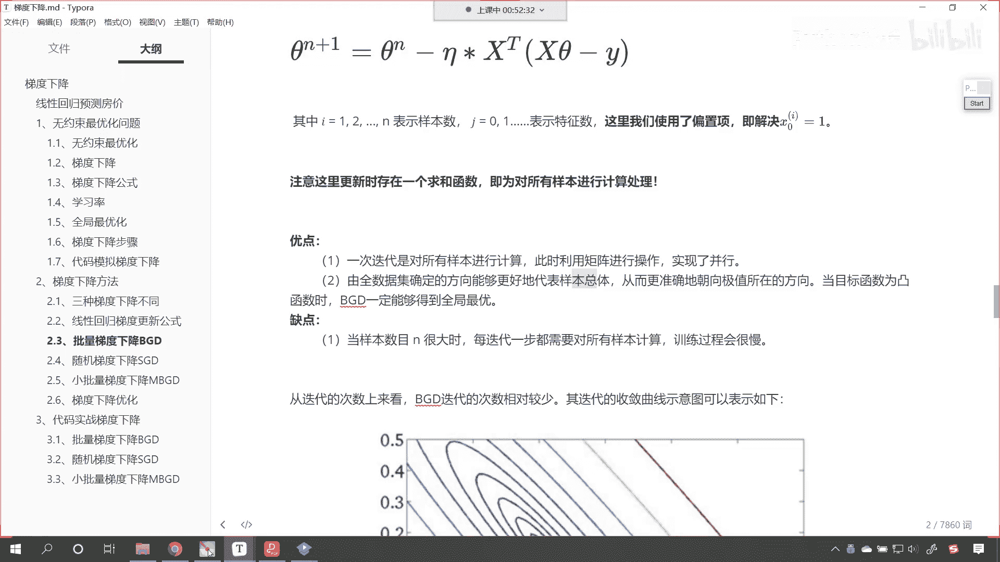

看到了吧，想要得到全局最优，他呢是有限定条件，就是咱们的目标函数为凸函数，到目标函数为凸函数，那现实问题当中，你的目标函数一定是凸函数吗，来咱们画一个凸函数，我们说什么是凸函数呀，是不是就是这样的呀。

对不对，如果数据是这样的，那么咱们使用b g d一定可以得到正确答案，但是很多情况下是吧，你看咱们的数据是吧，可能是这样的，对不对，可能是这样的，唉所以说呢这个对于非凸函数bgd呢。

它就不一定能够得到最优解了，好那么缺点呢当咱们的样本n很大的时候，每次迭代一步都得需要，对于所有的样本进行计算，那这个训练过程呢就会比较慢啊，所以说这是他的一个限制，这不就是咱们正规方程的限制吗。

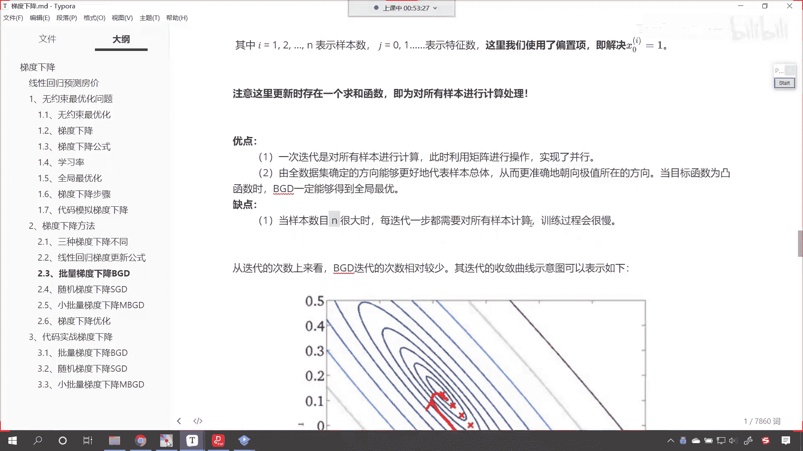

对不对啊，这就是正规方程的建设嗯，限制从叠代次数上来看。

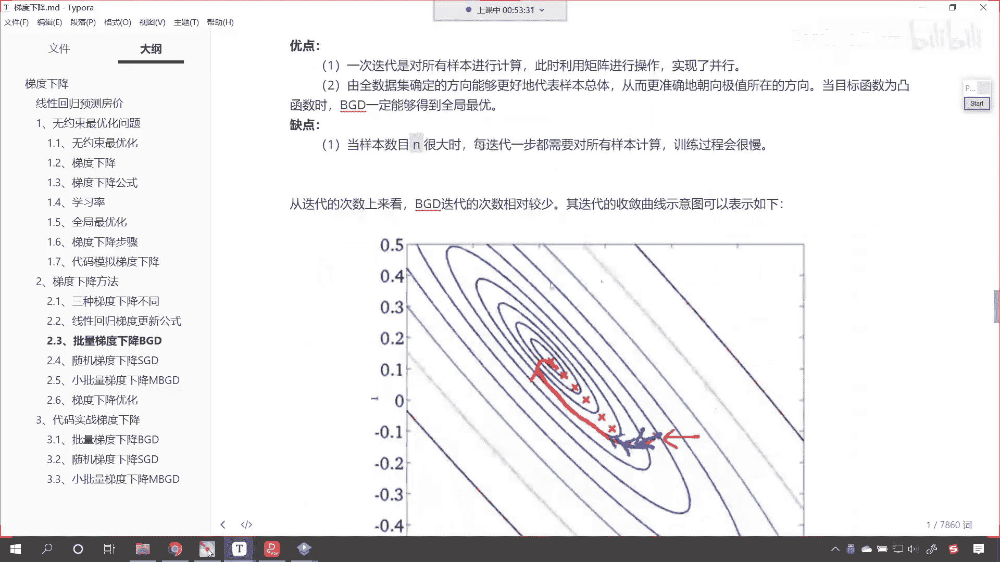

b g d迭代的次数相对较少啊，b g d迭代的次数相对较少，其迭代的收敛曲线示意图可如下所示，为什么它迭代的次数较少呢，因为呢它使用了全部数据来进行梯度的计算，嗯这个时候呢如果这个数据要是比较优秀。

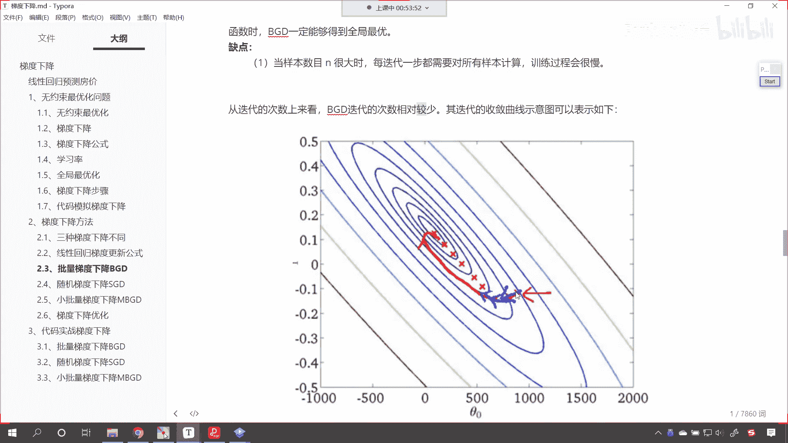

这个数据比较干净，那么咱们迭代的次数是吧，咱们循环不了多少次，咱们就可以找到最优解了，哎这就相当于下山一样，是不是嗯，如果这个山是吧，他这个这个山比较比较规整是吧，那我们通过b g d这种方式。

咱们次数次数比较少的，咱们就可以找到最优解。

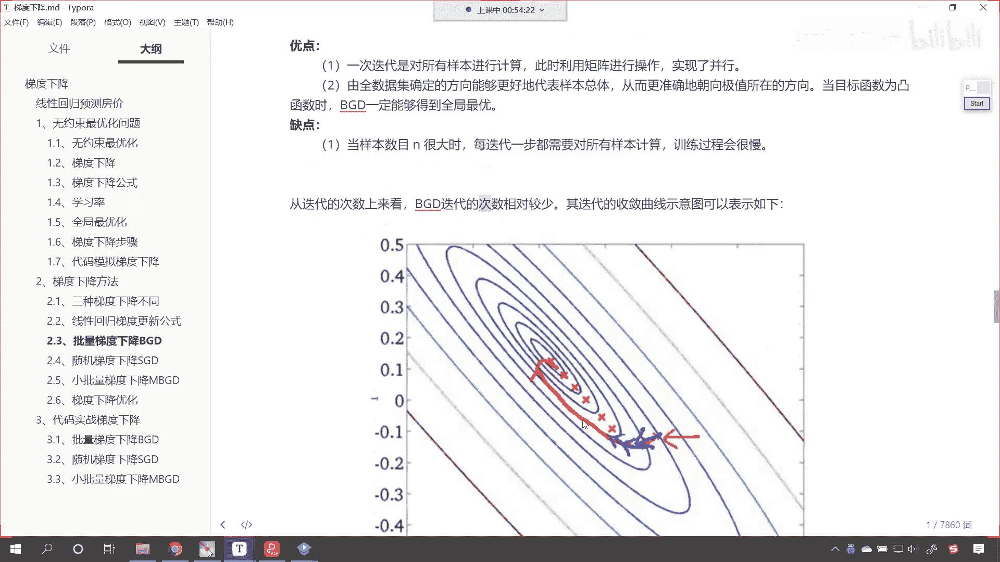

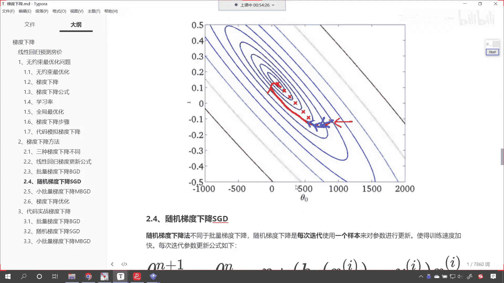