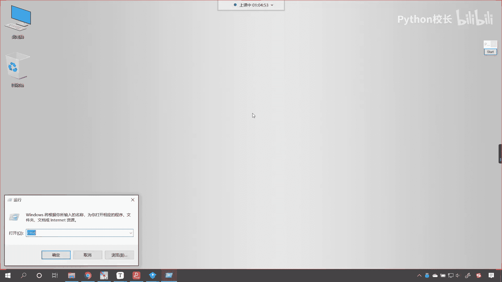
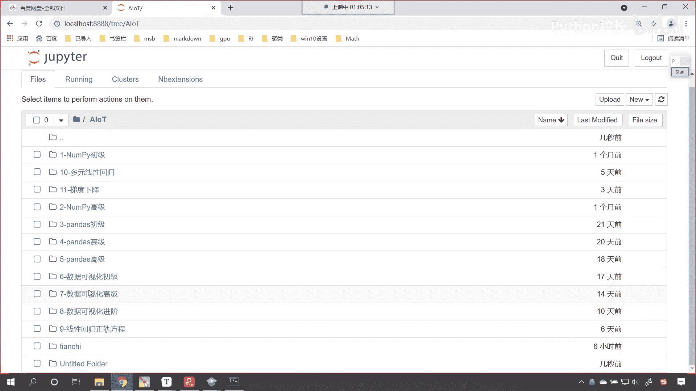
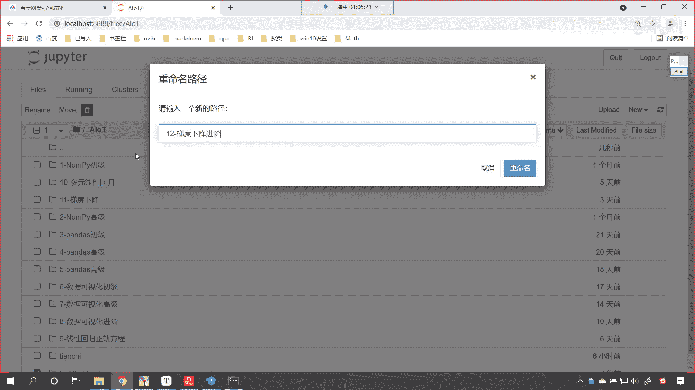
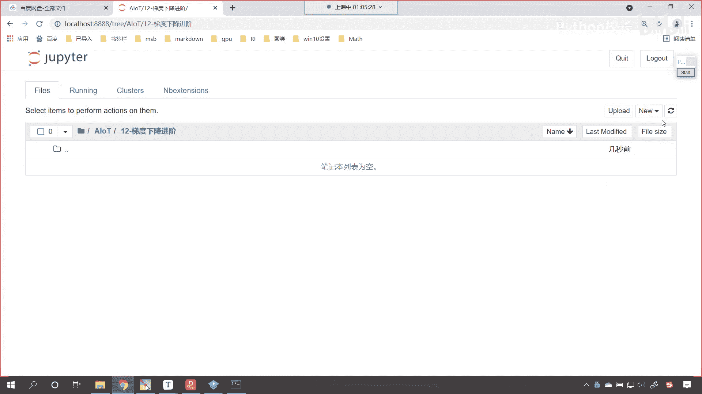
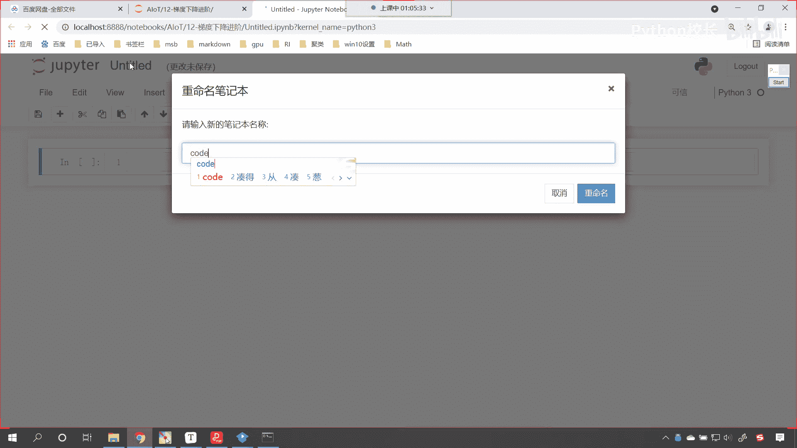

# P72：6-BGD批量梯度下降代码演示 - 程序大本营 - BV1KL411z7WA

来呢我们继续往下看好，那么咱们接下来呢这个梯度下降的优化，咱们呢先跳过，咱们呢先看一下代码实战好不好好，那么现在的话咱们就把这个页面啊给它关闭掉，此时呢我就带着各位手把手的咱们将梯度下降。

我们来完成一下，好现在的话咱们就进入咱们的代码当中，我们呢就创建一个新的folder。

选中这个folder，咱们对它进行改名，叫做12杠，这个呢就是咱们梯度下降，哎这个是咱们的进阶进入到这个文件当中。

此时呢咱们就创建一个代码。

给它呢改个名，就叫做code。

那此时呢咱们就导一下包啊，咱们就import numpy as np，我们在上面插入一行来一个三级标题，这个呢叫做bgd，把中文也给他写上，这个就叫做批量，梯度下降好，那么我们导完包了之后。

咱们现在呢就给他一个数据好不好，那在批量梯度下降这儿呢，我们给他来一个四级标题，咱们首先给一个简单的叫做一元一次线性回归，这个时候呢咱们去创建数据，x呢就等于np点，咱们创建一个数据。

那我们给它一个随机数啊，np。random，咱们现在呢调用一个run的方法，看我们给一个100逗号，一，咱们之前讲np的时候，我们是不是介绍过随机数，随机数在咱们进行算法原理讲解的时候。

它起到了非常重要的作用，因为呢这个数据全是随机的，你看这个x有了x有了之后，咱们现在呢我们把方程的系数，咱们给他声明出来啊，这个这个时候呢就是w b，那咱们来一个np一点random。

咱们来一个rint，我们从一到十，我们给一个size，让它是二，你看这个时候咱们是不是就声明了wb了，那你想有了w和b了，咱们现在是不是就可以把目标之外，给他计算一下了。

其实咱们的数据x就是在w和b的计算之下，是不是就得到了一个y值来，咱们现在的话就进行一个计算啊，那这个时候呢哎咱们就w乘以咱们的x，然后加上咱们的b b是不是就是表示截距呀，然后来一个np。

random，咱们来一个run，这个run是不是表示正态分布呀，为什么这个地方我要加一个run呢，那这个run呢就是哎咱们给它增加噪声啊，我们给它增加一点噪声，那这让它呢更像咱们的真实数据。

如果要不加这个噪声，你想这个是不是就是一个完美数据啊，你看现在咱们的数据x和y是不是就有了呀，看这个时候呢，咱们可以画一个图画出来，让大家看一下它长长什么样啊，import matt plot lib。

咱们来一个pilot as plt执行一下，那既然有了x有了y，咱们就plt点看，咱们就调用scanner s c a t e r，咱们将x放进去，将y放进去，这个时候你看我一一直行。

唉大家现在就能够看到呃，咱们这个数据此时是不是就给报错了呀，我们看一下为什么报错了啊，这个地方报了一个value error，也就是说我们给的值给错了啊，那咱们给的值给错了是吧。

哎这就说明咱们的这个数据形状不同，那数据形状长什么样呢，咱们display一下啊，x。shy。ship，我们查看一下，唉现在咱们就能够发现，你看这个是不是100和一，这个是不是100和100呀。

那为什么这个y就变成了100和100呢，好我明白了，因为咱们在进行np。random run的时候，这个地方呢咱们少写一个形状，之前咱们是不是讲过这个囊匹数组，它是不是有广播机制呀，对不对。

你看现在我把它调整成一，这个时候再来执行，大家现在就能够看到这个数据是不是就可以了，我们刚才之所以报错，是因为咱们np n u m p y它的广播机制，广播机制。

就相当于将咱们这个100复制成了100份，复制成了100份，所以说求解出来的数据就变成了100 100，现在呢我们把它调整过来，还调整成100和一，这个时候就可以了哈，好那你想你看到这个数据之后。

你就能知道他们之间一定存在一个规律，是不是这个规律是不是就是这样的呀，那我们现在呢咱们就使用bgd把这个规律呢，我们是不是可以给他求解出来啊，对不对，使用批量梯度下降之前，咱们在进行求解的时候。

咱们用到的是不是线性回归呀，或者说我们使用正规方程是不是可以求解出来，这回呢咱们再换再换另一种方式，那就是梯度下降好，那么现在的话，咱们对于这个数据x进行一个操作，咱们在上面进行介绍的时候。

我们说这里咱们是不是使用了偏置项呀，对不对，你看这啥是偏置项，偏置项是不是就是咱们这个b呀，所以咱们要对x进行数据的修改和操作好，那么咱们将b作为咱们的偏置项嗯，作为咱们的偏执作为偏置项来进行操作。

那这个偏置项呢就相当于截距，那这个截距它对应的啊，它对应的系数我们可以理解为是一，所以咱们的x你看，所以咱们的数据呢就可以进行这样的操作，叫conquinnate，中括号将x放进去。

np一点负小括号给一个sheep，那这个sheep呢就等于100逗号一，然后我们给它一个值few value呢，它是一进行吉连的时候，让这个轴等于一，这个时候各位小伙伴就能够看到。

你看这个数据x最后一列，是不是就全变成一了呀，这个一就相当于它的偏执转换之后呢，我们使用x来接收一下，大家注意啊，咱们此时这个x呢我只执行一次，你要再执行一次，它会又会向x后面进行集连。

所以那刚才因为我们没，刚才我没有使用x来接收嗯，它打印输出了是吧，现在我用它接收一下，这个时候呢就只能执行一次了啊，唉执行一次，大家看后面这一列，是不是就是表示咱们的截距呀。

好那么此时咱们的数据x和y就有了，那咱们就使用批量梯度下降，我们呢来进行操作好不好，那这个时候呢有一个问题，就是咱们要循环多少次呢是吧，咱们给他来一个1万次这个epochase呢，哎就是咱们循环的。

那就是我们循环的次数好，那么然后呢我们给一个一塔好不好，一塔是不是就是咱们的学习率呀，咱们给一个0。01吧，在这儿呢我们进行一个说明啊，啊这个就是咱们的学习率，看一塔就是学习率好，那么有了这个之后呢。

然后呢咱们再给一个c a t h e t a，这啥是c塔呢，theta是不是就是咱们要求解的，啊这个就是我们要要求解的系数，那这个要求解的系数，咱们一开始是不是使用随机数据给它生成呀。

那这个时候是不是就是np。random啊，咱们就调用run这个方法，那我们有几个系数呀，咱们是不是二一呀，你知道我为什么要把它变成二合一吗，看到了吗，咱们打印输出一下，给大家看一下啊，sa你看我执行呃。

咱们是不是多一个等号呀，epochase，把一个等号去掉，这个时候再来执行，哎，大家现在就能够看到这个是不是咱们的结果呀，看到了吧，你看这个c塔我们来了一个二合一，之所以要这样写。

是因为呢咱们后面要进行矩阵运算，矩阵运算的时候，它呢是对于形状有一定要求的，所以说呢哎我们给了他两行一列，你想咱们公式在进行书写的时候，看咱们的公式在进行书写的时候是不是xt呀，看到了吧。

这个地方有相应的一个转置，对不对，你看叫xt是不是，所以说呢咱们的c a就是咱们要求解的系数，那一开始的时候，咱们是不是使用随机数给它赋值的，对不对，这个也就是这个随机赋值，哎我们用一个。

这个不就相当于咱们之前所说的瞎蒙吗，虽然这个数值是瞎蒙的，但是呢咱们在进行梯度下降的时候，大家想这个数据是不是就会一点一点发生，一个改变呀。

来这个时候呢咱们for i in for i in range，咱们将以porches放进去，这时候你想是不是就是一个梯度下降了呀，对不对，那就是一个梯度下降，那有了这个梯度下降之后。

咱们现在呢就根据公式来计算，咱们的梯度g就等于x。t小括号，你看x。t然后呢点dot，dot谁x。dot小括号，theta t h e t a，然后减去谁呢，减去y那为什么是这样的一个公式呢。

来回到咱们这个地方，你看是不是就是这样的一个公式呀，看到了吧，你看啊，矩阵的写法是不是c a n加一等于c a n，减去一塔乘以x t x theta减y啊，把这个markdown的数学公式。

写到咱们具体的代码当中好，那么我们就在它的上面插入一行，来一个markdown，在这粘贴一下，这个时候你看我一执行，大家看就是这个公式，你能够看到我在进行计算的时候，我是一步一步进行计算的。

咱们这个地方的xt x theta减y，是不是就是对应这个数据呀，看到了吧，这个呢它就是咱们的梯度，我们之前说咱们的这个算法呢叫梯度下降，对不对，你看叫梯度啊，叫梯度下降，那梯度下降是怎么进行下降的呀。

哎第一步咱们是不是就是求它的导数呀，你这个导数不就是梯度嘛，对不对，然后第二步怎么办，是不是减等减等咱们的一塔乘以这个梯度呀，我们就把梯度表示成g啊，你看这个时候就就有一个g了，好那么梯度求解出来了。

咱们接下来是不是就可以更新了呀，对不对，那我们的theta就等于多少呢，咱们的theta呢就等于theta减去，我们的学习力是多少，是不是就是一塔，我们让一塔乘以唉，咱们的咱们就让一塔乘以咱们的g。

你看因为这个g呢就是咱们根据公式啊，这个g呢就是根据公式咱们计算的梯度，对不对，这个就是根据公式计算的梯度，你看我们现在举的例子，是不是随是不是批量梯度下降，看看咱们现在举的例子呢。

它呢属于是批量梯度下降，你想x是不是一个矩阵呀，那这个矩阵它是不是包含所有的数据呀，对不对，没问题吧，好那么最后呢当这个for循环结束，咱们呢就打印输出一下，你看print嗯。

咱们呢就首先将咱们上面的wb打印输出一下，这叫真实的斜率截距式，冒号不就是咱们上面随机生成的w和b吗，上面的wb是随机生成的，我刚才没有打印，我也不知道他是多少，咱们希望使用批量梯度下降。

是不是把它算出来啊，对不对，那所以我们把真实的打印输出一下，然后咱们再来一个print单引号，那这个呢就是使用bgd，咱们求解的斜率截距式，是不是就是咱们sea呀，你看是不是就是咱们的theta来。

此时咱们执行一下这个代码啊，你看我一运行各位小伙伴，结果就输出了咱们真实的斜率和截距，是不是八和五呀，咱们使用bgd求解的斜率是7。4和5。3，你看和真实答案是不是就比较接近了呀。

那为什么它们之间有一定的差距呢，看我告诉你为什么之间有一定有一定的差距啊，因为咱们随机创建这个数据的时候，我们是不是给它增加了噪声呀，这个增加噪声它也有专业的术语，叫什么叫加盐，看到了吗，叫加盐。

你知道盐是不是可以作为这个这个护肤品呀，对不对呀，就是在这个敷面膜的时候是吧，有的时候你往脸上加点盐，是不是这个效果会更好一些，那加了盐之后呢，这个就不平了，这个数据就不平了，加了盐之后呢。

这个数据就有上下波动了，所以说我们可以把它叫做增加噪声，也可以把它叫做加盐，加完盐之后呢，嗯这个就是唉你要注意啊，这个加盐它不是单纯的buyers，我们讨论区有一个小伙伴提了一个词叫buyers。

不知道咱们其他小伙伴是否理解什么是buyers，来，我们现在呢这个直播间的各位小伙伴，不理解buyers，你回复零理解buyers是什么，你回复个一好，我们现在呢有小伙伴不理解是吧。

你看这个buyers呢，我给你翻译一下啊，他的这个英语呢它就有偏差的意思，知道吗，这啥是偏差呀，偏差就是截距，知道吗，偏差就是截距方程，咱们画出来，如果一个方程画出来，它经过咱们坐标轴的这个中心点。

那你想它的截距是不是零，那这个截距是不是可以向上移动，也可以向下移动呀，对不对，哎你看这就是截距，所以这就是英文当中的它的一个英语单词，你只要把它翻译出来，那么这个意思你也就能知道了。

那你想咱们的这个算法当中，你比如说咱们线性回归linear regression，r e g r e s s i o n，你看linear regression当中。

它的截距是不是叫做intercept呀，对不对，你看它的截距，我们如果想要获取，是不是就是就叫intercept呀，这个intercept其实和咱们的buyers是一个意思啊，他俩是一个意思。

都表示什么呀，方程的，都表示方程的截距，那咱们刚才有一个小伙伴就说了，说这个是不是就是我们加盐操作，是不是相当于加了一个八，加了一个buyers呀，它和加buyers还不一样。

buyers是一个固定的值，你知道吧，对于方程而言，你加一个偏差，其实是加一个固定的值，而对于我们这个加盐，你会发现咱们np的random rann，这个是不是随机数呀，随机数也就意味着这100个。

每一个和每一个都不一样是吧，我们可以把它理解成是100个buyers，也就是说你加了这个buyers之后，你看你的数据就怎么了，是不是就有上下波动了，我给你演示一下啊，如果要是没有这个bios会怎么样。

咱们就把这个删掉啊，你看啊，各位小伙伴，你看代码删掉了，此时我画出来的图，你看一下，看到了吧，此时咱们画出来的图是不是就是一条直线呀，那你想这条直线如果我们解方程要解出来的话。

咱们的斜率和截距是不是它是固定的呀，对不对，你看你这条数据是吧，这个数据直来直去的，是不是啊，它是一条固定的，你看它是一条固定的，那这个时候呢我进行操作，你看我一执行嗯。

现在的话咱们将代码都重新执行一遍啊，来咱们有一个sl，我们run 2哎，现在你就能够看到，你看如果我使用批量梯度下降，我的数据长这个样，是不是特别的规范呀，咱们使用梯度下降，批量梯度下降求解出来的结果。

你看是不是和真实的斜率和截距，是不是就一模一样呀，是不是哎咱们在这个讨论区里边，又有一个小伙伴说了，又又有小伙伴，还是刚才那个小伙伴是想加variance吗，这个我rise呢它是这个方差的意思啊。

我rise它是方差的意思，那这个和加这个方差也也不一样，我们就把这个叫什么呢，咱们就把它叫做噪声看啊，或者说我们把它叫做这个加盐，其实是不是，就是为这个数据增加了一定的扰动呀，对不对。

其实就是增加了扰动啊，就是增加了扰动，好那么我们再把这个扰动咱们再给它加上啊，那这个时候就是加上np。random，咱们来一个run形状要对应，那就是100和一，这个时候呢咱们执行大家看这个数据。

此时是不是就成了这样了呀，加了这个扰动之后呢，这个数据呢就更加的真实，哎大家看看这个数据更加真实，因为我们真实世界当中获取的数据，它不是那么完美的，是不是哎你看那对于这个数据而言。

咱们也可以计算出来它的斜率和截距，那我们依然使用这个方法，你看这个时候我一执行唉，各位小伙伴你就能够看到是吧，咱们真实的斜率和截距是二合一，我们使用b g d求解出来的，是不是1。78和1。一点呀。

是不是哎对了，增加扰动，咱们是为了这个加强咱们的真实感，好，那大家现在就能够看到咱们的学习率，你看我们的学习率，咱们是不是固定的呀，看到了吧，学习率我们把它固定死了，固定死就是0。01，对不对。

你看固定死就是0。01，其实咱们梯度下降，你看其实咱们的梯度下降呢，它有这样的一个这个特点，看咱们梯度下降，在梯度下降的过程当中，你看一开始的时候，这个步子是不是迈得大呀。

你看你越接近咱们这个最优质的时候，这个时候这个步子是不是迈得越来越小呀，如果说我们想要更精确地找到它的最小值，那么我们在这个地方是不是应该，步子应该迈得更小一些，如果说你的步子还是这么大。

你想你是不是有可能迈过去呀，对不对，你看所以说越到这个微小的地方呢，咱们越应该谨慎，所以说咱们这个learning rate是吧，可以调，那无论我们调整成0。1还是0。01，还是0。001。

其实它都是固定的，现在呢咱们再为各位介绍一种方法，那这种方法呢看这种方法，它就是这个有一定的变化，你看咱们定义一个函数来调整学习率，这个叫什么呢，叫逆时衰减，也就是说随着咱们训练次数的增加啊。

随着训练次数的增加，咱们这个学习率是怎么样的呀，一点儿一点儿变小，因为越到因为越到这个呃这个最优解的时候，咱们这个时候呢就越应该这个变化小一点，所以说呢越到收敛的时候，咱们的学习率就越应该小好。

那么咱们现在呢就回到我们的代码当中啊，来咱们呢来一个操作好不好，来此时呢回到咱们的代码当中，咱们给学习率定义一个方法叫d e f learning rate，盖chedule。

那chedule当中我们就给一个参数叫t吧，咱们呢进行一个return，那就是t0 除以小括号t0 ，唉咱们让它加上一个t1 ，我们让这个t加上t一好，那么我们的t01 开始是多少呢。

咱们可以让这个t0 是数字五，那我们这个t一等于多少呀，哎咱们可以让它是1000，这个时候你想，那我们这个学习率，是不是跟着咱们的学习次数有关呀，看井号，咱们这个t呢就是咱们梯度下降的次数。

看这个t就是咱们梯度下降的次数，你想这个公式它叫什么呢，叫做逆时衰减啊，它叫做逆时衰减，啥意思呀，也就是随着咱们梯度下降的次数增加，那么我们的学习率，你看咱们的学习率呢应该变小，我就给你举一个例子啊。

比如说你这次考试满分150分，你考了20分，如果你要努力学习是吧，拼命学习下一次考试，你是不是可以一次增长100分啊，是不是你可以一次增长，这个100分就变成120分了，假如说这次考试你考了149分。

下一次考试无论你怎么努力，你想无论你怎么努力，嗯就是你付出的努力，即使比刚才考20分那个一样，你是不是最多也只能增长一分啊，对不对啊，因为这个时候呢他离那个嗯最高分已经很近了，这个时候呢你想要增加。

那你就得调整这个学习策略了，是不是你就得从这个微观上去改变自己，比如说改变自己答题的习惯，比如说改变自己答题的思维方式是吧，然后给自己胜出更多的时间，你才能够进行一个提升，咱们这个梯度下降也一样。

你看这个梯度下降，它的整体的一个这个规律，就是一开始的时候，下降的幅度是不是特别明显啊，看了因为你这个地方你这个斜率大呀是吧，一次下降这么多，随着你越来越接近咱们的最优值，你要注意啊。

随着越来越接近最优值，你想有没有可能跨过最优值呀，有没有可能跨过最优值，你看咱们昨天在讲解的时候，你看大家看啊，我们就以这个为例看了，咱们就以这个为例，我们也不知道咱们所给的这个一塔，到底是大还小。

对不对，咱们是不能确定的，即使我给的是0。1，你能确定你给的这个一塔就是就是大吗是吧，你能给你能确定你给的一塔就是合适吗，小吗，不能确定，所以咱们为了确保他万无一失，就是你的这个一塔。

咱们的学习率一点一点向咱们的最优值靠近，你在靠近的过程当中，我将你的一塔给你一点一点变小，看到了加你一点一点变小，这个时候我就可以防止防止怎么样呀，防止这种情况的发生，就是一定不会出现这种情况。

就是我们把这个一塔变小，咱们呢就能够保证咱们的算法一定收敛，什么是收敛呢，它是一个专业的这个术语，高数当中专业的术语，这个意思就是就是求解出了最优解，哎也就是说到某一个点它给停了是吧，哎收敛一下好。

那么所以说呢咱们代码当中，你看我们就定义了这样的一个公式，那这个公式一开始的时候这个t呢是零，所以你看一开始的时候，我们嗯这个学习率l r它是多少呀，是不是就是五除以，是不是就是5÷1000呀。

你求解一下，是不是就是零点，你看是不是就是0。05呀，对不对，一开始我们定定的这个学习率是0。05，对不对，好那么定义了这个方法，咱们呢就在for循环当中使用一下好不好，那你看这个时候我该怎么使用呢。

咱们在for循环外面，我们就定义一个学习次数叫curren，我们对它进行一个说明啊，这个就是咱们梯度下降的，按次数这样吧，我们为了和上面统一，咱们就把它定义成t好不好，一开始的时候没有训练，是不是零次。

只要咱们训练一次，那咱们的t就怎么样呀，加等一看训练一次他就加等一，那只要训练一次，咱们就计算一下他的学习率，那一套呢就等于learning rate，小括号，咱们将t放进去。

你看这个时候是不是每次都去计算呀，那它的规律呢就是随着那随着咱们梯度下降，次数增加，随着梯度下降，次数增加，那么我们的这个学习率呢，哎它就越来越下降，这个时候咱们再执行一次啊，唉现在你就能够发现。

你看结果是不是也依然求解出来了，看到了吧，结果也依然求解出来了，这个时候就可以规避那个风险，知道吗，此时就可以规避咱们不收敛的这个风险，所以说这个就相当于是一个优化好，那么到此为止。

呃咱们呢就使用bgd批量梯度下降，咱们完成了一元一次。

