# P73：7-BGD批量梯度下降求解多元一次方程 - 程序大本营 - BV1KL411z7WA

一次呢好。

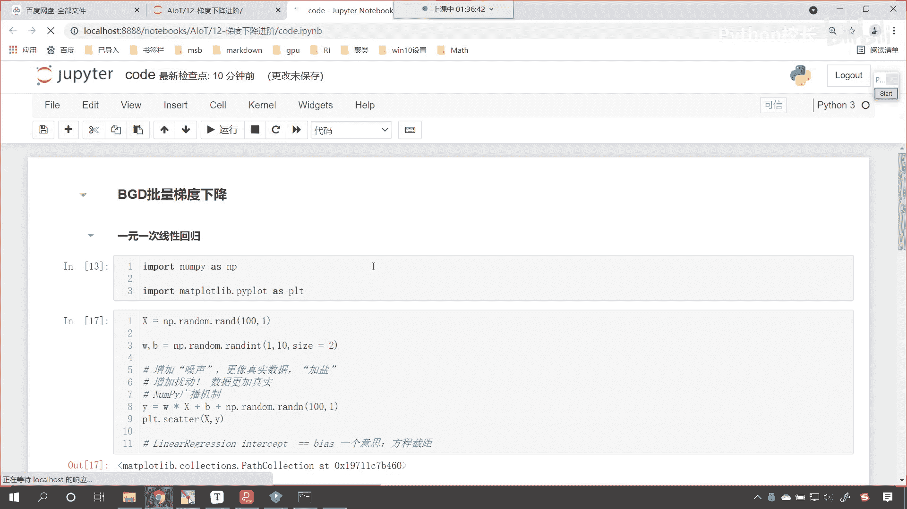

那么来咱们接下来呢给它添加一个四级标题啊，咱们呢就来一个多元一次。

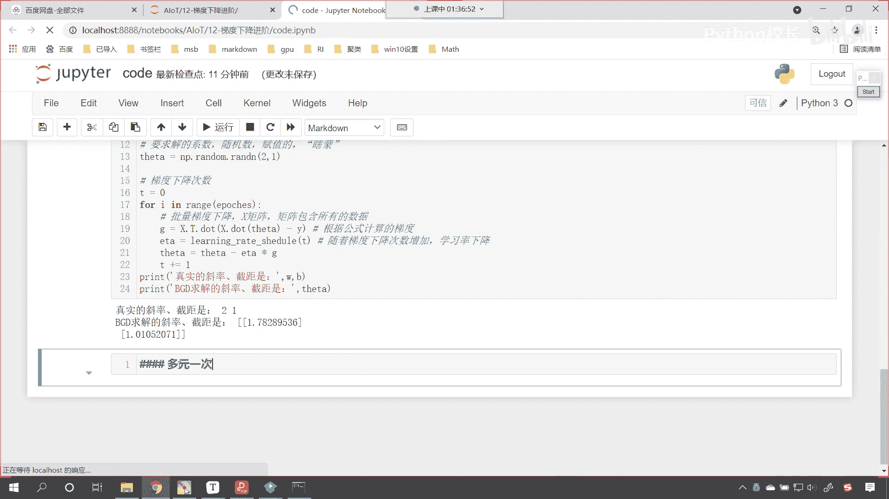

好不好，就来一个多元一次，那这个多元一次呢也一样啊。

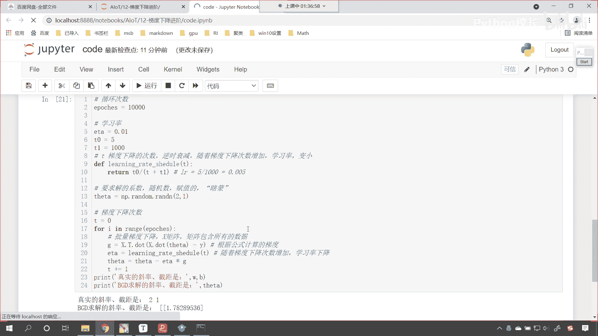

咱们呢重新刷新一下啊。

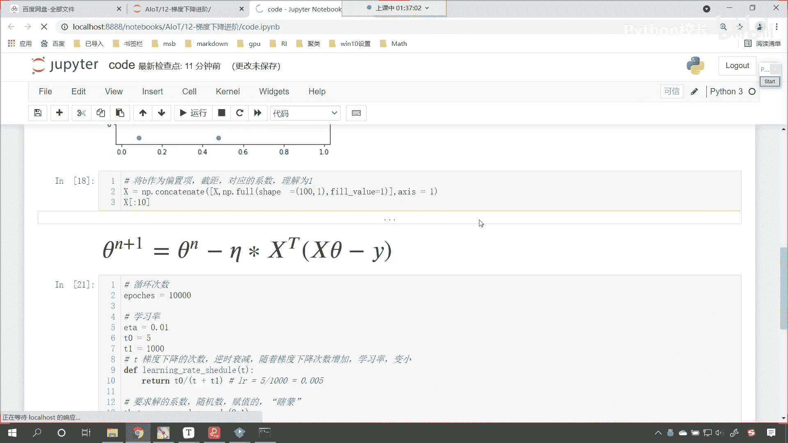

那我们就可以显示它的标题了。

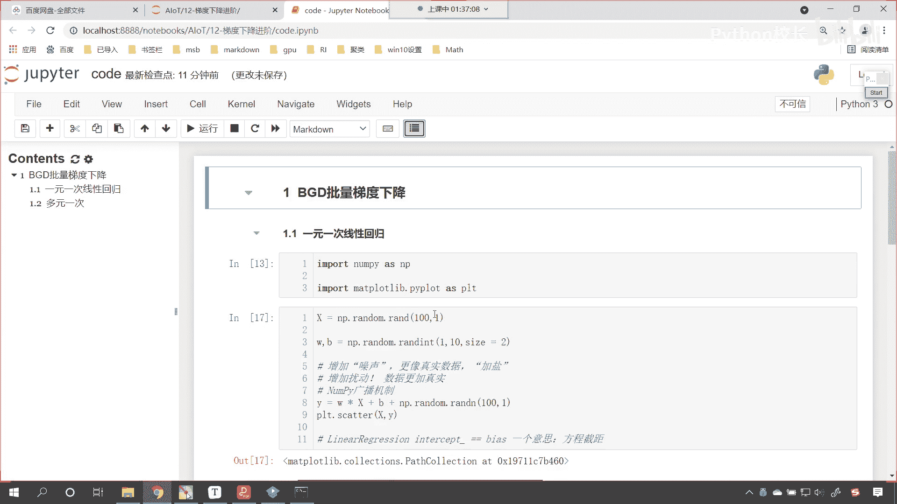

那对于多元一次呢，咱们将咱们刚才所写的代码进行一个复制啊。

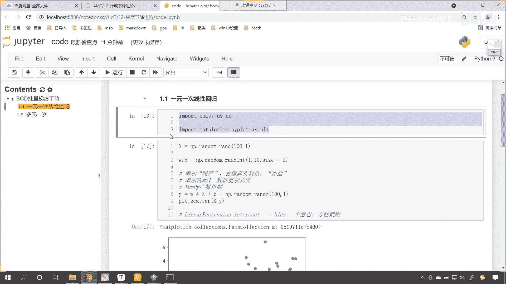

看这回我们就整体一体化。

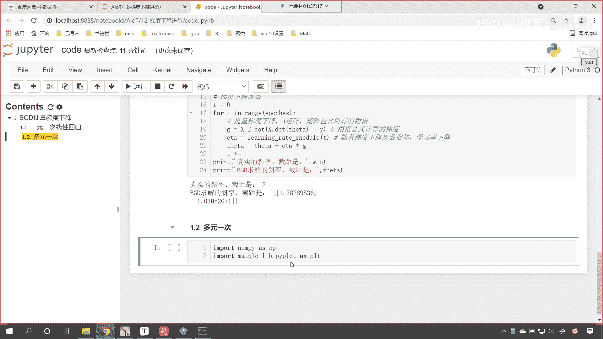

把它行这个操作出来了，好那么这个时候呢我们就创建数据啊。

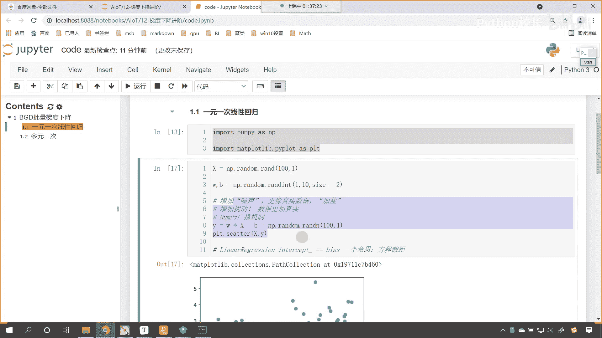

这个时候ctrl v。

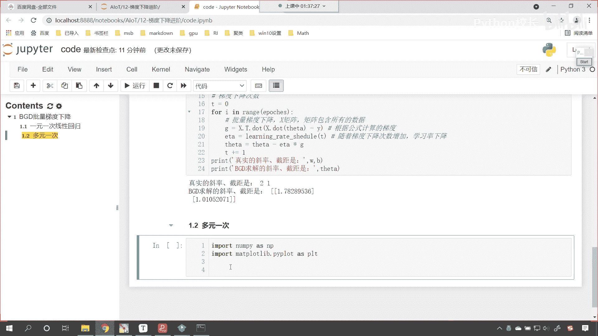

那既然是多元一次，咱们现在这个数据x咱们给几元一次呀，咱们就给八元一次吧，看到了吧，调整一下这个数据，那调整成数据，你看这个是不是就是八呀，那有了这个八之后呢，咱们的w和b也得需要发生一个变化。

那我们这个size就是八，那b呢咱们重新给他声明一下啊，这个时候这个b看就等于np。random，咱们也来一个rint，也让它一到十，我们给一个size，那这个size就等于一。

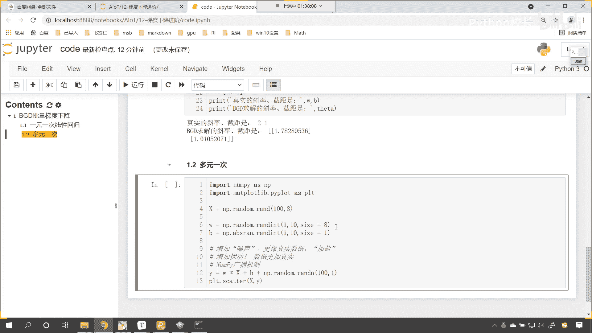

你看这就是八元一次，那咱们同样你看也是进行相应的操作，那你看这个地方是不是也是经过这个运算呀，那我们这个地方这个运算呢，嗯咱们这个时候呢我们就使用这个矩阵运算，咱们就可以了啊。

好那么我们如果想要进行一个矩阵运算，你看咱们的数据x是不是100个数据八列呀，这个地方给写错了啊，random好，那么所以说咱们的数据w，那我们也给它一个形状啊，也给他一个形状，看什么意思呀。

看让它是八行一列，你想这个数据如果是八行一列的话，他是不是就可以和咱们的x进行矩阵运算呀，对不对，所以那么我们的y唉就稍微修改一下哈，嗯咱们这个y呢之前w和x相乘，它们是数乘。

现在我们的x形状发生了变化，w的形状也发生了变化，此时呢他们是一个矩阵运算，那就是x。dot，咱们将w放进去，然后呢再加上b，然后再加上咱们的噪声，这个时候因为它是八元一次方程。

画图就没有办法绘制出来了，所以说我们也就不画图了啊，好你看此时咱们的数据就准备好了，准备好了数据之后呢，嗯因为我们这个依然使用了偏置项啊，井号咱们呢依然是把截距，咱们给它当成一个啊偏置项。

那截距当成了偏执，像咱们的x就得发生一个变化，那就是conquinnate，小括号中括号x放进去，np点负啊，np点负小括号咱们呢将给他一个sheep啊，那这个ship呢就等于小括号100逗号一。

然后吉连的时候，咱们给它一个轴啊，给一个few value，逗号给一个few value，这个few value就等于一，然后给一个轴，让这个轴等于一，这个时候呢咱们的数据就搞定了，好。

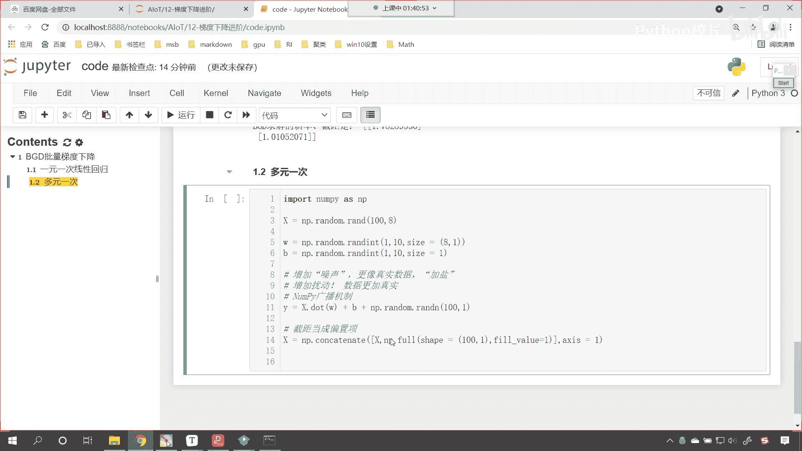

那么搞定了这个数据之后呢，来咱们把这个代码我们复制一下啊。

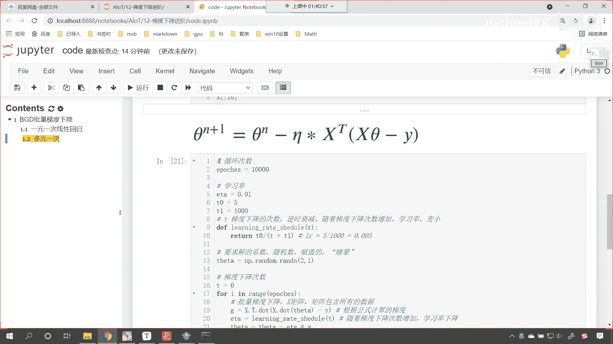

不用动，知道吗，这个代码就不用动粘贴过来。

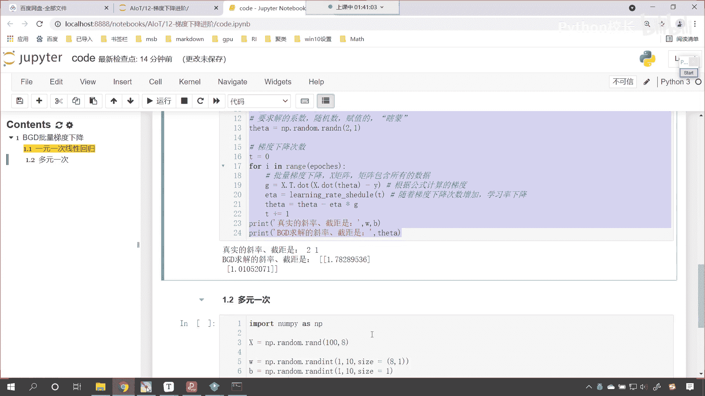

我们依然使用这个learning rate schedule，这个方法，也就是逆时衰减。

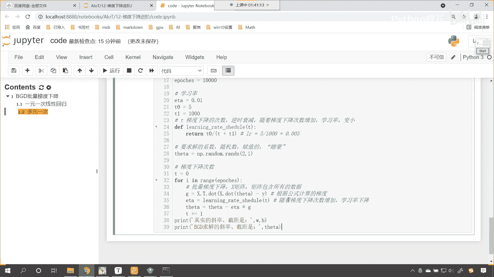

你看此时我执行这个代码呃，大家看咱们的形状是不是不太匹配呀。

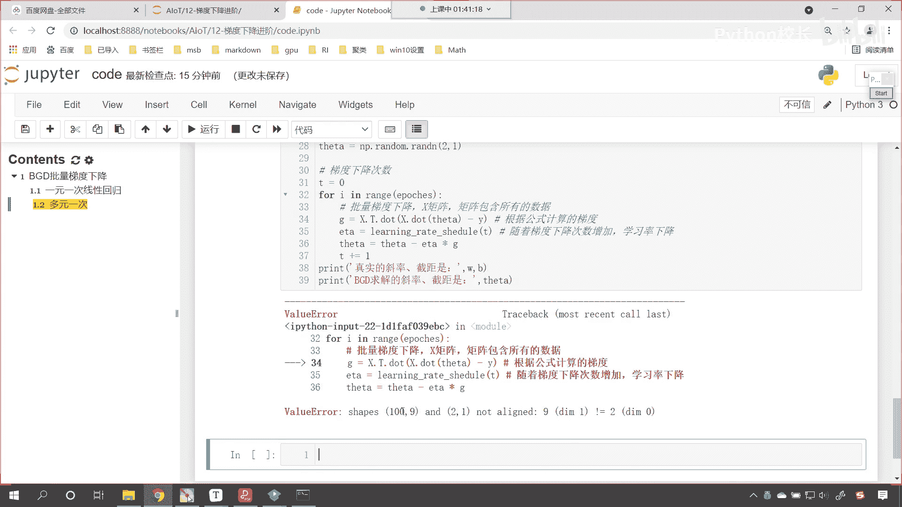

嗯这个时候这个c塔，因为求解的是多元一次方程，咱们多元一次方程，你看是不是八加上咱们的截距是不是就是九呀。

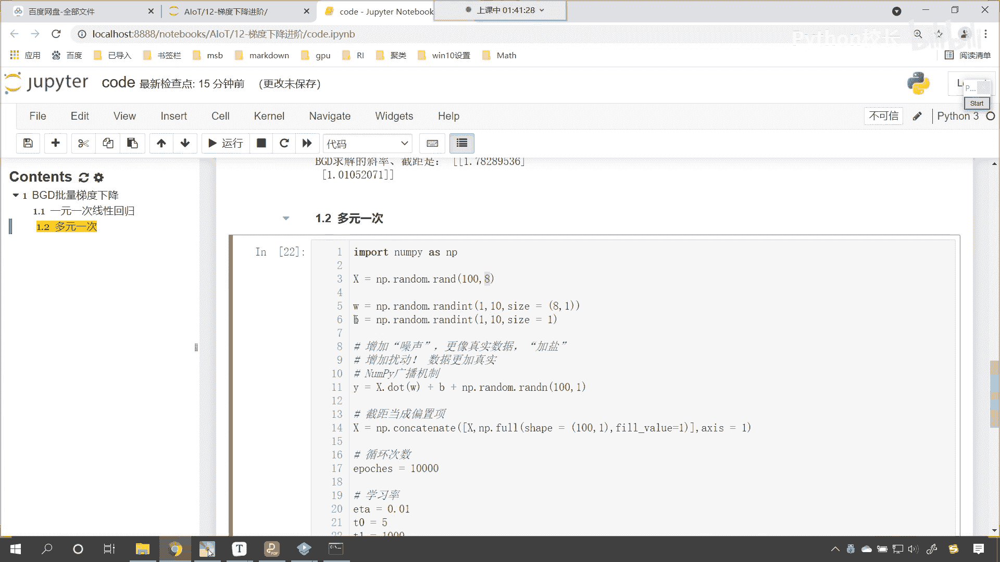

那我们调整一下咱们的theta。

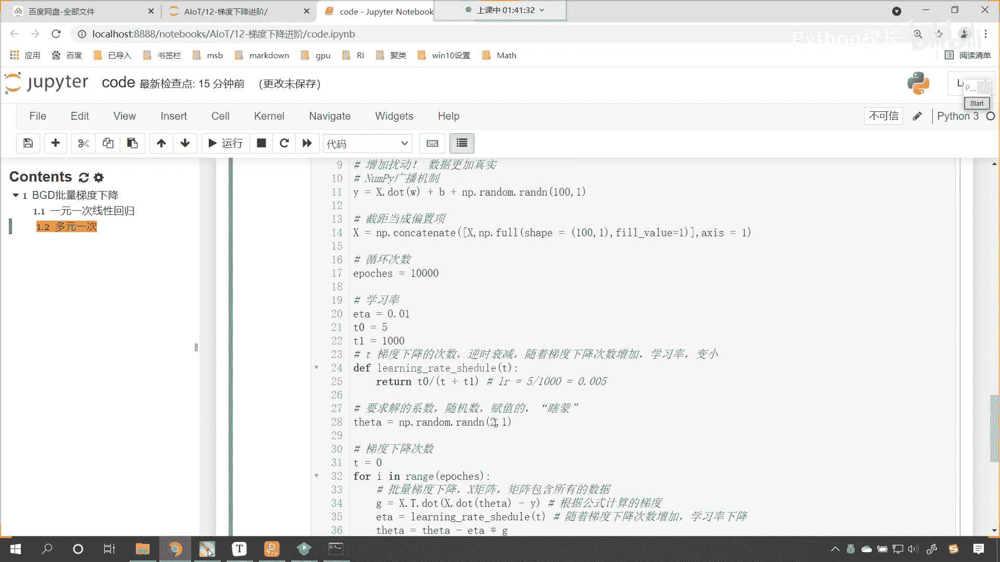

咱们这个theta呢就给一个九和一来，此时执行这个代码。

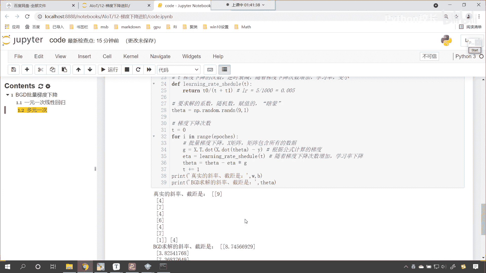

各位小伙伴，你看咱们这个数据就求解出来了，求解出来之后，大家仔细观察，咱们所使用随机梯度下降求解出来的这个，看我们使用随机梯度下降求解出来的这个数据，和咱们上面这个你看接近不接近，类似不类似。

我们先看咱们最后一个数据，这最后一个数据呢，它就表示看最后一个数据表示什么，最后一个数据是不是表示截距呀，我们的截距是多少，是不是数字四，对不对，你看我们第一个系数上面是不是九，我们使用随机梯度下降。

求解出来的是多少，是不是8。74，第二个是不是四求解出来是多少，3。82，第三个是不是数字七，求解出来是多少，7。36，第四个是数字四，求解出来是多少，四点多六，看求解出来的是六。

是不是每一个都是对应的呀，这说明咱们bgd批量梯度下降，求解出来的还可以哈。

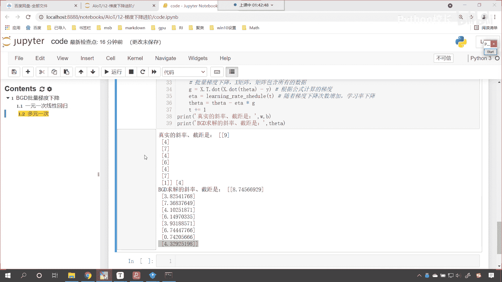

明白吗。

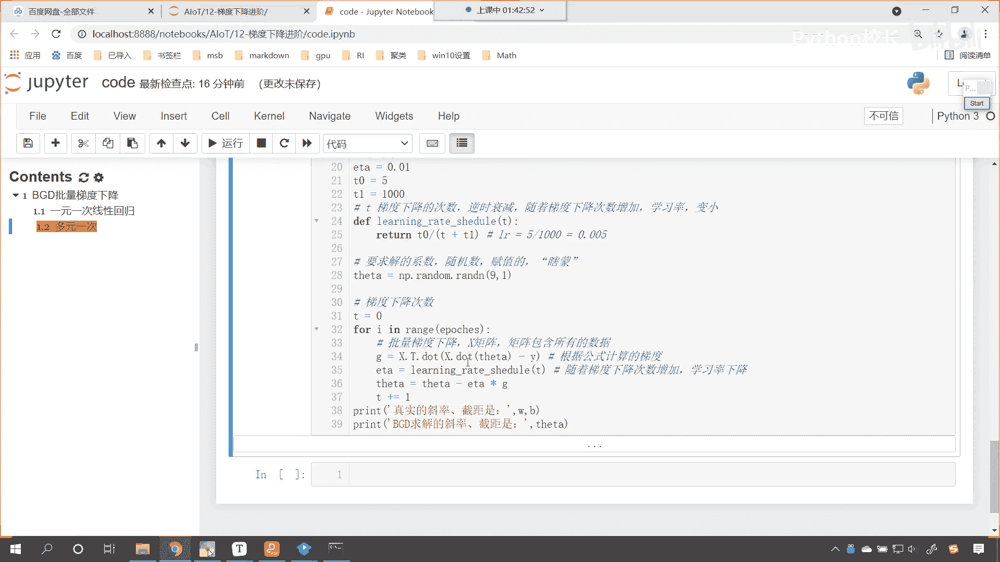