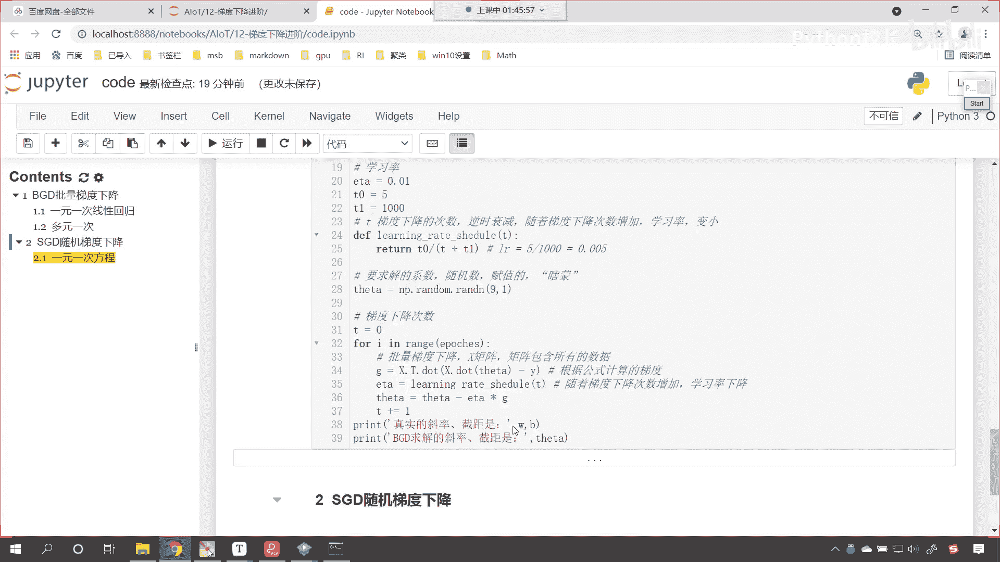
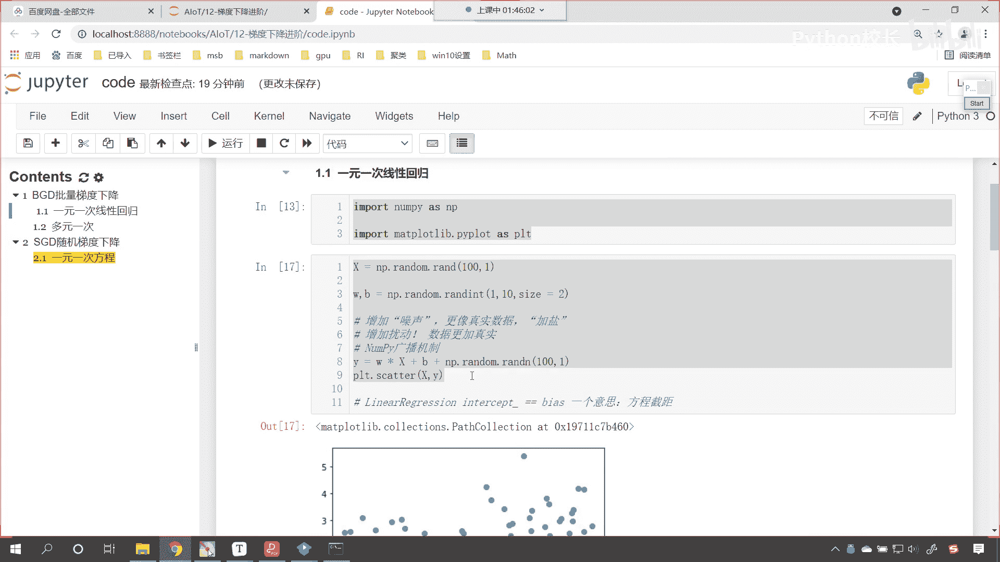
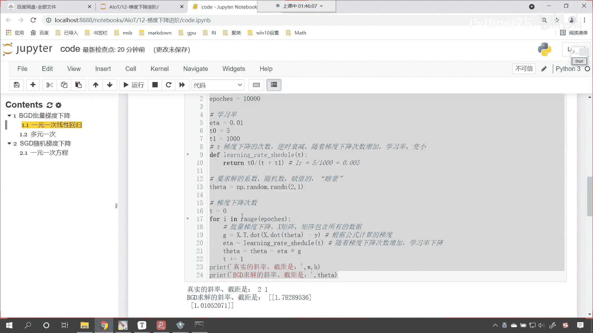
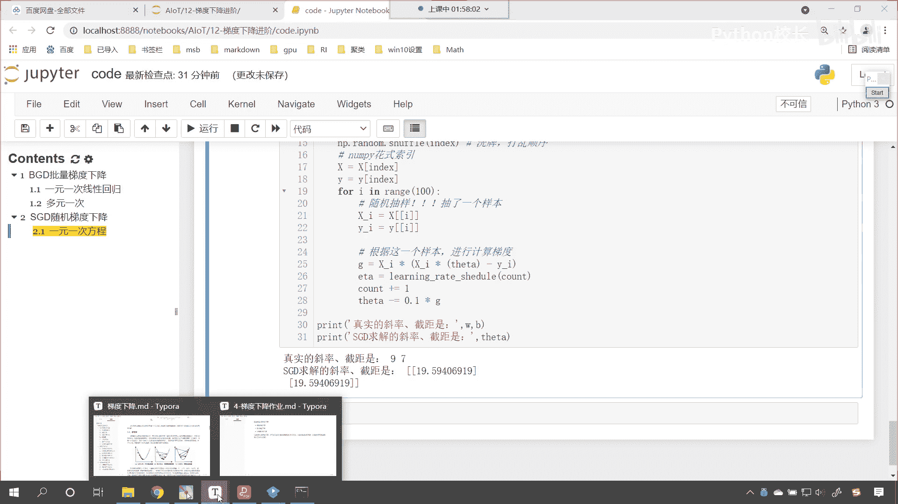
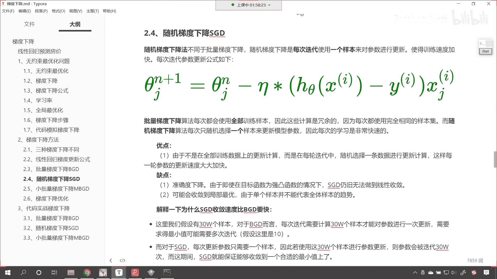
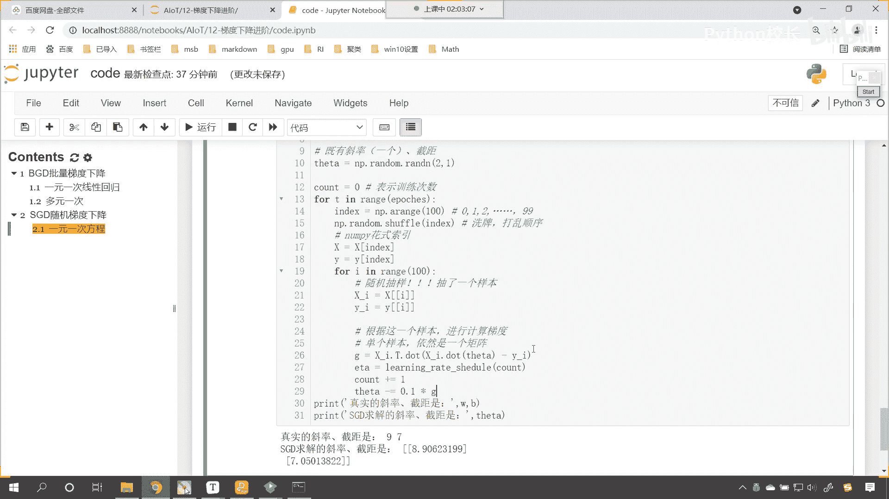

# P74：8-SGD随机梯度下降计算了一元一次方程 - 程序大本营 - BV1KL411z7WA

看你怎么理解100和八，咱们刚才有一个同学问了一个问题，嗯是吧，就是这个肯定是之前的课，你好好听了是吧，之前咱们在讲正规方程的时候，我们举例八元一次方程是吧，咱们如果增加了一列，是不是必须增加一行呀。

现在这个地方为什么不用我告诉你，你看我查看它数据的形状，你就会发现这个是不是对应着100和九呀，100表示什么，100它是不是表示100个方程呀，那这个九表示什么，看这个九是不是表示咱们的系数呀。

对不对，所以说你有100个方程，九个系数，那你想这个方程是不是一定可以求解啊，这就不像咱们原来的啊，咱们原来所给的八元一次方程，是咱们的方程数量不够，现在这个方程数量大大的够，明白吧，哎是不是。

所以说它是可以的啊，好来那接下来呢我们继续看啊，咱们看了一下这个批量梯度下降，然后咱们看一下这个s g d啊，这叫做随机梯度下降，好那么我们随机梯度下降呢，嗯咱们和这个是类似的哈，来我们随机梯度下降的。

咱们这个地方呢我们依然是呃，首先呢咱们给一个一元一次方程，这个地方呢我们增加一个四级标题，咱们呢以一元一次方程，咱们呢作为示例好不好，那我们数据的创建和刚才一样，咱们就不做重复的工作了。

往上划，咱们找件数据创建的这个位置。

来，咱们将这个复制一下是吧。

我们给它拿到这ctrl v，同样呢咱们也将该导包的，我们在这儿给他导一下包啊，import numpy as np，import matt plot，lib pie，plot，as plt。

这个时候呢你看这个数据咱们就可以创建好，那么有了这个数据的创建，接下来我们就看一下它有什么样不同的地方啊，那咱们首先呢给它一个循环的次数吧，咱们给它一paches，我们让它这个循环啊。

这个时候呢咱们让它循环100次啊，这是咱们的一poties循环100次，那同样呢我们也定义一个函数，咱们来调整学习率，那这个调整学习率和咱们上面是没有差异的，咱把这个复制一下啊，粘贴过来。

也就是通过这个函数来调整它的学习率，那这个时候呢咱们一开始呢也给一个theta，这个theta呢就表示咱们的生成的随机数，那就是np。random，咱们来一个rann，来一个二合一。

因为我们上面所给定的是一元一次方程，对不对啊，看我们上面给定的是一元一次方程，所以说咱们给个二合一，那这个c塔当中呢它既有咱们的斜率，又有咱们的截距，斜率呢，它就是一个，对不对，好。

那么这个时候该准备的，咱们是不是都已经准备好了呀，好那么接下来呢我们就进行相应的操作了啊，咱们就来一个for循环嗯，这个时候呢咱们就放以porch e p o，咱们就fort吧。

for t in咱们的这个range嗯，咱们来一个这个poties，这个poties是我们定义循环的次数是吧，然后呢咱们来一个冒号好，那么在这个当中呢，咱们需要将上面的数据x把它的顺序给它打乱。

那默认情况下，这100个数据是不是有一个顺序呀，因为我们是随机梯度下降，你想随机梯度下降，是不是得需要随机从当中选数呀，那怎么才能给它打乱顺序呢，看看咱们来一个index，就等于np。arrange。

咱们给个100，你想这个index它的范围是不是就是0123，一直到99呀，对不对，你看因为我们给的方法是arrange，所以说它是012，省略号是不是省略号，然后一直到99，怎么才能给他打乱顺序呢。

np。random，咱们是不是调用shuffle方法，就可以给他打乱顺序呢，这个方法咱们之前介绍过，这个就是洗牌打乱顺序，对不对，那有了打乱顺序了，咱们紧接着呢，哎我们就进行一个操作啊。

之前咱们在讲np的时候，是不是有一个花式索引呀，看到了有花式索引，对不对好，那么我们把数据给它改变一下哈，x就等于x中号中括号index，y呢就等于y中括号index，这个时候你看顺序是不是打乱了。

他还是这个顺序，但是呢它的顺序是不是就被打乱了，对不对，那这个时候咱们的顺序被打乱了，那么此时呢我们就可以for循环i in range，咱们来一个100，这个100呢就表示咱们这100个数据。

那我们随机梯度下降，它不是从数据当中一次就取一个吗，那这个时候呢咱们就取一个xi，就等于x中括号，再来一个中高二哎，把这一个数据取到y下划线，i就等于y中括号，再来一个中括号，把i放进去。

你看我因为我们上面有顺序的打乱，看到了吧，因为咱们上面进行了一个顺序的打乱，所以那下面这两行代码，你看它是不是就相当于随机抽样呀，看相不相当于随机抽样，这个时候是不是就非常巧妙呀，对不对。

你看这就相当于随机抽样，咱们随机抽样呢，我们就只抽了一个样本，因为我们for循环是遍历了100个，你想你这100个不就是你这100个样本吗，咱们x呢就表示咱们的100个样本，对不对。

所以for循环电力100，是不是就是咱们的这100个样本啊，好那么有了一个样本，咱们呢就根据这一个样本嗯，咱们就进行计算梯度，是不是那g就等于多少，原来咱们批量梯度下降，你看看咱们批量梯度下降。

咱们的g是不是整体数据啊，是不是整体数据x。t对不对，现在你是一个数据了，一个数据公式一样不一样，是不是也一样呀，那就是x下划线i。t，然后呢点dot小括号x下划线i点，咱们来一个dot。

这个时候呢咱们将sea放进去，然后减去咱们的y下划线a，你看这个时候这个梯度，咱们是不是就计算出来了，看了此时梯度计算出来了，有了梯度，咱们就计算一下学习率是吧，l e a叫做learning。

咱们计算一下一套e ta就等于调用咱们的learning rate，chedule，在这个当中我们要将咱们训练的次数给它嗯，这个放进去好，那么我们此时训练的次数呢，我们在最外边儿给他起。

给他声明一个变量叫count，这个count呢它就表示咱们训练的次数好，那么我们将count放进去，然后呢在count这儿呢，每次一执行让这个count加等一看，每次一执行。

咱们呢就让这个count加等于一，这个时候是不是就就可以了呀，看到了吧好，那么你看有了g了，有了一塔了，是不是就可以更新了，那这个c塔就等于多少呢，sea是不是就等于减等一塔乘以咱们的g呀，对不对，好。

那么最后呢咱们打印输出一下啊，最后打印输出一下，这打印输出呢来我们直接复制一下上面的代码，ctrl c打印输出，咱们就不手写了，真实的斜率截距w b咱们的s g d是吧，sg d求解的斜率和截距是。

这个时候你看我一执行这个代码好，那么此时我们看一下啊，嗯报了一行代码是不是给错了啊，我们看一下啊，咱们是每一行代码，它对应的时候呢没有对应上啊，嗯shape是一和一嗯。

咱们这个数据看咱们这个数据是不是二合一啊，那这个时候就说明咱们在进行矩阵运算的时候，是不是这个地方它没有这个呃，没有没有操作出来，是不是，那我们一起来看一下啊，也就是咱们这一行代码是不是好。

那么既然这一行代码报错了，那我们就print输出一下好不好，那就是x下划线a。sh，咱们将它的形状打印输出一下，我们看一下它是怎么样的啊，这个时候你看过一执行，那也就是说咱们xi是不是腰和腰呀。

然后呢我们再看一下咱们这个theta的形状啊，你看咱们theta的形状是不是二合一啊，那如果是二合一的话，那么我们这个dot运算呃，咱们呢就可以呃，我看一下啊，看咱们print一下啊，那就是x下划线a。

来咱们呢来一个乘法啊，乘以咱们的theta t h e t a，咱们执行一下诶，大家现在就能够看到，因为我们的这个数据形状的嗯，这个因素是吧，我们直接乘是可以的，因为我们随机梯度下降。

看看咱们随机梯度下降，选出来的是不是一个数一个数的这个形状呀，对不对，所以说那这个地方呢，咱们就可以进行这个相应的这个化简啊，此时呢咱们就进行相应的化解，那我们在进行相应化简的时候呢。

这个时候呢就没有必要使用矩阵运算了，咱们在这个地方呢就把它改成这个乘法运算来，此时呢咱们执行一下啊，上面这两个两行代码呢，咱们就给它注释掉啊，此时我执行一下这个代码呃，我看一下啊，这个地方还是报错是吧。

xt一点dot，x i。dot啊，等会我看一下啊，嗯我们把dot去掉啊，那就是乘法都把它改成乘法，这个时候咱们执行一下，好，各位小伙伴，咱们此时呢就能够看到这个s g d求解，截距19。16，19。

17，这个很显然是不对的，是不是，那这个就说明了嗯，我们在进行这个随机抽样的时候，咱们所抽出来的这个数据，咱们所抽出来的这个数据是不是没有对应上呀，没有对应上，那我们继续来对它进行一个调整啊。

看我们继续进行一个调整，那再执行一下，依然是这样的一个结果是吧，那我们将这个一塔呢修改一下啊，修改成0。01，我们给它一个固定的啊，固定的，这个时候咱们依然发现嗯这个不太行，是不是啊，咱们找一下这个嗯。

找一下这个原因所在啊，xi乘以来，咱们现在呢回到我们随机梯度下降这个地方。

好在这个地方呢，咱们就能够看到咱们的这个数据呢，是不是随机抽取的呀，那既然是随机抽取的啊，咱们依然是让这个数据相乘，然后做一个减法。

对不对，那我们这个地方之所以出问题，那肯定是咱们减法这个地方出了一定的问题，咱们这个地方呢这个xi呢，你看我们在取数据的时候，我们如果使用这种方式叫xi x中括号i，那我们取出来它是一个二维的数组。

现在的话咱们操作一下，把它变成一维的数组，然后我们现在呢把它变成一维的数组，哦大家看啊，咱们明白了，你看咱们这个数据是不是没有进行扩展呀，对不对，你看咱们的数据x是不是没有进行扩展，对不对。

这是咱们出错的原因啊，那我们这个一元一次方程，咱们是不是也应该对于这个数据x进行扩展，对不对，好，那么咱们现在呢就对于这个数据进行一个扩展，在这儿呢我们进行一个说明呃，因为呢我们有一个偏置项。

是不是咱们有一个偏执，所以说咱们这个数据x也需要增加，对不对，那这个时候呢就是x就等于np点调用concinnate，小括号中括二，咱们将x放进去，np点负。

这个里边还有一个方法是不是叫full like呀，咱们这回就调用full like啊，那这个full like呢，咱们就把x放进去，什么是full like呢，就是创建一个形状和它一模一样，是不是。

然后呢我们给一个feel value，让它是一唉，这个时候就可以了，嗯咱们进行吉连的时候，我们执行一下这个操作，先不赋值给大家看一下它的形状长什么样，此时你就能够看到最后一列，是不是就增加了一样看。

所以说这个full like和咱们的full是一样的啊，for like的意思呢，就是创建一个数据的形状和x长的一样，因为咱们的x呢它的形状是100和一，你想我创建出来的结局是不是也是100和一啊。

所以说我就可以调用full like x，这个时候呢咱们就接收一下x呢，就等于咱们这个数据好，此时数据操作完成了，那我们现在呢嗯还是咱们的代码啊，还是咱们的代码，刚才咱们在进行计算的时候。

你看我们计算出来的结果是不是不太对呀，啊是因为我们呃这个偏置项我们没有增加，导致咱们这个数据出来的结果哎就是这样的好，那么现在的话咱们这个数据进行了修改，那此时呢就是x下划线i。t。

咱们依然使用矩阵的这种形式来进行操作，嗯那就是x2 点t dot啊，咱们将x下划线i点，咱们调用dot，我们将theta t h e t a放进去做一个减法，咱们呢减去y i咳，大家注意啊。

看啊大家注意咱们刚才进行计算的时候，计算出来这个结果是不是没有差异，没有差异，是不是说明我们计算出来的这个结果不对呀，对不对，好现在你看我又进行了一个矩阵运算，那此时我为什么还可以进行矩阵运算呢。

因为咱们的单个样本大家注意啊，因为咱们的单个样本它依然是一个矩阵，看单个样本依然是一个矩阵，你看我上面的x是不是一个矩阵呀，我打印输出一下，看到了吧，它是不是一个矩阵，那它当中的单个剧本是什么。

它当中的单个样本是不是0。1405和一呀，是不是它是不是依然是一个矩阵，它是不是两个数，对不对，你看它是两个数，既然是两个数，那么咱们在进行计算的时候，是不是就可以根据矩阵的原理来进行操作呀。

此时我执行一下这个代码啊，大家现在就能够看到，咱们使用随机梯度下降，我们就计算出来了相应的结果，看到了吧，咱们使用随机梯度下降。

