# P75：9-SGD随机梯度下降多元一次方程求解 - 程序大本营 - BV1KL411z7WA

所以我们机器学习结果的好坏跟什么有关系呢，跟数据有非常大的一个关系啊，好那么这个呢就是咱们随机梯度下降，一元一次方程的求解嗯，这个时候大家在进行计算操作的时候，特别需要注意什么。

特别需要注意咱们数据获取这一块儿看啊，注意啊，这个时候有两个中括号，知道吗，有两个中括号。

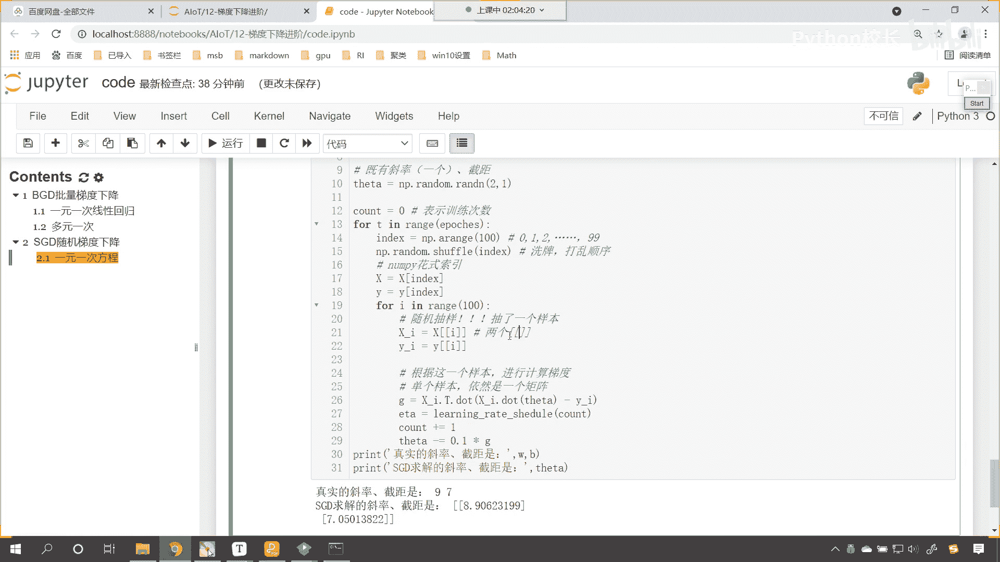

你要理解，一个中官和两个中官有什么样不一样的地方，我给你举个例子，x你看我来一个零，取出的数据是不是一维的，x中国二零，再来一个中国二零，你看我取出的数据仔细观察，仔细观察有没有不一样的地方。

看有没有不一样的地方，下面这个你看是不是二维的，上面这个是多少，看到了吗，它是一维的，所以说我们这样取数据。

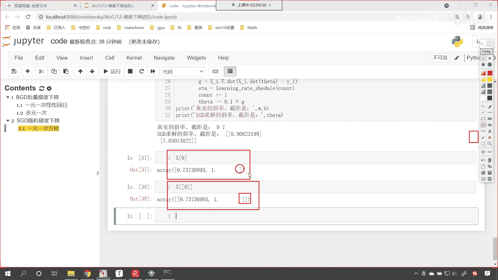

咱们是不是就可以进行矩阵运算了，也就是说你单单个的一个样本依然是一个矩阵，依然可以使用这个矩阵运算，唉现在明白了吧，好那么咱们接下来呢来一个四级标题嗯，我们将随机梯度下降，扩展到咱们的多元一次方程。

这个也是类似的啊，核心的代码都不变。

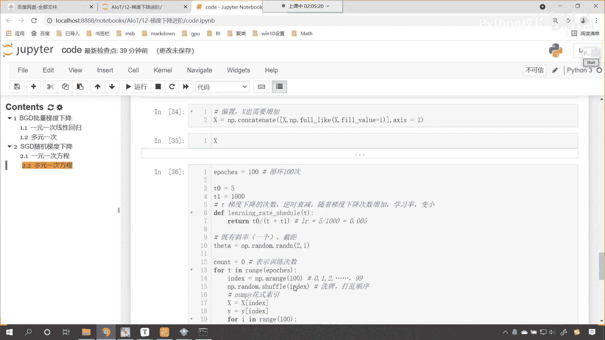

现在的话咱们将多元一次方程数据的创建呢。

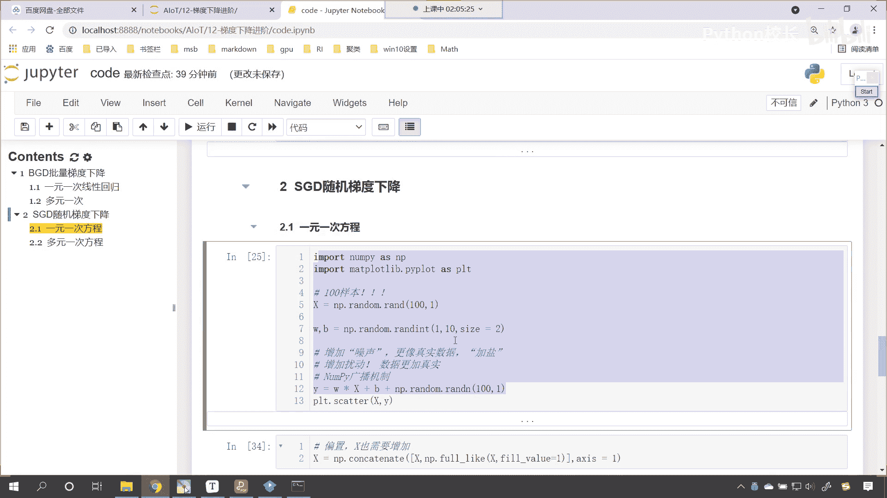

我们复制一下好不好，你看啊。

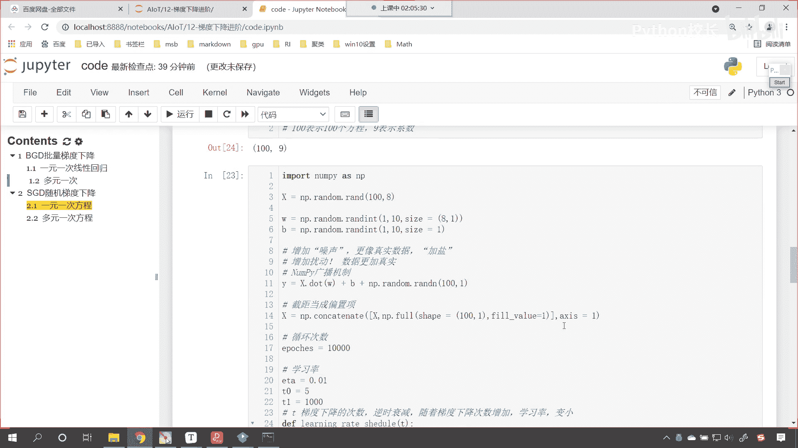

上面这个咱们是不是就创建了多元一次方程呀。

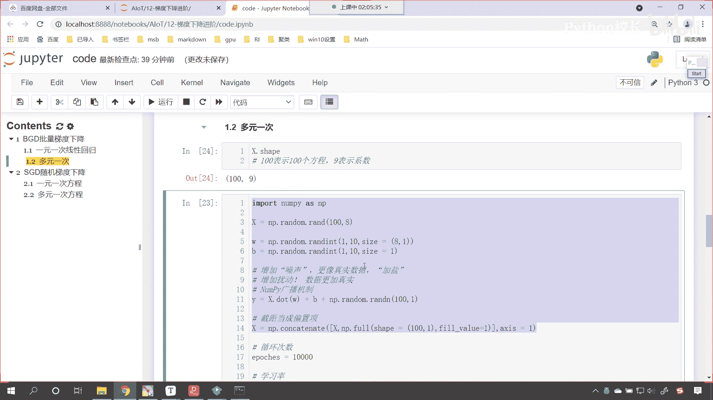

来那么我们依然也创建八元一次，好不好。

你看其实你创建多少元一次方程都一样，这个时候我们来一个更复杂的18元一次方程，所以说呢你看啊嗯咱们其实在进行操作的时候，要多细就有多细，知道吗，就是你这个地方取一个和取两个是不一样的啊，知道吗。

它是不一样的，那怎么才能够进行很好的区分呢，你要对数据结构有一个认识，有一个理解，我们的数据x它就是这个二维的数据，好现在这个数据咱们就创建好了，创建好了这个数据之后，那这个代码咱们同样也复制一下啊。

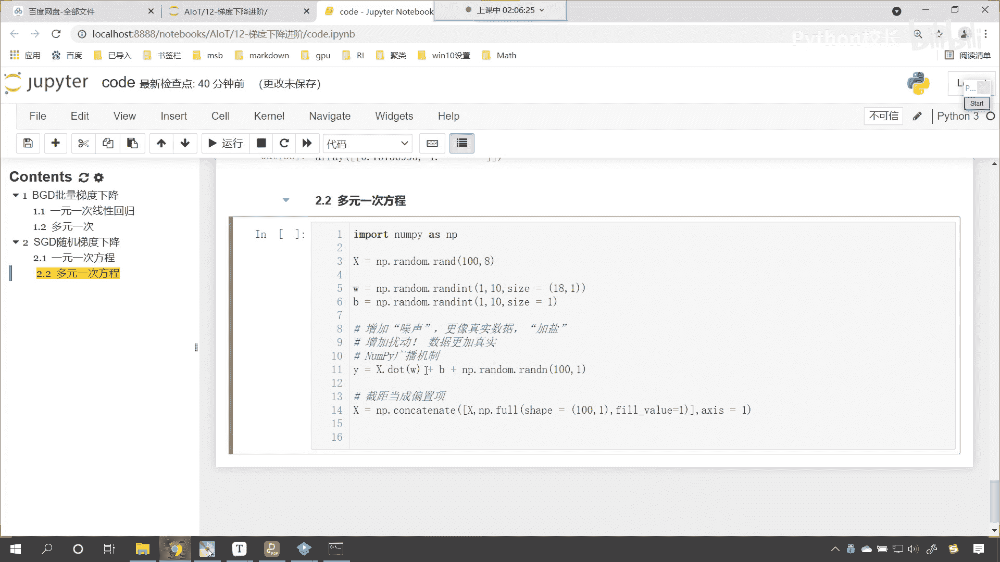

上面的数据创建咱们就不做解释了。

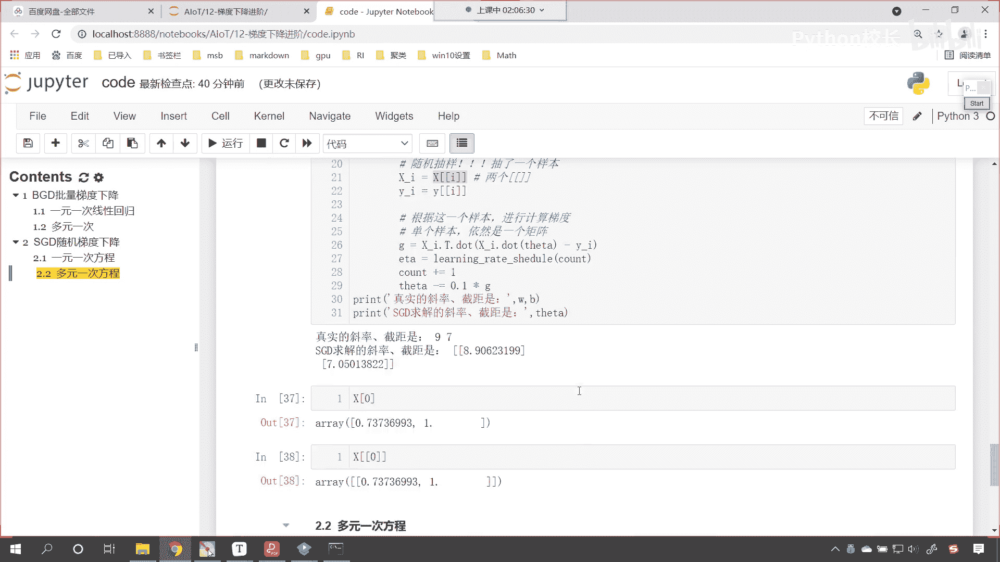

那大家看这个代码，咱们是不是就是随机梯度下降的代码呀。

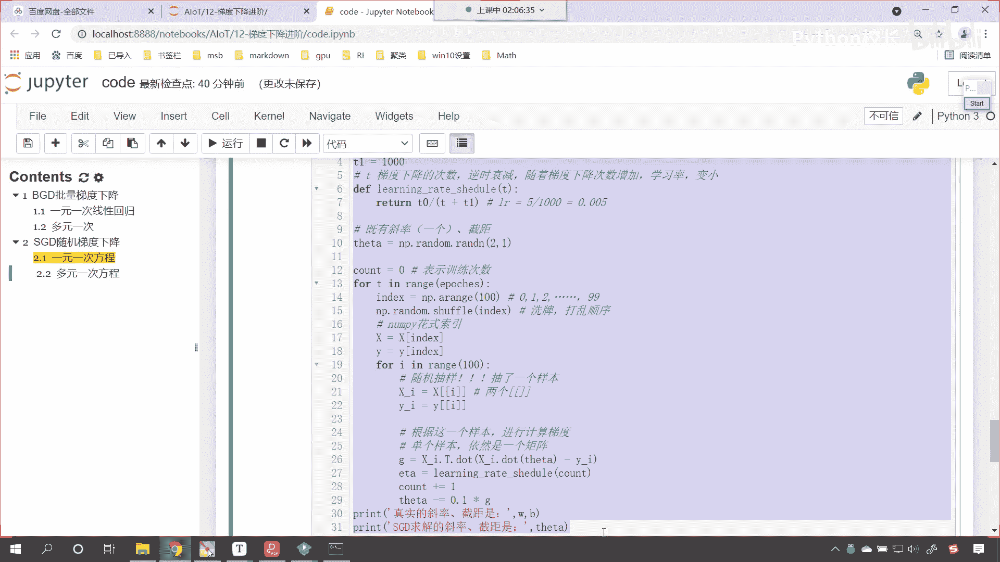

我们将随机梯度下降的代码。

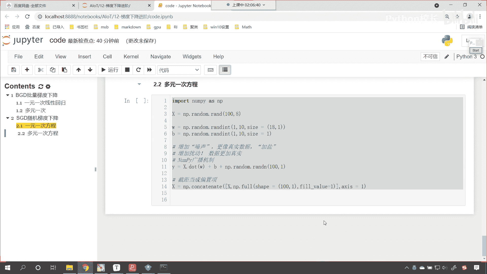

咱们给它粘贴过来啊，粘贴过来，这个时候咱们就只需要改哪个地方呀，我们不是18元一次吗，咱们既有的这个斜率呢啊，这个时候呢它就是18个是吧，嗯然后呢再加上一个截距，嗯加上一个截距，那也就等于19个。

所以这个时候咱们将这个给它改成19，19个一行打印可能沉不下是吧，咱们调小一些啊，我们给它调整成五个啊，调整成五个，看其实你调整成五五个也好是吧，调整成这个18个也好，都一样，都是这一堆代码进行的操作。

那此时呢来这个截距当成偏置项，依然是进行np点负，是不是来此时我们执行一下代码啊，看里边的这个随机梯度下降的for循环遍历，都不用改，那我们这个咱们这个更新，看这个theta的更新。

咱们呢就使用一塔是吧，随着咱们梯度下降的进行，咱们这个一塔他要逐渐的变小，逐渐的进行逆时衰减，就是随着时间的增加越来越小，这个时候你看我一直行，大家看咱们数据的形状是不是不太对呀，来修改形状。

第11行代码。

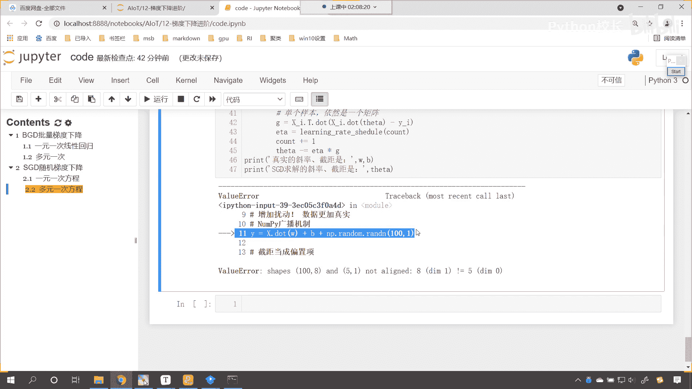

我带着你调代码啊，第11行代码，那我们的数据是100和八，但是咱们的w是五和一，那调整一下咱们的数据形状。

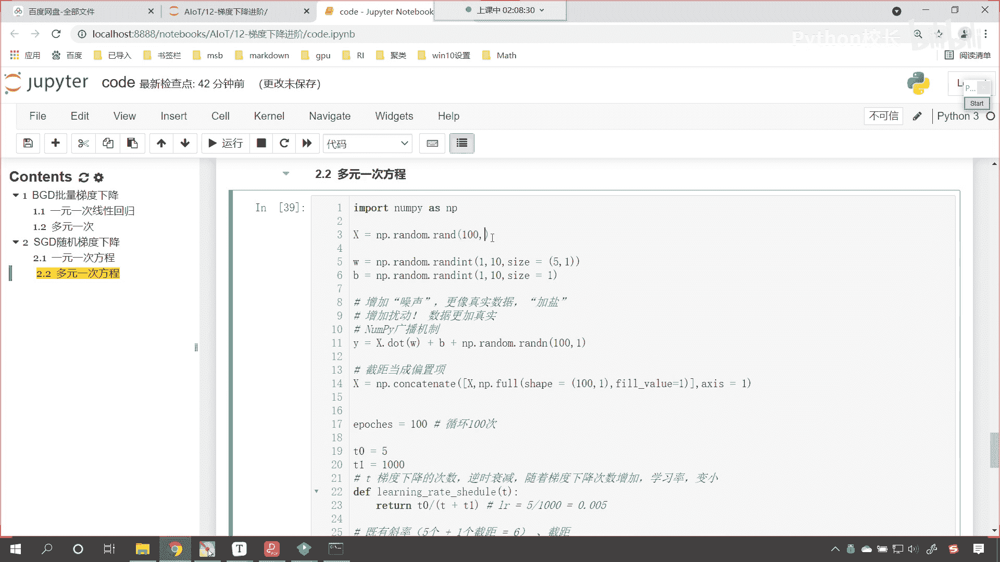

把它改成五再来执行，现在你来看结果是不是就执行出来了呀。

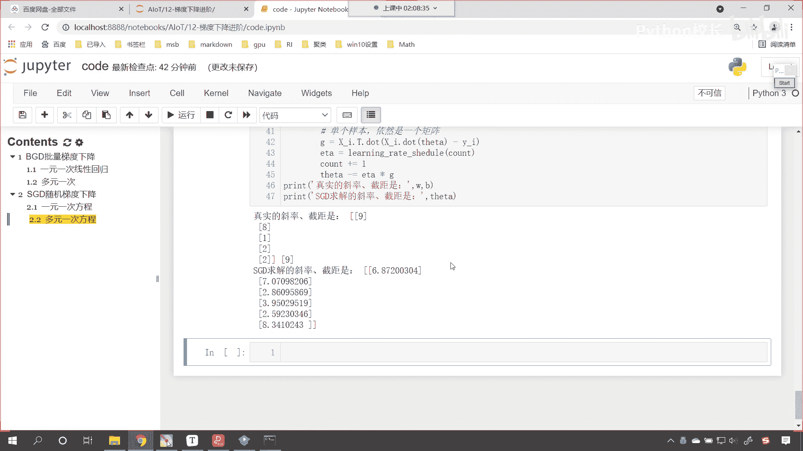

大家看咱们这个结果啊，我们简单过一下。

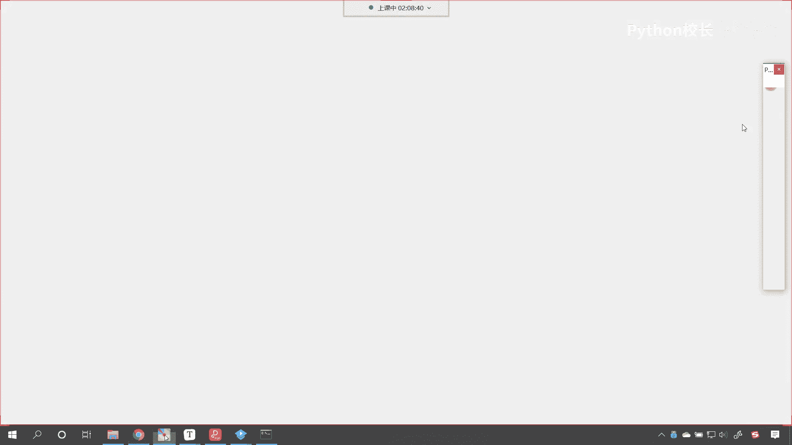

咱们使用随机梯度下降，求解出来的截距是八，真实的答案是九，是不是啊，你看我们第一个求解出来的系数是6。87，而我们第一个值是九，咱们现在发现这个是不是就有一定的差距啊，你看第二个是七，这个是不是八。

第三个是一，这个是不是2。8嗯，这个是二，这个是不是3。9，这个是二，这个是不是2。59呀对吧，他一定有一些差距，知道吗，一定要有一些差距。

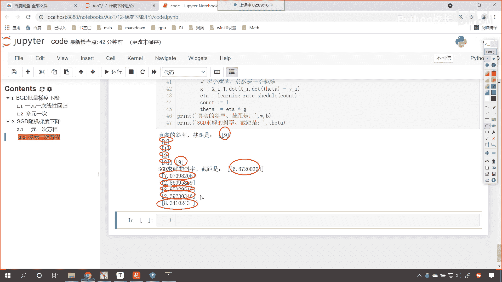

那我们说这个差距是什么样的原因造成的呀，因为我们有一个什么呀，咱们有一个数据的噪声，同时呢咱们是不是还有循环次数呀，看到了吧，我们循环次数是100次，咱们将循环次数给它增加增加到1000次。

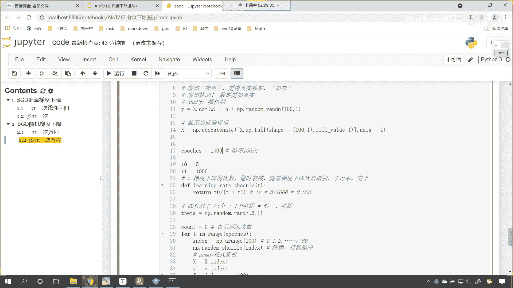

这个时候你看我再来执行，现在你再来看看咱们的循环次数增加之后嗯。

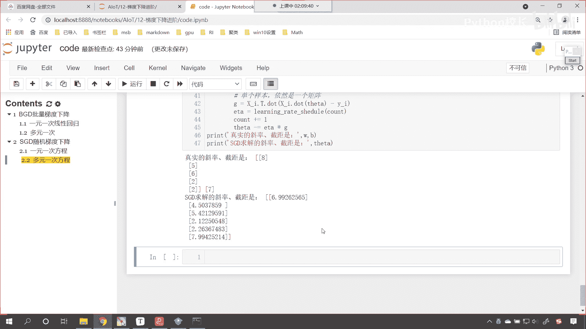

你发现是不是就好一些了呀，必然会接近，你看这个是八，这个是不是6。99，这个是五，这个是不是4。55，这是4。5，这个是六，这个是不是5。4，所以说增加次数是不是效果会好呀，你看最后的截距是7。9。

而我们的真实的结局是七，是不是就会提高一些。

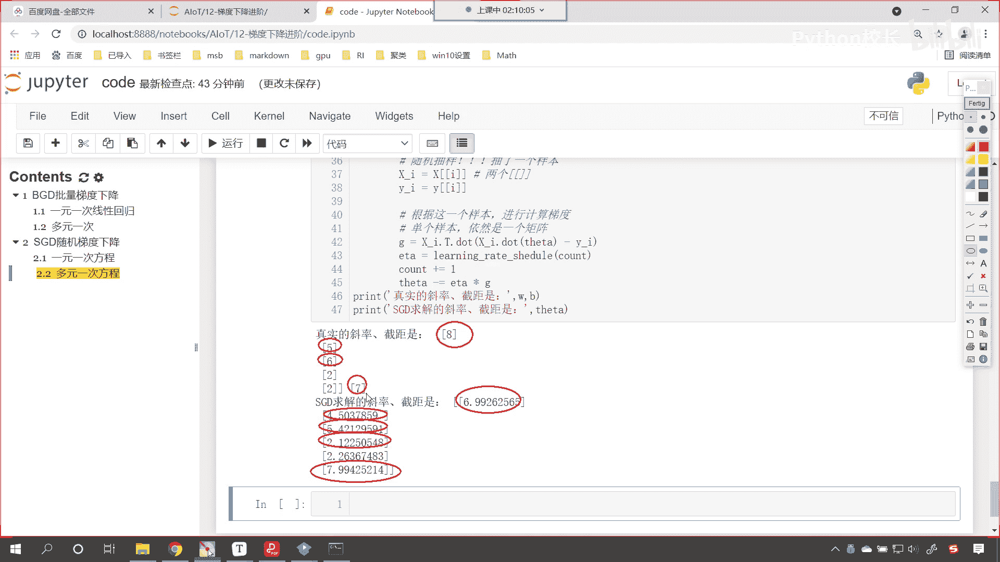

所以说呢哎咱们的这个循环的次数，对它是不是有一定的影响呀。

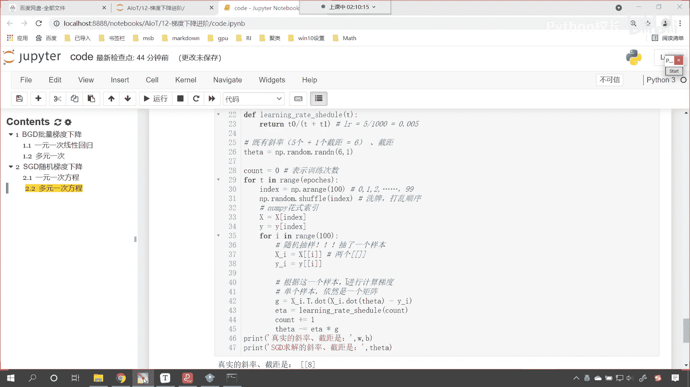