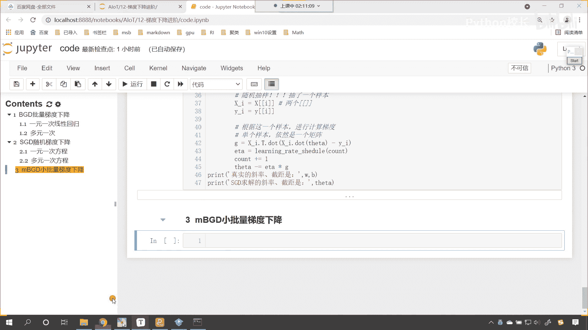
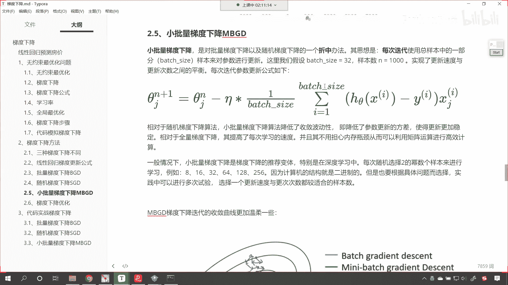
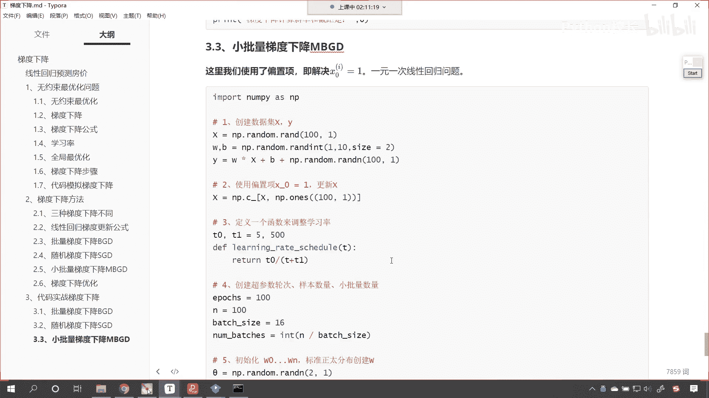
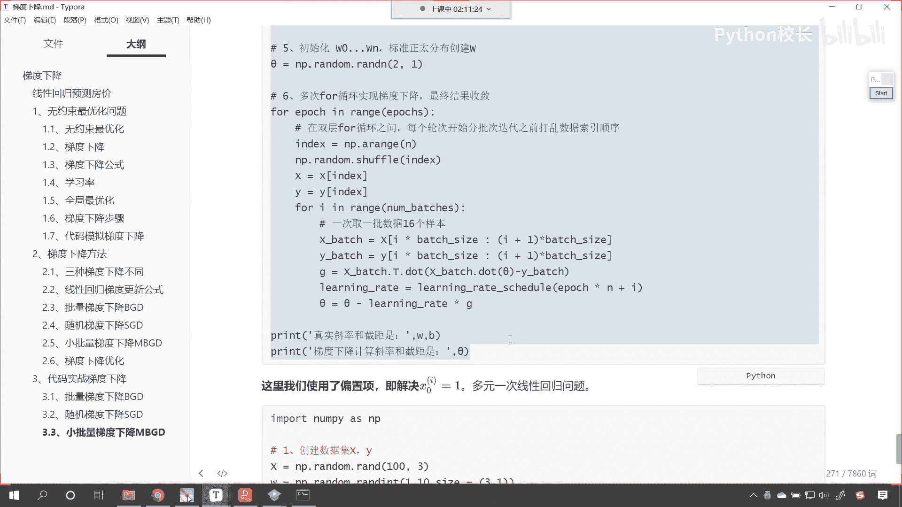
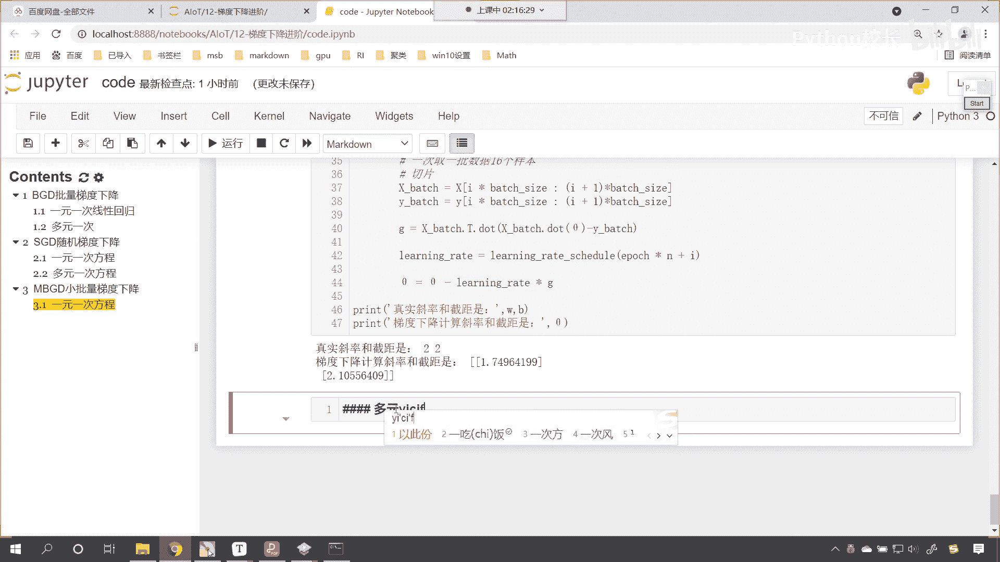
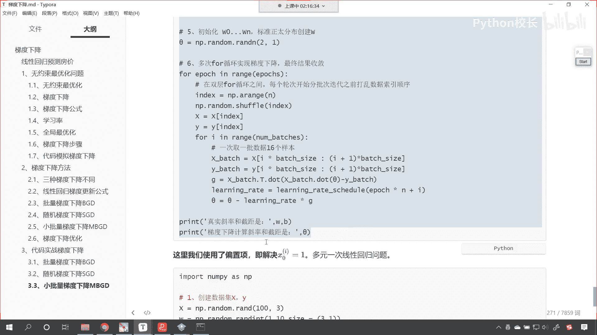
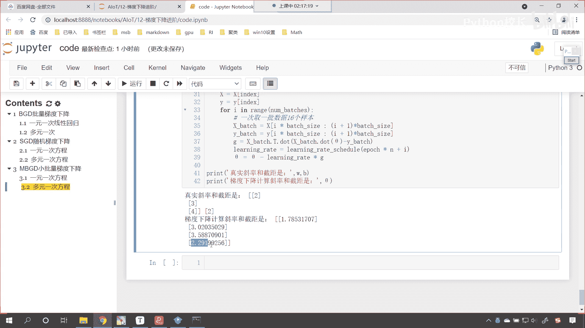

# P76：10-MBGD梯度下降代码演示 - 程序大本营 - BV1KL411z7WA

三级标题，这个最后呢我们还有几分钟，我们最后呢其实就是一个折中了，对不对，那咱们这个折中呢叫做m b g d，这叫做小批量梯度下降，那对于这个小批量梯度下降，咱们呢就不带着各位一行代码，一行代码的写了。

只要我们知道它对应的原理。

咱们的小批量梯度下降，是不是和批量梯度下降类似呀。

对不对，那我们看一下小批量梯度下降啊。

咱们现在呢就将这个这里的代码。

我们给它复制一下，来回到咱们的代码当中，咱们呢看一下小批量梯度下降它是如何操作的，上面的数据创建，以及咱们定义函数来调整学习率，咱们就不做操作了，还有我们创建超参数轮次，样本数量和小批量的数量。

我们既然小批量，咱们是不是就得定义一下你这一批选多少，对不对，那我们以poties就表示他啊，这个循环的次数n呢就代表咱们的样本数量，你看这个n其实是不是，就是咱们样本数量100呀，对不对。

哎所以我们就用n呢对它做了一个记录啊，batch size等于16，你看这个地方咱们计算了一下叫nbatches，我们进行了一个什么样的操作呀，是不是就是让100÷16呀。

就是说我们随机抽样是不是每次取16个，那那我们就要看一下，你如果想要从这100个样本当中把数据都取完，你得取多少次，你想这个时候是不是就相当于六次呀，看到了吧，六次，因为6x16。

你看6x16是不是就是96呀，是不是就唉6x16，它是不是就等于96呀，你看96不就接近于咱们的100吗，是不是，因为这个数除不尽，是不是啊，所以说他就这个nbatches就相当于咱们的啊，这个次数好。

那么我们初始化咱们的w w0 ，w n这个里面就包含咱们的啊，这就包含咱们的截距，因为我们也对它使用了偏置项，是不是好，那么接下来最关键的一步呢，就是咱们的for循环了，你看在for循环这。

咱们同样也进行了一个操作，我们是不是就是打乱顺序啊，看到了吧，也打乱顺序，看到了吧，因为我们也是随机抽样，我们不能让每次的抽样都一样，那所以最好的方式是不是就是打乱顺序啊。

这个和咱们上面随机梯度下降是不是类似，然后呢，for i in range nbatches，你看这个npatches，它是不是就等于六呀，你看因为这nbatches是我们计算出来的。

也就是说我们随机抽完样之后，随机排列之后，然后呢每次呢从当中选取多少个，一次取一批取16个，这个时候就涉及到切片操作了，大家注意啊，你看啊，这个时候就涉及到切片操作，在我们切片的时候。

咱们进行了相应的计算，看到了从a乘以batch size到i加一batch size，那切完片之后，咱们这个时候呢是不是就是计算梯度了，计算梯度之后，然后计算学习率是不是学习率是逆时，是逆时衰减是吧。

随着训练次数的增加，它呢会变小，然后呢我们又进行了一个什么操作，是不是更新学习率是不是乘以咱们的梯度呀，这个时候你看我们这个learning rate当中呢，咱们用以porch乘了个n，这个n是谁呀。

看这个n嗯，这个n呢是不是就是咱们的这个100啊，那这个你看这个这个e poties，这个poties是不是就是咱们的这个这个次数呀，对不对，你看这个poties就是咱们这个次数。

因为我们这里面有两层循环，所以说epochs乘以n，然后再加上i，这样的话你的次数呢其实就是一次一次再增加，你看因为这个i呢就是咱们这里边这个次数，那这个时候你看我执行一下这个代码。

大家看咱们真实的结局是七和三梯度下降，求解出来的斜率和截距是5。87和3。72，哎你看这是可以接受的啊，再来执行一下，看这是九和88。138。42，如果想要接近，咱们将这个epoch次数增加。

你看再来执行，这回你看是不是就比较接近了，你看执行一下，你看这个速度又快，准确率又高，是不是啊，那我们上面举的例子呢，咱们呢来一个四级标题啊，这个是一元一次方程好，那么多元一次方程也一样啊。

咱们来一个多元一次方程。

多元一次方程它不一样的地方，就是构建数据的时候。

来下面这个ctrl a ctrl c，咱们在这儿呢来一个粘贴，你看不一样的地方，就是咱们这个数据是三，我们这个y的创建呢就是x dow，下面这个代码都是完全一样的，那这个地方呢我用了这个符号theta。

这个符号theta，你可以去百度上搜是吧，特殊符号嗯，咱们前面这个代码，咱们是不是都把它改成了这个sa呀，t h e t a都行啊，我们说符号是不是只是一个这个公式呀，这个时候你看我一直行。

大家看是不是也就出来了，这是2342，看到了吧，1。733。5，2。29。

怎么样。