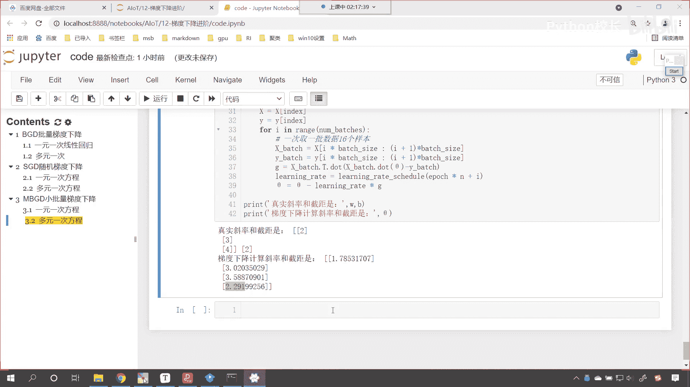
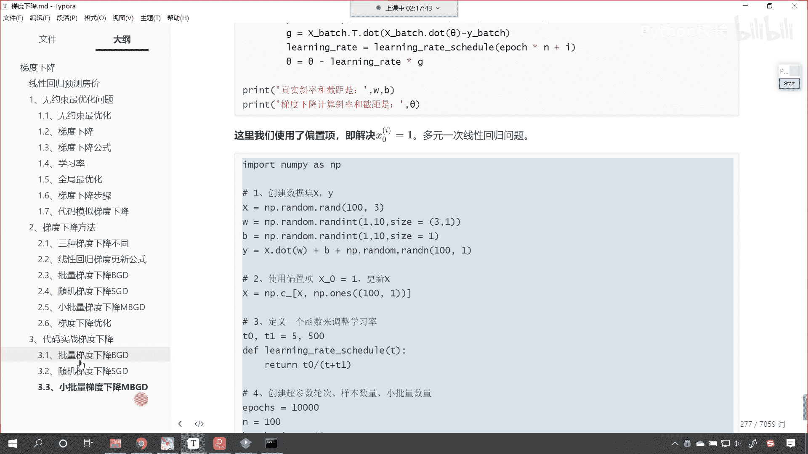
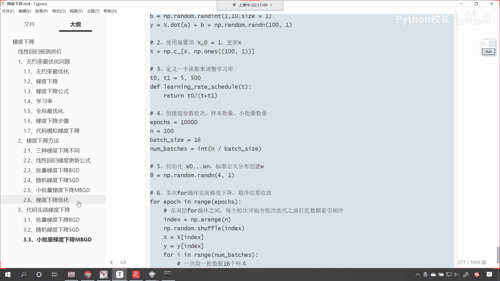
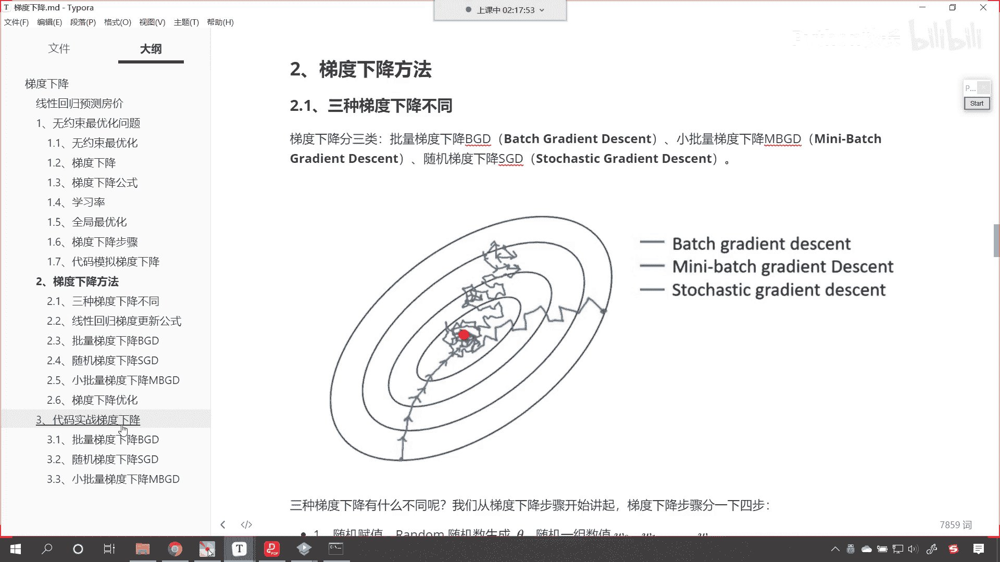
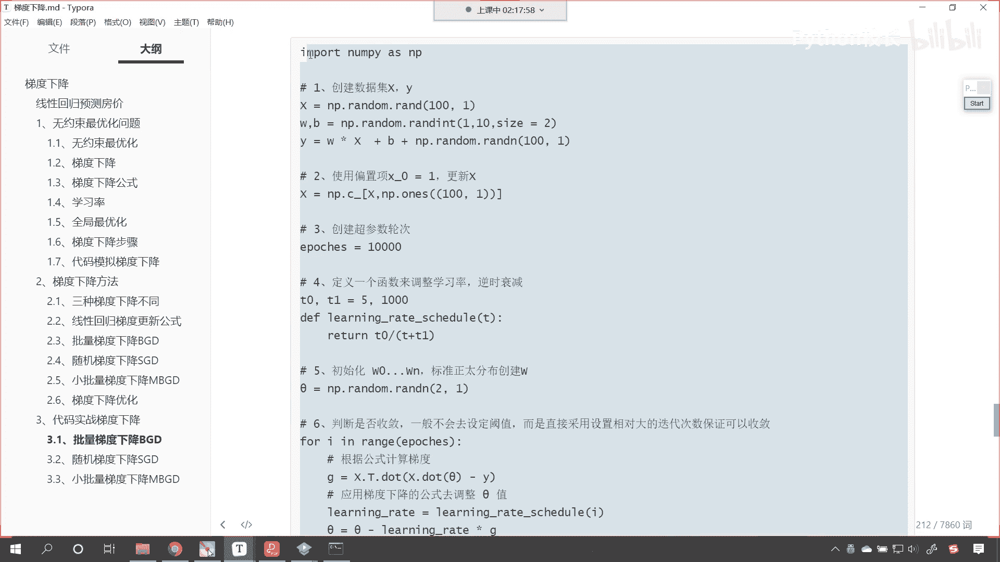
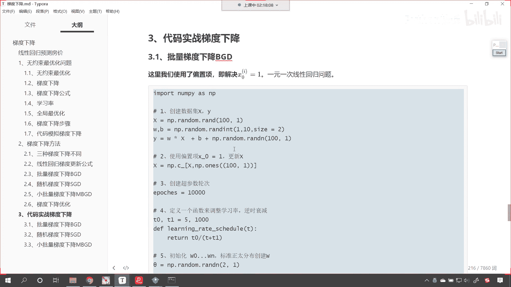
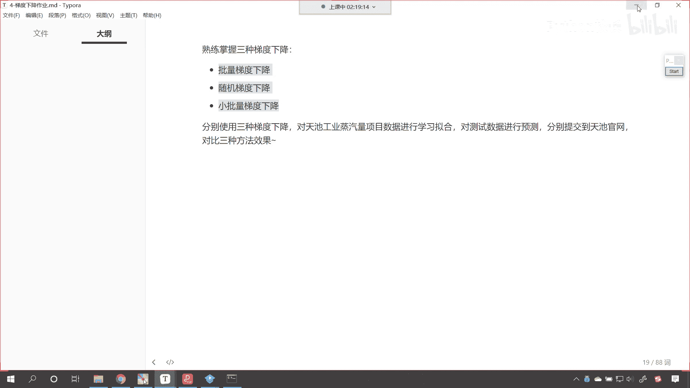
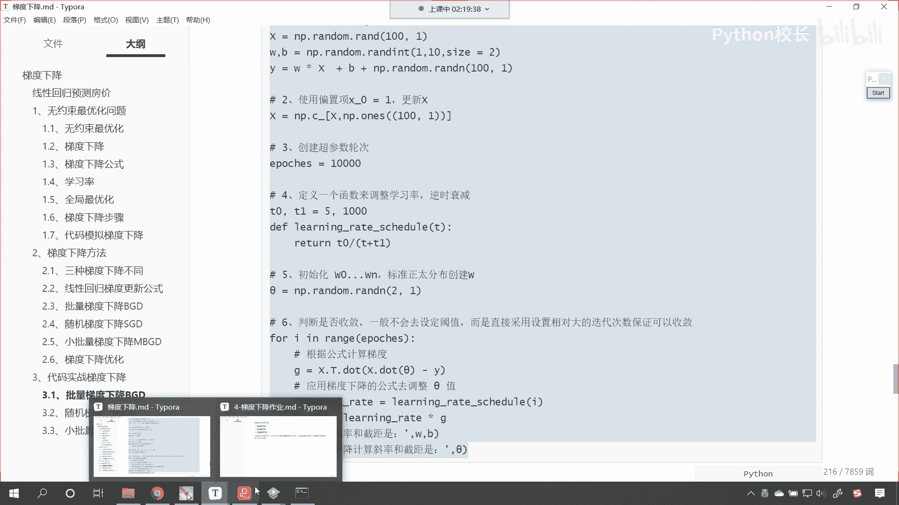
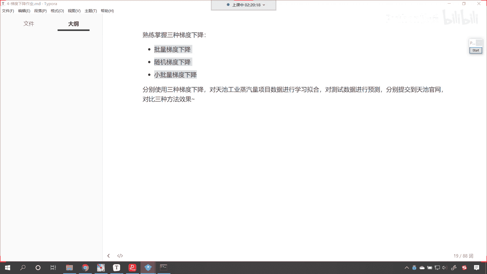

# P77：11-作业介绍 - 程序大本营 - BV1KL411z7WA

看到此为止，咱们三种梯度下降的眼。

咱们就给各位介绍完了，结合咱们所讲的梯度下降的方法。

我们使用代码为各位进行了演示。

有了这种梯度下降的基本功以后。

无论是深度学习也好，还是什么卷积神经网络也好，它其实都是在这个基础上进行的升级。

接下来我们看一下咱们今天的作业，熟练掌握三种梯度下降，批量梯度下降，随机梯度下降，小批量梯度下降，分别使用三种梯度下降，对于我们天池工业蒸汽量的这个项目，数据进行拟合，那对于咱们的测试数据进行预测。

分别提交到天池官网，咱们对比一下三种方法的这个效果的不同，之前咱们天池工业蒸汽量的这个数据，咱们用的是不是就是线性回归呀，对不对，你看我们用的就是线性回归啊，现在呢我们使用t3 种不同的梯度下降。

对它进行嗯学习训练拟合，然后预测咱们的测试数据，并且呢将结果进行提交好，这个呢就是咱们今天晚上所讲的内容，各位小伙伴，咱们今天晚上的内容呢，我们就到这里好不好嗯好那么大家有任何问题。

咱们就在讨论区里边把这个问题呢哎抛出来，咱们最后呢为各位呢进行一个解答，如果要没有问题的话，那么你的作业呢，唉就是要把这三种梯度下降理解清楚弄明白，然后呢把我们的作业做出来，注意啊。

咱们这个作业做出来之后呢，你其实是可以提交到天池官网，看一下到底哪种效果好好，那么呃同时大家要注意啊，咱们在进行操作的时候，你要调整参数，比如说学习率是吧，这个学习次数看一下是吧，这个哪种是比较合适的。

好不好好，那这就是今天晚上我们的内容好，那么咱们就到这里好，没有问题的话。

