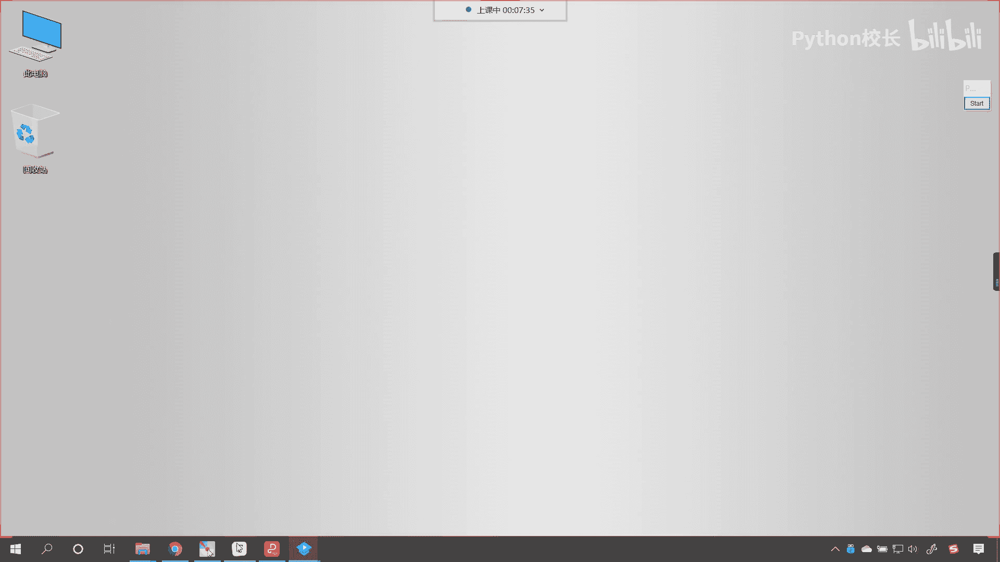
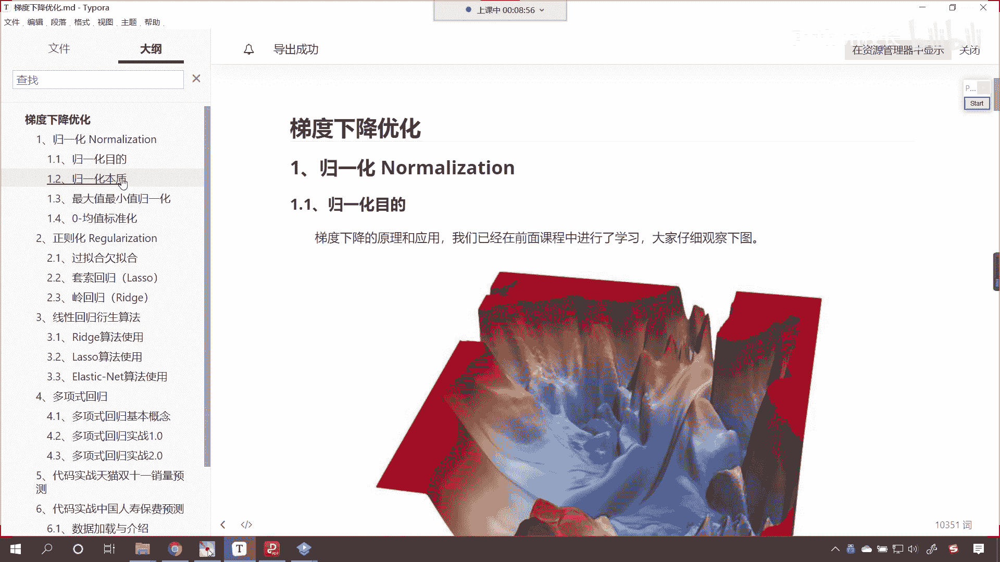
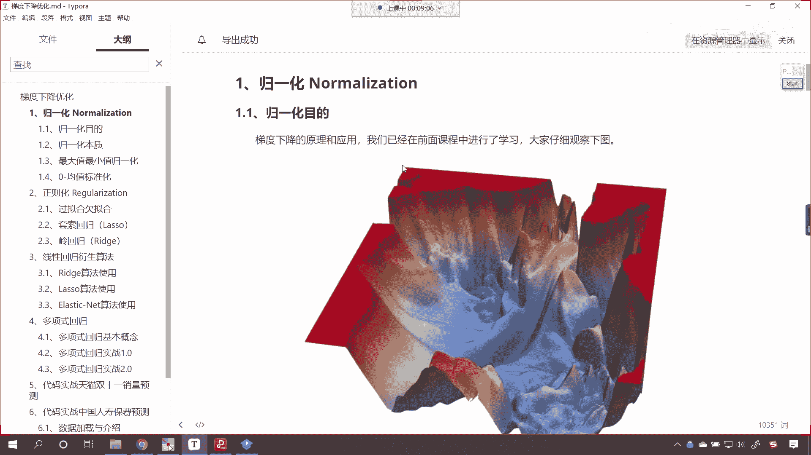
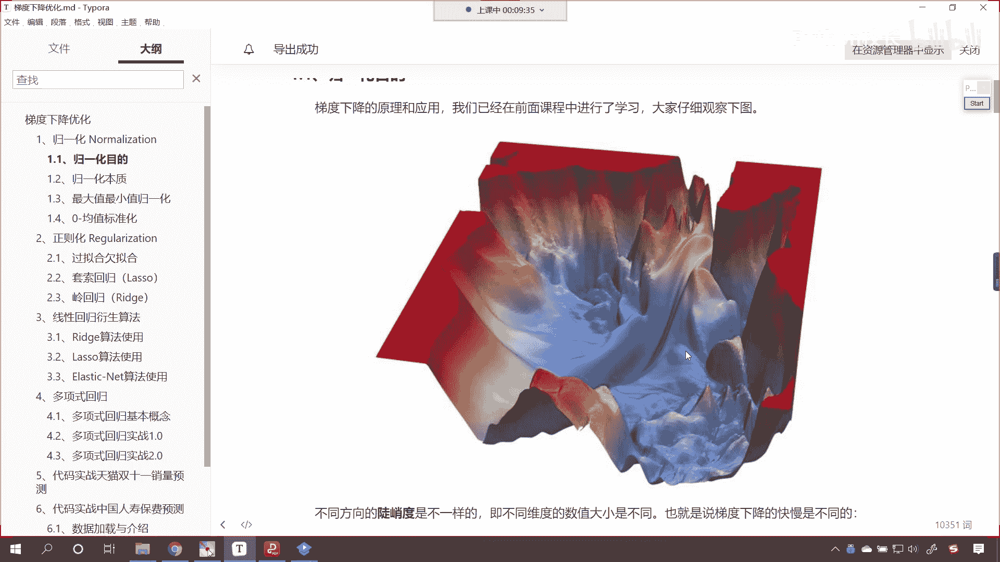
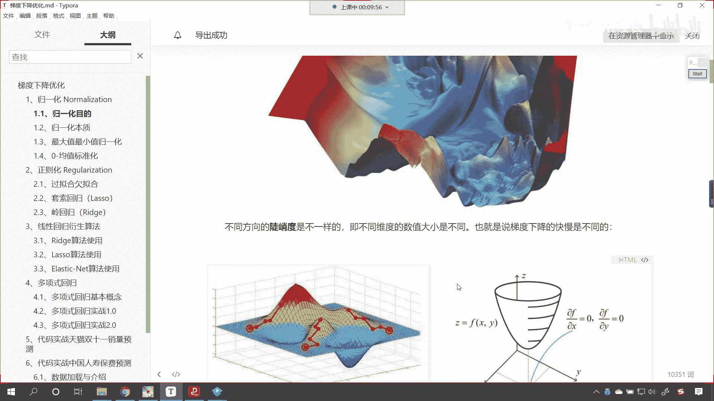
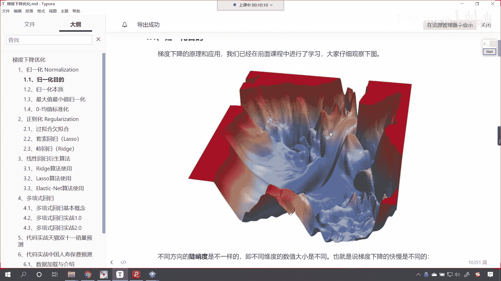
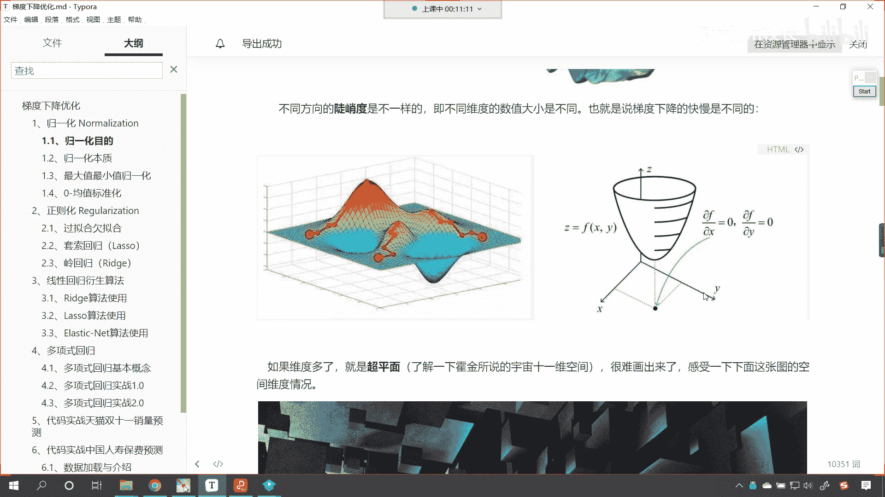
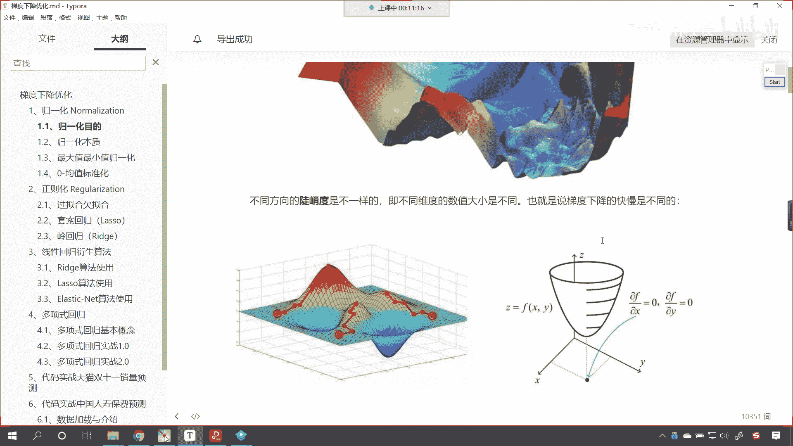
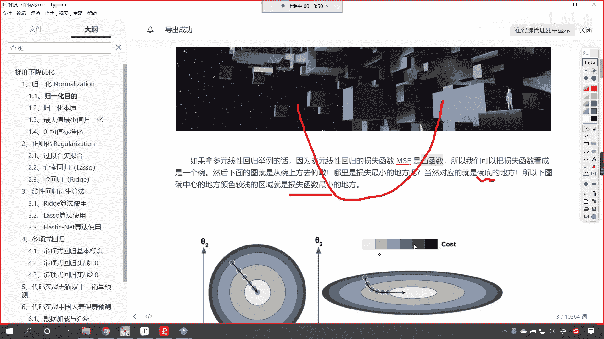
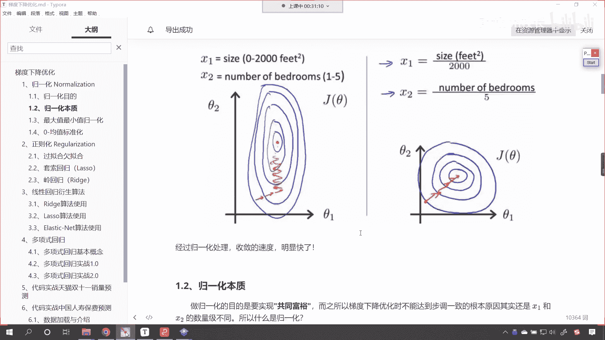

# P78：1-归一化目的 - 程序大本营 - BV1KL411z7WA

是现在呢咱们就开始我们今天晚上的课程好，那么我们一起来看一下啊。

咱们今天晚上我们会讲一下梯度下降的优化，呃之前呢咱们介绍了梯度下降，如何实现梯度下降是吧，我们也介绍了线性回归，介绍了正规方程，对不对好，那么咱们呢继续向深水区前进，嗯今天嗯这个嗯。

嗯今天呢我们就看一下梯度下降的优化，那之前咱们留了作业，就是天池工业蒸汽量的预测，是不是啊，我们学习了相应的优化之后，咱们呢就现学现卖，咱们使用相应的策略，比如说归化，咱们呢将天池工业蒸汽量的数据。

进行归一化的操作，然后呢我们上传一下，上传到这个天池大赛上进行相应的对比，咱们看看进行归一化和不进行归一化，咱们的得分，咱们的排名有没有相应的前进，好不好好，那么首先呢我们介绍一下什么是归一化。

那什么是归一化呢。

那我们首先看一下归一化的目的，那咱们呢之前已经讲解了，梯度下降的原理和应用。

对不对，大家现在就能够看到，你仔细观察一下这个图，我们假设说这个是一个山，是不是我们在山顶之上，咱们现在呢要下山，那你想咱们梯度下降是不是就是找最低点，那我们下山的话，你就你就能够发现你看这个地形。

有的地方是不是陡峭呀，有的地方是不是就比较平缓呀，对不对，那陡峭和平缓跟我们的数据有什么样的关系呢。

是不是不同方向的陡峭度是不一样的，即不同维度的数据大小是不同的，也就是说梯度下降的快慢，是不是在不同的方向上，它的快慢是不一样的呀。

对不对，哎你看到这个图，你是不是就能够有这样的感觉呀，那我们就能够看到你看有的地方是悬崖峭壁，是不是有的方向上呢。

它就比较平缓好，这个呢是我们真实世界当中的一个地形图。

那我们接下来继续往下看，呃大家现在就能够看到这个地方呢也有一张图，你看这个地方的图是吧，也是不同的方向上，咱们下降的这个快慢是不一样的，对不对。

哎你看不同方向上它快慢是不一样的，你就像咱们这边又给了一个图是吧，我们就能够看到横坐标x，纵坐标y是吧，他们的快慢也是不一样的，我们可以将x和y我们把它理解成咱们数据。

你像咱们之前所介绍到的天池工业蒸汽量，它当中的数据是不是从v0 到v37 呀，你想你每一列数据是不一样的，数据的大小是不一样的，对不对，所以说我们在进行梯度下降的时候，是不是不同的属性值。

它就有一个快慢之分呀。

那上面我们给出的图形都是二维的。

然后我们这个图形咱们给的是三维的，那如果要维度要更多了呢，那就是超平面是吧，哎了解一下霍金所说的宇宙是11维空间，这咱也想象不到，是不是他说11维，那就11维吧，是不是人发明了这样的理论。

是不是英国就给人很多钱呀，好那很难画出来，你感受一下下面这张图的空间维度是吧，我们这个如果要是看过星际穿越的话是吧，这是一部电影，星际穿越，当中的空间是不是就是五维和六维啊，对不对。

那其实我们给的这个空间呢，它其实也是三维的，但是给我们的感觉好像这个是更高维，唉，确实啊，因为我们的电脑无论你怎么看，它其实都是三维，但是呢嗯谁也没有见过四维空间，我们从网上找到的这张图片。

让大家呢对于这个维度有一定的这个感觉，有一定的认识就行了，我们没有办法画出来超过三维的，因为我们的电脑它其实能够呈现的空间，是不是最多就是二维啊，因为我们的电脑其实就是横坐标，纵坐标。

我们可以通过一些3d软件对它进行模拟，模拟成3d，其实本质上来说是吧，它并不是真正的3d，真正的3d是不是就是我们现实的这个世界，对吧，有长有x轴，y轴，有z轴是吧，我们可以左右移动，可以上下移动。

可以前后移动，你还能向其他的方向进行移动吗，是不是就不行了，所以我们举例子，咱们只能给二维和三维好，如果说我们拿多元线性回归举例的话，因为多元线性回归的损失函数ms是凸函数，凸函数它就长这个样。

哎各位小伙伴你看一下啊，这就是凸函数，所以我们可以把损失函数看成一个碗，然后下面的图呢就是从晚上方去俯瞰，哪里是损失最小的地方呀，那当然就是咱们的碗底了，对不对呀，所以下图皖中心的这皖中心地方。

颜色较浅的区域，就是咱们损失函数最小的这个位置，你看这个地方你看就是皖中心最小。

它的颜色浅，是不是，那如果说我们梯度下降的话，其实咱们走到这个地方，就说明我们求解出一定的解了，咱们上面两张图呢都进行了梯度下降，你有没有发现略有不同，这个时候你就能够看到左边是不是一张图，看到了吧。

左边是一张图，右边是不是又是一张图呀，对不对，右边又是一张图，那么我们这两张图啊，这两张图各位小伙伴呢啊，我问你一个问题啊，请问咱们这两张图当中啊，请问咱们这两张图当中我们有几个变量呀。

看咱们这两张图当中咱们有几个变量嗯，就是我们要求解的系数有几个呢，看看咱们要求解的系数有几个，哎现在有小伙伴回应了，有两个非常正确，那其中一个呢是西塔一，另外一个是不是就是西塔二啊。

那也就是说我们所给的这个碗的形状，它其实呢是二元一次方程，对不对，嗯你看那我们在进行求解系数的时候，大家想嗯，咱们的属性是不是各不相同，对不对，属性各不相同，那就会导致咱们的权重，比如说这个c a1 。

c a2 是不是也可能会有的大有的小呀对吧，有的大有的小，你看咱们右边这张图，右边这张图，很显然我们看到的这个是不是一个椭圆呀，既然它是椭圆，那么我们就能够发现。

其实咱们的c a2 相对于咱们的c a一而言，它是不是要偏小一些呀，对不对，你看c a2 ，它相对于西塔一而言，它的绝对值要偏小一些，对不对，那这两张图呢咱们的左侧，你看我们的左侧。

左边这个图咱们做了规划的处理，那我们进行了归一化处理之后，咱们就发现咱们的横纵坐标，是不是就是一比一了，看到了吧，横纵坐标就是一比一，那我们的横纵坐标要一比一，你看咱们在进行梯度下降的时候。

你看这个速度是不是就无论在西塔一的方向上，还是在西塔二的方向上，你看这个速度是不是就会快一些，看到了吧，这个而如果说我们没有进行归一化，大家来看咱们这个啊，这个呢是没有归化。

没有归化会导致一个什么样的问题呢，你看我们的数据，咱们的大小是不同的，对不对呀，为什么数据大小不同呢，因为呢咱们的量纲不同，对不对，因为咱们的量纲不同单位是不同的，对不对，你比如说咱们在说体重的时候。

我们单位是不是一般都是kg呀对吧，你比如说他是60kg，它是80kg，是不是，那我们再说升高的时候，我们的单位是不是都是厘米呀，是不是175cm，是不是啊，然后183cm，你想一下，你看这个身高是吧。

我们都说183是不是4cm，咱们的体重看咱们说的是65kg，对不对，那你想单纯说这两个数字的话，看看咱们单纯看这两个数字，很显然183是不是比65要大呀，但是他俩具有可比性吗，不具有可比性。

因为一个是长度，另外一个是重量，是不是啊，那我们的数据在进行学习的时候，看咱们的数据在进行学习的时候，也有这个单位量纲，它的这个区别知道吗，它也有这个区别，那这就会导致什么呢，这就会导致咱们画出来的图。

我们就能够发现一个呢数据特别大，另外一个数据特别小，你像这个183和65是吧，183和65他还稍微好一点，你看183和65还稍微好一点，那如果说就是咱们的这个数据差距，要更大的话是吧。

哎那这个时候咱们在进行梯度下降的时候，我们就发现就是一个方向上，咱们已经学到最优了，而另一个系数是吧，他才刚刚开始，因为它的数据量比较大，所以说他走的就比较慢，唉所以说他会有这样的一个问题。

好咱们刚才有小伙伴问了一下两个系数，两个带球系数是一比一，他们俩呢就是经过咱们的归化之后，我们不能把它理解成是一比一的关系，咱们可以把它这样理解，就是按照一定比例缩放，我们把它缩放到相同的量纲，知道吧。

我们按照一定的比例啊，按照各自的比例，咱们相当于是进行了缩放，你比如说咱们刚才所说的183例，这个厘米和咱们的65kg，是不是，那么我们按照按照体重或者说按照身高，咱们进行缩放。

我们都把它缩放到0~1之间，哎这就是一个缩放的一个范围，如果我们把它都变成0~1之间这个范围，那你想咱们在进行梯度下降的时候，是不是就消除了，你看我们就消除了咱们单位对它的影响。

因为单位是各不相同的是吧，就消除了单位的影响了，那我们具体再举一个例子，比如说啥是归一化呀，请带着疑问跟我走，我们先说一下这个为什么没有做归一化，是右侧的图，你看没有做归一化，就是咱们右侧的这个图。

举个例子啊，假设说我们客户的信息是吧，有两个维度，一个是用户的年龄，一个是用户的月收入，咱们的目标变量呢就是它的快乐程度，你现在就能够看到，是不是哎我们的目标值就是咱们的happy是吧。

那什么影响着它快乐呢是吧，哪一些因素影响着它快乐呢，哎跟年龄跟他的薪水有一定的关系，那我们可以把这个当成x在这里，各位小伙伴就能够看到了，你看啊，各位小伙伴就能够看到，你看我们的年龄是不是啊。

这我们可以把它当成一个阅历，那这个里边有年龄，我们就发现你看年龄是不是比较小的数字呀，36 42 22，而我们的薪水，各位小伙伴就能够看到这两者的差距，是不是不是同一个量级呀，你看这薪水的话。

我们是不是都是多少元呀是吧，2万 3万是不是，而年龄是36 42，所以说他俩之间的差距是不是就比较大呀，对不对，你看他俩之间呢是有一个比较大的差异，如果这个差异很大的话，咱们再进行梯度下降。

我们在进行计算的时候，那往往呢就不会有一个很好的这个效果，所以说这样的数据咱们就得需要对它进行处理，好那为什么呢，咱们接下来看一下啊，我们可以写出线性回归的公式，你看到了吧，这个y呢就相当于happy。

那就是c a1 x加上c a2 x2 加上b是不是，那么这样的话，每一条样本不同维度对应的量级是不同的，原因是呢，每个维度对应的物理含义不一样，是不是看到了吗，物理含义不同，但是计算机它能够理解。

36和期间和这个7000，分别表示年龄和收入吗，计算机它不能理解，我们计算机拿到的这个数据呢，它只是一堆数字而已，看到了对于计算机而言，你只是一堆数字，看到了吧，只是一堆数字，那我们把x一看成是年龄。

咱把x2 看成是收入，y呢对应着快乐程度，机器学习就是呢在知道xy的情况下，解方程组调整出最优解的这个过程，根据公式呢，我们也可以发现y呢是两部分共线之和对吧，也就是说你快乐程度呢跟年龄有关。

跟我们的收入也有关，按常理来说，一开始咱们并不知道这两部分谁更重要，对不对啊，那我们就可以想象为，两部分对y的贡献是一样的，看看咱们可以假设啊它是一样的，那就是c a1 x等于c a2 x看到了吧。

我们假设它是一样的啊，这个时候你就会发现啊，这个时候你就会发现，如果咱们的x一远远小于x2 ，我们说x一是不是收入呀，啊对啊，这个x一是年龄，x2 是收入是吧，因为年龄和收入他们的数字相差特别大。

是不是，那么咱们最终得到的，看到了，最终得到的这个c塔一，是不是就远远大于c a2 ，对不对，所以说你看我们求解出来的方程，一个系数可能是三，另一个系数可能是0。0003，是不是特别小呀。

你看这样是不是就比较好理解，为什么之前咱们右侧视图上看到了吧，你现在根据我们推导出来的一个结论，是不是c塔一远远大于c塔二啊，那你看我们右侧视图，我们往上滑一点，你看右侧视图，这个时候你就会发现。

这个c塔一是不是远远大于c a2 啊，对不对，唉你看这个时候就是c a一大于c a2 ，看起来呢它就是一个椭圆了，你看这个时候你继续再进一步的思考，梯度下降的第一步，咱们是不是所有的维度。

theta都是根据咱们的期望，mu为零，方差西格玛唯一的正态分布随机生成的呀，看到了吗，你看你这个时候是不是随机生成的，对不对，那说白了一开始的时候，咱们的c a一和c2 的数值是差不多的，对不对。

你想因为我这个我的这个要求解的数值，我是随机生成的，所以说一开始的时候这两个是差不多的，对不对，但是呢如果我们的数据不进行归一化，那我们一个数量特别大，另一个数量比较小，咱们就会发现是吧。

所以咱们可以发现c大一从初始值到目标值，比如说这个theta 1 target就是咱们的最优解，那c a一他从初始值到目标值的距离，要远大于c塔二，从初始值到目标值的这个距离，也就是说就像上面这个图。

你如果想要把theta一求解出来，你就比较费劲，距离比较远，那theta 2呢很快就能够求解出来，但是theta一呢哎远远还没有到最优解，所以说你看咱们现在举的这个例子，是不是唉就正好符合他呀。

你看因为x一远远小于x2 ，也就是说，咱们年龄远远小于咱们收入的这个数字，咱们根据这个公式去调整的话，你看这个ji是不是等于h c塔x减去y x i啊，咱们就可以得出啊，那我们就可以得出什么样的结论呢。

你的梯度g一是不是远远小于j2 啊，看到了吗，那根据咱们梯度下降的公式可知是吧，咱们每次调整theta一的幅度，是不是远远小于theta 2的调整幅度呀，对不对，你看这个时候，我们c塔一的变化大。

对不对，看到了吧，c塔一的变化大，因为c塔一你看它代表着横坐标啊，各位小伙伴要看到了，西塔一代表的是横坐标，是不是，所以c塔一调整的要大，对不对，那但是呢根据咱们梯度下降的公式，咱们就求解出来。

因为这个x一远远小于x2 ，所以说呢咱们的这个看看这个g1 ，它就远远小于g2 ，根据梯度下降公式，这个是咱们之前就接触到的公式，我们每次调整，c塔一的幅度要远远小于c塔二的幅度，看到了吧。

此时呢他俩之间就互相矛盾了，也就意味着，最后c a2 需要比c塔一更少的迭代次数，就可以收敛，而我们最终求得的最优解，必须是每个维度theta都收敛才行，所以就会出现c塔二，等待c塔一收敛的情况。

讲到这里，大家应该可以理解为什么咱们右图是吧，你看咱们右图先是顺着c2 的坐标往下走，然后呢再让然后再往右走，你我们了解了这个原理之后，你看我们再回来，你看我们看一下这个，你看咱们这个图。

我们说梯度下降，梯度下降，你看一开始的时候，他是不是沿着c a2 再走呀，然后他他走到了c a r的最优值，这个时候他是不是才开始向右走呀，他一开始他先沿着c塔二向下走是吧。

一开始你看它有没有沿着西塔一走呀，很很小，这个幅度很小，原因就是什么呢，原因就是咱们c一和c2 所对应的数据，它们的量纲不一致导致的，那具体的这个推导过程，你看我这个地方呢，关键的地方我给你标红了是吧。

远大于是吧，那这个远小于，所以说就会出现这样的一个矛盾，那有了咱们这个矛盾，那我们归化的目的也就出来了，咱们是梯度下降，在不同维度不同数量级上是吧，可以步调一致地进行梯度下降。

看到了进行步调一致的梯度下降，这需要一定的时间，先富的这批人呢等待其他的人富裕起来，如果说我们有一个更好的方法是吧，最后呢每一个人都不能落下，叫做优化的步伐是一致的，这是咱们所举的例子，各位小伙伴。

你能够看到我画的这个图，你看到了吧，这就是c a1 ，这是ca 2，他们的量纲是不一样的，如果进行梯度下降的话，你就能够发现它是不是先沿着c塔一走呀，对不对，走着走着，然后是不是在沿着西塔二走呀。

而如果说我们要进行归一化，那各位就能够发现，你看归一化我们经过数据处理之后，咱们的数据就变成圆圈了，c一和c2 它们的量纲一致，这个时候我们走的时候，你看我们怎么我们怎么走的。

我们是不是两者都进行了兼顾呀，咱们是不是沿沿着这个斜线走到它的最优值呀，你想哪种方式更快，哪种方式更好，很显然是不是咱们经过归一化之后，这种效果更快更好呀是吧，收敛的速度更快，我们明显那这就快多了好。

