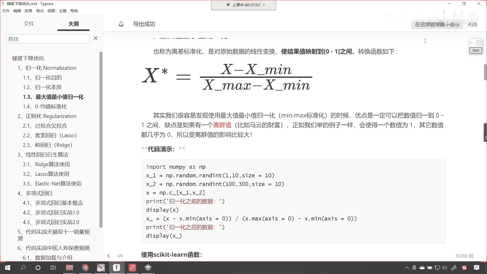
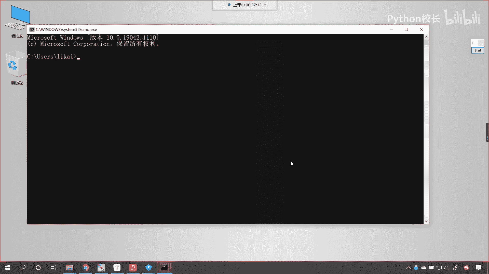
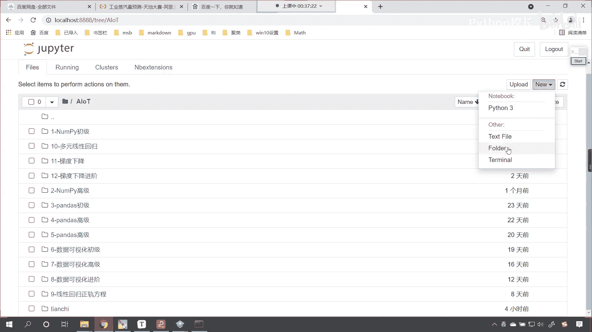
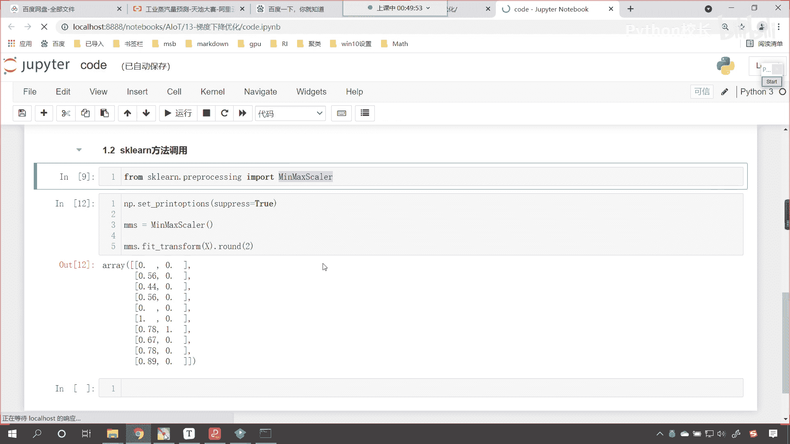

# P79：2-最小值最大值归一化 - 程序大本营 - BV1KL411z7WA

各位小伙伴，咱们呢还得需要是吧，根据我所举的这个例子，年龄和salary，把咱们这一部分内容，把这一部分内容你自己好好梳理一下，你梳理通顺了，你就明白不进行归一化是吧，它有怎么样的缺点，有怎样的不足。

是不是啊，所以说把这个自己再多梳理两遍好，那么咱们接下来呢我们继续往下看啊，好那么规划的本质呢，是不是就把数据映射到0~1之间呀，或者说把数据映射到一定的范围之内。

而之所以梯度下降优化时不能达到步调一致的，根本原因，其实还是x一和x2 的数量级不同，你想我的财富和马化腾的财富，那这个量级是不是不一样呀，对不对，那我的财富呃，马化腾的财富是以亿为单位进行计算的。

是不是，那我的财富呢可能就是以万为单位进行计算，是不是，所以大家明白啥意思了吧，好那么各位小伙伴呢，我们以后举例子呢，咱们尽量都举不同的人名，是不是啊，下回我就举比尔盖茨了是吧啊。

我们有小伙伴这个单位是圆是吧，那你更要好好努力学习是吧，把这个单位变成y，所以因为数量级不同，对不对啊，所以说你们呢就不是在一个量级上，对不对，我看问题的方式是吧，买的东西也不一样，对不对。

那机器学习当中，算法当中他也会遇到属性之间量级不同，那这个时候呢唉我们对它进行归一化，那咱们其实就是将这个不同的属性，把它的数量级给它进行统一扩展，一点来说，如果有更多特征的话。

咱们就是把各个维度的特征，我们呢对它进行数量级的统一，来做到呢无量纲化，接下来呢我们就看一下第一种规划的方式，这第一种规划的方式叫做离差标准化，我们最后得到的结果范围呢都是在0~1之间。

咱们有相应的转换函数，各位小伙伴在这儿你就能够看到，是不是让数值减去它的最小值，然后除以什么呢，最大值减最小值，现在你就能够看到咱们的分母上，是不是数据的最大值和数据的最小值呀，对不对。

那也就是分母是不是它最宽的一个范围啊，而咱们的分母上是它范围最宽的一个，一个一个数值，那咱们分子上是不是x减去x幂啊，这个时候你可以想一下是吧，你可以想一下我x什么时候最大呀，x什么时候最大。

x最大是不是就是x max呀，对不对，你看x max是不是啊，如果他要是x max，这个时候你想一下，我们计算出来的这个归化的数值，咱们是不是应该等于一呀，什么时候它最小呀，最小是不是就是x杠m对不对。

那如果要是x杠me，你想咱们分子上这个最小值减去x0 ，它是不是等于零，这个时候你想我们求解出来的值是不是就是零，所以说上面这个是最大值的情况，得到的数值是一下面是最小值的情况，得到的值是零。

那你其他的数值范围，不就是在x max和x min之间嘛，对不对，所以说咱们就可以加结果映射到哪里呀，我们是不是就可以将结果映射到0~1呀，无论你的数值多大或多小，我是不是都可以进行这样的转换呀。

对不对，那你看其实我们很容易就发现，咱们使用最大值和最小值归一化，优点呢，咱们是可以把数值规划到0~1之间，缺点呢如果有一个离群点儿啊，规划也是有这个缺点的，如果有一个离群点是吧，比如说马云的财富是吧。

或者说雷军的财富，那么我们在进行操作的时候，咱们就会就会发现因为这个值特别大，所以说那我们得到的这个情况呢，就可能这个特别大的值，算出来它是一其他的数据呢几乎都是零，所以说它受离群值的影响比较大。

现在呢看诶也就是说这个离群点马云是吧，把这个区间给拉长了，现在呢咱们回到代码当中。

我们为各位演示一下啊，来咱们windows r。

咱们启动一下主per notebook，现在呢咱们就进入代码，我们创建一个folder。

选中这个folder，咱们给它改个名，这个呢就是13。

这个是我们梯度下降的优化，咱们进入这个文件夹，进入这个目录当中，咱们创建一个代码，然后呢我们给它一个code，现在呢咱们给他来一个三级标题，这个呢就叫做最大值，最小值归一化，那么我们导一个包啊。

咱们import np，as np啊，然后的话我们就创建相应的数据好不好，那这个数据呢咱们起个名叫x1 ，就等于np。random，我们使用随机数rint，咱们让他从零到十，我们给一个size。

咱们让让这个size呢等于十，然后呢我们给一个x2 ，大家看这个x2 ，咱们让它的量纲不一样一些啊，那这个时候就是nt。random，咱们来一个run int，我们让他从1000是吧。

我们让他到5000，我们也给一个size，这个size也是十，现在有了x一和x2 了，那么我们将这两个数据给它合并一下，整体的这个x呢就等于np点，咱们调用它的一个方法叫c杠。

这个方法之前可能没有给各位小伙伴介绍过，今天咱们就给各位小伙伴介绍一下，你看我对它进行一个合并，这个数据长什么样，唉各位小伙伴就能够看到合并之后，这个是不是就是一个二维的数组呀，上面咱们生成的x1 。

这个呢是一维的，那咱们的这个x2 呢，唉它呢也是一维的，只要我调用c杠，咱们就可以将x一和x2 把它变成二维的，那我告诉你它是怎么变成二维的啊，看咱们也同样也画一个图啊，你看这个是不是就是咱们的x一啊。

这个是不是就是咱们的x2 啊，因为x2 的范围是不是从1000~5000，x一的范围是不是零到十呀，对不对，那这个np。c杠是吧，它就相当于咱们之前所学的方法，conquinnate。

哎它的一个这个变形嗯，所以说呢这两个一维的是吧，直接经过kkk，经过c盖是吧，它就合并成二维的了，好那么有了这个数据之后，你就能够看到这第一列啊，我们第一列的属性和第二列的属性。

它的这个数值是不是相差特别多呀，对不对好，那么这是归一化之前的数据，咱们接下来呢我们就进行一个归一化，根据咱们规划的公式，是不是分子要减去最小值，分母是不是最大值减最小值呀，那这个我们该如何操作呢。

哎那就是x咱们去求一下它的最小值啊，你看我求密执行，现在你就能够发现，你看我求得的最小值是不是零呀，对不对，你看求得的最小值是零，如果我们要不给参数，默认情况下它求的是所有数据的最小值。

所有数据的最小值是不是就是零呀，那其实呢我们再去求解的时候，咱们求最小值，我们应该是求第一列的最小值，再求第二列的最小值，这第一列呢它表示数据的一个属性，第二列呢表示另外一个属性。

就好比咱们课件当中所讲到的，你看年龄它是不是一列呀，薪水是不是一列呀，我们在代码当中举的例子，咱们虽然没有给量纲，但是呢我们给的这个数据大小，各位一看就不一样，是不是，那我们怎么去给它指定呢。

通过轴这个参数轴就表示计算方向，各位这个时候你就能够发现我给轴等于零，大家看我是不是把第一列最小值求解出来了，我是不是也将第二列的最小值求解出来了，好那么有了最小值了，咱们就x减去它，看x减去它。

然后来一个小括号啊，然后来一个小括号，然后我们做一个除法，那这个除法就是分母上的数据了，分母上咱们是不是找一个max呀，对不对，max同样也得给给他指定一个计算方向，那就是xx等于零，然后减去x。

m axis，让它等于零，这个时候我们所得到的这个结果，它就是归一化之后的一个数据，咱们起个名叫nm，这个nm呢就表示归一化，此时呢我们打印输出一下来，这个时候各位小伙伴来看一下。

看这就是归一化的这个结果，归一化的结果各位就能够发现，你看咱们所得到的这个数据是不是都是小数了，这个小数保留的位数，咱们给它调整一下啊，我们就叫rain的，咱让它保留两位小数吧，看起来就稍微舒服一些。

来各位小伙伴，你来看咱们所得到的这个数据，有什么样的区别呢，原来你看没有进行归一化之前，这两列数据它的差距是不是特别大呀，咱们经过归一化之后，你看它们的范围都在哪儿到哪儿呀，是不是都在0~1之间呀。

对不对，为什么我们这个数据得到的值是一呢，你看它是不是对应着数字九，数字九，你想一下是这一列当中的最大值，是不是哎，那他得到的结果经过归一化公式的计算，是不是刚好是数字一呀，对不对。

哎所以说你看经过归一化之后，看咱们在这儿呢进行一个说明，这个就是咱们规划的一个结果，我们就发现是吧，咱们是不是就统一量纲了，这两列它的范围都是，你看这两列，它们的范围是不是都是0~1之间呀。

你可以想一下，如果要进行梯度下降的话，咱们下面这个速度是不是更快，那我们经过规划之后，这个数据它就相当于咱们上面这个数据，你看我们可以用下面这个数据来替代，上面的数据，因为下面这个数据我是根据每一列。

它数据的最大值最小值进行了一个缩放，咱们这个呢叫什么，看咱们再来一个说明啊，咱们是根据每一列是不是进行缩放呀，看我们呢是根据每一列来进行缩放，所以说呢这个时候就实现了一个归一化，简单不简单。

咱们刚才在课件当中，我们说到了这样的一个问题，说有离群值，比如说马云的财富是吧，特别大，就会导致这样的一个结果，会使一个数值是一，其他的数值都是零，来在代码当中我为你演示一下，好不好好。

那比如说啊看咱们在这儿呢，我们插入一个四级标题，咱们呢就演示离群点，刚演示咱们的离群点，那想要演示离群点的话，咱们就给x当中某一个数值，咱们把它变得特别大，比如说我将这个我将这个1961是吧。

这个位置咱们把它变得特别大，那这个时候呢咱们找到这个位置啊，好那么我们看一下它是1961是第几个啊，一个两个三个四个五个六个七个，那它的索引就是六，然后它它的这个列索引就是一。

我们把它变成什么样的一个值呢，哎那咱们就给这么大的一个值好不好，这个时候你看我一执行这个x，各位小伙伴就能够发现，你看这个地方是不是就变得特别大了，此时呢咱们继续对它进行规划计，算，上面的代码复制一下。

看上面的代码，复制一下，代码都不用变，这个时候你看我一直行，来，各位小伙伴有没有看到差别呀，因为这个值它是异常值，看到了吧，我们这个当中就有一个异常值，如果这个当中有一个异常值，咱们要进行规划计算的话。

你看就它计算出来等于一，剩下的是不是全部都变成零了呀，对不对，就是我们现在这个班级里边的财富是吧，咱们要是跟比尔盖茨比起来，咱们其实都是零，对不对，哎所以说呢咱们这个嗯咱们这个这个最大值，最小值归一化。

在进行操作的时候呢，哎我们需要嗯这个把离群点儿，把这个数据呢给它清洗掉是吧，把它删除掉，上面呢咱们使用了自己的自己写的公式完成了，那我们接下来使用sk learn当中的方法，为大家演示一下啊。

来咱们把上面的双击合起来啊，嗯咱们呢再来一个四级标题，叫sk learn方法调用，好那么这个也很简单，咱们就导一下包就行了哈，那就是from sk learn呃，它里边儿有具体的一个包。

叫做pre processing，这个就是数据预处理，咱们就导入，咱们就导入me max scale，你看这个是不是最大值最小值呀，skylar是不是就有缩放的意思呀，那我们就声明一下它啊。

mm就等于mean max scr好，有了mm之后呢，咱们依然使用上面这个工具好不好，依然使用上面这个工具，依然使用上面的数据，这个时候咱们就调用fit transform就可以了。

feat就有训练的意思，transform就有转变的意思，咱们直接将上面的x传进去，这个时候你看我一直行，唉大家看这个数据是不是就出来了，咱们此时所得到的这个数据，大家看他是不是一个科学计数法呀。

如何让它不显示科学计数法呢，调用np点，set print options，里边有一个参数叫suspress，我们给一个true，这个时候你看我一直行，大家看这个结果是不是就出来了。

是不是这个结果你看和上面一样不一样，看和上面一样啊，完全一样啊，只不过这个时候，如果说我要再调用一个保留位数round 2，这个时候你看和上面是不是就完全一样了，看0。890。78，看到了吧，0。

890。78，是不是，所以说咱们调用sk learn当中的这个方法，它呢就可以实现最小最大值，最小值的归一化好。

