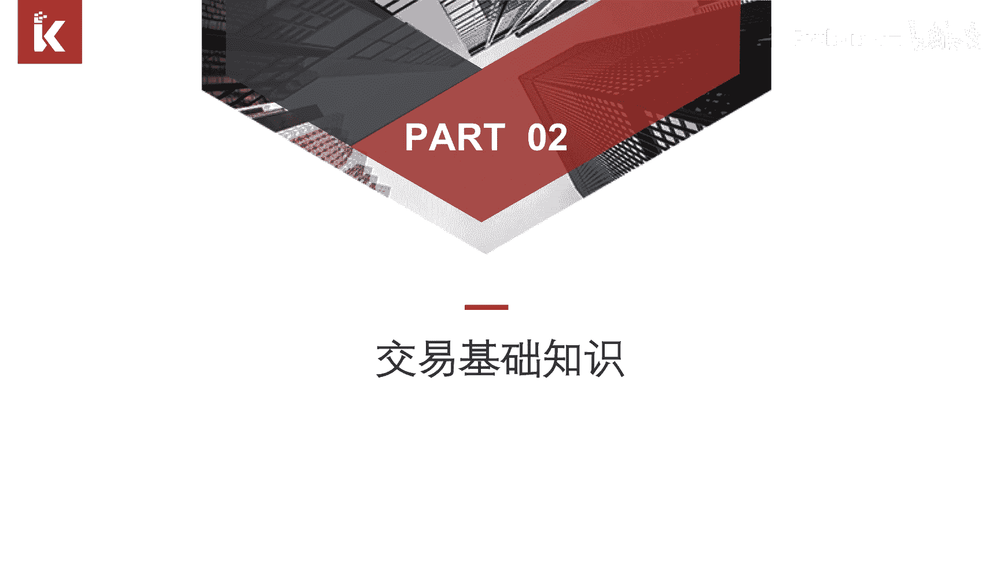
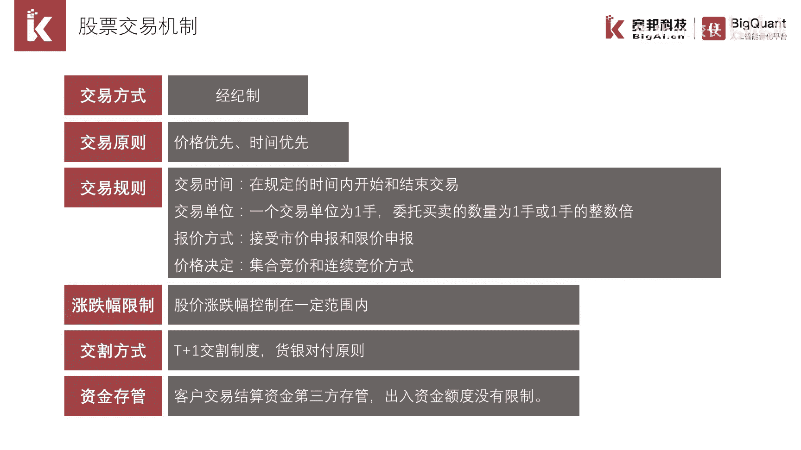
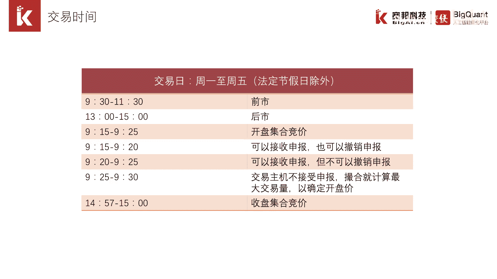
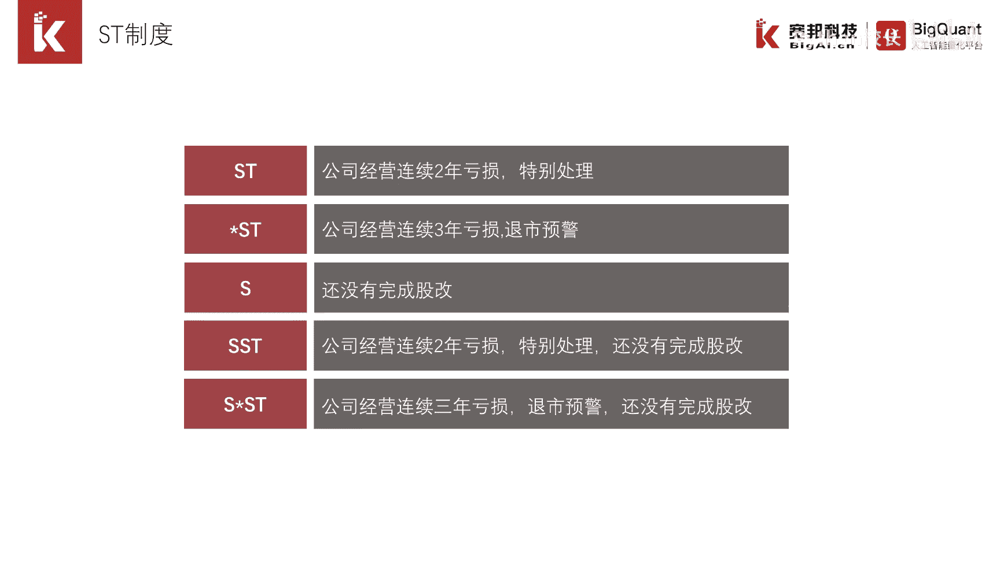
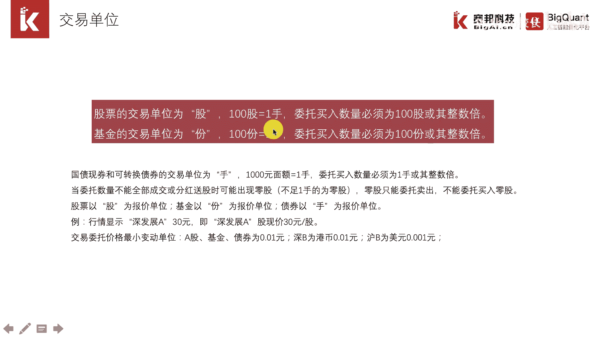
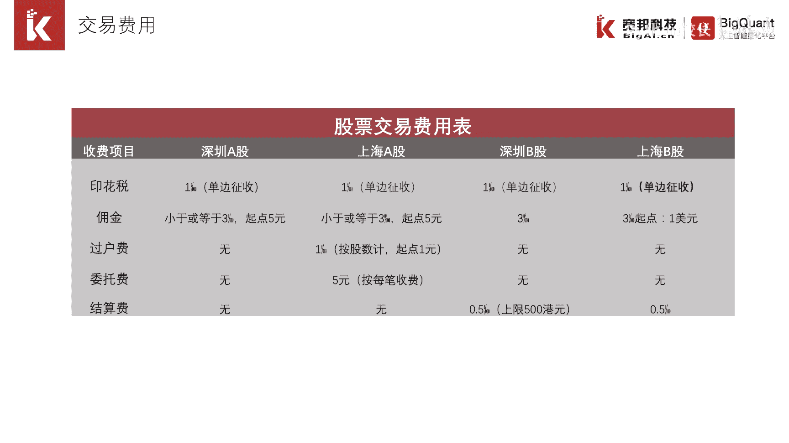

# P8：1.3.2 交易基础知识 - 程序大本营 - BV1KL411z7WA

大家好，本节我们介绍交易相关的基础知识，交易是股票的买卖，上交所和深交所是实际交易的设计和指导方，了解相关的交易机制呢，不仅可以指导我们实盘交易，还能帮助我们更好的在回撤中开发交易策略。

我们现在也看股票交易机制，股票是按照价格优先和，时间优先的原则来进行参加，因此如果我们为了争取成交的话，可以以涨停价进行挂单，如果我们想获取更优的成交价格，那么我们需要在时间上进行一个拼抢。

详细的交易机制。

我们接着往后面看，集合竞价就是交易所对买单和卖单进行，一次性集中撮合，连续竞价是指交易所对买单和卖单进行连续撮，合，撮合的原则，就是按照价格优先，时间优先的原则，股票交易在固定的时间段。

目前开盘和收盘都是采取集合竞价的制度，这样做是为了防止开盘价和收盘价，这两个比较重要的价格，有某些个别的交易所影响，在开盘集合竞价前五分钟，不能简单以挂单来判断股价走势，因为订单可以撤销。

之前一篇研报讲述过高频策略研究中，凑单比例就是一个非常不错的一个因子。

s t是特殊处理的意思，指的是交易所对某些股票进行特殊处理，打上一个标签，便于广大投资者在买入该股票的时候引起注意，s t就成为了一个特别的一个因子，比如我们在确定股票池的时候。

可以按s t因子进行一个过滤，这样就对股票池进行了一个初选，不选st的股票。

t加一制度，是我国不同于美国股票市场的一个重要机制，简单的说就是今天买入的股票今天不能卖出，明天才可以卖出，t加一制度，也是影响股票高频交易策略和日内交易策略的，一个非常重要的因素，正因为提前一的制度。

所以说股票高频策略的比重，远远低于期货高频策略，因为气候我国是t加零的制度，今天买入，今天可以卖出，涨跌停制度，是指每天股票的涨跌都在一个幅度范围之内，这样的规定是确保股价的日内波动，不会过于单边走势。

如果不加以限制，比如现在的美股和港股，我们经常能听到说，某某股票因为爆出一个重大的利空，股价暴跌50%甚至90%，在实际交易的过程中，如果有个订单不在涨跌幅度之内，那么这个订单就会被称为废单。

在股票量化策略的开发中需要注意几点，涨停的股票未来继续涨停的概率较大，因此诞生了不少追涨停的策略，如果股票一直涨停，那么当天的买单在回撤中是无法买入的，这里要特别注意，否则会高估策略收益。

失去策略参考价，值交易单位指的是在股票的实际买卖中，是按手进行度量的，一手等于100股。

股票的交易费用是一个非常重要的一个话题，在之前的章节我们介绍到，如果低估的交易费用，很容易得到一条收益率虚高的资金曲线，美化了策略的实际效果，因此设置一个合理的手续费至关重要，目前一般的设置是买入万三。

卖出1。3‰，按成交金额计算，手续费如果不足五元，按五元计算，通常在评估一个交易策略的时候，经常会对手续费进行敏感性的测试，比如不断提高手续费的一个比率，看看对策略收益率的吸食情况。

如果收益率下降的不是很厉害，那么可以认为策略是比较稳健的。

