# P80：3-Z-Score归一化 - 程序大本营 - BV1KL411z7WA

我们继续往下看。

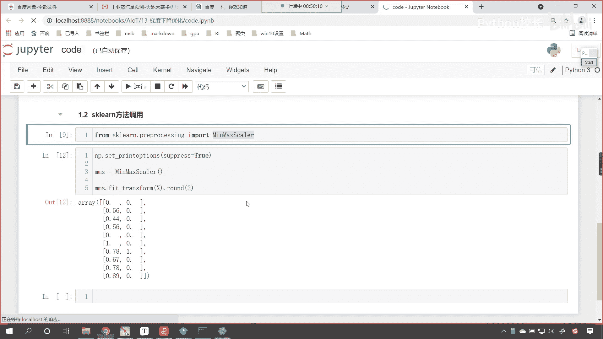

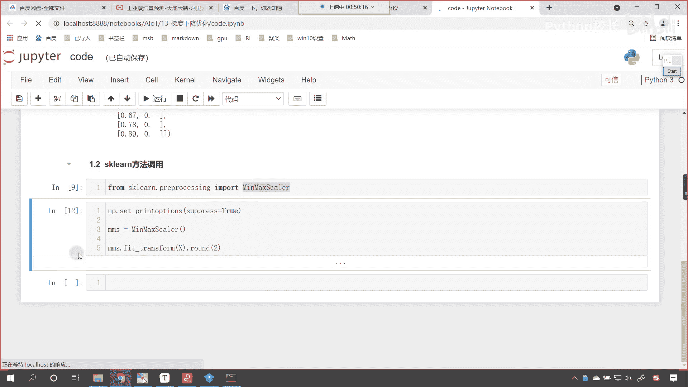

好那么还有一种方式叫做零均值标准化，我们的规划也叫标准化，你看咱们各个国家，我们使用的钱是不是不一样呀，咱们在中国，咱们使用的是人民币，到了美国是美元，到了欧洲的话，是不是就是欧元呀。

到了小日本是不是就是日元，对不对，你想这各个国家的这个货币不一样，是不是我们在进行出国旅游的时候，你是不是是不是需要把这个钱兑换一下呀，你想利率是不是不一样，兑换的这个系数是不是不一样，对不对。

那你看就是我们人民币是吧，六块多是不是才能够换一美元呀，对不对，所以说这个时候各个国家呢，他就制定了一个标准，制定了一个汇率，是不是啊，然后呢这个有了这个汇率呢，咱们的钱呢就可以进行一个这个标准化了。

就可以在国际市场上流通了，同样的在咱们的这个代码当中，看，在在我们这个算法当中，我们属性之间的这个单位量纲是不一样的。

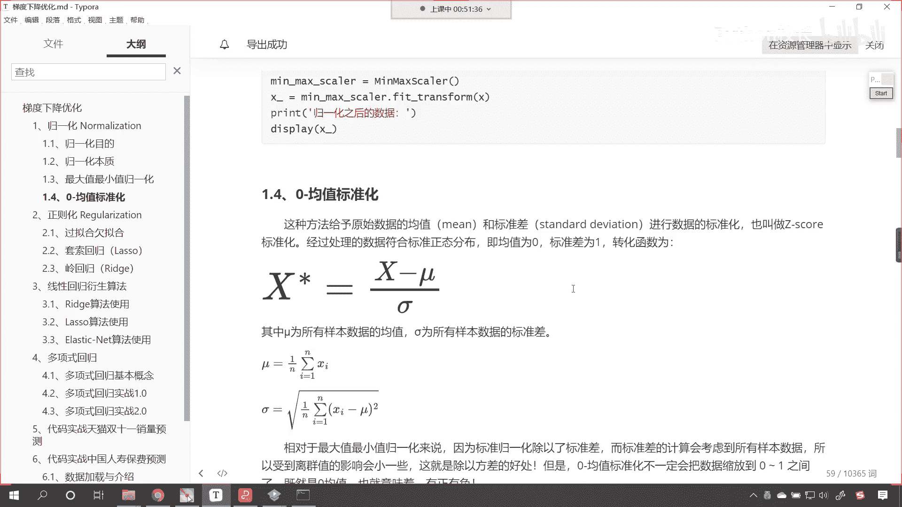

你像年龄是36岁，42岁，咱们的薪水是7000元，2万元，3万元，是不是，那这些呢他们的单位不一样，那我们对它进行的操作，咱们可以把它叫做归一化，这为啥叫归一化呢，无论你的数量是多大多小。

其实我都把你变成了0~1之间，所以说这个叫归一化，就是其实你无论在中国也好，还是在美国也好，其实你挣了钱是不是都是去买东西啊，购物消费是不是啊，唉这个概念是一样的，所以说呢唉进行归一化。

那你要是换算成钱，对于不同的国家而言，那我们可以把它叫做购买力，是不是，你比如说你在中国挣一块钱，购买力是多少，你在韩国挣一块钱是吧，购买力是多少，是不是，所以说这个国家之间是吧，哎他需要一个这个汇率。

我们数据之间呢需要一个归一化，那这个归一化还有一个名字就叫做标准化啊。

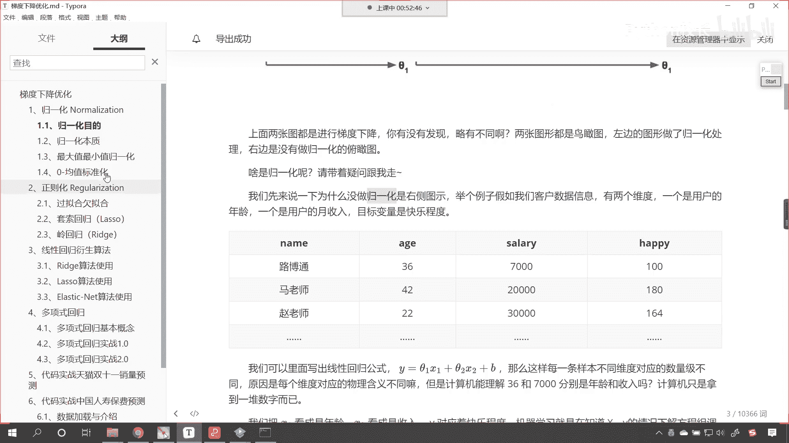

归一化还有一个名字叫标准化，意思是一样的，这种方法呢也叫z高标准化，那么它的处理方式处理之后，这个数据呢它是符合正态分布的，那我们知道这个正态分布也叫高斯分布，咱们很多数据是不是都符合正态分布呀。

对不对啊，身高体重智商唉都是正态分布，所以呢咱们在进行机器学习算法的时候，我们最好将数据把它变成正态分布，这样的话我们就能够找出数据，它内在嗯所关联的这个特征，那我们嗯这个零均值标准化。

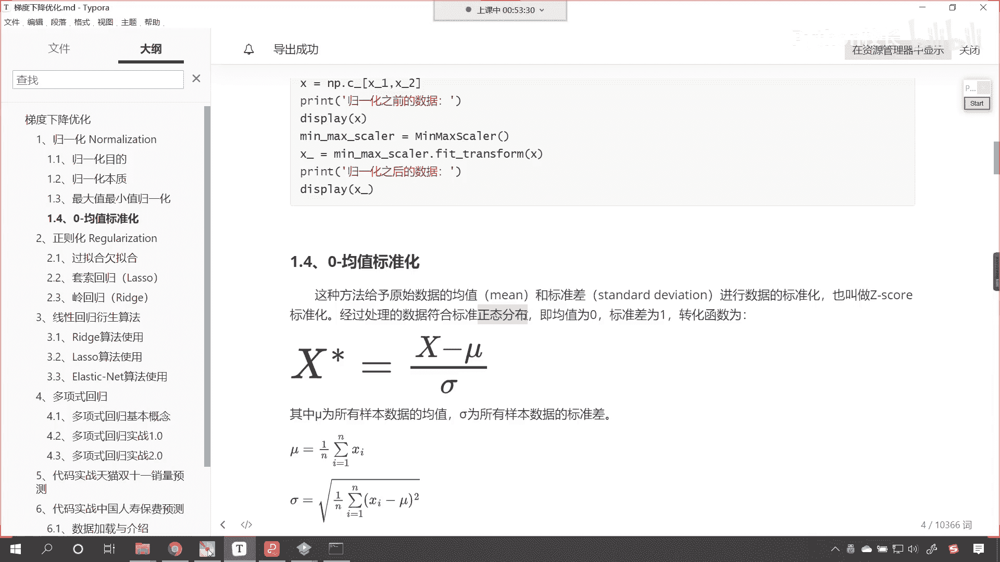

咱们所对应的函数所对应的公式是什么呀，大家看就是这个公式，我们上面最小值最大值，咱们是不是分子上减最小值，分母上是不是最大值减最小值呀，那在这在这个里边是吧，咱们给了一个mu。

这个mu呢就表示所有样本的均值，也就是平均值，那这个西格玛这个符号叫西格玛，他呢为所有样本的标准差，那我们的均值其实就是所有的数据加和，是不是除以n分之一，这个简单不做介绍，还有一个西格玛。

这个西格玛是什么呀，是不是xi减去mu的平方求和n分之一，然后来一个开平方呀，看了唉，来一个开平方，是不是，那我们经过零均值标准化之后呢，它的范围就不是0~1了，知道吗，这个范围可以出现负数。

为什么会出现负数，你想咱们的分咱们的分母一定是一个正数，而咱们的分子有可能是正，有可能是负，看到了吧，因为x减去平均值，你想我们在进行统计的时候，是不是有比平均值小的数值啊，数值呀。

是不是也有比平均值大的数值呀，如果要比平均值大，他俩一相减是不是得到一个正数，如果这个x比平均值小，是不是得到一个负数呀，所以说咱们经过零均值标准化之后，咱们得到的这个数据它是有正负的。

但是呢这一列数据看这一列数据，咱们经过这个零均值标准化之后，那么咱们的数据呢是呈现正态分布，这个正态分布的均值是零，标准差是一好。

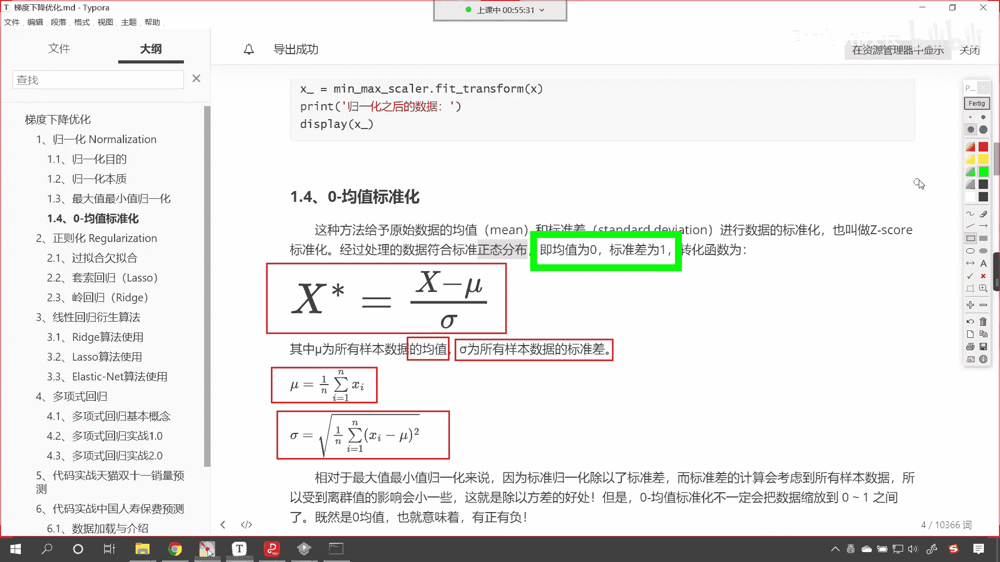

那么这个是对应的公式，这个公式呢也不是特别难是吧，你看我们说了，因为因为它有均值是吧，那就意味着有的比它大，有的比他小，所以说它会存在正负之分，现在咱们就在代码当中来。

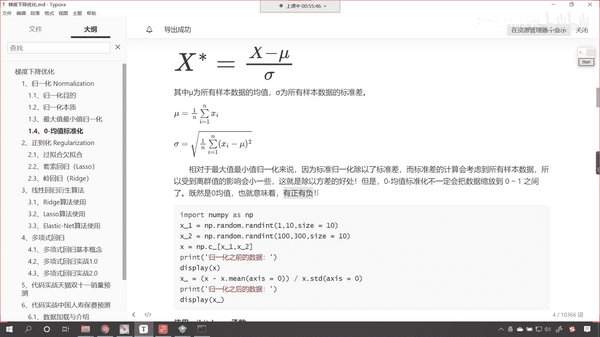

我们进行相应的一个演示啊，来进入代码，咱们在这儿来一个三级标题好，那我们这个三级标题呢嗯就叫做z sc归一化，它也叫做标准化，好那么上面这个代码呢。

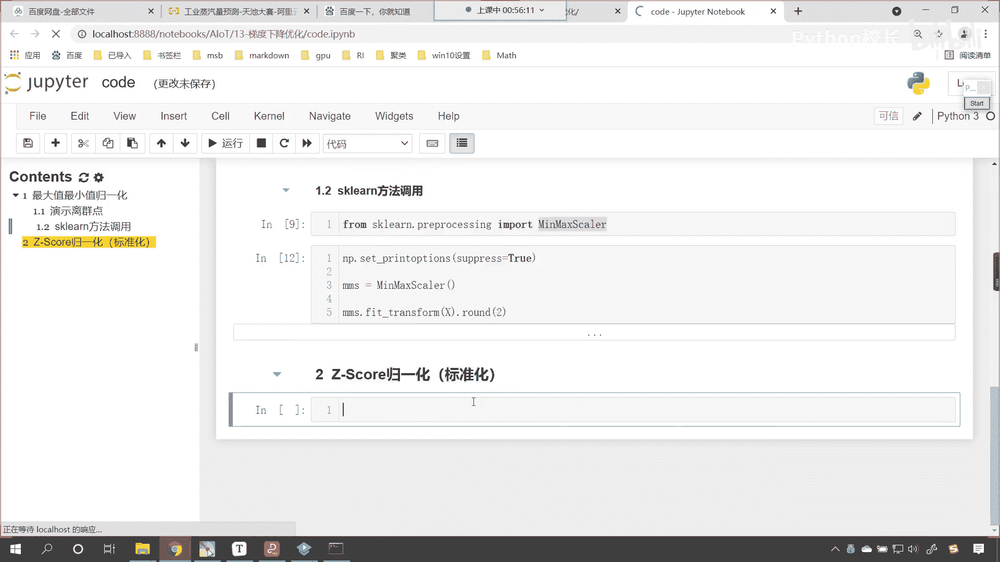

咱们就可以给他关闭掉了，那这个z score归一化，咱们也来进行一个操作啊，这个时候呢咱们就import numpy as np，这个时候呢我们创建一个数据，x一就等于np。random。

咱们调用run int，我们从嗯咱们从零到十，我们给一个size，我们让这个size呢是十行一列，然后咱们再给一个x2 np。random，咱们调用run int这个方法。

那这个数值的范围我们给的大一些啊，比如说啊这个这个数值的范围呢，咱们从1000是吧，我们让他到1万，然后逗号咱们也给一个size 10和一，那这两个数据咱们把它合并一下吧，合并之后这个数据叫x。

咱们是不是就可以调用np。conquinnate呀，x一放进去，x2 放进去啊，然后呢逗号怎么合并呢，这个时候你看我执行输出一下这个x，看这两列是不是就合并了呀，看到了吧，我们既可以使用conquit。

这个常规的方法进行合并，咱们上面的合并是不是用了c杠，这都可以啊，都可以好，合并之后咱们就进行最大值最小值归一化吧，好那根据公式是不是x，首先我们要求一下它的平均值，你看如果我一求平均值。

咱们这个当中不指定它的轴，不指定它的计算方向，那么我会把所有数据求平均值，这个时候你看我执行一下啊。

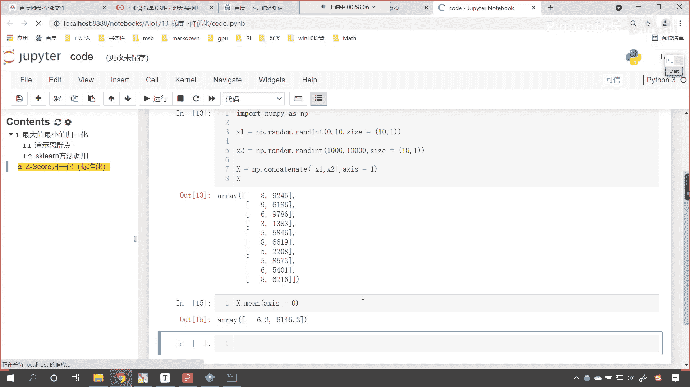

咱们指定一个轴，让它等于零，这个时候各位小伙伴就能够发现。

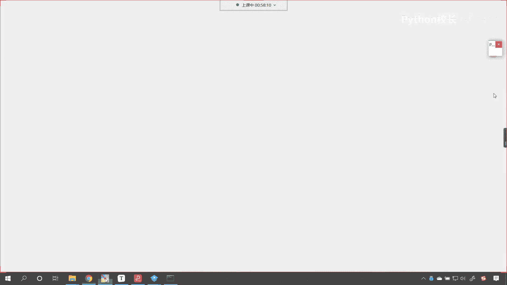

咱们第一列是不是就计算出来了，你看这第一列数值比较小，求解出来的是不是就6。3，这第二列咱们的数值范围比较大，求解出来的平均值是不是就是6000多呀，对不对好，那么有了这个数据了。

咱们就根据公式是不是x减去它呀，对不对，x减去这个数据，那x减去这个数据之后，我们再除以分母，咱们的分母是谁，分母是标准差，标准差np提供了函数，咱们直接调用就行了，x叫x。x t d啊。

调用这个方法就行了，这个就是标准差，那这个标准差呢，我们在计算的时候也得给一个轴，让它是零，计算之后咱们得到的这个结果，我们起个名就叫做norm，咱们打印输出一下啊，n o r m好，执行这个代码唉。

各位小伙伴就能够看到，咱们这个结果是不是就输出了，看到了吧，在这个结果当中，大家能够看到是不是有正有负呀，看到了吗，这还有负的，这还有正的1。5，那我们还要负的1。84，是不是看到这个负的1。

82是不是好，这个就是我们得到的规划的数据，咱们使用z score规划，这个应该更加科学啊，应该它的这个性能应该更加好，刚才呢我们在课件当中介绍了。

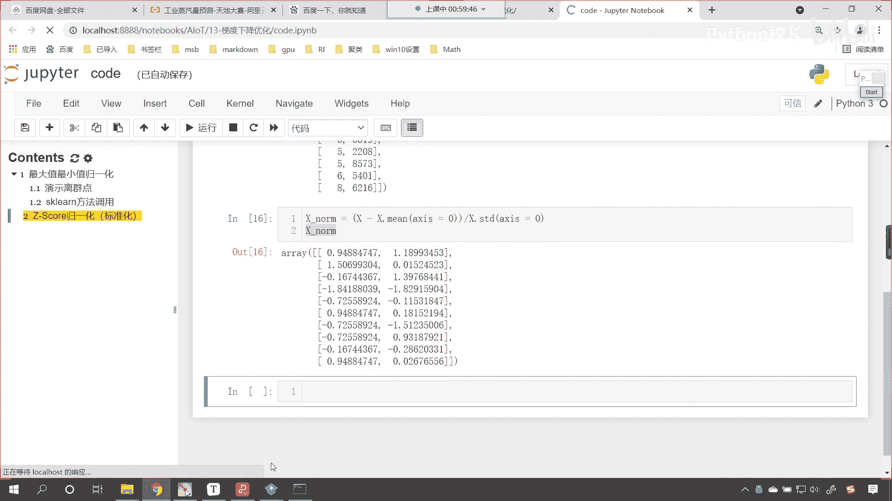

咱们经过零均值标准化之后，咱们处理的数据它是符合正态分布的，我们说均值是零，标准差是一，咱们验证一下啊。

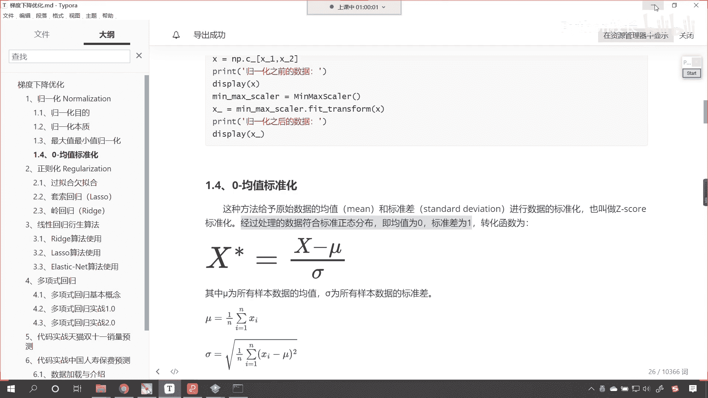

看在这儿我们进行一个说明，这个规划的结果，啊它呢是一个正态分布嗯，它的平均值是零，标准差是一，是不是呢，来咱们x下划线nm求一下它的平均值，me同样也得指定轴，让这个轴等于零，这个时候你看我一直行。

来各位小伙伴，你能够看到这个结果是零零，是不是，那为什么这个地方带了一个负呢，唉说明呢我们这一列嗯进行求和求平均值，它是一个特别接近于零的小数，所以说它是呢它是特别接近于零，但是呢它在零的左边。

所以说他带一个负号，而这个呢它是在零的啊右边，所以说它就是正号，正号的话是不是默认不写了，对不对，你只要靠近零唉那我们呢这个保留相应的位数，其实它是不是就是保留一定的精确度，它的平均值是不是就是零呀。

那我们再计算一下它的标准差，那就是x norm点，咱们调用它的s t d，然后给一个轴，让它等于零，这个时候你看我一执行得到的结果是多少，是不是一和一呀，对不对，哎这个时候呢各位小伙伴就能够看到了。

经过咱们z car这种归一化，咱们所得到的数据呢，它就是一个正态分布的数据，我们说大自然神奇的，大自然为我们创造的很多数据，是不是都是正态分布呀，我们一旦把它转换成正态分布，咱们在进行相应操作的时候呢。

唉我们呢，嗯这个更容易找到数据内部的一些规律好，那大家看这就是咱们z score的这个规划。

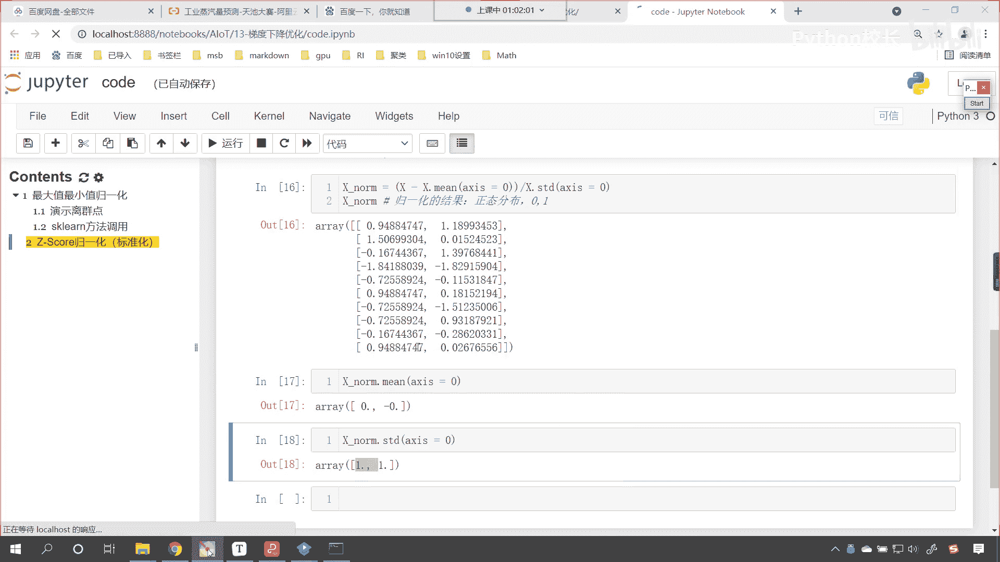

那上面这个代码呢，上面的代码是我手写的，是不是哎咱们呢这个叫做根据公式进行计算，对不对啊，根据公式进行计算好。

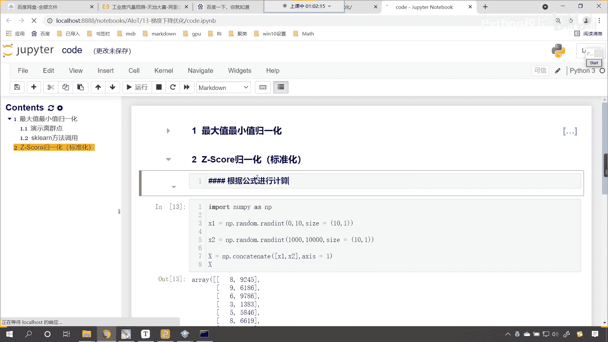

那么我们还有一种方式，咱们是不是也可以直接导包呀，咱们也来一个四级标题，现在的话咱们就使用相应的sk learn当中，导包是吧，我们来进行计算好，那咱们就使用sk learn这个库来进行计算。

那我们就导一下包吧，那就是from sk learn，点preprocessing，咱们import这个叫做standard的scale，在这儿呢咱们进行一个说明啊。

这个preprocessing就是预处理，按ctrl v翻译成中文叫做预处理，他对谁进行预处理啊，对数据进行预处理，那我们得到了这个之后呢，咱们声明一下啊，就叫做standard。

就等于standard scale，创建这个对象，那我们呢就使用这个standard的，咱们调用feet这个方法，这次呢我们就分两步来对它进行操作，好不好，feat一下，把咱们的数据x放进去。

大家注意啊，这次是分两步，咱们的第一步，看我们就进行训练，你feat完之后呢，训练好了，咱们紧接着呢，standard的s t n n d，咱们进行transform，我们将x放进去。

那么他得到的结果咱们起个名字叫做norm 2，打印输出一下咱们的norm 2，这个时候你看我执行，和上面的结果是一模一样的啊，看和咱们上面的结果是一模一样的，上面这个结果第三个数是负的0。16744。

看咱们这个负的0。16744，是不是一模一样啊，对不对，那我们既可以分开写，咱们呢也可以合到一起写啊，这是第二步，第二步的话它呢就是转换，看到了第二步就是进行转换，两步分开写。

可以咱们怎么样直接写到一起也行，那就是standard feet transform，那这个就是两个方法进行了合并啊，这就是一步是吧，一步进行转换，这是一样的啊，等效的啊，好，那么各位现在就能够看到。

我们呢是不是就进行了相应的这个操作呀，对不对，好嗯。

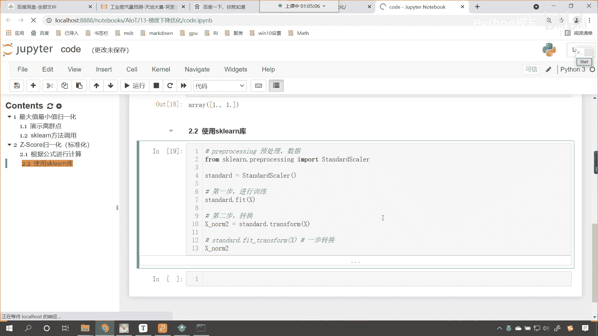