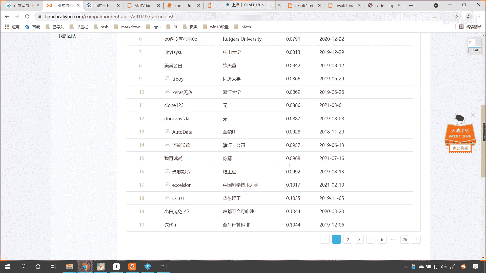
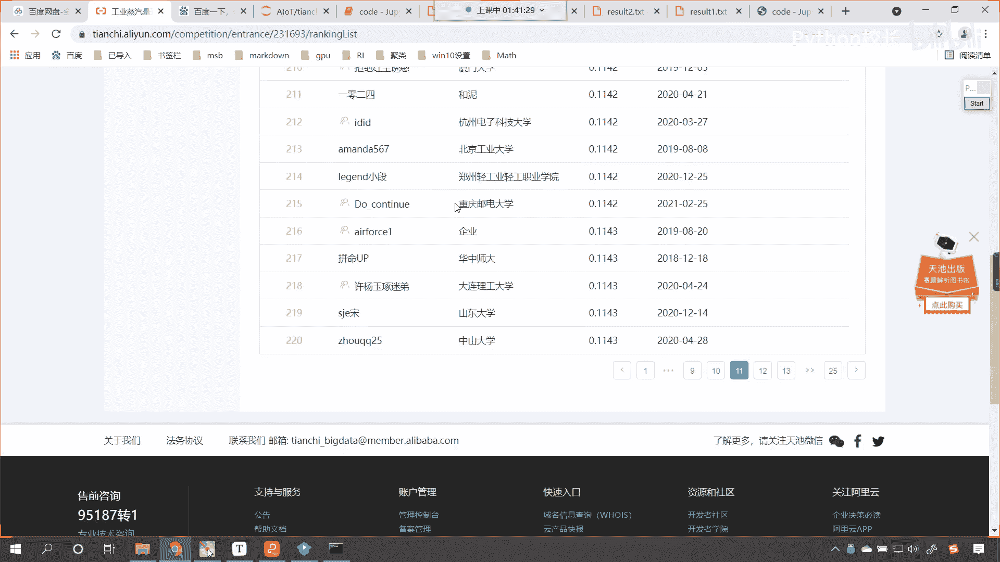
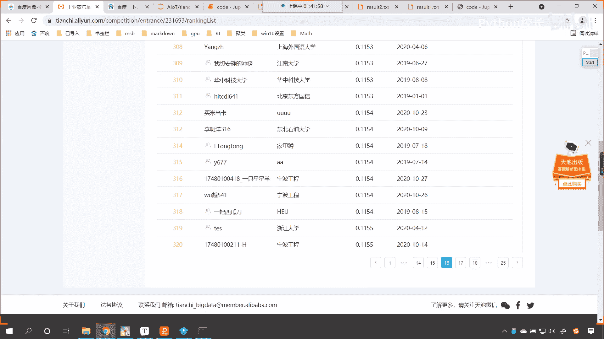
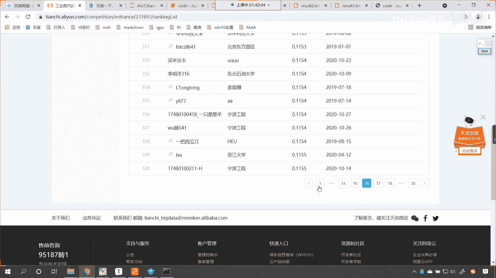
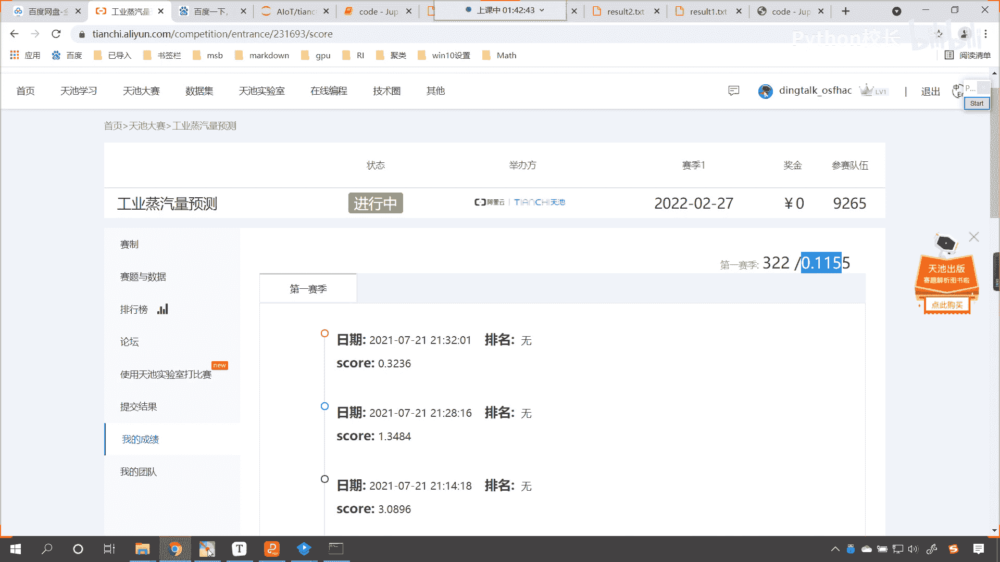
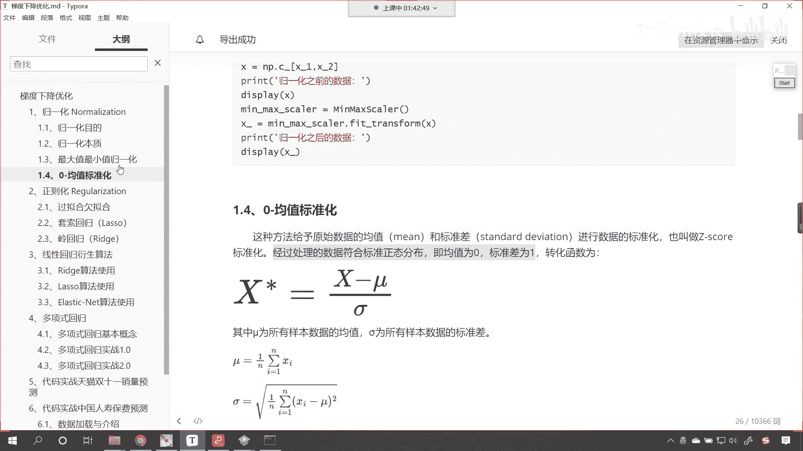
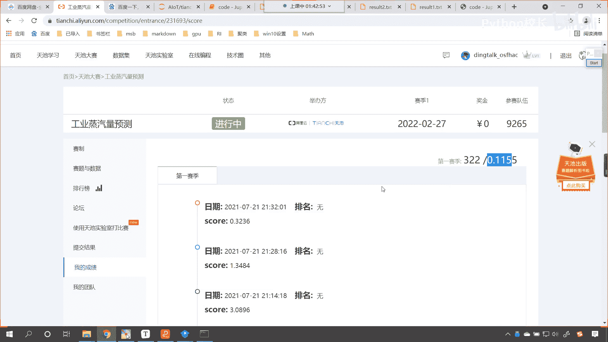

# P82：5-天池工业蒸汽量项目归一化实战（二） - 程序大本营 - BV1KL411z7WA

我们就调一下啊，看一下我们的规划，他为什么就没有成功，是不是啊，那么我们就看最大值最小值归一化好不好，咱们的最大值最小值规划，我在这个地方呢咱们进行一个操作啊，你看上面是没有经过规划的，是不是啊。

我display一下，咱们就将x train查看一下它的前五个好不好，下面呢是咱们经过规划的，对不对，那么我们在这个地方咱们display一下，将x下划线train norm放进去。

我们也给一个head h e a d，也查看一下它的前五个，咱们在这儿呢进行一个对比，唉此时我执行一下这个代码，咱们看一下第几行，第18行代码是吧，第18行代码x train norm。head。

那这个时候咱们就发现经过这个规划之后，咱们得到的是一个囊派了，那此时是不是就不能调用它的head的方法了，既然是一个np了，咱们在这个地方对它进行切片是吧，我们切到五个，这个时候我们看一下啊。

此时咱们这个嗯，此时大家看咱们这个代码，就可以进行相应的这个展示了，是不是啊，我看一下啊，0。780。75，这个是，那我们此时呢，咱们再查看一下他数据的这个形状啊。

嗯大家看我train的结果也进行了规划，在这里你就能够看到咱们me max scale，m m s是不是对他对这个训练数据进行了规划，然后呢对于测试数据也进行了规划，我们都进行了相应的一个这个规划啊。

这个x train norm，这个外传nm，咱们呢都进行了归一化，看到了吧，在这都进行了归一化，呃我们再简单的对比一下啊，得到的结果是0。79，第二列是0。7，20。5，20。6，八，0。69，0。

47，这个目标值呢，咱们的目标值呢是不需要进行归一化的啊，呃现在呢我们能够看到它相应的一个结果，咱们就发现确实是有了一定的变化，对不对呀，有了一定的变化，但是我们使用线性回归，咱们在进行训练。

咱们在进行预测的时候，那么我们发现归化和不归化，咱们得到的这个结果是完全相同的啊，此时我看一下啊，0。26825457，0。26825457，那咱们一起来调一下这个bug，嗯在下午的时候呢。

我专门进行了相应的测试，咱们在这儿看一下，咱们这个看一下咱们这个操作啊，嗯我看一下咱们相应的这个操作，是怎样一个进行好，咱们嗯大家看他这个地方，咱们调用的这个这个操作呢，这个地方也是加载这个数据。

对不对呀，上面这个数据呢，咱们其实和咱们刚才写的代码是一样的，那么在这个地方呢咱们使用了apply啊，我们使用了这个相应的这个apply这个方法，那我们在这儿看，咱们在这个地方调用的这个方法。

其实就是叫d f normal啊，我们在这个地方就是调用了一个这个df杠，normal，那这个df杠normal呢，其实我们调用了之前pandas所学的方法，那这个pandas所学的方法呢。

嗯在这里各位小伙伴就能够看到，咱们是x n p。m，然后除以np。s t d，咱们是不是调用了这样的方法呀，对不对，这个就是z高，然后呢对它进行相应的一个这个创建啊。

现在呢咱们知道这个它有啥不一样的地方了，我们也能够发现，你看咱们是不是对所有的数据都进行了一个，归一化呀，当我们对于df当中的特征值进行了规划，咱们对于df当中的这个目标值，我们也进行了归一化。

所以咱们现在呢回到我们的代码当中，咱们继续来对它进行相应的一个转换啊，来回到咱们的代码当中好，那么我们不进行归一化，咱们已经看到了这个分数比较低，是不是，咱们接下来呢。

我们进行这个最大值和最小值的这个归一化，那此时我们在进行规划的时候呢，我们不仅仅对咱们，不仅仅对咱们的这个训练数据进行归一化，同时呢还对于咱们的目标值进行一个归一化好，那么这个时候呢看咱们规划呢。

来我们在这里把这个代码重新给它调整一下啊，我们创建mm，然后这个时候呢咱们就调用mm，咱们feat transform，咱们呢将x下划线train放进去，对它进行归一化。

得到一个结果就是x train normal，那么对于我们的训练数据进行了规划之后，然后在mm s。feat transform，咱们将它的目标值也来进行一个规划，得到的结果就是x tra。

嗯就是这个呢就是得到的结果，就是外出下划线nm，然后呢咱们再将测试数据也来进行一个规划，m m fit transform，咱们将呢x下划线test放进去。

得到的这个结果就是x下划线test gu nm，好，这个地方各位小伙伴就能够看到，我们是不是就进行了嗯，这个训练数据和测试数据统一，进行了一个归一化呀，那么归一化之后。

咱们就训练和预测这个地方我们稍微修改一下，那就是x train normal，以及呢咱们y train normal，预测数据呢还叫做x test normal。

此时呢咱们依然把它保存到result 2当中啊，原来的数据会被覆盖，这个时候你看我一执行，呃咱们看一下啊，咱们except 2 d啊，这就说明我们，这个呃外衬这个数据不太对，是不是。

那外衬这个数据不太对呢，咱们调整一下啊，因为外传咱们得到的是一层的target，我们再给他来一个中括号，那再来一个中括号，我们说一个中括号和两个中括号，得到的数据形状是不一样的，是不是。

这个时候你看我再来执行，大家看此时咱们这个数据是不是就得到了呀，看到了吗，此时这个数据就得到了，得到了这个得到了这个数据之后呢，呃我们进行一个上传啊，好得到了这个数据之后，咱们呢进行一个上传。

回到咱们当前目录下，咱们看一下咱们这个result 2是吧，此时这个数据就变成什么样了，此时这个数据就没有负的这个数值了，是不是啊，那我们就上传一下啊，嗯稍等啊，在上传之前呢，我来看一下。

我的这个最大值最小值归一化，我是如何进行操作的啊，咱们是对于整体进行了一个操作，操作完之后的话，得到它的数据，得到它的目标值，你看这一行代码，各位小伙伴，这一行代码。

咱们呢其实就是进行了这个me max这个标准化，把所有的数据进行了最小值最大值，然后咱们获取它当中的数据，获取了这个数据之后呢，我们得到测试数据，咱们对于测试数据也进行了相应的这个嗯。

也进行了相应的这个最大值，最小值，这个归一化好，那么此时这个代码咱们上传一下，我们再来进行一个对比啊，提交结果，点击提交是吧，我们依然选择result 2，然后呢回到我的成绩里边儿。

咱们此时呢我们在这儿刷新一下啊，可能需要等个十几秒，然后这个成绩呢就会出现，唉所以我们稍微等一下诶，各位小伙伴有没有看到一个结果呀，有没有看到一个结果，你看咱们这回的得分它就变成多少了，是不是就是1。

348呀，好我们呢画图来进行一个说明啊，你看啊，这个1。348是不是我们经过归一化的呀，对不对，看这个1。348是我们经过归一化的，这个是不是最大值最小值归一化呀，对不对。

那刚才我们提交的咱们是不是归一化没有做好，没有没有做好规划，是不是就相当于没有进行规划呀，没有进行规划的时候，各位小伙伴就能够看到这个分数是多少，看到了吧，这个分数是不是3。089呀。

是不是要比它大多了呀，我们说了，咱们这个得分呢是越小越好，你看我的这个这个右上角这儿啊，如果你要分数要能够达到这个0。115，你你就是322名是吧，这个想要往前啊，这个继续提升是吧。

你得需要继续调它的参数，名次，还可以继续向前提升好，那么咱们呢再回到代码当中，那我们最大值最小值归一化，咱们就操作了一把，接下来呢我们看一下这个z ca归一化啊，那这car规划也是相同的操作，对不对。

好，那么在这个地方呢，咱们feat transform x春得到一下它的结果，那就是x下划线train norm，然后呢我们把下面这两行删掉，咱们使用standard。feet transform。

咱们将他的这个咱们将它的这个外传，我们对它进行一个归一化，得到的结果呢就是y下划线杠nm，同样咱们想要对它进行这个数据转换，我们得到的这个target它必须也得是二维的，所以说咱们再给它增加一维。

如何增加异维呢，其实就是在我们取这个数据的时候，一个中括号和两个中括号，一个中括号就表示一维，两个中括号就表示二维，所以说呢在这个地方给它增加一个中框，那这个时候就接下来就是x tt normal。

调用咱们的standard feet transform，咱们将这个数据放进去好，那么此时呢是不是归一化就进行了转换呀，那么我们模型训练的时候，咱们就将归一化所对应的数据给它放进去，那就是外传nm嗯。

咱们看一下哪个地方这个x test多了个e，是不是多了个e是吧，16号好，非常感谢啊，来现在咱们执行一下这个代码，你看我一运行好，咱们的数据呢就保存到result 3当中了，回到工业蒸汽量提交结果。

咱们点击提交，选择result 3提交成功了，进入我的成绩，我们稍微等一下十秒钟，来咱们现在呢刷新一下这个页面，诶，各位小伙伴看到差别了吗，咱们的这个结果是多少，看这个结果，这个结果是谁对应的呀。

是不是咱们这个结果是不是z score标准化，看这个是z score标准化一个得分，是不是我们中间这个呢，看看咱们中间这个是不是咱们的最大值，最小值，归一化呀，那这个呢就是最大值和最小值归一化是不是好。

那么我们在下面这个呢，在下面这个是不是就是不进行规划的结果呀，看到了吧，看这个呢就是咱们，不进行归一化，是不是啊，这个就是不进行归一化，咱们得到的一个结果，所以有了咱们这个对比。

看这个天池工业蒸汽量是吧，这个天池呢是阿里巴巴他所做的一个平台，这个呢是一个真实的数据，各位小伙伴看到这个之后，你就发现归化是不是非常好呀，对不对，你看归化效果是不是很好呀，对不对，这个0。11。

各位小伙伴啊，看这个0。1155，这个是我的得分，我的得分排名322名，我还没有花太多的时间对它进行优化，第一名得分多少呀，我就跟他差0。1分，知道吧，就跟他差0。1分，给你看一下排行榜，看到了吧。

第一名是多少，0。056，看到了吧。

想可以找到我自己知道吗，我是300多名，300多名的话给你看一下我大概在哪里啊。

300多名大概就18，我看一下啊，我是322，是不是，那我就是在第17页，咱们找一下322，看这个就是我咱们现在学的课程是什么，是不是就是a l o t呀，对不对，后面我再调一调。

争取把这个分数呢再往前调一下，你看0。115和我一样的，有多少个呀，太多了，看到了吗，你翻上一页是吧。

嗯就是你万分之一是吧，因为它精确到万分之一了，就是你看第一名。

看第一名他才是多少，第一名是不是0。05呀，对不对，看第一名0。05，看到了吧，0。05，那你想0。05和我的成绩0。015嗯，咱们相差是不是就是0。1呀，对不对，你要把这个0。1减去，是不是0。

05嘛对吧，0。05是不是就差0。1呀，随着我们学习的进行，各位小伙伴你都能达到这个水平，知道吗，我们不仅仅要达到这个水平，我们还要超越这个水平啊，对呀，round 2就可以了。

是不是啊，哎很好的主意啊，好现在各位小伙伴已经看到了，咱们归一化它的强大。

对不对。

