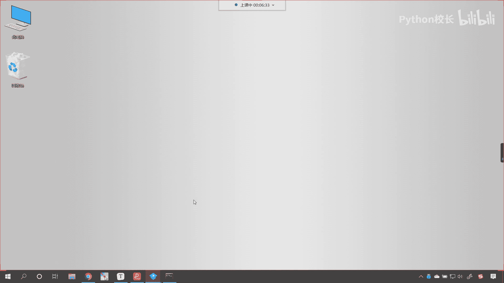
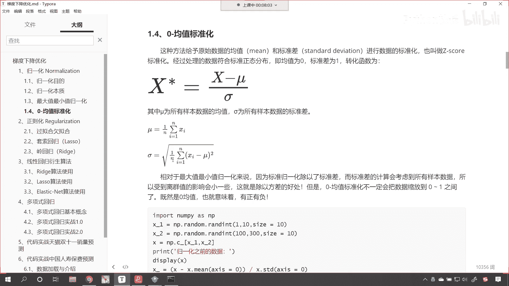
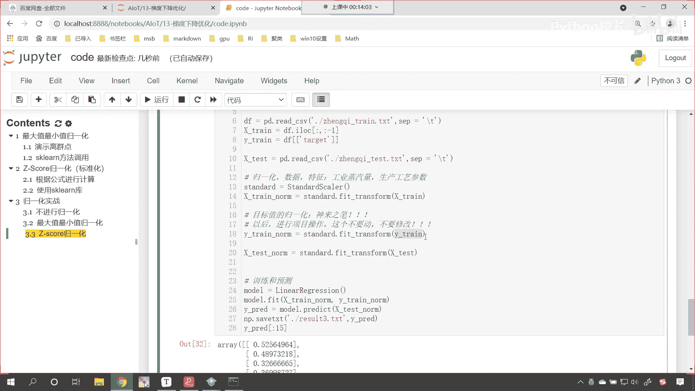

# P84：1-归一化内容总结重点目标值归一化 - 程序大本营 - BV1KL411z7WA

好，今天呢这个每天都有新的小伙伴，加入我们的学习的这个班级。

学习的这个大环境，那我们呢是按照相应的顺序再进行课程的讲解，那如果说呃你在听新的课程的时候，听咱们今天晚上课程的时候，如果你发现断层了，那你需要做的事情就是把前面老师讲过的课程，唉，你从头必须得过一遍。

好不好好，那么咱们现在呢嗯就看一下，我们上一，就回顾一下咱们上一节课所讲的知识点，上一节课呢我们讲了归一化，那我们知道归一化它的功能很强大，那归一化的相应的数学公式也不难，咱们可以自己写出来。

我们呢也可以使用sk learn当中提供的工具，提供的包来完成归一化，有两种，一种是最大值最小值归一化，各位看到的这个公式唉，就是一个归一化，就是我们最大值最小值归一化的公式，还有叫零均值标准化。

咱们用到的这个公式，就如咱们看到的这个一样，x减mu减去平均值除以它的标准差，那均值和标准差又是怎样的公式呢，下面我们也有列出来，是不是，所以根据这个公式我们就可以完成。

咱们上一节课呢，我们就带着各位同学，我们就做了一个归一化实战，咱们规划实战，咱们用的就是天池工业蒸汽量上的这个数据，我们就发现，如果要不进行工业工业蒸汽量的这个归一化，咱们就发现这个成绩大概是三点多。

对不对，那如果说我们要进行了归一化，看这个咱们上一节课是吧，都有相应的演示啊，这是不进行归一化，咱们就发现如果我要对数据进行归一化，咱们使用最大值最小值归一化，上传的结果大概是一点多。

这个其实就有了一个质的飞跃是吧，这个分数呢它实现了一个飞跃，那你看我们在这用到的就是最最大值，最小值归一化，咱们就是把数据进行了归一化，在这里各位小伙伴要注意，我们进行了训练，数据目标值归一化。

以及呢咱们还进行了是不是测试数据的规划呀，对不对，你看我们还进，我们还进行了测试数据的规划，也就是说我们把能进行归一化的，是不是全部进行归一化了呀，在这个地方咱们要进行一个说明，一般情况下。

啊一般情况下我们的目标值不需要进行归一化，因为这个目标值是我们要学习的嗯，是我们要学习的值，对不对呀，但是呢天池工业蒸汽量它是一个开卷考试，就是无论你进行什么样的操作，只要你提交了结果。

那如果说这个结果它有一个进步，那这些操作都是可以的，因为对于我们而言，咱们要求解的这个目标值，看咱们要求解的这个目标值它呢是未知的啊，这个目标值它是未知的，即使你随机给给一串数字，你提交上去。

他也会为你算出一个分数，对不对，他也会为你算出一个分数，所以说这个地方是吧，咱们第18行代码，这这个呢就相当于是神来之笔，看这个就相当于是神来之笔，你要注意啊，一般情况下这个是不需要进行归一化的。

知道吗，这就是为什么会有零分，有零分的，那因为我们的这个评分标准是m s e，如果你的分数是零分，那是那说明太好了，说明你和它的标准答案一模一样啊，在这里呢我们的这个评判标准是，这个scr越大越不好。

这个car呢越小，说明你的模型就越棒，好那么我们进行了归一化之后是吧，咱们发现这个效果很好，那我们然后呢又用this car进行归一化，咱发现这个z score，那它的效果呢比咱们上边最大值。

最小值归一化的效果还要好，那我们经过这个实例，咱们就能够得出这样的结论，我们的数据经过归一化之后，它的效果就会好很多，所以说这个是我们进行数据处理的，非常重要的一种方式。

好那么这个呢是我们上一节课的总结，咱们在课程总结当中，我们着重说了一下，目标值的归一化这个问题大家注意啊，咱们说这个是什么呢，神来之笔，看这个是神来之笔，你可以把它你你可以把这个操作啊，看成是这样的。

那本来呢不应该对它进行操作，但是我们对于目标值进行了归一化，咱们就发现效果比原来就好多了啊，这个嗯上传到这个天池上，那这个效果呢就好多了，所以这个，所以呢唉这个以后大家再进行操作的时候。

这个外衬你尽量不要去操作，知道吗，哎在这儿再来一个说明啊，看以后咱们进行项目的操作，这个不要动，知道吗，这个不要不要动，不要修改，嗯因为对于我们而言，这个天池工业蒸汽量这个数据。

我们不知道它的目标值是什么，所以我们会通过各种各样的方式来操作，来寻找答案，那我们发现经过这个操作之后效果特别棒，所以呢，嗯所以我们就这个对于目标值进行了一个转换，你可以想一下。

我们如果要对目标值进行了调整，进行了转换，是不是咱们的这个嗯真实答案是不是，也就相当于发生了一个更改啊。

对不对。