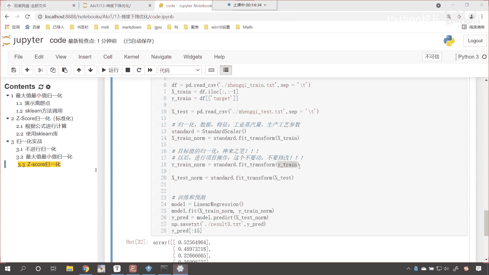
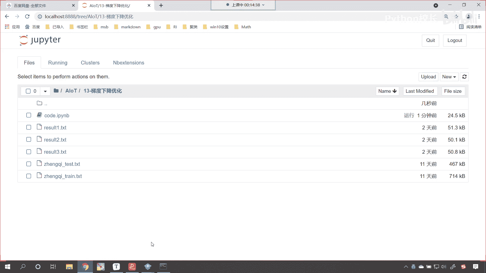
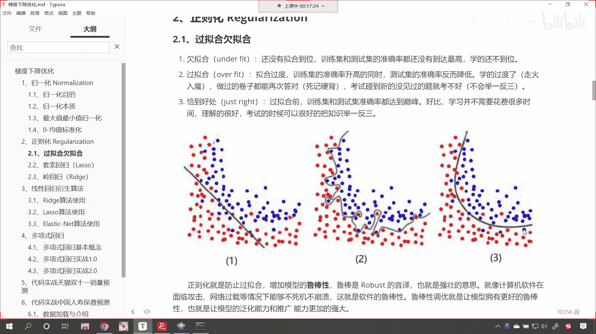
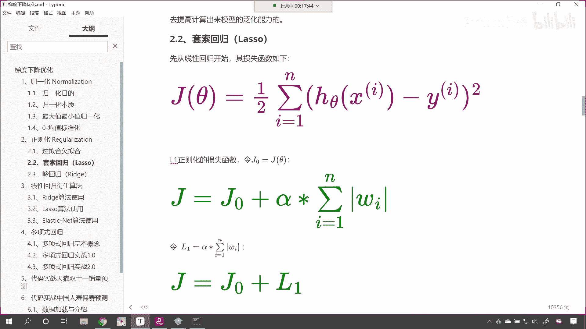
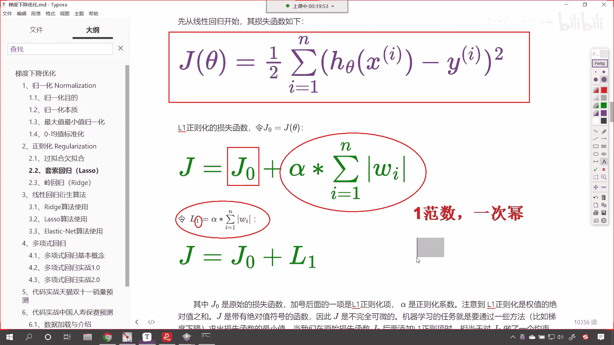
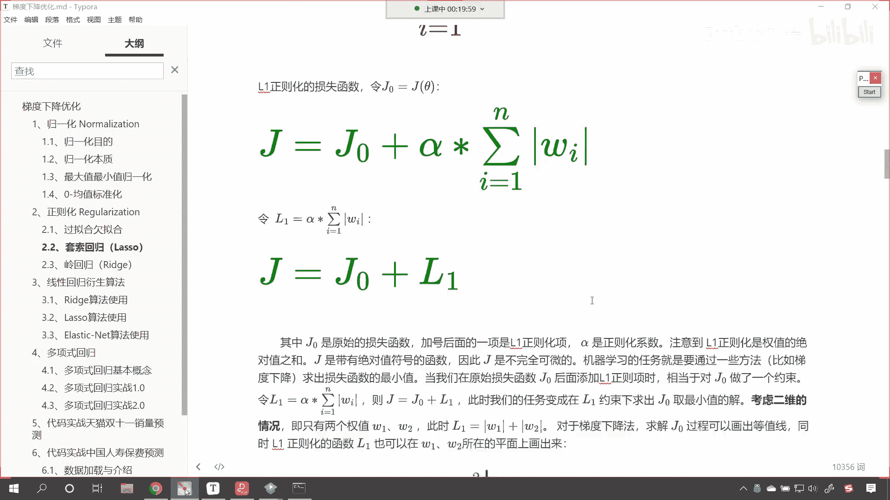
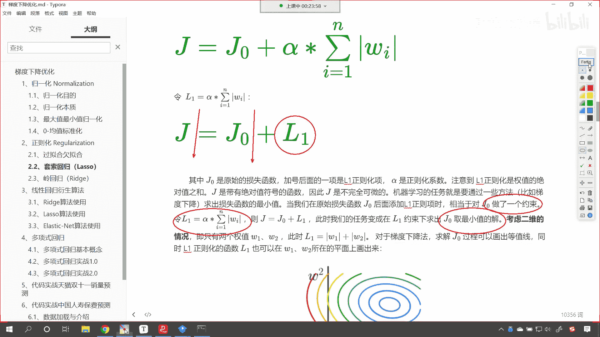
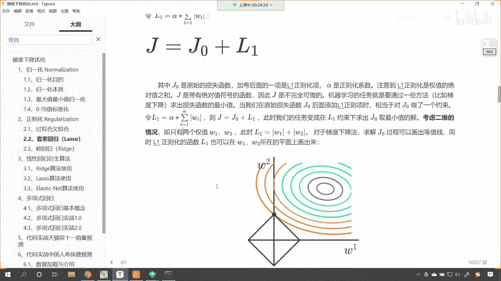
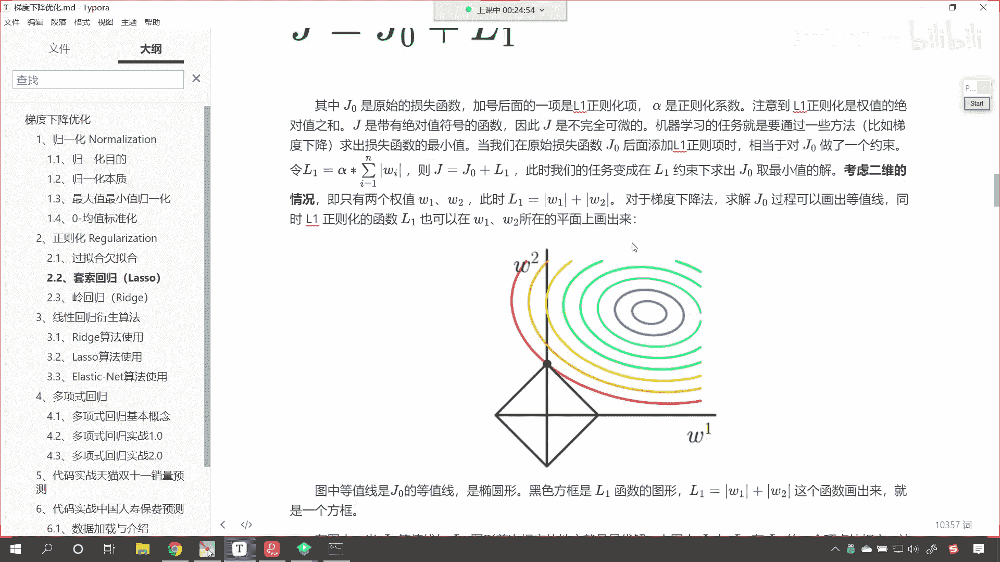
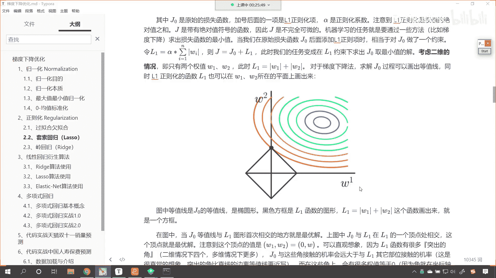

# P85：2-套索回归介绍 - 程序大本营 - BV1KL411z7WA

往下看咱们看我们今天的内容啊。

好，那么呃咱们今天呢我们就继续看一下，咱们剩下的这部分内容，那这节课呢是咱们梯度下降优化进阶，那我们看一下咱们的套索回归，那这个套索回归呢，它就是线性回归基础上的一个升级。

咱们的线性回归我们用到的损失函数，你看是不是这个蓝色的呀，这个是不是就是高斯他所发现的最小二乘法呀，我们直接使用就可以，那既然我们要对于线性回归进行一个调整，那我们这个调整呢我们叫正则化。

在上一课的时候，我们也介绍了说这个模型在训练的时候，它可能会出现的问题叫过拟合和欠拟合，说一般情况下，现在呢不存在欠拟合的情况了，往往是过拟合，如何才能将过拟合的这种情况避免呢，咱们说到了方案。

我们的方案是不是就是正则化呀，上一节课的时候，咱们说你只需要记住我们给的方案，下一节课咱们会介绍具体的方案，并且呢我我会告诉你，为什么这些方案可以防止过拟合。

上一节课咱们在举例子的时候，说到了过拟合这种情况的出现，就是我们训练出来的模型，它的系数太大了，那为什么说这个系数大呢，你想一下咱们中间这个图就属于是过拟合，过拟合得到了绿色的这条线。

你看他是不是拐弯呀，拐来拐去的，对不对，那你想一条线，如果他想要急速的拐弯，那你想它的斜率是不是发生了一个，特别大的变化呀，原来的原来的时候是正的，经过这个转变之后，它是负的，那怎样才能实现这种转换呢。

那你想是不是就是它的斜率大才可以呀，对不对，所以说呢想要避免过拟合这种情况，那也就是说咱们需要把这条线曲流，拐弯的这条线给它捋直了是吧，给它捋成最好是右侧这条线，怎样才能操作呢。

哎那么我们要做的事情就是给他把系数降低，那系数降低的方式就是咱们的正则化，那咱们接下来就看第一种正则化。

第一种正则化叫领回归，在这个地方我会告诉你具体的公式，咱们通过公式进行推导，那我们就能够看到这种公式，它在进行梯度下降更新的时候，确实可以在一定程度上减小咱们的斜率。

那么我们l一正则化的损失函数，那大家看下面这个绿色的，就是l一正则化的损失函数，现在的话我们有一个令，因为我们现在的这个呃模型优化，其实呢我们是在线性回归的基础上进行的啊，线性回归它是一个基础。

那么我们就可以令这个j0 啊，这个j0 就等于上面的jc塔，也就是说呀，咱们的套索回归是在线性回归的基础上，我们给它增加了一项，大家看咱们增加的这一项是什么呀，这个地方有一个阿尔法。

这个阿尔法你可以认为它是正则化的系数，那通过这个数值咱们来控制正则化的强和弱啊，通过它来控制正则化的强和弱，那大家能够看到咱们是不是来了一个累加和呀，在累加和当中，我们是不是给了一个w i的绝对值呀。

对不对，哎那这个就是所有w所有w i绝对值之和，所以你看这个公式是不是也很简单呀，我们把这种咱们就称为什么呀，咱把它就叫做l1 ，为什么叫一呢，来各位小伙伴，你想一下，为什么我们把它叫做l一呢。

是不是啊，为什么，因为你看它是几次幂呀，它是不是一次幂，对不对，你仔细看一下这个是不是一次幂是吧，我们可以把它叫做一范数，其实你看它是不是一次逆，对不对呀，看我们如果要是说一范数的话。

我们有一些小伙伴可能还听不太懂啊，可能还不太知道是吧，可能还听不太懂，那我们把它叫一次幂，是不是，你看这上面就是一次幂，是不是其实一范数更加准确，你看一范数更加准确。

那么这个一范数呢哎又叫做曼哈顿距离好。

那么我们接下来继续往下看啊，那我们就知道这个套索回归其实很简单。

是不是j0 加上l一呀，对不对，那其中的j0 就是咱们原始的损失函数，咱们加号后面的一项是l一正则画像，阿尔法呢就是正则化的系数，咱们注意到l一正则化是全值的绝对值之和，g呢是带有绝对值符号的函数。

也就是说此时咱们的损失函数啊，此时我们的损失函数，你看我们就变成g了，这个j呢就是我们套索回归它的损失函数，它和线性回归不一样的地方，就是多了一个l e c塔，这个l就是多了一个l一正则。

像那这个正则项呢，你看它是带有绝对值符号，那我们现在要普及一下，咱们高等数学当中的一个小知识，唉如果说我们的公式当中带有绝对值符号，那么这个方程呢它是不可微的，也就是说它不能求导数。

你看它不能进行微分运算，看到了吗，唉那现在我们就遇到了一个问题，在机器学习任务，咱们机器学习的这个目的呢，哎就是要通过一些方法，比如说梯度下降，咱们求出损失函数的一个最小值。

那但是现在呢你但是现在呢各位就能够看到，这个当中存在一个不可微是吧，不可微的一个函数，那这个怎么办呢，你看这个怎么呢，对确实可以分段求导，但是你能知道他什么时候正，什么时候负吗。

这个就太这个就太麻烦了啊，那你想我们的系数，一开始是不是都是随机生成的呀，对不对，所以这种带绝对值符号的，在我们数学当中，咱们是通过分段求导来解决的，那在我们的这个机器学习当中，这个就相当于什么呢。

看这个就相当于看，相当于对于g0 做了一个约束，那我们你看整体的g是不是j0 加l一啊，对不对，那我们可以这个加了这个l一项之后，它就相当于对于g0 做了一个约束。

也就是说我们其实想要求的是整体的最小值，对不对，那你想要求求整体的最小值，那你想一下你是不是得求一下j0 的最小值呀，那这个g0 它又加了l一这一项，那g10 加了l一这一项，它相当于什么呀。

看求它的最小值，求前面的最小值是不是，那我们的j0 呢加了l一这一项，它就相当于做了一个约束，那我们这样说，大家不太容易看明白，你看这样说，大家不太容易看明白，这个约束呢。

看这个约束就是咱们的阿尔法乘以，咱们系数的绝对值之和，那我们把它画图画出来，各位小伙伴呢唉也许就能看得更加明白了，好那么加的这个约束呢，这个j等于j0 加l1 ，此时我们的任务就变成了在l一约束下。

咱们求出g0 的最小解，你看这个思路，比咱们刚才有小伙伴在讨论区里边说到了，可以分段求导，你看是不是更加是不是更加这个独到呀，对不对，你看就是那我们这个l1 ，它的约束是什么样的呀。

咱们继续往下看啊，我们的数据呢可以是非常复杂的，可以是二维，三维，四维是吧，13维各种各样的维度都有，但是我们在计算机当中画图，我们最多显示三维，那此时呢咱们为了方便，咱们呢就考虑一个二维的一个情况。

你看二维情况下既只有两个权重w一和w2 。

那你想此时咱们的l一就变成什么了，此时l一是不是就变成了w一加w2 了，看到了吗，w一加w2 是不是就是w1 ，w一和w2 的绝对值呀，那么对于梯度下降，咱们求g10 过程呢，我们可以画出等值线。

等高线，同时呢l一正则化的函数l1 ，也可以在w1 w2 所在的平面，我们把它绘制出来，现在你就能够看到咱们黑色的这个框啊。

黑色的这个框他呢就是我们的l1 ，你看就是咱们的l1 ，因为我们的l一是不是有w一和w2 啊，看到了吗，它是不是绝对值，哎那有同学就说了，说老师为什么咱们的l一正则化，看为什么l一正则化。

它画出来是这个图形呢，咱们小伙伴们理解吗，看为什么画出来是这个图形呢，你可以理解吗，能不能想象出来咱们的l1 w一加w2 ，画出来是这样的，是不是来好，那么到这到这个之后呢，呃到这个点之后呢。

我们就介绍了一下咱们的正则化l1 ，那现在呢我们在代码当中。

