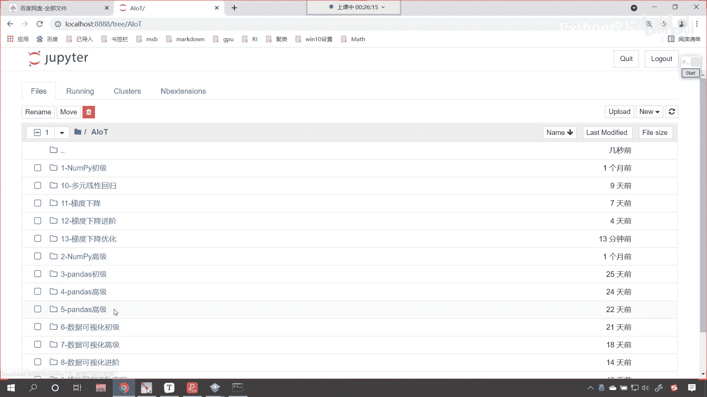
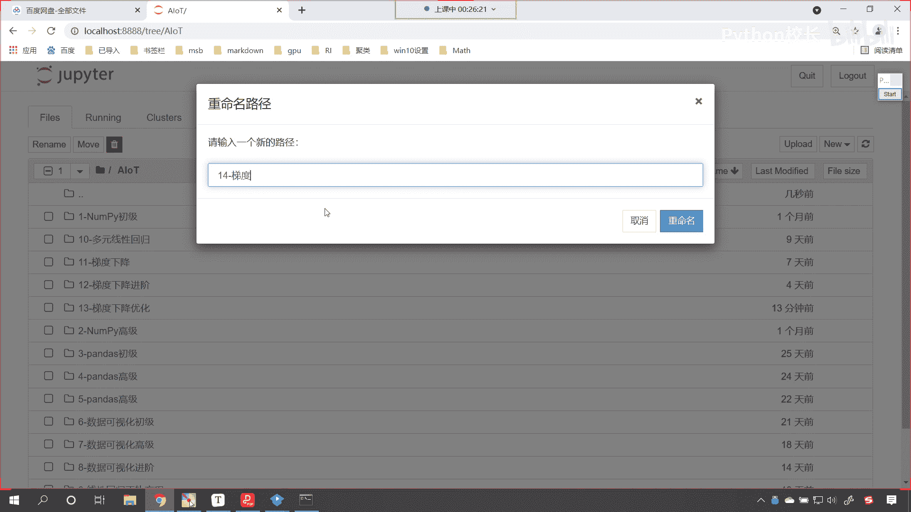
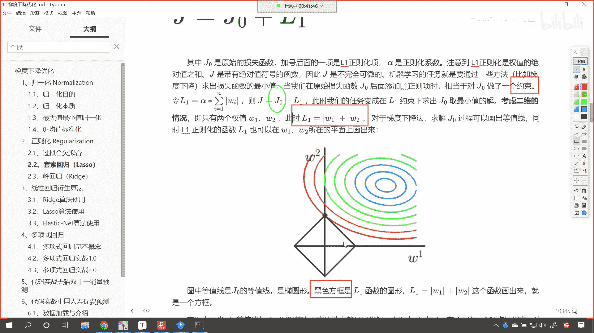

# P86：3-L1正则化可视化图形 - 程序大本营 - BV1KL411z7WA

接下来咱们呢就回到代码当中，你看你这个函数简单，是不是是不是w一和w2 啊，来回到代码当中，咱们现在呢就操作一下，我们创建一个新的文件夹，找建这个文件夹。

咱们现在呢给它改个名，这个呢就是咱们的第14课，这个是梯度下降。

哎我们的进阶，现在呢我们就进入代码，那个图形也简单，是不是，那咱们就创建一个代码，给它起个名叫co，现在的话我们导一下包，那我们就import numpy as np，画图工具，咱们也导进来。

import matt plot，lib，piplot as plt，咱们执行一下这个代码，刚才我们所遇到的方程，大家看他是这样的，咱们写一下，那就是dollar dollar l下划线一就等于竖杠。

竖杠是不是叫做w1 ，然后加上竖杠，竖杠w下划线二，你看我一直行，你看是不是就是这样的一个方程呀，好那么我们的方程呢咱们就可以写成这样的啊，叫做f x y，你看你的w一和w2 它是不是一个。

你看w一和w2 它是不是一个系数呀，既然是系数，你想我用什么来表示，有所谓吗，是不是无所谓啊，咱们可以写成这样啊，你看竖杠竖杠x，然后加上竖杠竖杠y，你看咱们就可以写成这个样子，哎看到了吧好。

那么写成这个样之后呢，咱们如果想要把这个数据画出来看看，想要把它画出来，那么我们就令因为咱们想要把它画到平面当中，所以说我们就令f你看咱们就令fx等于零，这样的话咱们绘制的这个图形。

那么它会在咱们平面中，那会在平面中好，那么这个时候呢咱们就令它为零啊，井号是吧，令它为零，那令它为零的话，你想是不是就是零就等于竖杠，看零零呢就等于竖杠x然后加上咱们的竖杠y，对不对。

那就有了这个方程了，那有了这个方程之后，大家想咱们带着绝对值，我们是不是得需要把绝对值去掉呀，对不对，你看我们需要把绝对值去掉，那去掉绝对值呢，哎它有一些情况，对不对呀，嗯那你想咱们假设看这个时候呢。

看咱们假设，假设这个x和y它呢都是大于零的，如果要都是大于零，咱们是不是直接去呀，对不对，那这个时候零就等于多少，零是不是就等于x加上零，是不是就等于x加上y啊，对不对，你看那零等于x加上y。

你想这个方程就等于啥，咱们挪一下位置，y是不是就等于负的x呀，看到了吧，y是不是就等于负的x对不对，那此时咱们是不是就可以写一个方程呀，咱们定义一个方程啊，叫做fine 1，就等于拉姆达这个x是吧。

然后冒号我们给它一个负x，你看这个方程是不是就有了有了这个方程，咱们把它画出来啊，好那么这个方程画出来嗯，咱们呢就给一个x1 x一呢，就等于np一点lin space，咱们给它调一个范围space。

你比如说我们让他从0~1，咱们让这个范围呢我们把它分成50份，那有了x一了，咱们再来一个y1 y一呢，就等于方案一调用这个函数，把x一放进去，然后咱们就直接画图，prt。plot小括号x1 y一放进去。

这个时候你看我一执行，唉，大家此时就能够看到咱们这个图形，我们是不是就画出来了，那画出来这个图形之后呢，咱们调整一下这个坐标的范围好不好，咱们调整一下坐标的范围啊，你看到了吧，这个是不是正中心呀。

这个是不是圆心嗯，咱们之前在讲绘图的时候，我们是不是介绍过这个脊柱移动呀对吧，我们就发现咱们这个是在第几象限呀，看咱们这个嗯这个是在第几象限，咱们这个是在第四象限，是不是啊，嗯我看一下啊。

这个是011是吧，咱们这样啊，呃你想咱们的这个np。line space，这个数据是都可以调整的啊，这个00~1呀，还有50呀，这个数据都是可以调整的，现在呢我们先对于绘图进行一个设置，咱们的prt。

x lim，咱们呢将它这个横坐标的范围调整到二和二，纵坐标的范围，我们也调整一下，调到-2和二，然后呢呃咱们在进行这个绘图的时候，好在进行绘图的时候，咱们获取一下当前画面，那就是axis plt。

g c a，各位小伙伴，你还记得这个方法吗，gca就是get current axis，那它表示获取当前的视图啊，获取当前视图，有了当前视图，咱们就可以对当前视图进行设置了。

咱们找见当前视图的space，我们将它右边的这个将它右边的这条线，也就是说右边的这条线咱们给它隐藏掉，那我们就调用相应的方法叫set color，那我们把颜色给它设置成什么呀，那这个时候它就消失了。

然后咱们再调用这个方法，set spans，同样呢将它上边这条线我们也给它设置一下，set color小括号，我们给一个nine，那么还有它下边这条线，下边这条线叫spans。

中国号b o t t o m，我们将它的下面这条线，咱们呢把它的位置我们给它挪动一下，叫set position，好，那么这个位置咱们给它挪到哪里呀，给它挪到刻度零的位置，那么同理，我们还有左边这条线。

是不是，那找见左边这条线left同样也设置一下它的position，同样呢也把它放到零的位置，这个时候你看过一执行好，咱们现在呢就能够看到，我们有一个参数给设置错了是吧。

叫axis spice这个bottom，那我们检查一下啊，好那么我们在set position的时候，那么我们这个data它是成对出现的，所以说咱们给一个贝塔，然后再给一个零。

那同样呢咱们最左边这条竖直的线也给一个data，然后给一个零，这个时候你看过一执行哎，各位小伙伴哎，大家是不是就能够看到，咱们这条线是不是就出来了，看到了吧，此时这条线是不是就出来了，对不对，那你看啊。

此时我此时呢，我是不是将这个，此时我是不是将这个值给设置成令它是零了呀，对不对，你看我令它零了，那咱们这条线就出来了，那，那我们的xy你看xy的绝对值相加，大家想一下我们上面对应的方程式w一加w2 。

它是绝对值相加，你想它们相加的值可能是零吗，是不是不可能呀，对不对，那我们就假设咱们令他是一啊，各位小伙伴，你看啊，因为这个是绝对值之和，现在呢我令它是一，如果要令他是一的话。

那这个时候咱们的y是不是就变成了一减x呀，那那么咱们的方程也稍微发生一个变化，是不就是一减x呀，好这个时候你看我再来运行一下这个代码，哎，各位小伙伴，你就能够看到咱们现在所画出来这条线。

是不是就在咱们你看这条线在哪里呀，这条线是不是就是在第一象限啊，对不对，那我们就发现你看这个横纵坐标，它的刻度范围是不是应该相同呀，这个时候各位小伙伴就能够看到，你看好像咱们水平是不是更宽一些。

数值是不是窄一些呀，也就是说你数值上是一，水平上也是一，但是咱们的视觉效果上，看到的是不是好像宽度更长一些啊，那这个怎么办，咱们在画图之前嗯，咱们在画图之前plt点，我们设置一下它的figure。

figure就是它的尺寸，咱们给一个figure size，咱们让它是六和六，这个时候你再来观察，你看横坐标和纵坐标是不是就一样了，好你看啊，现在呢咱们把绝对值是不是给它拆开了呀，对不对。

那绝对值拆开了之后呢，咱们还可以进行看，我们还可以进行一个操作啊，那这个时候呢咱们是假设x y都大于零，是不是，那我们假设x y都小于零啊，咱们再来画一个图好不好，来我们再画第二个图，来再来一个井号。

此时呢咱们就假设x和y怎么样都小于零，那都小于零，这个公式是不是也简单，我们起个名就叫发二，那如果要都小于零的话，你想这个公式是不是就一等于负x减去y，你看是不是应该是这样的一个方程呀，对不对。

那咱们就根据这个方程，我们来写咱们的方案二是吧，那如果要是根据这个方程的话，那咱们就是朗姆达x，然后来一个冒号，这个时候呢咱们得到的结果就是负，看这个时候咱们得到的就是负x减一。

现在呢咱们同样也来一个这个图形的绘制啊，那如果说他要是负的，这个时候呢咱们给一个x2 x2 ，就等于np。l space，我们就让它从-1~0，咱们把它分成50份，然后我们给一个v2 。

v2 呢就等于调用咱们的方法发n2 ，把咱们的x2 放进去，此时我绘制一个图形，那就是plt点调用plot这个函数，x2 放进去，y2 放进去，这个时候你看我一直行。

看咱们画出来这个图形是不是就跑到这儿了，唉看到了吧，那还有呢，那有没有另外一种情况，是不是假设看咱们假设x大于零，然后这个y小于零，这是不是又一种情况呀，那这个时候一是不是就等于x大于零。

是不是直接拿出来，是不是一减y啊，对不对，那我们就根据这个咱们来写咱们的方程，那就是fine 3，fine 3呢就等于拉姆达，那我们这个朗姆达呢x冒号，看这个时候呢就等于x减一，看它就等于x减一了，好。

那么这个时候呢咱们给x3 ，我的x3 呢就等于np。lin space，既然这个x大于零，咱们让它的范围是从0~1，我们把它分成50份，这个时候我们给一个y3 ，y3 呢就调用这个函数。

看看咱把x3 放进去画图画出来，plt。plot来x3 放进去，x3 放进去，y3 放进去，同样的道理，你想咱们是不是还可以画最后一条线，咱们是不是就是假设x看，咱们假设咱们的x小于零。

而咱们的y呢是不是大于零对吧，那这个时候你想我们这个公式是不是就变成了，一，就等于x小于零，是不是就是负x y大于零，是不是直接把中这个绝对值符号去掉，那这个时候你想咱们y的这个方程，就变成什么了。

y的这个方程咱们起一个叫番四，番四呢就等于lambda表达式x冒号，这个时候就是一加x好，那么我们给一个x4 ，它的范围呢np点拉space，咱们让他从零，这个时候它是小于零的，那我们就让它从-1啊。

-1~0，这个时候呢我们把它分成50份，那y4 呢咱们就根据所创建的函数来计算一下，方式，放进去x4 放进去，这个时候你看我pll t点，我调用plot函数小括号，咱们x4 放进去，y4 放进去。

这个时候你看我一直行，各位小伙伴哎，你是不是就能够看到一个框框了，那我们将这个框框的颜色，我们都给它改成黑色的哈，来第一条线呢我们给一个color c o l2 color。

咱们给一个k这个k呢就表示黑色，是不是来复制一下，第二条线咱们也给设置颜色，第三条线也设置颜色，那第四条线也设置颜色，这个时候你看我一执行，你看咱们画出来的这个l一正则项。

是不是就是一个菱形的一个方块呀，看到了吗，这就是l一正则项我们画出来的图形，那各位小伙伴再回到咱们的课件当中，你看他这里说到了，看各位小伙伴，他这里说到了这个l1 ，看到了吧，这个l一对应着什么呢。

这个l一是不是就对应着咱们黑色的方框呀，是不是看到了吧，l一就对应着我们黑色的方框，也就是说你如果想要去求解咱们的最优质，注意啊，这个时候小伙伴要认真的听我讲，如果你想要去求j0 的最优解，你j0 。

你看你是不是得从这个这个方框上，去找最优解呀，对不对，因为这个方框就是它的限制，这个方框就是它的约束，我们把这个叫约束是吧，我们画出来之后，咱们就发现这个约束就是这样的好。

