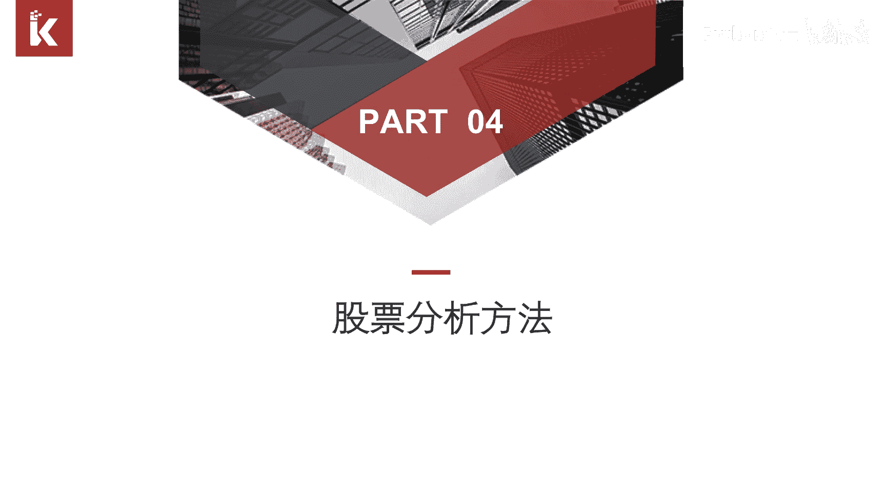
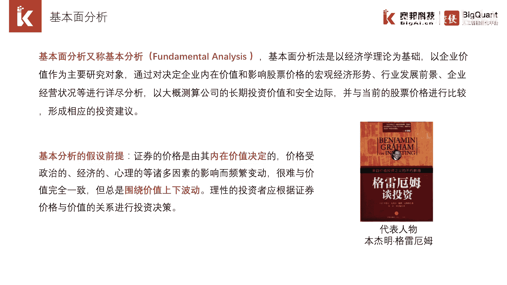
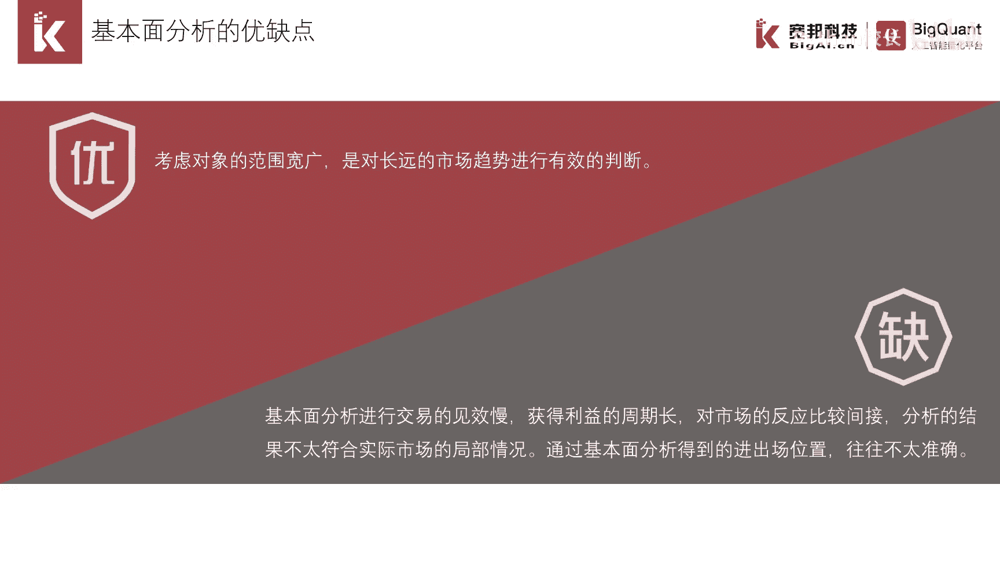
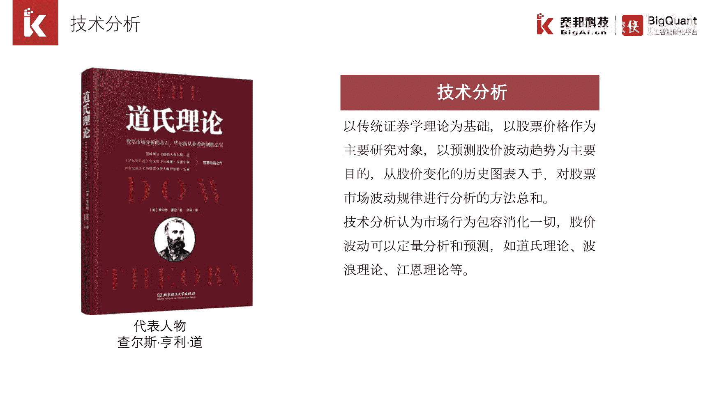
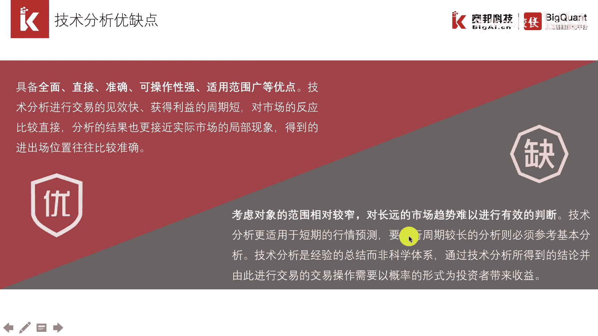
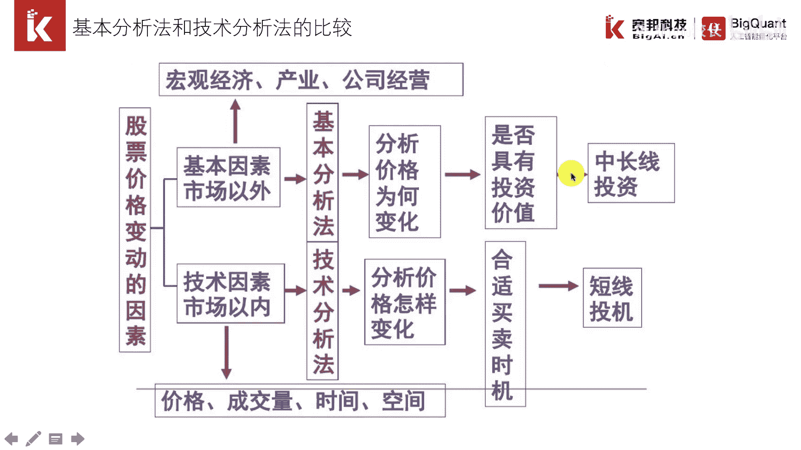

# P9：1.3.3 股票分析方法 - 程序大本营 - BV1KL411z7WA

最后一节，我们介绍两类比较重要的股票分析方法，这对我们认识量化策略有一定帮助。

这两种分析方法分别是基本面分析方法，和技术分析方法，基本面分析方法侧重于选股，如今a股全市场股票约为3600只，基本面分析可以帮助我们挑选股票，构建投资组合，技术分析主要用于择时，确定什么时候买入。

什么时候卖出，两者使用的场景不一样，基本面分析是对公式的基本情况进行深入分析，找到具有价值洼地的股票，然后长期持有，等待价格回归正常，因此基本面分析适用于全市场，找出有升值空间的优质股。

买入后短期不会卖出，格雷厄姆是价值投资的代表人物，我们比较熟悉的沃伦巴菲特的价值投资，也属于基本面分析。

基本面分析，可以对长远的市场趋势进行有效的判断，但是它的持仓时间较长，获利的周期也较长，这里我们以贵州茅台这支白马股进行举例，贵州茅台近年来涨势如虹，从13年的100多元涨到了今天的1000多元。

成为a股历史上股价突破1000元的第一只股票，也是唯一的一只股票，但是如果我们查看它每年的价格走势，其实在13年和18年价格回调是非常厉害的，也就是说买入后需要忍受长时间的亏钱，然后价值才得以修复。

价格最终上涨。

根据有效市场假说的理论，股价走势能够体现一切市场信息，价格和成交量可以是市场交易行为的直接体现，因此衍生出了另一个分析方法及技术分析方法，之所以称为技术分析方法，是因为该方法对大量数据进行计算。

构建出大量的技术指标，比如macd kdj rsi等。

技术分析的作用是折时，直到我们何时买入，何时卖出得到的进出场的位置也是比较准确，但是仅仅依赖加量数据，考虑对象的范围相对狭窄，对长远的市场趋势难以进行有效的研判。

技术分析有众多流派，包括道氏理论，波浪理论，形态理论等等等等，这些分析都是建立在标准的k线数据基础上，进行分析和应用，最后我们比较一下基本面分析和技术分析，前者考虑范围比较广，包括宏观经济。

产业和公司经营等因素，后者只考虑价量时空因素，前者用来选股，适用于中长线投资。

