# P90：7-Ridge算法使用 - 程序大本营 - BV1KL411z7WA

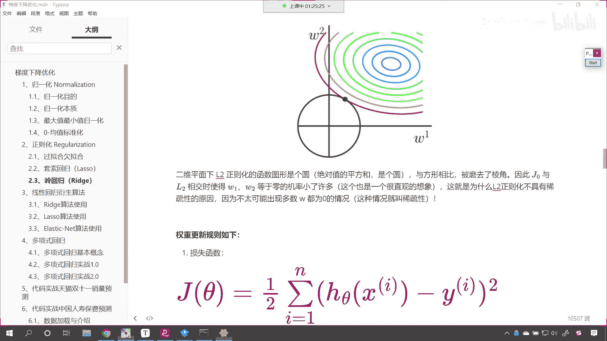

好来我们接下来呢咱们就看一下，咱们线性回归衍生算法它的使用，那我们现在介绍的就是sk learn当中，为我们提供的线性回归衍生算法，就是咱们刚才所讲到的套索回归领回归。

那咱们现在呢就来回到咱们的代码当中。

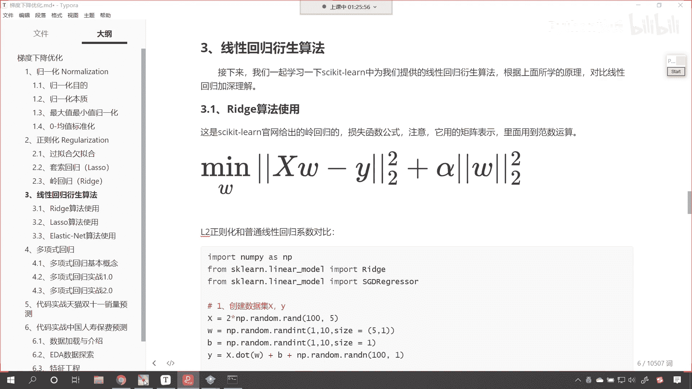

我们呢一起来操作一下，来回到代码当中，这个是咱们的代码，咱们将代码整理一下，好不好好，那么各位小伙伴就能够看到，我们在这儿呢绘制了l r可视化，上面咱们介绍的是l一可视化，也给它添加一个三级标题。

这个呢就叫做l一可视化好，那么接下来呢我们把相应的代码该合起来的，给它合起来，然后我们再来一个三级标题，接下来呢我们就介绍一下睿智，这个睿智呢叫领回归，好现在呢我们就一起来看一下。

咱们领回归它到底是怎样的一个操作，我们说领回归呢是线性回归的衍生算法，那就是在它基础上进行的改变，对不对，那我们线性回归是不是在linear model当中呀，那么我们的领回归呢，大家看咱们来一个睿智。

大家看啊，导包你看我们就导进来了，看他俩是不是同根同源呀，啊它是同根同源，和咱们的linear regression，它俩是同根同源导包，它们都在相同的包下面好，那么啊接下来呢我们为了做一个对比。

咱们再导一个包，from sk learn linear model，咱们导入一个叫s gd regression，你还记得之前咱们讲梯度下降吗，这个s g d regressor就是随机梯度下降。

大家看啊，这个就是随机梯度下降，那我们比较一下领回归和随机梯度下降，他俩有什么样的不同好，那么第一步咱们呢就创建数据，我们这个数据呢是咱们随机生成的数据。

咱们来一个xx呢就等于二倍的n p random run，我们给它100个数据，五个样本，这个x数据就有了，有了x之后呢，咱们给一个w w呢，就等于np。random run int，咱们从一到十。

我们给一个size，咱们让它是五行一列，这个时候这个数据是不是就是二维的呀，有了w了，咱们再给一个bb呢，就等于np。random，咱们给一个rint，从一到十，我们也给一个size。

那这个时候这个size就等于一了，然后呢我们创建y y呢就等于x。dot，因为x y都是二维的，咱们是不是就可以来一个矩阵乘法，然后加上b加上b之后，咱们再给它加一个数据的扰乱，我们给它加一个盐np。

rando，这个时候呢咱们就调用run，我们生成一个正态分布，这个时候呢就让它有上有下来一个100和一好，此时呢咱们的数据就生成了，我们display一下啊，此时这个数据呢没法画出来。

你知道为什么没法画出来吗，你看我一执行，大家看数据是不是就有了，你看我为什么说没法没法可视化呢，因为你看x的数据，它的特征它是几维的呀，它是不是五维的呀，你想你要想把这个五维的特征画出来。

是不是得需要在五维空间呀，对不对，好那么所以说呢咱们也不用画了，咱们就知道这个数据是这样的就可以了，好那么嗯现在呢呃咱们就使用，咱们现在呢呃就使用咱们的这个领回归，我们呢来求解一下，睿智就等于睿智。

在这个当中呢，咱们给一个阿尔法，你还记得阿尔法表示什么吗，看这个阿尔法表示什么。

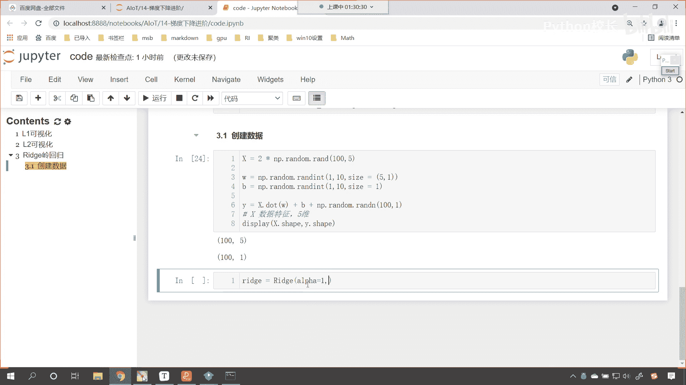

咱们在介绍这个算法的时候，你看领回归当中也有一个阿尔法。

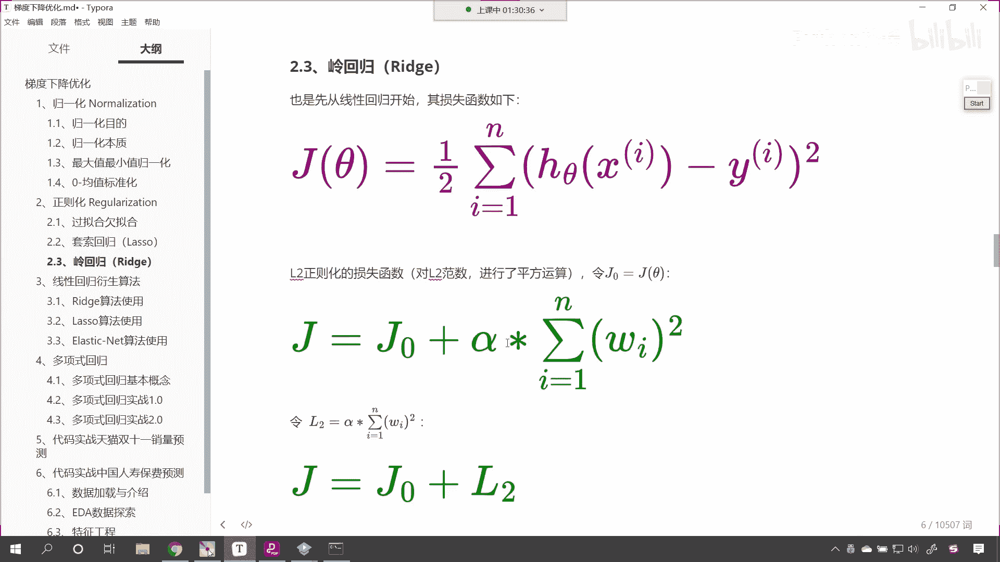

对不对，这个阿尔法表示的是不是嗯，咱们正则化的系数呀，正则化的这个强度对不对。

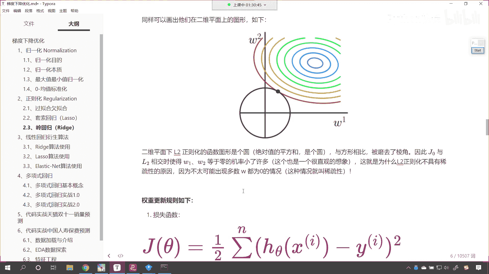

好所以说呢我们给它一这个数值是可以调的啊，然后呢咱们给一个server，这个server呢就是这个s a g啊，这个sa，那这个sa呢是咱们进行梯度下降求解的方式，点开给各位小伙伴看一下。

哎你看这个阿尔法默认是一点，你可以调大也可以调小好，那这个数值呢看咱们的这个阿尔法啊，看看这个阿尔法叫做regular rior strings，是不是咱们正则化的这个强度呀。

啊叫如果我们的这个数值越小，咱们的这个强度就越大，数值越大，那么它的这个它它正好呢是一个这个相反的啊，必须得是一个正数是吧，叫regular，那我们还给了一个参数叫server。

哎咱们一起看一下这个server代表什么啊，你看这个server它有auto s v d是吧，l s是吧，还有这个s a g，咱们给了一个s a g，我们看一下这个s a g它表示什么啊。

看sag表示什么，看到了叫做stochastic average，gradient descent，是不是就是表示咱们使用随机梯度下降呀，对不对，哎看到这个s a g就表示随机梯度下降。

所以说我们给领回归给他指定了一下，然后咱们睿智点feat，看我们把xy放进去，feat完之后呢，现在呢咱们将领回归到嗯，相应数据给他打印一下，那我们就print一下，叫睿智点call if。

这个是不是就相当于它的系数呀，然后咱再print一下睿智点呃，我们将它的截距给它打印输出一下，这个时候你看我一执行，相应的结果是不是就出来了，对比一下，咱们看一下真实的哈。

来我们print一下咱们真实答案啊，真实答案是咱们来一个反斜杠n好，那么逗号啊，咱们将上面的w打印一下，将b打印一下，这个时候你看我一执行来，各位小伙伴，你就能够看到真实的答案是不是也出来了。

大家看是不是还是比较接近的呀，你看这个最后一个系数是7。5，我们求解出来的，你看最后一个是八，我们求解出来是7。5，第一个是4。2是吧，44。04基本上是正确的啊，那我们接下来呢。

咱们再看一下咱们的这个线性回归哈，线性回归这个地方我给了一个随机梯度下降，当然唉你想你给linear regression是不是也行呀，对不对，我们给linear regression也可以知道吗。

这个linear regression和咱们的s gd regressor，有点不一样，linear regression它里面用到的是不是正规方程呀。

s g d regressor它用到的就是梯度下降，而咱们睿智用到的也是梯度下降，所以说我们比较的话，咱们就比较睿智和这个s g d，现在呢咱们领回归求解出来了一个答案。

接下来我们就使用一下s g d好，那这个s g d呢就是随机梯度下降，咱们声明一下s g d，在这个当中呢我们给它一个pently，pently就是惩罚项，唉给他一个l2 ，你看惩罚项就是咱们的正则项。

那给了这个pently之后呢，我们呢再给一个阿尔法，我们让这个阿尔法等于零啊，然后逗号咱们呢在同时呢也给一个l1 rq，也给一个零好，那么那这个pently它表示什么呢。

shift tab咱们点开看一下啊，看pencil都有哪些呀，往下滑，各位小伙伴就能够看到，是不是就有l2 和l一这两种呀，对不对，你看它就有l2 和l一这两种，是不是好，那么假设说啊咱们现在呢用啊。

假如说我们现在用l2 ，其他的参数咱们先不给哈啊，其他参数咱们先不给，假如说我们给一个l2 ，那这个阿尔法看这个阿尔法表示什么，阿尔法是不是就是表示它正则项的这个强度呀，看到了吗。

这个阿尔法看我们往下滑啊，它对于每一个参数都有一个说明，看了吧，阿尔法表示什么，你看the higher the value，the stronger，the regular rization。

你看regular rization是不是就是表示正则化呀，对不对，所以说咱们这个呢看我们也给一个什么嗯，这个呢咱们也给一个一，因为上面你看领回归我们是不是给了个一，这我们也给了个一。

咱们让这两个算法进行一个比较，s g d。feat，咱们将x y放进去，同样的我们打印输出一下啊，print s g d。coe，然后呢我们再打印一下s gd，intercept，把它的节律。

把它的截距也打印一下好，这个时候就能够看到咱们得到的结果，大家看和上面是不是就这个，你看这个得到的结果，你看2。84，2。99和上面这个你看哪个效果更好呀，看他们哪个效果更好，哪个效果。

是不是咱们的这个领回归的效果更好呀。

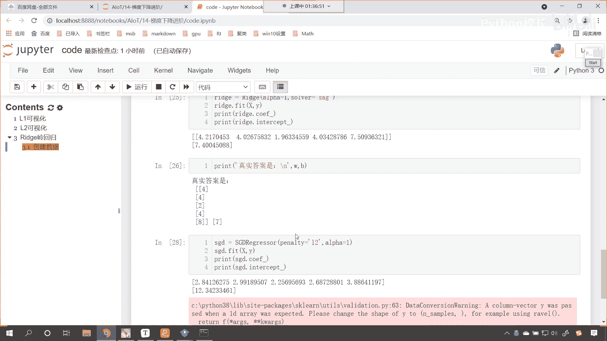

那我们说了这个系数都可以调整啊，假如说我将阿尔法调整成零呢，你看将阿尔法调整成零之后是吧，哎得到的结果是4。54。2，和上面差不多，和标准答案差不多，好那么咱们现在呢我们在使用线性回归。

model就等于linear regression，咱们呢就使用model。feat x和y放进去。

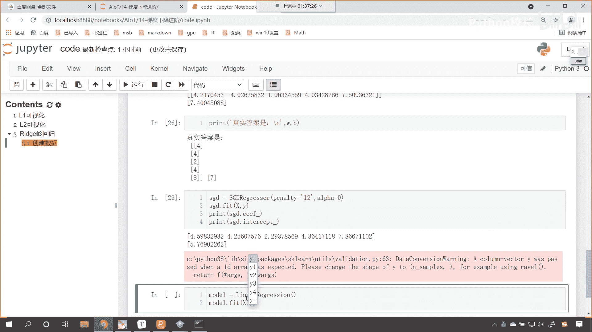

然后呢我们把它的系数也打印一下，那就是model。coif，然后再来打印输出一下print model。intercept，执行一下这个代码，哎各位小伙伴就能够看到，你看咱们是不是也通过线性回归。

也能得到一个结果呀。

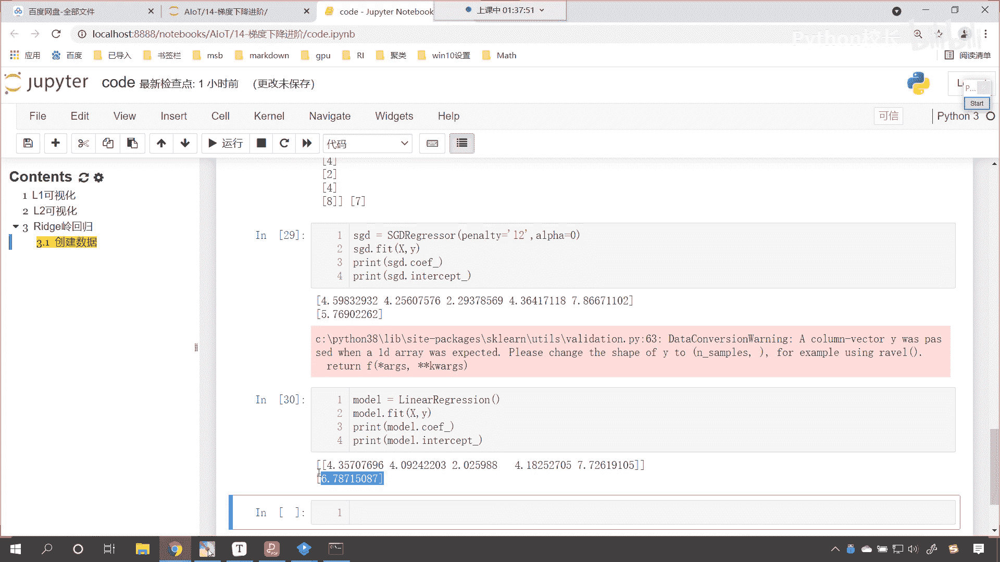

看到了吗，也能得到一个结果，现在呢你可以这个对比一下啊，看一下哪个的这个效果更好一点好，那么咱们之前看咱们之前讲到，咱们的这个领回归和咱们的线性回归相比，它有什么样的一个变化呢。

看啊它有什么样的一个变化，领回归和咱们的普通的梯度下降相比。

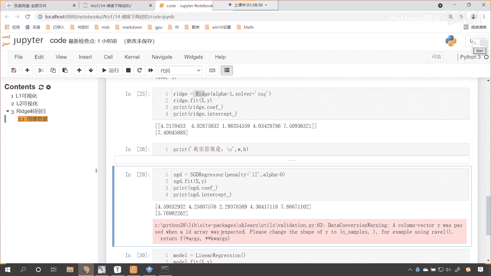

有什么样的变化，还回到咱们的这个课件当中讲了这么一大堆。

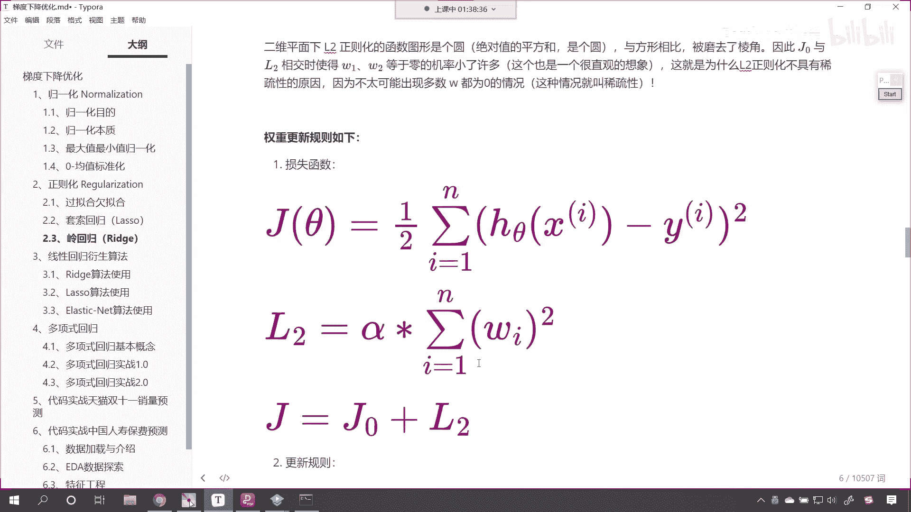

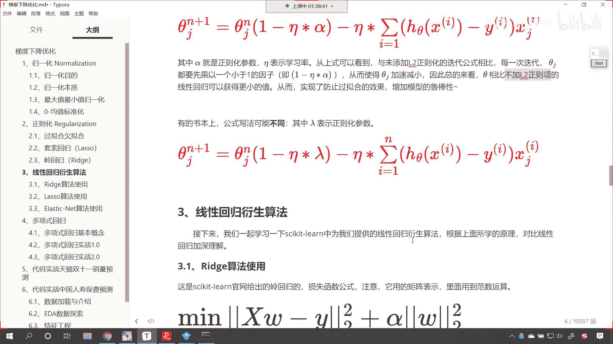

咱们说它有一个变化，这个变化是不是可以让我们获得更小的系数呀，对不对，因为你看它在更新的时候，他在更新的时候，它是不是多减了一项呀，所以领回归在进行更新的时候，它是不是有更小的系数呀，有更小的权重。

对不对，我们看一下咱们在代码当中演示的这个结果。

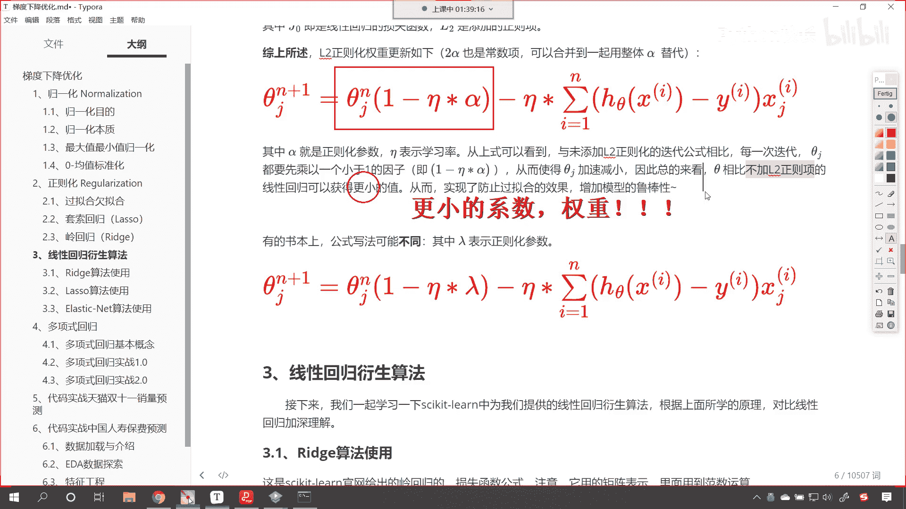

它是否变小了，那么我们就对比一下啊，看啊这个sgd regressor，这个就是普通的，看这个就是普通的这个线性回归，看它呢就是一个线性回归，咱们的上面是在线性回归上。

这个呢就是线性回归加上l2 正则项，根据咱们推导的，咱们就知道它的系数是不是会是不是会缩小呀，没错吧，那各位咱们来对比一下，看它是否缩小了，各位小伙伴，你能够看到我领回归求解出来的。

是不是这样的一个解呀，对比一下啊，刚你看原来是4。5，现在是不是变成4。2了，原来是4。25，现在是不是变成四这个4。026了，原来是2。29，现在变成1。96了，原来是4。3，现在是不是变成了4。

03，原来是7。8，是不是变成这个7。5了嗯，咱们的截距和咱们的系数呢，它在计算的时候这个方式不太一样啊，因为截距是吧，它是在在我们这个坐标系当中画图的话，它是上下左右移动的，是不是哎发现规律了吧。

是不是，所以说呢，这个领回归确实可以将我们的这个方程，把它的系数进行一个衰减，看它确实是可以的啊，好那我们就通过代码是不是进行了一个验证呀。

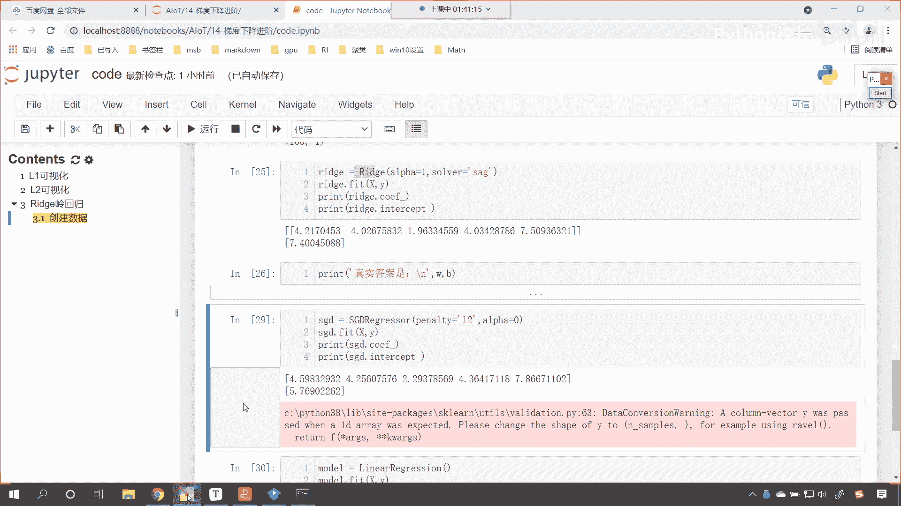

对不对，咱们就通过代码进行了一个验证，你现在看它和咱们的linear regression相比，也是这样的一个规律，看上面这个是咱们的随机梯度下降。

我们可以认为linear regression是整体的梯度下降，你看整体的梯度下降，他所得到的结果和上面相比，你来观察一下规律，4。35变成了4。2，4。09变成了四点，二，二点变成了1。96，4。

18，4。03，7。7变成了7。5，是不是都有这样的一个规律和变化呀。

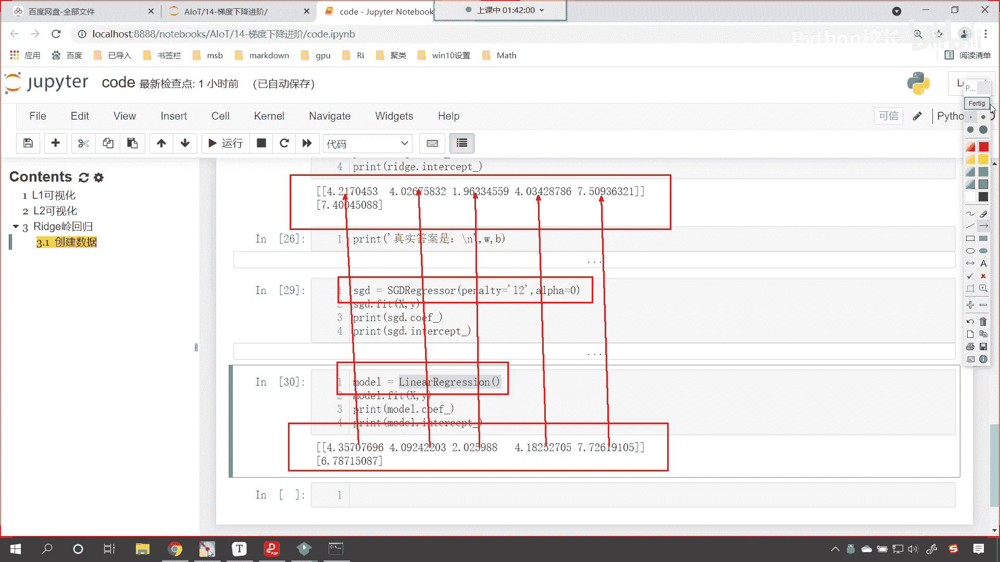