# P92：9-ElasticNet弹性网络使用 - 程序大本营 - BV1KL411z7WA

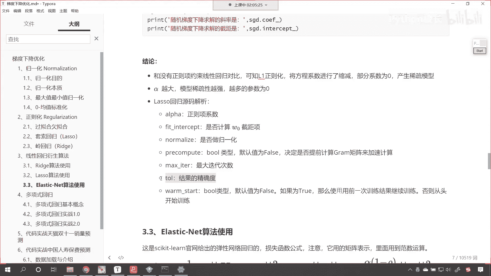

好那么我们最后这一个呢叫做elastic net，这个叫弹性网络，那这个弹性网络呢，sk learn官网给出的这个模型是这样的。

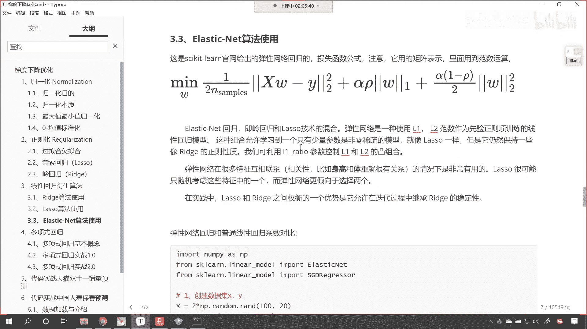

来我进入sk learn官网给你看一下。

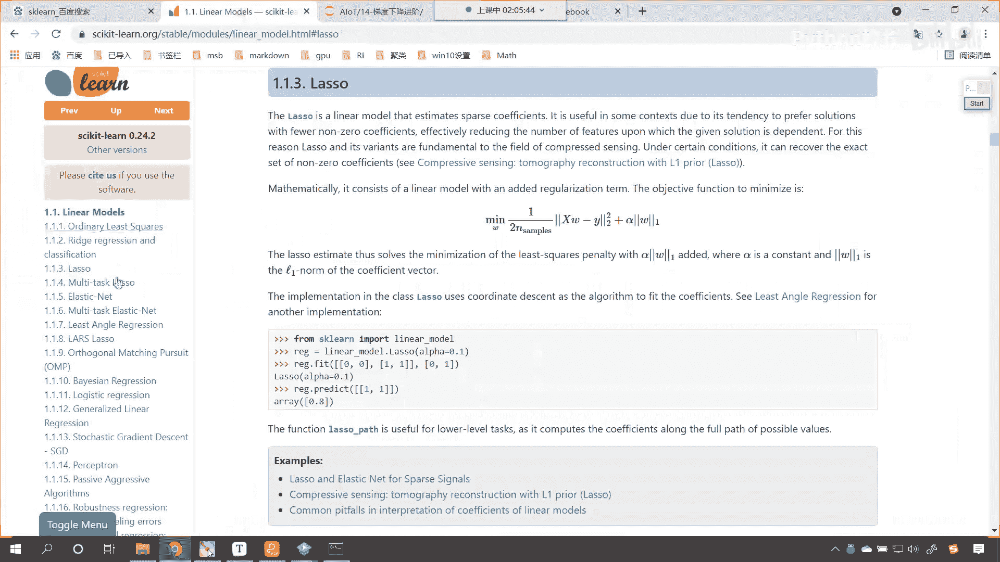

这叫elastic net，那这个elastic elastic和net呢它是弹性网络，其实这个弹性网络呢它就整合了l一和l2 ，你看它的公式，你看这一项是不是就是咱们普通的线性回归呀。

中间这一项是l一正则化，后面这一项是不是l2 正则化，哎，这就是弹性网络，看到了，有时候这个混合是吧，效果更好，你看这就是，为什么袁隆平发现的杂交水稻产量就是高，是不是因为混合了杂交了是吧。

这叫杂交优势，是为什么这个骡子为什么驴和马是吧，他们生的骡子就那么健壮呢是吧，吃的少干活多，是不是啊，这就是杂交优势，那我们现在也做一个杂交，咱们让l一正则化和l2 正则化是吧。

组合一下就变成了弹性网络，那这个弹性网络呢。

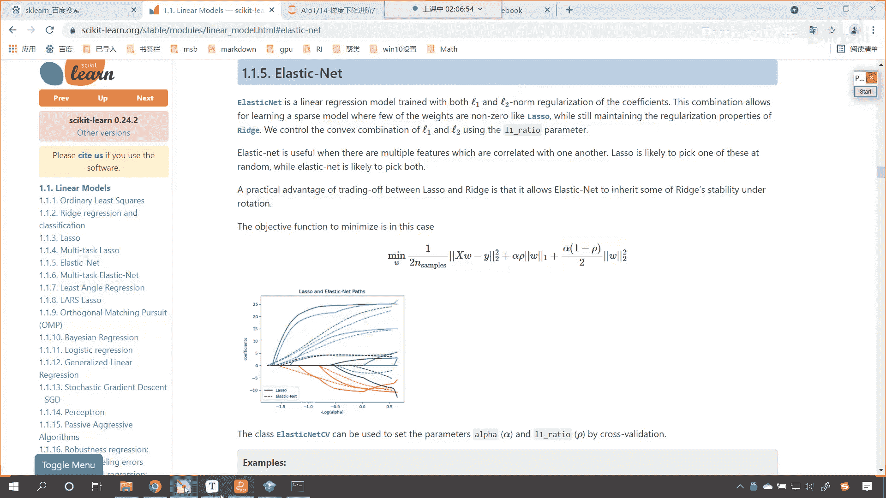

因为我们已经介绍了套索回归和领回归，所以说这个弹性网络它的作用，看它的作用，是不是依然将咱们的这个特征进行一个衰减，是不是elastic net，即领回归和螺丝回归技术的混合。

那么咱们的弹性网络是一种使用l1 l2 范数，作为先验正则项训练的这个线性回归模型，这种组合呢允许咱们学到一个只有少量参数，是非零系数的模型，也就是说既然是混合，那么我们学到的这个模型。

咱们这个模型当中就有一部分系数为零，但是它仍保持了一些领回归的这个正则性好。

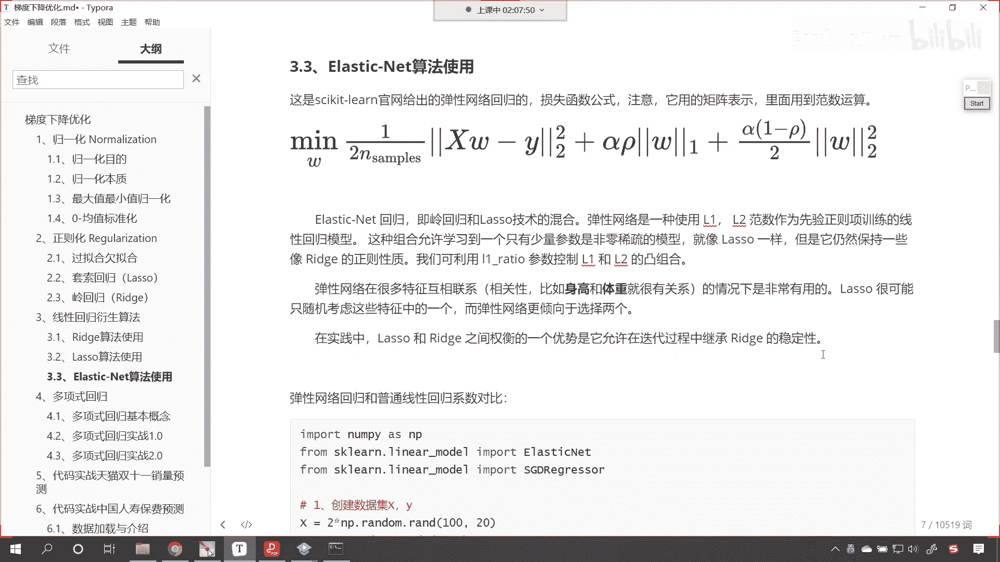

那么咱们现在呢一起来看一下，你看咱们现在呢一起来看一下。

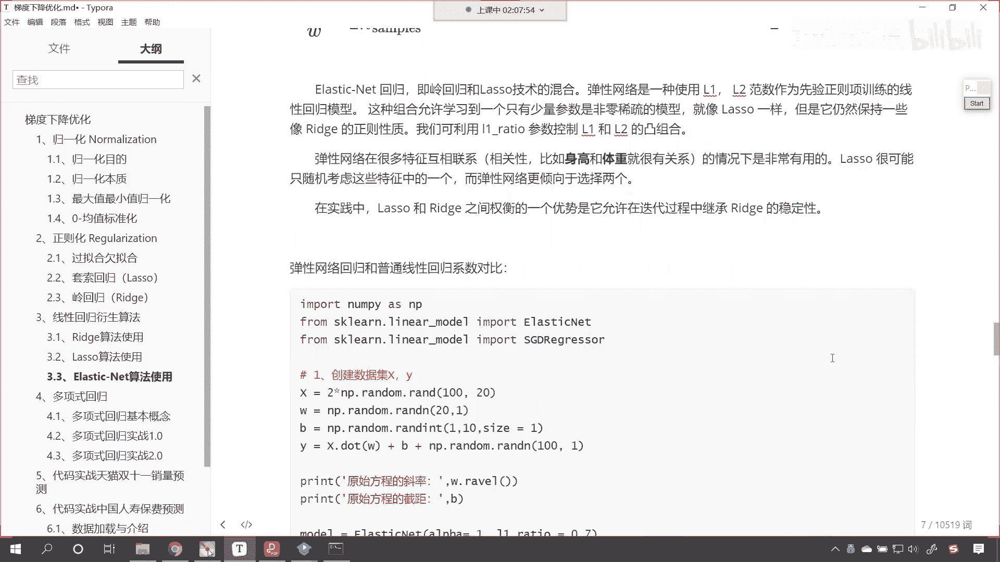

咱们的这个具体的应用啊，这个弹性网络还有一个特点，弹性网络呢在很多特征互相关联的时候，它是非常有用的，这什么叫特征，互相关联的，就是你的特征有相关性，比如说你看我们在学校的时候，经常会说说。

如果说一个学生的数学好，那么它的物理相应来说就会比较好，因为在物理当中很多都用到了数学的知识，是不是我们说一个学生他的语文成绩比较好，那他的文学功底厉害，那么他学英语学的是不是就比较好呀。

所以说咱们的语文和英语它是有关联性的，咱们的数学和物理，这两者之间也是存在关联性的是吧，因为呢嗯这个这个数学和物理，他都属于是理工科，那我们再举一个例子啊，比如说咱们的身高和体重。

他们俩之间就有非常深的这个关联性，你想体重是由什么决定的呀，体重体重和身高是不是很有关系，一般情况下你的身高越高，是不是你的体重就越重呀，所以说这俩是乘这个正相关的，我们一般不说他们是成正比啊。

因为这个还有胖瘦之分呢，是不是我们一般说他们是正相关是吧，正相关比咱们的正比就更有这个啊，这个空间了是吧，好那么这个在实践当中呢，螺丝回归和岭回归之间权衡的一个优势呢，它允许在迭代的过程中。

继承咱们这个领领回归的这个稳定性。

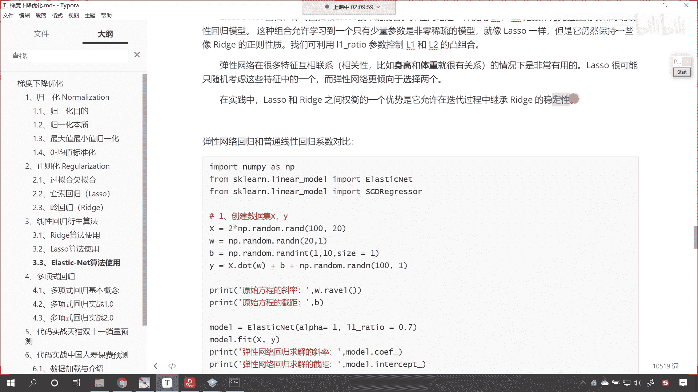

所以说才会有科学家，才会有这个啊，这个代码编程人员发明了两者融合的这个算法，好现在的话咱们就这个操作一下这个代码啊。

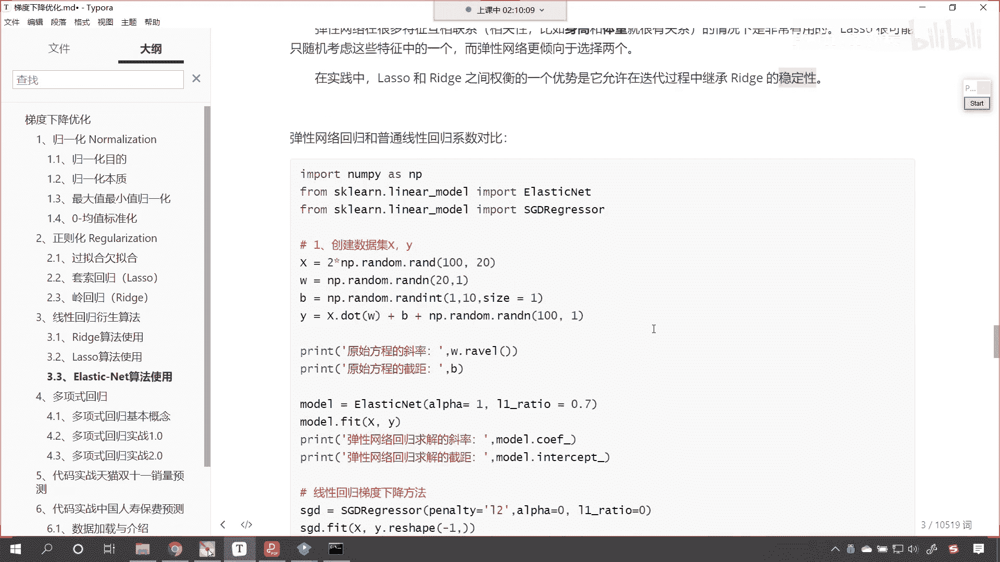

那这个代码呢我们就直接复制一下啊。

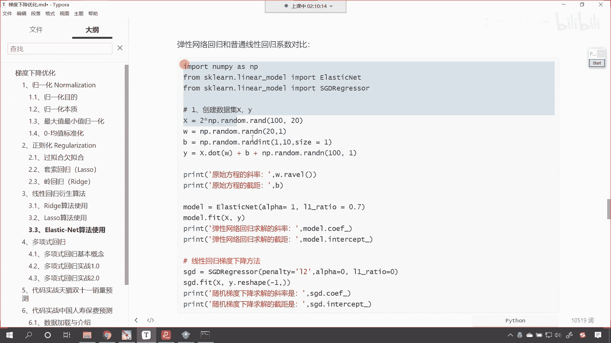

咱们就不一行一行写了，来复制一下。

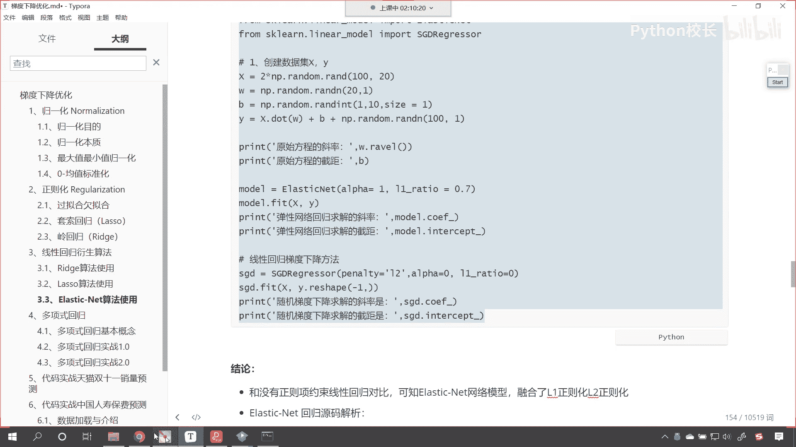

回到咱们的代码当中好，咱们在这儿呢给它添加一个三级标题，这个呢就是以less tik net，这个就是咱们的弹性网络，它呢确实有弹性了，它综合了咱们的领回归，综合了咱们的套索回归，那执行一下这个代码。

同样呢咱们是创建数据。

好，现在来我们运行这个代码，唉各位小伙伴我们就能够看到，你看这是咱们这个弹性网络求解出来的系数，大家看看是不是全是零了，那这个时候就不太对啊，咱们将这个弹性网络，我们将它的系数啊，咱们给它调整一下啊。

我们把阿尔法调整成0。5，咱们这个ritle呢调整成0。4执行一下来，现在各位小伙伴，咱们就能够看到咱们所使用的弹性网络当中，是不是有一部分系数为零了，对不对，看是不是有一部分系数就为零了。

现在呢我们同样也能够发现一系列的规律，看到了吗，这个是不是缩减为零，这个是不是也缩减为零了，看这个也缩减为零了，然后我们的负的1。3缩减成多少了，负的0。44，是不是，你看0。85是不是缩减成0。

36了，负的1。4是不是缩减到负的0。62了，对不对。

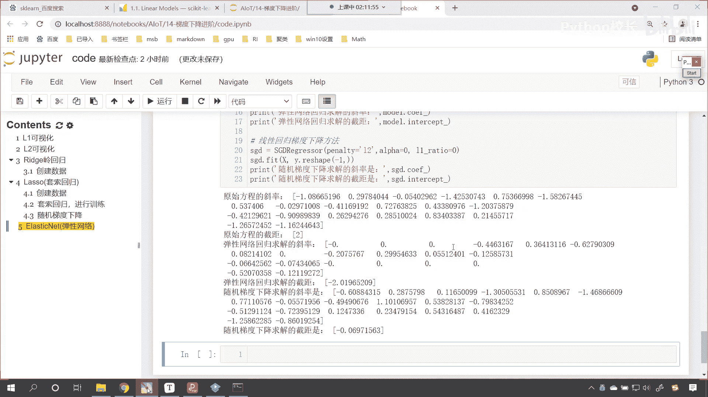