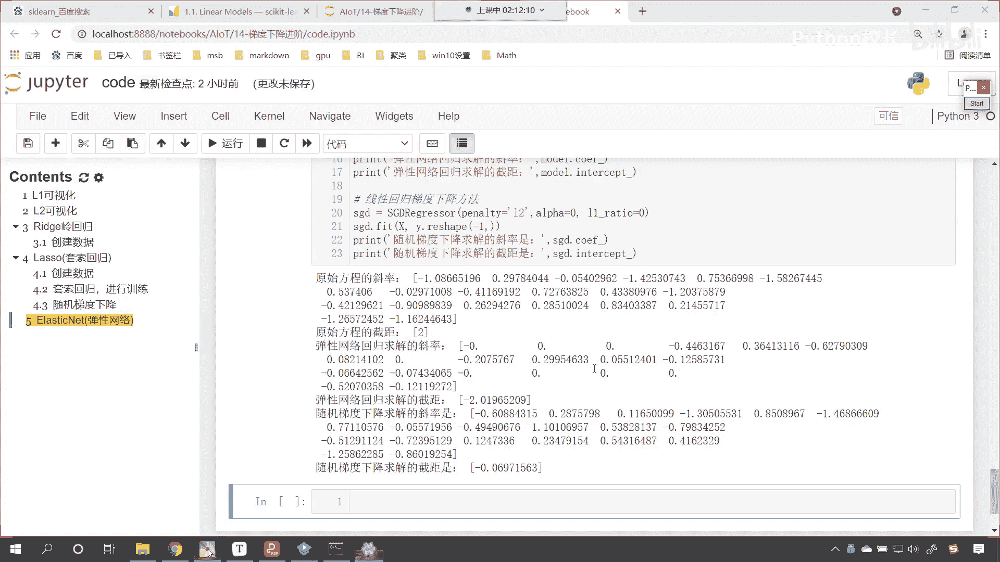
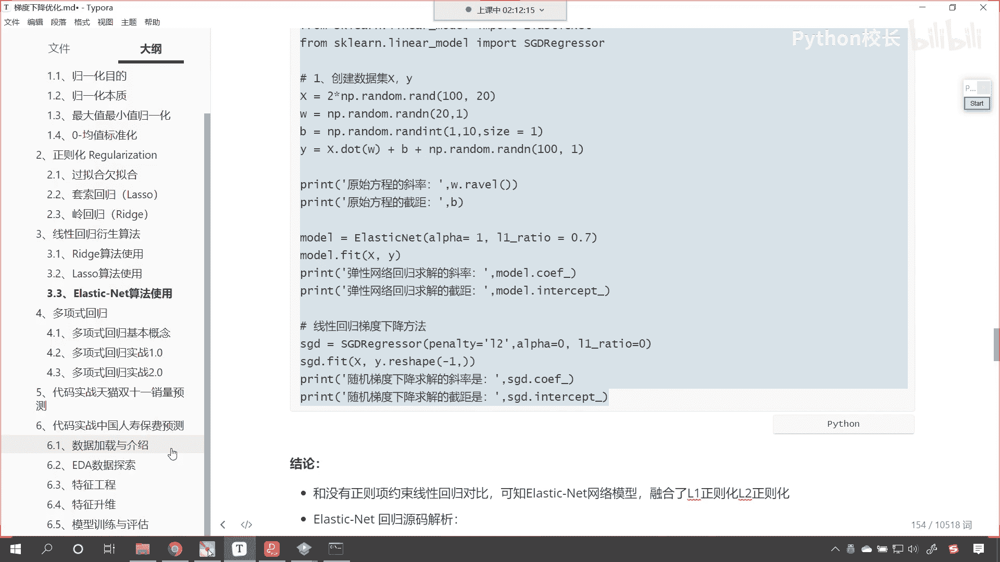
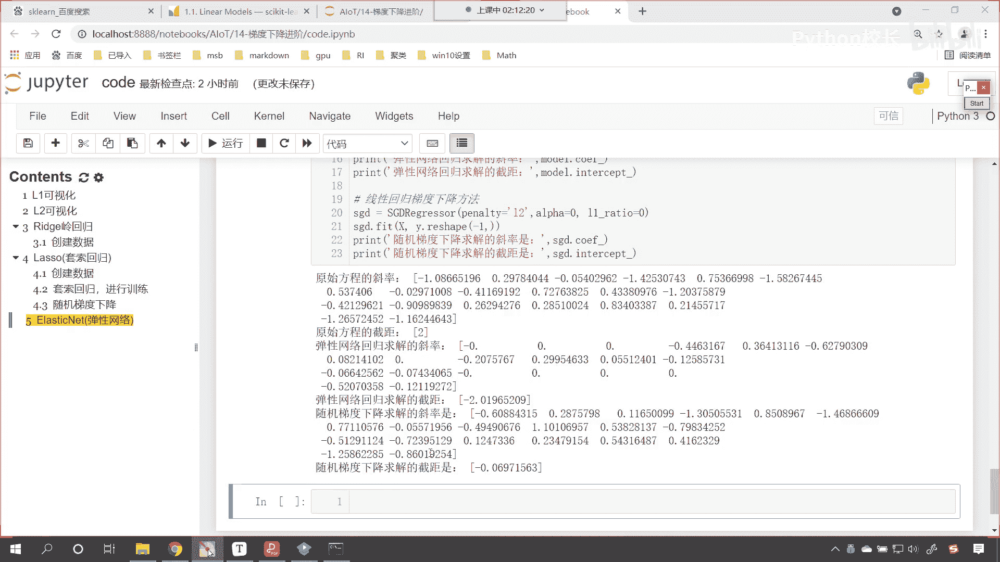
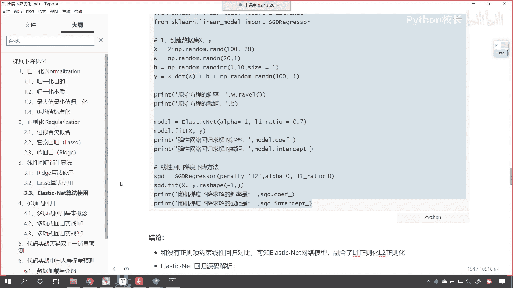

# P93：10-作业 - 程序大本营 - BV1KL411z7WA

呃今天咱们的内容呢我们就介绍完了。

接下来呢嗯我们看一下咱们的作业啊。

那我们今天介绍了三种线性回归的衍生算法，对不对，那这些衍生算法，它一定呢比咱们的这个普通线性回归，随机梯度下降，它更加优秀，他在处理真实问题的时候，它的结果稳定性呀，更加的这个更加的好。

那么我们要做的作业呢，咱们就使用这三种线性回归衍生算法，对于我们的天池工业蒸汽量，咱们呢继续进行训练预测，你看一下使用咱们这三种算法，和咱们之前所学到的线性回归相比，你看一下他们有没有一个长足的进步。

就有没有一个分数上的一个提升好。

