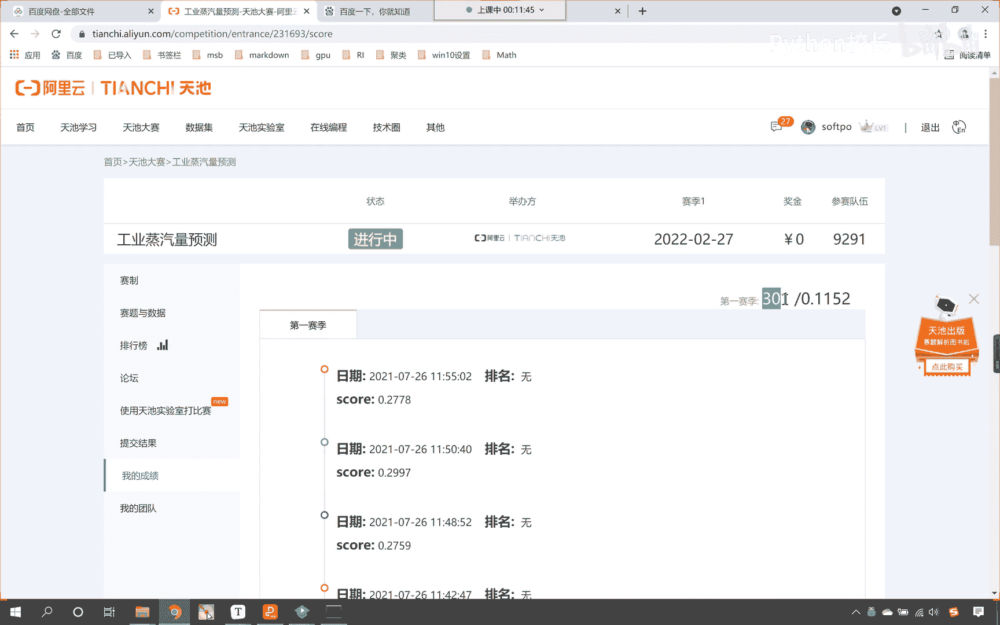
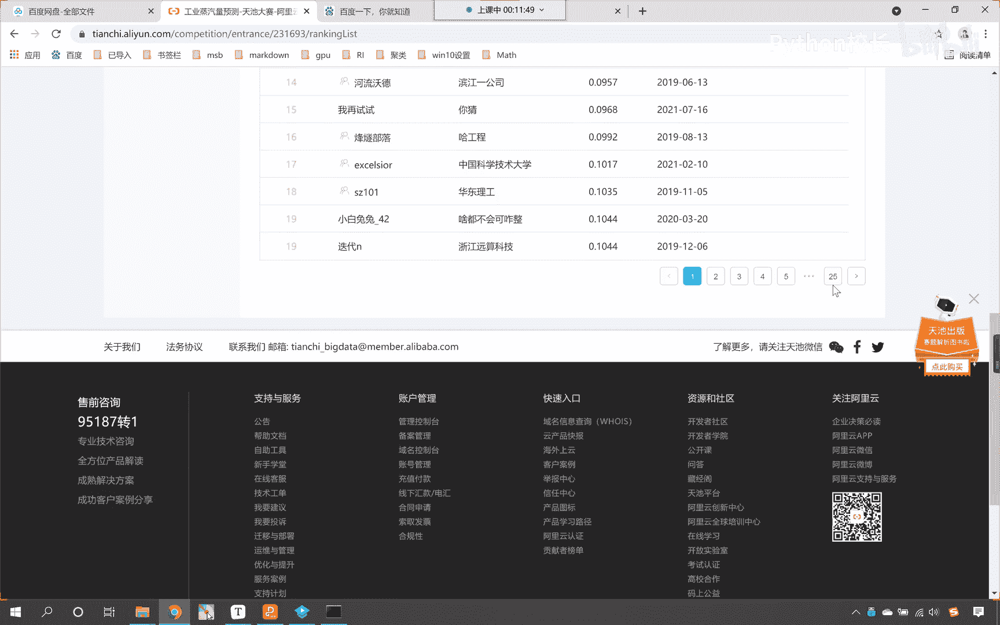
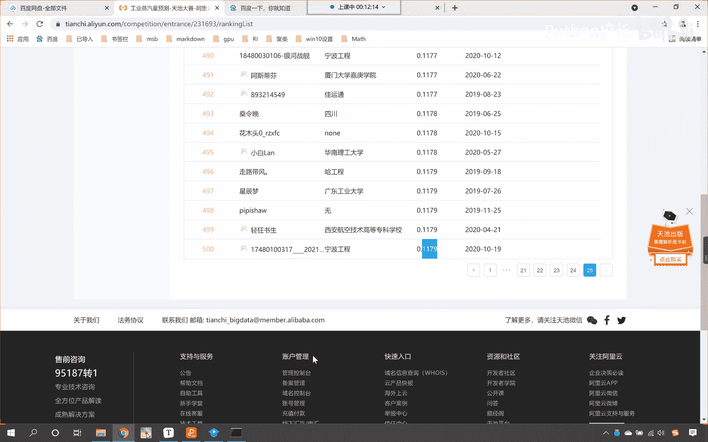
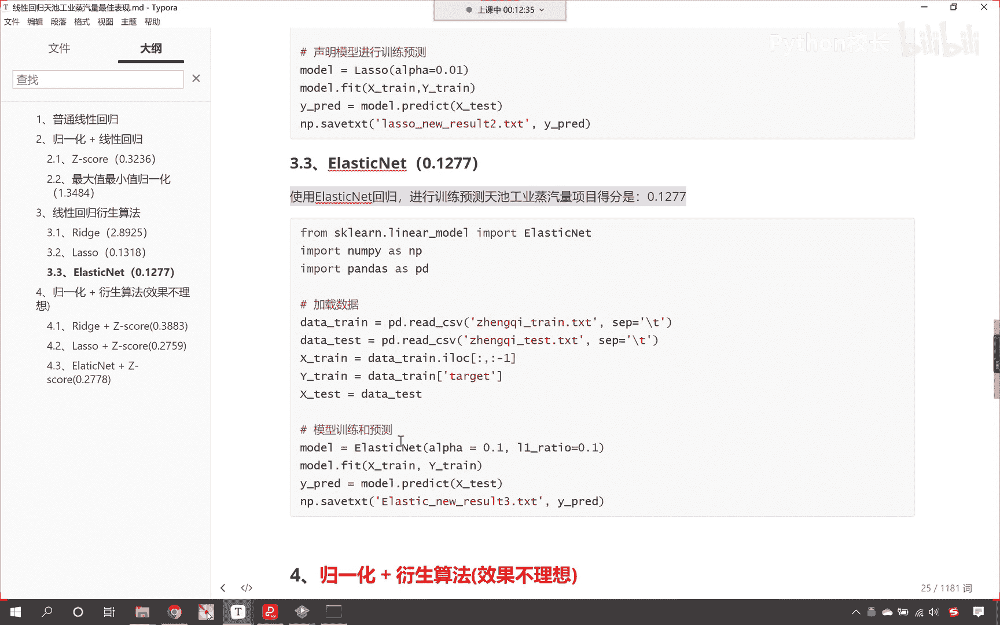
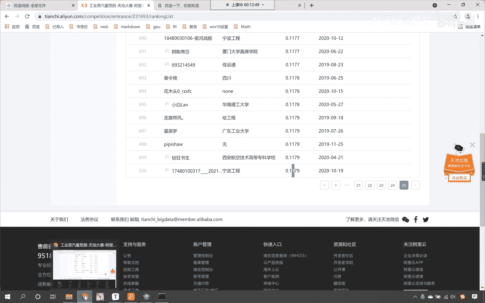

# P94：1-天池工业蒸汽量不同模型不同处理得分整理 - 程序大本营 - BV1KL411z7WA

呃那么咱们上一节课呢，给各位小伙伴留了一个作业，咱们作业的答案呢，我已经上传到咱们百度网盘当中了，这是咱们上一节课叫十字14，梯度下降的优化进阶，那各位小伙伴呢你能够看到我已经放进去了啊。

这个里边就有答案，那我们一起来看一下这个答案啊，咱们简单过一下，在这个里边儿呢，我就为各位小伙伴进行了一个总结，咱们从最一开始学到的普通线性回归，那我们在最开始学的时候，咱们没有进进行任何的处理。

我们就能够看到咱们的得分呢，看是3。0896，然后呢我们学习了规划操作，咱们归一化加线性回归，我们使用z score归一化，咱们得到的分数呢是0。3243236，这个就有了一个长足的进步。

进步空间非常大，就是因为咱们进行了归一化，那我们使用最大值最小值归一化，咱们发现这个分数要稍微低一点，那是1。3484，上一节课呢咱们学习了线性回归的衍生算法，那这些衍生算法都是对于。

咱们普通线性回归的一个改造，那咱们的领回归呢是l2 正则化，螺丝回归呢是l一正则化，现在呢咱们就发现使用领回归，咱们对于分数的提升效果不是特别明显，使用领回归咱们得到的这个效果是2。89。

各位小伙伴能够看到这个是2。89，注意咱们这个天池工业蒸汽量，它的分数呢是这个平均均方误差，那这个军方误差呢它的这个值是越小越好啊，这个值是越小越好，所以说呢你看领回归。

从咱们原来的普通线性回归的三点多，降到了2。89，这个也有改进，但是呢唉这个不太理想，然后我们又尝试使用了一下螺丝回归，各位小伙伴，你就能够看到螺丝回归的效果，是不是非常的棒呀。

我们得到的这个成绩呢是0。1318，看到了吧，已经降到0。1了，然后我们又使用了弹性网络elastic net，那这个弹性网络呢咱们给的阿尔法是0。1，给的l e ratio也是0。1。

咱们得到的结果是0。1277，看这个得到的结果是0。1277，各位小伙伴，我们可以进入这个天池工业蒸汽量预测，你看啊，我最近得到的一个最好的一个分数，是0。1152，如果你的分数是0。1152。

那么你就是300名，咱们总共的参赛队伍是9291人，看这是0。11，要是达到这个成绩，那么就是300名啊。

我们看一下啊，他这有一个排行榜，这个排行榜我们看最后一页。

看这个最后一页，第500名，咱们就能够看到是不是0。1179呀，只要你能比0。1179，比这个分数值还要小，那么你就能够上榜了，那么就能够上榜了，因为它只显示前500名，现在呢我们进行机器学习。

咱们才刚刚是吧，进入一点点，咱们才学了一类算法，那就是线性回归，那各位小伙伴就能够看到，你看我们此时咱们得到的这个分数，0。1277。

是不是就是就是临门一脚了呀，你看离这个500名，你看就差多少，是不是就差0。01啊，看到了吧，这是0。1啊，其实我们就和它差0。01，因为我们的结果是多少。

看咱们的结果是不是0。127，0。1277呀，你只要把这个二变成一，那么你就可以上榜了，随着后面咱们机器学习的深入，咱们一定会突破的，大家也不要着急，一步一步来是吧。

那咱们就可以这个有一个一点一点的突破，所以这个线性回归的衍生算法，这是我们上一节课所讲的内容，在这里呢，嗯嗯我呢就为各位小伙伴进行了一个演示是吧，咱把相应的代码整理了一下，好我们把相应的代码整理了一下。

那最后呢我又尝试了一下，咱们归一化，再加上咱们的衍生算法，那这个我标红了，咱们就发现这个效果呢不是特别理想啊，使用领回归加上z高，得到的分数是0。3883是吧，那那它比咱们单纯使用领回归效果是好多了。

对不对，咱们使用螺丝回归加z高，咱们的分数呢是0。2759，咱们使用弹性网络是0。2778好，那么这个markdown呢我们已经上传到百度网盘了，大家根据咱们的理解，根据咱们课堂上所讲的内容。

你自己也操作一下，那么其中呢这个里边儿大家可以对比一下，领回归它是不是属于是l2 正则化呀，螺丝回归是不是属于l一正则化呀，对不对，你看啊，一个是l2 正则化，另一个是不是l一正则化呀，现在的话。

咱们呢在这里对它进行一个标注和说明，那同时呢也将咱们上一上一节课所讲的内容，进行一个回顾，咱们的睿智呢它属于是l2 正则化，对不对，那我们下面的lasso回归，它呢属于是l一正则化，l一正则化。

它是不是属于是一次幂啊，大家还记得咱们上一节课在讲原理的时候，加了l一正则化，是不是相当于给解方程加了一个限制呀，那这个限制它是不是一个菱形呀，你还记得吗，看这个限制是一个菱形。

那这个菱形的中心是不是就是咱们的圆点呀，对不对，菱形的中心是咱们的圆点，如果我们加了l一正则化，它会出现一个什么样的效果呀，是不是我们的一部分系数，咱们的一部分系数是不是就会变成零，对不对。

唉那么在这里呢咱们又发现你在这里，咱们又发现使用螺丝回归的效果，比咱们领回归的效果好很多，那这就从侧面说明我们的数据中，有一部分属性它不重要啊，这就说明我们的数据中有一部分属性不重要。

因为螺丝回归把一部分系数变成零了，效果特别好，这就说明数据中有一部分属性不重要，而咱们的领回归它的作用呢是l2 正则化，它的作用呢也是缩减咱们的系数，但是呢它这个很少，他很少把我们的系数给缩减到零啊。

他很少把系数缩减到零，嗯所以说它虽然缩减了，但是一些系数没有到零，那这个时候领回归和咱们的普通线性回归，它求解出来的结果，你看差不多，咱们普通线性回归是三点多，领回归是2。8。

当然我们可以通过调整领回归的阿尔法啊，我们可以通过调整领回归的阿尔法，去把它的缩减给它增强，知道吗，可以把这个阿尔法调大或调小，你通过调整这个系数，你就会发现咱们提交的这个结果就会变大，或者说变小好。

那么咱们就通过这个答案呢，对于咱们上一节课所讲的领回归螺丝回归，咱们呢有一定的这个认知，那大家看下面咱们这个弹性网络，那更能说明问题了，上一节课，咱们说，弹性网络是不是集合了领回归和螺丝回归。

两者当中的优势呀，所以你看它既然是这个集合两者的优势，那么我们使用弹性网络，咱们得到的这个分值就是0。1277，这个0。1277，大家注意它不一定是最好的，因为各位小伙伴可以通过调整阿尔法。

调整l1 ritual这两个参数，来把咱们的0。1277是吧，它呢还可以继续降低，知道吗，这样的话这就需要各位小伙伴去尝试了是吧，你缓慢的把它调整，看一下到底哪一个更好一些，好这个呢就是咱们上一节课。

