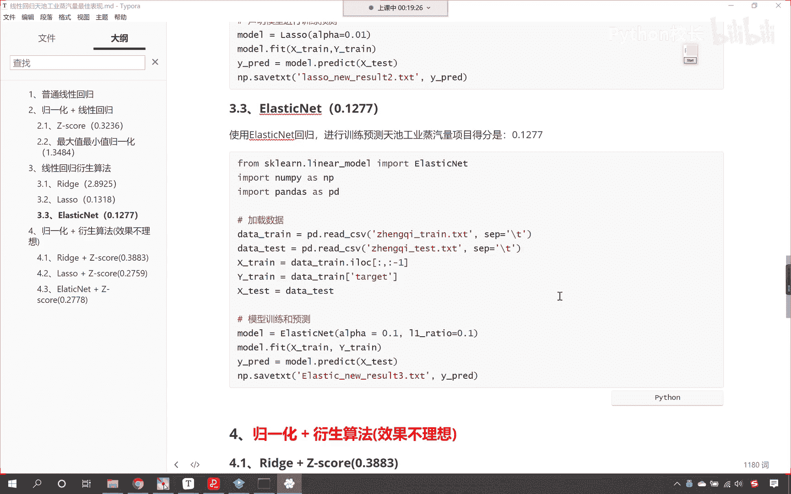
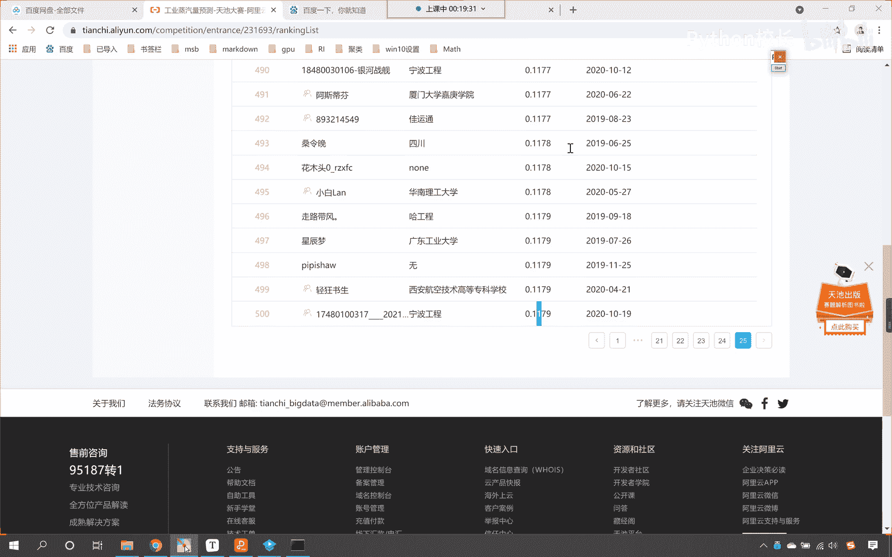
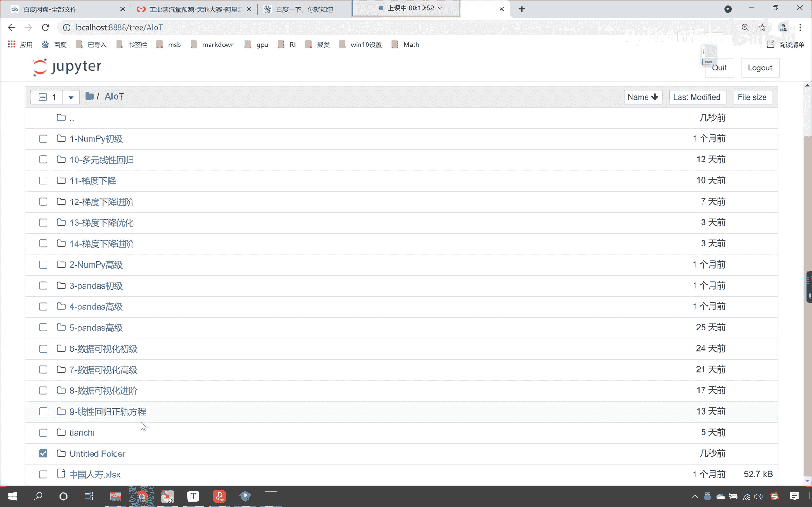
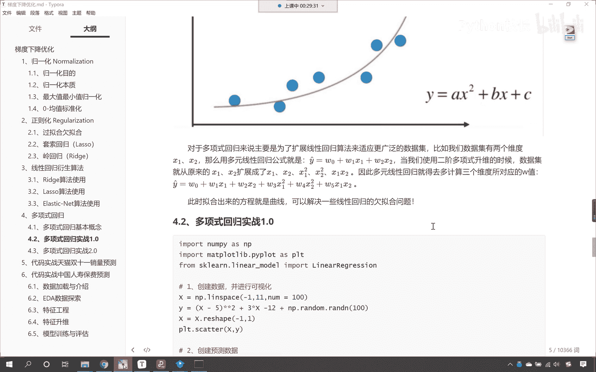

# P95：2-多项式回归升维概念介绍 - 程序大本营 - BV1KL411z7WA

啊我们继续向下看好。

那么这个就关闭掉了。

大家呢可以在百度网盘上找到咱们这个文件，那我们就看咱们今天的内容好，咱们今天的内容呢，我们先在咱们的这个主per当中，我们呢进行一个创建，咱们创建一个文件夹，给这个文件夹选中。

咱们改个名儿好，那这个呢就是幺五杠，这个呢是咱们线性回归啊，咱们有一个升维运算和实战。

那咱们就进入到这个文件夹当中，进入目录当中，咱们创建一个代码，咱们给它改个名叫code好，那么来咱们回到今天的课件当中，首先呢我们看一下多项式回归，那之前咱们讲的都是线性回归，线性回归呢有一个特点。

咱们的幂次它都是一次幂啊，都是一次幂，那什么是多项式呢，看啥是多项式，咱们是不是有二次幂，是不是也有三次幂啊，对不对好，那么对于我们的数据而言，咱们呢给各位介绍一下维度，那什么是维度呢。

你看一维一维就相当于一条线，也就是说它的数据呢只有一个特征，二维就相当于咱们的坐标系，看到了吧，有x轴，有y轴，三维就相当于是咱们生活的空间，那这个时候这个数据是不是就更多了呀，那多项式回归。

其实呢它也是咱们线性回归的一个衍生，那我们的这个多项式呢，咱们可以给各位举一个例子，大家就能够看到在咱们右下角有一个方程，y呢就等于a的x平方加上b x加上c，各位小伙伴，你来想一下。

如果要使用咱们之前所学到的方法线性回归，我们能不能把这个这叫做二元，这叫做一元二次方程给他求解出来，你看这是不是一元二次方程呀，那这个一元二次方程，它所对应的系数是不是就是a b c呀。

咱们能不能通过咱们之前所学所学到的线性回，归，把这个方程解出来，也就是说把a b c对应的这个系数，是不是求解出来呀，大家看一时看到这个，我们就这个不知道该如何求了，是不是因为我们之前的方程。

咱们之前所学习到的，咱们都是一维的啊，之前咱们学习的线性回归，看到它都是一维的，那如何进行二维的一个转变呢，对不对，如何进行二维的转变呢，你看大家就能够看到咱们坐标系当中，这些点是吧。

它们之间的规律你看是不是拐弯了呀，而我们之前所讲到的线性，你看咱们之前所讲到的线性，那什么是线性的，线性是不是就是一条直来直去的直线呀，你看这是线性，对不对，红色的这条线它是线性。

而咱们现在呢你看拐弯了，拐弯了，那线性回归该如何求呢，兵来将挡，水来土屯，是不是水来土掩，我们都有办法，咱们可以做升维啊，咱们可以做升维运算，这啥是升维呀，就是把一维的数据，咱们想方设法把它变成二维。

或者说想方便想方设法把它变成三维，这就叫升维，因为在你维度比较低的时候，或者说在我们层次比较低的时候，当我们遇到一个问题，我们就很棘手，很难解决这个问题，是不是我给你举一个例子啊，你比如说是吧。

咱们大部分人都是生活在社会的底层，是不是那高层的人呢就往往比较少，你比如说咱们就和这个马云做一个对比吧，我和马云比，马云属于是高层，它属于是高维，我属于是低层，我属于是低维，你看如果说我想要挣挣一个亿。

是不是啊，那这个就太难了对吧，那我得奋斗好几百年才能成功的，而马云呢是不是这个实现一个小目标，是不是就是分分钟的事情呀，对不对，所以说层次不一样，维度不一样，那么它的方式就完全不一样。

咱们所生活在低维空间，层次低的时候，数据少的时候啊，注意啊，我们说维度低对于我们机器学习而言，那其实就对应着数据少，知道吧，就是咱们的粉儿是不是有限呀，人家高维高层次的人是吧。

人家的方式有很多在咱们这儿是吧，这个就愁破大天了是吧，到人家那就一句话就能搞定了，好那么所以说这个数据看数据的这个数据呢，我们的多少，咱们呢可以把它叫做维度，所以啥是升维的，什么是升维啊。

升维就是把数据变多，把数据的特征咱们给它变多，那么我们一起来看一下啊，咱们在做升维的时候，最常见的手段就是将已知的维度我们进行相乘，看到了吧，就是我们来一个乘法，就是你自己和自己相乘。

这个时候是不是就变成了二次幂呀，看到了吧，如下图所示，咱们普通的线性方程是无法拟合这个规律的，它必须得是多项式，才可以完美拟合咱们曲线的规律，图中就是二次多项式，也就是说如果我给了你这样的一个数据。

那么你使用线性回归，要对这些蓝色的点进行拟合，你拟合出来这个方程往往是不对的，因为呢你看很显然，这条线是不是就是一个二次二次方呀，对吧，它应该的标准答案是不是，就是咱们所看到的右下角这个方程呀，对不对。

那所以咱们的方式呢，我们就可以最常见的方式就是让它自成，来自成的话是不是就相当于平方呀，当然咱们的升维不仅仅局限于自成，你想这个自称是几次幂，这个自成是不是就是两次密呀，那我是不是可以来三次幂。

我能不能来四次幂，是不是啊，都可以啊，好那么咱们接下来继续往下看啊，看啊，对于多项式回归，那主要是为了扩展线性回归算法，来适应更广泛的数据集，比如说咱们的数据集有两个维度，各位小伙伴就能够看到。

咱们举例子举得比较简单，有两个维度，那就是x一和x2 ，那么用多元线性回归，咱们的方程就对应着就对应着这个方程，那就是y预测等于w0 加w ex加w2 x2 ，这个就是咱们之前所讲到的线性回归。

那当我们使用二阶多项式升维的时候，咱们的数据呢就有原来的x一和x2 ，各位小伙伴，你就能够看到它呢进行了一个扩展，它扩展成什么了呀，唉你看是不是就变成了x1 x2 ，x一的平方，x2 的平方。

那么我们x一和x2 是不是也可以进行乘法呀，对不对，那这个时候咱们的特征就有原来的两个，现在是不是就变成了五个呀，你想你的，你想一下特征多了，我在进行拟合的时候，那么我的系数是不是就多一些。

那么我所求解出来的解是不是就可能更合理，更优化呀，这个时候咱们所进行升维之后，大家注意啊，我们将x1 x2 变成咱们这五个，就是x1 x2 x一的平方，x2 的平方x一乘以x2 ，我们把它变成这个。

那么我们这个操作就叫升维，大家现在知道什么叫升维了吧，我们这个升为咱们咱们使用了二阶多项式升维，其实升为咱们说了，你不仅仅可以平方，对不对，你甚至是不是还可以立方呀，看了不仅仅可以平方，还可以立方。

还可以四次方，但是一般情况下两次方三次方就可以了啊，高次幂我们用来做新数据的特征往往就比较少，好，那么咱们现在呢就将多项式回归相应的概念。

