# P96：3-多项式回归升维实战（一） - 程序大本营 - BV1KL411z7WA

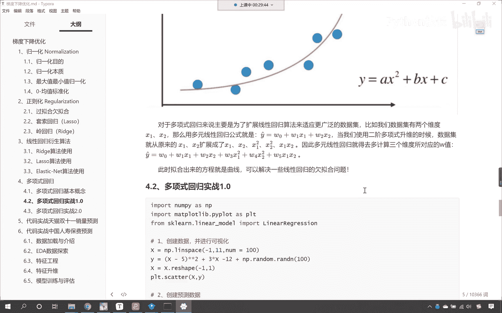

咱们继续往下看，那我们就看一下多项升维的实践好不好。

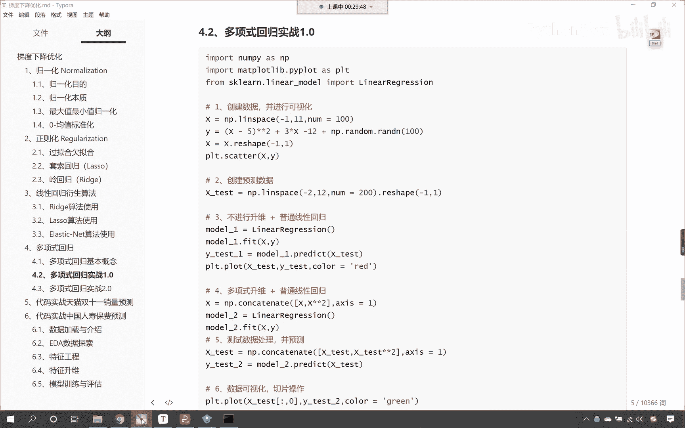

现在呢咱们就回到代码，那我们就来一个三级标题，这个呢就叫多项式，回归升为实战，哎这个呢就是咱们的实战一，现在呢我们导一下包，咱们呢import numpy as np，那我们画图画出来。

咱们import matt plot，lib，piplot as plt，把这个画出来，那么同时呢我们导一下咱们的算法包，咱们从linear model当中。

我们导入叫linear regression，好，现在导包了，紧接着呢我们就创建数据，好不好，好，接下来呢咱们就嗯在这儿呢叫做创建数据好，那么咱们创建数据呢，我们给一个xx呢，就等于np。

lin space，咱们给一个范围，从-一到11，我们给一个，那么我们让它生成100份，然后呢给一个y y呢就是咱们的目标值，在这里呢我们就给一个方程啊，咱们让x我们让它减去一个五。

然后星号星号的平方啊，星号星号的平方，这个是不是就是一元二次方程呀，然后呢三乘以x，三乘以x，然后呢咱们再减去12，那y呢是咱们的目标值，在这里呢咱们给它加一个噪声，那就是np。random。

咱们调用run，我们给个100，这个时候呢大家看咱们这个数据就出来了，那出来这个数据之后呢，各位小伙伴啊，x是不是一维的，咱们的y也是一维的。

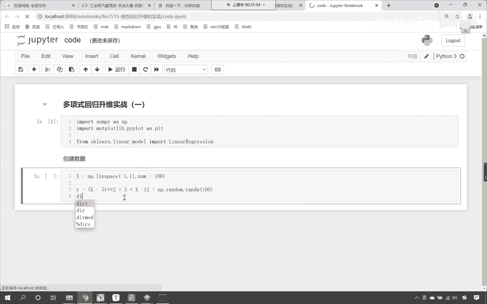

在这里我为你展示一下x y，你看这个时候一执行，大家看这个是不是都是一维的好，那么我们机器学习用到的x，它的数据形状是不是必须得要求是二维的呀，所以咱们对x进行维度的变化，x呢就等于reshape嗯。

咱们把它变成-1和一，这个时候哎，那么咱们的数据呢就是大家看看咱们的数据，它呢就是二维的数据了，因为呢机器学习咱们的算法，它呢对数据是有要求的，有了这个x之后，那咱们就画一个图吧。

看一下我们所得到的xy它长什么样，那咱们就plt。scanner，咱们将x放进去，将y放进去，这个时候你看我一直行，咱们是不是就得到这样的一条线呀，我们得到了这样的一条线，大家看得到了这样的一些点。

那它的规律是有的，是不是啊，那我们现在嗯咱们呢就使用，你看我们不对这个数据进行处理，咱们呢就使用线性回归，啊咱们使用线性回归，我们进行预测好不好，那这个时候咱们就声明一个model。

就等于linear regression，然后呢咱们就model。feet，将咱们的xy放进去，你看这个时候，咱们是不是就进行了模型的训练呀，那训练之后咱们是不是就开始预测了，对不对。

那我们就预测一下啊，咱们的测试数据还没有呢，那就来一个x test，就等于np。lin space，咱们也给他来一个线性的这个等差数列，上面咱们的测试数据是从-一到11。

那这个地方呢咱们可以让它从-二到正12，我们把它分成300份，你看这样可以吧，对不对，这些数据呢是新生成的，那我们为了机器学习，对于形状呢嗯它匹配，咱们在这儿直接reshape，来一个-1和一。

那这个-1呢哎就表示自适应它的形状好，现在大家看咱们这个数据有了预测数据就有了，然后呢咱们model。feat，咱们将x下划线test放进去，那你想它一预测返回的结果，是不是就是y predict呀。

那这个就是咱们的预测值，现在呢我们画出图来，我们看一下咱们的这个算法，有没有根据咱们上面这些点的规律是吧，很好的把这个数据预测出来，那我们就画出来图吧，plt。scanner，咱们先将原来的xy放进去。

然后呢plt。plot，咱们把x下划线test放进去，y下划线predict放进去，然后呢我们给他指定一个颜色，这个color呢就等于grey，唉大家现在呢就能够看到，这个呢我们在这说明一下。

这个呢就是算法的预测，你看啊，这是预测的数据，咱们的数据范围呢我们是从-2，是不是一直到12啊，咱们是等差数列，我们把它分成了300份啊，这个是等差数列，啊咱们把它分成了300份。

那我们就使用算法一预测，是不是算法预测，然后呢咱把原来的数据给它绘制一个图形，那我们将预测的数据画一个图形，看这个是预测数据，这个时候你看我一执行嗯，咱们现在呢有一个地方是不是给报错了。

咱们在进行feat的时候，看我们在进行feat的时候，咱们这个给写错了，上面的数据是不是x和y啊，所以我们在进行训练的时候，这个肯定都是自动补全它的问题啊，有时候自动补全不小心按了一下回车。

是不是就补全了，现在我们根据错误提示修改一下，再来执行这个代码，好这个时候咱们能够看到啊，唉大家现在就能够看到x xy must have the first，这个时候他说咱们的这个数据形状。

是不是不太对呀，好那这个地方咱们进行了feat，那么我们还差一步，咱们是不是还没有进行这个预测呀，注意啊，咱们在进行feat的时候啊，在进行feat的时候，它的返回值是这个不用接收的。

那我们就接收一下y predict，就等于训练完之后的模型，咱们调用它的predict是不是就可以了，把咱们要预测的数据x test放进去，此时我们再来执行，各位小伙伴，你就能够看到。

咱们看预测的结果是不是就出来了呀，那这条绿色的线就是咱们算法根据这个模型看，根据咱们线性回归预测出来的结果，我们此时就发现看到了吗，此时就发现这条绿色的线和咱们这些蓝色的点，它的规律是不是不吻合呀。

对不对，你看这个规律是不吻合的，那请问为什么呢，你知道为什么这个规律是不吻合的吗，你能够看到我在进行数据创建的时候，我在进行数据创建的时候，咱们的x是不是有一个平方呀，那既然有一个平方。

那么它就属于是多项式，对不对呀，而我们使用咱们的线性回归，它在进行预测的时候，它是不是一维的呀，对不对，你既然是一维的，那规律，你自然是不是就无法获取呀，对不对，你是一维的。

那么你就没有办法获取这个规律好，那么接下来咱们对数据进行一个升维啊。

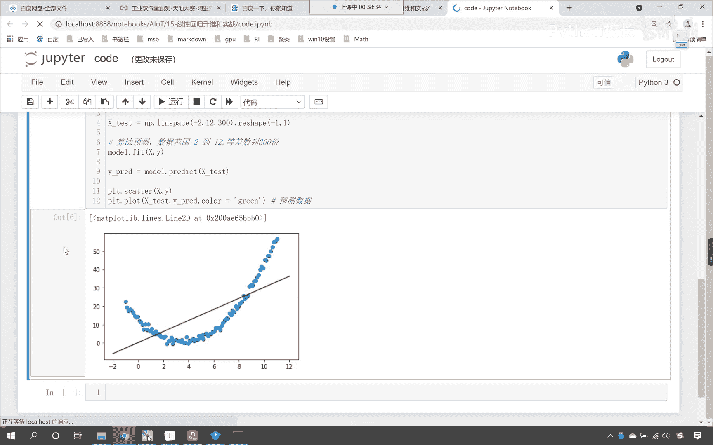

你看我的操作啊，来上面的方法走不通了，咱们接下来呢对于数据进行升维，那升维之后你想一下，咱们把它变成二维的，你看把它变成二维的，那么变成二维的，变成二维之后，咱们这个曲线是不是就可以拐弯了呀。

看变成二维之后，这个直线呢就可以，那直线就可以拐弯了，看到了直线就可以拐弯，这就是它的强大之处，那咱们如何把它变成二维呢，那这个时候呢看咱们的数据是不是x，我让x星号星号平方。

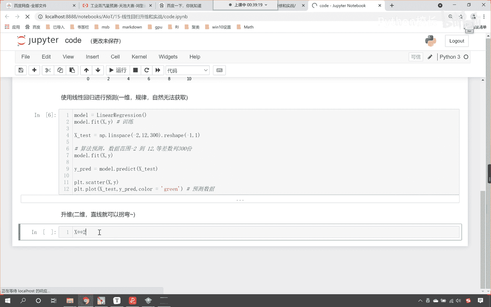

你看它是不是就变成二维了，看到了吧，这个数据就变成二维了，然后我们就操作一下，让这个数据和原来的数据咱们进行一个合并，那调用conquinnate这个方法，可能调用concocnate这个方法。

原来的数据是x，看到了吧，原来的数据是x，那x逗号x2 ，咱们在进行合并的时候，得需要指明一个轴，我们让这个轴等于一，为什么这个轴等于一呢，因为合并的时候，咱们是不是列进行合并呀，对不对。

你看原来的数据插入一行x，你看你原来的数据是不是这样的呀，我如果希望把这个数据升为看，我希望将这个数据升为，我是不是在它的右边，我是不是来一个平方，你原来是一，那你是不是就是来一个平方的话。

你是不是就是正整数一呀，对不对，你看你来一个一的话，就是正整数一，那这个负的负的0。8787，它的平方呢唉也是一个正数，是不是，所以说呢咱们如果想要实现维度的升维。

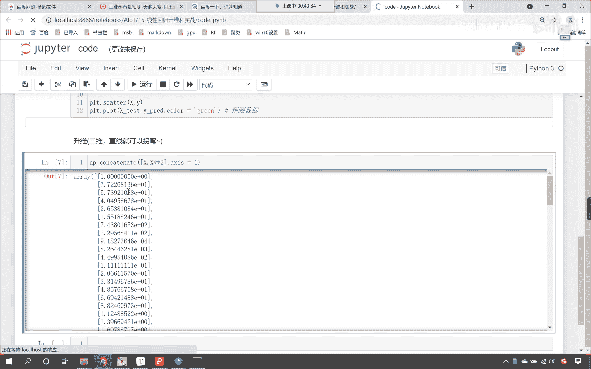

咱们就调用conky的这个方法，这时候你看我一执行。

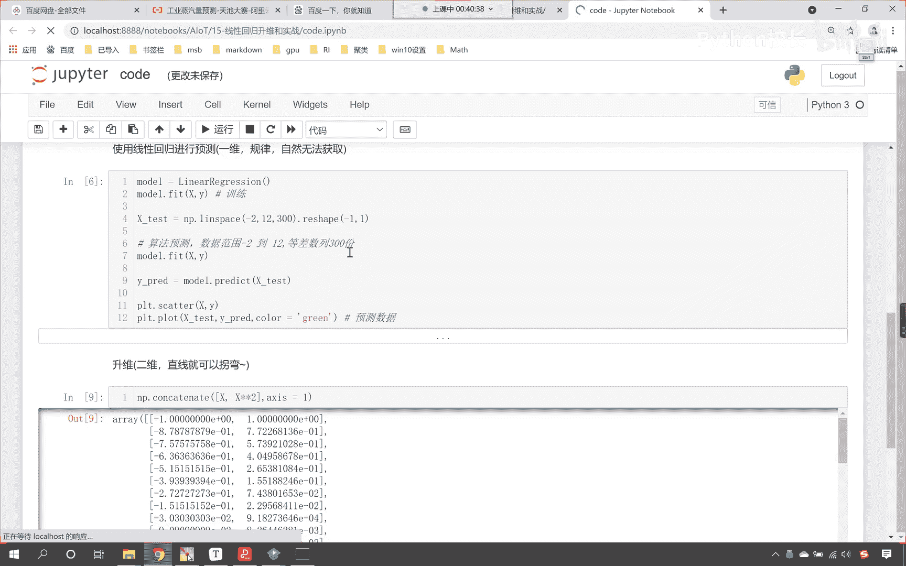

咱们这个数据是不是就升为了呀，此时这个升维之后，他用的是科学计数法，如果你看了科学计数法不太舒服，那我们就设置一下，那咱们就set print option，在这个里边呢叫super press。

我们给它设置一个true，这个时候大家看咱们此时是不是，就是这个普通的保留位数来表示了，对不对好，那么得到这个数据之后呢，咱们起名叫x2 啊，看这个数据就是x2 ，就表示它是二维的好。

那么你想这个数据升为了，请问咱们的目标值需要修改吗，你看我们的目标值需要修改吗。

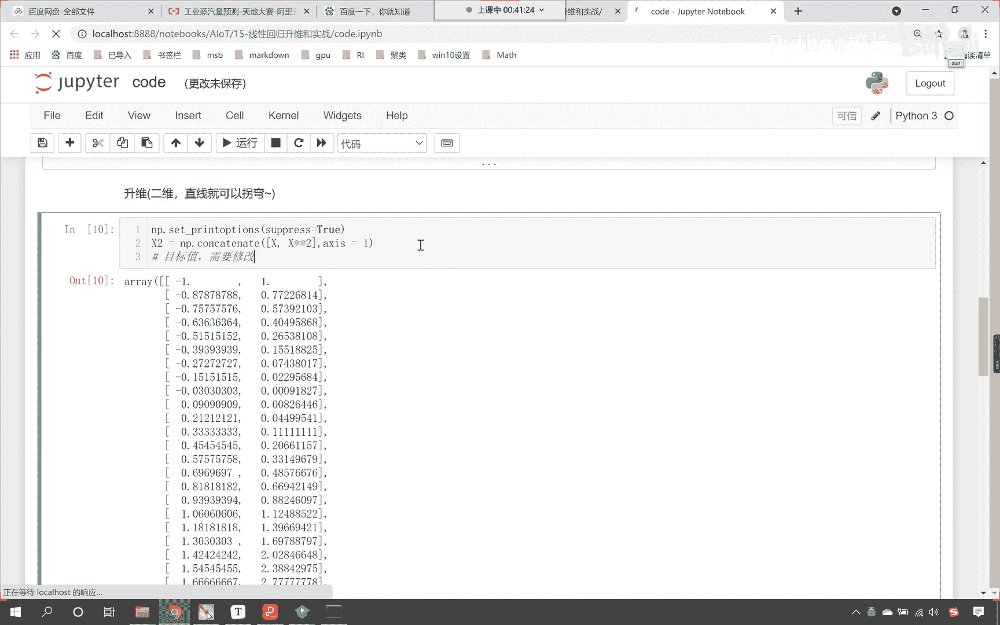

想一下目标值是不是需要修改，目标值是不需要修改的啊，在这儿呢直接告诉大家答案，目标值不需要处理，因为目标值就是咱们上面画出来这个图形。

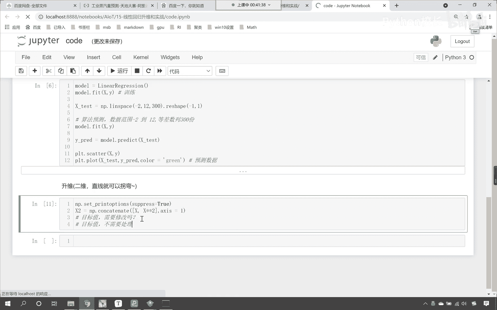

它的y轴知道吧，目标值就是它的y轴好，那么因为x轴呢它是二次的是吧。

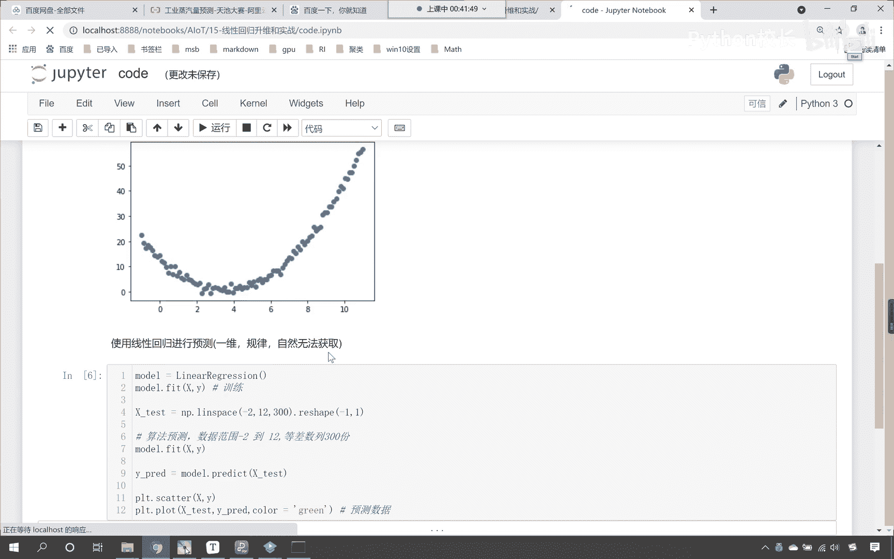

它是平方关系，所以说我们对于x进行了一个平方好，现在你看数据准备好了，数据准备好之后，咱们依然在声明一个model，这个时候就是model 2，我们依然使用linear regression。

然后咱们使用model 2点，咱们就feat一下，处理好之后的数据x2 原来的目标值是y，把这个放进去，放进去之后呢，咱们依然使用model 2，咱们调用它的预测方法，那就是predict。

咱们将x下划线test放进去，刚才我们预测的时候效果是不是不准确，现在咱们再预测一下，得到的结果叫y predict好，那么训练了，咱们也进行预测了，接下来呢咱们就进行数据的一个可视化，可视化一下。

那就是plt。scanner，咱们先把原来的数据绘制一下x和y，这个是咱们原来的点，那我们算法预测的怎么样，来接下来呢咱们算法预测的结果，咱们进行一个绘制，那就是plt点，plot开始开始绘制了啊。

那就是x test，这是咱们预测的数据，然后y predict，我们接下来给他一个color c o l r2 ，咱们这个color呢就等于green，这个时候你看我一直行，咱们在预测的时候。

是不是又有一个参数给报错了，报了一个什么错，是不是说明咱们的x test看到了吗，哎为啥报了一个什么样的错，叫value error，我们往下看一下啊，你看在这儿，咱们就能够发现我们的训练数据。

是不是二维的呀，而咱们的测试数据test它是一维的吧，我们没有对他进行处理，对不对，那咱们也对它进行一个处理，我们的训练数据是什么样的，咱们的测试数据也必须得是什么样的。

那就是x test 2就等于np点，cocoinnate中括号x下划线，test x下划线，test星号星号，咱们是不是也得需要给他来一个平方呀，在进行直吉连的时候，给他指定一个轴，x等于一好。

那么它也变成二维了，咱们在进行预测的时候，咱们就预测这个x test 2，那绘制图形的时候，大家要注意啊啊算法预测结果，绘制图形的时候，咱们依然那绘制图形的时候，咱们依然使用原数据，你要注意啊。

这个时候咱们的数据升为了，你想是不是在一次幂的基础上，是不是进行了平方呀，对不对，看它呢进行了一个平方，所以如果要画图，咱们是不是依然使用这个一次幂呀，这个时候你看我一直行，来，各位小伙伴。

咱们绘制的绿色的不够明显，咱把它变成红色的，这个时候你看我一执行。

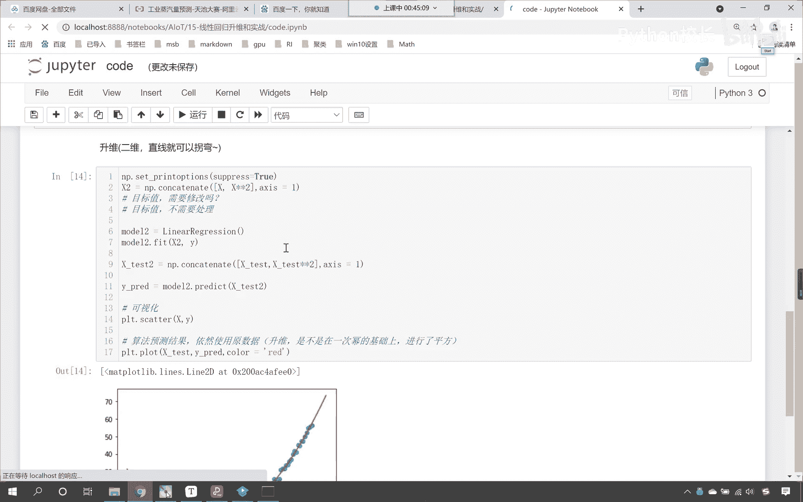

大家现在就能够看到规律是不是就找到了，看到了吗，规律找到了吗，红色的这条曲线是不是就非常好的拟合了，咱们这些蓝色的点儿呀，如果你想要知道咱们这个模型，咱们这个方程它是什么样的系数。

那我们就可以调用model 2点call if执行，大家看它是负的，它是负的，这个7。09，那么它的截距是多少呀，model 2点intercept，它的截距是13。06，看到了吧。

这个就是咱们使用升维。

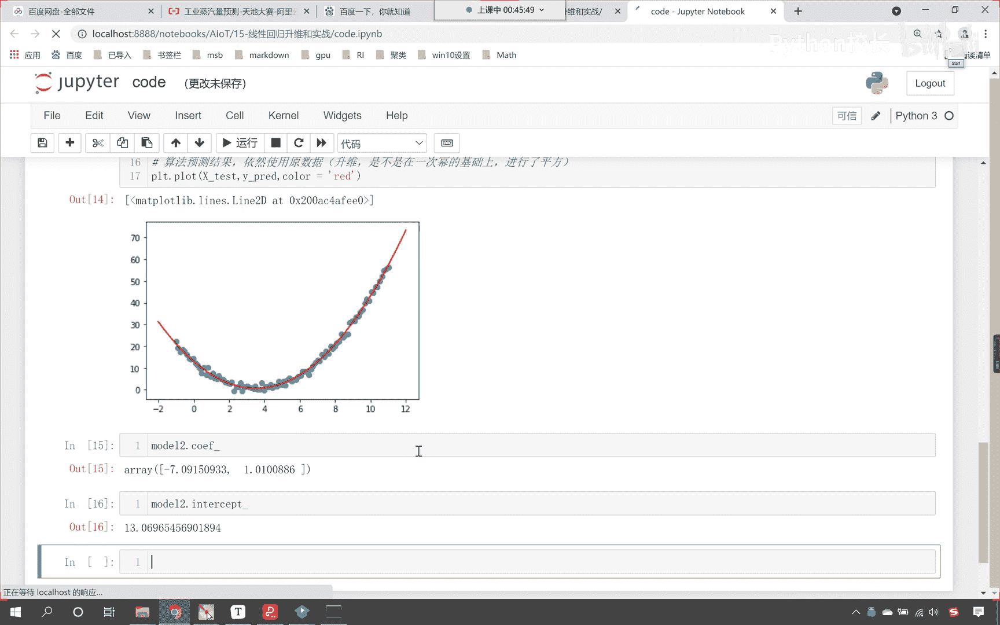

我们使用多项式升维。

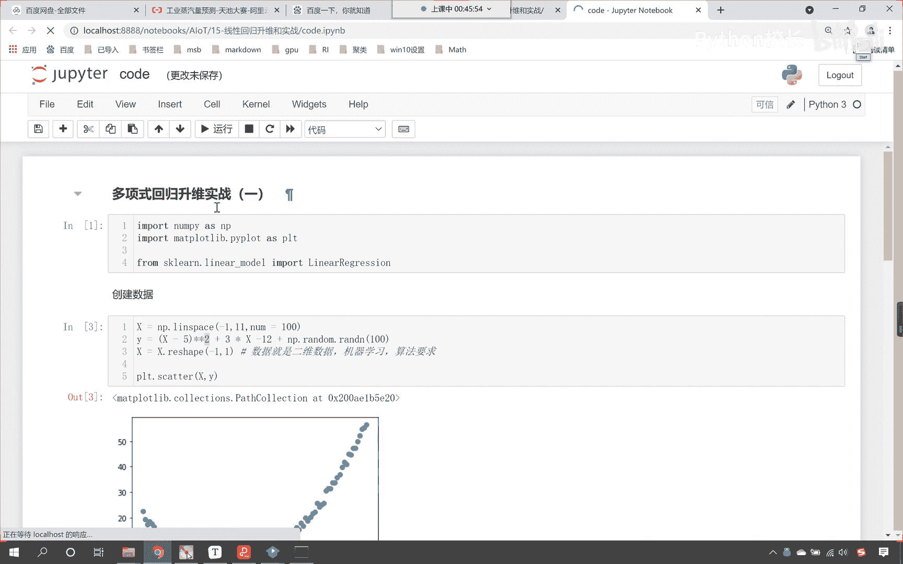

咱们是不是就解决了一个问题啊，就是你这种点的规律，咱们使用普通线性回归是无法解决的，那我们你看那咱们是不是就使用升维呀，升维之后是不是就是它的平方，是不是升维之后就是它的平方，平方之后。

这个时候你就能够看到看到了吧，这个时候你就能够看到我预测出来的结果。

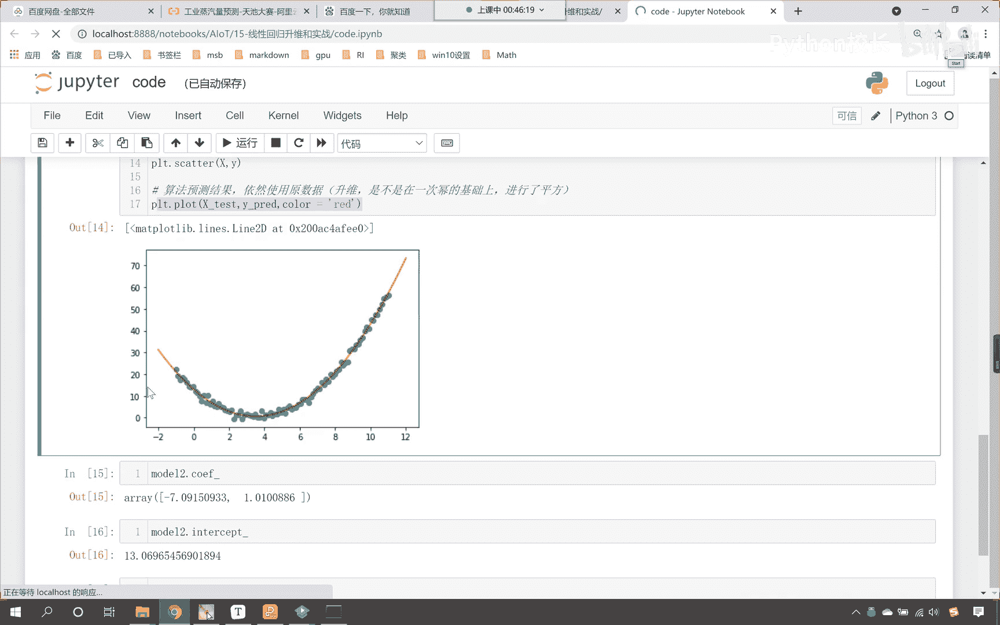