# P99：6-多项式回归实战天猫双十一销量预测（线性回归模型） - 程序大本营 - BV1KL411z7WA

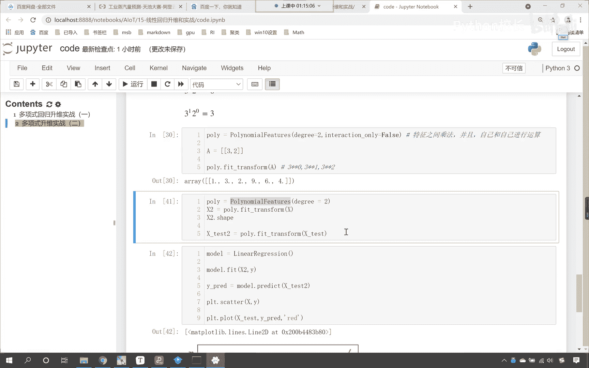

来接下来呢咱们继续往下看啊，那我们接下来就看一下唉。

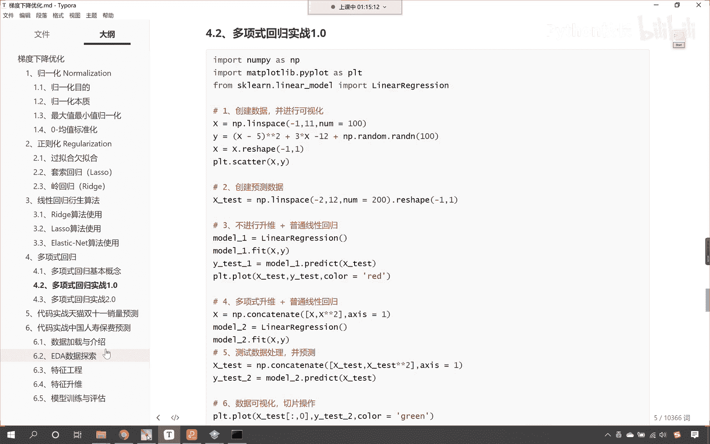

真正一个实际的一个数据啊，你有没有在淘宝天猫上买东西啊，每年是不是都有双11呀，那双11的晚上你会熬夜去等着买东西吗，天猫双11他从2009年开始举办，那第一届呢成成交量就0。5亿是吧。

后面呈现了一个爆发式的增长，那这些增长是否有规律呢是吧，那规律怎样呢，咱们该如何分析呢。

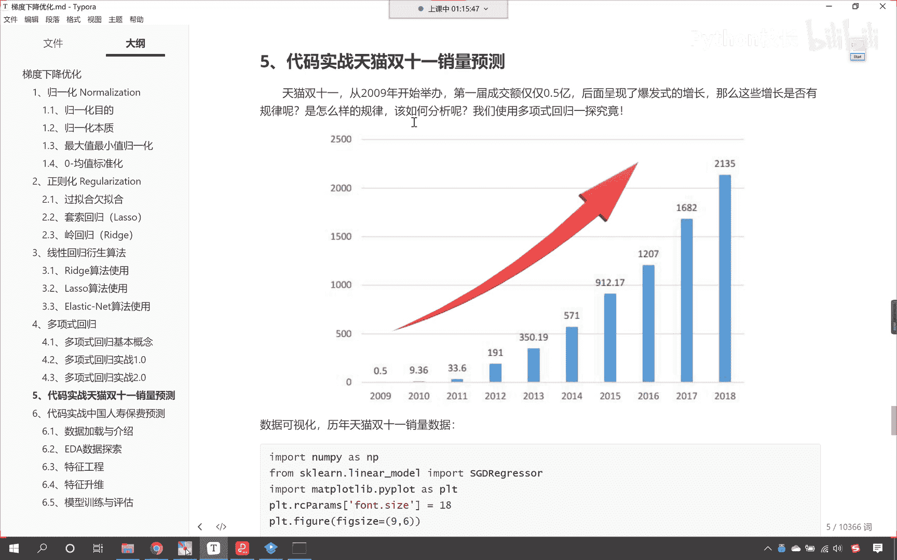

我们现在呢就使用咱们刚才所学的多项式回归。

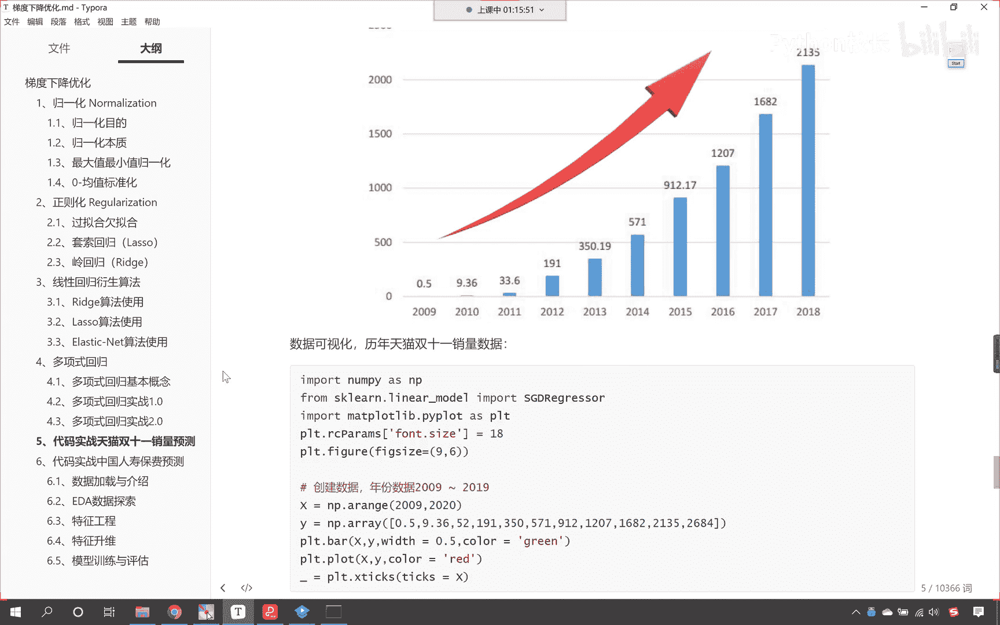

我们对这个数据咱们进行一个拟合，找一找规律好不好。

大家就能够看到，上图呢是历年双11天猫的销量数据。

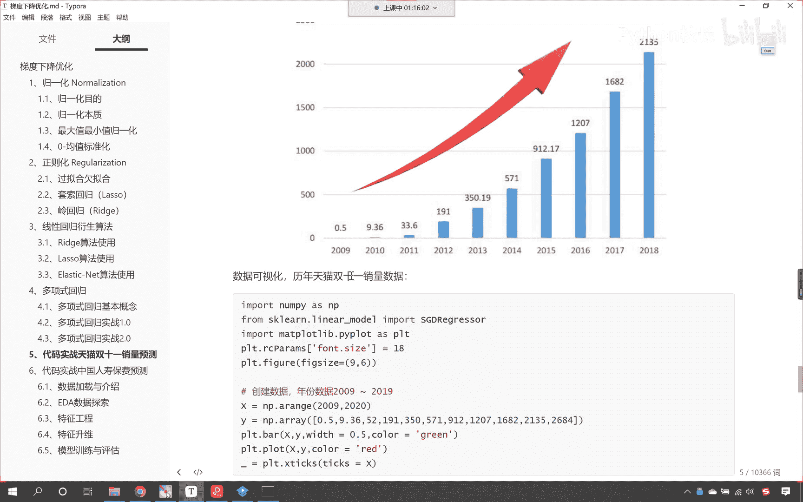

2018年的时候，一个晚上他卖了2135亿。

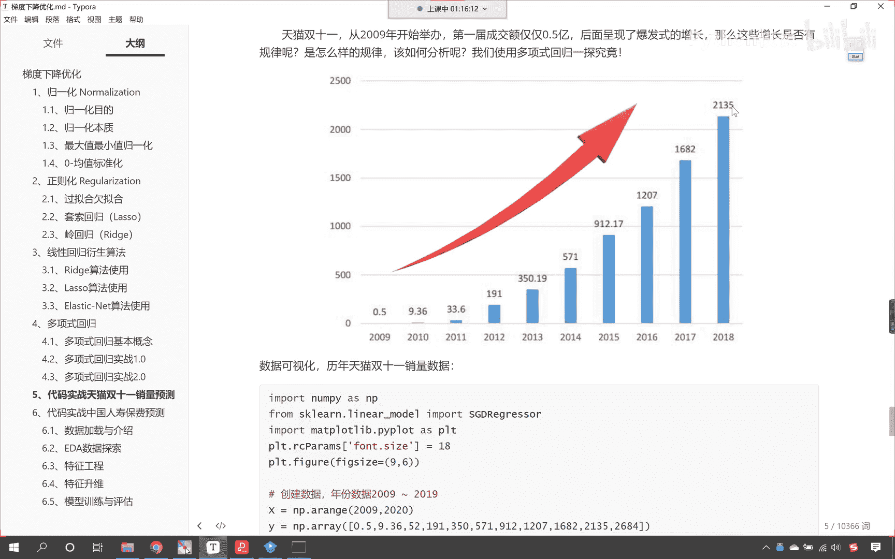

是吧，太多太多钱了是吧，所以这个马爸爸是中国首富对吧好，那么咱们现在呢就对他进行相应的一个操作，那2019年啊。

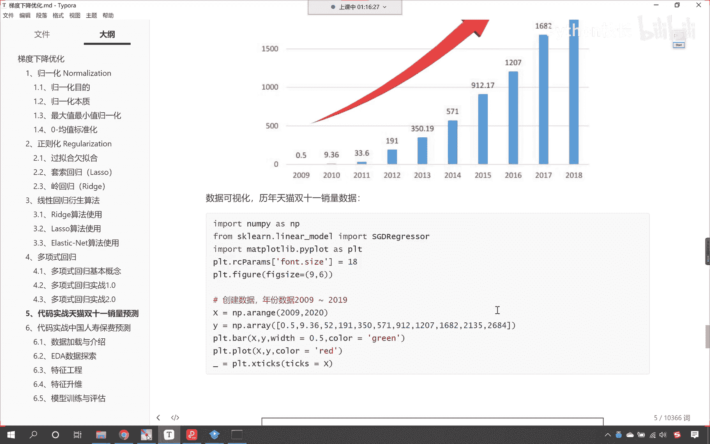

这个我们现在给的数据呢，咱们是2009~2019啊，这10年的数据我们是这11年的数据，咱们是有的啊，这11年的数据，2019年是2684亿，这个数据嗯，网上都可查好不好，这个数据网上都可查。

咱把这个数据给各位发过去，大家呢直接把这个数据放到代码当中，进行操作就可以了，来那么我们现在呢就回到咱们的代码当中。

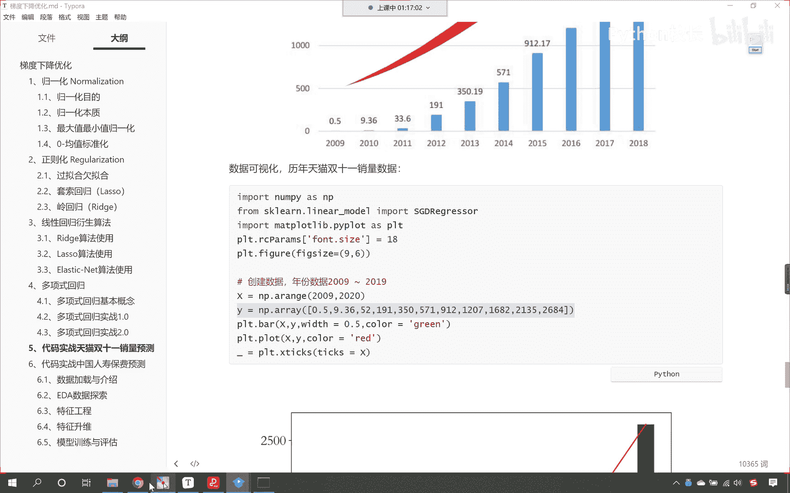

咱们在这儿给它添加一个三级标题，这个呢就叫做天猫，啊双11它的这个线性拟合，那我们就导一下包吧，看咱们就from sklearn，点linear model。

我们导入一个s gd叫s gd regreer，这个是不是就是咱们随机梯度下降呀，那其他的模块咱们都倒了啊，嗯同时呢这个为了代码的完整性，咱们再导一下包吧，import np。

然后咱们import matt plot，lib，pie，plot as plt，执行一下代码，粘贴一下咱们的数据，这个y呢就是目标值，这个就是双11的销量啊，这个就是双11的销量，他这个单位呢是一元。

我们这些销量它都对应哪些年份啊，咱们所拿到的这些销量数据呢，嗯他呢是从2019年啊，对应一元，他呢是从2009年一直到咱们的2019年，那首尾箱这个2009~2019，所以说它是11年的数据。

那咱们的年份呢咱们就给一个x啊，x就等于np。arrange，那给一个2009逗号，咱们给一个2020，注意我们arrange这个函数呢，它是左闭右开，看他是左臂右开，所以说2020取不到，那。

所以说我们这个数据是不是就取到2019了，现在呢咱们打印输出一下啊，叫display，咱们将x放进去，将y放进去，这个时候你看我一直行，数据是不是就有了，看到了吧，数据就有了，好那么有了这个数据之后。

咱们能不能把这个给它画出来啊，来你看画出来plt点，来一个scatter x放进去，y放进去，来各位小伙伴看到这个图，你有没有一种蠢蠢欲动的感觉，你看这个图走势是不是相当平滑呀，看到了吧。

是不是这样一个走势，看到了吧，是不是这样一个走势，那根据咱们刚才所学的多项式升维，是不是就是专门来治他的呀，对不对，我们是不是多项，我们是不是用多项式升维，是不是就一下子能能够，把这个方程给他解出来呀。

那请问这个到底是几维的呀，现在有一个问题了，是不是咱们应该给它几维呢，对不对啊，这个维度到底是二维还是三维呀，是不是好，咱们给它个几维比较合适，对不对，来各位小伙伴，你发挥你的想象，根据你之前的经验。

或者说你根据你的这个感觉，你来说一下，我们应该给二维还是给三维呀，来各位小伙伴，咱们在讨论区回复一下啊，你觉得这个曲线像二维还是像三维，是不是我们在讨论区回复一下啊，好我们有小伙伴说是二维。

也有小伙伴说是三维是吧，那咱们现在就试一下，是不是，那咱们就知道这个数据长什么样了，来，那有了这个数据之后呢，咱们就来操练起来，好不好，好，那么我们呢对这个数据咱们就进行一个升维吧，好不好。

那咱们就使用这个polly nominal feature，那我们就from sklearn。pre processing，咱们从这个当中呢导一下包。

咱们就import polly nominal feature，把这个也给它导进来，那紧接着咱们要做的工作呢是不是就是升维啊，来一个polly就等于polly nominal feature。

那我们给一个degree，这个degree就表示二维，咱们首先给二维好不好，那就是polly点，咱们调用fit transform这个方法是不是就可以了，那在我们进行操作的时候，咱们将x放进去。

这个时候一执行。

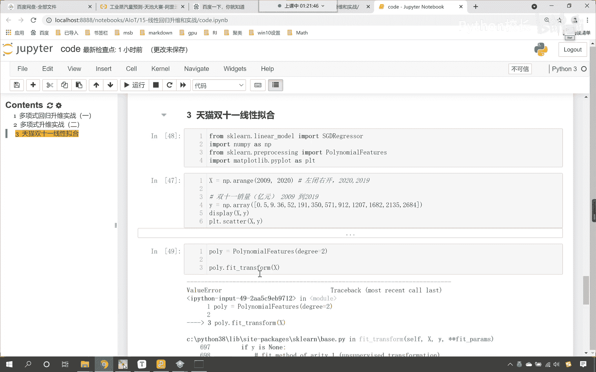

大家看报错了，为什么报错value error给的数值错了。

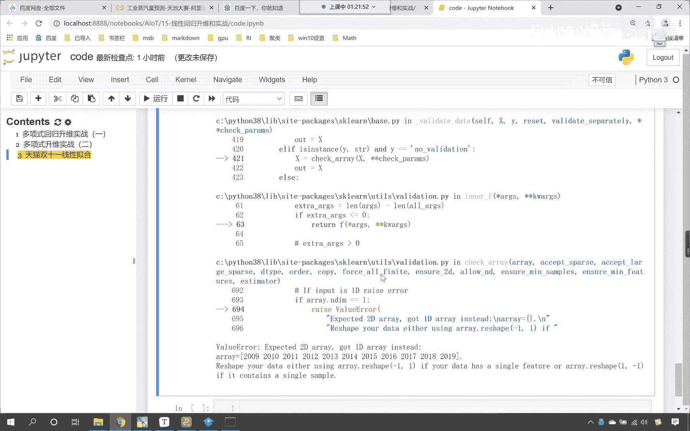

往下滑，看到了吧，这个时候为什么报错了，expect 2 d。

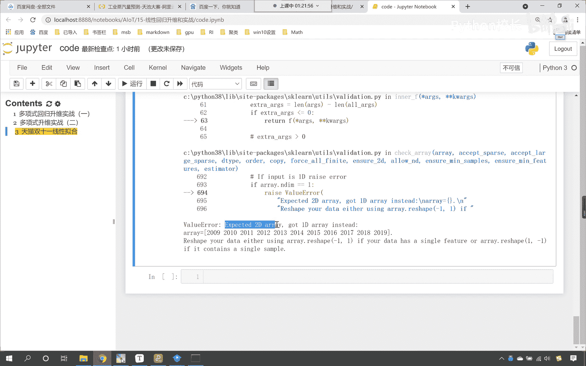

说明咱们这个数据需要二维的数据是吧，而我们给成了一维，那再再看一下咱们x这个数据，你看我们进行了数组的创建，咱们数据是不是一维的，这个时候我们对它进行一个形状的改变啊，点resh。

因为机器学习要求的数据形状，是不是得是二维的，再来一执行，你看它是不是就变成列了，对不对，好，那么紧接着咱们再来执行，这个时候你看一执行是不是就没有问题了，对不对，妥妥的啊，没问题了。

好二维的数据咱们就给这个啊，那这个数据咱们起个名就叫做x下划线二是吧，这是我们进行升维之后的数据，那升维之后的数据呢，嗯数据升维了，然后呢咱们就这个使用咱们的算法，上面我们导包算法是sg d。

这个其实和线性回归一样，对不对啊，那咱们就使用s g d啊，s g d就等于s g d regression，那么这里边的参数呢，咱们可以使用这个默认的参数啊，然后s gd。feat。

咱们就调用它的训练方法，咱们就将x下划线二放进去，然后将目标值y放进去，这个时候你看我们模型是不是就创建好了，对不对，模型创建好之后，咱们现在呢是不是可以让他预测一下呀，咱们怎么预测呢，你看我的范围。

看看咱们的范围，x是不是2009~2020呀，咱们给一个x下划线test，我们看一下这个模型，如果要训练好，那么它可以生成一条光滑的曲线，咱们给一个x test，就等于嗯咱们np。lin space。

我们让他从2009，咱们让他到2020，我们让它生成多少份啊，生成50份啊，生成这样的一个数据，然后对它进行reshape，-1和一好，这个时候你看x test这个数据就有了，那模型训练了。

咱们紧接着就使用s g d点调用它的预测方法，那就是predict，把咱们的测试数据放进去，它是不是会有一个返回值，是不是就叫做外杠predict来，咱们现在呢就画图画出来，看看到底像不像。

那这个时候先把原数据绘制出来，plt。scanner xy放进去，然后prt。plot，咱们画这条完美的曲线，看看像不像那这条完美的曲线啊，这条完美的曲线是不是就对应着x test呀，对不对。

咱们把x test放进去，x下划线test，它的目标值是y下划线predict呃，咱们在进行预测的时候啊，我们在进行预测时，咱们的数据是不是也需要进行升维呀，因为训练的时候。

你看训练时数据升为了看到了吧，训练时咱们的数据是不是升过为的，看你这个数据是升过为的，那么我们预测时，这个数据是不是也必须你看预测时，这个数据是不是也必须要升维呀，咱们在这儿就给他升为一下啊。

那就是x下划线test 2，和刚才的操作规律一模一样，咱们就依然使用polly。feat transform，咱们将x下划线test 2 test放进去得到的这个结果，咱们就叫test 2吧。

好那我们预测的时候就使用这个test 2，这个时候你看我一执行这个代码，哎大家发现预测结果出来了，你看像不像像不像不像，对不对，看到了吧，一点都不像，你看啊，那这是为啥呢，看预测的结果像不像不像。

你看到了吧，一点都不像，在这儿呢，我给一个color啊，咱们这color是红色，你看咱们现在预测出来这条线是不是这个样呀，唉找一找原因，难道是我们degree，难道是我们次幂给给小了吗。

咱们这个时候给个三，我看一下执行，看到了吧，给个三更不行，看给个三更不行，大家这个时候你仔细观察看他的这个坐标轴，刻度啊，看看这个坐标轴刻度是怎样的，是1亿的20次，27次幂，这个数字何其大。

这个数字大不大呀，是不是非常非常大呀，e的27次幂超级大，是不是，那这是为啥呀，二次幂三次幂都不行，我给个一次幂呢，一直行，看到了吗，咱们给一次me，是不是也不行呀，看到了吗，你给多少都不行，是不是。

那那这是为啥呀，那给个零次幂呢，看到了吗，咱们给零次幂得到的结果，你看是线性的，对不对，给零次幂就相当于数据，原来自己知道吗，不变，咱们给一次幂，发现看变得特别大，纵坐标是e的十次14次幂。

这是为什么呀，你看无论我给零给一还是给二给三都不行，那这个时候，咱们就得需要从数据这个角度去入手了啊，注意啊，我们现在讲到关键点了，咱们说你看我们即使对它进行了升维处理，咱发现是不是依然不行呀。

那这是怎么回事儿，咱们看一下咱们的数据。

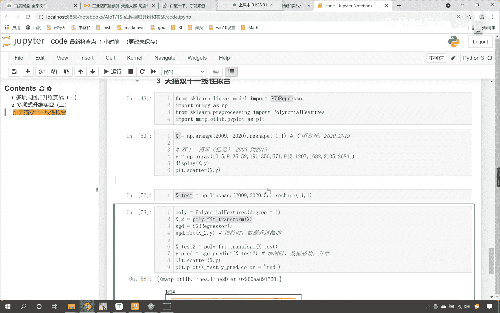

y这个数据它是不是咱们的销量呀，对不对，你看y这个数据是销量。

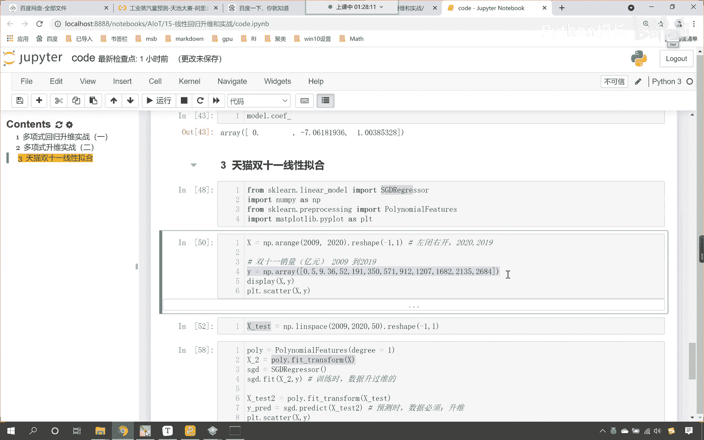

x这个数据呢，x这个数据是不是咱们的年份啊，你看咱们上来给的数据就是2009，20102011，你想这个数据一上来是不是就特别大呀，对不对，你看一上来就特别大，那么09年和10年。

他们之间是不是就相差1年呀，但是你看我们数字特别大，你想你这个二你这个数字一在2001面前，09年和10年相差一，那这个相差之一在咱们的2010年面前，是不是就特别特别小呀，它是不是1/2010呀。

所以说咱们这个数据不合理，那我们对它进行操作，咱们统一让它减去2008，这个时候你看我一执行数据，是不是就变成了1234呀，一直到11，你想这个11是不是就表示咱们2019年。

这个一是不是可以表示咱们的2009年，这个11是不是表示2019年呀，你想我统一都减2008，没问题吧，大家可以理解吧，你看咱们统一减了2008之后，这个时候你就发现，这第一个数据和第二个数据相差几。

是不是相差1年，但是我们相差的这个绝对值，它所占的比重是不是就大大提升了，能够理解这一点的，在咱们的讨论区扣个一啊，好那么大家看啊，咱们做了这样的一个小小的操作，那么我们的测试数据呢，看咱们的测试数据。

不是也是从2009~2020吗，咱们也让它减去2008，统一都减上面减2008，那这个也得减2008，好给他减2008，现在看咱们操作一下，我们把它变成几次幂，二次幂，这个时候你看我一执行。

好那么这个时候咱们在进行操作的时候，大家就能够看到啊，咱们这个数据，你看我们这个数据是不是依然很大呀，那我们来一个一次幂啊，咱们执行一下，看这是咱们得到的一次幂。

是不是polly nominal feature，咱们得到的这个一次幂，那我们现在呢这个polynominal feature，它当中呢有一个有一个参数，咱们现在呢调整一下这个参数啊。

叫intertract only，咱们给一个true，咱们这个degree呢我们依然让它是二次幂来，此时呢咱们执行一下这个代码啊，此时我们运行执行一下这个代码，看此时一执行这个二次幂。

看咱们得到的结果不太对，是不是啊，那我们来一个三次幂执行一下，嗯我看看啊，holy nominal feature，interact i x2 ，feat x2 ，按说咱们进行了这样的操作和处理之后。

我们的数据呢就发生了一个变化，咱们打印输出一下x打印输出一下x test，咱们来看一下啊，这个时候这个数据确实就没问题了，那我们这个数据呢它就变成了啊，这个数据呢它就统一进行了一个缩放。

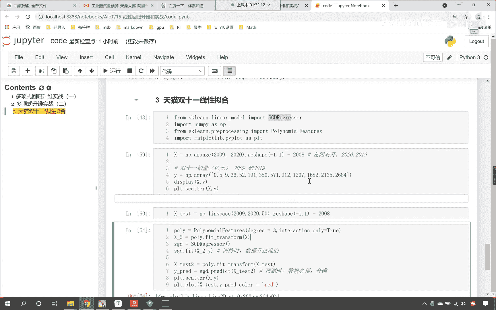

缩放之后呢，咱们紧接着就看咱们的这个嗯，这个使用咱们这个s g d，那在这个里边儿呢，咱们给它声明一个，因为这个s gd它是随机梯度下降，那这个随机梯度下降呢，咱们可以去修改一下。

它相应的这个相应的这个参数好，那么这个默认情况下呢，它是penelly，是l2 损失，这个阿尔法呢是不是0。0001呀，这个值是可以的啊，这个max eager是它迭代的次数。

梯度下降是不是有一个次数呀，这个max iter我们给我们给它调整一下，咱们呢给它调整成5000次，也就是说我们让它的次数增加一些，这个时候咱们再来执行好，那么我们预测出来的效果是不是。

大家看这个效果是不是依然不好呀，那咱们现在呢我们看一下咱们的x2 ，这个数据在上面插入一行x下划线二，咱们在这儿呢输出一下，唉，大家现在就能够看到，你看咱们的x下划线二，咱们得到的数据是不是111是吧。

123，而咱们这个地方给的是几次幂呀，咱们是不是给的是三次幂呀，那给的三次幂嗯，咱们得到的结果为什么，还是嗯还是这么小的一个值呢，来我再来执行一下啊，看再来执行，看运行一下，看这是一次幂。

咱们给的这个degree是三，对不对，所以说我们这个数据咱们在进行操作的时候，肯定是这个polly nominal feature，他这个地方肯定是给出问题了，所以就导致咱们这个数据呢。

没有很好的展示出来啊，二那这个interact咱们给它改成false，看大家现在就能够看到，看现在就能够看到，当我们把这个interact改成false的时候，在这里你就能够看到。

看在这里就能够看到咱们是不是有零次幂，这个是一次幂，这个是二次幂，这个是不是三次幂呀，那我们得到的这条拟合曲线，它是不是就比较大了呀，那我们比较大了，咱们将这个degree再给它降低啊，咱们给它降成二。

这个时候我们再来看一下啊，121腰94，这个s g d regressor，那咱们现在这样啊，咱们sgd点调用一下他的intercept，唉，各位小伙伴，这里就能够看到咱们所求得的这个结局。

这个数据是不是特别大呀，那么我们现在怎么办，里边儿呢，咱们找见他的feat intercept，我们给它设置成false，唉这个时候这个intercept设置成false之后，咱发现得到的这个效果。

是不是依然也不是很好呀，看得到这个效果依然不是很好，那得到的这个效果依然不是很好，有可能是咱们s g d regressor，这个这个模型用的不是太合理，那我们往上走，咱们在导包的时候。

咱们将linear regression也导进来，现在的话咱们声明这个模型起一个model，就等于linear regression，那我们的linear regression呢。

咱们也给一个feat intercept，我们让它等于false，也就是说计算的时候，咱们就不要去计算咱们的截距了，然后再调用咱们的model，此时呢我们就进行一个训练，这个是升过维的数据。

然后呢再使用这个polly，把咱们的测试数据也进行一个转换，转换之后呢，使用咱们的model，咱们进行相应的一个预测，那此时呢咱们执行一下这个代码啊，来换了一个模型，model。

predict画图图形来，此时我们已运行诶，大家现在就能够看到，此时你就能够看到是不是线性回归，就非常好地将咱们的数据规律给拟合出来了吧，你看我再一执行，看到了吧，这条红色的线是不是就将阿里巴巴集团。

天猫双11活动，他历年的销量，咱们是不是就给他搞定了，看到了吧，搞定了吧，咱们变成三维呢，你看我一执行，你看三维是不是也能够把这个方程拟合出来呀，咱们根据奥卡姆剃刀，咱们是不是能简单就不复杂呀，是吧好。

那么天猫双11它的销量是怎样的一个关系呢，那个方程是什么样的呀，现在呢我可以把那个系数给你拿出来啊，看那就是model。coif，你看执行一下，72负九十五三十，原来的梯度下降模型不适合诶，当然不是啊。

咱们的这个梯度下降呢，它也可以进行相应的这个操作，知道吗，咱们的这个，咱们的这个随机梯度下降，它也可以进行，知道吗，好那么咱们现在先把这个模型我给你建出来，来一个markdown dollar。

dollar嗯，在这儿的话呢，那这个方程长什么样呢，那我们就给一个fx啊，fx就等于这72。6，它是系数-95是一次幂，这个30是咱们二次幂的系数，因为我们的数据你看咱们的数据对应着什么啊。

咱们如果要将x2 打印输出一下，你现在就能够看到你这第一位是不是幺幺，111，它是不是就相当于截距呀，这第二为12345~11，它是不是就相当于咱们的一次幂149 16，121。

这个是不是就相当于二次幂，所以说我们所求解出来的系数，和上面是一一对应的，知道吗，和上面是一对应的，所以说咱们这个方程呢我们就可以写成嗯，叫做这个我们就30。23是吧，然后让它乘以反斜杠times。

它乘以多少呢，那就是x的平方，然后呢再减去95。53，反斜杠times嗯乘以x然后再加上72。66，你看一执行咱们所求解出来的方程，它就是这样的，我们不需要这个times了。

有了这个times反而不好看，咱们把这个times去掉啊，它一直行，大家看30。23的平方，-95。52的平方，72。66的平方。

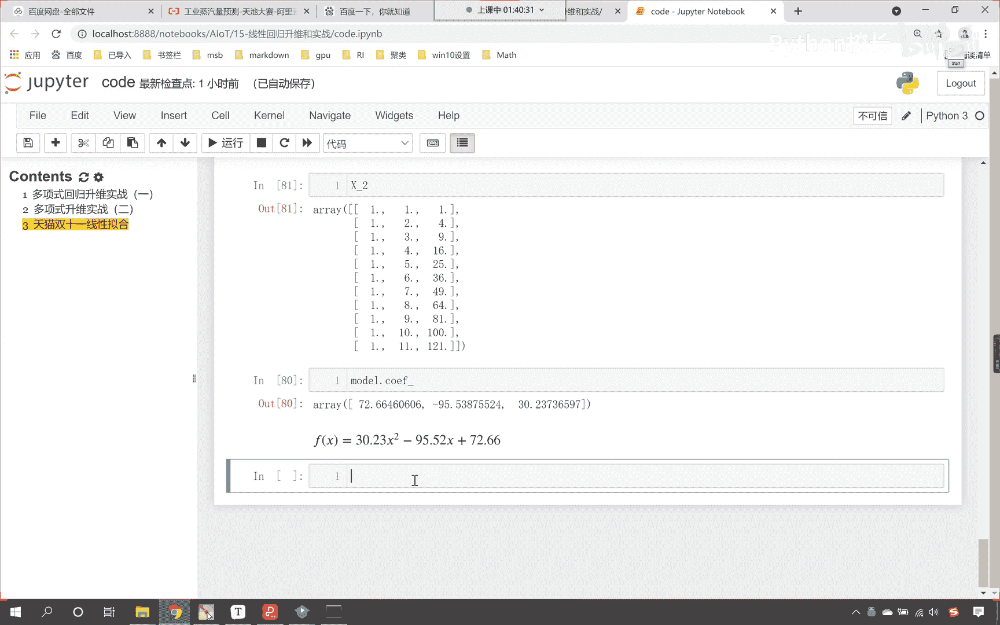