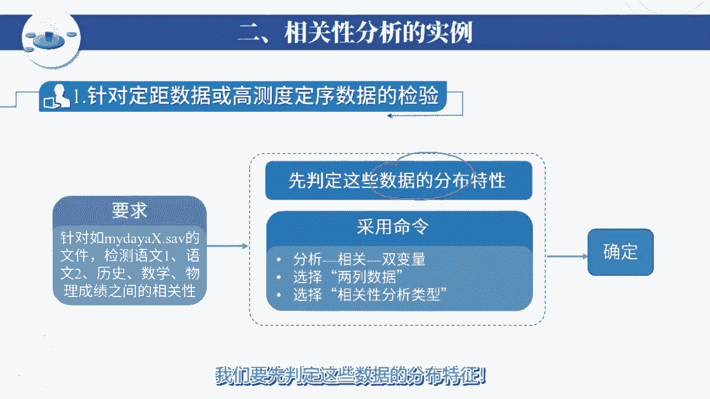
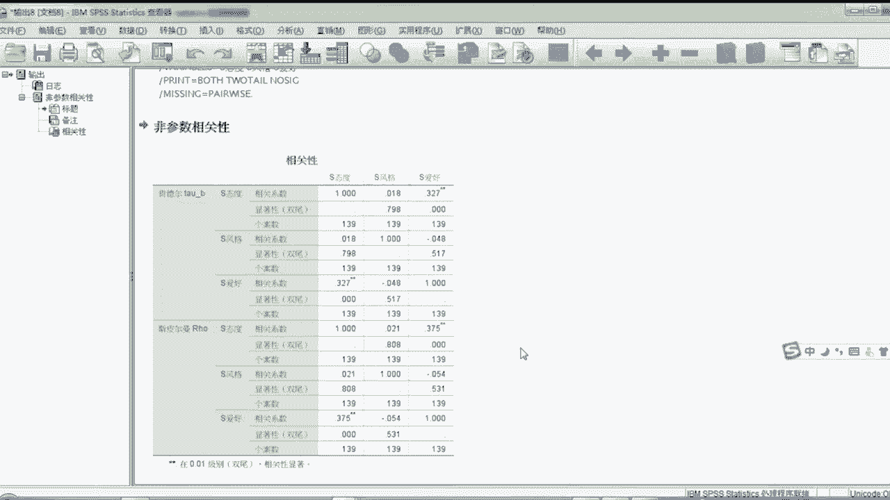

# #这里有好课为期末论文奔走的大学生们，SPSS数据分析你掌握了吗！如何对数据进行预处理？如何进行回归性分析？快加入@北京师范大学的《SPSS数据分析及量化研究》 - P1 - 无限超人Infinitman - BV1RUyrY4EuC

同学们好，我们下边呢我们具体讨论一下，相关性分析的一些具体的操作是吧，和一些实例好，首先我们对于相关性分析的算法，做一个简单的回顾，在上一讲中我们讨论了相关性分析的各个算法，首先对于两高测度的变量。

要想做相关性分析的话呢，我们要看如果两高测度都满足正态分布的话，我们可以直接使用P2逊相关，来完成这个相关性分析，如果两个特征数据有一个是非正态分布的，是不正态的，我们一般使用斯皮尔曼相关。

或者使用肯德尔相关，来完成两变量之间的相关性分析，如果是一低一高变量，类似于像性别和物理分是吧，呃爱好和语文分这种一低一高的判断，他们之间的相关性的话，我们如果发现高测度数据是正态数据的话。

我们可以借助于方差分析，分析其低测度变量对高速变量的影响性，是不是有显著影响，来判断二者之间是否有关联，如果是高速度是非正态数据的话，那么我们可以借助于独立样本的非参数检验，来完成这个相关性的检查。

如果是两个低刻度变量，特别是两个定力变量或者两个低刻度，定序变量之间的关系，那我们可以借助于基于交叉表的卡方检验，来完成相关性的分析，但这个表的话呢，这个图是什么呀，是在SPSS下边。

交叉表的检验里边的统计量和统计量，它可以完成大量的相关性分析，我们可以把这个相关性的勾这勾上勾上看看，这地方的话呢有很多不同的算法，这一块的话呢面向于名义型变量，也叫也叫什么呀，定类变量是吧。

定类变量这一块的话呢主要面向于有序型变量，也叫定序型变量，而这一块我们主要说按区间标定，它直角变向什么呀，这种类似于一低一高的这种变量，就是有个低热度，可能那个区间呢还有高速度的区间。

另外的话呢咱这边还有一些什么呀，像针对于二元变量，针对于风险等等的一些算法啊，这是我们对相关性分析的各个算法，我们做了一个简单回顾，商家对它有一个什么呀，比较全面的掌握理解。

最起码知道每一个数据应该选用哪一种算法，来完成相关性的分析好，下面大家看我们看一些具体的例子，第一种针对定距数据或高测度，定序数据的相关性的检验，看题目要求如右侧的表所示，大家测试我们检查语文一。

语文二，历史数学物理成绩之间的相关性，它这里边有什么呀，语文一呀，语文二呀，什么历史呀，还有数学物理之间的相关性，大家看这些数据全都是什么呀，高特度数据，但是里边有正态的，有非正态的。

我们可以使用什么呢，大家看这些数据是吧，在这些数据我们怎么做呢，首先我们要判定这些数据的分布特征啊。

讲到了吗，有正态的，像语文一，语文二，有正态的数学物理就是非正态的小形态的，然后采用命令分析相关双变量，选好两列数据，然后去选择这个分析类型，正态数据我们选什么，皮尔逊非正态数据我们可以选什么呀。

斯皮尔曼或者选肯德尔，那最后可以单击确定是吧，单击确定就可以获得我们的结果，大家看这是一个结果的示意图，但这儿的话呢是相关系数，这是它的检验概率，一般说来检验概率小于0。05，我们就认为什么呀。

二者之间存在着显著的相关性，那相关程度通过这个相关系数是吧，来进行判定好，下面看一下具体的操作好，我们来看一下这里边语文一，语文二历史，外语数学物理，它们之间的相关性，前边我们已经知道了，语文一。

语文二历史是正态分布的，而外语数学物理是非正态的，对于增加数据的话呢，可以使用P2型相关分开的数据的话呢，可以使用斯皮尔曼或肯德尔相关来判别，我们来看一下分析相关性双变量。

我们把语文一语文二历史把他们选出来，这选择皮尔逊双尾检验确定，那这样我们得到一个相关性分析的结果，从表中我们可以看出，语文一和语文二它的相关系数只有负的，0。126，显著性是0。138大于0。05。

说明语文一和语文二之间是什么呀，是不相关的，语文一和历史之间相显著性，0。163，证明语文一和历史之间也是不相关的，我们看第二个，语文二和语文一前面提到了显著性，只有0。138是不相关的。

语文二和历史显示性0。00小于0。05，它是相关的，这边的话呢语文二和历史颠的相关系数，0。86，再看这数标了两个星号代表什么呀，是非常高度相关好，我们再来看下其他几个数据分析相关。

说白讲这些依然可以带，我们现在可以把外语物理和数学加进来，因为后边几个呢是非正态的，其实我们可以换一个什么呀，斯皮尔曼或者肯德尔来看一下，这样吧，选斯皮尔曼吧，确定大家看在斯皮尔曼下。

我们看到了语文一和语文二依然是什么呀，打个比方什么呀，看斯皮尔曼的话，0。036，这是相关的是吧，相关的简政性这块儿和历史是不相关的，和外语是不相关的，和数学是相关的，和物理是不相关的，那语文二的话呢。

它和语文10。036小于0。05，认为是相关的，核历史600上面是系数是0。385，是高度相关的，这是不相关的，0。398不相关的，0。335，0。756不相关的，总之吧大家看这表的话呢。

我就能够知道每122之间，它们是否存在着相关性，这不再强调是否相关，看这个显著性，这个标准大于0。05叫不相关，小于1。05叫相关，那么相关的程度到底多大，看这个相关系数。

看相关系数有时候可能出现什么呀，是相关，但是相关系数很低，就像这语文二和语文一之间是相关，但系数什么呀是比较低的，最后再加一句话，大家注意斯皮尔曼的话呢，它既可以判断正态分布的数据。

也可以判断非正态分布的数据，这都可以的，但皮尔逊的话只能判断正态分布的高速路数据，最后我们补充一下说明，针对于P2型检验，除了大家除了我们所看到的这个相关系数以外。

其实我们还可以补充其显示出来它的均值是吧，它的均值，它们的标准差以及有效样本数，甚至我们可以检查什么呀，他的差积偏差和它的协方差的值，让计算机为每对变量输出，它们的差积矩阵和协方差矩阵。

以便于我们更加清晰的了解，这里边的相关的一些参数，是一些数数据，再次最后强调一下，就是符合正态分布的高测度数据，用皮尔逊相关而不符合正态分布的高速路数据，我们用什么呀。

斯皮尔曼相关或者用肯德尔相关来进行判定，这第一类判定，第二类，我们针对于低测度的定序数据的相关性检验，大家看题目要求针对这个数据表，我们检查学习态度，认知风格和爱好之间的相关性，这大家需要注意了。

你看这地方来来占地方，这是爱好，这是啊认知风格，这是学习态度，大家看你从这来看，在几个变量都是什么呀，字符串变量，但SPS里边量，注意所有的都串变量都默认为是什么呀，是定类变量或者是名义型变量。

是名义型的，但是这两句我要想做分析，其实你看一下奖金资风格这块性价记什么呀，它有一个很清晰的什么呀，逻辑的像场独立型，偏场独立型，然后偏长一臀型，畅易臀型，他是一个什么呀，他有一个顺序逻辑的。

像这个态度很不好和不好是吧，一般，然后呢积极大家看这个程度也是可以什么呀，很方便的，把的边际成或者说把它转化成一个定序变量的，像那个爱好可能稍微难一点，我这有艺术，有文学，有科学等等这些东西。

大家注意这块的话呢，你也可以按照什么呀，按照逻辑思维能力的程度对它进行编码，一般我行为变成说艺术变一文学变二，科学变三还是变三，总之吧，大家注意像这种定类变量什么呀，应该首先把它做数值化编码。

在编码时候尽量的变成什么，变成定序型变量，然后借助于第一测度定序变量的检验是吧，来完成检验它的过程啊，过程是这样子的，是说我们这题目要求吗的要求，那么这是第一步，我们要对字符串做编码。

要注意编码的科学性，要把它做成定序型数据啊，做好了以后，然后我们启动相关性分析的命令，选好两列数据啊，对然后呢比什么呀，选择类型，这样呢我们可以直接选肯德尔是吧，肯德尔这个检验肯德它的检验。

然后做基与肯德尔相关的这种相关检验，最后可以得到什么呀，他的结论好，下边请看一下具体的案例好，我们来看一下爱好，认知风格与其态度这三个变量之间的相关性，但这家看一下这三个变量的话呢。

尽管都是字符串型的量，本质上是民意型的，但是大家仔细看像态度他又很不好不好是吧，一般还有积极这些信息人事风格的地方，厂独立偏场独立是吧，偏场依存场依存，它也是有一个什么呀方向性的。

那就爱好这个这个这个这个这个字段的话呢，这里边什么爱好艺术的，爱好文学的，爱好科学的，其实大家去看什么呀，在逻辑思维方面的话呢，我们也可以找到一些什么呀，规律可循，因此的话大家看这态变量。

直观上看都是民营性变量，定义变量，但是可以把它为什么呀，做字符串编码，把它变成定序性变量，像态度，像风格，像爱好变为定序变量以后，因为是定序变量嘛，我们就可以什么呀，大大他们就可以借助于双相关相变量。

我们就可以借助双变量的相关系数的判定了，在这点分析是吧，相关双变量，我们可以把已经数值化编码之后的态度是吧，风格和爱好，这大家注意，这三项都是数值化编码之后的定序变量，就他呗。

我们一般可以使用肯德尔系数，大家也可以参考一下斯皮尔曼相关，看效果确定，然后在这的话呢，我们就发现了什么呀，态度和风格大家之间是什么呀，是不相关的，但态度和爱好之间的还是什么呀，是相关的。

这是相关的小0。05吗，但大家看相关系数什么呀，并不是很大，大家在肯德尔的方式下，那同样风格去和态度，但这地方显示为什么呀，是不相关的，这个显著性这块和爱好也是不相关的。

但如果看斯皮尔曼的层面层面来说的话，态度和什么呀，和风格是不相关的，态度和爱好是什么呀，是相关的，其实大家看到以，看完以后会发现什么危险象呀，就是用肯德尔和斯皮尔曼所得到的结果。

基本上是什么呀，是一致的是吧，是一致的好针对于定类数据啊，定类数据存定类数据，或者说那个值域特别特别小的一些，定序数据量之一，通常我们做叫独立性检验，这种数据前面多次提到过，我们用什么呀。

用基于交叉表的卡方检验，大家看看题目，要求检测性别和专业和爱好之间的相关性，性别我们是一认为是一个定类型变量，专业我们认为也是一个定类型变量，那对这个变量的话呢，我们什么呀，性别是吧，专业是吧。

在第一进这的战场，包括籍贯好，包括爱好，大家看这些都是什么呀，可以说不太容易编程定序变量的这东西，那对他们的话呢，我们做相关性分析通常使用什么呀，使用基于交叉表的卡方检验是吧。

