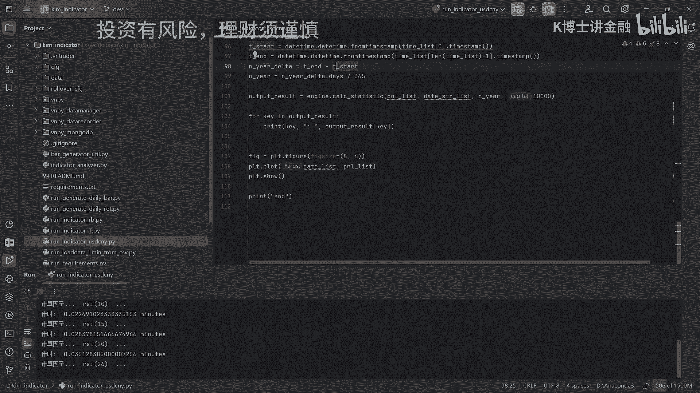
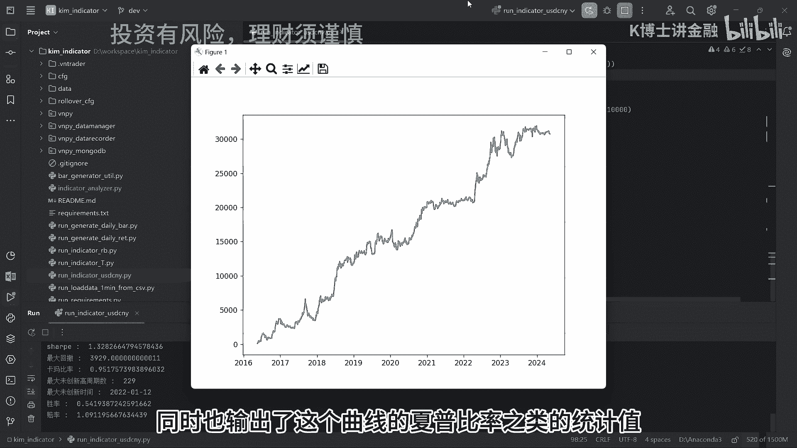
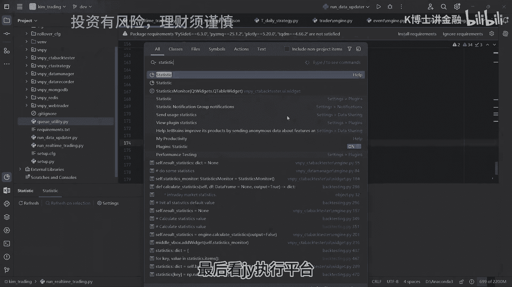

# (干货)一套专业的量化系统有多少代码量 - P1 - 量化K博士 - BV149speaEuF

大家好，这期视频为大家展示一套专业的量化，交易系统源码，并且统计一下它的代码量，这也是很多朋友非常好奇的问题，很多程序员朋友都想知道，如果自己开发这样一套系统，需要多少工作量。

下面我就展示一套实战的代码，屏幕前的你想要获取这套代码，可以通过私信，或者在评论区添加K博士来具体咨询，下面我们来看代码，这套系统分为三个工程，使用的编程语言都是Python，都是无界面，纯原版。

纯命令行，行时数据库使用的MONGODB，交易频率是日频，这三个工程分别是一套回测平台，一套实时因子计算平台，我们首先看回测平台，用于挖掘和优化因子，其中回测功能和挖因子是写在一起的。

我们跑一个策略回测看一看。

我们看到他输出了一个PNL曲线，同时也输出了这个曲线的夏普比率，之类的统计值。

第二个是实时的因子计算平台，要部署到服务器上，实时的抓数据，然后实时的计算因子频率是日频，主要功能是根据因子的输出的值，实时自动执行交易，我们常说的订单执行算法，就是写在这个模块里的。

这个模块是基于VNPY的框架做的二次开发，所以代码里可以看到很多，VNPY的写法的影子，我们启动一下交易程序，看一看长什么样子，现在正好是国内期货的夜盘开盘时间，我们可以看命令行的输出连接。

主引擎成功连接CCTP接口，行情服务器连接成功，交易服务器连接成功，合约信息全部抓取成功，CCTA策略全部启动，开始监听bar队列，注意我们现在没有部署策略，所以现在系统是空转，真正的跑实盘的代码。

在生产环境正在跑上面，正在跑着真金白银不敢去碰它，所以就不在这里掩饰了，我们使用PYTHARM里的statistic插件，来统计代码，首先看灰色平台的代码统计，只看PY文件的源码行数统计。

可以看到有4307行，然后我们看实时因子计算平台，一共有5680行。

一共有1万1291行，这三个工程加起来，一共有2万1278行，2万行代码量的项目，一般来讲属于中型偏小的项目，而且这个行数也与编程语言有关，Python的行数一般都比较少，同样的功能如果用java来写。

可能行数要翻倍或者翻好几倍，我在国外的对冲基金工作的时候，整套系统全部是用java编写的，代码量大概是7万行，同时要注意到这套系统是无界面的，在生产环境是在LINUX下部署运行的，如果开发界面的话。

那代码量可能也要翻倍，像我们这套系统2万的代码量，单纯从开发的工作量来讲，对于成熟的有一定水平的程序员来说，一两个月是可以搞定的，当然我们也知道，这些只是纯粹的从代码的角度来看。

真正的能跑起来一套赚钱的交易系统，关键是要产出稳健的策略，这个策略的研发过程，大量的时间是花在上面的回测平台上的，我们去量化私募工作，挖因子也是，绝大部分时间和精力花在回测平台上，在挖因子的过程中。

我们更多的基于现有的代码框架，加一些模型的代码，调节一下参数，这部分的代码量很小，但是要花费大量的思考的时间，用在数据分析上，这部分的工作量因人而异，在有人带并且自身资质足够的情况下。

可以一两个月之内很快的上手，如果完全自己摸索，如果不是天赋异禀，会有无数的坑在前面等待，关于如何上手，以及想要了解前面展示的几套代码，欢迎大家私信联系和咨询K博士。

