# 【14天入门Python】第九关：Numpy基本操作 - P1 - 量化策略学习 - BV1ZkpjeZEqi

今天呢我们来讲一下南派这个库，南派呢它是Python语言的一个扩展的程序库，它支持大量的维度数组与矩阵运算，此外呢它也针对我们这个数组运算，提供了大量的数学的函数库。

我们来看一下这一关的内容，首先呢我们要学先学习最基础的创建数组，我们创建数组呢就有很多种方式，我们可以从列表或元组里面创建内置函数，创建等等，然后呢，我们就要学习对数组进行各种各样的操作。

对数组的形状进行操作，通过索引和切片，然后数组分割拼接，来对数组进行各种各样的操作。

首先呢我们先来看一下创建数组，创建数组呢是南派最基础也是最基本的部分，也是非常重要的，我们在使用这个number派模块之前呢，我们要先进行一个导入的操作，这行代码是必不可少的，如果不导入的话。

我们后面的所有操作都是做不了的，我们导入这个number派模块，用这个import n派，然后呢将它记为NP，这mp呢后面我们在使用的时候呢，就直接用mp来代替，就会比较便捷，首先我们先看。

我们从Python列表或者元组中来创建数组，我们就需要用到这个这个函数，这个函数呢，可以让我们从列表和元组来创建数组，我们只需要把我们想创建成数组的列表，或者元组呢填入到这个函数的括号中。

我们就能成功的从列表创建一组数组，从原组创建一组数组，以及从列表创建我们的二维数组，我们可以来看一下这个运行出来它的数组，我们将这个列表作为参数传入到这个函数里面，然后我们来看一下。

这时候呢我们就生成了这样一个数组，这个数组呢里面就是由我们的列表生成的，我们的元组呢也是同理，我们可以再看一下这个二维的数组，生成出来是什么样的，可以发现我们这样生成了一个二维的数组，是有两行。

然后我们可以看作是两行三列，也就是形状是括号二三个数组，第二个呢我们来看一下内置函数，来创建我们的数组，这里呢讲几个常用的，我们先看第一个，如果我们想创建一个全零的，全零的这里一维数组。

那么我们就可以用到这个MP点zeros，这个来创建，括号里呢填入想创建数组的长度就可以了，因为这个是一维数组，所以我们只需要传入它相对应的长度，就可以创建出它对应长度的一个全零的，这个数组。

我们来看一下，运行一下，最后呢我们就成功的创建出了一个长度为四，然后所有的元素都是零的一个数一维数组，我们还可以创建一个形状为二三，就是我们刚刚讲的，可以看作两行三列这样一个形状的一维数组。

并且呢我们是一个里面的元素，全部都是一，我们就可以用到这个mp一点once这个方法，这时候呢，我们就成功的创建出了一个形状为二三，也就是我们这儿可以看作两行三列，或者是在最外层的这个括号里面的。

是有两个元素，而在这里乘这个括号呢是有三个元素，这样一个形状的数组，我们还可以创建特定形状，同样的单位矩阵，用到这个NP点I，这时候呢，我们就创建出了一个形状为三三的单位矩阵。

这里我们只传入了一个参数三，因为我们的单位矩阵一定是同行同列的，所以呢我们只需要传入一个参数就可以了，这里要求我们创建一个形状为四四的对角矩阵，同样我们还可以用到这个mp点DRAG。

这个对角矩阵的这个缩写的方法，这里呢我们要填入我们对角矩阵，对角上的每一个数值，然后呢我们就能创建出相对应的对角矩阵了，对这个十二十三十四十就是我们刚填进去的，就会出现在我们的对角上。

这是我们创建的对角矩阵，同样我们还可以创建一个特定形状的数组，我们用这个empty，它初始化的内容呢就是未知的，我们还可以创建一个形状为五逗号的这个数组，它的元素呢是从0~4。

我们来看一下这个创建出来是什么样的，这样我们就可以创建出一个形状为五，然后里面是从0~4的一个数组，它的元素是从0~4，那么我们还可以创建一个元素值，从0~1的五个等间隔。

我们这里是可以创建等间隔的这个数字，我也是用到这样一个方法，可以创建里面元素是等间隔的这样的一个数组，这里我们就可以创建出0~1，并且这五个数组呢它都是等间距的，这样的一个数组。

最后呢我们还可以创建形状为二二的随机数组，用到我们的random，它的元素呢是在零一之间，后面还是一个random，就表示它的零，它的元素就是会在零一之间这里传入的呢，就是我们的形状二二。

那现在呢有非常多的方式来创建我们的数组，我们可以多多练习，然后熟记到实际情况中，选择最合适，最简便的方法来创建我们对应的数组，第三呢，我们还可以创建具有特定数据类型的数组，前面这个呢是同理。

我们前面讲的，在后面这里我们加上了这个mp点in32，我们就可以创建出我们的整形数组，如果我们想创建浮点型的数组呢，后面就可以加上这个浮点型的缩写float，然后我们还可以使用我们特殊的库。

来进行一个创建，例如我们使用这个特殊的random库，我们可以创建形状为三三，我们在最后一个原参数，然后呢元素呢是从0~1之间的随机整数，那我们前面写0~1传入两个参数，并且呢他要是随机整数的话。

那我们就要用到这个方法，第二个呢我们可以创建形状还是为三三，我们传入最后一个参数，现在呢我们想创建元素呢是正态分布的，随机数组，正态分布，我们这里就要用到这个normal，然后呢第一个参数呢是它的均值。

第二个参数呢是它的标准差，最后我们还可以创建结构化数组，大家可以简单了解一下这行代码就可以，其中每一个元素呢它都是C语言中的结构，或者我们这个SQL表中的这行，下面呢我们来看一下习题。

习题要求我们分别创建从1~9的等差数列，创建长度为五的全零数组，以及长度为十的全一数组，首先我们要创建数组，必须要用到我们的南派库，先导入number派，将它的简称定为NP。

然后呢我们要创建从1~9的这个等差数列，我们包含的起始值呢是一，如果我们要创建1~9是包头不包尾的，所以我们中值不能写九，要写十，我们就要用到这个，就可以成功的创建出，我们从1~9的这个等差数列。

还有创建长度为五的全零数组，我们前面讲过，我们要用到这个mp点zero，然后呢，里面的参数传入我们想要的这个长度就可以了，长度为十的权益数组也同理用到这个mp点ones，然后传入长度，这时候呢。

我们就可以打印出我们想创建的对应的数组了，当我们学会创建数组了以后呢，我们就可以对数组进行各种各样的操作，首先呢我们可以对数组进行形状的操作，我们可以改变数组的形状，这里呢我们首先先创建一个。

包含六个元素的数组，我们这里就创建我们最简单的包含六个元素，012345，然后呢我们用reshape这个方法来改变它的形状，它会返回一个具有新形状的数组，但是呢不改变它的数据，我们可以看到。

我们这里可以将形状改变为二行三列，原来这里呢我们是可以看作一行六列，这里呢就改变为二行三列，行写在前面，列写在后面，我们来看一下最后返回的二行，三列的数组是长什么样的。

那我们就从这样子的一行变成了我们的两行，三列的这样的一个数组，成功的改变了它的这个形状，第二呢我们可以查看我们的数组形状，我们用到这个shape属性呢，来查看我们数组的形状，同样我们可以看一下这里。

我们这里用这个最简单的方法，最原始的方法定义一个数组，然后呢我们想知道它这个数组是什么样的形状，我们就可以用shape属性来看一下它的形状，很明显，我们这里也可以看到它是一个两行三列的。

它返回了这样子一个形状，就表示两行三列，然后呢我们来看一下第三点，我们可以修改数组本身的形状，同样还是创建一个数组，数组里面元素123456，然后呢，我们用这个resize来改变数组本身的形状。

我们来看一下会返回什么样的，我们改变这个数组a arr的这个形状，并且将它打印出来，之后呢，我们就成功的将它改变为，两行三列的这个形状了，我们还可以将多维的数组降为一维的数组。

我们可以看这里呢它是一个多维的数组，如果我们想想把它降为一维的数组呢，我们可以用到这个函数，也可以用到底下这个函数，但是呢不太一样的是，我们前面这个函数它是会返回一份副本，而我们这个呢它是会返回视图。

具体是什么样呢，我们来看一下，然后我们来先来看第一个方法返回的，我们可以看到我们前面这个二维数组呢，被成功的变成了一维数组，这就是我们可以将用多维多维数组，降为一维数组的两个方法。

我们还可以增加或者减少我们数组的维度，通过这两个方法，我们来看一下这个案例，这个案例呢它就是一维的，我们可以将这个数组呢它转化为列向量，就用到我们这个方法，这时候可以发现我们从一维的这个行向量呢。

变成了我们三维，每一维每个维度只有一个元素的列向量，成功的增加了这个数组的维度，下载，下面呢我们可以在我们的云笔记中查看一下，我们这个用于增加或减少维度的这个方法，它是呢Python库中的一个函数。

用于在数组中插入一个新的维度，就可以用于拓展数组的形状，让它符合当时编程时的特定需求，简单来说呢，就是假如在一个一维数组上，我们使用这样一个方法，我们就会在这个数组的末尾呢，添加一个新的维度。

这时候呢一维数组就会变成我们的二维数组，如果我们在二维数组上使用它呢，它就会在我们相应的位置添加一个新的维度，变成SHT3维数组，以此类推，下面呢给出了一些示例，可以看见我们这里这个是一维数组。

我们使用这个方法后呢，在数组的末尾我们插入了新的维度，这时候我们的输出结果呢，就是一个二维的数组了，同样可以让二维数组变成三维数组，三维数组变成四维数组，需要注意的是呢，我们要确保这个新维度的大小为一。

否则呢它就会报错，并且它只能在南派的数组上面使用，不能在其他的数据类型上使用对，然后呢我们来看一下第六点，第六点呢，这个squeeze，它可以移除单位三回条目的这样的一个维度，我们可以看一下。

我们先看一下这个返回的值，原本的我们这个数组它是一个多维度的数组，我们在使用这样一个方法了以后呢，他移除了其他的，他移除了这些其他的这些维度，我们得到了一个更紧凑的数组。

它其中是包含原始数组中的所所有的元素的，所以呢它就是它就是可以删除，我们数据中的单例维度，换句话来说呢，它就可以将我们数组中多余的维度将它移除掉，让我们的数组呢变得更加的紧凑。

可以看到第五呢我们是用来增加维度的，而第六呢我们是用来移除掉多余的维度的，具体的事例呢，我们也可以在这个AI的小助手里面看到，第七点呢比较好理解，就是翻转或者转置数组，用我们的这个transpose。

或者点T都可以进行操作，我们直接来看一下这个案例实例，首先呢我们先命名了一个数组a arr，我们可以看一下它是长这个样子的，是一二和三四，我们在用transpose进行翻转了以后呢，我们再次运行。

我们可以看到它变成了一三和二四，我们这个二维数组呢是进行了一个翻转的动作，这就是我们transpose，下面呢我们通过一个实例来回顾一下，我们刚刚学的对数组进行各种各样的操作。

用我们的数组形状进行各种各样的操作，总结一下呢，我们可以改变数组的形状，转至数组，将数组降到一维，以及给我们的一维数组增加一个新的维度，也可以移除我们所有单维度的条目，首先呢我们先改变形状。

我们这里呢是一个最简单的一维数组，元素是0~5，我们可以改变形状为2×3的二维函数，可以用到我们刚刚讲的reshape，改变我们的数组形状，转置数组呢就用到我们这个点T属性，就可以转至我们的数组。

如果想将数组降到一维，刚刚也讲过了，用这个flatten就可以将我们的数组降为一维，如果想给一维数组增加一个新的维度呢，就是我们刚刚第五点这里讲的，用到这个NP等new axis。

来增加我们新的一个维度，如果我们想移除所有单维度的条目呢，就是我们刚刚第六点这里讲的，用到我们这个squeeze，就可以移除我们所有单维度的条目了，这就是我们对数组形状的操作方法，下面我们来看一下习题。

根据上面的信息，建立一个5×3含学生信息的数组，这里要求我们建立一个5×3，并且含有学生信息的数组，定义为X53就是五行三列，我们将年龄，身高和体重数据输入进去，创建一个5×3的数组数组。

X首先要求我们改变形状为35，D为Y改变形状我们已经讲过很多次了，我们直接用reshape来改变形状，在我们的参数里面传入我们想改变的形状，然后呢要求我们对它进行转置，我们直接用点T来进行转置。

然后呢我们就可以打印出来，首先改变形状后的数组Y以及进行转置的形状，Z，下面呢我们来看索引和切片，在Python中，我们的number派数组呢也是可以进行索引和切片的。

它是一种从数组中选择元素的有效方法，首先我们先看简单的索引切片，一维数组的索引切片和Python的列表是相似的，我们先创建一个从0~9的数组，这是一个一维的数组，然后呢，我们可以通过索引。

这个五跟我们的列表是一样的，输出第六个元素也可以切片，2~5就是输出从第三个到第五个元素，包头不包尾，这些跟我们的列表都是一样的，在这里都不过多的赘述，我们重点来看一下这个多维数组的索引。

和多维数组的切片，我们的多维数组的索引呢，比一维数组更为复杂一点，我们在这个多维数组里面呢，你需要为每一个维度都要指定一个索引，因为它不止一个维度，你需要给每个维度都指定它的索引。

它才能最后输出你想要的值，我们先看一下这个案例，就是这样一个我们的二维数组，如果我们要进行索引，我们可以看一下这个例子，选取第二行的第三个元素，我们可以看到第二行的第三个元素是六。

我们要如何将它选取出来呢，我们可以一步一步的来，首先我们先可以看一下它的维度，是从最外层这边开始的，如果我们输出输出零的话呢，会返回我们的第一行，我们可以这样理解，如果输出一的话呢。

很明显可以会返回我们的第二行，同理输出二就会返回第三行，输入二就会返回第三行，这时候我们想找到六，那我们就需要输入一一，后面呢我们再看一下，如果是一零的话，那它会怎么返回，可以发现它返回的是四零呢。

就是我们第二行中第一个元素的位置就是四，所以呢如果我们想返回第二行中，第三列这个元素六的话呢，我们就要找到它的索引位置，就是0122，这样呢我们就成功的索引出了我们第二行，第三个元素，我们再看一下。

如果没我们想选取第三列，我们刚刚可以看到，如果我们想选取第三行的话，我们只需要返回索引为012的这一行，就可以了，那如果我们想返回第三列的话，那我们就可以发现，如果要返回第三列。

那么我们是不是每一行的第三个元素，我们都要将它返回，所以呢我们要选中所有的行，我们就用到我们前面也讲过的这个冒号，代表我们要返回所有的索引，然后呢到列这里呢，我们可以看一下第三列的索引，就是我们的二。

这样子呢就代表我们要返回第三列，这应该是冒号，这样子呢我们就成功的返回了第三列，369这三个元素，这个下去呢我们可以多多练习，就可以比较清晰的返回，我们的多维数组的这个索引，如果不清楚的时候呢。

我们可以一个一个试，试多了我们就了解了，同样我们再讲一下切片，切片呢也是要给每一个维度都指定这个索引，我们可以看一下，我们想选取第一行和第二行的数据，刚刚讲了第一行我们是可以直接用零，又会返回第一行。

如果我们想选取第一行和第二行，我们是不是可以直接这样切片，0~2就是包头不包尾，是不是可以返回第一行和第二行，然后这个零呢也是可以去掉一样的，可以返回第一行和第二行的数据。

如果我们想选取第一行和第二行的，第二列和第三列的数据，我们应该怎么办呢，我们先看行，选取第一行和第二行，就是和前面一样的，选取第二列和第三列，同理我们看一下第二列和第三列呢，我们加个逗号。

逗号后面的参数是要求我们选第二列和第三列，第二列和第三列的，它的索引是不是一和二，那我们包头不包尾，这时候呢我们就选取出了第一行和第二行中的，第二列和第三列这四个数字了，我们这里呢总结一下。

我们在进行切片的时候呢，可以慢慢来，先把我们的行切片找到，然后呢再找到对应的列切片，它的索引就可以成功的切片出我们想要的数据，同样我们再看一个例子吧，我们要选取第二列中的所有数据，他这里面是所有数据。

也就是说每一行的第二列数据我们都要找出来，所以同样第一个参数呢就是这个冒号，表示我们选取选中所有的行，所有行中呢我们要只选中第二列，第二列的索引呢就是一根据我们的前面讲过的，这个索引的方法一。

我们就可以选中所有的数据，第二列的所有数据了，这个回去呢我们可以多多练习，熟练了以后呢，就能比较轻松的进行切片了，下面呢我们讲一下高级索引，我们南派呢可以使用高级索引进行选择，我们可以使使用布尔索引。

我们首先创建可以创建一个布尔数组，首先我们还是创建我们创建一个数组，然后呢，如果我们想选取这个数组中，所有大于五的元素呢，我们可以先创建一个这样子的布尔索引，然后呢直接进行索引。

就可以输出我们所有大于五的数组，就是这一行代码非常简单，我们将五改成二呢，就同样可以输出所有大于二的数组了，最后我们看一下示例，示例，创建一个二维数组，并且对它切片进行操作。

首先我们先创建一个2×2乘以三的二维数组，要求我们选取第二行的所有数据，我们第二行中的所有数据，我们刚刚讲我们选取第二行的数据呢，就在第一个选取行的数据呢，就在第一个传入的参数，它对应的行。

第二行就是一就是它的索引，然后呢你也没有选择，因为是选择所有的数数据，所以我们直接用冒号或者不写都可以，然后呢选取第一列的所有数据，就说明我们要选中，先选中所有的行。

然后呢第一列就是根据他第一列的索引是零，我们这里填上零，就可以选出第一列的所有数据了，我们还可以用切片来选取我们的子矩阵，具体子矩阵的定义呢，大家可以在我们的AI云笔记中搜索。

或者是我们平时学数学的时候呢，同样就是会学到我们这个子矩阵，这里呢我们还要使用布尔索引，我们这里刚刚讲过了，想要输出所有大于二的元素，就可以用我们的这个布尔索引，最后呢直接进行切片输出就可以了。

下面我们来看一下习题，同样习题给出了我们一个5×4的数组，我们定义为X，要求我们选择第一行数据，这个我们已经是第三次讲了，选择行的数据呢就是看第一个参数，包括号里的第一个参数的第一行的数据。

我们就要选择零，选择第一列的数据呢，就是我们方括号里面传入的第二个参数，同样的我们传入零，选择第二行，第三列，我们一从从行到列来输入第二行，它的索引呢就是一，第三列呢它的索引呢就是二，这样传入进去呢。

我们就可以选择出第二行，第三列的数据输出一下，就可以输出我们想要选择的结果了，下面我们来看数组的拼接和分割。

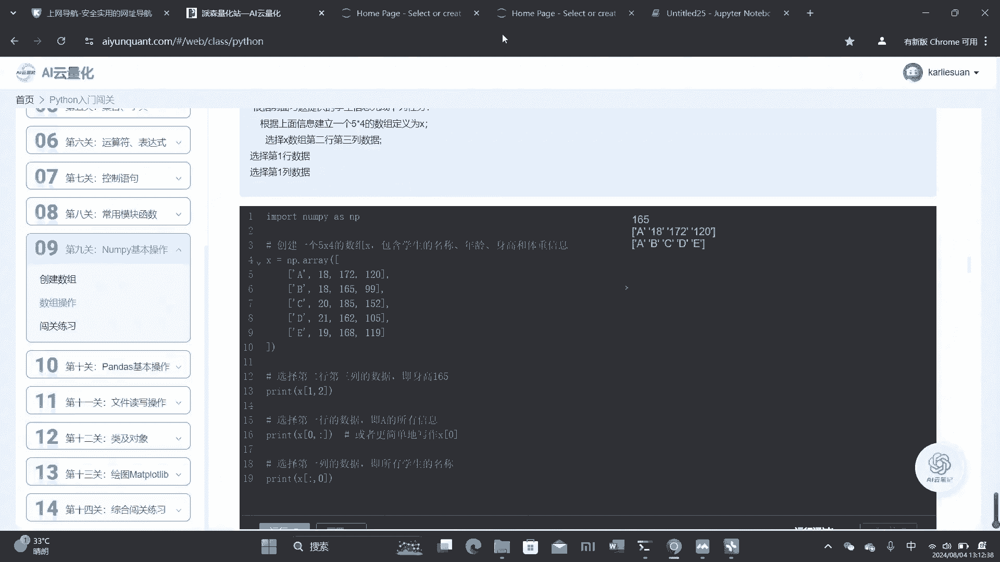

首先我们先看数组的拼接，数组的拼接呢给我们提供了三个方法，首先第一个方法，第一个方法呢要求，会要求我们需要传入一个参数，除了我们需要拼接的两个数组以外呢，还需要我们传入一个轴的这个参数。

我们来具体来看一下这个数组的轴，简单来说呢，在我们的二维数组里面呢，我们的轴零就表示行，轴一就表示列，这里我们传入轴零，就代表我们要沿着行来进行数组的拼接，我们来看一下运行后我们的A是1234。

我们的B是这样五六，我们沿着行进行，将ab进行一个拼接，就输出成这样一个形状，我们可以发现它就沿着行进行了一个拼接，我们还可以使用第二种方法，第二种方法呢专门用于垂直来堆叠。

同样还是AB这两个数组沿着垂直堆叠呢，它还是会返回跟刚刚一样的结果，就是垂直下来堆叠成123456这样的形状，第三个呢是专门用于水平的堆叠，也就是我们横向的这样一个堆点，我们来看一下A和C。

我们可以发现A是这样一个22的形状，而C是这样一个两行一列的形状，我们这时候呢需要用这个水平堆叠的这个方法，将七和八这两行堆叠到沿着行堆叠到这儿来，然后呢就可以变成我们这样子，一个两行三列的形状。

这就是我们数组的，拼接我们在拼接的时候呢，要确保正在堆叠的数组，在其他轴上具有相同的形状，假如我们看一下，如果我们这里是789，那么我们就不具有相同的形状，我们在堆叠的时候就会出现错误。

这个相信也是比较好理解的，然后呢我们再来看一下数组的分割，我们数组的分割同样是有三种方法，首先我们使用这个split，我们可以将数组分割为多个子数组，我们还是先创建一个数组，里面包含0~8个数字。

我们用这个split呢，可以将数组分为三个等大小的子数组，我们就将0~89个数字呢，分成为三个相等大小的子数组了，这三个他都是数组，我们还可以使用这个v sweet和h sweet。

进行我们的垂直分割以及水平分割，我们可以发现使用这个v split，我们输出的这个进行了，把我们这个二维的这个数组呢，进行了一个垂直的分割，而我们使用这个h split的时候呢。

将我们这个二维的数组进行了一个水平的分割，分割后的形状呢就是这个样子的，这个呢是进行了一个垂直分割后的结果，而这个呢是进行我们这个水平分割后的结果。

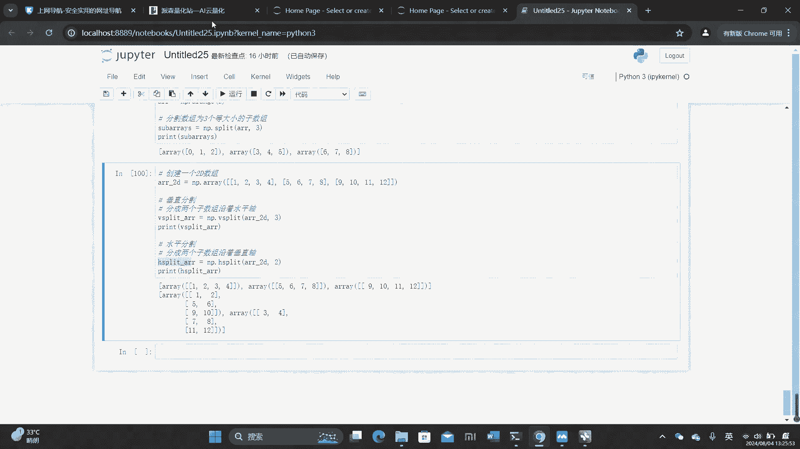

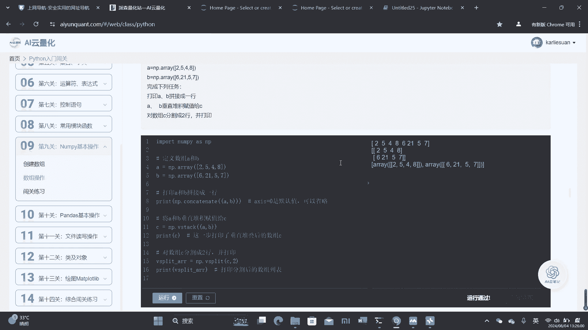

我们再具体看一下这个分割呢，就可以发现我们最初的是一个二维的数组，我们通过垂直的分割，就是沿着我们的水平轴进行分割，将它分割成了这样三个数组，注意看我们是将一个数组分割成了三个数组，然后呢。

它垂直分割是沿着我们水平轴进行分割的，就是这样子，1234分成了一个数组，5678分成了一个数组，最后九十十一十二是分成了另一个数组，然后呢我们的水平分割是沿着我们的垂直轴，这里呢让我们分成两个数组。

那它就是1256和90，这样分割成了一个数组，我们的垂直垂直轴可以判断这个中间，然后呢，3478和十一十二被分割成了另外一个数组，这里呢就通过水平分割，将一个数组分成了两个数组，这是我们数组的一个分割。

注意不要和前面我们的数组的堆叠和拆分。

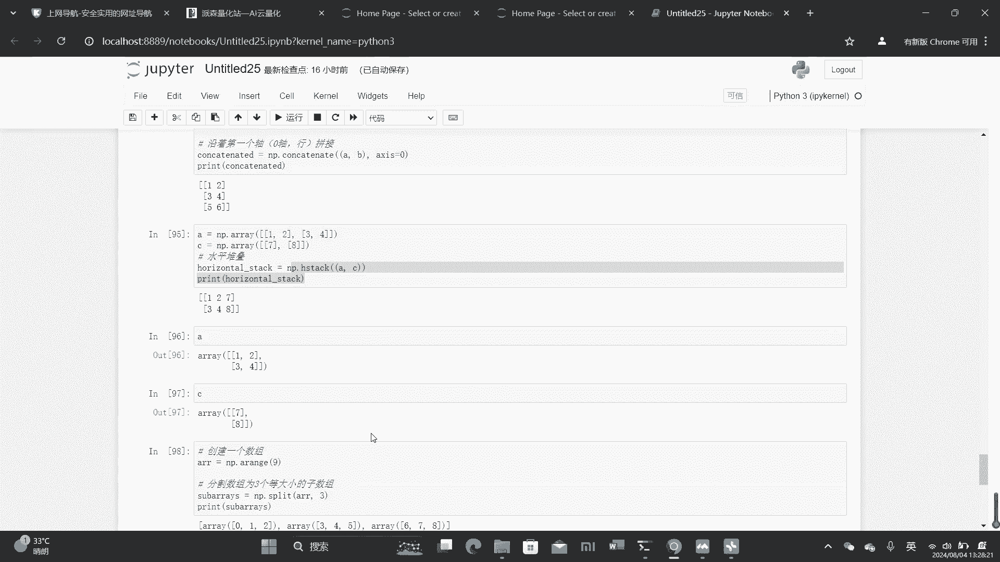

弄混了。

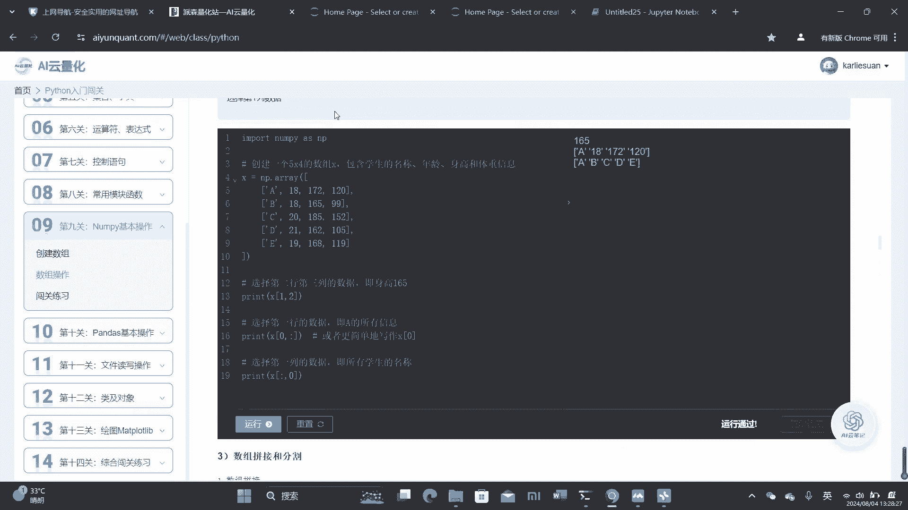

这里分割后呢，他就是分割成了不同的一个一个的数组，而不是改变数组的形状，下面我们来看一下这个习题哦，习题给了我们两个数组，A和B给了我们三个任务，第一个任务要求我们打印A和B拼接成一行，拼接成一行呢。

这就涉及到了我们刚刚学的这个数组的拼接，数组的拼接呢我们可以用第一个用这个方法，然后呢我们再看它是要通过拼接成一行。

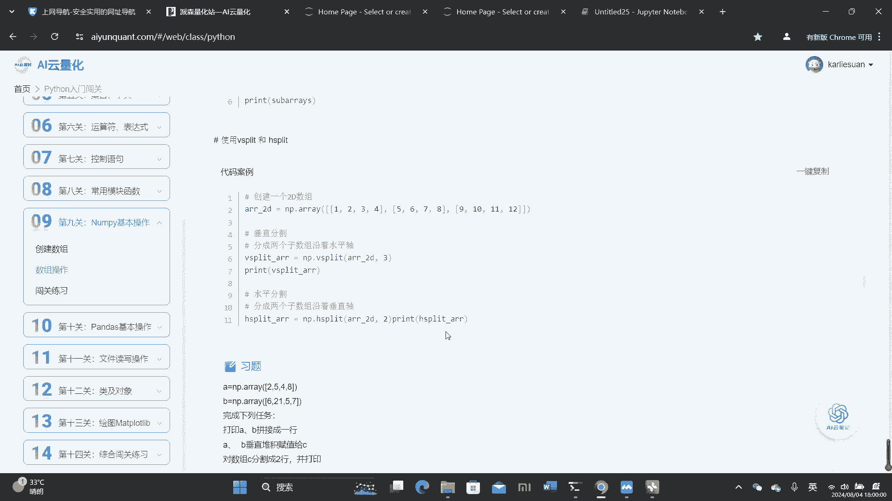

那么我们就是要通过行来拼接，这里呢我们这个轴等于零，它是默认值，所以是可以省略的，我们直接打印出AB这样拼接成一行就可以了，第二个任务呢。

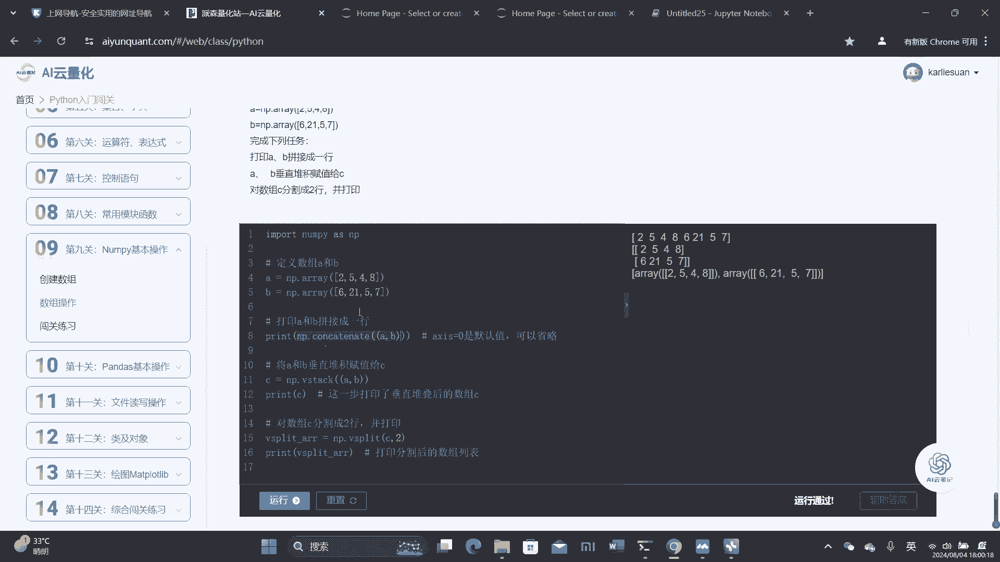

是要求我们将ab垂直堆积赋值给C，垂直堆积呢刚刚也讲过了，我们要用的是到，我们要用到的是这个这个V开头的。

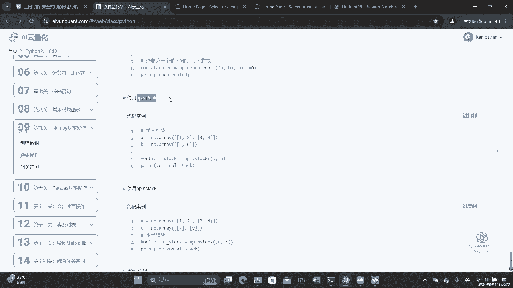

这个是垂直堆积，就是这样使用的，然后呢将它复制给C再打印出来就可以了，第三个呢我们要求对数组C分割成两行，并且打印这里呢是涉及到了数组的分割。

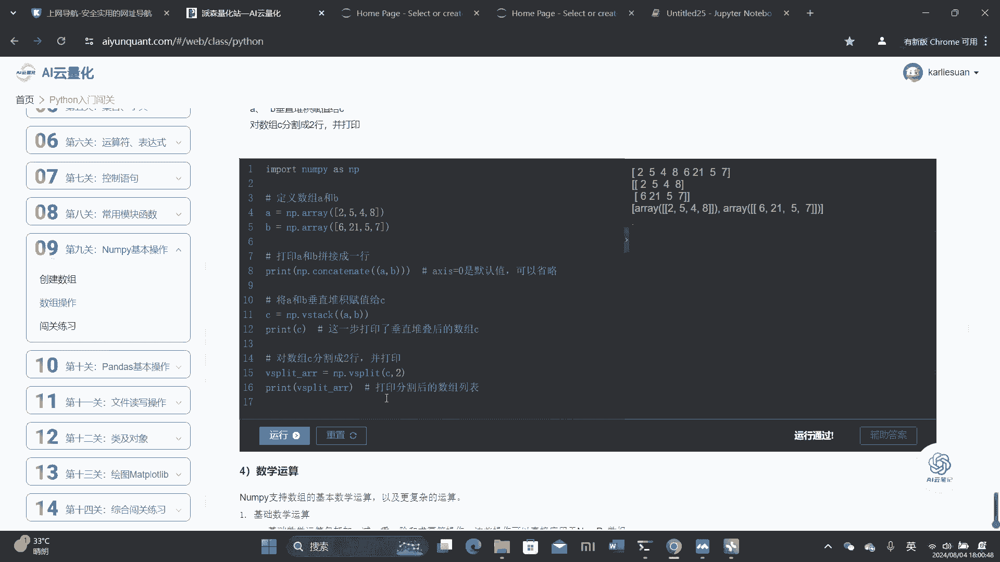

分割成两行呢，我们就要用到我们刚刚学的v split，就可以将它分割成两行，就是这里通过水平分割呢分割成两行，然后这里写二代表要分割的数量，然后呢我们就可以将它分割成要求的两行，我们可以看到输出的结果。

最后呢就是分割成了两个数组，这里呢是通过我们的垂直堆积让他复制了给C，下面呢我们再看一下数组的数学运算，我们数组呢可以既支持基本的数学运算，以及更复杂的运算，我们先来看这个基本的数学运算。

基本的数学运算呢，也就是我们平常说的包括加减乘除，还有求密这些操作，这些操作呢，我们可以直接将它运用于南派的这个数组，首先我们先看基本的算数公式，基本算数公式呢，我们可以直接用加号来指数组进行相加。

减号呢让数组进行相减，并且乘号呢让数组进行相乘，这是最简单最基本的算数，下面我们看一下实例，首先呢给出我们AB两个数组，两个一维数组，然后呢我们可以用加号来让它相加，减号让它相减。

我们来看一下具体输出会是什么样的，我们来看一下上面这个呢是通过相加，可以发现它是对应位置的元素相加起来，得到我们相加原数组相加后的结果，也是对应元素对应位置的元素相减，得到我们数组相减后的结果。

这就是我们数组的相加和相减，同理数组的乘法，除法以及求幂呢，也都是通过对应位置的元素来进行计算的，下面我们再看一下这个高级的数学运算，他南派还提供一系列高级的数学函数，像三角函数，指数对数。

这些首先是三角函数，三角函数呢我们可以使用这个，angles数组的值就可以定义它一个数组，然后呢，我们可以使用这个radiant，将它的数组呢转化为弧度，这是我们刚刚定义数组的这个定义的这个数组。

我们可以将这个数组转换为弧度，我们还可以再使用sin函数来计算弧度，数组中每一个元素的这个正弦值，同理cos和这些也同样是可以计算的，我们来看一下它的输出，我们先定义了一个数组，表示他角度。

然后呢我们通过这个将函，通过这个函数呢将角度转化为我们的弧度，我们可以通过这个sin函数呢，将每一个元算出我们这个数组中，每一个元素的正弦值，我们再看一下指数，同样的我们给出一组数组。

我们用这个EXP指数的缩写，就可以将每个元素计算它里面每个元素的指数，并且输出出来对数也是同理，我们这里用到这个log，就可以计算数组中每一个元素的对数值，下面我们再看一下聚合运算。

南派提供了各种聚合函数来进行统计分析，这里经常用在统计分析，像求和啊，最小值啊，最大值这些，首先我们可以用sin函数来进行数组的求和，sin函数进行求和呢，就是将我们数组元素相加起来，得到这个求和值。

那这个十呢就是1+2加3+4得出来的值，然后呢还可以找到我们数组中最小的值就是一，数组中最大的值就是四，这就是我们聚合运算，接下来往下看，我们还可以用这个命来求出我们数组的平均值。

这个s std求出我们的标准差，以及求出我们的中位数，这都是我们南派提供给我们的聚合函数，来进行统计分析的，所以在统计分析的时候也是非常的方便，直接用这个函数就可以计算。

不需要我们再另外自己进行编程来计算了，最后的南派还可以提供一系列，用于线性代数的函数，线性代数呢就跟我们，这是我们在数学中学习的线性代数，首先给出了我们两个2×2的数组，这里呢用这个mp点dot。

可以直接进行我们矩阵的乘法，然后呢刚刚讲过的这个transpose，可以进行我们矩阵的转置，用这个呢可以直接求出我们矩阵的逆，也就是求出我们矩阵对应的逆矩阵，具体的逆矩阵的求法呢。

大家可以在我们的AI语笔记里面进行询问，在这里就不过多介绍了，因为这里属于属于是数学的内容，这里呢我们还可以求我们矩阵的行列式，求矩阵的特征值以及特征向量，还可以求解线性方程组。

这些呢也都是我们线性代数数学的内容，我们在这里的重点呢是要通过我们的Python，记住我们用number派怎么样求出矩阵的行列式，那南派怎么样求矩阵的特征值和特征向量。

以及用南派怎么样表示求解线性方程组，如果有关于矩阵的不懂的知识呢，我们可以在我们的云笔记中，或者是再翻翻我们的数学课本，再来学一学，下面我们来看一下我们的习题，习题告诉我们有两个数组。

首先给了我们两个数组，要求我们分别实现下面五个任务，首先我们要打印出它相加相减相乘相除的结果，这个非常简单，就直接用我们的符号来进行计算，第二个呢要求我们打印出它的开方，开方呢。

我们就是要用到这SPORT这个函数，来直接进行计算，对数的刚刚讲过了，就是用到这个mp点log来进行计算，最大值，最小值，平均值和标准差，刚刚也在我们第三点聚合运算里面讲过了。

都分别用它的简写来进行计算，最后呢打印它的矩阵乘法，矩阵乘法呢就是我们线性代数中使用的，用mp点dot传入两个数组作为参数。

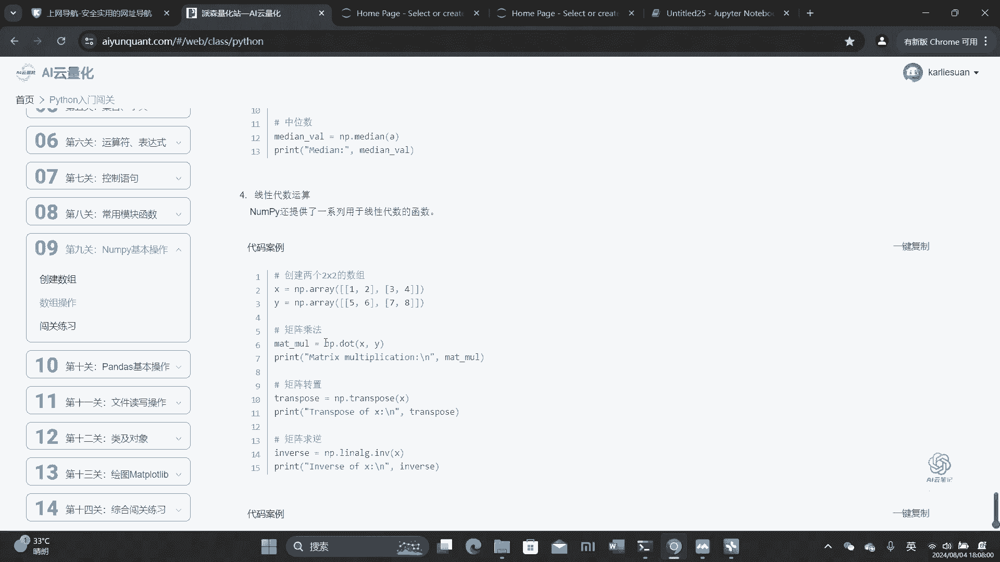

就可以计算出它的矩阵乘法，最后呢我们来讲一下广播，广播，他是南派中一个强大的机制，它允许不同形状的数组进行算术运算，广播呢遵循以下五个规则，在这里我们就不一一念了，总的来说。

广播的实际运用通常运用在这个科学计算中，当我们需要对不同大小的数据集，执行各种操作的时候呢，它能够提供计算上的便利和性能优势，下面呢我们就来看一下示例，首先我们创建这样一个数组。

我们可以发现这个一维数组里面的，它是有三个元素的，我们再创建一个标量B等于2。0，然后通过广播呢，我们的标量B，它就会被拓展到数组A的所有的元素上，也就你可以发现我们前面讲的加法呢，需要对应位置相加。

而这的A和B它是不存在对应位置的，但是由于广播的这个机制呢，我们的B和A还是可以进行相加的，我们看一下相加后的结果，其实就是A的所有的元素都分别跟B相加，最后输出出来，这就是我们广播的运用。

我们的标量B呢被广播到数组A的大小，并且呢和A的每个元素都逐个相加，下面我们看一下示例，26，我们考虑一个形状是3×3和，一个形状为3×1的一位数组，这个A呢是33的数组，B呢是一维数组。

其中有三个元素，这时候我们让A和B进行相加，同理B会自动拓展成三个维度，然后呢跟对应位置的元素进行逐个相加，我们可以看一下输出结果，实，也就是每一每一行，我们都和101对应位置进行了相加。

1+1=20加二呢，这里是23+1呢，这里是四，同理我们第二行也是和101进行了逐个相加，这就是我们广播机制的作用，下面我们看一下示例三，示例三是告诉我们，不兼容的形状呢就会导致错误。

我们创建一个形状是2×1的这个数组，两行一列，我们再创建一个形状是3×1的这个数组，这时候相加呢我们就会导致广播错误，因为我们A和B呢，在第一个维度的大小是不匹配的，这个在第一个维度上是三。

这个在第一个维度上是二是不匹配的，所以呢这时候我们没有办法进行广播，让我们再看一下数，示例四，如果我们有一个数据集，我们可以对它进行归一化操作，我们就需要从每个点中减去平均值，并且再除以它的标准差。

首先我们这里还是创建了一个数据集，10×100乘三的数据集，这里要求我们从每个点减去平均值，那我们就先用前面的方法，算出它的平均值以及标准差，然后呢我们再使使用广播进行归一化就可以了。

下面我们来看一下这个习题gt，告诉我们已知股票600050的日序列数据，要求我们对它进行广播规划，前面的我们可以用到这个ak share，这个来获取股票的数据，这个在我们在后面也会讲到。

这里呢我们可以先直接使用，我们得到了这个number派数组了以后呢，我们可以计算，首先要计算均值和标准差，用我们刚刚的这个mean和std，计算它的均值和标准差，然后呢我们执行广播的归一化。

最后我们打印规划中数据的前五行，又到我们这个南派的切片操作，下面呢我们来看一下本章习题，练习题一要求我们创建一个长度为十的空向量，并且第五个值为一，首先我们先导入我们的N派。

然后呢这里题目要求我们创建一个长度为十的，这里变成了全零数组，那我们就全零数组，其实就是我们的空腔量，那我们就创建一个长度为十的全零数组，非常熟悉了吧，用到我们这个zeros，然后传入这个十。

就是这个长度作为参数，然后呢要求我们将第五个值设为一，我们直接用赋值的方式就可以了，最后打印出数组，这就是一个长度为十，并且第五个值为一的向量，要求我们创建一个包含，从10~49的值的向量，或者说速度。

并且进行一个反转，首先我们先创建出这个数组，从10~49，我们用这个arrange来创建，并且它是同样是包头不包尾的，那我们这里括号就要填十和50，然后呢要求我们进行反转，数组，反转数组呢。

也就是我们之前在列表里面也学过的，可以让他从最后一个打印到第一个，就要用到我们这个两个冒号和一，这个在我们列表里面已经讲过了，但我们的数组这里呢同样也是可以使用的，最后我们打印出Z就可以输出。

我们反转过后的数组了，闯关练习三，闯关练习三，要求我们创建一个3×3，并且值是从0~8的矩阵，同时还要让我们打印出大于五的数，我们先来创建值从0~8的矩阵，那就是用到非常熟悉，用到我们这个range9。

就可以创建一个从十从0~8的矩阵，然后呢形状态有要求是3×3，那就用了我们这个reshape来修改它的形状，然后呢这就是我们原始矩阵Z，然后呢要求我们打印出大于五的数，刚刚也讲过了。

我们可以直接用这个布尔索引来打印出来，Z大于五的元素，就是我们678，下面我们来看一下练习题四，练习题四，要求我们创建一个3×3乘三的随机数组，并且呢要找到数组中的最大值和最小值。

我们随机数组呢我们就用到这个rin random，然后呢形状呢是3×3乘三，我们作为参数填进去，然后呢我们要找到数组中的最大值和最小值，就是我们刚刚讲的数组操作里面。

我们可以用max合并找到它的最大值和最小值，并且将它打印出来就可以了，这就是我们刚刚讲过的，下面呢我们来讲一下闯关练习五，闯关练习五要求我们创建一个二维的数组，其中边界值为一，其余的值都为零。

边界值为一，其余值为零，我们可以这样子创建，首先我们先创建一个所有的值为一，然后呢我们再用切片找出它的边界值，将它赋值为零，然后呢要求我们对数据进行规划，我们前面讲过了，对数据进行规划呢。

我们要先求出它的平均值以及标准差，在这里呢我们还将增加了一个操作，为了避免我们除以平均值的时候呢，出现除以零的情况，我们将零，我们将我们2P我们避免除以标准差的时候呢，出现除以零的情况。

我们先检查标准差是否为零，这个就是我们刚刚的B值索引，如果为零的话呢，我们索引出来将它赋值为一，然后呢我们再进行我们数组的归一化，最后呢要求我们如果出现这个烂值，就它将它的值替换为五。

这里呢我们就要用到一个mp点is snn，这个可以返回我们是NAN值的数据的索引，我们再通过这个索引切片赋值方法呢，将它替换为五，最后呢打印出我们对应的数组就可以了。

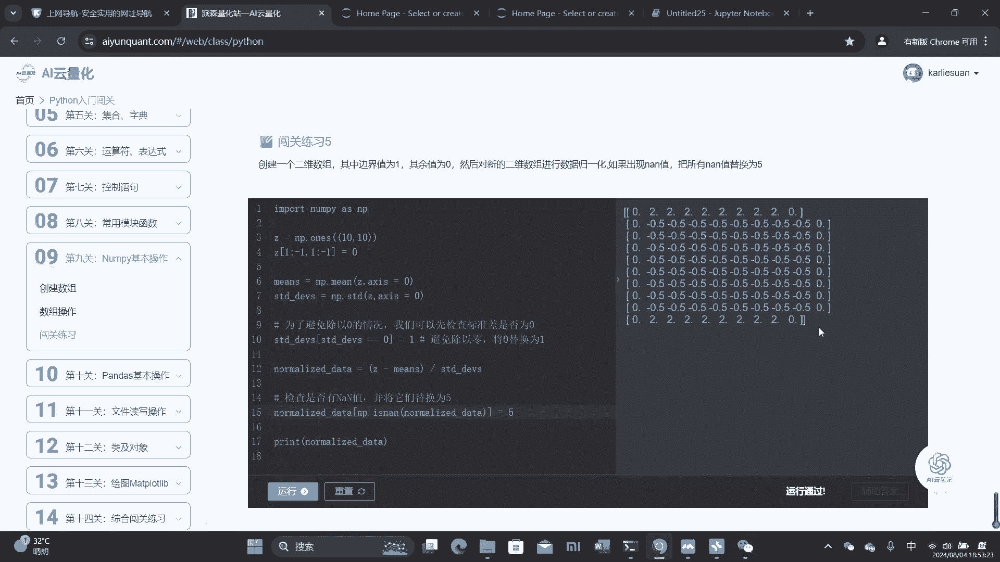

这就是我们本章的内容。

我们本章学习了南派的基本操作，我们首先先学习了各种各样创建数组的方式，以及我们对数组可以进行各种各样的操作，我们可以对数组的形状进行操作，同样跟列表一样，可以进行索引和切片。

我们还可以将两个数组进行拼接，以及将一个数组进行分割。

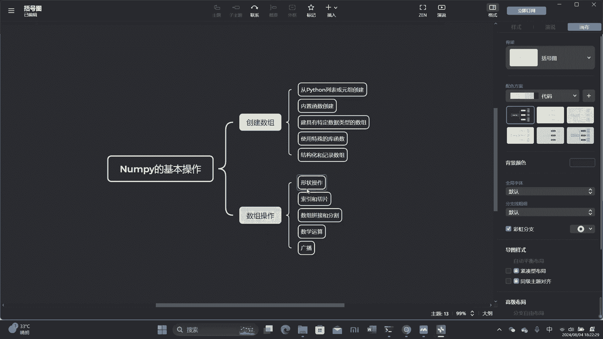