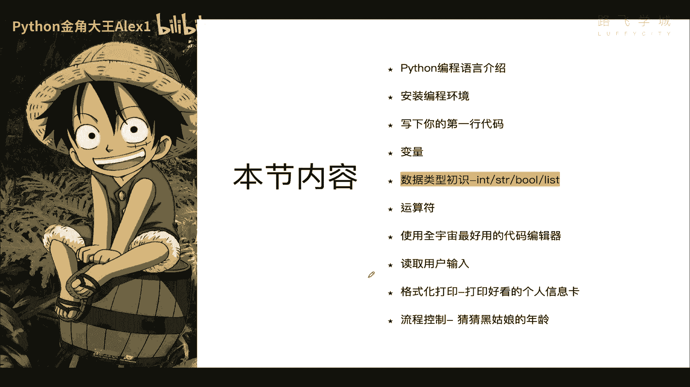
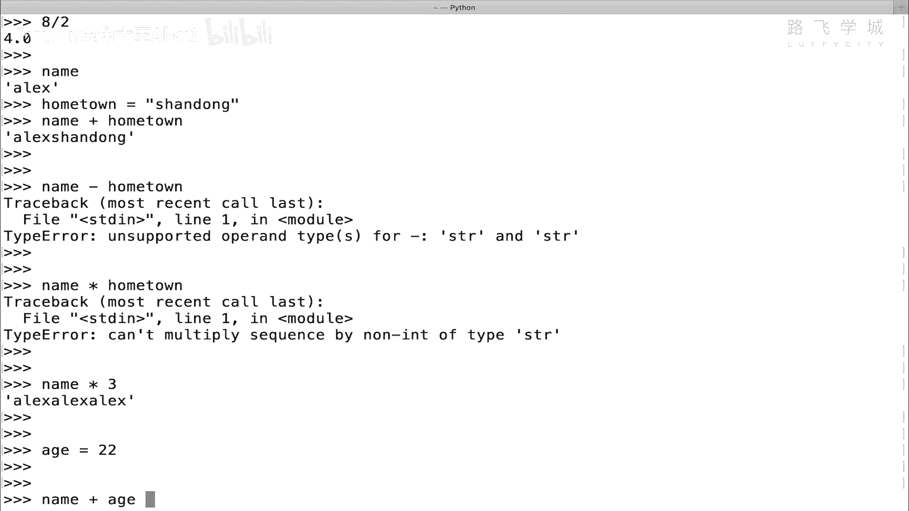
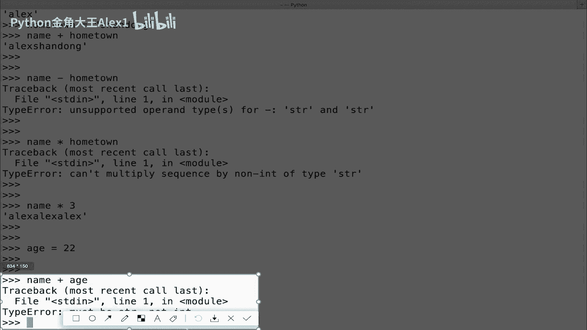
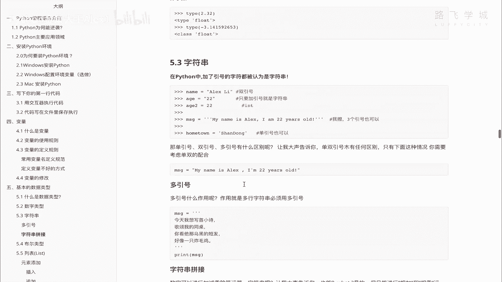

# 【2024年Python】8小时学会Excel数据分析、挖掘、清洗、可视化从入门到项目实战（完整版）学会可做项目 - P10：09 数据类型初识-数字&字符串 - Python金角大王Alex1 - BV1gE421V7HF

OK同学们，接下来咱们学数据类型的初始，数据类型的初始。

这是一个非常重要的知识点，好吧，那接下来先看什么是数据类型啊，什么是数据类型，那首先说啊，咱们这个人类啊可以很清楚的分清啊，很轻，很容易的分清这个数字和字符的一个区别啊，什么叫数字型，比如说你告诉我。

你一眼就知道这个25是个阿拉伯数字，这个是一个啊咱们中文的一个字符，是不是啊，哎咱们很直观的就可以分清他俩的这个关系，对吧，字符是用来这种字符串，字符串就是字符嘛，是用来可以造句子的，对不对。

金角大王是沙河最靓的仔对吧，这是造句数字呢可以加减乘除，OK但这是人类能分清的，但是计算机我告诉你，计算机并不能计算机，你直接把这两个值怼给这个计算机，计算机根本没有办法分清，它是一个数字还是一个字符。

明白吧，所以就是他很傻啊，这计算机虽然很强大，但某种程度它看上去很傻，除非你明确的告诉他哦，我传给你的是一个字符串，就是这是一个字符串，或者我传给你的是一个数字整数对吧，哎你明确的告诉他。

他还能按照这个整数去处理对吧，就是啊知道你可以加减乘除啊，你可以进行造句，你如果不明确告诉他，只是传给他，他就不知道这是个什么东西，能理解吗，所以啊就是说你必须明确的告诉计算机。

你给他的这是一个什么东西啊，给他这个东西什么东西，所以呢它是这个为了让计算机能够分清对吧，这个是数字，这个是字符串，所以呢每一个编程语言里面，都会有一个叫数据类型的那么一个东西啊。

数据类型其实就是对咱们啊这个对各种数据，就是这对各种数据生活中的各种数据类型，进行了一个定义，给它定义到计算机里说啊，计算机里也有这种对吧这种类型，然后呢，呃这个。

所以就是对各种数据进行了一个明确的划分啊，你是一个字符串，你是一个数字，你想让计算机进行一个数值运算，比如说加减乘除，你就传一个数字给他，你想让他处理文字，你就传这个像这种字符串对吧啊，你想传这个。

比如说一个啊一个班级里的人员与公司的公公，公司里的人员列表，那你就传一个列表给他啊，所以这个他就能接收各种各样的数据类型，OK那在Python中这个数据类型呢有这些有整数啊。

有浮点数就是他俩都是数字的范畴啊，就浮点数就是小数，然后字符串布尔列表与元组字典集合这么多啊，这么多，那么后面会依次讲，但是今天我们只学啊，只学学到这，看到没有整学这几种，后面呢咱们第三第四天再学。

OK啊那好我们就接下来先来从整数啊开始看起，好吧，先从整数开始看起，那直接在这里有这个整数呢，啊整数这啊啊这些同这个说法，首先整数和浮点数都称为数字类型啊，数字类型，那整数它的英文的。

也就是在Python里的这个类型的名字叫int，int是英文名字，integrate integrinteger的一个简写啊，integer简写嗯，tiger的一个简写好吧，然后呢。

你存的所有的整数它都是这个类型，你比如说啊这个年龄啊，这些数据啊，注意了，我们学一个新的函数，这个函数叫tap，tap就是要查你这个数据是什么类型的啊，你把这个变量名输进去。

它给你返回去看都是int类型啊，class int类先看int就是这个整数类型OK吗，class是说代表这是一个数，就这是就跟咱们人间对人，对动物进行了一个分类，class在这里是类的意思啊。

也就是说这是一个数字类，这是一个字符串类OK吗，他做了一个分类好吗，OK所以它们都是数字啊，都是呃，Sorry，都是整数啊，都是整数啊，那接下来接下来就是一个什么呀，浮点数哦，我先我先说完这个吧。

首先这个数字注意了，我前面没认真讲啊，说这个什么有的加引号不加引号，注意了，数字不能加引号，咱们前面定义的什么name，等一个ALEX那些东西是不是有加引号啊，对不对啊，有加引号。

但是你看但是如果你是一个数字类型啊，你说一个数字类型你不能加引号，你就直接sorry，等一个22是不用加引号的，你加了引号它就不是数字，加了引号它就变成了一个字符串吧，咱们一会儿会学字符串，你看一下啊。

啊对吧，然后是一个int，但是你加二的话，它就是一个字符串，所以只要加引号就是字符串，不加引号就是数字好吗，只有数字不能加引号好吧，数字不能加引号，OK接下来这个就是一个浮点型，浮点型的话。

其实咱们就可以理解为它是小数，它就是小数就OK了好吧，小数库怎么会写，怎么写，这个不用我教了吧，对吧啊，type一下，你看显示的就是这个浮点，你自己可以试一下啊，然后还可以负数啊。

正整数负整数都是可以的，OK吧都是可以的，OK那这个就是浮点类型好吧，呃所以整数我们就讲完了啊，讲完了你可以写无限大，没有问题啊，那接下来咱们就来学这个啊，字符串字符串字符串的东西会多很多啊。

字符串注意了，加了引号的都被认为是字符串，这个引号可以是单引号，也可以是双引号，甚至是三个引号都是没有问题的啊，都是没有问题一样的，E你看啊，单引号我的hometown是山东，我是山东德州人啊。

这个在屏幕前的小伙伴啊，如果是老乡可以来加我啊，找我啊，咱们约啊，七天汉庭啊，我都陪你哼，那个山东啊单引号，但是我的名字双引号，你说它俩有区别，没有任何区别，那有同学说的，你这个不严谨。

我到底用单引号还是用双引号啊，用单引双引号还是用单引号来，接下来给大家讲一下这里啊，这里直接写了，如果你看啊，像这种情况下，你只能用双引号，你看为什么，因为这一段字符串里面有一个这个对不对。

有一个单引号，所以你如果外面也是单引号的话，那它就乱了OK吗，它就乱了，所以这种情况下，哪里边有单引号，你外面就用双引号给它引起来，能理解意思吗啊如果没有的话，你在这里用单还是用双都是一样的。

OK用单还是用双都是一样的，那接下来还有多引号是什么意思呢，多引号有一个单独的意思，就是多行字符串必须用多引号，什么意思，你看啊，现在我的这个随便打一个是吧啊，my name is alex好吧。

那这个是没有问题的，但是如果你是一个多行，看着你是一个多行是吧，这个MSG啊，二等于一个看着my啊，is什么，然后这时候回车，你一回车就报错了，注意了啊，你一回车就报错了，看到没有，它是不能多行的啊。

他就就是你只有单行的时候能用单双引号，如果是多行怎么办呢，就要用多引号，多引号，多个单引号，看着三个单引号或者是三个双引号都行，但是你开始是什么，结尾的时候也得是什么，你不能是这里是三个双引号。

结尾的时候是三个单引号，不行啊，都得配对了，然后你这里回车啊，你写my name is alex，然后回车你看啊，它出现三个点没问题啊，三个点就可以让你继续写啊。

I i'm twenty six years old，对不对，i i am from山东，对不对，山东province，对不对啊，然后呢啊li like clothes是吧，喜欢姑娘啊，然后接下来对吧。

哦三个字，三个双引号，一回车看着啊，三个双引号，这就结束了，注意了，同志们，这是一个多行的字符串，这个时候只能用三个引号，OK吗，你看一下啊，看一下哎，他说你这不是多行吗，怎么变成一行了，其实是多行。

注意了，在每一行结束处都有一个斜杠N，斜杠N在计算机里就是代表换行，你只你现在这样，它是没有给你换，他直接把这个换行符给你打印出来，但它是代表换行，看看三个斜杠N，如果你print一下，它。

就会把这个斜杠N换行符，给你解释成真正的语法，看着就解释成真正的换行，看到没有，它是不是真的换了，这个为什么有一个空行啊，到最后又换了一下，是不是到最后一换了，打了一个空号啊，所以他是换行嘛。

一回车嘛对吧，一回车就换行了，杠N是换行符好不好啊O啊，你说我没有敲换行符啊，没有你在这里敲了回车，它就是自动给你加了一个换行符OK吗，所以这个就是啊三个引号，单引号啊，多引号的一个区别好不好啊。

那明白了这个之后，我们来看啊，这个字符串它很显然啊，它很显然这个啊这个message啊，这个是一个字符串的一个类，OK吗，字符串一个类，那我现在给大家讲一讲啊，讲讲快速讲一讲。

说你看现实生活中人或者人和一只猪啊，和一只猪，他俩是两个种类对吧，一个是动物，一个是人，是不是一个是人类啊，这个动物类家禽类是家禽类，这个猪能干嘛，它就是吃喝拉撒，就是说白了就是吃饲料，是不是。

所以所有是所有长得跟猪一样的啊，这种这种这种动物啊对吧，它都有具具备这个猪的属性，具猪的特性是吧，可以他这个这个这个吃啊，吃得特别长成那个样子，然后吃饲料是不是啊，然后所有人这样的啊。

这样的一个长成人这样的呢基本上都是啊，这可以说话，可以走路，可以打字，可以思考是吧，所以就说我们按，就是在现实生活中分门别类的对吧，把不同的就是按啊不同的东西按类来区分对吧，那在这个程序里也是一样的啊。

他把不同的数据类型按类来区分，比如说我们现在是字符串类，刚才那是数字类，对不对，哎，那字符串类就应该所有的字符串都有，该有字符串独有的属性，比如说字符串可以干嘛，比如说数字可以干嘛，数字可以加减乘除。

那字符串可以干嘛呢，来我们看一下那字符串可以干的事情，都在这看着你打一个MSG点，注意了，打一个点，然后打你这个tab键，在windows上可能没有啊，在windows上可能没有呃。

打tab键不一定能出来啊，如果windows上打tab键出不来的话，你就打help type，把你这个MSD它是个字符串输进去，它也会出来一些东西，啊，我这个没有啊，没有奥地利不行。

你不能用help my Mac hs t r这个类啊也行，看着啊，注意了，HDR啊，不要help这个变量名HSTR，因为它是一个字符串类，哎，一回车你看他会把它会给你解释一堆英文的，你肯定看不懂对吧。

他这里都是它的一些属性，它的一些属性，咱们可以随便看一个啊，随便看一个是个人就能看懂的，对吧啊，哎这个啊返回一个什么up，什么意思，就是把这个字符串给它变成大写，变成大写啊，如果它是小写都变成大写。

也就是说这个字符串可以有很多地方，很多的什么呀，我们管它叫方法，也就是说字符串可以有很多的函数，方法和函数都一样啊，也就是说它对这个字符串，可以进行很多的操作啊，所以呢我在这里啊打tab键也行啊。

Mac上可以打tab键，windows上不知道啊，那不没弄好不行，就用这个啊，你看一打开B键出现了那么多的它的函数，半个括号，对不对，这就代表函数啊，或者叫方法这么多他都可以干的。

后面我们会详细的介绍啊，你们重要的方法是干嘛干嘛干嘛，我现在快速的给大家随便看一个，比如说就是咱们刚才那个up好吧，up咱们现在这个什么呀啊啊，MSGMCG打开过一样啊。

MSG看一下这个值是不是都是小写的字符，是不是我给他M0点up直接加上括号就可以了，看着返回的是什么，是不是全都是大写，他就把这里面的字符全都给你大写了，除了换行符之外，全都给你大写了，哎大写完了之后。

你这个时候呢注意了，你要想把它存下来，就再存另外一个就是M2吧，对吧啊，他不会改原来的值啊，不会改原来的值，它会你要它只是给你打印出来，结果如果你想存下来对吧，你的M2就是大写了，对不对。

大写完之后你还可以把它换成小写啊，叫lower cheese，看到没有，lower啊，就是小写是不是又变成小写了，能理解吧，哎就是它提供了很多的方法，我再教你一个最有意思的啊，MRSG给大家看啊。

嗯name等一个ALEX吧，注意了啊，看着啊，Name，它有一个center的方法啊，center的方法它是干嘛的呢，不要你里面可以输参数的数，参数是什么呢，数参数啊，你可以直接看它的方法啊。

看他的这个这个这个这个帮助信息，直接help啊啊，打这个center，把这个center放进去啊，看着你看他直接就把这个方法的啊，这个这个这个这个这个用法告诉你了，说这里面是就是宽度的意思。

这里面是要填的东西，什么意思呢，也就是说它可以它可以它可以，我直接给你看效果，你就理解了啊，直接在这里，这是YX长度，写一个50吧，然后这里面要填充的东西写一个，这个大家看一下，你能理解什么意思了吗。

也就是说产生一个50，就是长度为50的一个字符串，然后呢中间离这个ALEX只有四个字符啊对吧，还差40多，还差很多呢，那怎么办呢，用这个横杠给它填充起来，能理解意思吗，啊填充起来OK这个就是啊。

就是这个叫叫叫center方法啊，center方法，那同志们啊，同志们，这个这个这个啊大家看出不是50个字符啊，注意了啊，这个是由就是呃对他不是50个，他是50个字节啊，字节啊，这里我不能多讲了啊。

因为多讲你就懵逼了啊，字节的算法跟这个不是不是说1234，这么数下去的啊，不是这个样子，但是同志们告诉你，字节这个东西后面讲编码的时候会讲到啊，那你不要你不要在这里多问就行了。

你说这个啊怎么不是50不用想啊，你就知道它能它能改成这个效果就OK了，好不好，这个就是字符串，字符串好，那字符串给大家这里讲了他一些基本用法，其他用法你可以先探索，反正后面我们也会给大家讲好吧。

再给大家讲，接下来我快速给大家讲一个什么呀，字符串的一个拼接好吧，咱们字符串就给大家讲完了，那字符串的拼接啊，什么意思呢，就是数字是不是可以加减乘除啊，比如说七加个八，对不对，除加或者减对吧。

78÷1杠二都可以啊，都可以，那字符串呢字符串可以加减乘除吗，当然不行啊，但是字符串可以干一个事儿啊，比如说我这是一个name对吧，我这是一个age等一个啊。

这个这个这个这个这个age别了我的这个hometown啊，等一个山东sorry sorry，注意了，看着啊，他俩是可以进行拼接的，拼接相加就是拼接，大家看其实就拼成了一个字符串，看到没有。

是不是拼成一个字符串了，明白吗，可以加还可以，同学们说可以减吗，减是不可以的，加是相当于拼接减是啥意思啊，说它对吧，这个数字符串怎么减呀，没办法减，所以它不能减，他可以干两件事，一个是家，一个是成。

注意了，乘是什么意思呢，啊你不能这样乘，你不能说乘home town啊，这是不行的，他啊他没法这乘啥意思啊，不知道它可以这样乘乘一个，比如说乘以三，你看乘以三是什么意思啊，打印三次，看到没有，打印三次。

对不对，乘以三，打印三次除行不行啊，也不能除，只有加和乘，OK吗，所以我在这里啊，你看在这里已经写了，可以相加就是拼接对吧，相乘就是重复打印自己多少次好不好，OK那刚有的同学说啊，我我这个可不可以。

你看我这里有一个name了，我再写一个值，等于22对吧，我可以name加这个A看到没有。

name加行不行呢，注意了不行，他说什么呀，类型错误看到没有。

是不是类型错误啊，说必须是一个字符串，not int什么意思，也就是说字符串的拼接只能是限于字符串本身，看到没有，字符串的拼接，只能是双方都是字符串，你不能搞了一个字符串，又有一个数字，它俩相拼接。

它俩不是同一种类型，相当于你现在拿他们的人和狗进行杂交，他俩杂交不出东西来，对不对，他俩这是跨物种了对吧，所以就字符串只能跟字符串进行一个拼接，数字跟数字它不能拼接，它那加减乘除对不对啊。

能力要能理解这个意思啊，好这个就是咱们字符串的一个初始OK吗，初始好不好，我给大家，我讲的比较快啊，你自己要跟着练一遍，把这个单引号，双引号，单引号，还有字符串拼接相乘。

