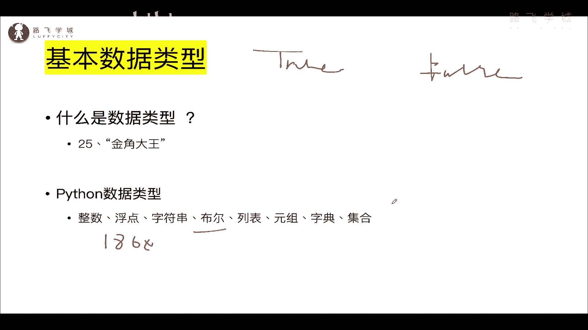
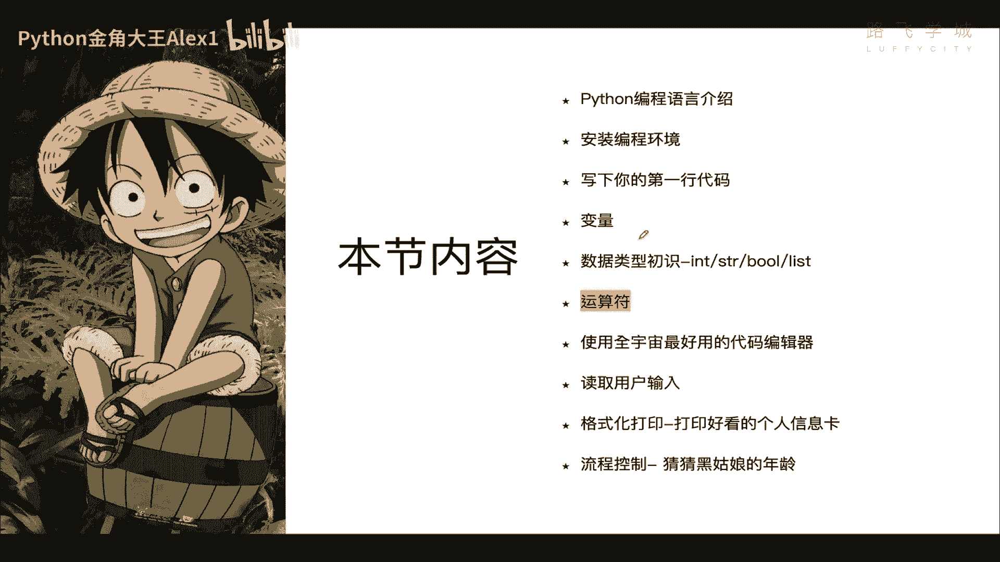
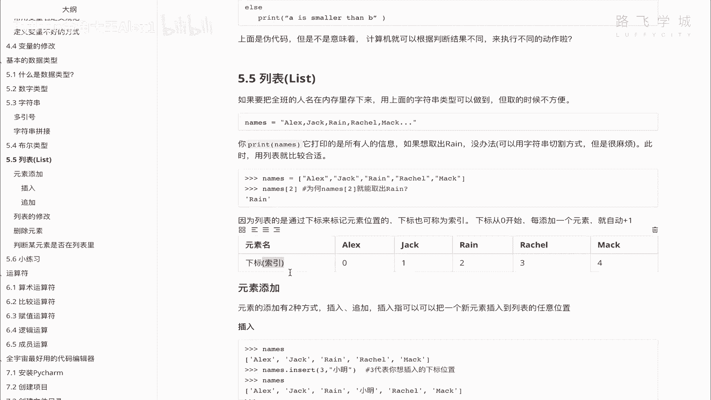
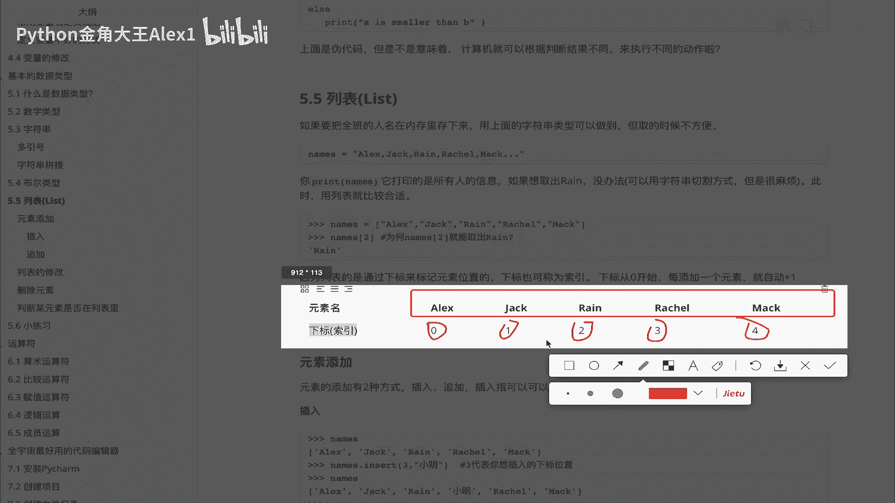
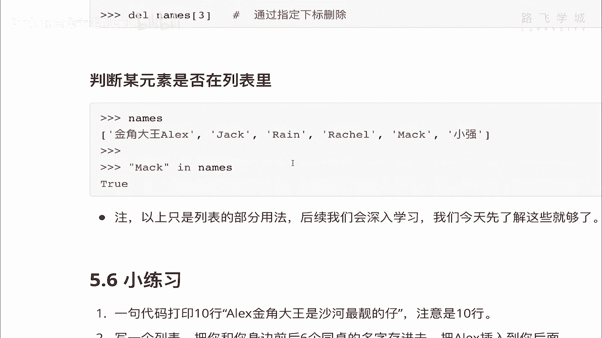

# 【2024年Python】8小时学会Excel数据分析、挖掘、清洗、可视化从入门到项目实战（完整版）学会可做项目 - P11：10 数据类型初识-布尔&列表 - Python金角大王Alex1 - BV1gE421V7HF

OK同学们这一小节学布尔这个类型，那布尔呢是一个人名，OK吧，他应该是186几年啊，186几年，没错的话是美国人，他发骗了啊，通过这个电路加上这个电阻可以实现啊，这个电流的控制，比如说对吧，开这个灯。

开那个灯对吧，就开关限制啊，开关的这种，那咱们计算机底层的最本质的原理，其实就是通过这种电路的啊，来各种阀门啊控制，所以呢为了纪念他，在这个计算机里正好有一个数据类型，就跟这个对吧，其实它只有两个状态。

但是说计算机底层有两个状态，就是零和一嘛，二进制他也只有两个状态，就是一个是true，一个是false啊，一个是true，一个false啊，在这里看布尔类型很简单，就两个值，一个叫true，中文叫真。

一个叫false假，他干嘛的呢，它主要用来做逻辑判断，OK吗，也就是true对吧，一个false对不对，好写得好看啊，这字那但咱们刚才讲过了，说它主要用来做逻辑判断，但是同学们你们可能并不明白啊。

那句话的意思是吧，并不明白说用来做逻辑判断。

怎么做逻辑判断啊，Let me explain to you，OK吗，让我解释给大家啊，怎么解释大家呢，比如说啊我现在有两个值。

诶诶诶我现在有两个值啊，比如说一个是A等于一个三对吧，我的B啊等于一个五好嘛，那我现在跟你说，有一个公式A小于一个五啊，小于一个五吧，对啊sorry，写错了啊，怎么回退回退不了了，诶，怎么回。

那不是A小于五啊，应该是A是吧，小于B写错了啊，那我现在问你A小于B这个公式成立不成立，成立不成立，你一看那肯定成立啊，三小于五吗，相当于对吧，它确实小于，那成立好，我们人通过肉眼来看来。

去自己脑子里做了一个思路判断啊，它是小于的，但是我告诉你计算机怎么去怎么着，计算机怎么去描述这种，他俩A确实小于B的这种这种公式成立的，这种这种状态对吧，也就是说他俩A确实小于B对不对。

那小于B那计算机怎么描述这种公式的，是小于，还是就是这个这个相当于这个公式是成立的吗，他怎么描述这种成立的状态或者不成立，对不对，我说A大于B它就不成立，怎么描述这种状态呢，对吧对吧，诶没错。

答案就是用这个布尔类型，布尔类型不是一个是true，一个是false吗，对不对，那A小于个B它相当于是成立的对吧，成立就代表处啊，中文就是针对不对，也就是这个公式是成立的，真就是代表是正确的啊。

不能叫正确就是成立好吗，成立那如果我在这里写成了A大于B对不对，A大于B那它就是不成立，不成立就是false false，就是甲能理解意思吗，哎他就是就这两种状态没有中间状态说啊，半成立半不成立，No。

只有成立或者不成立，就是真或者是甲能明白吗，好那他有能，也就是说他这个计算机，能描述这种公式的成立与否之后，我们为什么要描述这种条件，对不对，我描述这个有什么用啊，对不对啊，在这里你看啊，我写一下吧。

A等于一个三，B等于五对吧，A小于个五成立吗，成立是true，返回一个true，这个结果A大于B呢啊SORA小于一个五，A小于B啊对吧，是不是成立A大于B呢，就不成立，返回false，没有中间状态。

只有这两种好吗，所有的计算机里的，注意了所有计算机里的逻辑判断啊，就这种这种各种流程上的控制，比如说往东走往西走对吧，这个这个这个这个各种机器人的多，所有的流程控制本质上只有这两种状态。

true或者false ok吗，以后你写的所有的这种判断啊，流程上的判断，计算机的代码的都是通过这两种状态来表现的，好吧，那为什么要描述这种条件呢，就是因为啊，接下来我们可以根据条件。

结果可以干不同的事情啊，什么意思，也就比如说这里我写了一个假的代码啊，假的代码比如说A大于一个B，如果A大于B我就可以打一啊，A是大于B的，对吧啊，ABZB如果小于B呢，我就可以打印A小于B。

那同志们是不是意味着是不是意味着什么呀，是不是意味着计算机可以根据判断的结果，执行不同的流程对吧，如果这个成立，就执行这个流程，如果这个不成立，否则else啊，否则我就执行这个流程，能理解意思吗。

这样的话你的计算机就不是一个，说白了这个这个这个就像咱们人今天出门对吧，如果下雨啊，我要带伞，不下雨我就不带伞，你在计算机里也可以实现这种逻辑了，但前提你才能描述这种条件判断，是不是条件判断啊。

就是true和false能理解意思吗，哎这个就是布尔类型，布尔类型好不好，好OK啊，那讲完布尔类型，我们就快速的啊，也给大家讲这个吧，就是什么呀，这个就是列表，好吧啊。

讲完这个咱们的基本数据类型就讲完了，那列表到底是一个什么东西啊，列表是个什么东西啊，很简单，举个例子啊，你上学那你就看你班里有多少个学生同学，你上班你就看你们部门有多少个人，我现在要把你们班。

或者我把你们部门里的这些人都给你，要求你在计算机里给我存下来好吗，存下来怎么存，你已经学了字符串，是不是，你说啊存下来嘛，那很简单呀，那就来吧，哈哈哈对啊，那你来吧，names等于一个。

比如说啊先第一个ALEX对不对，然后呢写一个逗号啊，注意了啊，就分开嘛，你对对对，字符串嘛，你你你你叫成ALEX，然后呢jack对不对啊，然后rain对不对，然后呢。

还有一个我我这个弟弟弟弟是银角loser啊，我们另外一个老师，还有他的女朋友叫black girl，黑姑娘，黑姑娘啊，回去把照片发给你啊，不够哎，假如说我们你看通过这种存下来，是不是可以存啊。

你看这是不是就存下来了，很好很好啊，但是问题就来了啊，问题就来了，你这么存下来了之后，我想去取，我说这样来，我把这个black girl黑姑娘给我取出来，黑姑娘给我取出来，同志们，你给我取，你没法选。

因为你只要一调用这个变量，就会把所有的值取出来，你说NO，我不想要别人，我只想要黑姑娘啊，只想要黑姑娘怎么办怎么办，没有办法不好，那没有办法，因为这个字符串就是合体的在一起，你说同学们哎。

你说我可以这样啊，我一个人存一个变量啊，比如说我name1存成ALEX对不对，然后ALEX，然后我内蒙二一会啊，就直接相当于换车回回回车了啊，内蒙二，我等一个jack对吧。

我name3等于一个什么什么什么什么，我到时候去取，你可以呀，但是你那样取的话，那你能记得住这种对应关系吗，对吧，你说你明明取这个取这个jack，你结果继承了是内部一，那不就乱了吗，就依然很麻烦。

明白吗，所以也不能那样，就是说现在再把需求明确一下，我通过一个变量把这些人都取存下来，存下来之后，并且还容易取，怎么办，字符串不行，所以呢哎列表就是专门为了这种场景出现的啊。

你有一个列表就可以存在一个变量里，存多种这个什么呀，数据多个数据，比如说我可以把每个人的名字单独存下来，存下来之后，并且可以单独取，很容易取好吧，怎么列表的语法是什么呢，很简单，直接是names。

看着就注意了，它的语法是这个中括号，看到没有，这是一个这就代表中括号，这就是一个空列表，空的没东西啊，但是我可以看它的类型啊，你看，是不是他已经是一个列表类了，对不对，他已经是一个列表类了，对不对。

不是字符串了吧，那这个时候注意了，同志们，你要想往里面存东西怎么办呢，就你当然你它命名创建的时候你就可以啊，创建的时候你就可以往里面存东西，存东西注意了，用引号引起来，里面是你的左二的话，一注意了。

你可以存一个值，存一个值，比如说把ALEX存下来，看到没有，存完了，这就是列表中的一个值啊，我们称之为元素啊，元素注意了啊，元素称之为称之为称之为称之为元素，看到没有称之为元素好吧。

然后存下来一个之后想存第二个怎么办，加逗号，注意了，加逗号啊，这个不能，这是固定语法存jack ok吧，这个这就存了第二个元素啊，第三个元素想存这个rain啊，你说啊我可不可以单引号。

单引这引号都没问题啊，但是你那个逗号啊一定是逗号啊，对吧，哎我在想存这个无sir，我想存5SI啊对吧，哎也没问题，但是想存这个black girl啊，关键啊black bl girl对吧，嘿姑娘啊。

给他存下来了，好同志们，这个时候你五个元素就已经五个值就存下来了，中括号括起来，看同志们是不是没报错啊，你这个列表就生成了，生成完之后看里面的值是不是就这五个值啊。

唉你说你说这个存跟这个兜转存没什么区别呀，他现在是没什么区别，但是取的时候就区别大了，咱刚才的需求是不是想存取黑姑娘了，字符串的时候取不出来，列表很容易取啊，直接注意了，先看一下它的原理啊，它的注意了。

直接看这里列表，注意了，它是通过叫什么呢，通过一个叫下标也下标来标记元素位置，或者下标又称为索引，大家知道索引这个概念吧对吧，看词典对吧，查词典前面那几页就叫索引页。

是不是通过索引来标注元素的位置，也就是说，你如果上面这个是咱们的列表的情况下，虽然你没有看到明确的01234，但是实际上在这个它内底层内部，把ALEX这个值这个索引就是零价格。

就是一自动的给你加上了索引，明白意思吧，自动加上索引了，所以你要取的话，根据索引值取就行了，注意了，他这个索引从左到右，注意了，是从左到右，从左到右，OK然后从零开始，从零开始好吗。

不是从一开始，所以诶诶诶所以问你这个ALEX索引是谁，是零是吧，1234，那好我取值的话，直接中括号看到没有，然后加索引，直接加索引，看着啊，直接加索引，我想取ALEX，从零开始，看到没有。

我想娶这个啊，黑姑娘对吧，就是直接数吗，0123401234，是不是就把黑姑娘取出来了，这样取就很容易明白吗，不带这是取啊，好吧，这是取值，我看看我这里有没有加笔记啊，笔记笔记笔记在这里啊。

这里写了怎么去取值，看到没啊，已经去取值了，好吧啊，我就不再写笔记了，那你想不但可以取，你还可以修改它啊，你比如说我这个不大girl，他现在是小写，我给它改成大写，对不对，或者改成中文对吧。

改成中文吧啊那你就直接看到没有，等一个黑姑娘，黑姑娘，看到没有，这个时候你看是不是直接就把这个值改了，超级的简单，你要是字符串，你想改改得了吗，不能吧，哎对这就是啊，可以修改它啊，修改完修改在这里啊。

我在这里有这个啊，有这个对吧，笔记你自己到这对着写啊，然后呢除了修改之外，还有什么，还有这个呃这个这个增加，比如说我我这样，你看现在他不都是有位置吗，黑姑娘是在这个什么呀。

这个这个这个01234第五个位置，但它索引是四嘛对吧，我往黑姑娘这个前面插一个值，对不对啊，插一个值，我比如说我把我插在黑姑娘的前面行不行啊，当然可以啊，这个插在黑姑娘的前面，这个这个这个怎么查呢。

就直接names insert，注意了啊，注意了，咱们说咱们刚才讲这个字符串的时候，是不是字符串有有有他的专门的属性，你可以用字符串来干嘛干嘛，那个现在是列表列表也可以打开，关键你看他也有一堆东西。

是不是有一堆东西啊，咱们今天不全讲啊，咱们今天只是简单讲它，重要的讲一个插入insert insert的方法啊，insert方法你当然在这里可以看啊，你自己可以查，每一个你都可以去查明白吗，have查。

然后他说第一个index，第二个object就是这个对象，也就是说你要插入的值value，你要插入的值好吧，什么意思，把你这个对象要插入的这个对象，插在这个索引啊，插在这个索引前面，插在这个索引前面。

什么意思，插在这个索引前面，也就是这样啊，不好诶，这样这个什么呢，你直接names insert，你就这样，我告诉你啊，你想插在哪，你比如说你想插在黑姑娘前面的，是不是就01234，你想插在这个位置。

是不是插在这个位置，你就在这里直接写一个四，看看差在哪里，就写哪个好吧，然后后面写你要差的值，我的值是金角大王，对吧诶那同志们，我一回车大家一看诶，你看是不是我金角大王就插在了黑姑娘的前面。

是不是插在黑姑娘的前面了，对不对，能理解意思吧，这个就是插入，你说我想插到黑姑娘的后面，可不可以也可以啊，你就你就把这个位置把这个位置记下来对吧，就插就行了啊，就插入插入这个呢我在这里也已经写了好吧。

接下来再看一个什么呀，还可以还可以插入，注意了，这个都被归为元素的添加，就增加一个新元素，元素添加分为插入和追加，追加，大家能理解吧，追加就是添加到列表的尾部，是不是啊，哎你说我现在插这个它前面啊对吧。

我我还想插后边试一试，是不是他的这个names插到这个黑姑娘的后面，就是append方法，append是追加的意思啊，中文意思是吧，Append，然后你插一个插一个ALEX，再插一个ALEX，好不好啊。

大家来看一下，你看我是不是插到了黑姑娘的后面啊，这个追加到黑姑娘后面，就列表的后面嘛对吧，最尾部这个就是呃怎么讲啊，这个增加元素的两种方式好吗，除了增加元素之外，我们还可以修改，修改已经讲过了。

是不是啊，还可以干嘛呀，删除元素，删除元素非常简单，还记得删除变量怎么删除吗，同志们，删除变量，删除变量怎么删除啊，是不是有一个DEL方法，是不是DEL这个方法可以删除变量，也可以删除元素。

直接比如说啊这个什么说这个插入删删除，我把这个把这个把这个金角大王从这删掉吧，对吧，你看你插在这个这个我弟弟银角大王就吴sir嘛，银角大王和他媳妇儿中间不合适，是不是那个银角大王不干了，你快滚是吧。

我就把自己给删掉了，是不是哎，我删掉就是01234找到四这个位置，对不对，我找到四哎，然后EDEL是不是我就把我自己给删除了，大家看看这个时候就没有我了，是不是啊。

黑姑娘和这个吴sir他俩就可以在一块了对吧，看这块了好，这个就是删除哎，有同学说我操你不是啊，你还在黑姑娘后面呢，对不对，你还插在后面呢，不行啊，那你要把这个黑姑娘啊，Sorry，把这个ALEX也删除。

所以接下来讲第二种删除方法，第一种是DELDEL方法啊，这个是全注意了，这是全局通用的，可以删除变量，可以删除字符串，可以删除数字，可以删除所有东西，接下来这种是列表中独有的删除方式啊，你叫什么呢。

Remove names，点remove remove，看到没有，Remove remove，直接里面写什么呢，写这个哦，写这个ALEX，写这个ALEX看着，直接删，看着注意了，大家一看啊。

后面这个ALEX是不是删掉了呢，同志们，你们说删掉了吗，哎呦我靠发现ALEX后面ALEX并没有删掉，什么意思，哎，不想出来就不想走了对吧，在这但是发现却是左左边这个ALEX删掉了哦，同志们。

发现你看这个列表里是不是有两个同名的，是不是是不是有两个同名的对吧，remove的方法是什么呢，从左边开始找删掉找到的ALEX，你这里面有两个重名了，他就删掉一个，从左边删掉，找到了删掉，找不到。

找不到就就就报错嘛，找不到他就报错了，如果把你比如说删除这个ALEX2没有，他会报错，说不在这个里面对吧，你要删除的这个值，但是如果找到第一个他就删掉了，后面还有一个他不会删好吗，所以你要这种删除的话。

那他的你就可以再删一遍，他才能彻底把那ALEX删除，能理解意思吗，这是remove方法，它相比这个DEL它的不好的一点，就是它只能从左边开始删，但是DEL你想删谁就删谁，可以指定元素的索引，是不是啊。

注意了，同志们，新手的话，他可能分不清楚啊，我什么时候加索引，什么时候加这个这个，这个这个这个这个这个元素的名字，对不对，哎这个东西呢那你就得多写，写多了你就记住了啊，写多了就记住了。

反正就是DEL就是可以删这个啊，索引是按索引删，remove就是这个写值啊，你你记不住，你就用那个have方法查一下好不好查一下啊，好这个就是删除啊删除，所以啊除了删除之外，我们还可以做一个什么。

还可以做一个判断啊，判断什么呢，判断谁谁谁某个元素在不在列表里啊，这个也是就用到咱们的布尔了啊，我比如说你看，我现在列表里已经有这么几个值了，我可以判断rain啊，小写的rain在不在这个NES里呢。

in注意了，in这个方法，新学的in in names在不在呢，false false是不是不在呀对吧，大写的rain呢，它就在是不是在里面，有同学说我我我用这个干嘛呀，我跟你讲以后用到。

比如说一个列表里有1万个值，你总不能一个个看嘛对吧，你就快速的判断一下谁谁谁在不在，在不在里面，他就可以快速查一下，能理解意思吗，in啊，所以我在这里也给你啊，写下来了，你自己试一下好不好一下，那好。

最后最后同志们，咱们列表其实初始就讲完了啊，有了这么几个啊，咱们讲的增加修改删除判断，是不是啊啊有了这些东西之后啊，这个这个这个这个咱们就可以干嘛了，可以后面写复杂的代码了啊，啊列表里面其他详细的用法。

咱们以后再讲啊，那接下来看这个小练习，讲了那么多，要练习一下啊，要练习一下，你练完上面这些基本用法之后啊，这里注意了一句话，一句代码打印十行ALEX对吧，注意的是十行，然后写一个列表。

把你身边前后的六个同桌存进去，把ALEX插到你后面啊，让你体验一下啊，然后把上一题列表里的你自己删掉，然后再追加到列表尾部都能看懂，是不是自己把它列出来，你列表就基本上掌握了好不好，OK加油哦。

