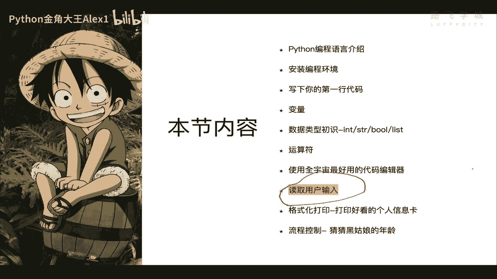
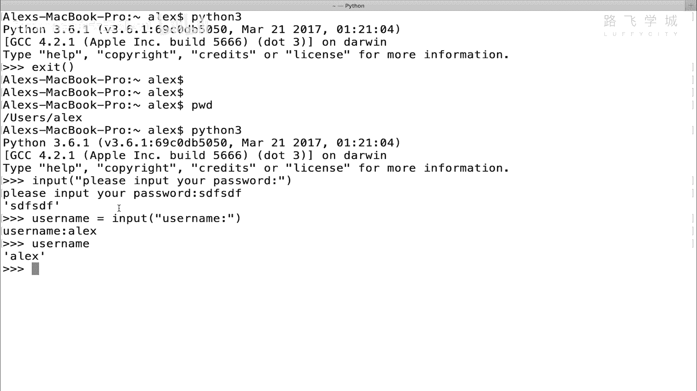
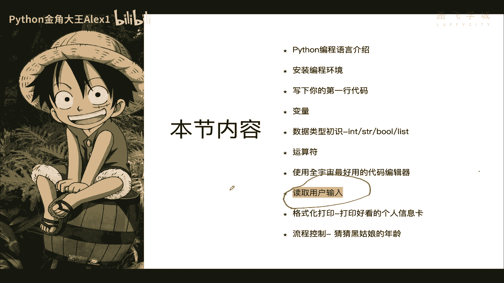
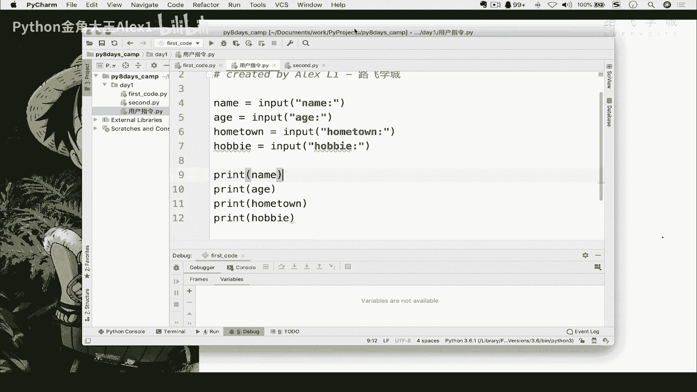
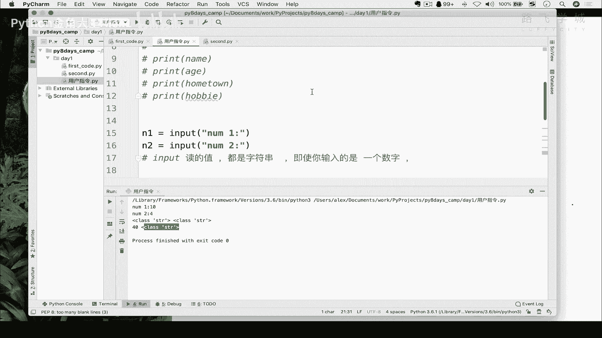

# 【2024年Python】8小时学会Excel数据分析、挖掘、清洗、可视化从入门到项目实战（完整版）学会可做项目 - P14：13 读取用户指令 - Python金角大王Alex1 - BV1gE421V7HF

OK同学们，这节课呢咱们来学啊，读取用户的输入，为什么要读取用户输入呢，那大家想你在这个网站上对吧，有的时候让你输入用户名密码，对不对啊，然后并且比如说有些网站让你填个人信息。

这这都是这都是要求你输入东西对吧，咱们现在呢还没有学这个网页开发对吧，就在网站上去输入东西，但是呢我们是可以在咱们的这个什么呀啊，这种这种这个叫命令行的格式，来去进行输入的啊。

这个是在这个叫什么呀，在这个下面进行这个输入是可以的，好吧，咱们呢先来学一下，怎么在命令行上读取用户的输入，OK那呃很简单，读取用户输入的这个指令就叫input指令，input ok吧。

那一个括号它是一个函数，然后呢你这个里面是可以写东西的，里面可以写，就是你你给用户提示对吧，place啊，Input your password，比如说行不行啊，诶你可以给他提示。

然后你一回车看他是不是就要求你输入东西了，对吧，这就是你输入的东西看到没有，你输入完之后，他给你打印出来，对不对，你想把它输入的东西给他存下来，比如说你真的就要求他输入密用户名密码，你是不是存下来。

他输入了之后，你要判断他输的是不是对，是不是啊，那你存下来怎么存呢，你就可以在这里user name等于一个，是不是啊，直接给它赋个变量，对不对啊，这个username对不对啊，让他去让他去这个啊。

输入对吧，就提示了ALEX，然后呢这个时候你的user name这个变量里面就有了，大家看是不是超级简单对吧，哎超级简单诶，继续读取用户输入，那这样我们可以这样，我们可以给它就是写一个小程序。

让它输入他的个人基本信息。

然后最后再打印出来好不好，OK那咱们怎么弄呢，来试一下啊。

我咱们已经装了pyx了，是吧，我们就在咱们的拍charm里面来去做这个东西。

好吧，我创建一个啊文件，这个文件就是啊这个用户指令是吧，读取用户指令，然后呢在这里直接让他输入个人的name对吧，个人的name，然后input啊这个name，然后输入它的edge。

输入它的这个hometown，你的老家，还有你的爱好，hobby是吧，是你的爱好，咱们就来吧，这个hobby好吧，OK然后最终我们sorry，最终我们把这些东西给它打印出来，对不对。

把把他这个name打印出来啊，这个edge打印出来，hometown打印出来对吧啊，再把这个hobby打印出来行不行啊，哎先让它输入。

再进行这个打印，OK吧，打印啊，那啊同学说说这种波浪线是不是代表有错，而不会代表有错，只要不是红的波浪线，就不是代表有错啊，这个是代表你写的这个不够规范啊，可能你这个单词的拼写不对，但没关系。

都不会报错啊，咱不管咱就直接执行了，右单击啊，执行对不对，哎你看他就让你提示输入了是吧，我输入我的ALEX，然后我的age是25岁，然后hometown是山东出中文也是可以的，OK吧啊是我的我的爱好。

我爱好，那肯定是喜欢钱和姑娘啊，特别坦诚，对不对，你看是不是就把这些东西给你打印出来了，OK吧，超级简单好，那这个这个就是读取用户输入，那现在呢唉我们可不可以这样，我们出一个小题对吧，让用户输入啊。

输入两个数对吧，输入两个数，然后最后相乘可不可以呀，比如说呃就把这个相乘的结果给他算出来，行不行，哎可以可以可以good，那咱们在这里啊给它先注释掉，选中啊，CTRL加问号是吧，都给它注释掉了。

然后我们就在下面写，让他先输入一个啊NN1吧，对吧啊，Input n1，然后等于一个，number1是吧，然后再给他输一个number2是吧，然后呢输入完之后，我给它让它俩相乘，对不对。

这个呃这个这个这个这个这个这个呃，直接相乘吧，直接把它相乘的结果打印出来吧，行吧，N2对不对啊，还有同学，这这这有什么好说的，这不超级简单吗，特别简单没错，我就想试一下行不行啊，10×1个六行吧。

大家看正常应该是打印个60，但实际报错了，这就是我想给大家看的啊，他说什么呢，他说这个can can not multiply multiply相乘啊，Sequence by non int，什么意思。

就是说它没有办法去相乘两个，就是非int嘛，非int类型，非int相乘的话，两个数相乘，你是不是得int，那呃这个就是就得数字，但是你说咱们之前学字符串的时候，说字符串其实也可以相乘。

比如说让一个字符串乘以啊，乘以五，就是打印五次，对不对，但是你这个问题是说你注意了，你这两个它它现在显示的是两个都是字符串，你哎咱输的不是数字吗，怎么是字符串呢，注意了啊，对呀对呀对呀。

我输的不是数字吗，怎么是字符串，注意了啊，你输的是数字，但是它到底有没有把它当成数字来处理，我们来看一下，我们来看一下，咱还记得怎么去看那个啊，这个这个这个这个这个变量的类型吗，变量类型吗，数据类型吗。

是不是用那个什么呀，type对不对啊，type打印一下N1对吧，再打印一下N2对吧，可以直接逗号啊，打印N2，这个时候我们来看一下这两个数据的类型好吧，看看是不是数字输入一个十，输入一个四是吧。

大家来看你说的这两个值都是STRSTR，OK同学们这个通过这个现象，我就告诉你了，说怎么讲，为什么报错啊，因为两个字符串肯定不能相乘，一个字符串和一个数字可以相乘，打印多少次对吧，两个字符串没法相乘啊。

乘什么呀，对不对，所以它会报错了，那为什么它这里是STR，明明我说的是数字，记住一句话啊对吧，input读的值啊，都是字符串，能理解意思吗，input读的值都是字符串，无论你无即时。

你输入的是一个数字啊，它也会把它当做字符串来处理，能理解吗，相当于你输的是一个十，它在这个十里面给你加上引号了，能理解这意思吧，好这个现象要知道啊，这是input，好吧，那有的同学说了。

我现在就是要让这两个数字进行相乘，那可怎么办，那可怎么办，很简单啊，教给大家一个新的知识点，那你是不是可以做一个事儿啊对吧，就是把你的把你的这个字符串转成数字，转成数字，因为我刚才输的这个十。

它明明是就是一个数字，只不过他给我加上了一个引号，变成了字符串，但其实它是一个数字，对不对，所以呢我想干嘛呢，我可以把这个长得像数字的东西对吧，给它转成数字，那怎么去转成数字呢，也很简单啊。

也很简单对吧，怎么减呢，怎么转呢，直接是SSTR，注意了啊，Sorry sorry，Int int，你现在是一个字符串是吧，我是直接给他int一下，把它括起来，看到没有注意了。

你这么int一下给它括起来，这一个N1就转成数字了，转成数字了，那N2当然也要这么干啊，N2当然也要干，你要对N2也要这么干，大家看这样的话就变成了两个数字，明白这意思吗，你再相乘的时候就没有问题了。

十啊四大家看是不是就没问题了，OK吧，哎所以呢这个把字符串转成数字的方法叫int，相当于这是你的方法，对不对，这里面是一个字符串的形式，然后转回来对吧，转回来是什么呢啊。

这个数字转int你可能已经猜到了对吧，怎么转呢，就是STR，然后把你的这个int比如说十对不对，转成一个字符串，转成一个字符串，比如说我在这里，现在打印出来这个40肯定一个数字的形式，对不对。

数字的形式我给你可以给你一个N3，是不是先复制一个N3啊，哦sorry，N3N3N三好，这个这个代码都要顶行写啊，刚才有空格不行啊，你看他就报错了是吧，不要问为什么现在还没到那个地步啊。

就就就顶行写就行了啊，点划线，然后我们print n3啊，现在它是一个呃数字的形式，对不对，我们还可以给他print s t r n3，大家来看一下啊，来来看一下啊，应该看起来是没什么区别的对吧。

看上去因为他这个打印的时候，它不它没有这个引号对吧，所以看上去的话都是一样，但是我我打印这个type的话，再给它加一个括号，加一层括号，你看一下它应该就已经是注意了，它应该就已经是这个什么呀。

就已经是这个字符串形式了，大家看啊，是不是一个字符串形式啊，对吧啊，这就相当于把字符串再给他转成int，也是可以的啊，学了一个知识啊，互相就是转换啊，数字和字符串之间的转换，但是啊你这个转换只能是对吧。

他确实长得像数字，对不对，你在这里转了一个结果，他妈你转了一个这个这个这个这个这个这个什，么对吧，ALEX啊对吧，这种是肯定不行的，因为它是字符串，它怎么转也转不成数字，这种是不行的，OK吗OK吗。

所以注意啊，只能转类似这样的好吧，这个就是咱们的啊这个读取用户指令啊，大家自己试一下啊。

