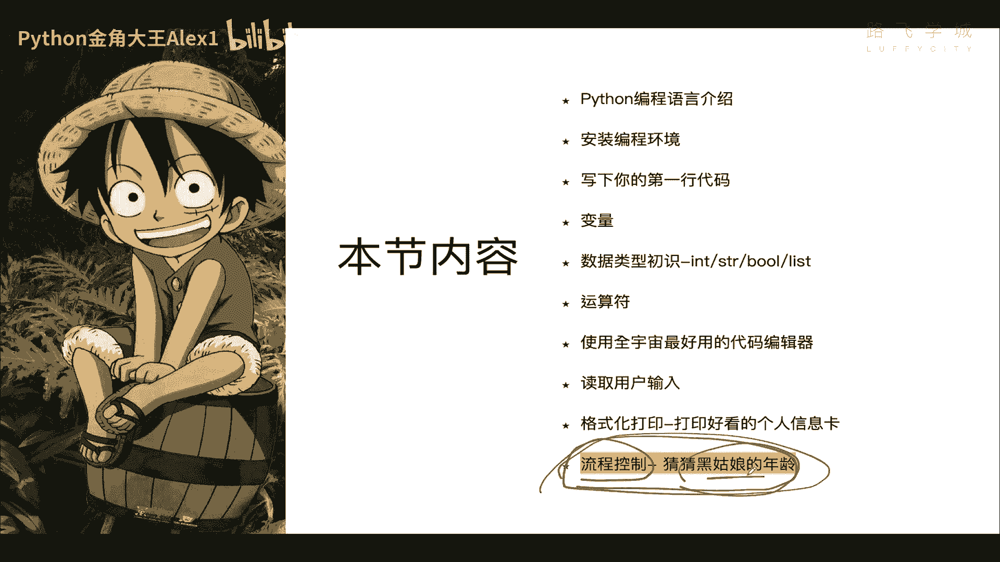
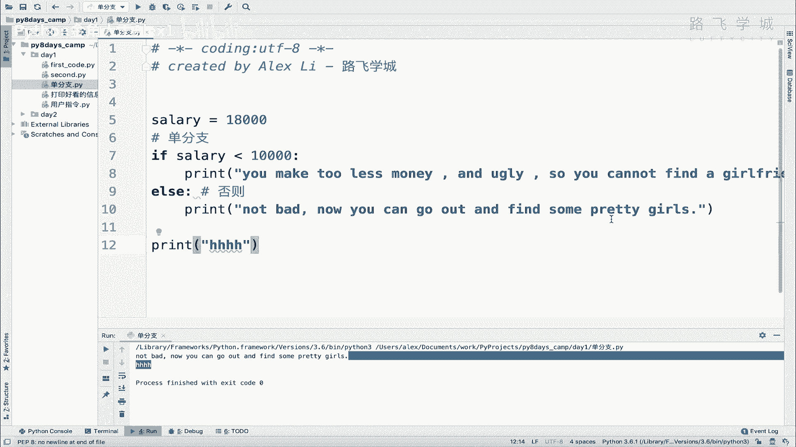

# 【2024年Python】8小时学会Excel数据分析、挖掘、清洗、可视化从入门到项目实战（完整版）学会可做项目 - P16：15 流程控制-if...else - Python金角大王Alex1 - BV1gE421V7HF

OK同学们，接下来进入咱们今天最后一小节的内容，叫做流程控制好吧，学完了这个流程控制呢，你就可以啊写一些有意思的程序了，比如说来猜一猜黑姑娘的年龄，这个黑姑娘啊是我弟弟银角大王，我是金角大王。

我我弟弟银角大王的媳妇儿啊对吧，咱们猜一猜他的年龄好。

那咱们来看一下，首先看一下什么叫流程控制啊，那先看这张图，这张图呢是一个啊两分岔口对吧，那假如这里是你，对不对，我问你你要走哪条路对吧，你走哪条路呢，你肯定会进行一些啊思维上逻辑的判断。

比如说啊假如说这是通向成功之路对吧，你要判断你肯定判断哪条路径，哪条路好走是吧，这都是你的条件唉，当条件满足之后，你就决定诶我要走这条路吧，或者走这条路，是不是，这个是人现实生活中的判断，那在程序里。

电脑里我们要想实现这样的判断怎么做呢，其实是一样的啊，你只需要先预先定义好一些条件，定义好条件，然后去判断你的条件满足与否，如果满足对吧，满足哪个条件就走哪条路就可以了，OK吗，这个东西就叫做流程控制。

就叫做流程控制吗，那在所有几乎所有的语言里，流程控制的语法都是高度一致的啊，就是什么就是什么呢，就是if else，没有if else，if是如果的意思，else是否则的意思。

在各个语言里基本上都是这样的，语法判断说如果满足这个条件，我就走这个，否则我就走这个，明白吗，这个就叫流程，这个就是if else的那么一个啊，这个流程控制语法，那按照这个分类，流程控制可以分为啊。

在计算机里可以分为单分支，双分支和多分支对吧，那缩进线不用管，那单分支是指什么，这里只有一条路啊，忽略左边只有一条路，我可以决定我走或者不走，满足条件我就走，不满足我就坐在这等着混吃等死啊。

这是单分支啊对吧，只有只有一个走或不走，那双分支是什么，双分支这两条路对吧，满足条件走这条路，不满足我走这条路，这叫双分子是吧，你有两条路径可以选好多分支，就是有多条路径可以选，就是简单啊。

就是按路径的多少来决定对吧，单双动好吗，咱们接下来就来看一下这个语法。

其实非常简单啊，非常简单，这个语法呢就在这，首先if语句，这是if这个语句，然后呢后面就是你的条件公式啊，你的条件公式，然后中间加一个，这里加一个顿号，这个顿号就代表你条件的结束，你在这里把条件写完。

后面加一个顿号啊，结束了结束之后呢，后面这里直接写，你如果买就注意了这个条件如果为真啊，这个条件如果为真，就走下面这段代码，OK吧，满足条件后执行的代码，我按照这个啊语法的逻辑，我写了一个真实的代码。

真实代码啊，就是输入判断工资对吧，如果你的工资大家看，如果你的工资啊，这个什么呀，等于8000对吧，这是我预设好的，然后呢这个条件是什么呀，判断工资是不是小于1万啊，如果你小于1万，在一线城市。

我就告诉你挣的太少了啊，找不着对象对吧，就执行这段代码，大家看这里这个顿号啊，还是这句话是固定语法，带代码逻辑还没结束，下面缩进的这个代码都是这个条件啊，就不要看这个了，你看这个顿号你就是什么呢。

这个就是代表你公式，你的你sorry，你这个你这个你这个条件就写在这里，你一个碰到顿号了，就代表你条件写完了吧，然后回车注意了，这里有四个空格，四个空格这个东西叫缩进，缩进是必须要有的。

缩进是代表什么呢，代表我下面这段代码是上面这个条件的子代码，也就是条件成立，我就执行我这个子代码条件不成立，我就不执行对吧，代表它是它的子代码啊，如果你没有缩进，那这两个代码这两行是同一级别的。

这两行就同一级别没有归属关系，你有了缩进，代表这个代码是属于它的，明白这意思吗，后面缩进我们会再强调啊，先大概知道，然后呢哎这就是你满足条件执行的语句啊，执行就这样好吧，这个就是单分支。

咱们来自己写一下好吧，自己写一下啊，Salary，我等一个，比如说啊8000是吧，然后if salary判断如果小于一个1万对吧，这是北京的生存线是吧，我就回车说你这个挣得太少了，对吧啊。

You make to less money，对不对啊是吧，and ugly对不对，and ugly就是你太丑，so you cannot是吧，Find a girlfriend，对不对啊。

girlfriend好，那这个就是咱们的啊，英文版好吧，你这样一直行，注意了，同志们又单击一执行，你说你看他就打印了，为什么，因为你这个salary确实是小于8000，所以这个这个这个整个条件是成立的。

对不对，整个条件成立，它就执行了，那如果我把这里改成1万8，对不对，1万8诶，那这个呃这个虽然也不算太高，但是呢也能满足生存了对吧，所以我们执行大家看他就不会打印这个了，不会打印这个了，明白吗。

OK这个就是单分之一，也就是说它它就只有一条路对吧，就是说我选择走或者不走是吧，条件不满足我就不走这条，注意了，那你这里那时候有同学说我不走条件不满足，不走这个。

那么下面呢如果你下面想让它执行其他的代码，注意了，把这个回执就缩进，不要再有缩进了啊，直接在这里写啊，打印一个，注意了，同志们，甭管这个条件满足不满足，这句话都会走啊，你看现在条件不满足，这句话也走。

这个条件，如果满足了对吧啊如果满足了，他也会走对吧，因为什么呢，因为这句话跟上面这个条件没任何关系，刚才讲过了，这是这个条件的子代码对吧，有缩进在这啊，它是它的子代码，也就是说他俩是归属关系。

明白吗啊这个这个这个所以他俩会互相影响，但是但是这个和这个没有级别，就是归属关系，所以他俩是互相不不相干的，所以这个条件跟他没关系，明白这意思吗哈，全靠缩进控制的，OK窗口缩进控制的啊。

这个就是咱们的单分支好吗，那同志们单分支讲完了之后，单分支讲完了之后，我们可以顺手就把多分支双分支也给他讲了，双分支是什么呢，双分支就是说直接是加一个else，直接加一个else，在这里注意了。

直接在这里加一个else，看到没有哎，也就是说如果这个条件满足，我就走这里，否则追了，否则看到没有啊，这是否则的意思嘛对吧，学过英文都知道，否则我就走这个对吧，这也要有缩进，否则就说啊，你看啊。

如果你不小于1万，就是你挣的比1万多啊，大于，那就是说嗯这个啊对吧，这个这个这个这个not bad啊，对吧啊，不错啊，Now you can you can you can go out。

You can go out and find some，对吧啊，pretty girls是啊，找一些漂亮姑娘了，OK吗，这个就是如果否则的意思对吧，这个东西就叫双分支，对不对啊，双分支，然后注意啊。

还是这里你这个在下面就是就是怎么讲，你你这个条件无论怎么样啊，满足与不满足是吧，它都不会影响下面这个不应出现下面这个啊，然后另外再强调一个这个双分支就会出现一个，要不然走这个。

要不然走这个就这两条路肯定会走一个对吧，因为它就是如就是如果否则的这个这个关系嘛，对吧，所以你看我这里是小于8000，他会走这个小于1万，他是走这个对吧，挣得太少了，我改成1万8，大家来看。

他就会走这个对吧，不能理解这意思吗，这个就叫双分支好不好，哎你们自己理解了这个意思之后，不要照抄我的，自己默写一遍，看看能不能写出来，OK下一条就要给大家讲。

