# 【2024年Python】8小时学会Excel数据分析、挖掘、清洗、可视化从入门到项目实战（完整版）学会可做项目 - P20：01 for循环 - Python金角大王Alex1 - BV1gE421V7HF

Hello，同学们大家好，欢迎进入咱们第二天的学习，那我希望咱们这个呃整个的学习呢，是一个目标驱动的，所以咱们今天第二天啊，整个的一个目标，就是说开发一个年会抽奖的程序是吧。

你们公司年会他在那个大屏幕上不都有抽奖吗，你们那个领导一按按钮夸夸夸出来很多照片，类似那种对吧，最终谁得了奖啊，这个啊咱们做一个类似这样的一个程序对吧，这是我们的目标啊，那个这样的话咱学起来会比较有趣。

有这个目标在这好吧，OK啊，看一下今天的这些内容啊，主要那涉及到循环循环的各种知识啊，各种循环，然后有几个练习啊，打印乘法表，打印摇号小程序，最后咱们再再再来做这个抽奖的程序好吧。

先从这个for循环开始讲啊，for循环开始讲，那先呃回到先说一个问题啊，先说一个问题再说循环之前，咱们在上一节上，就是昨天在学那个叫呃猜年龄的时候，你会发现啊，甭管你是多分支也好对吧，双分支也好。

你只能猜一次对吧，也就是说你输入一个数字，然后对就是对不对，就是不对，然后程序就结束了，那呃黑姑娘的年龄她26岁，你你很难一次性就猜中的，对不对，那所以你可能要猜很多次，那猜很多次的话。

那你就要不断的重新启动你的这个。

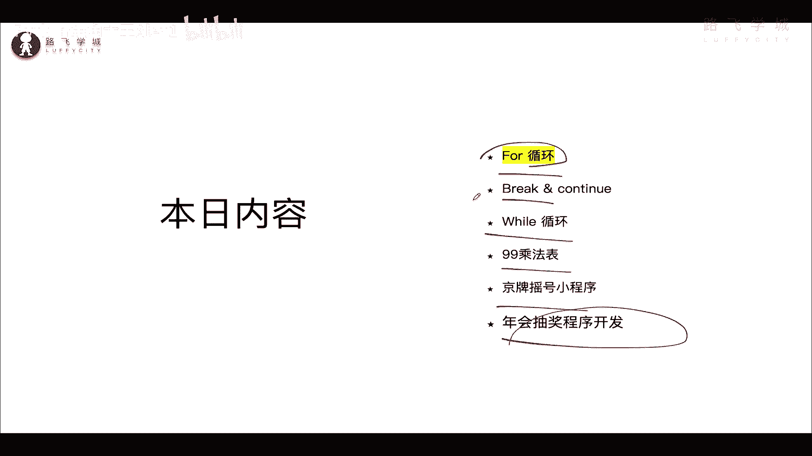

重新启动你的这个程序，对不对啊，启动一次猜一次。

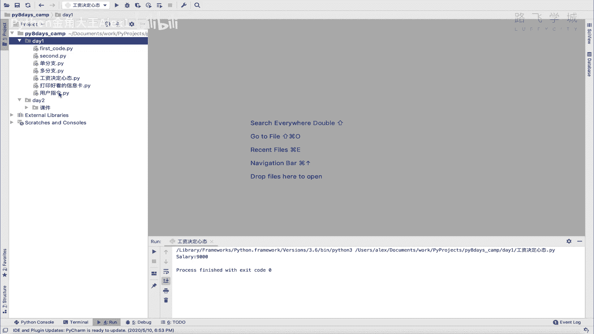

启动一次猜一次，那所以这个东西就啊怎么讲就比较麻烦嘛对吧，你这个医术还得重新启动啊，能不能让它循环的去猜，能不能让他循环的起来，可以比如说允许我猜三次对吧，如果猜不对再退出好吧。

那这就是要学到的一个知识。

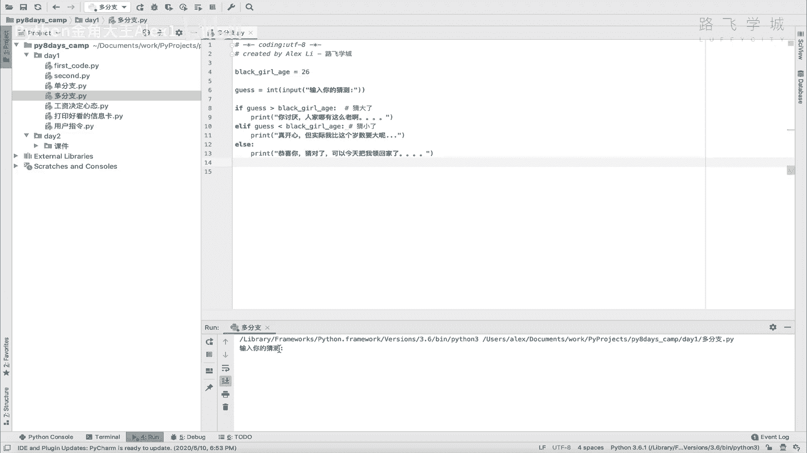

用到我们的循环好吧，那咱们先来看一下血循环的这个语法，不用看左边，直接看右边啊，这是一个循环的一个语法啊，它叫for啊，for对吧，唉为什么叫for，不知道它就叫for这标准语法for AI这个先不说。

看for i in这个看到没有for什么什么in，这是它的固定语法，看到没有for什么in啊，就像if什么什么什么样，然后I呢是一个临时变量，临时变量干嘛用的呢，看这个range10。

这个range10其实就是说从0~10啊，从0~10的那么一个数字区间，从0~10的数字区间，也就是说我要循环从零打印到十，看着我要循环从零打印到十，然后每一次打印把。

比如说这是第一次循环或者第二次循环，走到哪次循环，比如走走到第二次循环，我就拿这个值，然后赋予它作为临时变量，所以I是一个临时变量，每次循环这个I的值都会变，都会变，明白吗啊都会变啊。

从这个区间里面拿一个值，每次循环拿一个值给JY，每次循环哪一个值Y，然后呢啊打这种，这下面就是你的条件下面执行的这个数据嘛，想干嘛干嘛，我这打印了这个I，所以你会发现它会从零直接打印到九，注意了。

他是打印从0~10的区间，这个什么呢，包含零，但不包含十，也就是说从0~10就是到九级结束了，明白这个意思吧，啊这个是range时的一个语法好吗，那range时我在这里告诉你，其实它就相当于是一个列表。

它其实就是一个列表，它其实就是一个列表啊，我可以给你来啊，怎么讲，试一下啊，试一下。

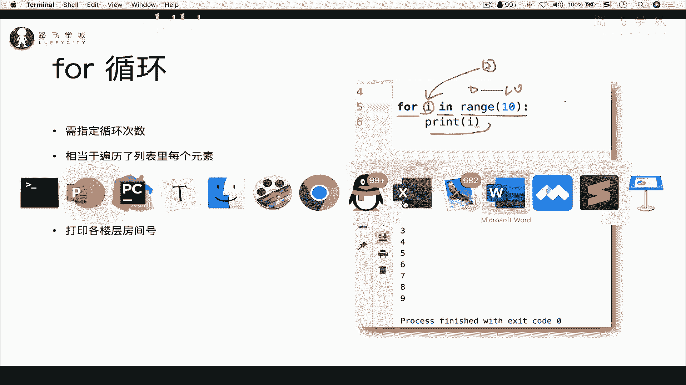

他怎么出不来出不来出不来啊，在这里吧也没问题啊，大家来看啊，这个润子时，啊你这样看他是看不出来的啊，你要看它就是一个从0~10的两个数嘛对吧，其实呢它是一它就是一个列表，你把它变成一个list。

是可以把它变成一个列表的啊，list这个语法就把它变成一个列表，这个啊就一块学了吧，历史这个语法就可以把这个数据变成一个列表，你看是不是就是一个列表啊，从0~10的区间啊，它就不包括十啊。

这个叫什么顾头不顾尾是吧，先就是包含这个从零的这个开始，但不包括尾部，这个是尾部都不顾尾，OK你看，所以我的循环其实是相当于，便利我这个列表开吧，便利我这个列表，把里面的每就每一次循环。

就打印出这个列表里的每一个元素啊，把每一个元素赋给我那个临时变量I看到没有，for i in range值看到没有，然后print i对吧啊，print i注意了，这个临时变量名字随便起啊。

反正是个变量名吧，明白吗。

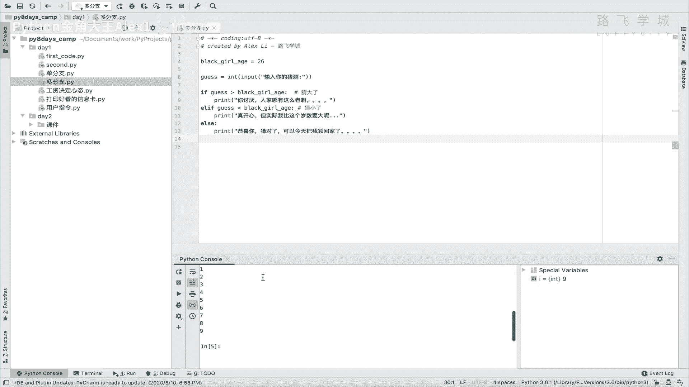

哎这个就是咱们for循环的一个语法好吧，for循环的语法对，一定要后面写一个区间，因为他这里写的就是咱们这for循环的特点，很很还很明确，就是说你必须要指定循环的次数，也就是说你一一共要循环多少次对吧。

你一共要循环多少次，这个是要指定的啊，指定的对，然后呢啊，每次循环其实相当于遍历列表里的一个元素啊。

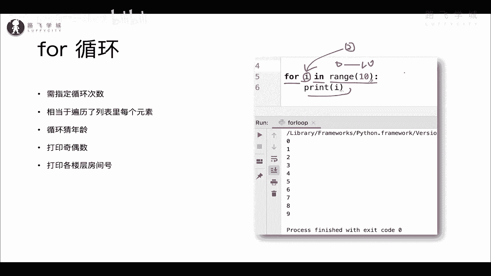

变得这边有元素好，我们再用咱们的这个啊这个什么呀。

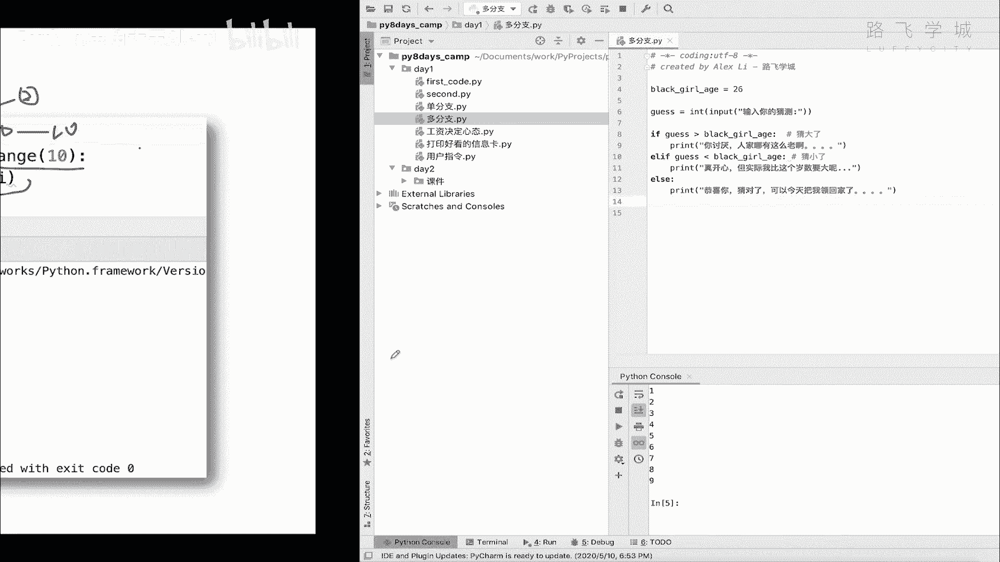

来试一下，写个代码来试一下，loop就是循环的意思对吧，咱们fly in这个range10是吧，哎这个然后打印一个I是吧，再执行一下，这个没有问题，对不对，从0~10。

然后呢呃这是这个你还你这个区间可以这样，你这个区间可以啊，比如说同你现在是从零开始，你还可以从五开始，你比如说从五开始看到没有五逗号啊，你在这里面就写五逗号，然后呢他就从五开始了，看到没有，哎。

这是循环的一个基本语法好吧，那了解了这个剧本语法之后，我们就可以把咱们的那个什么呀，猜年龄的那个啊给他来实现了，猜年龄那个时间就是让他循环猜，比如说最多只能猜三次好不好。

咱们可以先把我的这个猜年龄给他copy过来啊。

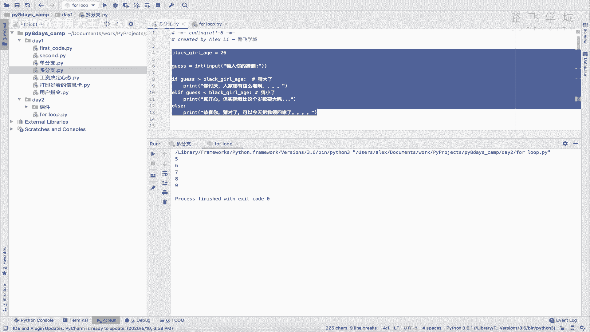

放到这里，大家先来看一下啊，看一下我这里让它循环猜三次，看到没有，循环猜三次，咱们把这个for循环写到哪呢，for循环写到哪呢，有同学哎，咱们是不是可以写到这啊，写到这。

比如说FA in这个range啊，三可以吧。

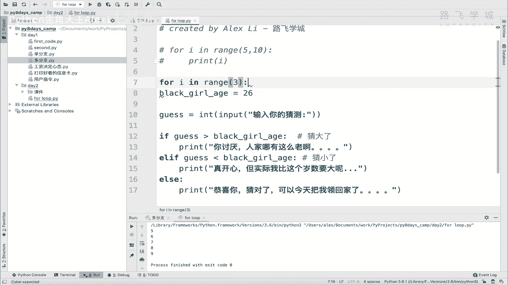

然后注意了要有缩进，它也是一定要有缩进的啊，缩进不光是if啊。

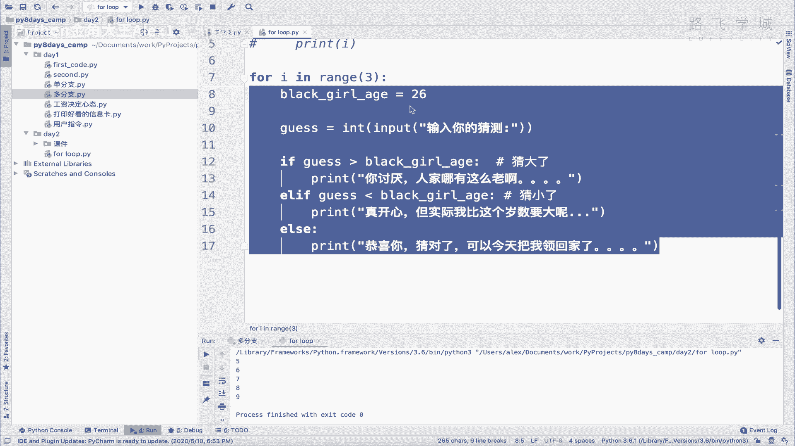

就是所有的子集代码都要缩进好吧，那其实这样就已经写完了，看到没有，已经写完了，这个呃你执行就行了对吧，它就会执行三次啊，执行三次来看，我输入一个五，输入一个六，输入一个十。

大家看是不是一共让你开了三次啊。

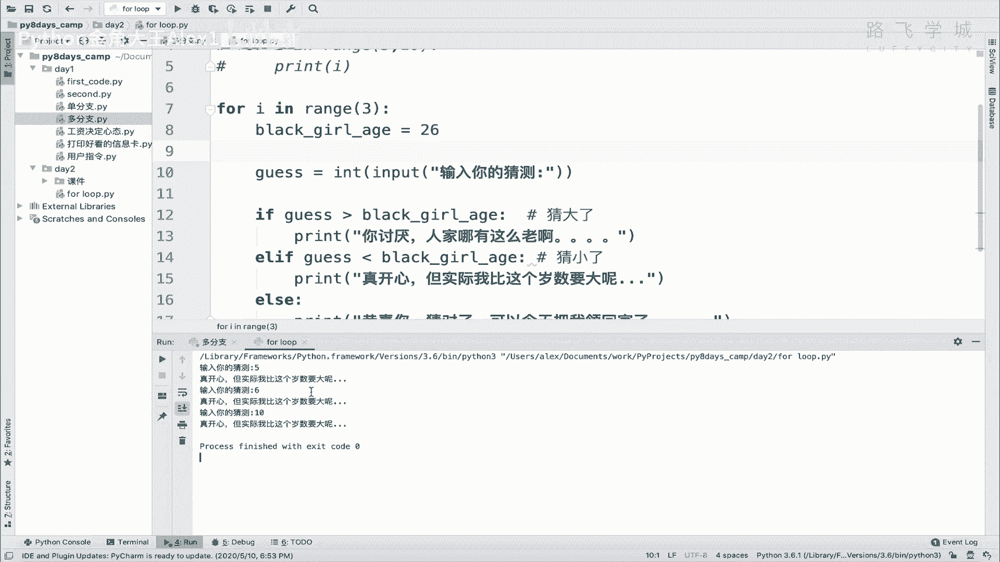

是不是一共让你开了三次啊，明白吧。

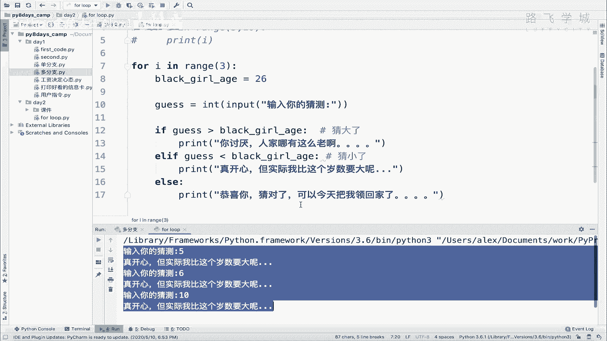

好这个就是就这就这么简单，一句话就可以实现了，循环才对吧，不用重复重复说靠谱几遍，执行好几遍，那太low了是吧，那这个时候我就问一个问题了，同志们，我们这是环直接写到这个位置是不是合适啊。

有没有咱们这个程序哪里可以优化的地方啊，有没有可以优化的地方，唉其实是有的，注意了，报警优化在哪呢，就是在这个地方，同志们啊，我们这个相当于这是定义了一个变量，就是黑姑娘的年龄啊。

他现在是把它写到循环里面了，写到循环里面呢，那相当于是什么呢，每一次循环你都执行这一堆代码，每一次循环执行这一堆代码，但是黑姑娘这个变量相当于他是已经怎么讲，就在程序一开始咱们就定义好它，它就是26岁。

你循环N遍，循环1万遍，他这个年龄还是这个样子对吧，所以其实我们没有必要在循环里面重新定义，就是让他重复的去定义这个年龄，这个年龄已经是确定好的了，所以你可以把这个年龄写到外面明白吗，写到外面看到没有。

写到外面，然后呢这样他就只需要定义一次，如果你把它写到里面，那你就要重新定义三次，它其实是消耗你的这个CP，因为你们只定义一遍命令就走一条命令，你就得操消耗CPU的这个这个这个这个操作嘛，对吧。

所以但是你，所以如果你这里是3万次或300万次，那你那你这么一句代码，就导致你的CPU多操作了300万次，至少是不是，所以大家一定要注意啊，你这个写代码的时候，要要要要要心里时刻怀有。

这就是这种优化的这种这种啊，这个心态在那里好吗，优化你的程序，OK好，这个这样的话就完美了好吧，哎有的同学说这个你看他现在猜错了啊，让我猜三次，但是我如果猜一下子就猜对了，你看我一下子就猜对了。

这个时候就没必要再猜后面两次了，所以一下子就猜对了的话，我让我的程序直接就退出，是不是就可以了，让我程序直接就退出就可以了，那怎么去退出呢，很简单，注意了啊，只要他猜对，你不要print了。

你可以把这个print直接变成一个exit，看到没有，EXIT是退出程序啊，退出程序明白吗啊，退出程序你在这里重新来一遍，看着啊，我输入一个22对吧，再输入一个26，看着看到没有程序直接就退出了。

并且把你这句话还打印出来了，对他退出的时候可以捎带一句话啊，就在这里面输入一些东西，他就把这个东西打印出来，并且是红色打印，你看对吧，好，所以这个是顺便就学了一个，退出程序的一个小功能，好不好。

那这个是for循环的语法，然后呢咱们讲完这个之后啊，讲完这个之后呢，咱们再再加一个小练习，就用for循环来实现打印奇偶数好不好，打印奇偶数，Ok，打印技术好，打印什么就打印从从0~100的奇数对吧。

咱们学过咱们学过什么呢，学过怎么去计算奇偶数，还记得吧，就是用那个取模的一个方法，是不是百分号取模，是不是就就如果是能整除对吧，都都都让他整除二嘛对吧，就是如果能整除，就代表它是偶数。

不能整除就是奇数吗，是不是，OK所以呢打印从0~100，我们就直接写for循环对吧，for i in这个range啊，有同学说我不叫I，我叫J可不可以可以啊，但是一般都都叫I啊，就习惯写法了啊。

for i把这in range100看到没写100，它就从0~100好吧，然后呢你就拿这个G相当于临时变量J，每次循环你拿这个G进行判断对吧，跟取模J取模这个谁呢，取模二对吧啊，如果能整除。

整除就是等于零，没有余数，是不是代表是偶数，你说是不是代表是偶数啊，所以我就print啊，我就咱们说的是打印他的偶数啊，从0~100的偶数啊，打印技术是一样的啊，就就就就就再去反一下就行。

那打印偶数就是这个什么呀，打印写G是，F这个什么呀，这是偶数，偶数不会写英文啊，直接这样写了可以吗，所以我们就这样就完了对吧，也就是说如果效果出我就打印，不是偶数，我就不打印，对不对。

所以奇数它就不打印了，看到没有，这就是一个单分支的程序，咱们来实现一下，大家来看一下是不是从零开始，你看是不是每个都是偶数啊，看到没有对吧，每个是不是都是偶数啊，好这个就是打印奇偶数都用到了我们的循环。

我们的循环还是很简单的，对不对，自己你呢理解了这个意思之后啊，自己把猜年龄和这个打印机，我说的自己默写一遍，看看能不能写出来。

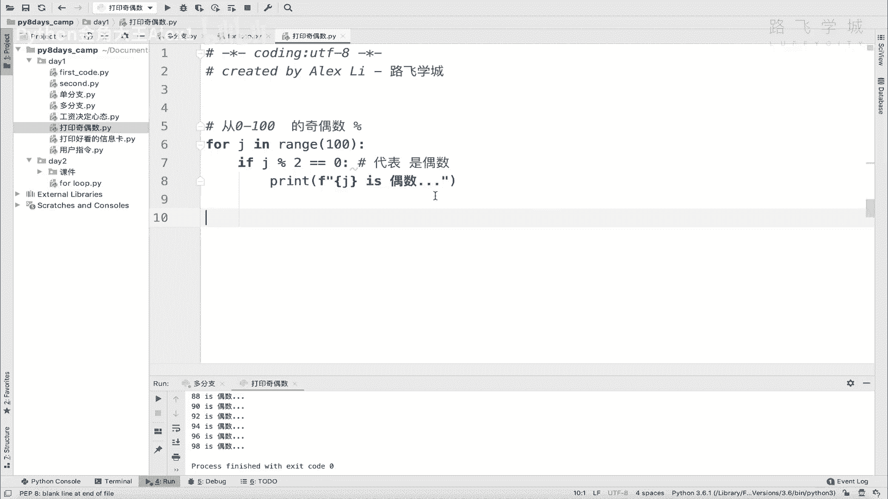