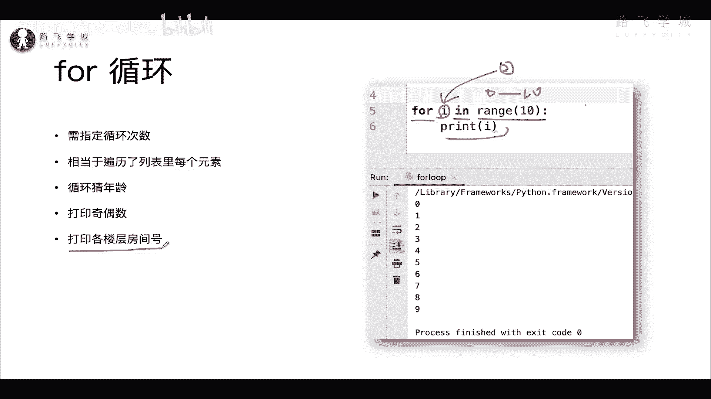
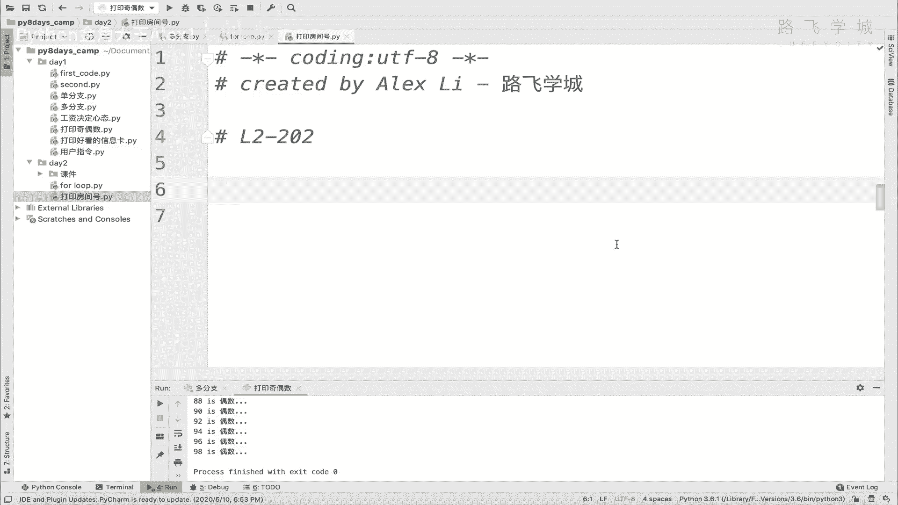
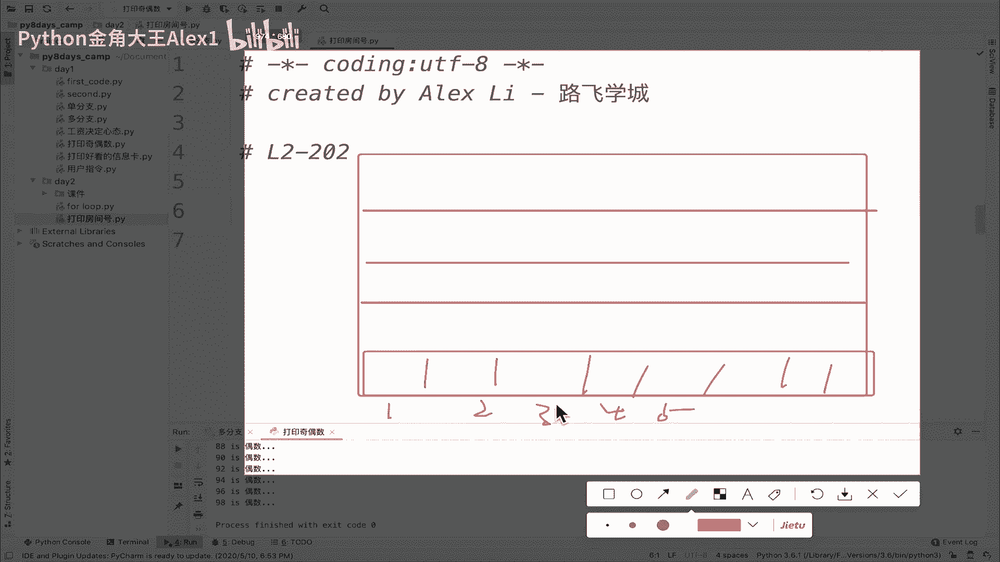
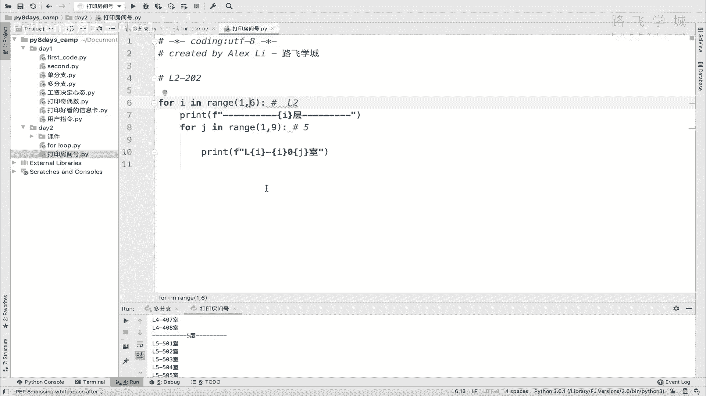

# 【2024年Python】8小时学会Excel数据分析、挖掘、清洗、可视化从入门到项目实战（完整版）学会可做项目 - P21：02 循环嵌套 - Python金角大王Alex1 - BV1gE421V7HF

OK同学们，接下来咱们实现一下这个需求，就是打印各个楼层的房间号。

什么意思呢，你看啊，我这里有一个楼，有一栋楼啊，这一栋楼呢有很多层对吧，那1234呃五层，那每一层呢又有很多房间，是不是每一层有很多房间，我现在需要的是，你把每一层的房间号依次打印出来啊。

相当于就从一层到五层，每一层的房间号都依次打印出来，假如五层一层有20个房间的话啊，比如说是二十二十个房间，那你想一想对吧，那就是每一层要打印20次，还有能理解意思吧，哎他是这么一个需求，这么一个需求。

那具体打印了一个格式呢，打印了一个格式呢，咱们在这里给你啊，看一下打印楼啊，打印房间号啊，你打印的一个格式可以是这样，每一层就是每每一个房间号，你就应该这样，比如说是D啊，L几层，L2层。

然后杠5012十二三十201202吧，这就是代表二层202室对吧，这个三层呢就是这个这个这个对吧，三层就是L3，四层就是L4，明白这意思吧，OK所以这是我们的一个需求。

那现在呢我们想想用程序来实现的话怎么做啊，用程序来实现的话怎么做好吧，那我们在这里啊给大家再给他简化一下。

比如说这是我们的这个楼层，是不是啊，然后呢这是一层啊，两层三层四层五层是吧，分五层，然后呢每一层对不对，又有很多的小房间是吧，每一层哎呀sorry，每一层又有很多的小房间对吧，那现在这个问题就来了啊。

你要学你要用循环来实现它，你想想怎么做啊，你想想怎么做，OK首先肯定是得打印个啊，就肯定是五次循环，这是避免不了的，对不对，因为有五层嘛，每一层都要打印嘛，所以有首先有五个循环啊，啊五次循环。

然后同时呢每一层也有很多个小房间对吧，1234对吧，那相当于你在每一层上，好像还得继续循环才能打印，你总不能说直接写上十个print，print l01L零二L零三嘛。

那写14print那个效率太低了对吧，所以就说你这里有五层就有首先有一个大循环，大循环上要循环五次，还要每一层呢，再有一个小循环，循环十次，对不对，就把这十个房间号打印出来了。

所以呢这个就学到一个新知识，叫循环的嵌套，OK吧，循环的嵌套就是可以解决类似这样的一些问题，对吧，就是你可以大循环里再套小循环对吧，那我们比如说这些直接for i in这个range，然后呃五层对不对。

这是我们的大循环，然后呢啊我们从这个就是相当于在第一次循环，在第一层了，第一层了的话呢，那第一层还会有很多个小房间，是不是还会有很多个小房间，这一个这个这个这个这个，那所以这一层还要循环。

咱们假如说一共有啊八个房间吧对吧，那咱还是一个循环for j，这个时候不要爱了啊，for g因为你I临时变量已经被占用了，你要在这里也写I的话，他俩就会重了，就相当于你在这里刚得到一个I，这是大循环的。

然后你又把这个相当于把这个大学这边，这个I又给它改了，能理解意思吧，它会它会乱掉，所以这里不要叫i love for j吧，in这个range，然后你就是啊九对吧，从0~8嘛，相当于从九。

然后呢你就这个时候这就是两层循环，两层循环其实很简单，但注意了这就OK了，打印的时候你就在这里直接打印就可以了，为什么呢，因为你这里注意了它打印的格，每一个格式是L相当于呃先打印楼层，再打印房间号。

那每在每一个小循环里对吧，现在是在小型方面，第二假如说现在是在第二层对吧，在在L2，所以呢那你在2L2的时候，第二层的时候，你这个I应该是个二，是不是循环到第二次嘛，是个二，然后注意了。

你这个时候你这个G刚开始循环，你可能循环到第五了，所以你现在打印的应该是205，你说对不对，打印是205吧，那你怎么打印205呢，就直接很简单呀，把这个啊这个这个这个这个呃先前面写个L。

然后后面直接引入这个I，现在I因为是大循环，处在第二次循环嘛对吧，大循环相当于刚走到了第二层，然后第二层在这个一一堆小循环，是不是啊，所以呢这个I是二，然后呢这个G又走了五次。

相当于是说当前你这个小循环第二层的小循环，这正好等到了这个第五个房间号，假如说啊做针对第五的话，走到第五个房间号，明白吧，所以这是五对吧，所以这是五，所以呢你在这打印横杠，然后直接是二第二层的嗯。

再写一个A吧，因为就是二零级嘛，对不对，所以就是你这里再写一个I，然后200就是咱们规定好了，对不对，二零后面再写一个G对不对哈，是行不行，你这样一搞，同志们，你这样一搞，你看啊就OK了。

你就相当于把每一层的房间号都打印出来了，大家来看一下，看看这里是不是哦，我这从零开始的，从零开始的啊，零咱们就当是第一层吧，0101001002对吧，零零啊，然后这是对，这是第一层1200啊。

应该是应该不从零开始，应该从一开始101十102十103十，看到没有，能看到这个效果吗，这样哎这个就实现了，这样呢我们把我们把这个别从零开始，从这个从一开始打印到五层，是不是啊，所以后面要写一个六是吧。

这个地方也从一开始打印到八层是吧，咱们再来看一下，你看101是102，这是不是像咱们现实生活中的108，看到没有，到208，对不对，到308没问题吧，哎这个就是咱们的，当然我在这里可以打印个区分。

是不是啊啊在这是哪个层啊是吧，这样你就很容易的更清晰的能看出来了，看看啊，大家看是不是一层二层，三层是不是跟楼的样子一样，好吧，OK这个就是咱们的嵌套循环，我告诉你，嵌套循环以后在很多场景下都会用。

一般一般也就欠个两层，最多的时候也就欠个三层啊，欠到四层的就很少了，因为你一欠说白了嵌上四层，那你就相当于你你你就是多少它的四次方了，你就是对吧，这个这个这个多少次第一层是多少次循环。

它就是多少次方对吧，那就是比如说第一层第一次层是十的循环，那就是十的四次方了，那这个整个下去sorry要要循环很多次对吧，所以效率还是就会比较低，所以一般sorry谁在想我啊。

所以呢整个一般是两层多的时候是三层啊，以后我们在学算法的时候会经常用啊，机器学习什么里面经常会涉及到哎呀，这个这个这个克制嵌套的循环啊，你还知道这个就行了，自己理解了这个意思之后。

花5分钟把它默写出来，不要抄啊，默写出来。