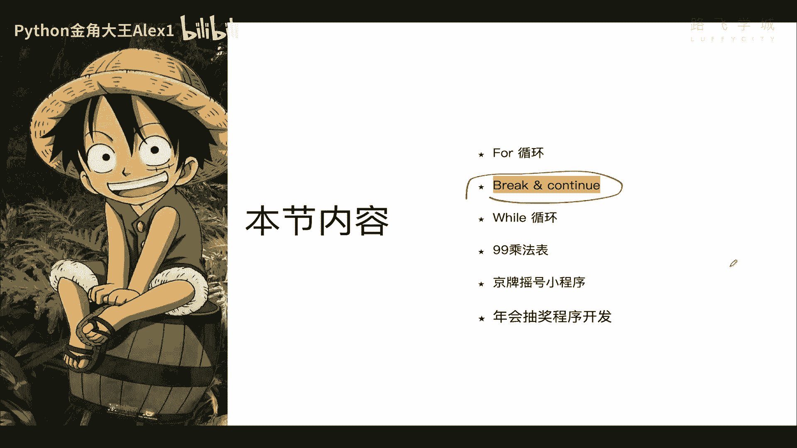
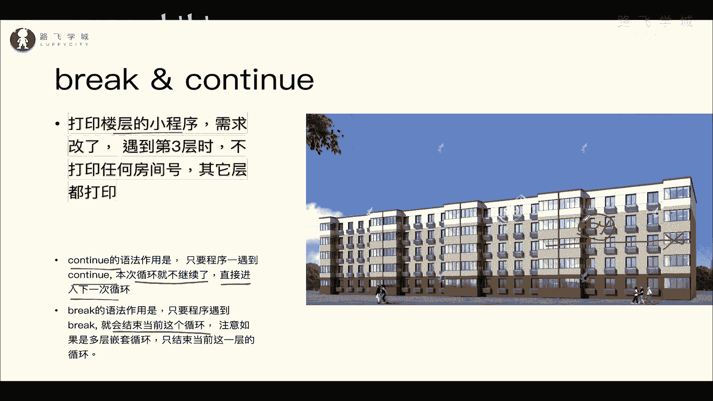
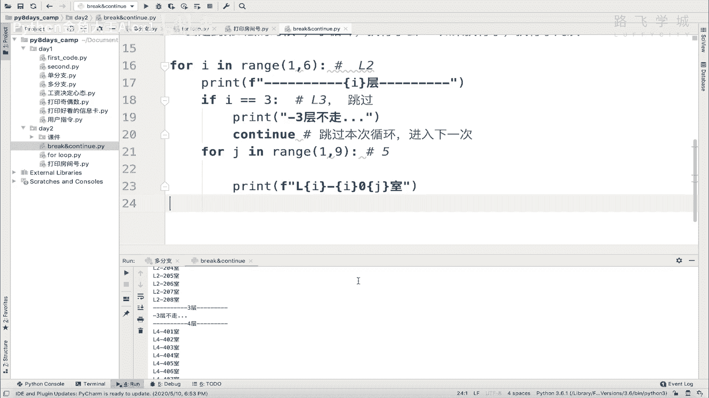
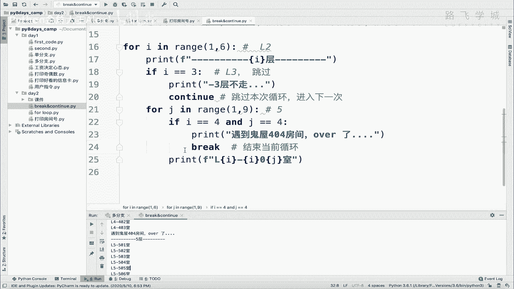
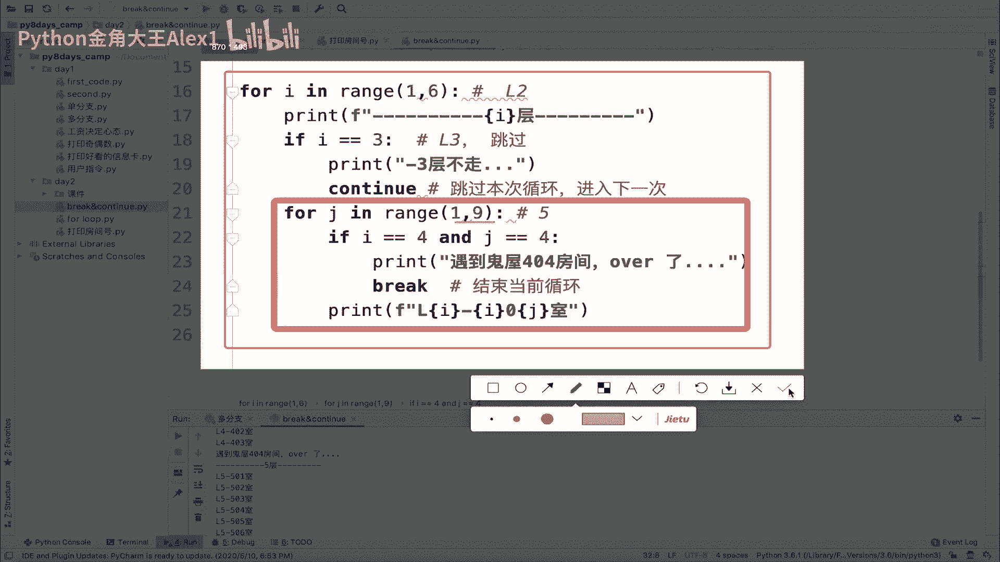
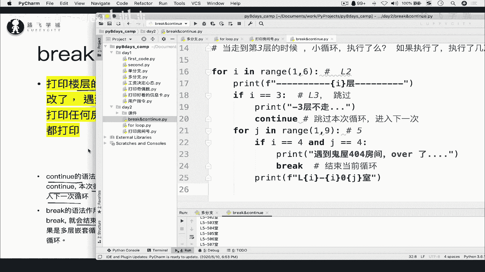
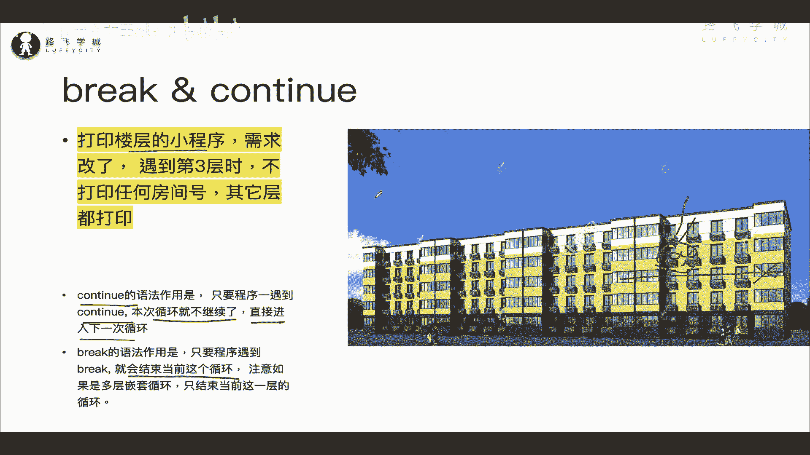
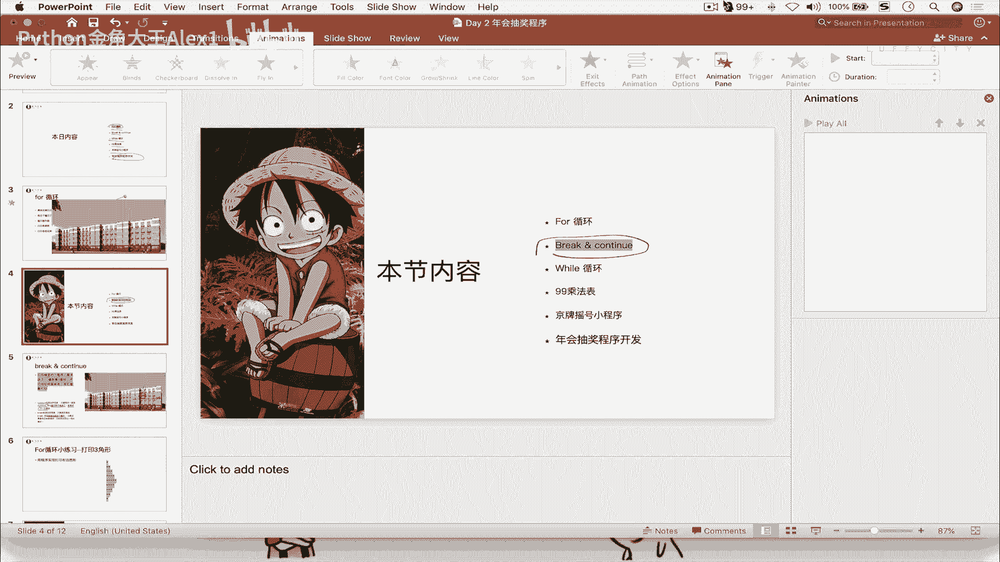

# 【2024年Python】8小时学会Excel数据分析、挖掘、清洗、可视化从入门到项目实战（完整版）学会可做项目 - P22：03 break&continue逃出鬼屋 - Python金角大王Alex1 - BV1gE421V7HF

OK同学们，接下来咱们学一个新知识叫break and continue，那他呢是只能注意了，它只能在循环里面使用，所以它不能完全小形式，它其实是跟这个循环结合的啊，它只能在循环里使用啊。

用于控制循环中的流程的啊，循环中的流程，这句话怎么理解，咱们先从咱们的需求上啊。

还是需求驱动嘛来去啊，代入这个知识点，那还是咱们这个什么呀，不用看下面的啊，就就看这个黄色的，就是说咱们这个打印楼层的这个小程序啊，他这个需求改了，现在要求呢你到了第三层之后，比如说三层啊。

他正在装修啊，正在装修不让进是吧，所以到三层呢不打印任何房间号啊，其他层都打印，什么意思啊是吧，你这个整个一个大循环对吧，走到第三的时候，诶，不好意思，进不去了，不让走了对吧，在第三层就。

然后只在这个就是就是打印三之外的其他层，明白吗，还当实现这种需求的话，你怎么来做明白吗，当实验这种需求来怎么做，这个时候我们就可以用到啊，咱们要学的break and continue这个知识点啊。

那先来看一下知识点的这个作用啊，直接看作用吧，首先呢continue这个语法就那么一个关键词啊，叫continue continue，什么意思是继续的意思对吧，它只要程序一遇到continue，注意了。

本次循环就不继续了，直接进入下一次循环，也就是说假如说你看你这个循环走到第三层了，那第三层呢，然后你在这里写了一个，假如说你在这里写了一个continue，这个循环也就这一层就不走了，不走了。

直接进入下一层循环，也就走到第四，第五哎，这个就可以用continue来解决好吧，那break的意思是什么呢，break的意思就是说，只要程序遇到break就会结束当前这个循环啊，注意了。

他是要结束当前这个循环，比如说他怎么来回跳啊，sorry sorry sorry啊。

注意了它怎么叫啊，这个结束当前这个循环，也就是说假如你在第四层的时候，假如你在第四层的时候注意了啊，你在这里夸写了一个，比如说走到房间号第404啊，咱们这个计算机里一直说，404是一个找不到嘛，对不对。

找不到这么一个状态码对吧，OK说404是一个鬼屋好吧，只要一遇到鬼屋啊，你这个程序就被鬼杀死了，所以也就是说这个程序就继续不了了，你在这里写了一个break，好循环就结束了。

就跳出了后面的这些房间不会打印，五层也不会打印，能理解意思吗，所以这是break continue continue是直接跳过这一次循环，进入下一次break是直接退出程序好吗。

那我们来用啊这个呃代码来实现一下。

Ok，rick and continue好吧，然后呢还是我们打印楼层的一个小程序，咱们给它copy过来，咱现在要求的是先学continue吧，我走到第三层的时候，同志们，我走到第三层的时候干嘛呢。

这个嗯就不打印了啊，如果是第三层，我就不打印了，所以你在这个地方，你在这里啊，你一定要做一个判断对吧，判断如果谁是三呢，也就是23的话，我就干嘛呀，直接进入了一个考题，可以在这里面，可以在这里啊。

如果A啊对，直接在这地方I等于一个三，看到没有，这是不是代表第三层啊是吧，代表是在L3，那这个时候呢直接跳过，对不对，跳过，所以如果I等于三，你就直接在这里直接打印，在这里continue。

你直接在这里打印CTRL就没问题，这就会你就会发现导致一个结果，他根本就不会打印这句话，因为continue就会导致这个循环干嘛呢，导致这个循环就是啊就是进行了下一次看到没。

它会导致里侧里面这个循环注意了，导致里面这个循环啊，你比如说当时走到五了，对不对啊，当时走到啊，你你现在这个G就底层的这个子循环走到五了，它不相当于他这个五就不会，就是就是五就不会走了。

就会继续跳到下一次，再跳到下一次对吧，所以啊还是那句话啊，你在这写个TU下面不会走，他会直接进行下一次循环，进行下一次循环能理解意思吗，OK好那我们来试验一下好不好啊，我执行一下，大家来看一下。

你看第一层，第二层，第三层，第四层，第五层，对不对，你明显你这个第三层里没有打印任何东西是吧，OK好这个就是continue的作用啊，这个叫什么啊，改成了跳过本次循环啊，进入下一次。

哎那现在我问大家一个问题，也就是说我问大家一个问题，你看这里确实什么也没打印，那我问你这里面这个小循环，在当当走到第三层的时候，这里面的小循环执行了吗，如果执行了没有，如果执行了，执行了几次啊。

这是问题啊，当对吧，走到第三层的时候，小循环执行了吗对吧，如果执行了啊，如果执行了执行了几次，你猜一下，你猜一下，OK有些同学说没执行，你看确实是没执行，对不对，看上去效果就没执行是吧。

哎那有的同学说是执行了，为什么说执行了呢，啊为什么说执行了，你看啊，首先你这个程序对不对，就是在第三层的时候，这个依然进入了这个小循环，进入小循环，只不过在这里判断对不对，判断。

然后只不过是continue，所以它会干嘛呢，在这个G假如说第一次，第一次这个小循环的时候，这是一嘛对吧，在这是一的时候，我一看哎是continue，我就不往下走了，我就进入了G2对吧，就第二次小循环。

第三次小循环，第四次循环，所以我是走了，只不过没有打印，明白这意思吗，OK这是另一种同学说，咱们到底咱们看一下到底谁说的对呢，啊谁说的对呢，是说完全没走的，说的对，还是说走的说的对啊，其实很简单。

我跟你讲，这都不用实验，你思考一个事儿，如果这里面的小循环根本就没走的话，那这个continue根本就走不到啊，对不对，他根本就不会执行判断啊，所以这个小循环是走了，只不过你没打印任何东西。

走到这就结束了，走到这就结束了对吧，一次次的，所以呢我们当然让那些不信邪的同学验证一下，我们很简单，在这里写一个东西吗，或者我们在这里写一个东西都可以啊，对吧，对不对啊，print随便打对吧。

随便写一个东西就行了，你会发现他这个小循环打印了八次，这个这个这个杠大家看是不是啊，其实这个小循环是走了，只不过啊这个这个对吧，没打印这一句，OK这个是你把continue写在这。

那这个地方其实会带来一个问题，咱们已经明确收获了啊，明确收获了是吧，三层是完全不用打印的，都不用走了，但是你实际的情况是说三层他还是走了一遍，走了一遍，只不过没打印，这其实会带来一个问题。

如果现实生活中，咱这个三层真的楼梯都已经封了，他根本就没有办法去检测里面的每个房间，他都不知道里面有多少个房间对吧，我其他层可能就都是八个房间，我三层就是给你弄出来15个，你管得了吗，对不对。

所以在第三层的时候，它完全应该都不能走，就直接注意了，直接就是跳过了，明白我意思吧，所以呢啊像咱们这个情况，其实并只不过是表现在形式上，它是没有打印，但是实际上他确实是走了三层对吧，因为你看。

所以呢如果想让他真正的完全不走三层，那怎么实现呢，咱们把这段代码先给他，这个怎么起来啊，放在这吧，啊完全真正不走三层的话其实也很简单，同志们，你只需要你别把continue放在这儿。

你别把continue放在这，知道吗，你你你直接在这个第二第一层循环，这个地方判断就可以了，你只要判断它是三，你就不用走这个for循环了呀，对不对，你直接在这判断就可以啊，对吗，你直接在这里判断。

如果23对吧，你在这里直接就continue对吧，然后打印一个三层不走是吧，你看相当于他就不会，他就不会走下面这段了对吧，他就直接走到第四层去了，是不是啊，所以把这个continue拿出来。

你就省掉了好多次的操作对吧，好好多次CPU的操作，对不对，大家来看一下，你看是不是三层没走对吧，实际上就是三层没走的话，然后就直接走四层了，你三层的每个房间这也不会再去查了，看明白这意思吗，哎这个是啊。

这个continue的一个作用啊，continue的作用跳过本次循环，进入下一次循环好吗，哎这是通过现象来给大家演示的，那接下来我们再来啊，来一个新需求，把这个break也学了啊。

这个新需求是什么呢，大家看啊，这个4044层的这个404这个房间啊，咱们说它是一个鬼屋啊，怎么讲，咱们这个程序一走到这儿，咔嚓就被这个什么呀，被这个鬼给弄死了，OK吗。

所以呢比如说鬼鬼鬼鬼给弄死了之后呢，那这一层说白了怎么讲，他就走不了了，后面的他就不会都不会打印了啊，那想实现这个怎么做啊，也就是说走到404的之后，走到404了之后啊，那我整我把这整个的一个小循环。

这一层的小循环给它断掉啊，这一行小循环断掉啊，那当然让程序继续往五层走，明白吗，比如说在第四层的4041，碰见404这个房间，整个小循环断掉，然后去走里面对吧，因为两层循环嘛。

然后外层那个循环可以让它继续走啊，相当于四层就打印到404就截止了，能理解意思吗。

好这个break这个时候就可以用上咱们的知识啊，这个break怎么用呢，你看啊，这时候你就多了一层，多了一个判断啊，上面是continue的啊，那么continue不要看着乱。

但接下来呢我们就走到第四层，走到第四层，然后并且是404房间，所以你要判断两个值，第一是I的值是第四层，第二是G的值也是四对吧，两个都是四的时候，在进行一个什么呀啊进行一个判断，那你在这里判断A。

那所以呢你就肯定是在这个底层循环了对吧，因为你两个值都判断嘛，所以要在这个啊第二层小平发力，就是if i等于一个呃，什么呀，I等于一个四，然后and g也等于一个四，是不是啊啊学过这个案子了是吧。

两个条件都成立对吧，两个条件都成立，所以它就是404，对不对，所以这个时候你打印一下啊，遇到鬼屋了啊，遇到鬼屋是吧，404房间啊对吧，over了，对不对啊，over了这个你自己就被干掉了。

OK所以呢over完了之后对吧，打印完了之后执行这个break sorry，Break break，Point，Break break，会导致什么，导致这个直接结束当前循环，OK吧。

结束当前循环不是结束当前，这一次是当前这整个循环OK吧，结束当前这整个循环啊，那同志们我们来看一下这个效果好吧，看一下这个效果来执行一下，大家看123都没问题，走到第404的时候，看是不是遇到鬼屋之后。

当前这个聚到鬼屋之后，后面的是不是就不打印了，什么405408407都没了，然后直接再跳到五层，对不对好，所以这个就叫结束当前循环，注意了，大家一定要注意通过这个嵌套循环啊，我觉得这个例子很好。

现在这里有两层循环，这样你能体现出它的区别来，它的这个作用就是说break也好，continue也好，break是跳结束当前这一个循环。

你这里现在一共有两个循环，对不对，外层循环，内层循环对不对，所以你的break是结束的什么呀，结束的是你这个加粗的这个循环，里层的这个小循环OK吗，跟外面的没关系，所以这才会导致外面那个还会打印五层。

对不对，能理解吗，OK吗，好，那你的continue呢对吧，你的continue就是说结束本次循环，或者叫跳过本次本次循环，也就是说你一个小循环里面还还要执行九次，对不对，你遇到continue了。

就是其中一次结束了对吧，就就就就不走了，再走下一次，明白这意思吗。

好这个就是咱们这个什么呀，循环的这个terry这个break and continue的作用，那这个这两个的区别啊，要记住会经常的用，我们以后会经常的用好吗，所以呢还是同样的道理啊，你你这个什么呀。

完全按照我这个需求自己把它默写出来。

注意不要抄抄，没有意义，一定要自己做出来好吗。

