# 【2024年Python】8小时学会Excel数据分析、挖掘、清洗、可视化从入门到项目实战（完整版）学会可做项目 - P24：05 while 循环 - Python金角大王Alex1 - BV1gE421V7HF

OK同学们，这一小节呢咱们来学一种新的循环，叫while循环啊，while循环呢又名死循环啊，死循环是什么意思，就是永远循环对吧。

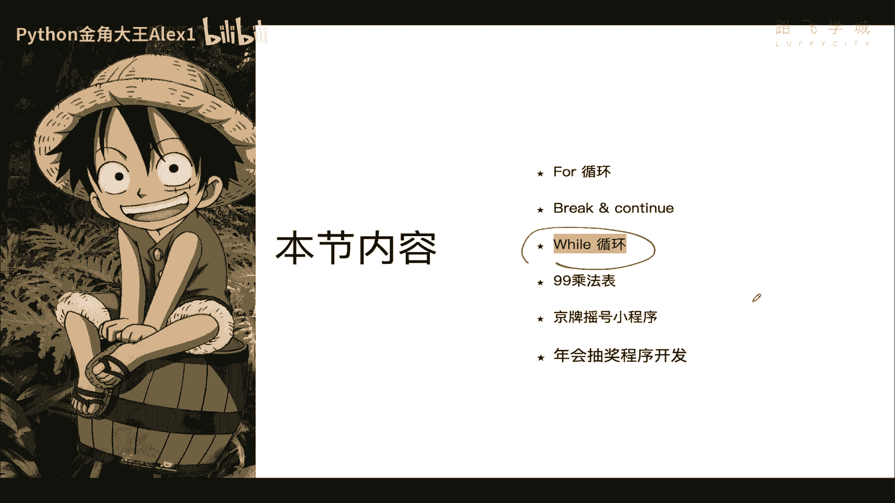

那来看一下，与for循环必须指定循环多少次不一样，for循环是不是必须指定你要循环多少次对吧，那while循环的次数是可以不定的，只要条件满足就可以永远循环下去，也就是说只要这个条件满足。

我可以循死循环，大家看这个图，就咱们的人生也是这样的，很多人很多人啊对吧，我不知道在座的同学有没有对吧，你剪这个自省一下对吧，我觉得人啊很重要的一点就是要不断的自省，你反省一下你自己现在的这个情况。

有的时候你不自省就陷入一个当局者迷啊啊，忙忙碌碌，只是是不是大量的低效工作，对吧啊，你自己这个工作有没有技术含量对吧，然后呢这个如果没技术含量，那你就浪费大量的体力，说白了你给人打工只是在出卖你的时间。

当然你做高技术含量的工作，也是在出卖你的时间，但是就是说你出卖完了之后，他会他会这些，你你在工作中经历这些东西，会变成你自己的经验，但是你比如说像送快递送外卖啊，举举例子啊，这种没有任何技术含量的。

你就送10年对吧，那那这个美团也不会因为你干了10年，给你额外涨多少钱对吧，他每涨的给你涨到一块钱，都只是对你的怜悯，而不是只是而不是你的能力所得，你明白的意思吧对吧。

所以也就是说你通过这种干的这个事情上，不能给你自身带来一个成长，所以呢你只变成了一个单纯的售卖你的时间，那这个是投入产出比非常不对等的一个什么，因为相当于别人因为没技术含量。

所以导致你的这个啊啊这个企业也不重视，你的工资肯定也不高，可能你就花个五，企业花5000块钱，六千八千最多对吧，8000块钱买你一个月的时间，也就是说你这一条命，你的一条命在这一个月里，这八个小时里。

每天的就值加起来值8000块钱，你自己算一算这个事儿，他投入产出比合适嘛对吧，哎但很多人他就陷入这种状态中，不自知是吧，你跟他说也说不清，说他自己也啊无所谓了，现在年轻人对不对，就这个阿正道还是还是小。

还是为什么，就是说少年不知愁滋味嘛对吧，但比较小的时候他没有这种任何焦虑的意识，大家想的都是因为早上八点钟的太阳，对不对，我就到12点，说白了我可以九点钟浪十点钟浪11。12点，对不对啊，都很浪是吧。

当过了中午之后，到了下午的时候，对不对，人们才开始意识到这也就是人过30了，开始意识到啊，我的时间不多了，很不是时间不多，就是说我能浪费的时间不多对吧，但是在他特别年轻的时候，你跟他说什么。

他也听不进去的，有些人他就没有什么焦虑意识，anyway啊，但是我希望在座的同学啊，大家还是那可以不断的自省，那你你如果浪费大量精力做做这种啊，没有技术含量的事情，所以呢那你把你的时间花消耗掉了。

挣售卖了一些时间挣的那点可怜的薪水，然后你也没有时间学习去成长，再把下了班刷抖音打王者是吧啊，然后那你就导致一个结果，你只能做这种低效的工作，对不对啊，就不断的送快递，不断送快递，然后就在一个低效的。

这个这个这个低价值的工作里面，陷入一个死循环啊，这就是人生的死循环，那我们程序的死循环很好破对吧，也很好写啊，人生的死循环往往很难破好吧，那咱们来还是看程序的死循环啊，看一下这个while语句的一个。

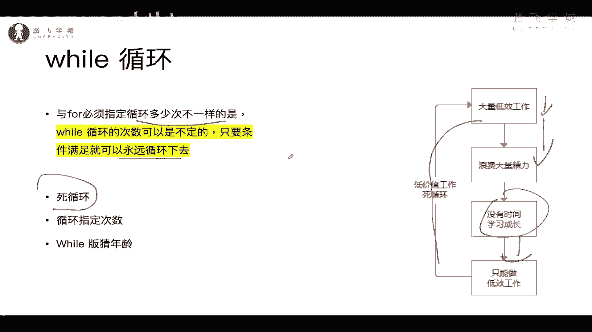

while的一个语法啊，while的一个语法诶，大家看while对吧，就是当啊，就是down的意思，while嘛，当对吧，当山峰没有棱角的时候，是不是，然后呢这个条件后面就是条件，当后面这个条件为真。

也就是当后面这个条件成立的时候，我就执行下面这段代码，明白吗，明白吗对吧，当条件成立。

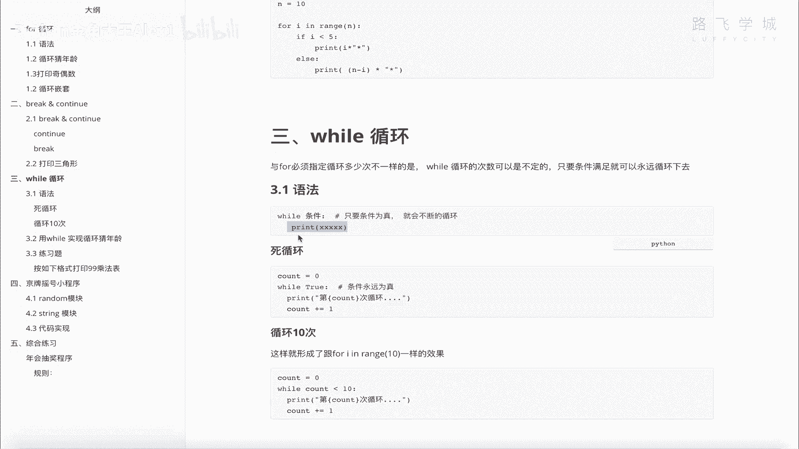

执行下面这段代码，所以呢我们就可以来写一个死循环啊，写一个死循环，当山峰没有棱角的时候，当河水不再流，当天地万物日夜不分，当哒哒啦啦啦啦啦啦，我还是不能和你分手，不能和你分手，你的温柔是我今生最大的。

就很累是吧，这里这个不由自主啊，情不自禁，While ok，咱们设一个循环，这个说的是这个条件为真，是不是什么叫真true，本身是不是真true，就是真，对不对，所以一看到while true，注意了。

死循环就来了，这就是一个叫dead loop对吧，死循环啊，在死循环里你可以干任何事情，你可以print，咱们在这里可以加一个啊，加一个count计数器啊，开始从零开始。

每循环一次count加加等于一个一，可以吧，然后呢，这个时候我就打印，对不对啊，这是D这是第多少次循环，好不好啊对吧，河水不再会给加上一个f sorry，那同志们，死循环就写完了，能理解这个代码逻辑吗。

当条件为真，我就不断地执行这段代码，大家看到的一个就是永无止境的，看到没有，一下子执行了好多万次，要是我每分钟挣一块钱，这么按这个速度往下降，那就太开心了，我已经一个亿了。

快啊1000多万两千多万了是吧，200多万啊，那同志们，这个就是死循环啊，它一会儿就就就就就就就能循环出好多来，你只要不停止它啊，不停止它好，这个在有些就是我们以后做开发的呀。

慢慢你就会遇到有些场景你就必须写死循环啊，对吧，所以现在我先不给你介绍场景，先知道这个东西就行了，那同志们，这是永远循环，然后说了是不是我也可以给他指定结束条件啊。

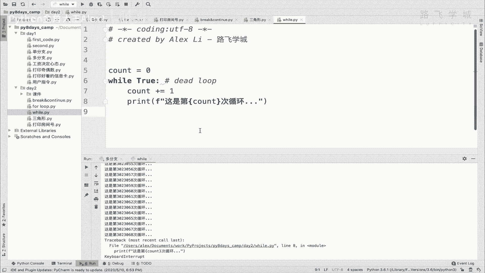

指定结束条件，比如说我只让它循环多少次，对不对，只能循环，只让它循环十次。

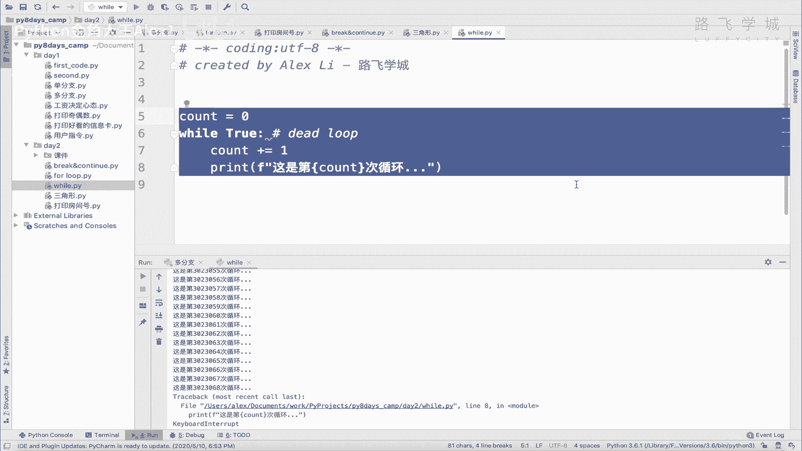

可不可以，可以吧，那还可以啊，我们就直接依然是这个，我把它变成，如果你想让它只循环十次的话，那就让它循环十次，那你就要让这个条件啊，不能永远为真，是不是啊啊，怎么能不能让他不愿不不永远为真的。

你可以这样，你现在count是不是每次都加一，每次循环加一啊，你可以判断count count的值啊，count值当这个count小于个十的时候，小于小于等于一个十的时候，注意了，同志们看着啊。

当count小于等于十的时候，我就走这段代码，这个条件对吧，它是有限制的，是小于等于一个十，那你这个count又在不断的加一，每循环一次加一，每循环一次加一，对不对，也就循环到十次的时候。

count已经等于十了，count等于一个十的时候啊，他俩还能成立一次，因为他俩小于等于嘛对吧，如果count再下次循环count等于11的时候，他已经这个条件就不成立，不成立，这段代码就不执行了。

所以这是说白了啊，就是也达到了像for循环的一个效果，对不对。

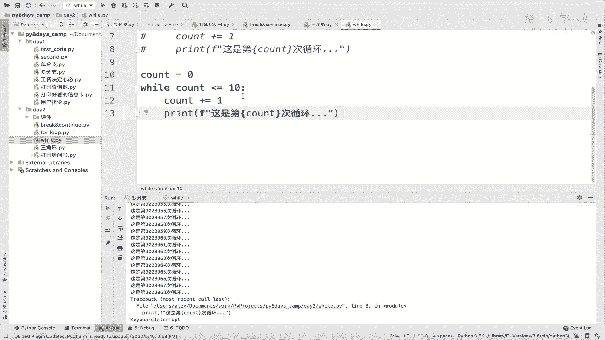

可以限制次数啊，同志们，咱们来看是不是你看从1~11啊。

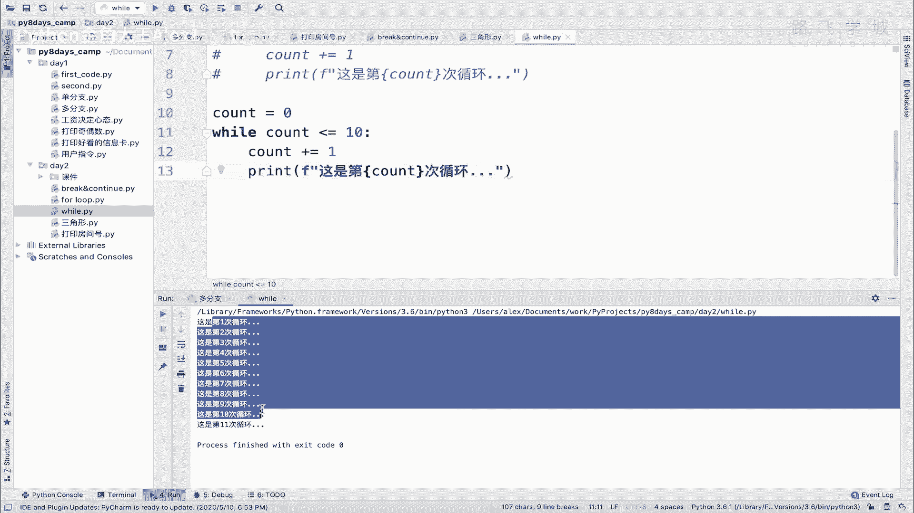

打印了11次循环啊，你把这个等于号去掉就行了，它就是14了对吧，是不是就一共十次循环呀，这是限制了循环的次数。

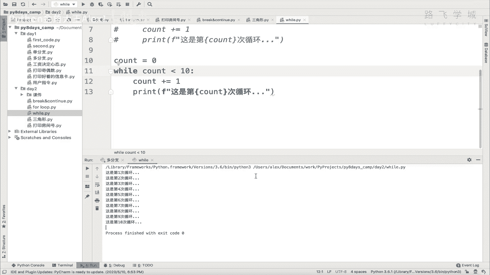

OK吗啊限制了循环的次数，哎那啊这个没问题了，之后，接下来我们再来做一个就是什么呀，啊while版的一个财年龄。

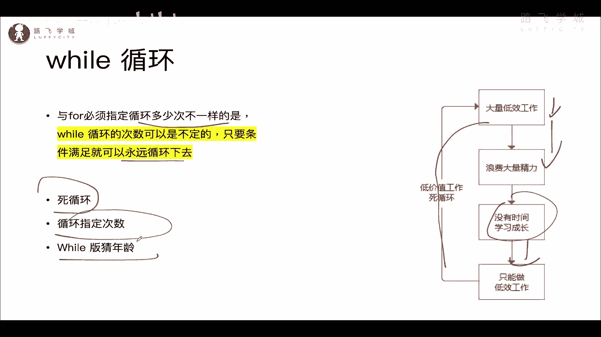

while a版的一个财年龄对吧，也就是说我也能让他只猜个什么呀。

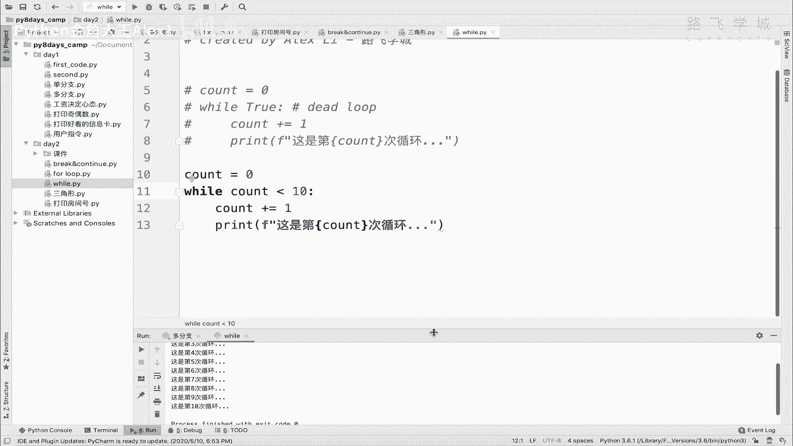

三次可以吧，只猜个三次，咱们来看一下，while猜年龄，后掌口感会OK。

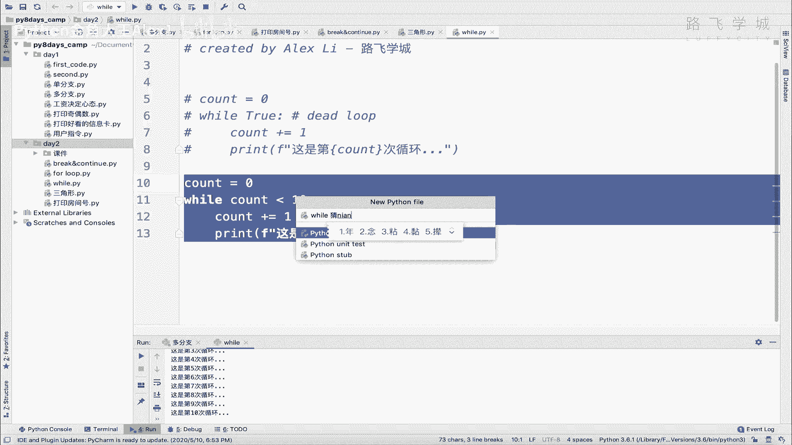

然后呢我们把我们那个猜年龄那个拿过来好吧，还有这个。

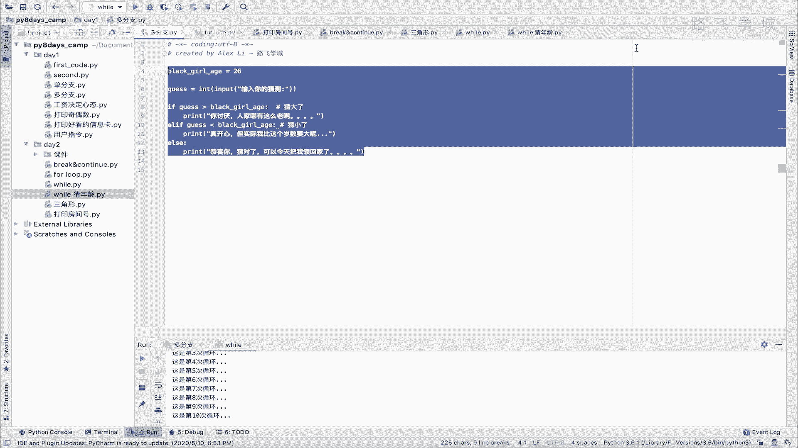

然后呢其实跟咱们的for循环差不太多，在这里写这个是吧，在这里写一个while，然后你你是不是要让他猜三次啊，怎么实现三次呢，咱们搞一注意啊，拆三次，咱们要搞一个计数器，计数器搞一个变量嘛。

然不再加一嘛，咱们就把它叫计数器啊啊sorry，他这里先给它初始一个值对吧，我先声明这个变量嘛对吧，计数器就是一个计数器啊，然后呢这就是while count小于个三对吧，然后小于三之后。

你在这里每次都加一嘛是吧，alt加等于一，所以呢是从零啊，D04第一次第二次，第3012对吧，一共三次，一共三次，然后我们来执行试一下，好不好，试一下，收你的年龄二十二二十三二十五。

大家看是不是一共猜了三次，猜了三次就退出了对吧，然后呢咱们这个猜对了，退出可以不要用这个什么呀，不要用啊，exit了，就是那个退出那个程序了，因为退exit这个会导致一个问题，会导致一个问题，什么意思。

就是你这个整个程序退出了，但是如果我在这里写的对吧，下一段把后面的代码，后边的代码对吧，因为我这个程序不光一个循循环呀，我我后面还有很多其他代码的，那如果是用exit的话，它就不会执行，这里大家来看。

直接输入一个26，你会发现它后面的不执行，是不是啊，所以呢这个时候啊，因为因为程序退出了嘛，因为程序退出了，所以呢这个时候我们来可以干嘛呀，这个打印完之后，用break break会导致这个什么呀。

循环结束是不是循环结束，但是你后面的代码它依然是执行的对吧，循环外的代码，所以呢咱们再输入一个26之后，大家来看是不是你的这个代码是不是猜对了啊，sorry你这个猜对了，是不是你这个后面可以执行好。

这个就是啊，while循环，当然它里面也是可以随意的用break和continue，它的用法是跟在for循环里是一样的，明白吧，哎这个这是for循环while循环的一个区别，区别好吗。

哎自己来把这个while循环也写一下。

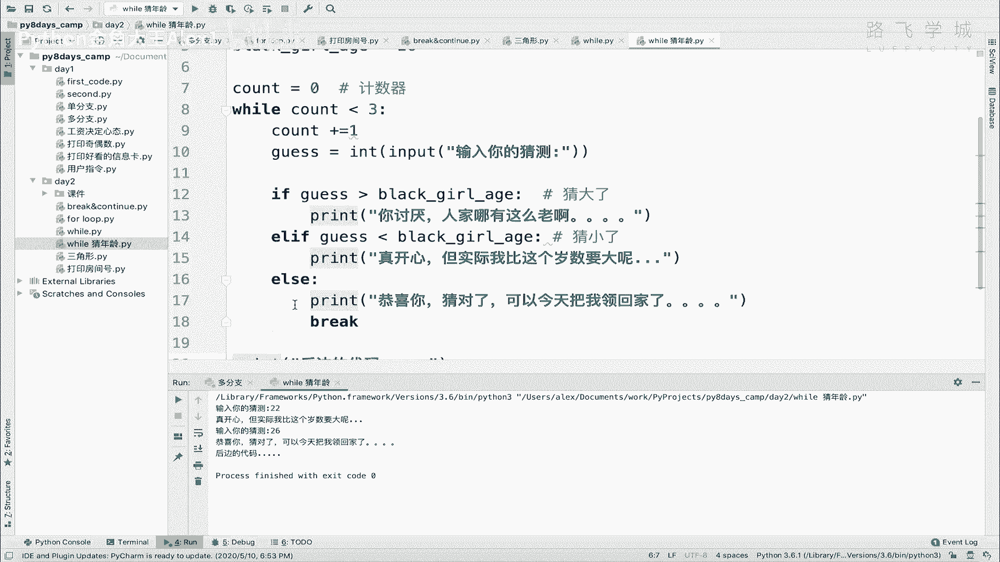