# 【2024年Python】8小时学会Excel数据分析、挖掘、清洗、可视化从入门到项目实战（完整版）学会可做项目 - P25：06 打印99乘法表 - Python金角大王Alex1 - BV1gE421V7HF

OK同学们这节课我们做一个练习题，就是学这个九九乘法表啊。

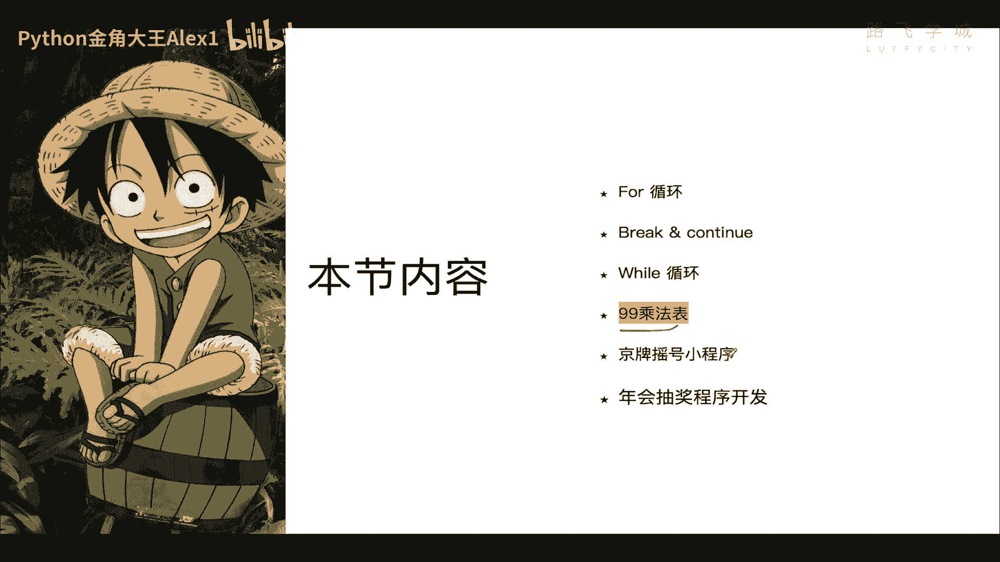

怎么做呢，就是把这个九九乘法表给我打印出来，看到没有，就打的像这个样子一样啊，那同学们咱们来看一下啊，看一下它这个规则，它的这个规则啊，首先呢它是打印了从第一行到第九行，是不是一共打印了九行。

所以它里面一定要涉及到循环对吧，然后呢就跟咱们的打印楼层一样，一层两层，三层到第九层是吧，然后呢问题是在每一层，也就是每一行的时候呢，他呢又不一样，相当于你比如说打印到第三层的时候。

它就3×1乘2×3得九，嗯对吧，那这个大循环我们会写，对不对，但是接下来还有应该还是一个小循环。

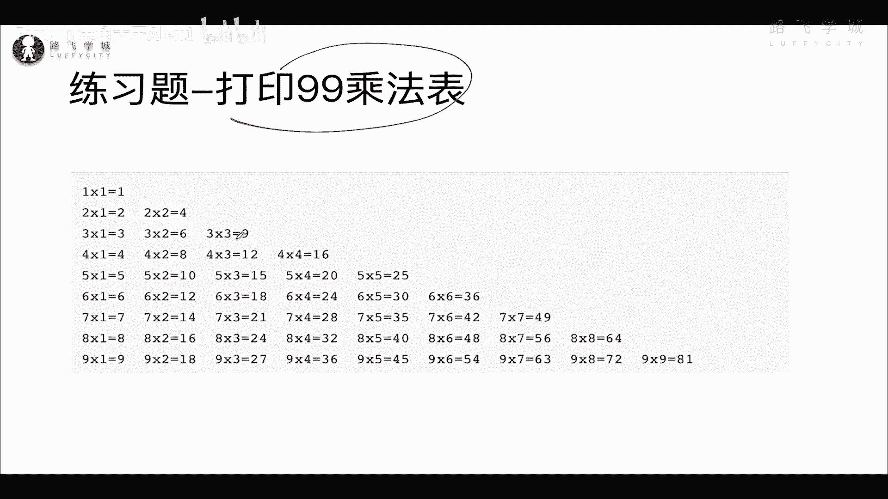

这个小循环呢还根据他跟咱们那个楼层不一样，咱们楼层是说一共五层对吧。

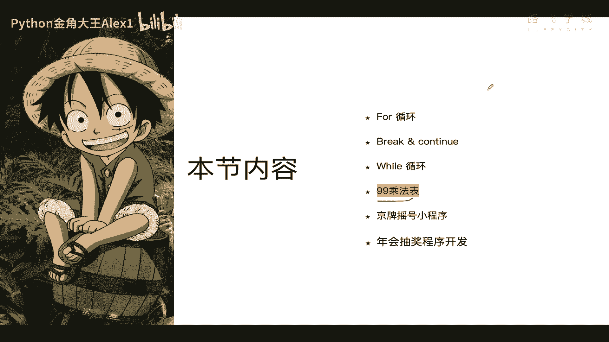

咱们学那个楼层的时候，一共五层，每层这个房间号房间数都是一样的，每层都是九间房，这个是每层对吧，你你打印到第六层就是六间房，第七层就是七间房，知道吧，哎大家想一想这个去怎么做好吧。

你呢自己在现在这个时候倒计时10分钟，看看能不能把它憋出来，思路啊，10分钟憋15分钟吧，我觉得15分钟刚开始学的话，15分钟，如果你还做不出来，你再继续往下看，你现在按暂停键好吧，我在这等着你。

屏幕面前啊，等着你，15秒开始倒计时，15分钟，好我认为你已经15分钟过去了啊，那现在你有没有想出来思路，没有思路呢，那我可能我现在接下来就要揭晓了对吧，那其实呢这个我认为啊还是呃就是挺简单啊。

第一个呢你先让他怎么讲，先让他能啊，叫叫叫干嘛呀，打印出这这么几层出来，对不对，这么几层，然后呢这肯定要遇到一个大循环对吧，用了一个大循环，然后在大循环基础上呢，在每一个小循环里在想着说。

相当于其实你看这个规律是第三层，就是第第三，第三层就是打印，就是这个小循环就是三次，第四层小循环就是四次，第五层就是五次，那有这个规律了。

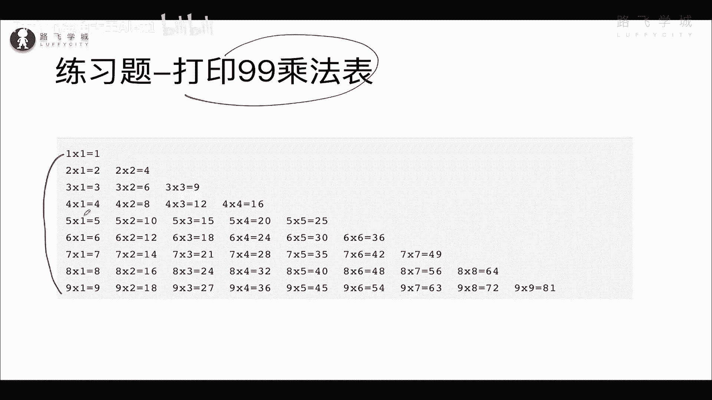

那就好弄好吧，咱们来试一下，咱们来试一下好吧，Ok，99乘法表，乘法表好吧，然后呢我们先要来一个for i in range，从1~10，是不是啊，从1~10吗，打印这个。

然后呢在里面就是呃这个应该就是一呃。

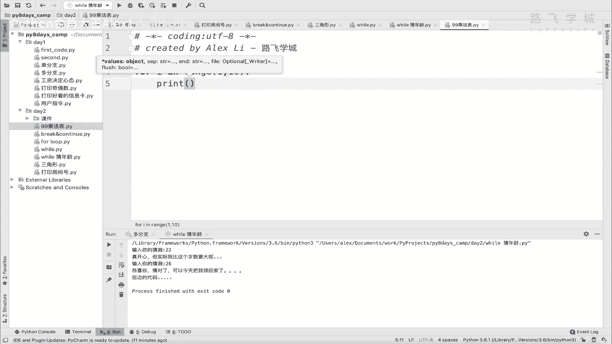

相当于咱们先试一下，从1~10打印这十次，然后每一次呢让它啊，这个1×1就是就是答案和嘴笨啊，打听一次循环就乘以一个乘一个一，先把先把这一列打印出来。

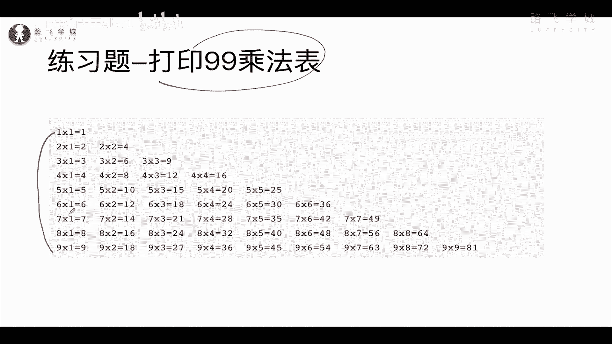

好不好，先把这一列哎，对对对，先把这一列打印出来啊，那怎么办呢，就直接是什么呀啊直接F吧，打开这个是I对吧，乘一个多少啊，乘一个1×1嘛，先写死吧，1×1对不对，然后等一个多少呢，等一个I乘一个一。

对不对，是这样吧，等一个I乘一个一，这个能理解吧，那我们一执行，大家看他是不是先把第一列给它打印出来了。

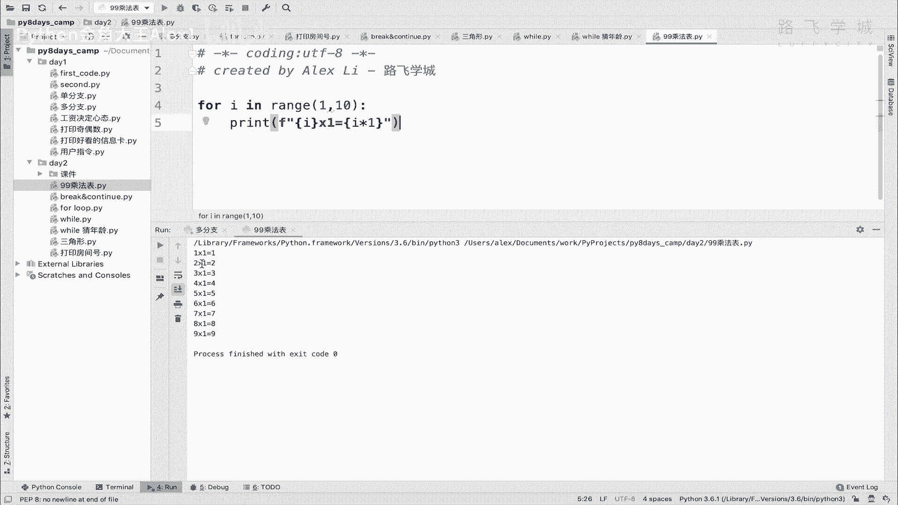

对吧，1×12乘一，3×1，对不对，9×1跟咱们这个逻辑是不是没问题啊对吧，接下来就是看第二列，第三列怎么去弄了，对不对，那这个时候一定要涉及到第二层循环了。

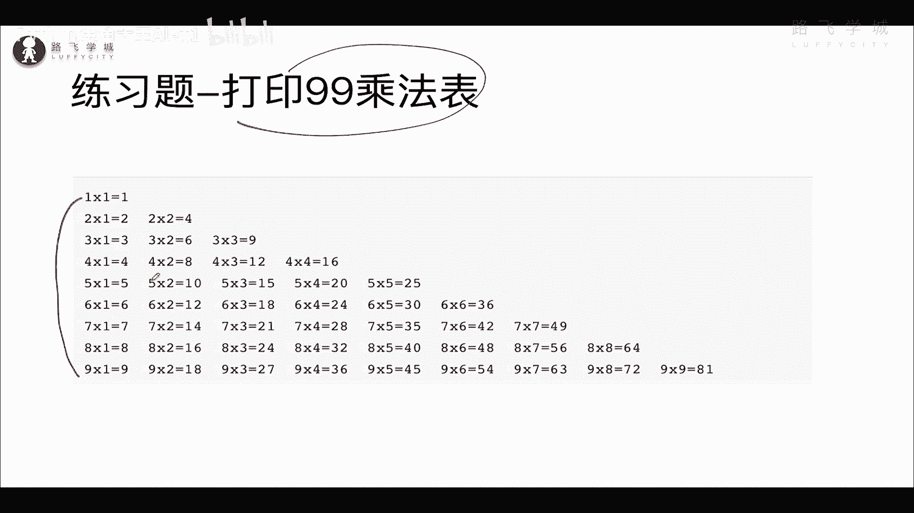

肯定是第二层循环，就是啊这就是嵌套循环了。

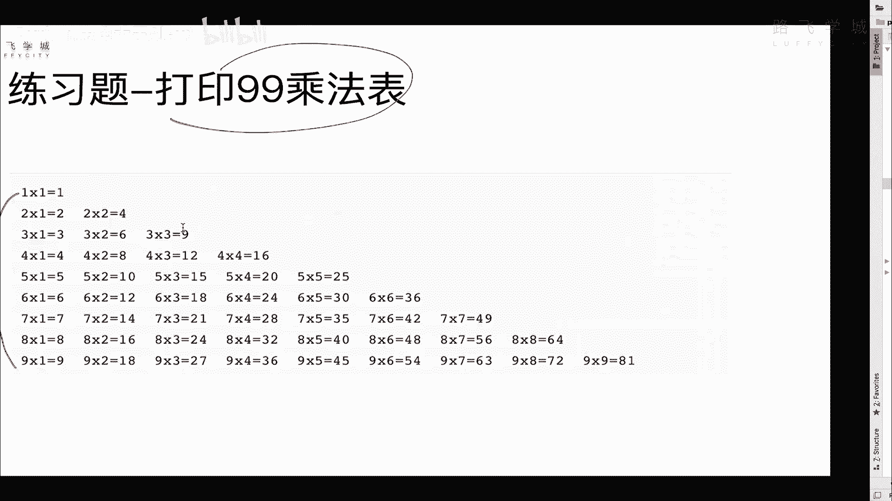

嵌套循环这里就是说你要求在第二次，这就是比如说咱们走到第三行了，走到第三行的时候，他会干嘛呀，相当于这个小循环还得走三次，是吧，再进行3×1乘2×3。

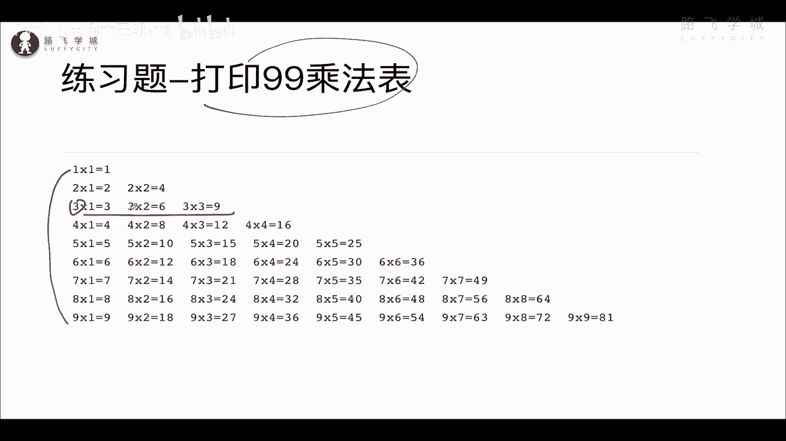

3×1乘2×3诶，问题来了，注意了，这个循环假如说已经是走到第三次了对吧，走到第三次，然后这个小循环呢也让它循环三次，小循环是不是让你循环三次，小循环怎么让它循环三次啊，同志们，很简单呀。

你直接in range i i现在是不是三，我问你爱是不是三呀对吧，那因range i不就可以了吗对吧，他不就走这个三次了吗，哦不他就走这个什么走这个这个这个这个啊，这他不就循环三次了嘛对吧。

因为你你如果I是第五，I是五的话，你这里就for i j in range5嘛，是不是啊，所以呢这个小循环也会走五次，所以咱们先看看这样打印这个G，你看看一个效果，哎同志们，大家看啊。

你看如果啊如果我这个什么呀，如果我这个啊这个这个这个叫第一次循环，第一次大循环的时候，是不是这个小循环走了一次啊，打印了一个零，第二次大循环对吧，第二次大循环这个小循环走了两次。

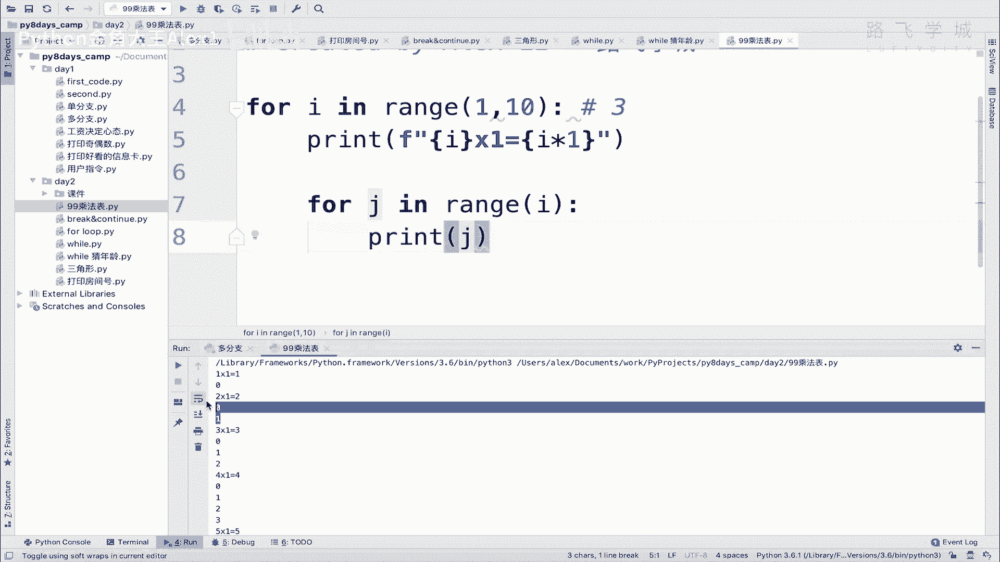

第三次大循环是不是走了三次，是不是符合我这个情况，先首先先说符合这个情况对吧，第几次走到第几层的时候，就是这个楼层走到第几层的时候对吧，第几行也就是那小循环就会走几个，对不对，走到第五层小循环就是五个。

走到第六层小循环就是六个。

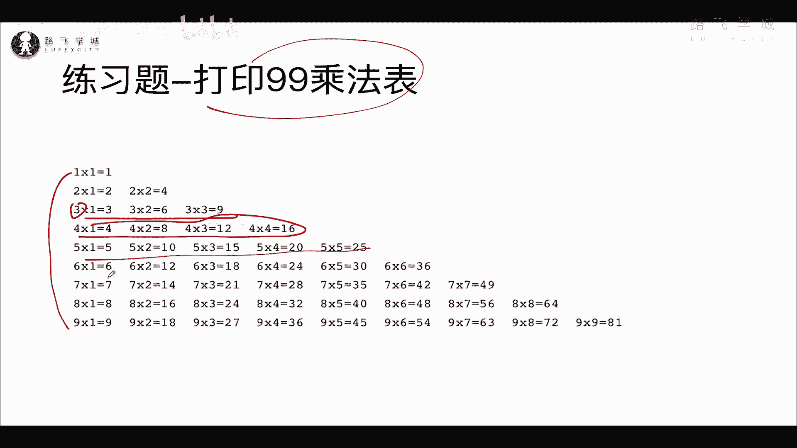

是不是这个是不是符合这个，看看走到地铁口叫循环12012345嘛，从零开始的嘛对吧，咱们可以让他从一开始嘛，从一开始怎么弄啊，直接在这里写一个一，然后呃呃因为它固守不顾尾嘛，我们在这里加一个一明白吗。

加一个一就让他因为能能能理解这个意思吧，你要是因为你要range3的话，他不会包含三对吧，你要加一个一就润，直到四它就会包含三，明白吧，所以你看再这样来一下第六次，第五次是不是12345，第六次。

123456，没错吧，哎good，所以通过这个我们就已经实现了啊。

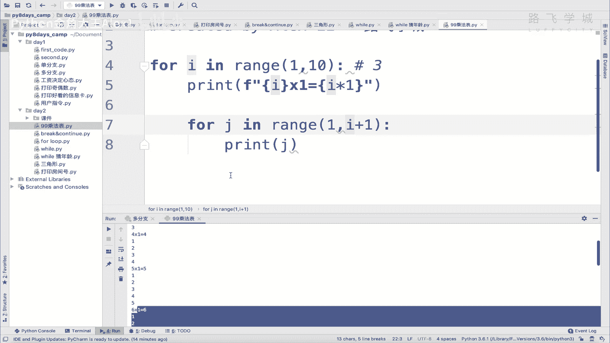

已经实现了，这个在每一层就打印这小循环就走几次对吧。

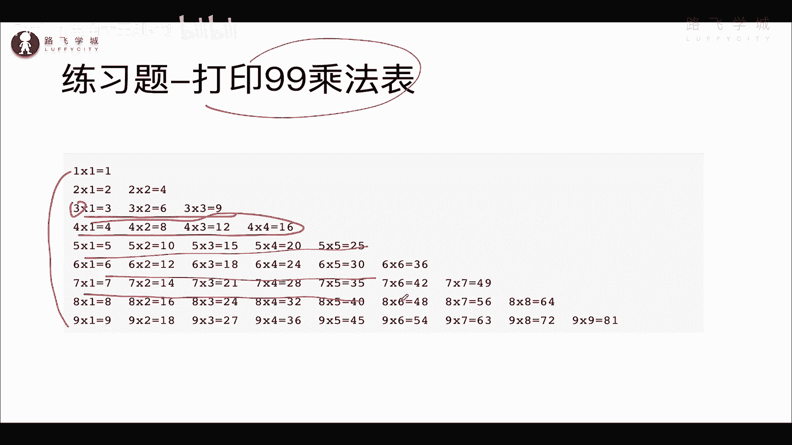

然后呢，剩下的就是说让它打印出来这种格式。

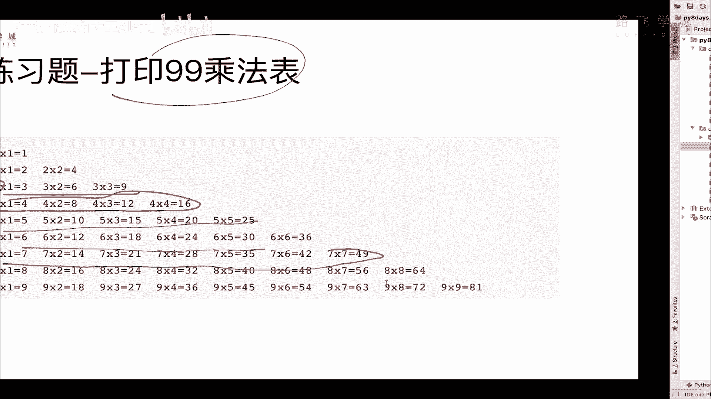

是不是就OK了，打印出这种格式，那我们先来打印这种相乘关系。

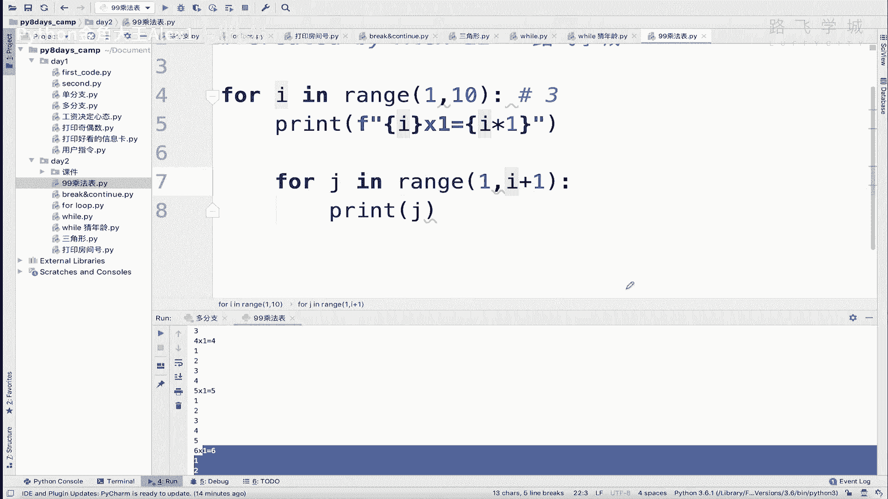

对不对，把那个相乘的关系给他算出来，就不再是啊。

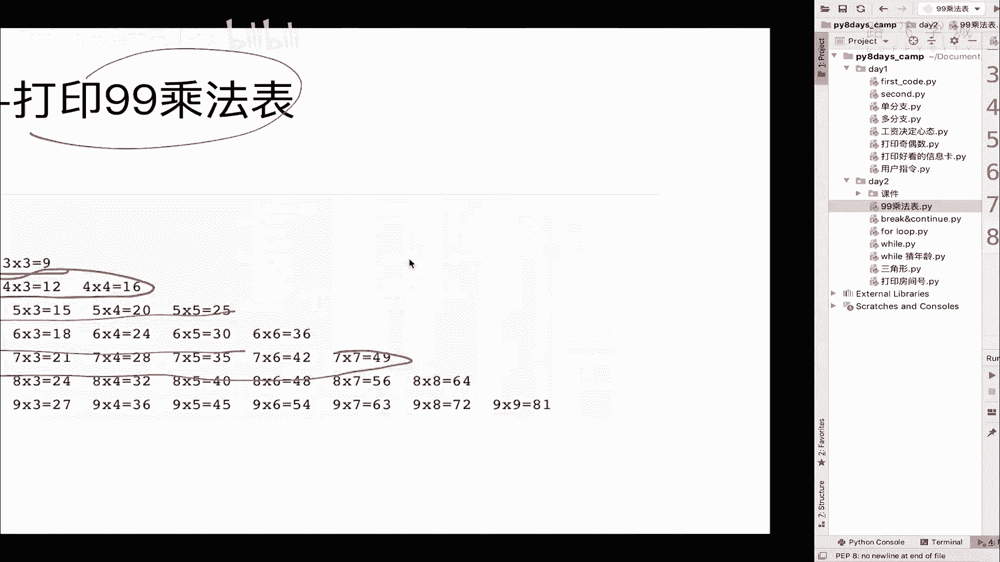

不再是只是说这个什么呀，第一列第一列这样了。

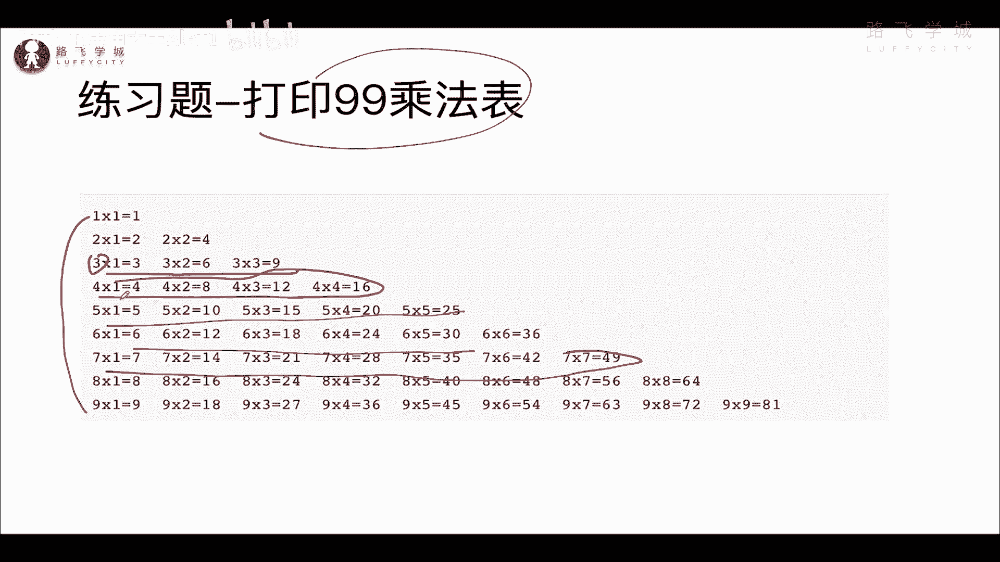

那后面一列后，后面就这样，你看现在咱们是不是只是在第一列有相乘啊，对吧。

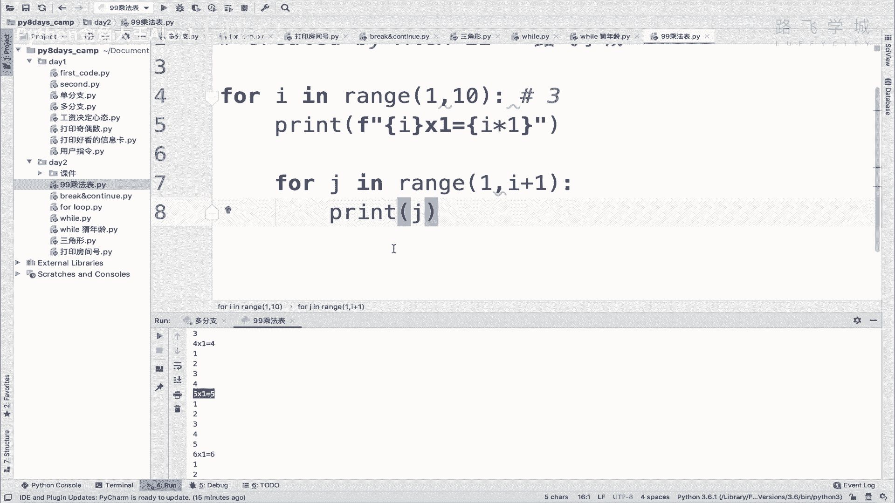

那我们让它啊这些数也变，它也也打印出来，像这种的相乘的这种效果。

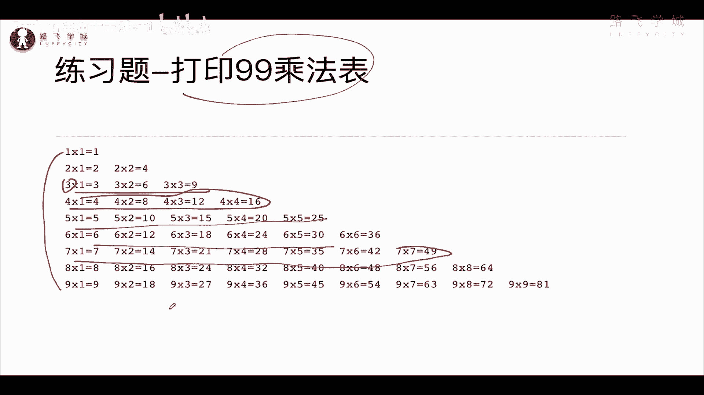

是不是啊，那怎么做呢，好同学们，要让这些啊，小循环里也实现这种打印的效果的话，那我们就可以把这个给它移下来，因为你这个地方他现在是写死了的对吧，都是5×1呀，五乘什么呀。

但实际上我们应该让它变成动态的对吧。

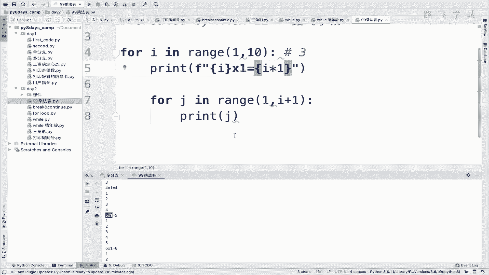

几乘几几乘几是不是都是都是这种动态的对吧，所以呢那这个就是就就是这个后面这个乘，被乘的这个数，它都是小循环里的数，你说是不是啊，都是小循环里的数，比如7×4。

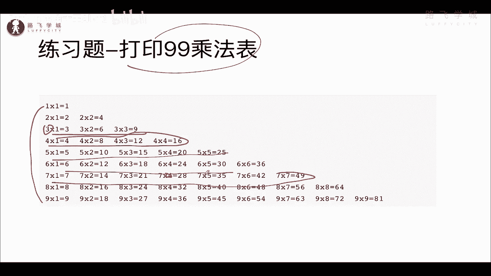

7×5，这都是小循环里的数，所以呢既然你要用到小循环里面的值，所以你要把这个给它移到下面来，能理解意思吧，我们所以在这里啊给它去掉是吧，给它去掉，然后呢我们在这里给它打印print f。

然后呢也是首先这个就是I乘以个几了，上面的I乘以哦，I乘一个谁呀，乘一个G了，对不对，乘一个G对啊，之前是写死的一现在是乘一个G等于一个啊，等一个I乘一个，真正的乘一个G，对不对，是这样吧。

这个能理解吧，对不对，这样一写，咱们这个代码就其实就实现了，最简单就搞定了。

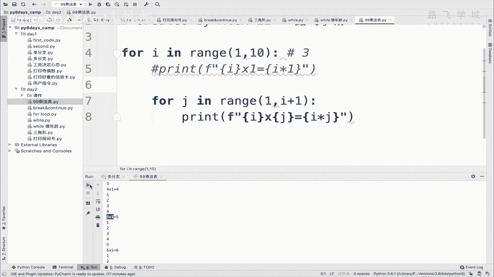

大家来看一下，大家来看一下啊，这个先先别看它为什么没打印成这种格式。

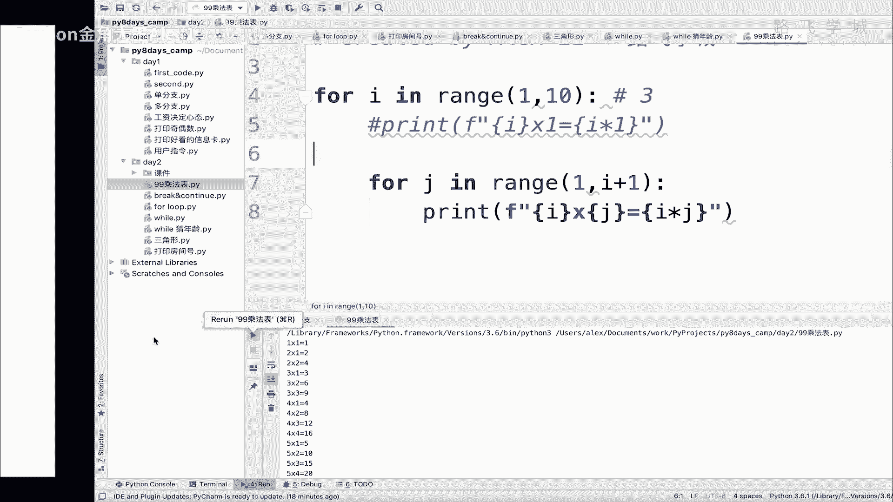

咱们先看看这个数，对不对啊，首先1×1是不是只有对吧，相当于第一层楼，第一层楼只有一个，对不对，接下来看第二层楼，2×1，2×2，3×1乘2×2乘三，对不对，四四也是这个对吧，五就是五次，六就是六次。

对不对，诶，首先先说从逻辑上。

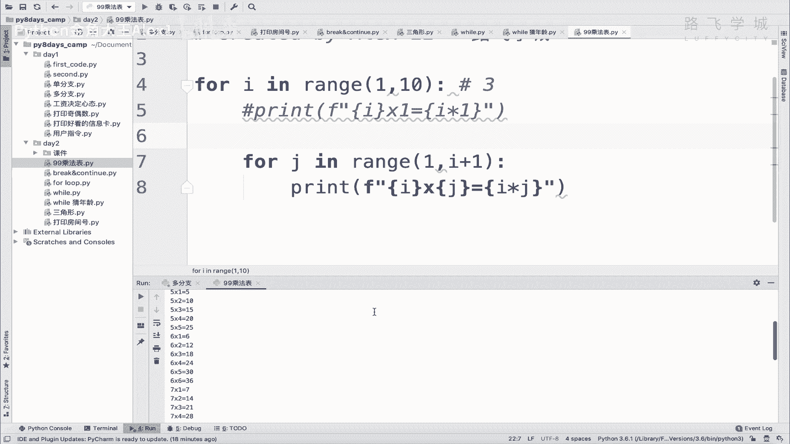

从这个实际数值运算上，它已经符合这个要求了，九九乘法表已经打印出来了。

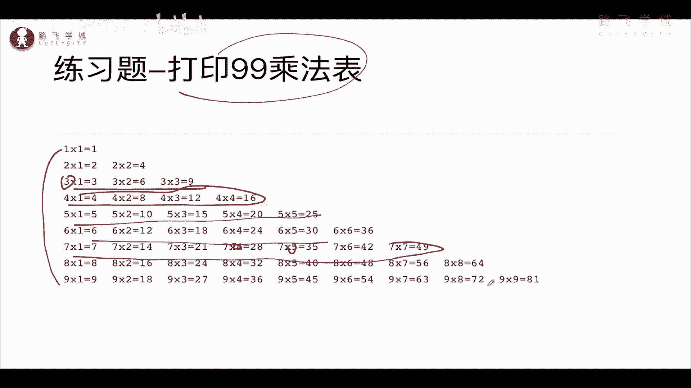

只不过他没有长成这个样子，对不对，只不过没长成这个样子没问题吧，是不是啊，没有长成这个样子，那想长成这个样子怎么办对吧，想着长成，我说九全都在一行，对不对，现在九是打了九行，是不是啊，九打了九行。

那其实也很简单，你现在无非就是说，想让你这个小循环所打印的值，就是这一次小循环，就是这这整个小循环打印的值全在一行对吧，而不是说占九行，对不对，但是你这个小循环里明明打印九次啊。

只要1print它就会自动换行啊对吧，print换行只不过是因为它的默认写法，它的默认写法会换行，告诉你他可以不换的，同志们，我在这里给你直接给你演示看着啊，稍等好，print默认会换行。

是不是在这里也是，放大不了，大家能看见吗，啊能看见是吧，将就看一下吧啊那print默认会换行，然后呢我们在这里啊，这个这个这个其实呢它是默认的啊，默认的你help一下，看它的语法，help一下看看语法。

看这里面有一些参数啊，不要看这什么SEP啊，什么这些东西不用看，大家只看这个end，end是什么呢，就是说你print之后，它默认有一个结尾符，结尾符的默认是一个斜杠N，斜杠N是换行符吧，对不对。

也就是说你每打的一句话，即便你后面没有加什么斜杠N对吧，它就是没有换行，但是它自动给你加一个斜杠N，它会自动换行，明白这意思吗，也就是说但是并且但是你是可以改的，你只需要在这里加一个，and看到没有。

等一个不要等一个啊，斜杠人，你等一个空，它就不换行了，同志们，他就不换行了，你看啥它就不换行了，咱们来试一下，大家看诶，你发现一个问题，没有发现一个问题，没有这个所有的行都变成一行了，看到没诶。

Sorry，所有的行是不是都变成一行了，121×2，它它都都都紧紧的贴在一块了，对不对对吧好，那就代表确实是这个起作用了，它不换行了，他不换行，但是我们想要的是不是只是这个小循环在一行。

大的这个循环还是单独一行的。

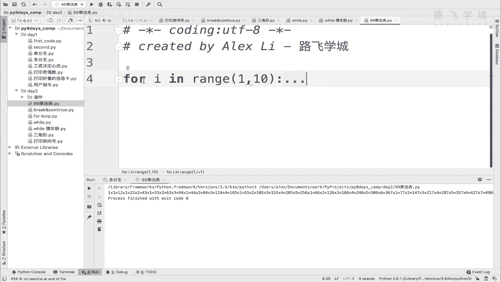

对不对，因为你要起到这个效果吗，小循环在一行大的还是该有多少多少的。

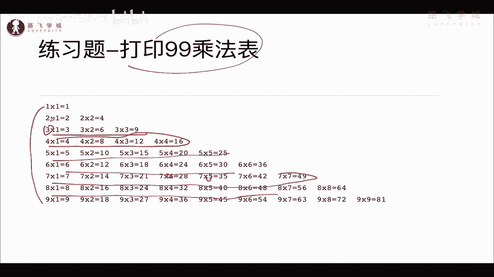

对不对，所以怎么办呢，同志们该怎么办呢，很简单，你只需要小循环，遇到就是小循环的这个，无论这个小循环循环多少次，它都在一行对吧，那好啊，你直接小循环在这里不换行，在小循环外直接加一个print。

什么都不用加，同志们啊，什么都不用加，空的就行，空的它就会自动打印一个换行，因为它的N的结尾，他那个参数结尾是一个换行符嘛，所以你打印一个空的，它就会自动给你换一个行，所以呢就会直接导致小循环会一行。

然后走这一句就会换了一行，所以导致对吧，这个大的几行就出来了，对不对，咱们来看一下，Very good，Very good，非常好，大家看是不是已经实现了这个什么呀，这个这个这个这个这个啊怎么讲啊。

叫啥呀，叫啥呀，Sorry，忘了哦对，已经实现了九九乘法表的效果，对不对对吧，就是这么简单。

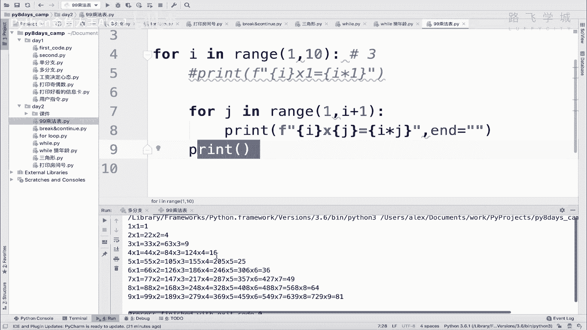

只不过现在它还是拼起来的，你看它是拼起来的，对不对，是不是拼起来的对吧。

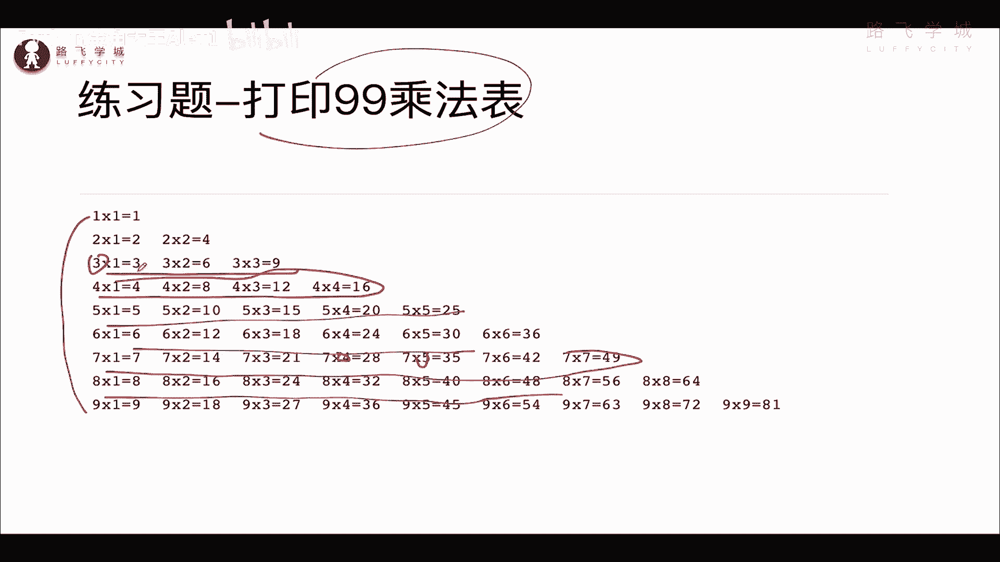

但是人家这里是有空格，是不是，这个时候你再用它另外一个参数，这里有个参数叫什么呀，看到这里有一个SEP，SEP叫separator，就是分隔符，也就是说你的两个print之间对吧。

就是呃怎么讲你的两个print之间是啊哦sorry sorry，不用不用不用，这里用了，Separate，这里直接就是end就行，你在这里现在是没有间隔的，你把它加一个空格，加一个空格啊。

现在是没有间隔了嘛对吧，所以它两个print之间就会连在一块儿是吧，就会连在一块啊，你加一个空格，咱们再来看一下效果，是不是直接就出现这个情况了，看到没有，是不是就直接产生了。

跟咱们这里要求一模一样的一个效果呀。

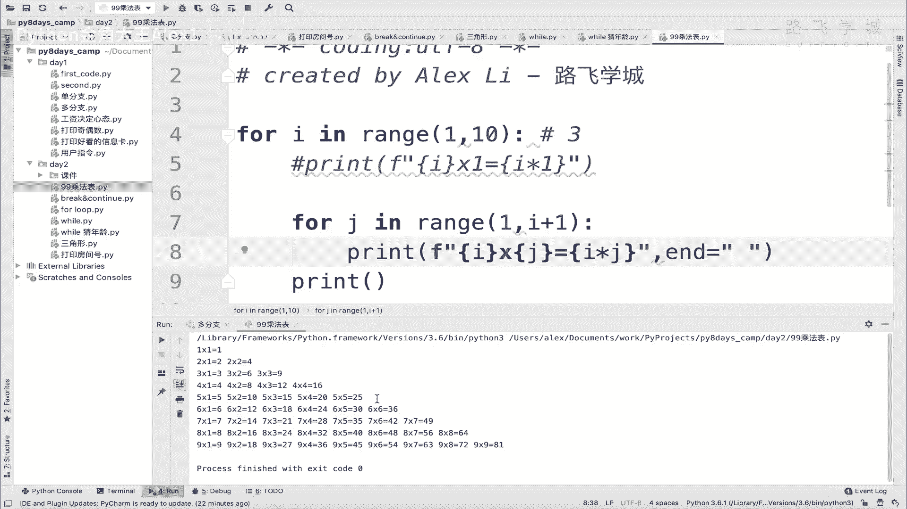

是不是一模一样的一个效果呀，九九乘法表就诞生了。

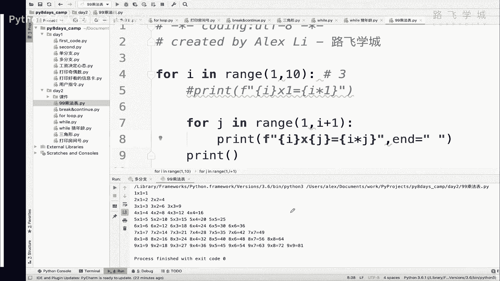

所以呢这个其实有点是叫奇淫技巧啊，奇淫巧技，对不对啊，不难啊不难，但是对于新手来讲，我不给你指点一下，你可能就想的思路就错了。

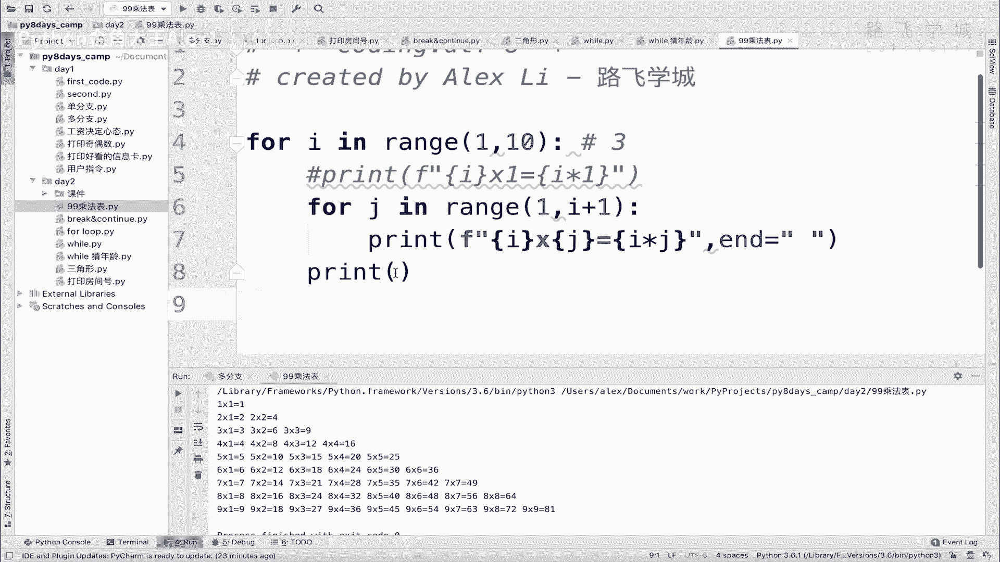

OK好九九乘法表理解了这个思路，自己把它命默写出来。

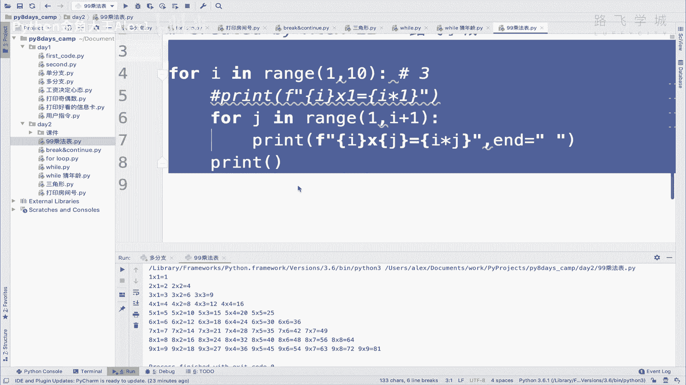

不要抄啊。

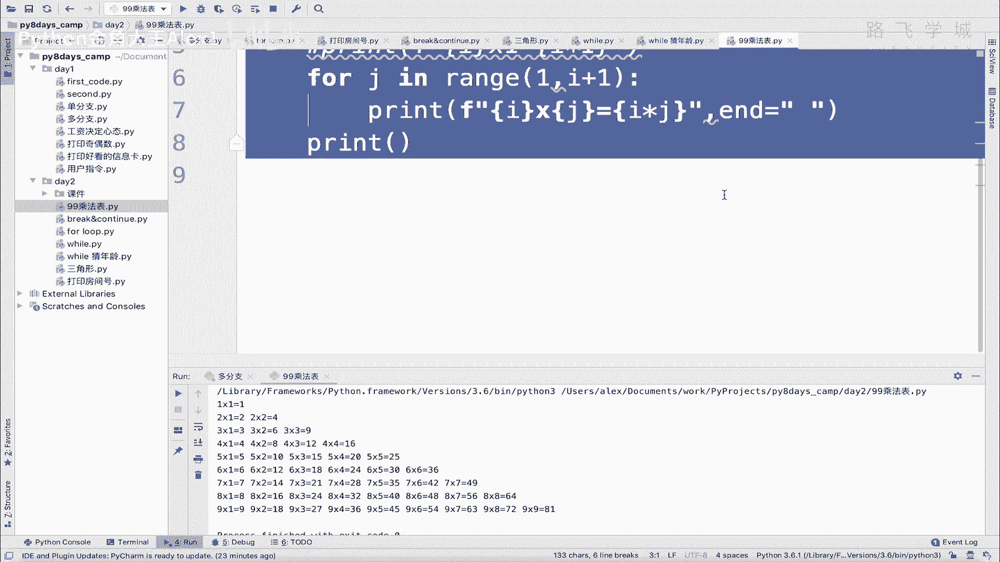