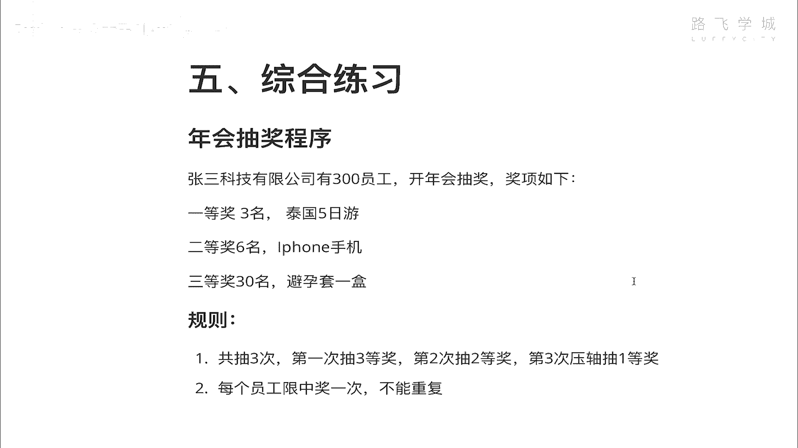
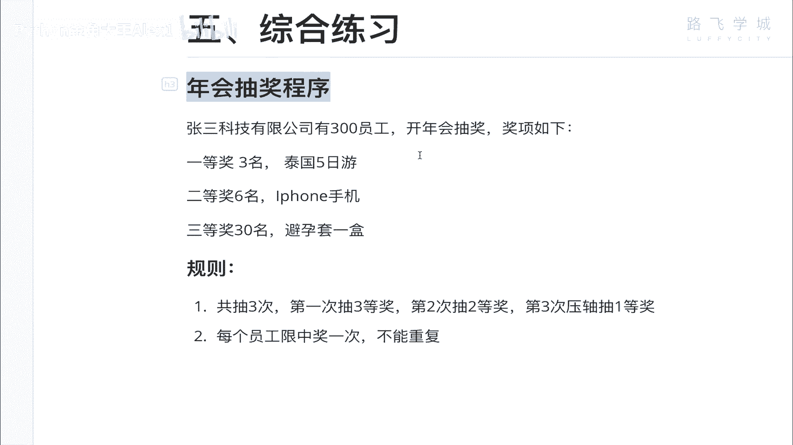
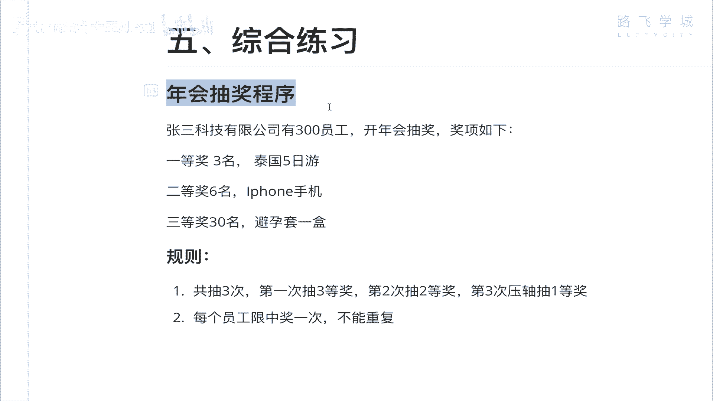
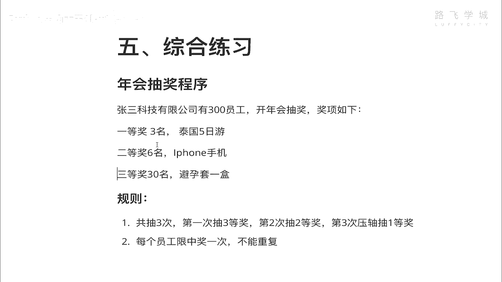
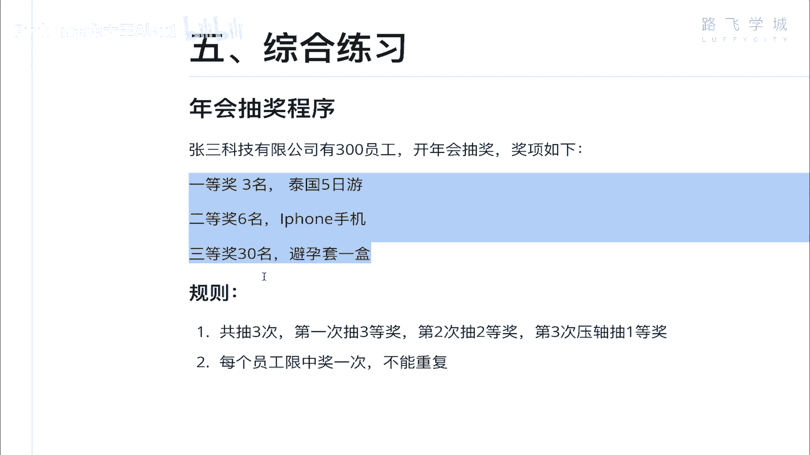
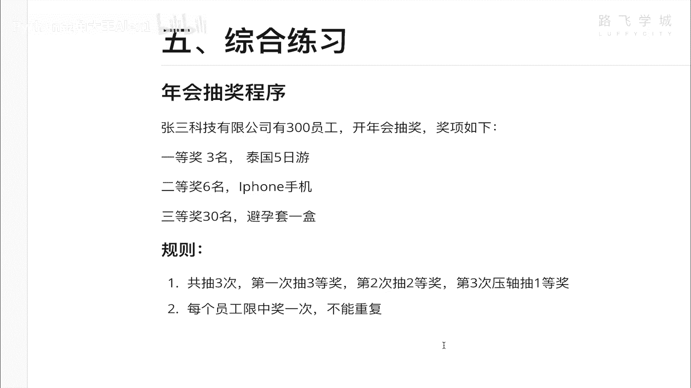

# 【2024年Python】8小时学会Excel数据分析、挖掘、清洗、可视化从入门到项目实战（完整版）学会可做项目 - P28：09 年会抽奖程序 - Python金角大王Alex1 - BV1gE421V7HF

OK同学们到此为止，咱们第二天的内容就讲完了，你会发现啊，第二天比第一天要少很多是吧，OK那呃但是有一定的逻辑性啊，那这个第二天讲完，那你需要自己做一个练习题出来啊。

就是这个综合练习题年会抽奖的程序，哎同学说啊，老师你套路我不是你来讲吗。

对吧，我可以讲，但是呢这个怎么讲，就是说我觉得还是要有一个你自己憋的过程啊，我是思考着说不行对吧，到这个在直播的时候给大家讲，因为我只要录成视频了，你肯定就会看。

可能你都不愿意去毕业就会看，但是呢这个你必须你得想办法做，因为你只要把这个做出来了，你前面相当于你这两天的内容才算真正掌握了，好吧，我们来看一下需求啊，就是大家都过年会是不是啊。

你这个你们公司如果不开年会啊，这个所以你就可以离职了，因为这个公司太小了，应该啊那张三科技有限公司啊，有300号员工注意了，300号员工开年会抽奖，有三个奖项，一等奖三名，泰国5日游，二等奖六名对吧。

三等奖30名啊，哼这个这个啊对吧，少儿不宜啊。

那总之这么些奖项注意了，大家要大家要关注技术层面啊。

这个其他的都是就图个乐就行了，那呃再来个四等奖润滑剂，三等奖和四等奖抽中奖的人可以一块了，那这个规则是什么呢，一共抽三次，那一共抽三次，第一次呢就是就第一次就抽三等奖对吧，因为年会都是这样嘛。

为了因为好多人参加年会的吧，这个这个抽完奖就跑了，所以为了让你留在最后，把这个大奖放在最后，所以一开始先抽不重要的奖，第一次抽三等奖，一下子就抽出来30名对吧，第二次抽这个二等奖。

第三次抽这个一等奖对吧，一次性就抽出来三名啊，注意了，是一次性就出收入3米，就像咱们那个汽车摇号程序一样对吧，一一点回车他就夸，就把那个这个这个这个这个三次啊，不是这20个号码都打印出来了对吧。

那注意了，每个员工现中奖一次，也就是说他比如说已经中了避孕套了，那不好意思，你就没有机会再中IPHONE手机了，想退都不行对吧，所以就是每个员工只能中奖一次啊，不能重复，就是这么一个需求，这个需求呢。

它会比它跟咱们那个其实车牌摇号的小程序，有一定的类似啊，但是呢又这个情况又不完全一样啊，所以这个其实就是扩展，看你考验你能否扩展出来了，如果你前面代码都是抄的我的，那你这个就会很有难度。

如果你确实是理解了我的思路，又重新把它写一遍，然后你再去自己憋一憋，这个我觉得你应该是可以做出来的，努努力啊，基本上一到两个小时吧，努努力看看能不能搞出来啊，如果两个小时还憋不出来啊。

那你就可以等着我直播去给大家讲了，好不好，那这个就是咱们的一个哈综合小练习啊，希望你们认真做一下，还是一定要知道这是一个实践性的学科，你不动手，你是永远学不会的，就是让这个上帝来教，你都学不会啊。

上帝只说我要把他带走哈，因为今天的这个课咱们就到这里，明天进入第三天。

OK拜拜。