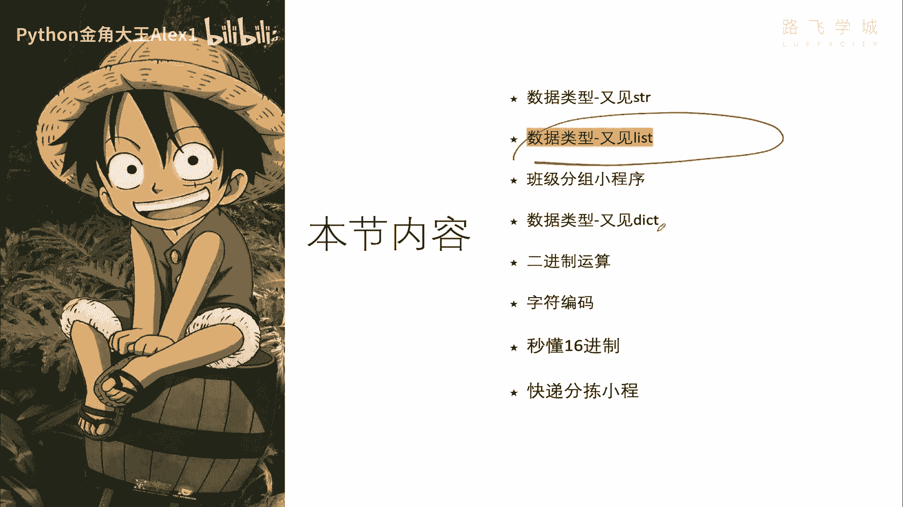
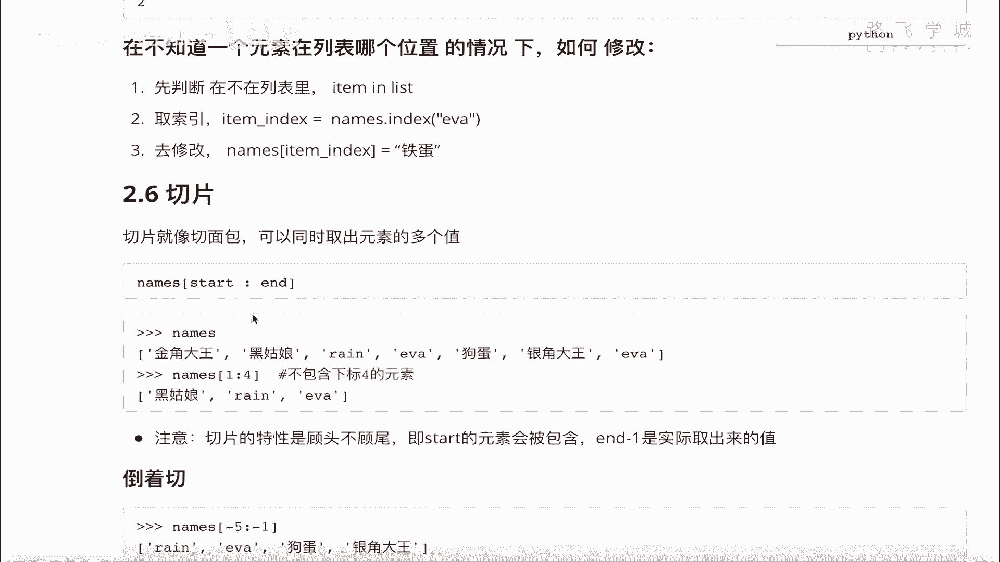

# 【2024年Python】8小时学会Excel数据分析、挖掘、清洗、可视化从入门到项目实战（完整版）学会可做项目 - P30：02 数据类型-又见列表 - Python金角大王Alex1 - BV1gE421V7HF

OK同学们这一小节呢我们来学这个列表啊，在第一天我们初识了列表的一些基本操作。

这节呢咱们把它啊，一些更进阶的一些内容来学一下呃，这几个这几个功能要学下，第一它了解它的定义和特性，增删改查步长，排序反转和列表的循环，OK那直接进入咱们的正题啊，在这里呃首先呢我们先来了解一下啊。

这个列表的定义啊，这了解的定义啊啊东西还挺多的，但其实都挺简单的啊，这个定义是什么呢，它以这个中括号为分割啊对吧，中括sorry，他这个语法是以中就是一个中括号，然后呢里面的每个元素按逗号分割。

按照索引对吧，按照索引来去啊，标记数据，标记元素，并且存放的数据呢是这个什么呀，存放各种数据类型，它存放各种数据类型，注意了，它在里面可以存字符串，可以存数字，甚至还可以存再存列表，就是列表的嵌套。

还可以再存列表啊，每一个位置代表一个元素，OK吧，那它的特点就是什么呢，第一个可以存放多个值，第二个呢它是跟字符串一样，它是有顺序的啊，从左到右按照这个索引来去访问对吧，有序的有序的，注意了。

它是有序的，你无论打印它多少次，它这个顺序都不会变，因为索引是啊标记着呢，第三个呢就是说你可以修改它啊，你可以对这个列表的值进行增删改查，它跟字字符串还不一样，字符串不能改。

它是所以它是一个可变的数据类型，OK吗，然后另外一个就是它的，你有人说同学说这个列表可以存多少，存多少值呢，一个列表里面存无限的值，理论上你的内存有多大，你就可以就你你可以存一个列表，把内存撑爆啊。

都是可以的，好这个就是它的基本的一个一个定义好吗，了解基本的定义之后，我们啊来看一下它的一些增删改查的一些啊，和其他的一些相关操作好吧，我们在这里先定一个列表，这个叫嗯ALEX，然后，啊jack好吧。

这一个列表当然你也可以定空列表，空列表就是这个对吧，没东西，是不是啊，那我这个A你打一下下划线，大家来看一下，我这里面还是有一堆方法的，当然今天我们这些方法也依然不会全部讲啊。

依然比如说像这种copy什么的，我们在这个地方用不到啊，所以我们在这里不讲啊，不讲我们正式的就是大课，大家有兴趣啊，如果想深入学习，想学校编程，想就业，你可以考虑学我们的大课。

大课里面会把这些每一个方法非常详细的讲，但这里还是啊时间有限，我们只讲重要的啊，重要的咱们讲几个讲几个啊，讲几个，这就揉到咱们的这个课件里来讲了哈，OK我呢呃咱们先来看它的增加的一个操作。

增加的操作呢其实在第一一天的时候已经讲过，就是append，就是append，这是追啊，两种方式，一种是追加，一种是插入，还有一种新讲的方式叫合并，OK吧，那追加和插入，上节课之前说过。

第一天就是append是追加，加到后面看到没有一个，对不对，加了一个RIN，加了一个E吧，它就会依次的加到列表的后面啊，这个你跟着试就行了，插入的话就是什么呀，可以插入任何位置，对不对。

你这个2insert这个二就是你想插入的新的值，它处于哪个位置，比如说新的值差到这个索引二，其实就是012嘛，就插到这个位置，后面是你的元素的值，这个没问题吧，OK吗，同同一时间只能插入一个值啊。

有同学说哦，我能不能插多个不行，只能插一个，OK这是这个另外一个合并，之前没讲过，我们来试一下啊，合并是什么，用一个叫extend方法，什么意思，就把两个列表合并成一个，大家看我这里有一个N2。

这里面几个人狗蛋绿毛和鸡头对吧，我这个有一个有一个有一个诶，有一个什么呀，这个应该是个等于号啊，写错了，然后另外有一个names对吧，他有这几个值，看到没有，我现在要把这两个列表合并怎么办呢，注意了。

他是直接names点，就是把N2给它揉到n names里面去，就是n names点extend的N2，看到没有，Extend n2，把N2传进来，这样你再去看names这两个列表就变成呃。

不是这里这个names的值就啊就变长了，OK吧，这个跟咱们学学的字符串不太一样，学的字符串你操作完了之后对吧，它会生成一个新的值，你你得你要想想改，那想改那个啊这个字符串原来的字符串的话。

你还要给原来的字符串赋值对吧，上节课讲过了，但是names不一样，这就叫sorry，列表不一样，列表是说你本来就是一个可变的类型，所以你这么一操作，直接把这个N2相当于加到了这个names里面。

你就再看names，它就涨了OK吗，而不是说给names重新赋一个值，叫就叫什么names2，No no no，就直接在原来的names的这个基础上，就就给他这个什么了，就给他啊修改了。

OK所以这个是啊列表的这个嵌套啊，列表的这个合并合并OK吗，还有一个叫列表的嵌套啊，列表的嵌套，这个列表的嵌套是个呃，是个什么意思呢，大家来看，你看我在这里还是上面这个names，看到没有啊。

我在这个names，在这个索引这个位置，黑姑娘这个地方我做了一个插入，插入一个什么呢，插入了一个新的列表，看到没有，插入一个小列表啊，明白这不是插入好几个元素，这是一个元素。

它会把一个小列表当成一个元素，所以你看你就轻松的插进去了，看到没有，你就轻松的插进去了，OK所以这就形成了一个列表的嵌套，明白吗，当你有列表的嵌套的时候，你再去取值啊，那怎么去取，咱们来试一下好不好。

咱们来试一下，我呢就直接啊在这个啊，我直接在这里写吧，好不好嗯，或者我在这里写，记不下来是吧，那就这样，我我我哦，我在我在我在咱们的sorry啊，怎么出不来了，哦我的我的那个软件好像出bug了。

Sorry，Sorry，Sry ho，到嗯出不来了，那这样吧，如果出版，我们在这写吧好吧，sorry啊，那现在我们是直接这样，我就copy过来一个，对吧，我这个names。

然后呢我在这里插入一个值names，点insert，对不，我想插到黑姑娘这个原现在黑姑娘这个位置，那就是二，对不对，插到二这个位置，我在里面插入一个小的列表，这个小的列表咱们就叫啊。

咱们再起一个就叫什么呀，这个呃这个这个这个这个这个嗯mike对吧啊，然后RACHEL对吧，a source加一个括号就看完了，那这个时候我们来看一下，你看这里面是不是列表套列表啊。

那我如果想取想取这个想取元素，想取元素的话，你其实也依然是这样，中括号对不对，中括号，然后012取的二取二，就会把这个列表都取出来了，你说我要想取RACHEL的值怎么办，继续拼，看到没有。

因为你你这样已经是，相当于把这个列表取出来了，那你要再想取里面的第二层的值，相当于这是这是第一层嘛，想取第二层的这个值的话，你就再继续加中括号取这个RHEL1，这个一是从这个小列表的索引开始的对吧。

从这是零，这是一明白吗，你是不是就把rich取到了，对不对，取到之后你甚至还可以改它，对不对啊，乘啊这个什么什么什么，对不对，然后这个时候大家来看是不是就改掉了，明白这意思吗，唉这个就是列表的嵌套好吗。

那顺便我们再把刚才那个列表的叫啊，合并给它试一下，咱们有一个A对不对，我们把这个names点，现在是names，是长这样，我们把这个A给他啊，给他这个融合进来，就把A给这个融进来。

看ALEX和jack就应该会加到后面看了，加到后面哈，大家看alex jack是不是加到后面了，还有同学说这里还有一个啊不冲突，他俩没关系啊，他俩没关系，这个是原来的，这个是新的，OK吧。

哎这个就是咱们的啊嵌套和合并啊，给大家一块说了哈，好这是这个增加的一个操作，除了增加还有这个什么呀，删除删除第之前讲过全讲了这种方法对吧，通过DEL删啊，DEL呢是说又可以删字符串。

又可以删这个就它可以删所有的数据类型，这个是解释器自带的一个，就可以删所有的东西对吧，你可以删除其中一个元素啊，然后这是系统自带的啊，解释器自带的这个呢是pop，这是列表里自有的一个方法啊。

这个pop注意了，它默认默认会删除最后一个元素，并返回被删除的值，注意了，默认会删除最后一个元素啊，咱们来看一下，sorry啊，我们现在有一个names，对不对。

咱们先help一下这个names点pop，它是一个他这个他这个啊啊叫叫叫叫叫原理啊，就是这个用法啊，大家看它pop，然后呢这个删除并且返回这个元素啊，并且返回这个元素，然后这里它其实是可以跟参数的啊。

就如果是就是你可以指定删哪个，你不指定他就会删最后一个，大家来看一下names点top，我就会把jack删掉，最后面那个大，它并且返回了jack的值，注意了它并且返回了jack的值OK吧。

然后大家看是不是jack删掉了，那你要想你保存这个删掉的值，对不对啊，Deleted，呃ED吧，deleted这个item对不对，你想留下这个值以后调用，大家看imprint deleted对不对。

它就这个啊，哎DLETED它就什么呀，哦这个就是你ALEX刚删的这个是啊，默认删除，你可以指定删哪个对吧，names点pop，然后你删掉一个啊，你要你你指定的话，你要指定索引。

而不是指定这个这个这个这个哎什么EVA名，No no no no，你指定索引，你比如说我要删除啊，这个倒数第二个倒数第二个，你要是删除第二个，我们知道指指向一就行了，对不对，所以写一如果倒数第二个。

那你就从左边数为0123456，哎呀，输入五，这个挺费劲的，我告诉你还可以从右边数看到没有，直接从右边数，这是一，这是二，你直接写二就行了，大家来看你输入了，哎我没删，我没有回车是吧啊，Sorry。

你直接输入一个二，看着啊，大家来看大家来看啊，Sorry，我刚才删了没有，刚才操作太快了，你中间输入一个二，会把RIN删掉，看着啊，一回车大家看是不是RIN就返回了，RIN是不是就没有了。

哎这是从右边开始数啊，如果列表长的话，你就从对吧，所以从右边开始数也行，就是负数啊，一负二-344pop啊，pop这个那除了pop删除外，还有一个叫什么remove，是不是remove。

我们学过就是说pop是指定啊这个索引索引，然后remove是指定元素名对吧，指定元素名，但是他的指定元素名的一个问题就在于说，如果这里面有两个一吧，他会从左边，比如说找找到第一个一吧，明白吧删掉。

然后后面那个1万还会留着，所以他就从左边找找到第一个你指定的值，如果找不到就报错啊，找不到就报错，OK你我就不试了，clear清空，我们应该讲过了，是不是啊，讲过吗，没有吧，那没问题。

咱们就直接你看N2，现哎N2已经被我删了是吗，呃不记得了，哼那names我们可以把names点清空，clear注意了一点，再看names就空了好吗啊，这个其实有些你不用记啊，我这个笔记都写的很清楚。

你先理解什么意思，你跟着写一遍就可以了啊，不用非得死记硬背，以后写程序写的多了，你就会都都记住了啊，你现在cos已经被你记住了，以后不用也会忘，然后呢修改操作，修改操作这个不用说了吧对吧。

这个这些索引值啊，这是从右边开始输入，这是先改最后一个值是吧，改这个绿毛是不是呃，然后改出来，你看银角大王，金角大王都改掉了，这是修改啊，不说了，是不是啊，嗯然后呢这个就是查找查操作，查的话两种方法。

一种是呃这个什么呀，一种是呃，其实还有一个in，还有一个in，还有一个in啊，这是什么item in这个list对，这是判断，先看这个吧，index对吧，直接index输入一个什么呢。

输入一个你的元素名，输入一个元素名，那他就会返回，他就去查找，说就就给你去返回这个什么呀，返回伊瓦所带的索引值啊，EVA所在的索引值，这种场景一般会什么情况下用呢，比如你这个列表特别长啊，列表特别长。

你想取里面一个值，你比如像你把银角大王这个值取出来，那怎么办呢，你呢就直接输入点银角大王它，你然后他就会给你返回索引值，返回索引值之后，你就拿着索引值去改它，明白意思吗，所以但是有的时候你这个列表。

比如说有1万个值，你不知道里面有没有银角大王，你程序动态的，你看你看不清啊，那么一大片一大片好多篇，你你不可能自己去数，所以你要先干一件事，第一步先判断啊对吧，先判断先判断啊，在不在列表里，对吧。

然后呢怎么判断呢，就是item in indilist对吧，如果在的话，接下来干嘛呀，取索引，对吧，取索引，那怎么取呢，NT点index，然后把你的这个什么呀，EVA给它取出来啊。

取到索引你就可以先存成一个变量，对吧啊，给他存成一个变量，然后呢去修改，是吧，然后就是你的names干嘛呀，然后输入一个item index，然后把这个EVA改成了一个是吧，改成了一个啊。

这个什么铁蛋对不对，哎，这个就是说，在一个啊就是OK在不知道啊一个元素，啊在列表哪个位置的情况下如何修改对吧，如何修改，我把这个思路都已经给你告诉你了，对不对啊，告诉你了，大家你你你想一想。

你结合这个思路，你再去记这个东西不就容易了吗，OK然后count的话就是什么呀，技术啊，统计你这个列表里面有几个叫EVA的，有几个叫什么什么其他的对吧，这里你看有两个EVA，它就返回二，有一个就返回一。

有没有的话就返回零，它不会报错啊，没有就会返回零好吗，有的同学说老师我好懵啊，你这个有的用用索引，又用，有的用元素名，有的用啊报错，有的又不报错，哎呀我记不住，还是那句话，没有关系啊，不用死记硬背。

你这个你就你先写一遍，知道有那么个功能，然后以后写程序的时候慢慢写的多了，哪怕你前开始回来查，以后写的多了就自然记住了啊，自然记住了啊，OK这个是这些，然后看好呃，这写完了之后我们就知道了，增删改查。

是不是啊，写完增删改查之后，我们再学一下它的高级内容啊，比如说切片啊什么的。

下一小节讲。