# 【2024年Python】8小时学会Excel数据分析、挖掘、清洗、可视化从入门到项目实战（完整版）学会可做项目 - P33：05 数据类型-字典来啦 - Python金角大王Alex1 - BV1gE421V7HF

OK同学们，那学完列表之后呢，我们再学一个牛逼的数据类型啊，这个数据类型叫字典，那不能叫右键date啊，这这这英文名叫DT就是字典啊，因为咱们第一次学之前没学过这个dict啊，那在正式学这个字典之前。

我先给大家问一个问题啊，问一个问题。

假如说啊我们学了列表了，对不对，我现在有一个需求啊，把你们公司的每个员工的姓名年龄，职务和工资啊，给它存放到列表里，你怎么存啊，存放列表里你怎么存啊，我已经给你列出答案来了，你可能想诶我可以这样存呀。

我搞一个大列表是吧，然后呢里边每一个人的信息是吧，我搞一个小列表，就这样存下来啊，我这公司有1000号员工。

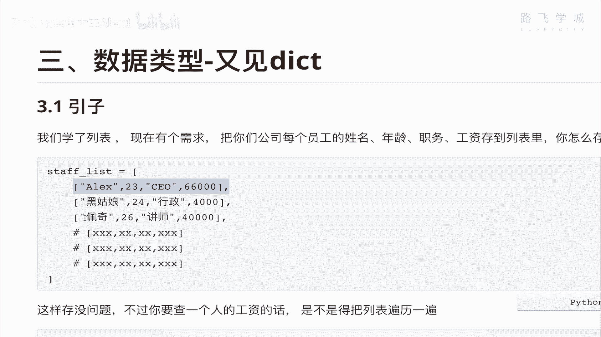

我就存1000条，可不可以，当然可以没问题，咱们就可以给他存下来，是不是给他存下来。

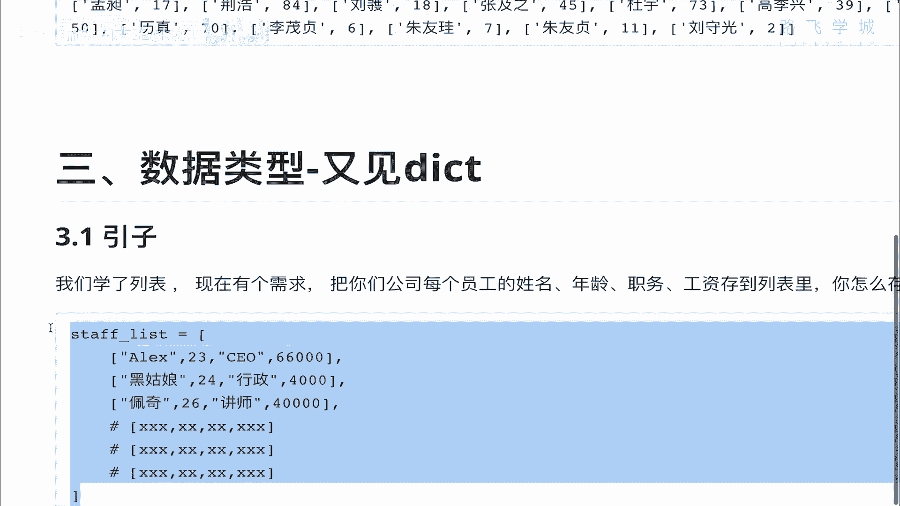

然后呢放到这里是吧，但是这里会带来一个问题啊，我的问题是存没问题，但是我要去查，比如说我想去查佩奇老师的工资是吧，佩奇他是一个讲师，他的工资是多少呢啊它是多少呢，那你在这里是直观看到他的索取索引嘛对吧。

找到索引啊，零二这个索引，然后给它取出来，找他的工资诶，这是你直观可以看到，但是我们现在想象他有1000号员工，也就你也不知道佩奇在哪对吧，所以你只能是干嘛呀，去循环这个列表。

循环这个列表去每一个去判断哎，说这个第一个每一个小列表的第一个值，是不是叫佩奇，如果叫佩奇，然后我就去拿他的工资，是不是这样啊，所以呢你的做法就是这样的，for这个艾因这个staff list。

Staff list，然后呢，去循环判断每一个if i下面的这个零是吧，等于一个配齐配齐是吧，如果等一个佩奇，那你就current他的I这个下面的就是一嘛，就是把他的工资取出来了，你只能去这样。

是不是啊，那这样的话呢，你说麻烦了，多写三行代码，感觉也还好，不是很麻烦，但其实我告诉你这个呃写三行代码啊，你不你不觉得麻烦就算了，但我是觉得麻烦啊，我是觉得麻烦，这是第一点。

第二点其实还带来一个系统性能的一个问题啊，你看你现在配齐，现在是在第三个位置上，你这个列表里面有1000个值，你循环循环三次就找到了，对不对，找到了之后，那你后面就不用了嘛，如果是相等。

你不就break就可以了吗，那循环三次就结束了，那很好，但问题是如果你这个佩奇正好在哪个位置呢，正好在第999。

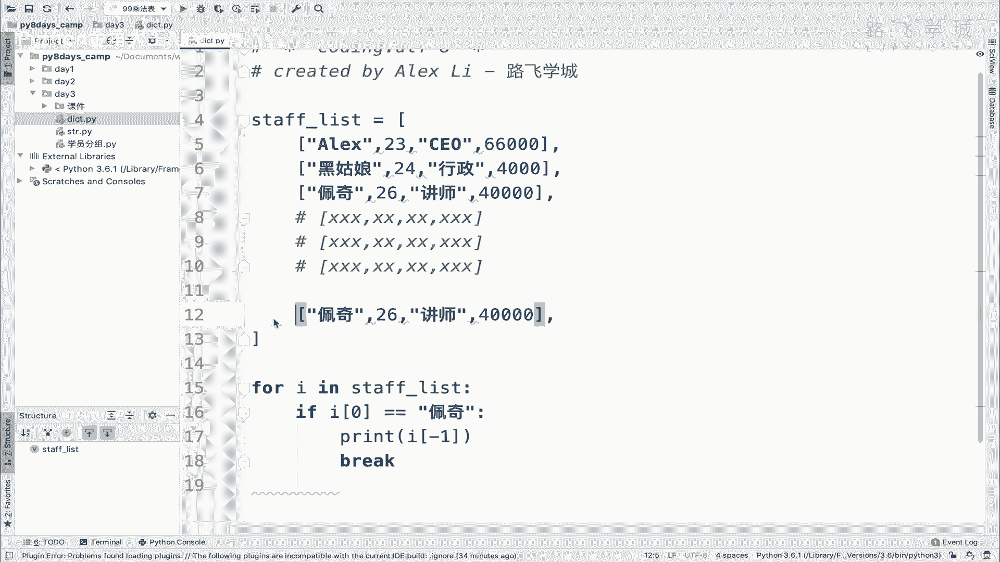

它的索引在第999个位置，那就意味着你整个要循环999遍啊。

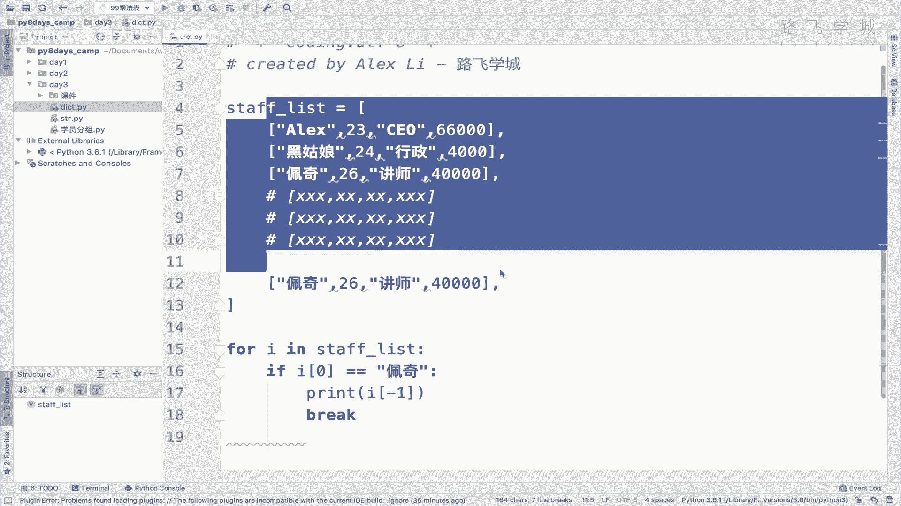

999次才会找到佩奇这个元素啊，这个小元素，然后对吧，才才才OK，那这样的话你其实相当于已经呃怎么讲，你你就说白了你就循环了900多次才找到他啊，那这个效率还是很低的，因为你现在有1000个啊这个人。

但如果你你们公司特别大，你有100万人，100万号员工，那你可怎么办啊，你就没你就非常麻烦了，那我想查有没有有谁谁谁有没有交党费对吧，我先循环一遍，这8000多万次，我靠这个谁也受不了。

所以呢你这样搞的话，这个列表的这个局限性就出来了，就说他这在查询这种数据的时候啊，他这个效率并不高，是不是啊，那查询效率这种查询效率，因为因为你不是说直接判断一个什么啊，在在外边写一个什么佩奇in这个。

这个就可以了对吧，你不能这么写，你肯定不能这么写，page in这个staff对吧，他这样肯定会得到一个得到一个false，为什么，因为你要想判断，必须要都拿出来判断才行，但你都拿出来判断。

你还查他干嘛，你都已经知道这里面的工资信息了，你的问题就是在于你只知道佩奇这个名字，但不知道后面这些值，所以你要查它，你只能循环，能理解这意思吗，OK那好啊不对，那在这种情况下可怎么办。

就是说我能提高我的查询效率，提高我的查询效率对吧。

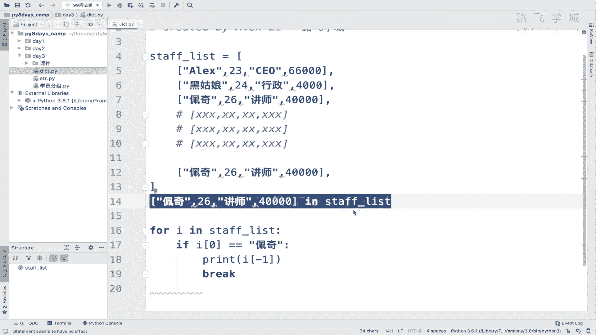

有没有一种方法可以让我不进，不进行这么一次的便利啊，900多次的便利，而是说我我我非常快，可能就是我从这个1000个里面。

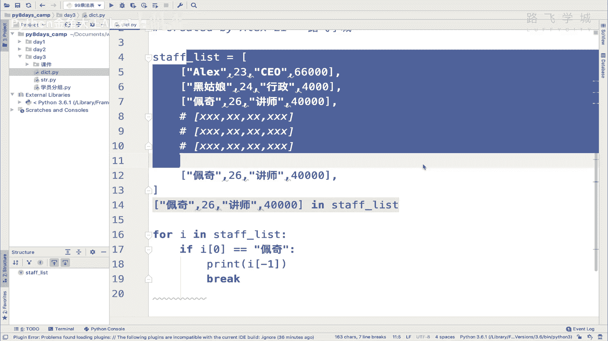

迅速的一下子就能找到佩奇在哪对吧，还有没有这种方式呢，其实是有的。

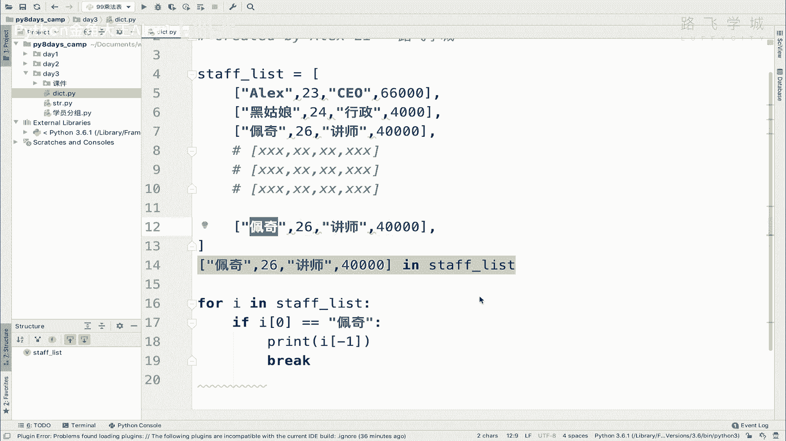

这就是我们新学的啊，这个这个字典的这种叫叫叫叫这个，数据类型它所能带来的它所支持的功能好不好。

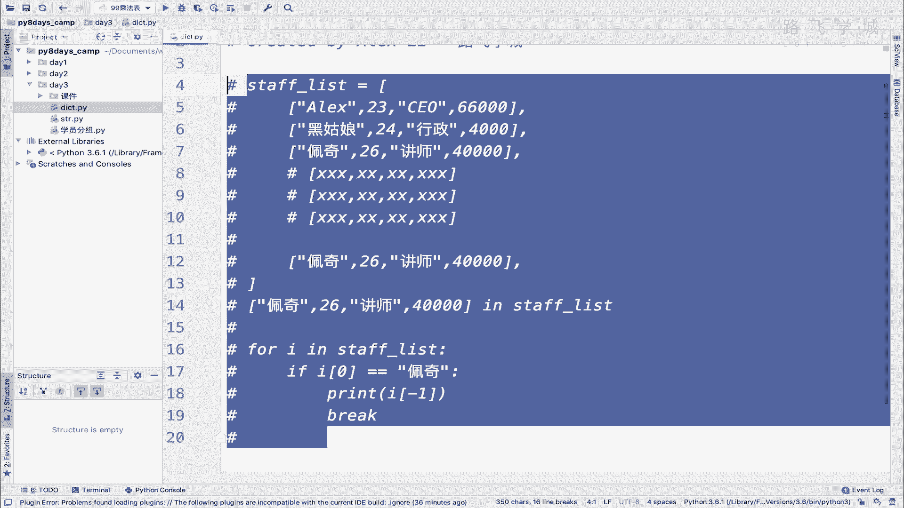

OK咱们来看一下它的这个整个的定义啊，整个的定义，这个字典呢它是一个key value的一个结构，key的一个结构，什么叫key value，也就是说大家想象一下，我们上学用的这个新华字典。

你去查查里面的一个字，你怎么查呀对吧，查一个成语或者查一个什么，你怎么查，你是不是先你开始，比如说这个字你不认识的情况下，你也不知道它的拼音是多少，你怎么查，它可以用很多方式。

就按笔画笔画去查这个它一共有多少笔画，还可以按偏旁去查，是不是，这样啊也就是说你在这个字典字典的浅最上边，它有一个索引页，索引页就是所有的你就一些关键的对吧，我按偏旁，所有是带这个什么偏旁的。

比如说所有带这个提手偏旁的，对不对，所有带这个宝盖偏旁的，所有带这个三点水的，这都是啊这个这个这个查的方式对不对，查查的方式那好，那咱们把这些索引，所以咱字典查字典，它有这个索引。

那我们Python里的这个dict它也叫字典，它的查询方式就是说通过索引，通过不是咱们列表里的那个索引啊，它是通过这种这个他管那个，在列在那个Python字典里，他管那个所以叫什么叫K明白吗。

通过这个key去查对应的这个什么呀，对应的这个value value就是说你这个字典啊，你查这个偏旁是所有带，比如说我要查这个什么呀，宝贝的宝啊，宝贝的宝，那是不是宝盖偏旁对吧。

那你就你就这所以你这个你你就拿这个宝盖，宝盖，它在索引那个地方，Sorry，他这个宝盖在，所以那个地方是应该是有一个K对吧，宝盖啊，不会写是吧，你们不知道这个偏方怎么打出来，但在在这个字典的索引页。

它会应该有一个上面这个宝盖的这个啊，这个这个这个索引，然后呢就走到真正的这个这个宝这个字，这个页面所在的页面，对不对，他在那里会给你提示说啊，在500页，你就400页，你直接到这里去查就查到了。

是这意思吗，所以呢他在这个啊，他管这个，也就是说它叫k value的一个一个啊这种数据类型，然后呢K就是它的索引，然后value就是实实在在的值，明白吗啊，value就实在值。

然后它的定义的语法就是这样的啊，用这个大括号，大括号看到没有，大括号括起来呃，然后呢K是K就是这么写，它可以是一个字符串，也可以是数字都可以啊，然后value是这么写对吧，中间用这个逗号分开，看到没有。

哎这个就是这个字典的一个数据类型好吧，我们可以比如说把我这个，比如说如果上面这个需求，我改成字典的一个模式就很简单了啊。

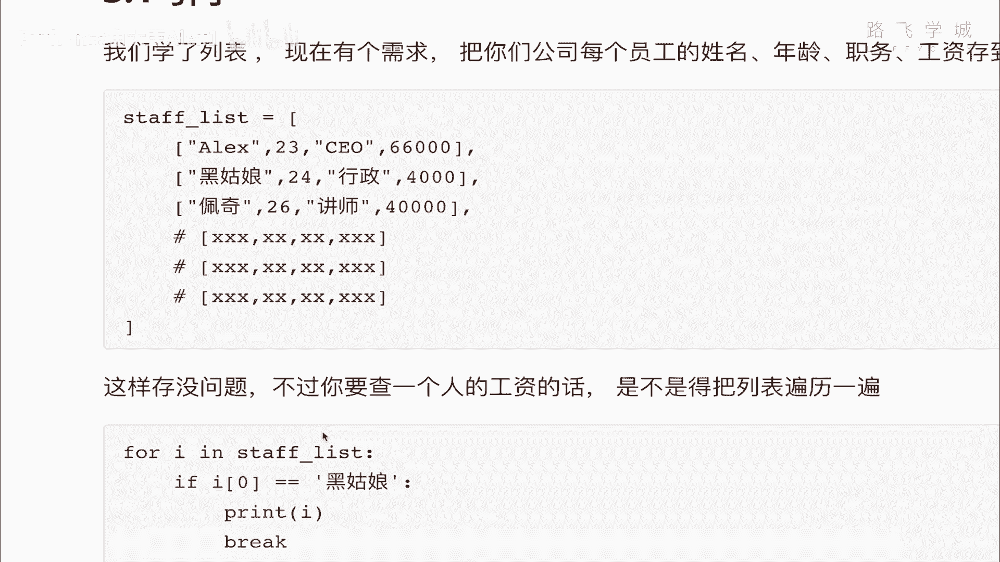

改成字典的一个模式就变成这样了。

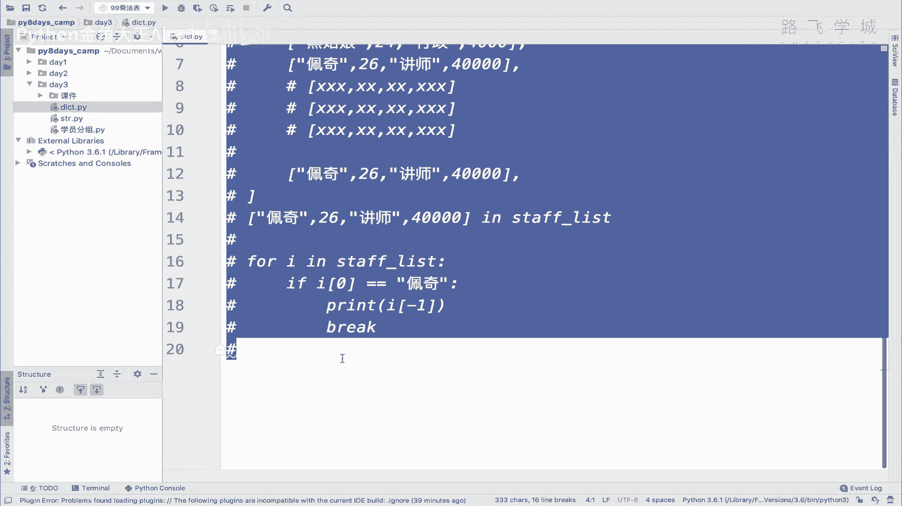

D i c，然后呢我就写一个空，这就是一个空字典，明白吗，这是一个空字典啊，空字典，然后往里边写值，减值的话呢，我在这里可以看，相当于我是不是根据名字去找这些人的一些，什么工资啊，年龄啊。

职位的信息是吧，那我就可以直接把名字作为K，比如说ALEX，然后后面看到冒号，后面是value value，后面你可以跟任何值，可以直接分字符串，也可以跟列表都没有问题啊。

我value我就直接把这个copy过来，可以看到没有，啊我可以把这个copy过来，大家看，这样其实也相当于把信息存好了，然后呢，我可以这个黑姑娘也可以给他这么copy过来，写在后面。

黑姑娘给她移到这里来，看到没有，黑姑娘也是一个K了啊，加上逗号加上逗号去掉，那接下来再有一个是什么呀，佩奇把佩奇给它copy过来，然后稍等，漂亮啊，Ok，大家看这样的话，我就生成了一个看到没有三对啊。

三对k value的那么一个字典好吗，那这个时候注意了，我告诉你，我要想去查值，你现在想象一下它里面有1000条啊，我想去查佩奇在不在，就很简单了，就很简单了啊，你就用一句话，直接是佩奇。

你直接是print这个什么呀，佩奇in这个D看到没有，这就像判断列表里有没有一个元素一样，你直接print它就直接给你打印出来了，说在不在就在里面明白这意思吧，也就是这样的话，他可以他可以很容易的就去。

说白了他他也不用去循环，他就立刻给你取出来啊，底层的原理，你说为什么这么立刻取出来，你先先不用管，你就知道他立刻就能取出来啊，不需要循环1000遍就可以找到了，哎这就是字典的一个好处。

可以存这种复杂的信息，然后可以进行快速的查询，明白这意思吗，OK啊那明白了它的一个基本的语法之后，我们来看一下它的这个啊一些什么呀，一些特性一些特性好吧。

首先呢首先呢它是一个key value的一个结构啊，讲清楚了是吧，什么K什么value，然后他这个注意了啊，value后面可以跟任意值任意值学的字符串啊，数字啊，列表啊啊包括甚至再跟一个字典都没问题啊。

可以跟任何值，然后K呢K会有要求，K是说你必须跟不可变的数据类型，什么叫不可变的数据类型，咱们讲列表是不可变的，里边某个元素可以改，但是字符串不可变，对不对，你不能改任何值啊，那数字也是不可变的，好吧。

我们学了的已经学过的就是字符串和数字啊，已经学过了，当然以后还有其他的，但是现在已经知道，所以呢啊你的现在咱们学的这些数据类型里面，你只能拿字符串或者是啊，这个K来这个什么什么什么字符串或数字。

来当做这个啊他的key，但是你是你不能拿这个列表，比如说我在这前面拿一个列表来当K是不行的，一会我们试一下好吧，然后呢同时还必须是唯一的，什么是这个K必须是唯一，也就是说你这个name只能写一条。

你在这里再写一条，他不会报错，但是啊相当于你你就我我问你啊，他你你告诉我，你这里写了两个内幕的话，他到底去找这个还是找这个找你，下面又写了一个，明白我意思吧，所以它的K必须是唯一的啊，必须是唯一。

就像你查字典，你那个前面那个索引对吧，你比如说宝盖儿，你只能在索引页有一个宝盖儿，你现在才出现了五个宝盖，那到底指向哪个呀，明白这意思吗，所以他K必须是唯一的好吧，所以我们我们可以先试一下。

这个不可变的数据类型啊，用列表来当K试一下好吧，列表来DK啊，你比如说我们直接啊直接在这里啊，存一个KD等于一个这个K是什么呢，K是可是ALEX是吧，这就是一个小列表，然后我们在这里随便写好吧。

咱们就来验证一下这个列表能不能当做K好吧，大家看他直接就报错了，报了一个错，什么UNHABLE啊，这是不能哈希的什么类型，你现在不用管，但是我告诉你，反正他就是不行。

是不是啊啊因为它是一个可变的数据类型，OK啊，可变为零，它是不能当做啊K的三个K的好，这是一个另外一个，就是说它还不能什么呢，它不能这个重复啊，不能重复，比如说我在这里再加了一个黑姑娘啊。

再加了一个佩奇，你看是不是有两条配齐了，咱们看看他报错吗，咱们看看她报错吗，啊哎两二写的还值不一样对吧，值不一样，但是K是一样的，它报错吗，大家看他没有报错，对不对，它没有报错，但是我问你啊。

这个时候没有报错，但是它重复了，我到底是取的时候是取这个呢，还是取那个呢，咱们可以来试一下好吗啊，就直接顺便把这个叫什么呀，叫这个叫取值啊，从字典里取值也讲了，取值怎么取呢，直接print。

看着DIC中括号啊，列表中括号的时候里面写元素名，是不是写写写这个索引名索引是吧，01201或者什么的对吧，但是字典在这里加中括号，直接写了个什么呀，K值你直接写配齐，看到没有，直接写佩奇。

它就会把后面的value打印出来，叫value打印出来，然后我们看看他打的哪个呢，大家看他打的这个，也就是说你重名了，他虽然没报错，但是他会把上面的覆盖掉，看这意思吧。

所以它只会保证这个字典里也就真正存进去的，只有这一个值，OK吧，只有这一个值，它会把之前的覆盖掉，所以啊K必须是唯一的好不好，这是另外一个特性，那接下来啊第三个就是它的value可以存。

就首先你字典里可以存多个value对吧，多个key value，多个key value应该是啊，然后每个这个value是可以随便修改的啊，value是可以随便修改的，也就是sorry随便啊。

任意数据类型的什么可变的。

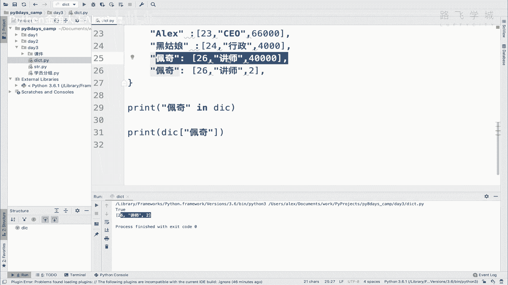

不可变的都可以放在这儿好吗，接下来是无序啊，这个要强调一下字典是没有顺序的好吗。

字典它是不按顺序，因为它的这个呃这个怎么讲，这个这个K它不像这个索引是什么，01234的结构，这个K它它是没有任何他俩之间没有任何关系，没有这个什么谁先谁后，像零和一这种数字之间的对吧，谁先谁后的关系。

大小的关系，这些这些都是没有顺序啊，互相互相没有什么一些一些大小比较关系的话，他就没办法排序，所以呢啊怎么讲字典啊，字典它是没有顺序的，无序好吗，具体底层的原理啊，是因为有什么哈希呀或者什么的。

那些那些东西我们还没讲，这节课也需要不了，你就知道它是无序的就可以了，好吗啊，这是它的一个特性，所以你要想让它有顺序，你只能啊用列表的数据类型啊，用列表的数据类型，或者是我们以后会讲一个叫什么呀。

Ordered order the dict，就是一个什么呀，它是一个有序的字典，就是可以可以做有序的字典，但是EDED忘了啊，EED总之它可以做有序字典，但是默认它是无序的好吗，另外一点啊。

这个叫什么呀啊，查询速度快，且不受大小的影响，且不受字典大小的影响，什么意思，也就是说咱列表有如果有1000个值，列表有1000个值啊，那你查询速度对吧，你查一个值可能就会查1000次。

就嗯就会开始变慢，比100个这肯定要慢，如果你列表有100万个值，那你查询肯定更慢是吧，但是字典不会字典，你有十一千个值，1000个K还是有1万个，还是有100万1亿个，查询速度几乎都是一样的。

几乎都是一样的，OK吗，特别的神奇，你说我1亿个数据，我从1亿个人人人里面迅速找到一个人，怎么可能，怎么可能和从100个人里面找到一个人的速度，一样快呢，哎这就是算法的魅力啊。

通过一些数学上的这种算法就可以实现，即便是1亿个人，我也快速的给你找出来，明白吗，所以为什么说算法工程师工资很高啊，因为他们确实是解决效率问题的，明白吗，所以啊这个这个后面我们学完哈，希这个东西之后。

它是一个它是一个啊单独的数据结构，学完这个之后，你就理解啊，为什么查询速度快，你先知道它快就行了，好不好，哎我们学会了它的定义和它的特性好吧，就是它的定义和特性之后。

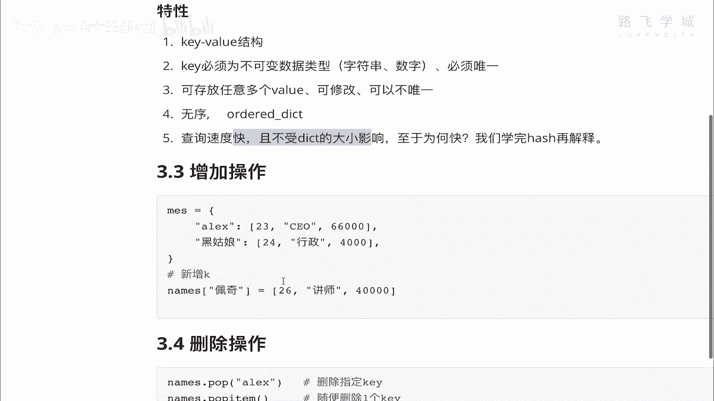