# 【2024年Python】8小时学会Excel数据分析、挖掘、清洗、可视化从入门到项目实战（完整版）学会可做项目 - P40：12 秒懂16进制 - Python金角大王Alex1 - BV1gE421V7HF

OK同学们最后再学一个16进制的知识，咱们就可以做咱们的作业去啦。

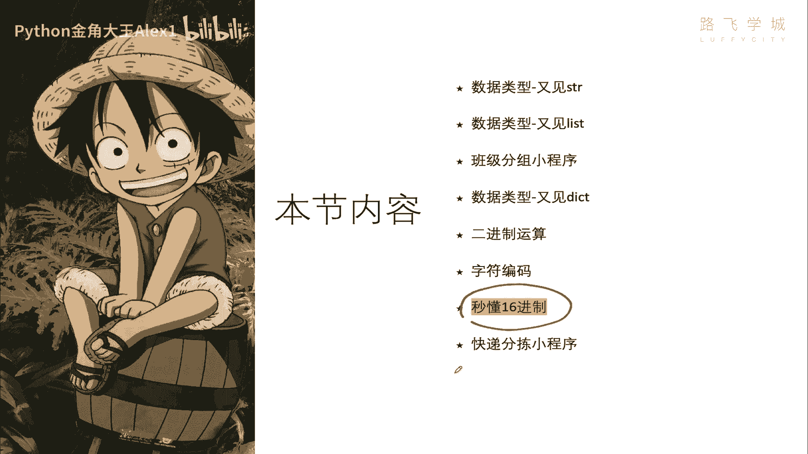

16进制啊是个什么东西呢，首先我们学了我们知道十进制，然后我们学了12进制，Authorry，二进制，二进制，那16进制他俩都有一个特点，逢十进一，逢二进一，16进制就是干嘛呢，逢16进一啊。

逢16进一，那他用怎么个表示呢，用数字啊，0~9，然后0~9之后呢，接下来它不是逢16进一吗，后面的东西是什么，用A到F或小写A到F就行了来表示，所以呢16进制就是这个样子了，看到没有。

从零到F1共16个值，看到没有，一共16个值，然后他跟十进制的对应关系看到没有，前面是一样的，后面后面就是看十十，就是A11就是B是C哒哒哒哒哒，还有同学说这玩意儿有什么用啊。

计算机里啊用16进制的东西，还用16进制的地方还挺多的，还挺多的啊，具体原因咱不在这里解释啊，因为又会扯很远很远很多啊，扯俩小时，但是我告诉你他的，咱们先知道它的现象，就是说计算机里很多地方都用到了。

这个16进制，明白吧，那16进制它啊，比如说在这里，你看啊这个咱们后面学这个网页开发，网页开发它里面的这个呃什么样式表，就是cs这个颜色表就是16进制Mac地址，然后以及字符编码的表示，它都是16进制。

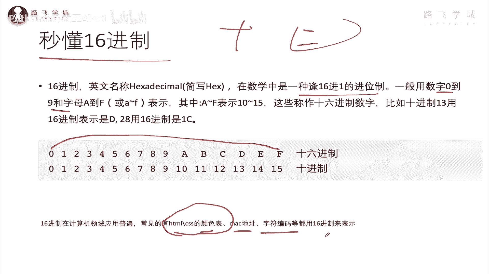

我给大家大概看一下啊，看一下，首先呢我在咱们切到咱们这个啊。

这里先看Mac地址。

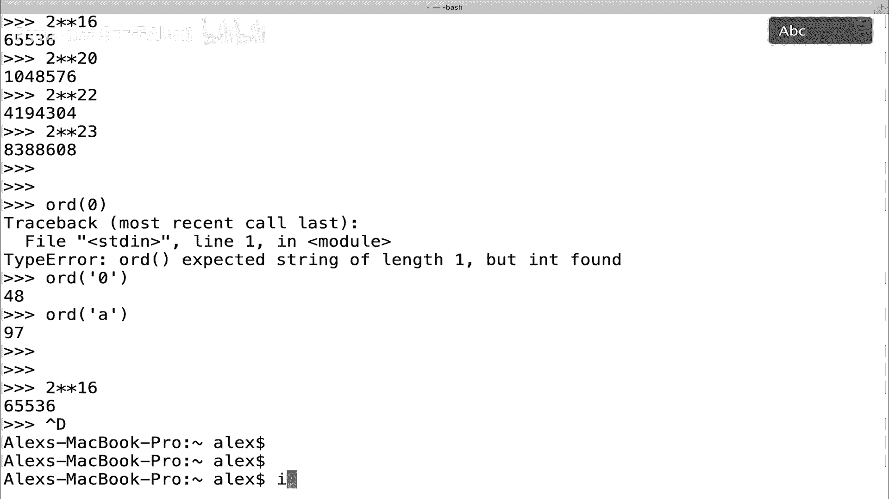

If config，看CONFIG。

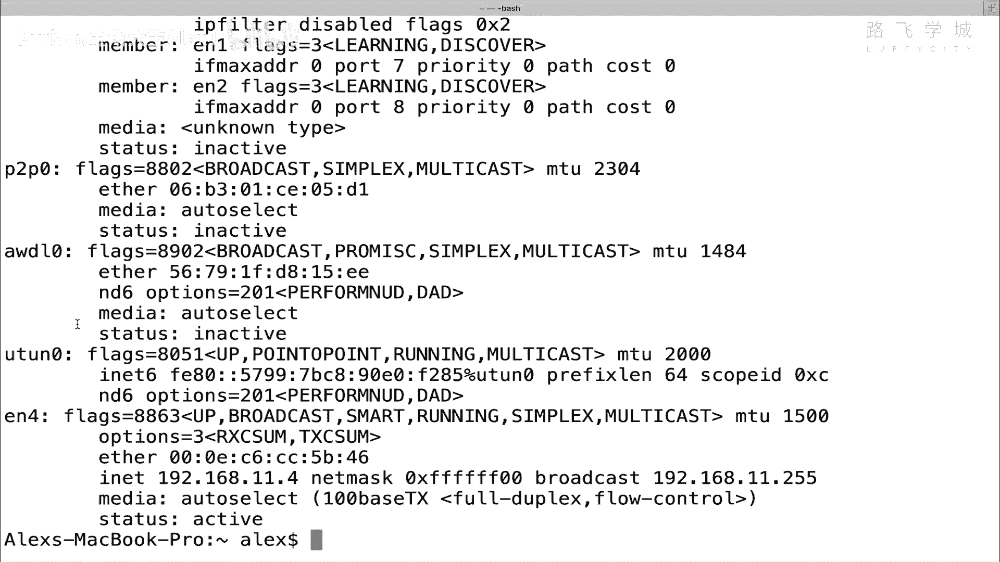

我打开找到一个我的网卡，电脑的网卡来啊，随便找一个吧，大家看这个东西看到没有，这个东西我们称之为网卡，称之为Mac地址，你没你不了解没关系，这就是一个你电脑的地址，就跟人的身份证一样啊。

那这个地址看到没有，什么C4C4就是16进制数啊，C就是一个16进制数，四是一个C4，看到没有啊，B30，这都是16进制。

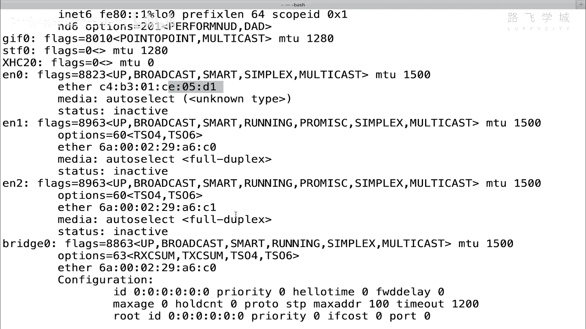

明白这意思吗，然后我们再来看我们的这个啊网页啊，网页的开发来打开一个网页，然后呢随便打开一个网页，然后哦怎么怎么打开呢。

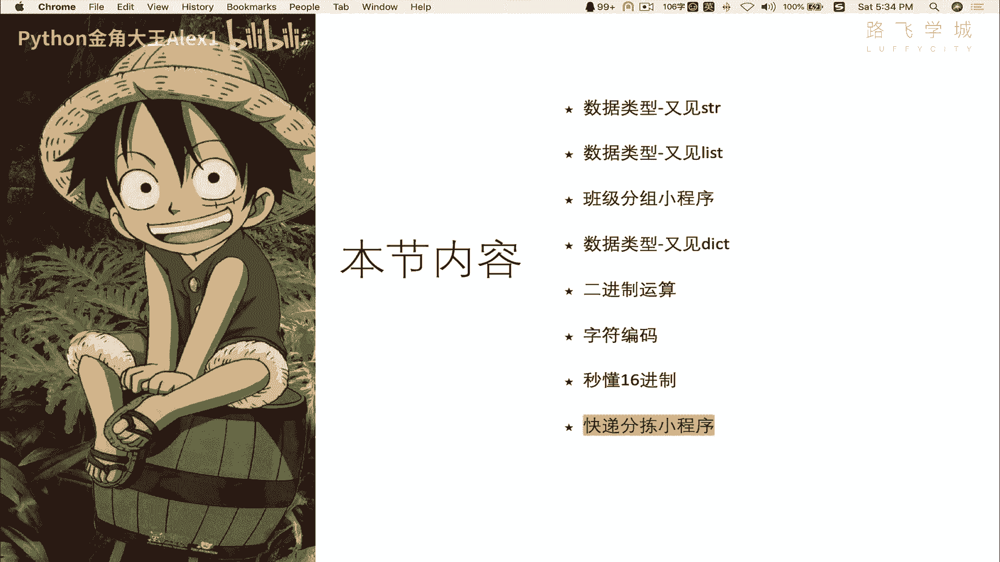

显示不出来呀。

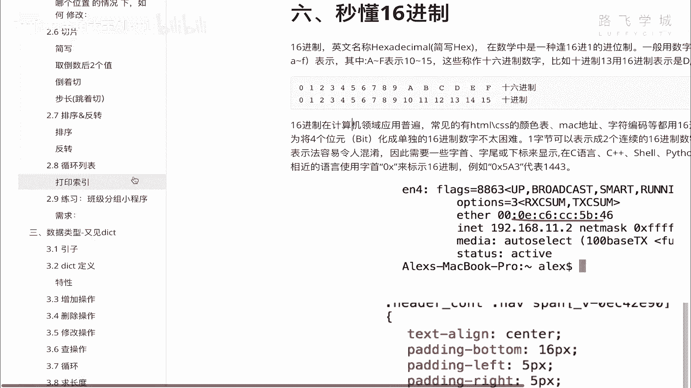

稍等啊，诶我先把这个给他取消掉。

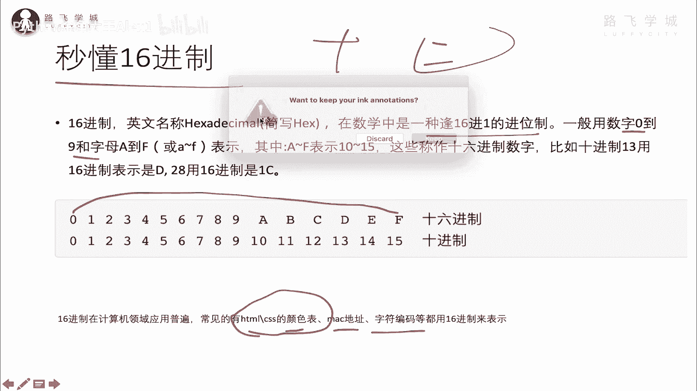

然后找到一个网页，大家看，我把这个视频还传上去了，大家看我们在这用单机啊。

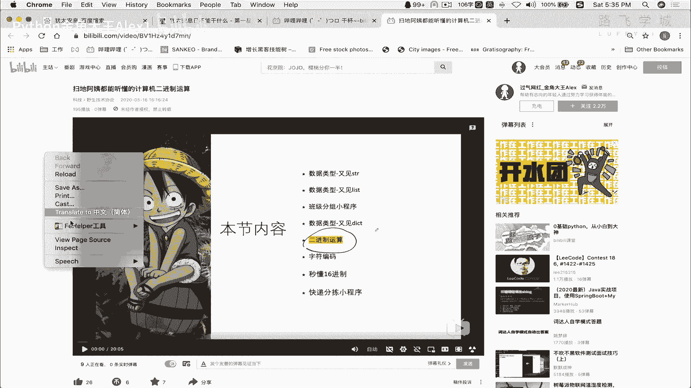

看一下审查元素啊，审查元素，然后呢，随便找里面的一个这个这个这个这个充电，这个按钮啊，我一点到这儿，他就会把源码定位到这儿，你不需要理解这个我们后面过几天会学这些啊，网页开发的语言。

它是不是Python呢，它是单独的语言，然后呢我就跳转到这这个按钮，就是这个代码写出来的，让大家来看一下这个东西，看那个color了吗，看到color了吗，他就是看到这个值了吗，这个值后面FB什么的。

它就是16进制的表示形式，明白这意思吧，然后我还可以改它的颜色给改了，看到没看到没看到没，看这个充电这个东西是不是颜色跟着变化，可以随便调，Anyway，这就是16进制的啊。

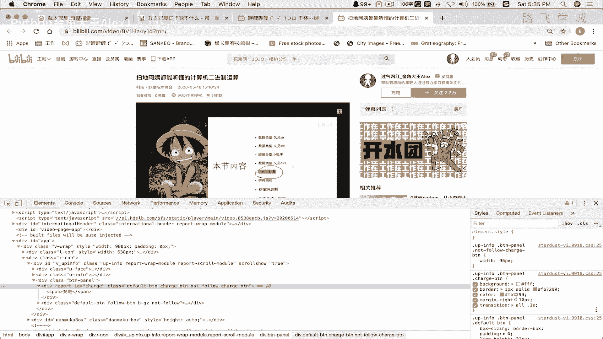

颜这个表示表示这种颜色好吧，所以16进制在很多地方用啊。

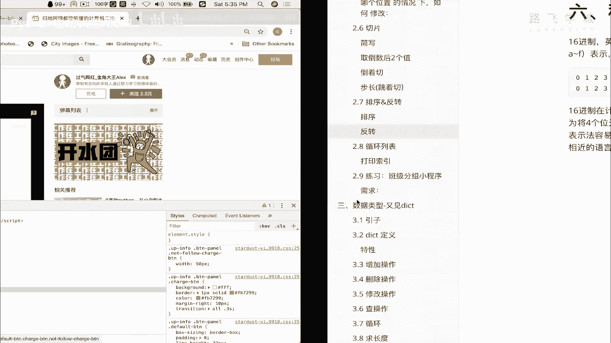

包括我们的字符编码，字符编码其实我在写中文的。

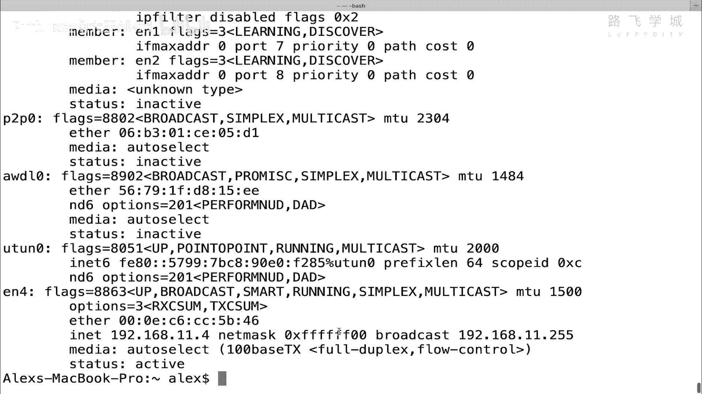

在那个还记得我我我在那个应该是在这，大家看我这里是不是上节课，这个我我用python2写中文的时候，是不是报了一个错对吧，报了一个错误，我写的这个是中文金角大王，然后他出现了一个什么。

这个correct x x斜杠X1FE9，注意了，斜杠X开头就代表是说来告诉计算机，我这个是个16进制，什么是16，后面这个值是16进制，E9是16进制，明白意思吧，1944619sorry。

对我斜杠X是告诉计算机，我后面是16进制，然后E9是16进制的值，明白吗，为什么我咱不说字符编码，就是用这个16进制来表示吗，你看是E9，他们为什么没显示说什么经验或者什么的对吧。

它就是这个字符编码用16进制表示的，你知道就行了好，所以以后呢为什么讲这个，因为后面我们的知识里面可能会遇到，有些东西是16进制显示的，哎你看这个别慌了。

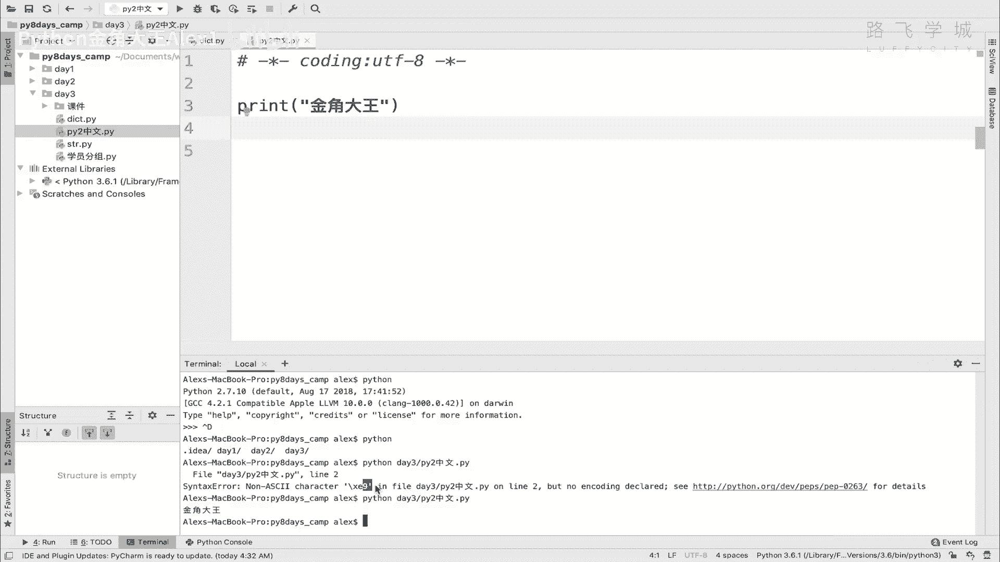

你就知道它是一个正常的数，这个进制表达就可以了，好不好。

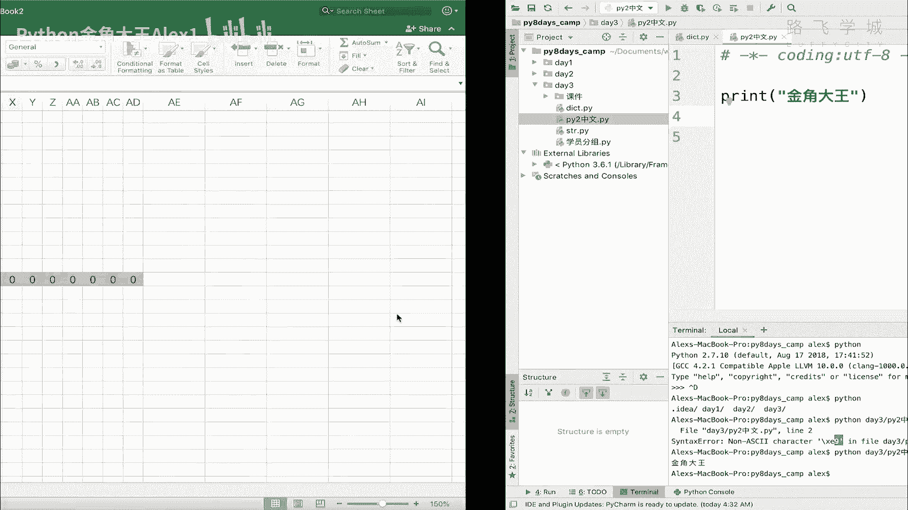

OK那同学们啊。

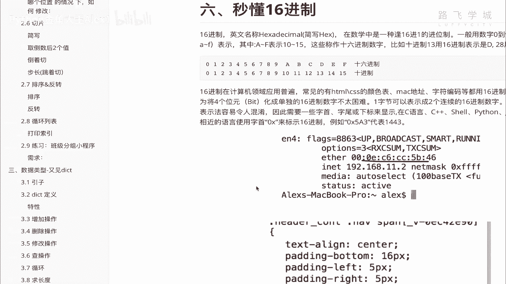