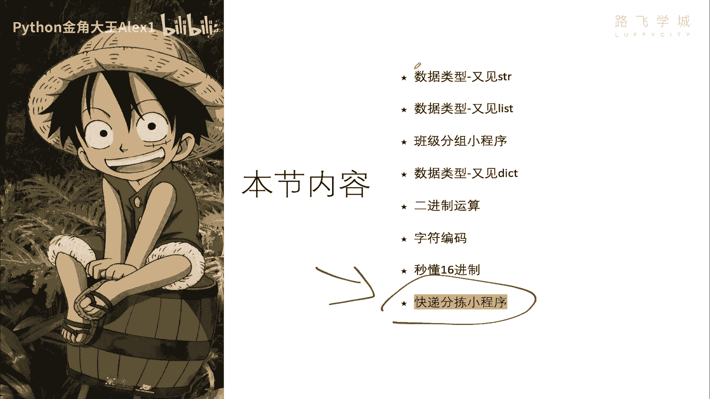
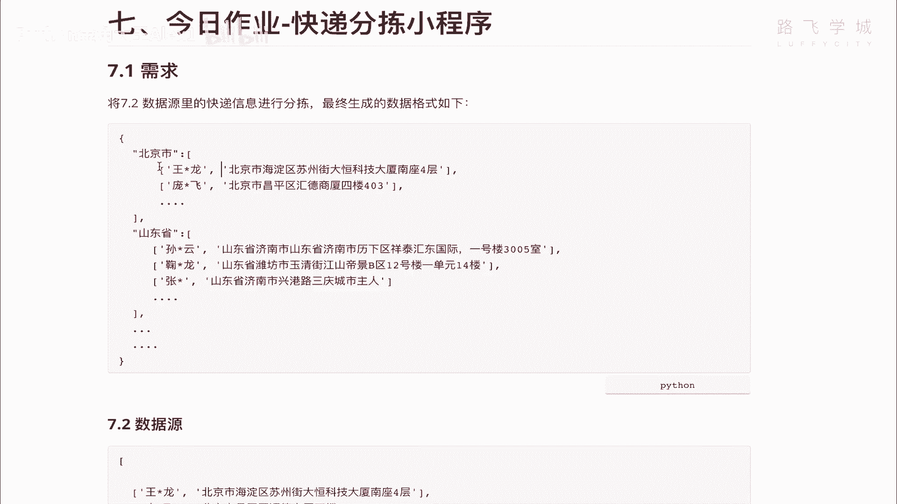
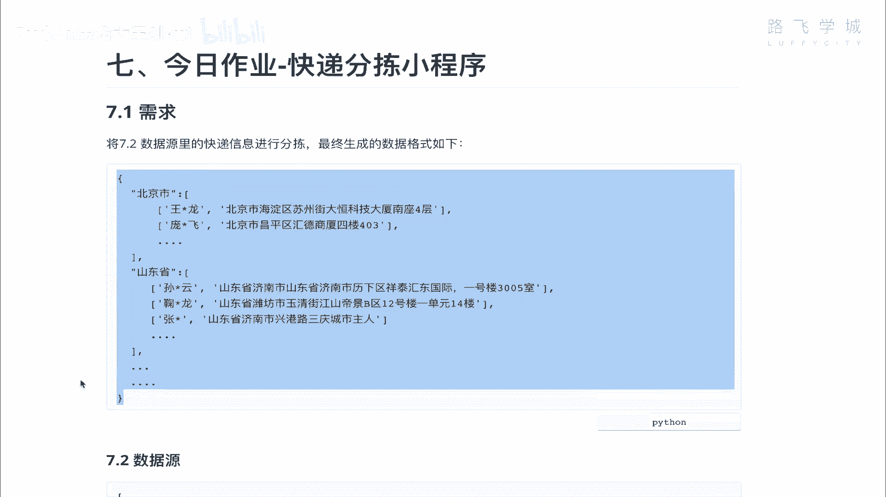

# 【2024年Python】8小时学会Excel数据分析、挖掘、清洗、可视化从入门到项目实战（完整版）学会可做项目 - P41：13 东风快递分拣程序 - Python金角大王Alex1 - BV1gE421V7HF

OK同学们，终于到了咱们这一天的最后一小节，就是写一个快递分拣的小程序，同志们，同志们，不过不是我来写，是你自己来写，哈哈是你自己来写，你已经学了前面这些知识了。

你自己写是可以写出来的，直接告诉你需求，告诉你需求啊，那个需求是这样看着啊，需求是这样，我要求你把7。2数据原理的快递信息，进行分拆，最终生成以下这种格式，先看2。7的数据源，7。2的数据源。

它是一个大的列表，看到没有，大的列表里面每有一条条的数据，调的数据里面是分，又是小列表，然后一个两个元素，第一个是姓名，第二个是它的真实的地址啊，我都把敏感兴趣啊，把人家名字给隐藏掉了，OK同学们。

你要做的事情，就是把这个大列表的这种格式给我对吧，因为你这个各种快递公司啊，他肯定你收到一个这样的列表，那那你交给快递员对吧，那那个快递员说我操，我是北京的，你把河北的快递给我干嘛呀，是不是啊。

所以你肯定要做分拣，分娩之后呢，把北京的给北京的快递员，把上海的给上海，河北的给河北，所以分娩出来的结果我就要求你按这种按，你就不用分，后面这些市的你就先分出省的一级一级的是吧，先分成先分出省的啊。

这个北京市就是直辖市嘛，算省的级别，然后山东省，北京省，河南省对吧，省下面一条一条的就这么，你只要分成这样更复杂一点的，就是分成两级，对不对，这个北京市下面什么昌平区，海淀区还在能分。

但是我不要求你做那个。

你现在做不出来，你只要做出来这个就可以了，好这是给你留的一个作业，给你留了一个作业啊，你做完了之后必须交上交，上完之后呢，我们会给你批改批改，那包括我直播的时候呢，也会给大家讲这个作业的实现。

你你一定要自己先做，还是那句话，光看视频没有用，你一定要跟着不断地写，不断的练，才会达到一个啊学习的效果好吗，那大家你这个啊憋一个小时，你应该就能做出来啊，就应该能做出来，OK那个good luck。

今天咱们就到此为止。

