# 【2024年Python】8小时学会Excel数据分析、挖掘、清洗、可视化从入门到项目实战（完整版）学会可做项目 - P44：03 gbk的文字如何在mac上正常显示3 - Python金角大王Alex1 - BV1gE421V7HF

OK同学们，那咱们还是回到python3上啊，继续探讨这个问题，那第一种办法咱们试过了，就是转成unicode python3直接支持UNICODE，所以呢就可以正常显示，第二种办法是转成UTF8啊。

这个啊Mac系统是UT8的格式是吧，咱们转成UT8也可以正常显示，对不对，那这个但是转成UL8怎么转啊，转成UI8怎么转，那你转这个阿斯克转这个叫叫UNICODE万国码，那是没问题的。

因为GBK跟这个万国码有这个映射呃，呃用映射关系对吧啊，就UNICODE跟所有语言映射关系，所以GBK可以直接转成内扣的啊，有一个对应关系，但是GPK跟这个UTR8没有任何映射关系，对吧，没有任何关系。

那可怎么办，哎那其实也不难啊，很简单，就是GBGBK是跟UNICODE有这个映射关系，对不对，然后UNICODE是不是跟所有语言有映射关系，UNICODE再转成UT吧就妥了，看到没有哎。

所以你要想转成UT8，必须先把GBK转成UNICODE，再转成6。8，那问题来了，说UNICODE是不是在第一种里面，UNICODE已经可以正常中文显示了对吧，也就转成UNICODE就可以显示了。

我还有必要再转成UTF8吗，再转成UTF8，那不就是多了一步了吗，没错确实多了一步，那你就是脱裤子放屁，多此一举没有意义了，没有意义了，但是真的是没有意义吗，啊真的没有意义吗。

其实在特定情其实是有意义的，既然提出来一个方法对吧，真的没有啊，转UTL8的意义吗对吧，当然是有什么情况下是有呢，先要理解UTL8的作用，UT8是为了在UNICODE就是保存的时候保存到哪。

保存到文件或者是进行网络传输的时候，又节省空间的一个作用，对不对，U台湾是为了节省空间的，也就是说我一段GBK的可以，你可不可以理解，我把一个1GBKGPK的文件打开了，读到内存里变成UNICODE。

然后我要再存存成UTL8对吧，我再存的话，你就默认存在UI嘛对吧，UI8之后，那你就需要转是吧，你sorry你要承认VT8UTL8你就得需要转，为什么要存UTF8，你说我继续存GBK不行吗，可以。

但问题在于怎么讲，你在你的Mac电脑上麦克默认就是UK8对吧，你如果存的时候就是你这个文件，你你你你你你你存到内存，存到硬盘上，又又用这个GBK，那你其他软件打开它也是乱码，就像我们的python20。

咱们讲到的是python3里面对吧，python3里面这个所有字符默认UNICODE，所以它会自动把JDK转成UNICODE，但在其他语言里，其他软件里它不一定是这么设置的，明白吧。

那其他软件打开那个GBK的文件依然会乱码，明白意思吗，所以我们就直接在存的时候，统一在Mac电脑上全都存成UTL8，那这样的话在他用任何软件，不光是Python其他软件打开这个文件，它也不会再乱码了。

能理解意思吗，所以啊所以啊当涉及到保存到文件的时候，是需要传承这个UTF8的，明白意思吧，UTF8的那好，咱们就来学一下这个整个的一个过程。

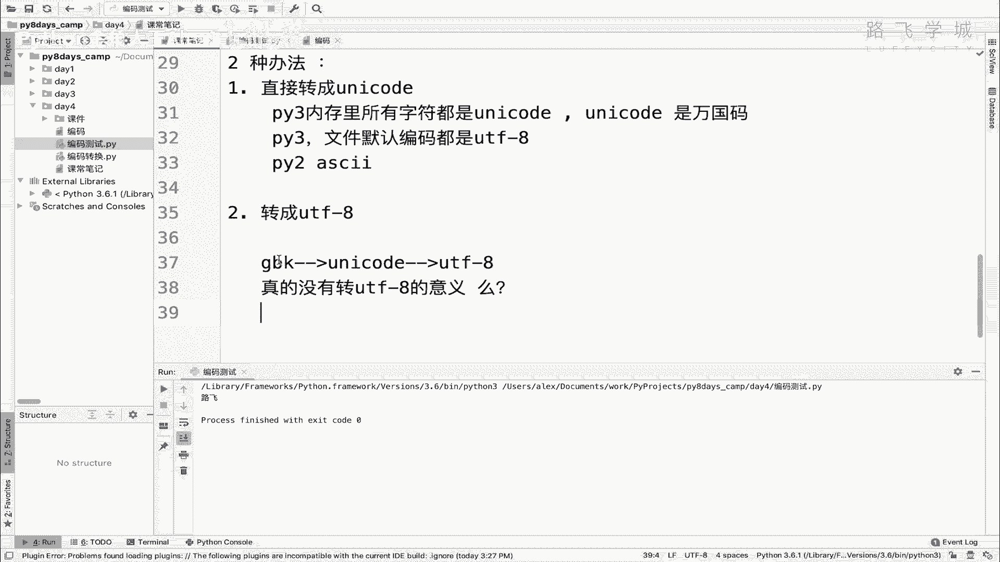

咱们讲过说所有所有的这个在这里看这个图吧。

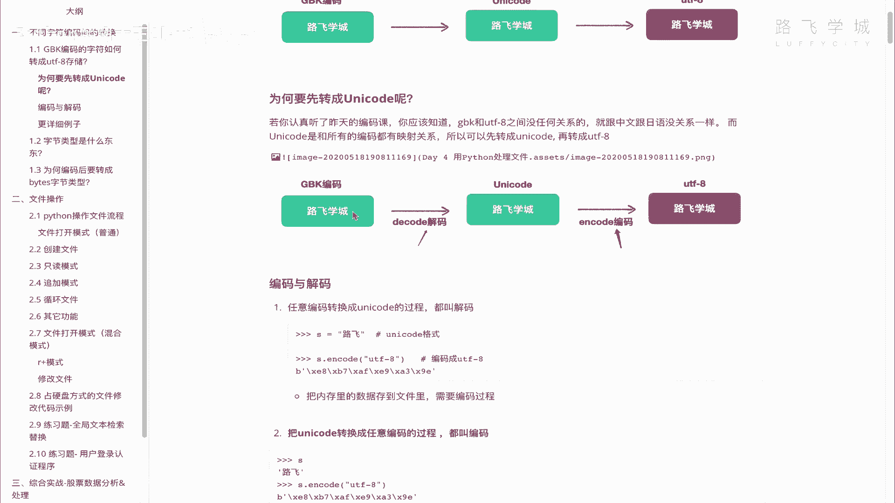

所有编码到UNICODE都叫解码，所有就是UNICODE到所有的编这个啊，其他的语言编码都是一个编码的过程。

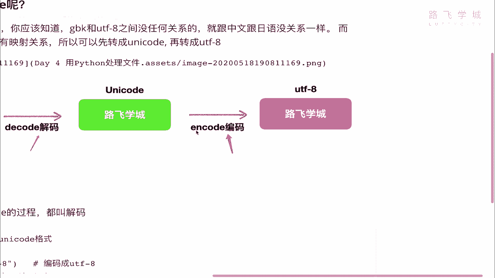

对不对，所以我们现在干的事啊，用python3来去演示。

来用python3来演示的话，我们就直接在这好。

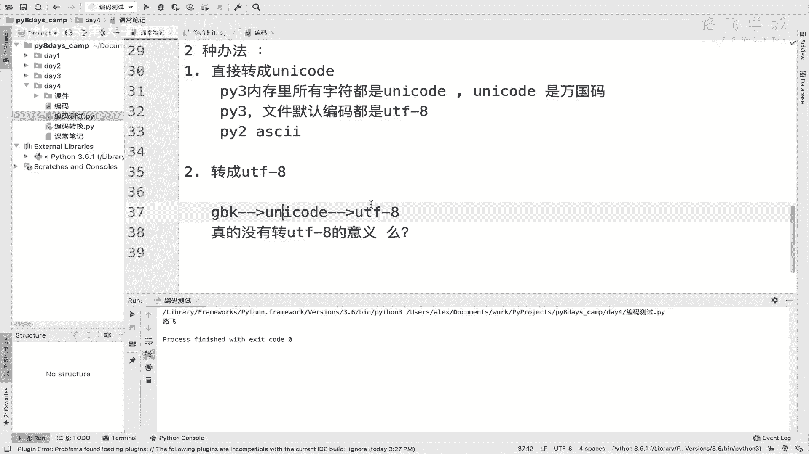

我们先生成一个字符，这个字符叫路飞，注意了，但我这是python3，所以每一个字符在内存里都是什么UNICODE，所以这个字符它本身是一个UNICODE格式，只不过我们现在看不出来，看不出来啊对吧。

在python2上能看出来，在python3上它就是一个普通字符。

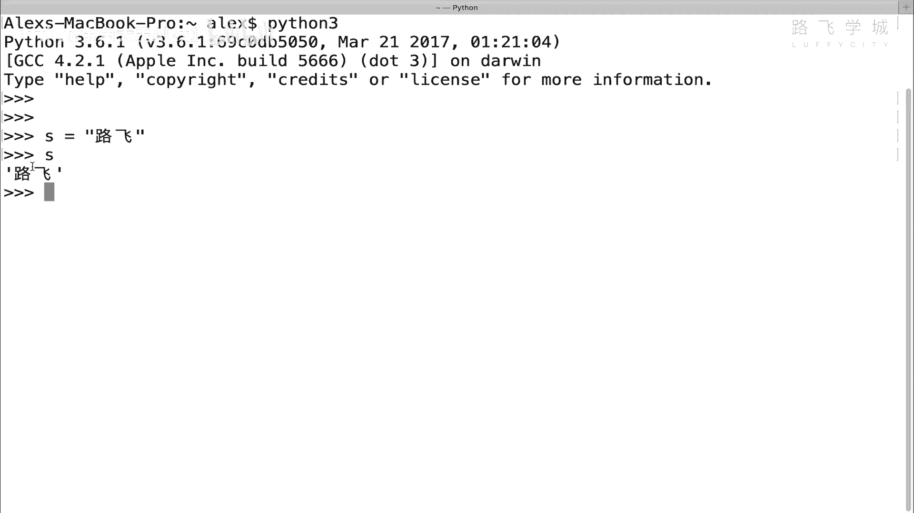

但只要是普通字符，它就是UNICODE好吗，所以现在这个字符的状态是这里在这，所以你要想把它最终转成UT8的话，就不演示那个过程，你要先干嘛，先把它变成GBK，再通过GBK解成这个UNICODE。

再转成这个uni吧，我只是为了给你演示这个过程，因为我在python3上没有办法直接生成GBK，对不对啊，所以我要先通过UNICODE写啊，解编码成GPK好吧。

那就直接encode看到没有，然后encode告诉这个函数说我要把它编码成GPK，看到没注意很关键，代码即可来，同志们就出现了一段这样的东西，有同学说这是不是又乱码了，告诉你不是乱码。

看前面这个B开头了吗，这是我们一会儿要学的一个新的这个数据类型，叫字节类型，字节类型哎咱们不是学了字节吗，这你可以理解为它就是二进制类型，明白吗，他就是二进制，那你说二进制它不应该是010101吗。

没错它其实就是0101只，不过用16进制的形式给你表现出来了，注意了，它就是010101只，不过用16进制给你展现了，明白吗，为什么要用16进制展现的，因为0101大堆你看不清楚啊，太乱了。

这个16进制很容易分啊，斜杠X对吧，C2这就是两个16进制数，这又是两个16进制数，那一两个16进制数就是一个字节啊，具体为什么，咱们一会讲，反正你还知道它就是一个字节，一个字节，两个字节，三个字节。

四个字节，所以这是四个字节，明白吗，GBK是不是两个字节占一个中文，对不对，所以这是两个中文路飞OK吗，明白这意思吗，这就是就是路费，那好同志们，相当于现在这个就是一个GBK的编码啊，SJBK好。

那还有同学，Sorry，sorry啊，有的同学说怎么怎么没有没有，不不应该是这个呃叫叫叫叫乱码嘛对吧，就像在python2上节展示的，那怎么变成一个又一个二进制字节，这什么玩意儿，乱七八糟的，同学们。

具体为什么这样展示，不是说直接显示那个乱码格式，而显示显示成字节格式，我们一会儿解释，反正你先知道这已经是GBK了就行了好吧。

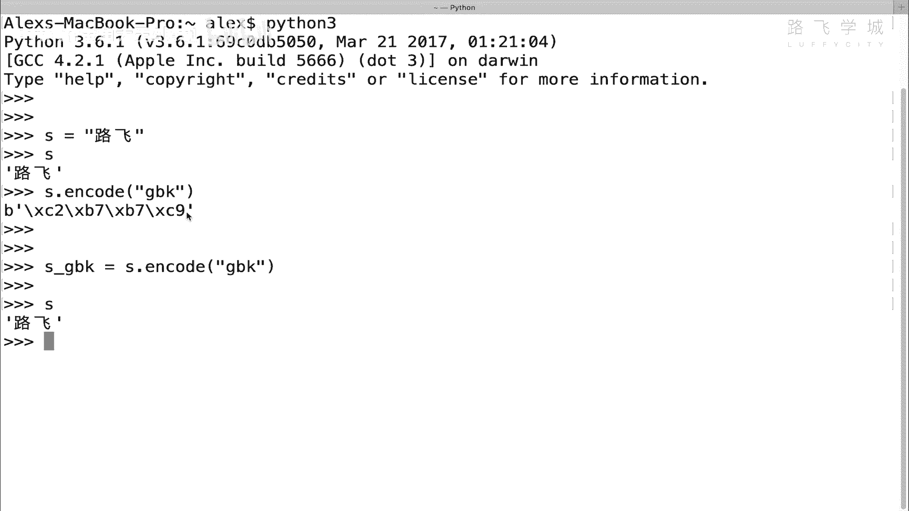

那现在你相当于处于这个状态，你现在已经是g pk了，那你就要做的事情是解码成UNICODE。

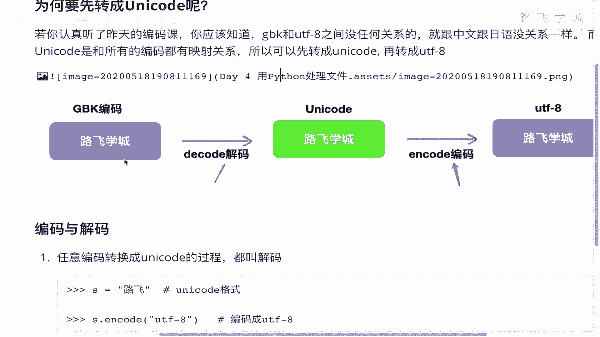

编码成UT8好吗，那你现在要解码成UNICODE的话，就是GBK点decode，是不是decode的时候，你一定要告诉人家，你是GPK，你要不不说的话，看着会报错，他报了一个什么错。

报了一个什么说这个UNICODE啊，不是UT8，这个不能呃进行一个解码啊。

什么意思，注意了，咱们看这是一个解码过程对吧。

你现在是GPK，你要解释unity code，但是python3里面注意了，你这个encode decode，你如果你默认，你应该就是你如果就是应该，你是要跟一个参数的参数。

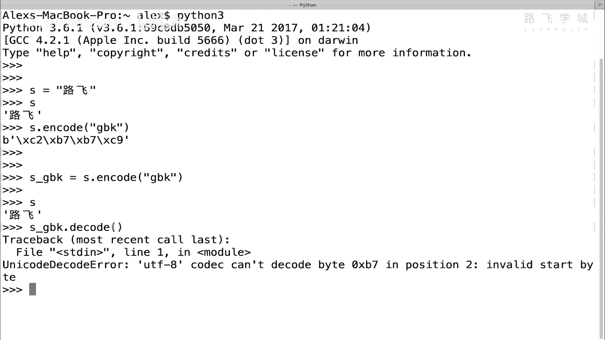

就是说告诉人家这个函数你是一个什么编码，但是你没说是吧。

你没输入，你没输入呢，它会干嘛，它会默认就用你python3的默认编码。

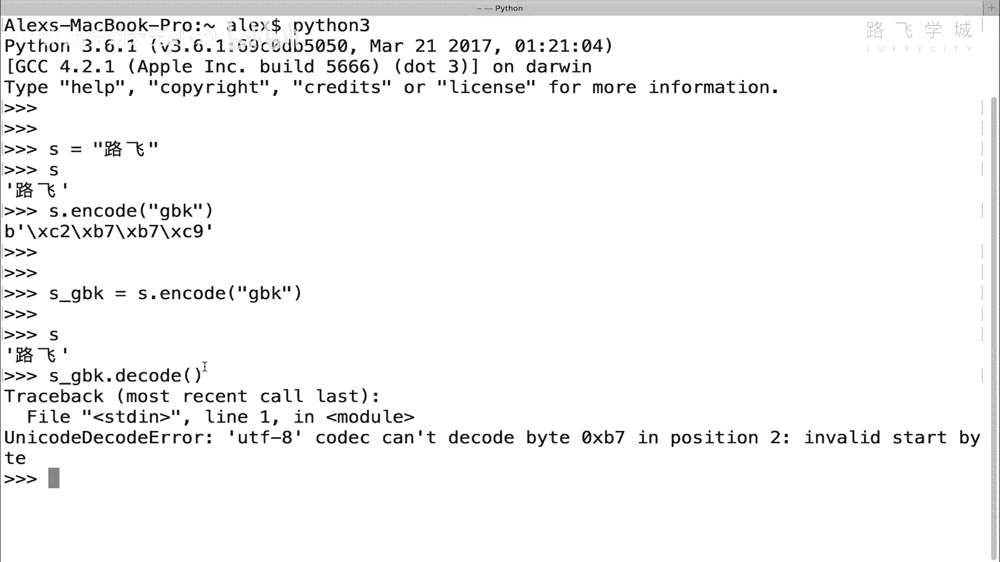

默认编码就是UT吧，明白意思吧，他就默认认为你啊，你就是一个UT8。

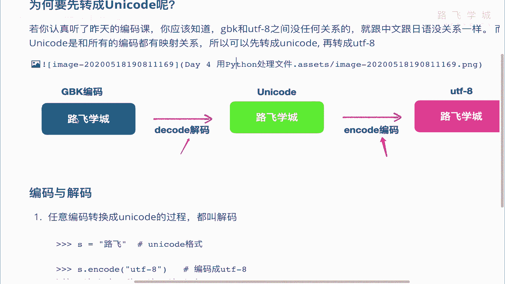

所以呢他就用U尝试用UT8去解你这段，解你这段g bk的字符，但很显然解不开啊对吧，因为这是GBK的，不是完了，所以他报错了，明白意思吧，像这种情况，你要指定告诉人家，我是GP。

所以你看就能解成UNICODE了好吗，这又是UNICODE，了解成UNICODE之后，接下来你要干嘛，带引code对吧。

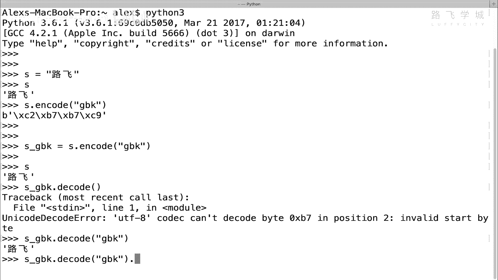

你现在已经是unit code了，你是不是要变成UT8，你就encode encode来。

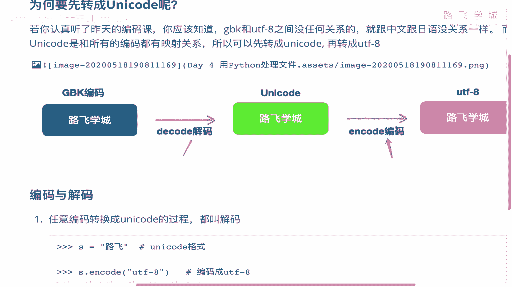

Sorry，在这里encode注意了，Encode，你其实这个时候你不跟的话，你不跟参数其实是没问题的，因为你不跟它默认就是把它编码成UT8。

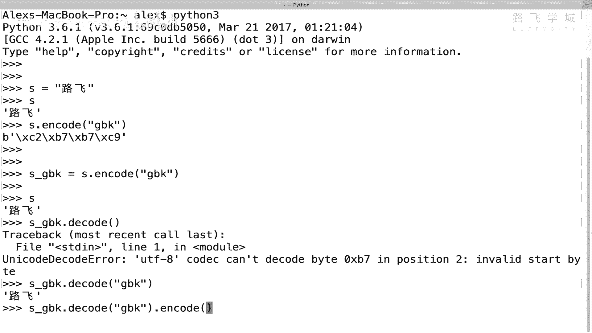

当然啊你看他是没报错的。

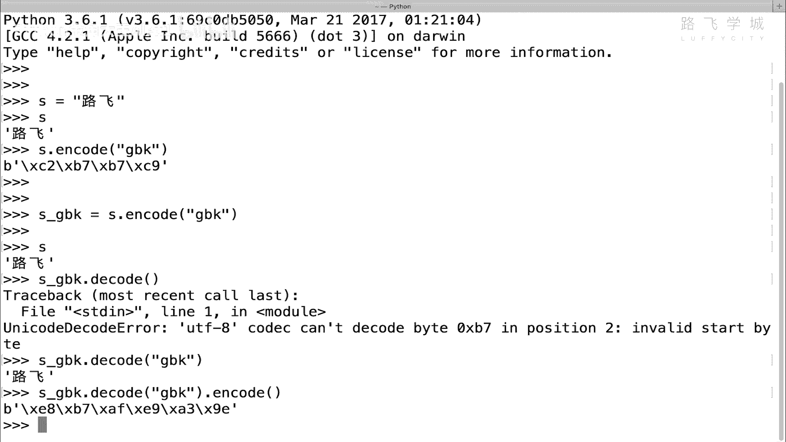

对不对，当然还是为了清晰，但还是跟上UT和杠八，看结果是一样的，对不对，那好又出现了一堆这个B开头的叫字节码的，字节类型啊，字节类型，那但是比这个明显多了，同志们啊。

这个咱们刚才说两个这个斜杠X就是一个字节，对不对啊啊sorry，是一个就是一个字节，两个就是两个字节对吧，它一共四个字节，你看这里几个字节，三个六个好，我们讲过GPK中文占两个字，占两个字节。

U t l8，一个中文占三个字节，路飞在这里就变成了三个字节UTL8里，所以他一共是六个字节，所以这是一个UT8的格式，明白这意思吗，明白这意思吗，OK同学们，这个就是啊这个这个这么一个转换的一个过程。

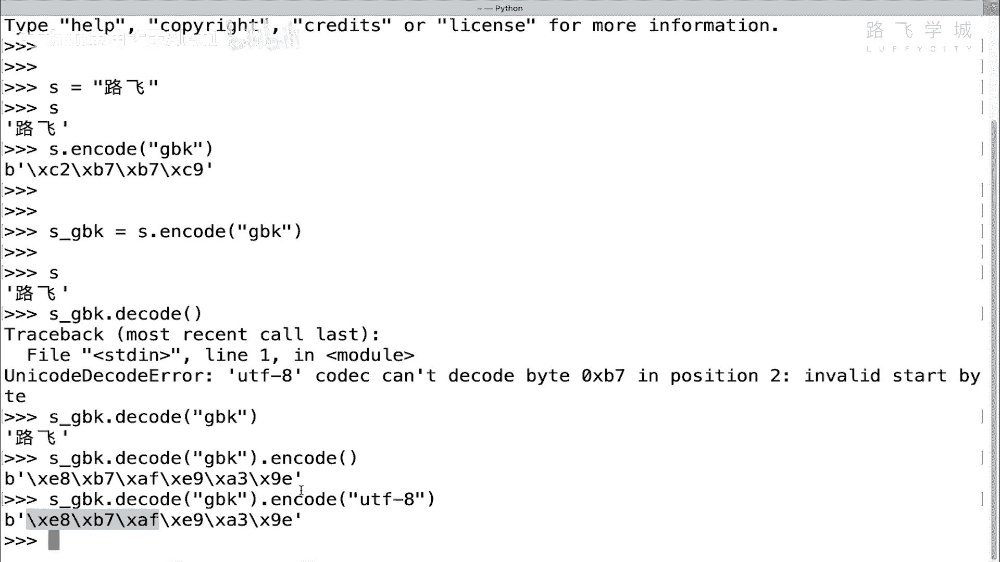

转换的一个过程。