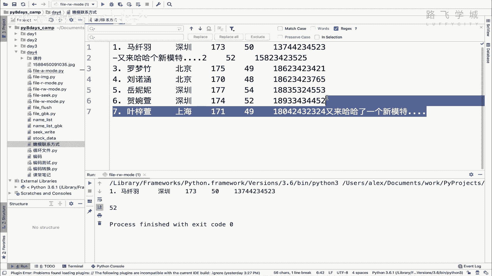
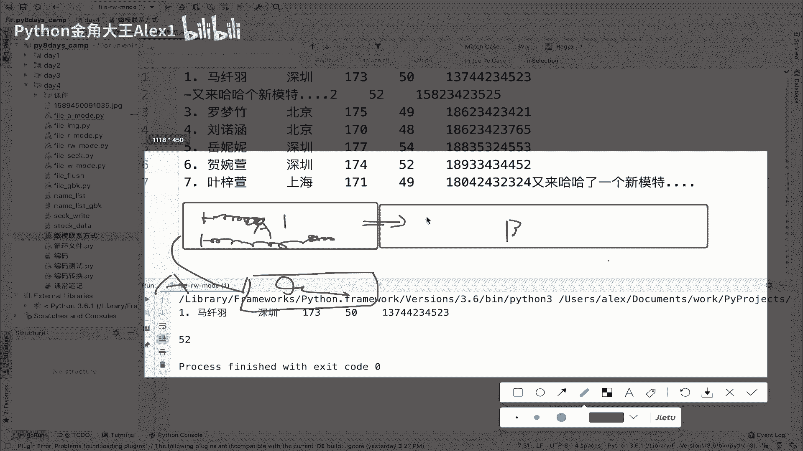
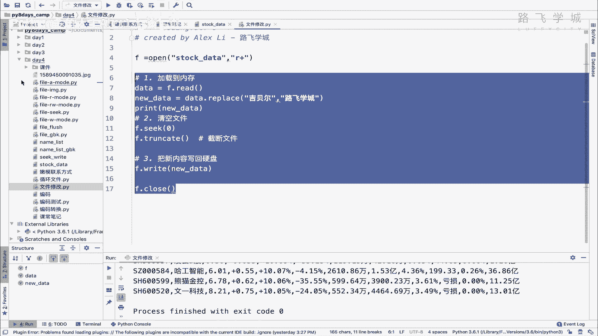
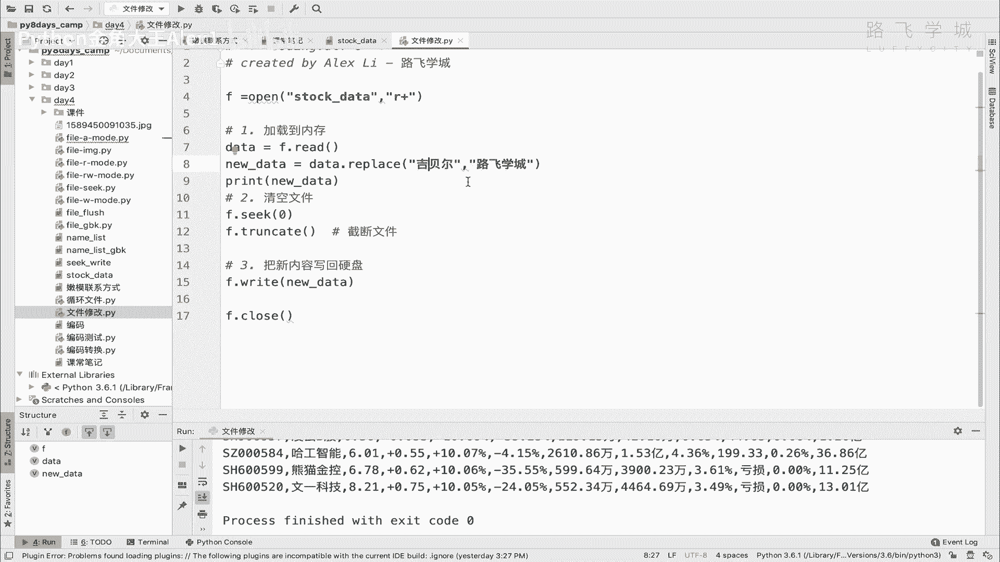
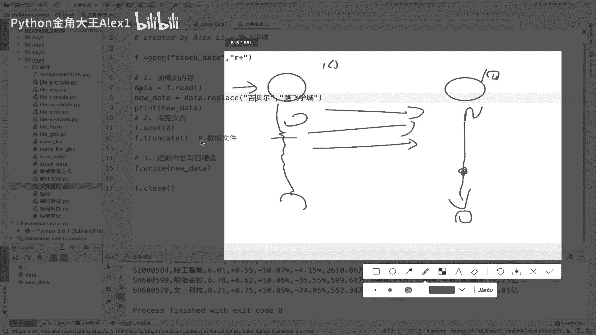
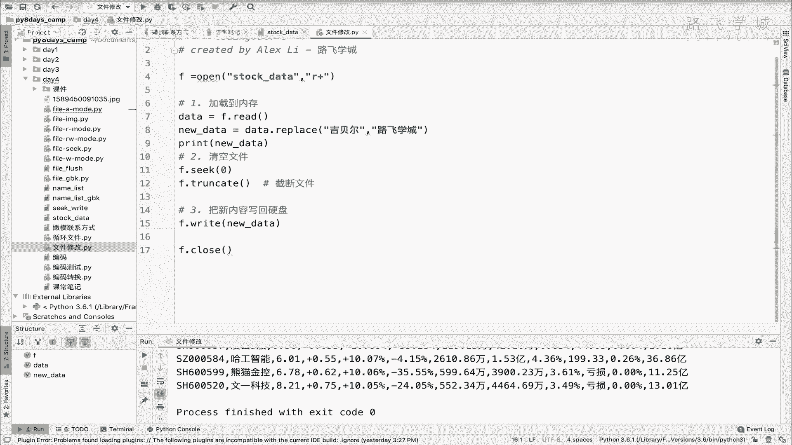

# 【2024年Python】8小时学会Excel数据分析、挖掘、清洗、可视化从入门到项目实战（完整版）学会可做项目 - P51：10 文件修改的巧妙玩法 - Python金角大王Alex1 - BV1gE421V7HF

OK同学们这节课进入文件的修改啊，那为什么把文件的修改放到最后面，因为它比较特殊啊，跟这个想的还跟你可能正常想的不太一样，所以有些特殊的点，所以我们放到最后啊，那先说这个问题。

这是上节课我们在讲这个seek的时候啊，混合模式的时候对吧，我把这个位置移到这，然后呢在这里写了一句话，对不对，写一句话呢，但是其实相当于对文件进行修改了对吧，那对文件修改呢。

但是其实这里可能会带来一个嗯，带来一个问题嗯，比如说我我我我其实是啊，就是我我，OK同学们，这一小节呢咱们进入这个文件，修改的最后一部分就是，OK同学们，这一小节咱们进入文件操作的最后一部分。

叫文件修改，为什么把它放到最后，因为它还是啊这个比较特殊，有些特殊的地方，跟我们常讲的这个修改不太一样，看上节课咱们最后是不是在讲混合模式的时候，用SK回到了这个位置，然后加了一句话对吧。

这其实相当于修改了，但是这种修改呢反而很鸡肋，是啊怎么很鸡肋，你注意了他的这种修改，我们可能啊比如说我们的需求是，它只是在这里插入一句话的话，他是做不到的对吧，哎或者这么讲，对他没有办法做到插入一句话。

因为插入列表的插入是插入一个新的元素，把旁边的元素挤到后面去，对不对对吧，把旁旁边的元素挤到后面去，那但是它不是，它是直接在这个位置开始往后覆盖对吧，所以他其实是在这个位置往后改改改改。

也就是说之前有什么内容全都给他删掉了，把它给删掉了，那为什么说它是鸡肋的，你比如说我要写一个啊，写一个叫什么，写一个叫全局替换的一个程序啊，全局替换的一个程序对吧，咱们包括我们的PYTHM上。

是不是也有这种替换程序啊对吧，CTRLR是吧，CTRLR对吧，你比如说我想把这个啊又来啊全都换成又来，哈哈看到没有，这个我想全局替换替换的话，看着啊，你看人家这个替换会怎么着对吧，它是用来哈哈。

会把就差了两个值插了个哈哈进来，他会把这个L本来是又来了，是不是连着的，他插了一个哈哈进来，把后面的值往后给他挤了，这才是正常的，我们这这是我们的正常的替换对吧，但是如果你用拍。

就用这个Python自带的这个这个修改这个功能的话，那你搞成你要是说想替换，那变成了你说了一个又来哈哈，它会导致一个情况，你本来是这样的，对不对，你把它变成又来哈哈，它会把这两个字给你去掉，对吧。

也就是那个L1个L1，这两个字就被哈哈给覆盖了，它是这样的，明白吗，那那你说诶他为什么会这样啊，这样好别扭啊，哎这个东西就是要要考虑到硬盘的，它的存储原理啊，硬盘的存储原理，那我们拍这个文件。

它在硬盘上只是一个单纯的文件。

但是硬盘会很大啊，硬盘很大，咱们假设你看这个我整个画画的这个框，是整个硬盘，那我的一个文件，啊假如说这个是我的一个文件对吧，这个文件这个文件就是咱们现在当前这个文件，就是嫩模联系方式，咱们叫A吧好吧。

那你在你这个文件，相当于你这个文件这个边界就是这样的，从这儿到这儿对吧，那这个在硬盘上它就有一个起始位置，是在哪起始位置，比如说是就是因为硬盘，整个你可以理解为画成一个大房子，对不对。

那个大房子就化成一块块的小区域，诶这个是你存这个文件的区域，然后呢sorry，然后呢你人家还有其他的文件对吧，他一个个都垒在这对吧，为了这个为了这个空间的利用嘛，所以中间基本上没什么太多空隙就紧挨着了。

对不对，这个就是一个B文件啊，当然还有C文件什么的，就相当于你房子里所有的货物紧挨着，那这个时候呢，那就是每一个文件的内容，都在自己这个被画好的这个空间里啊，去活动对吧，你不能超出，你超出就到人家这了。

所以呢那他在这里修改的时候，它只能是什么呢，他只能做到诶，你你从这个你从这个啊，比如说你在这个空间里某个位置，你在这里改，然后你要改的话呢，你对吧，它就会只能覆盖这个后面的东西，它不能往后挤。

因为一级这里的文件就到这来了，明白意思吧，到就到这来了，他没有办法做到，说我把后面的文件再解到后面后面的，No no no，你这个硬盘那么大，怎么往后记对吧，那上面成千上万个文件，你这么一次全挤一遍。

那你这个哼俩小时出去了，所以呢他他就怎么讲，他你你你一往后挤，它就导致跳到人家其他文件里了，这就乱了，这就乱了，所以呢哎为了防止这种情况，你在这里修改，它只是在原来那个基础上进行覆盖，明白意思吧。

唉那有同学说你说不通啊，我假如说我这个文件往后你比如说追加的模式，我往后又追加了很多东西，对不对，你追加没有关系，我跟你讲硬盘底层存储的技术，它不一定就是这么讲，他一个文件现在是在这。

但是它不一定这东西怎么讲呢，就是他不一定啊，你你你你比如说你还又又加了一些内容，那一块内容他不一定全都存在这块空间，它可能在你这个仓库里又给你开了一块小空间，明白吗，哎也是存你这块内容的。

然后他操作系统通过啊一些特殊的设置，让你这两块连起来，但都是属于A文件，明白这个意思吗，它都是属于A文件，OK所以你追加呀什么的是没有问题的啊，没有问题，包括加更多的东西也是没有问题的，好。

那这个就是呃怎么讲，这个这个它的硬盘存储的这些原因。

它就导致你就给它覆盖了，OK吗，那可怎么办呢，同学说我不管我不管，我就想要像刚才你在这里全局替换的这个效果，对吧，给他全局替换，那这种诶你看人你说人家PYTHM能实现，人家是怎么做到的呀。

你凭什么不行啊，我告诉你PYTHM是怎么做到的，也就是说你真想实现那种对吧，要想改的话，就就就把后面也移到后面去，而不是在原来的基础覆盖的话是吧，你比如说我把这三个字改成一个欧阳娜娜对吧。

改成一个ANGELABABY，他肯定会往后挤，是不是啊，然后他他肯定会就把这些类似的假说，中间没空格了，他就把这个北京什么也不改了，他不想覆盖，而是让他，而是让他什么呀。

而是让他这个啊啊这个这个这个往后挤，对不对，唉那怎么办呢，那怎么办呢，同志们，好我告诉你A他这个Python做的方法，包括你的word文档也可以，是不是也得word文档也可以这样随意的去改对吧。

往后去挤，那他们做的方法都是说，先把所有的数据加载到内存里，注意了啊，先把所有的数据加载到内存里啊，文件的修改，文件修改对吧，不覆盖啊，不是覆盖，而是对吧，而是这个，而是往后挤是吧，往后挤。

那这个怎么做到呢，是说把先就是打开文件后打开文件，把内容都加到内存里，然后呢你在内存里去修改这些数据，在内存里修改完之后再重新给他写到硬盘上，明白这意思吗，也就是说你不是在硬盘。

你不你你你你像这种他并没有把这个数据，像咱们这种直接覆盖的，它它其实是直接在硬盘这个上面就直接改了，那这种就不行是吧，硬盘的这种这种这种原理导致的，你你没办法实现对吧，谁先往后挤。

所以呢你就可以把内容读到应内存里，然后修改完了之后重新写回硬盘，注意了，重新写写回硬盘，其实相当于创建了一块新文件，明白这意思吗，还创建了一个新文件，那这样就可以实现一个全局的替换，OK那好。

我们其实可以就来试一下，好了就可以来试一下啊，那啊我们来这里有一块有一个这个数据，这个挨得比较近，看来这个数据我们可以干嘛呢，我们可以这个那这样把里面其中一个一个文，一段文字给它改掉，比如说这个什么呀。

比如说这个呃这个这个这个吉贝尔吉贝尔，对吧啊，我们给他改改一个名字，改成我们公司啊，路飞学城也上市了，那三个字改成四个字，是不是啊，或者再改长一点，正常它会往后挤，但是我改完之后它会干嘛呀，实现一个嘛。

就是正常的话它会直接覆盖，就是你在硬盘上改，但是我加到内存里再改的话，它就会往后挤好吗，那咱们就来写一下啊，写一下这个OK我在这里创建一个文件啊，创建一个文件就叫文件修改吧，来咱们来去处理这个。

去把这个GB改掉好吧，打开，stock data是吧，好我们这样吧，我们我想想我们用什么模式又要涉及到读，又要设计到写是吧，我们可以用RRR模式打开好吧，用R模式打开，然后呢我们是这样。

先要第一步先把加载到内存，是不是加载到内存啊，那所以呢那我就在内存里存一个吧，就F点V的V的，注意了，它会把所有的都读进来啊，读进来哦，注意了，这个有一个东西我忘了讲了。

你这个read现在我我我我这个什么呀，我只是啊中间里面不跟东西的话，他就把文件里所有内容都读进来，但其实它可以干嘛呢，你看点进去看他这里其实哦你这个不太好看啊，这个N这个N就是根参数。

也就是说你可以读多少个字符，多读多少，你数十他就读十个字符啊，你可以自己试一下啊，那就为我呢就这个全都加载到内存了，咱们print一下这个date是吧，大家看是不是加的那个从内存里打印出来的。

这个时候你既然在内存里，它只是一个字符串了，对不对，他只是一个字符串，那你想替换很容易啊，直接S点replace就可以了，对不对，你直接print啊，data点replace，然后呢写上这个吉贝尔对吧。

G2哎哎，哎吉祥啊，贝勒儿是吧，然后你把它替换成什么呀，替换成这个路飞学城是吧，哎这样他就会直接给你搞到后面去了，对不对，咱们来看一下看，说卧槽，感觉路飞真上市了，市值98亿，哎呀好开心啊。

我就不用在这讲课了，都会做梦都会笑醒，那同志们，你这样的话，你是不是再把这个文件给他存进去就可以了，是不是把文件给他存进去就可以了啊，把文件存进去的话，那你现在注意了，你这个你这个我想一想啊。

你这个原来这个文件里面其实还是有内容的，对不对，还是有内容的，那你得先把这个文件里的内容全都给他，全都给他这个什么呀，全都给他删掉，清空掉再去啊，往那边写，对不对啊，你要先把旧的文件内容给它清空掉。

再去往里面写啊，那有没有，怎么可怎么给它清空掉呢，怎么给它清空掉呢，哎呀这个很尴尬啊，其实也不尴尬，我在这里顺便嘛，哎就直接再给他，在这里给他交一个新招吧，它不像数据类型一样。

说我一个列表怎么直接F点啊，F点clear就可以了，他没有啊，他没有，但是哎但是它有一个什么功能呢，叫trunk啊，Trunk trunket，其实我本来就不想讲了，但是遇到这了哎那咱们就给他讲一下吧。

讲一下TRKET就是截断文件啊，阶段文件，这个阶段文件是什么意思呢，也就是说甲它就从你的光标啊开始往后截，也就是说就是你比如说你光标在这，然后呢只留只保留这一段，你你你你你写你就是你的光标位置在这。

对不对，然后你直接说我在这里直接创开，然后呢他就把后面的全都给你扔了，TK的中文意思就是截断的意思啊，就扔掉了就不要了，那如果我的这个光标在这，我trunk了一下，是不是相当于把文。

这里面所有的内容都给它清空掉了，能理解意思吧，所以呢我可以这样，我先给他，我先给他这个什么呀，迁移到F点seek，先移到零这个位置上，然后再进行一个窗口的对吧啊，先移到零这个位置再进行截断文件。

这样其实就是相当于把文件给他清空了，是不是先清空文件啊，第二步清空你的文件对吧，然后第三步是不是干嘛呀，这个法新内容把新内容写回硬盘，是不是啊，把新内容写回硬盘，这个能理解吧。

我这样我先把它copy出来啊，把这个词在这在这，我先把这段文件这个给他copy出来，然后咱们看看啊，执行一下，我先不往里面写，我们先看一下这个清空效果能不能清空，执行一下，哎，看一下这个原来的文件。

大家看是不是没有，是不是清空了，哎TRPT就给他清空了啊，那当然你要想去保留一些的话啊，你保留一些的话，你可以写只截断多少啊，只阶段多少，我再给它粘回去啊，比如说我装配的。

我装配的100看看他就从零开始啊，大家来看一下，这个时候你会发现你会发现看到没有，他从零开始截100个字符，100个字节啊，这100字节出乱码了，对不对，因为你正好把那个。

估计把人家一个中文字符给它截成两半了是吧，他就他就解释不了了，总之这是TK啊，就顺便在这讲了，它就相当于形成了一个清空的效果，不加的话就从零开始后面全都截断，那这样的话，第三步。

咱们是不是把新内容写回硬盘就没有问题了，对不对，那我们就可以直接这个啊，直接可以，写一下吧，new date等于它对吧，new date等于他，然后直接这个什么呀，F点write。

是不是把这个new data给它写进去，然后F点close就可以了，这个时候执行一下，诶，诶诶sorry，我看一下哈，new的已经替换了，替换完了之后，替换完了之后。

然后呃清空清空了再写这个new data不行吗，F点vunexpected end of data，嗯我们来看一下哎，这个new ta我们print一下它，它确实应该是没问题的呀，哦哦。

我刚才上一次给他忘了给他，把把这个数据给它粘回去啊，我我再把这个数据给它粘回去好吧，粘回去之后啊，在这个接口啊，咱们在执行这个好吗，我说了，大家看没有再报错，是不是没报错，然后我们来看一下原来的数据。

看看路飞学城是不是改了，OK吗，哎这个就是咱们呀干嘛呀，如何进行修改文件对吧，三步加载到内存清空啊，对进行一个替换对吧，在门内存内修改，修改完了之后，这个什么呀，再去把原来的文件，旧文件清空。

然后再把新文件写到那硬盘上，哎这样是不是就解决了好吗，你自己可以试一下啊，但是这样搞的话，其实是啊，怎么讲，他也是有一些弊病的，有什么弊病的，你是不是现在把文件加载到内存，但我这个文件特别小啊。

就可能几K，但假如说你要改一个视频，或者是改一个什么特别大的文件，可能几百兆一个G，那就要把一个G的文件读到内存，然后进行修改，修改完了之后对吧，修改完了之后再去怎么讲，再去写回去啊。

再不去相信你要把一个G的文件加载，这就是出现有的同学，你有没有遇到过你打开word文档啊，特别大的word文档需要花的时间长，它就是把word读把把，这就是把内容从硬盘读到内存的一个过程啊。

他必须要读到内存里才能修改对吧，然后先勾改完再再写回去，那那那没办法，他就是他就是这个啊，这个这个这是它的一个弊病吧，也就是遇到大文件的时候，它就是加载的过程就会慢一些好吧，那加载过程会慢一些啊。

这个当然有没有解决方式呢。

也有啊，有另一种方式，解决方式就是说它不占内存啊，不占内存，但是呢不占内存就占硬盘啊，这个这个这个怎么说吧，我那个就代码不实现了，给大家讲一讲，快速讲一讲好吧，那种方式是什么呢。

你这种方式是全都加载到内存，然后统一改他那种方式是什么呢，替换的时候你要涉及到文件替换啊，替换语言内容的话，那你就涉及了，就是说它是一行行的往内存里读啊。

相当于他创建两个文件啊，给大家讲一下思路，在这里创建一个文，就是先把旧文件打开啊，然后呢再创建一个新文件，这个是个空文件，这是一个这是个new好吧，这是一个old好吗，那这个文件呢它就循环一行行的读。

就一行行的读的话，它就是一行行的往内存读，然后每一行进行比对比对，如果需要替换就替换，不替换呢也没关系，就直接就是循环了一行，就往这里写一行，往新文件循环一行，就往新文件写一行啊，有的替换的也没看。

没关系，替换完了就写进去，那最后整个循环完成之后，这里相当于copy了，完全copy了一份这个旧的文件，这个copy完一份旧的文件呢，这个旧的文件啊，这个新的文件里面呢，并且还包含已经替换好的内容。

对吧啊，旧的里面不包没有替换了，这里包含替换好的内容，所以那你最后只保留这个文件，把这个文件删掉，只保留这个文件就可以了，那但是由于你这里是读一行写一行，读一行写一行。

所以呢在同一时间硬盘上会有两个文件，相当于多了一倍，多了一倍，比如说你这个文件是十个G，那你要想实现这种效果，它虽然不占内存，但是它占硬盘就是多出来十倍的，那多出来十个G的内存空间啊。

当然最后改完了之后，你可以把旧文件删掉，但是删之前，同一时刻在硬盘上是存着两个实际的文件的，唉这就是占硬盘的方式，占用完的方式好，反正就是这两种方式，你用哪种都可以明白吧，但是一般啊一般我们都会用这种。

第一种就是直接占内存的方式，因为像什么word文档啊啊excel啊，像你常用的软件，其实都是通过这种占内存的方式来实现的，好吗啊。

OK那这个就是咱们的文件内容的一个替换好吧，Good。

