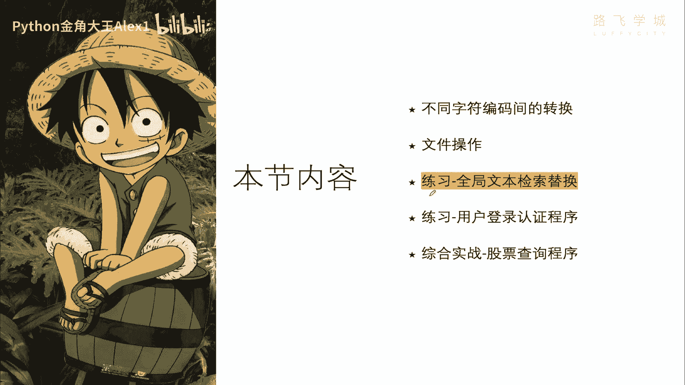
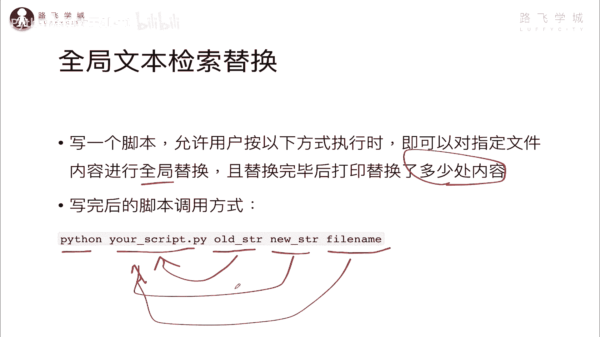
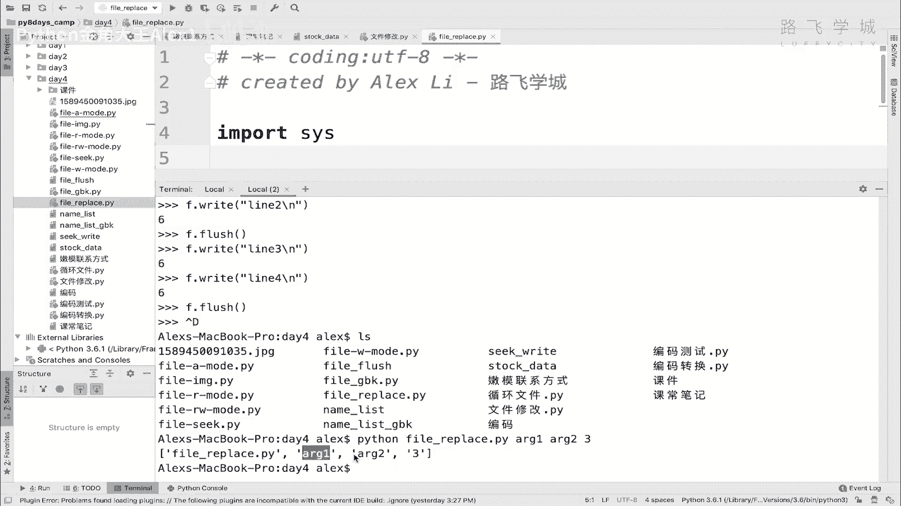
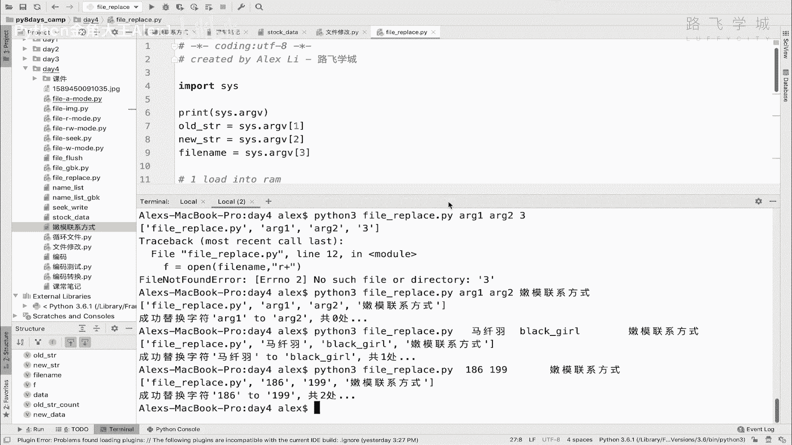

# 【2024年Python】8小时学会Excel数据分析、挖掘、清洗、可视化从入门到项目实战（完整版）学会可做项目 - P52：11 开发全局文本检索替换脚本 - Python金角大王Alex1 - BV1gE421V7HF

OK同学们，接下来咱们就是练习题时间了啊，这几个练习题都搞定，文件操作，你就全都没问题了啊，你就玩的非常666了啊，那先做第一个简单的全局文本检索器啊。

文本检索替换啊，需求是这样的，让你写个脚本啊，允许用户按以下的方式来执行什么营销方式呢，直接通过Python调用，这是你的脚本名，然后呢，可以对指定的文件内容进行一个全局的替换，指定的文件内容。

看到没有，指定文件内容在这，这是你的文件啊，这是你要替换的这个操作的这个文件，这是你的脚本，然后这个是你要替换的内容，比如说这是第一个sorry，这是你这个旧的字符串，这是新的字符串，明白吗。

也就是说你得要让你让你这样运行，这样调用方式啊，那并且替换完了之后呢，注意了，这是一个全局替换啊，并且替换完毕之后呢，要让你打印一共替换了多少处内容，就记录记录我一共换了几个地方吧。

那你们想想这个怎么做，这个怎么做啊，我吃口苹果，你一口苹果的时间好，你们可以想个10分钟，响个10分钟的，你可以先暂停住，好10分钟，你们想完了，同志们，那你要想实现这个东西呢，我觉得先要解决一些问题。

解决问题，就说你看现在是通过要让你调用脚本的方式，你看这是你的Python脚本，后边跟这个一堆参数，然后你要相当于你的这个脚本要读取这些参数，对不对，你的脚本读取这些参数对吧啊，读取这些参数呢。

那这个嗯你相当于你怎么在这个脚，这个脚本也就是你的文件代码在里面，你怎么去读取外面给你传的指令，在执行的时候你要解决这个问题对吧，就读取外部指令，读取文件，外部指令明白意思吗。

哎这个解决其实这个解决了之后呢，啊我觉得就没什么难题了，就就就直接在里面，就有点像咱们刚才修改文件一样，就把这个内容读到内存里，夸1replace是吧，哎就换完了。

同时呢你在replace之前先进行一些count对吧，先统计有多少个地方要去替换，对不对，那不就全都实现了吗，所以其实重点要解决的就是说哎，怎么去读取外部指令就可以了。

那这是涉及到一个新知识，这里咱们需要学一下啊，新知识读取外部指令啊，咱们这个文件名就叫这个什么呀啊，这个叫叫叫叫叫啊，file replace吧，行不行啊，这叫fireplace。

然后咱们这个文件要读取外部指令，那你要怎么办呢，要借助一些新东西，这些新东西就是啊，你需要又用到咱们的工具箱了，咱们之前第一次用工具箱，是讲了一个random的随机数的对吧，这次现在一个工具箱。

工具箱就是为了让你调用外部指令的，叫导入这个风箱叫cs模块，cs模块呢你可以等于就是你通过直接print cs，点ARGV，不用print啊，直接cs点ARGV，看到没有，这就是外部。

相当于你在脚本在执行这个脚本的时候，给他传任何参数都会传到这里面啊，都会传到这里面，你不相信你可以打印一下，它是一个列表的形式，大家看啊，我在这里就执行这个脚本，看着我在这里。

你当然你这样执行它没有啊对吧，你没有给他传任何参数，注意了哎对你即便没有传任何参数的时候，它依然这个会打印一个列表，这个列表里面的第一个参这元素是什么，是什么，是不是这个脚本名呃。

脚本这个自己的这个名文件名和它的路径啊，哎它永远是作为第一个元素，那如果你想跟参数没问题，怎么办呢，你不能这样了，你就在这里啊，在这个命令啊，Sorry，在这个命令行界面，然后呢你直接执行你的什么呢。

直接执行你的这个file replace，Replace，然后呢你就跟参数对吧，ARG1argument参数，ARG1ARG2对吧啊，三大家来看一下，看看这个很关键啊，是不是产生了一个列表。

也就是说你这里跟着这个参数做，每一个参数是不是作为里面的元素了。

OK那这个通过这个是不是就满足了我的第一个，这个这个这个这个问题点，就是说你这后面的参数对不对。

都可以传到啊，都可以被我读到这个这个这个，我这个代码里对吧，代码里，然后去拿到这些参数去处理，能理解意思吗，那好我们就直接什么呢，就直接去呃啊去去写呗，也就是说第一个参数是旧的字符串，第二个是新的。

第三个是文件名，是不是啊，所以我们就直接啊这个OSTR是cs，点ARGV1啊，看从零开始嘛，零一嘛一然后这个是二，这个是三对吧啊，这个是file name，对不对，这三个这三个。

然后呢你接下来要做的事情是干嘛呀，是要就真正你你是不是要打开这个文件，它输入这个文件名了，那你就得打开这个文件，对不对，那你就F等于一个open，然后你这个file name对吧，然后啊。

那你以什么模式还是R加的模式打开，是不是可以R加的模式打开，先把它读到内存里，对不对，Data desorry d，他等一个F点read，先读到内存对吧，第一步啊，第一步读到内存，然后第二步是干嘛来着。

对对吧，load into memory i m吧对吧，那第二步呢，第二步是不是就直接进行替换了对吧，这第二步就是直接是把替换，但是替换之前你是不是要先统计一下呀。

Count c o u n count and replace，对不对啊，那你要先统计一下这个啊，O的就是一共有多少个旧的字符串，是不是O的s tr numbers account吧对吧。

等一个data点，是不是直接count你这个OSTR就可以了，是不是啊，这个是字符串的方法对吧，可以统计个数，然后呢直接就替换就行了啊，new data等于一个什么呀啊，data点replace什么呀。

data点replace old，然后new嘛，是不是啊，哎old new，然后呢同志们替换完了之后，第三步对吧，right就是清空，对不对，clear这个old file name。

File name，是不是啊，那你就直接是啊，F点sorry，先要F点seek，对不对，seek到D0的位置，然后F点pk是不是把文件给它清空掉，接下来第四步干嘛呀，save new data啊。

Into a file，是不是直接是F点right，然后把你的new data写进去，对不对，哎写进去，然后最后print对吧，这个成功，啊成功啊替换，公共找到这个啊，就是成功替换这个什么呀。

字符字符这个什么呀，在这个加引起来吧，OSTR对不对啊，这个to替换啊，为去这个什么新的字符，是不是啊，这个新的字符就是AAA，这三在这新的字符不就new s t r吗，是吧，共多少次呢，共多少次呢。

这个old str count是不是OK那这个就做完了呀，同志们，就这么简单呀，你看就这么几行，连个循环什么的都没用到，对不对，是不是，就是我们从上往下摆下来，就替换完成了1234步可以吗。

那这个时候呢我们就可以来执行咱们的代码了，对不对，执行咱们的代码了啊，我就执行一个这个随便执行一个，大家看诶，报错了啊，我哪里写错了，地段好，对他说第26行，26行，我哪里出错了，F点Y啊。

F点COLOAD，但也跟这个没关系啊，我看我这里写的语法有错误吗，共替换多少次呢，嗯诶F然后old new old str count，哪里写错了，双引号，用单引号也没问题啊，哪里有问题，看一下。

重新来一遍啊，第27行语法错误，哪些语法错误，Print new s t r o s t r f a，我哪里写错了呀，哼哼这个这个我怎么都找不到了，没看到有语法错误啊，好看诶，后面有东西吗。

后面没有东西啊，what来来来，你们你们你们知道哪里错了吗，我怎么我怎么看不出来哪里错了，不就这样直接print吗，是吧，What he，真是怪了，我来看一下啊，OK同学没有找到，找到错误了，我靠啊。

这个这个这个什么我在这里这个什么呀，我在这里输的这个Python Python是2。7，看到没有，Pyth，2。7不支持F语法啊，我还改成傻了吧唧的，改成这个双引号没问题啊，跟这个没关系。

python2。7里不支持这个这个这个这个什么哈啊，不python3。0里面才有这个F的这个格式啊，所以呢我要改成python3好吗，这样哎就可以了，至少没报那个错了，对不对，然后他这里出别的错了。

说哎找不到这个文件，看到没有，找不到文件，第12行没错呀，对吧，咱们在这里是随便输了一个参数啊，这个三第三个，这个三不是这个当做文件名了吗，这个文件名很显然不存在啊，对不对，所以呢啊那我就在这里去改。

这个改就是找哪个呢，比如说嗯这个嫩模联系方式吧，咱们就叫嫩模联系方式吧，好吧嗯，哎给它放到这，然后我们去改好了，直接执行，大家来看哎，发现了什么呢，成功替换字符ARGETARG2共零处，什么意思呢。

这个地方你看它其实一一处都没有替换，为什么，因为他直接把你那个ARGEARG2，当成你要替换的值了，因为我随便写了嘛对吧，然后你这里面很显然是没找到嘛，就没找到他就没办法替换，因为这里一块要改啊。

你改这个，你把这个你可以把这个谁啊，把这个这样吧，你把马千羽吧，把马天宇，这样直接copy过来了，把千羽给他替换成什么呢，黑姑娘行不行，黑姑娘叫black girl行吧，Black girl。

然后咱们来试一下，试一下，大家看是不是成功替换了一处，对不对，成功替换一处，我们开诶，你看是不是就直接替换了，唉这个就是全局替换，但是我们现在呃只有只有这一个可以换的对吧，我们可以这样。

我们把这个叫186吧，看到没有，这个186都给他换掉，这里好几个186是吧，给186换成啊，199是吧，这个应该没有，然后大家看是不是换了两处啊，这个时候我点一下啊，看到没有，是不是这两个都换了诶。

这个就是咱们的全局替换，是不是超级简单，是不是超级简单啊。

