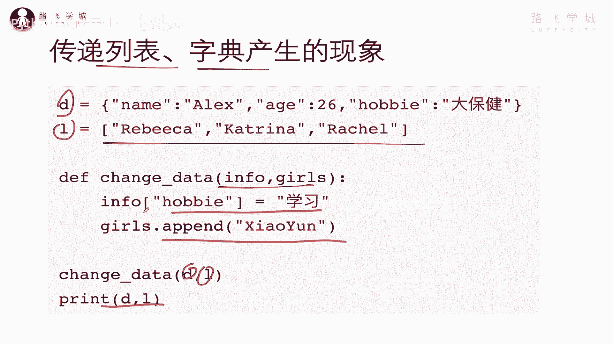
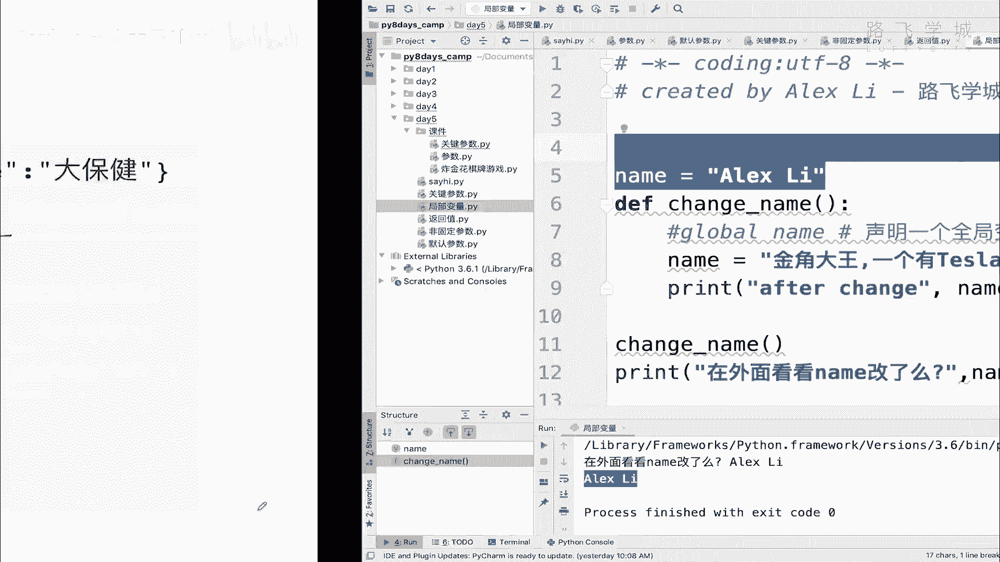
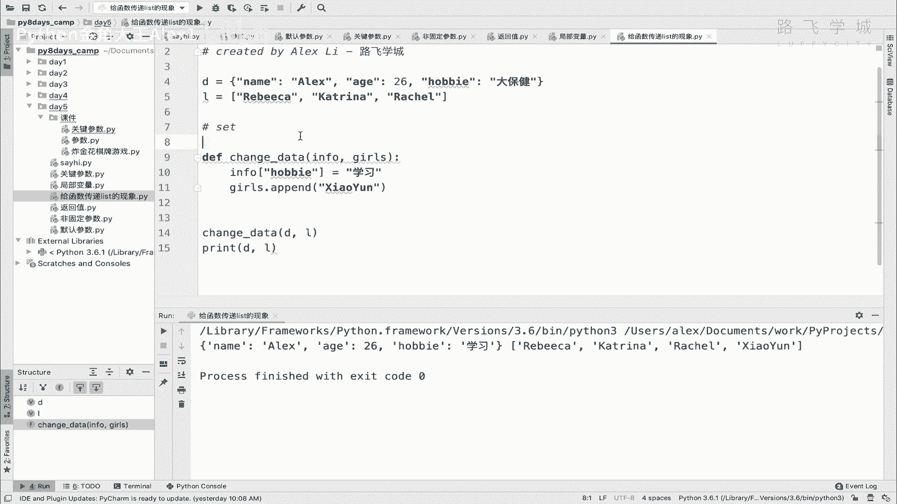
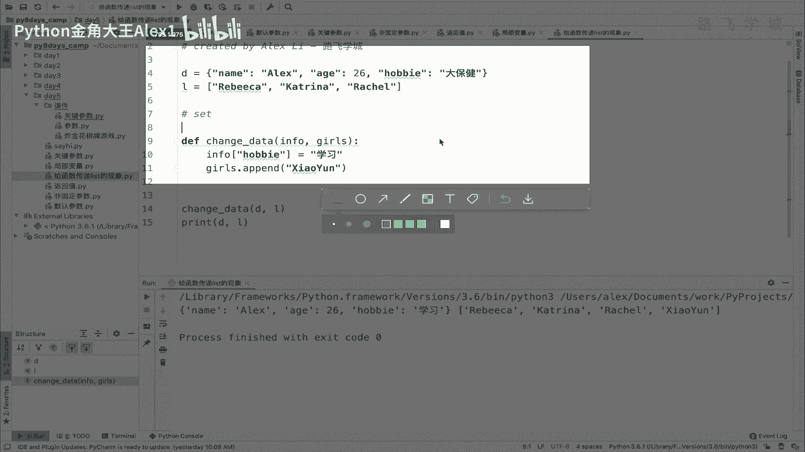
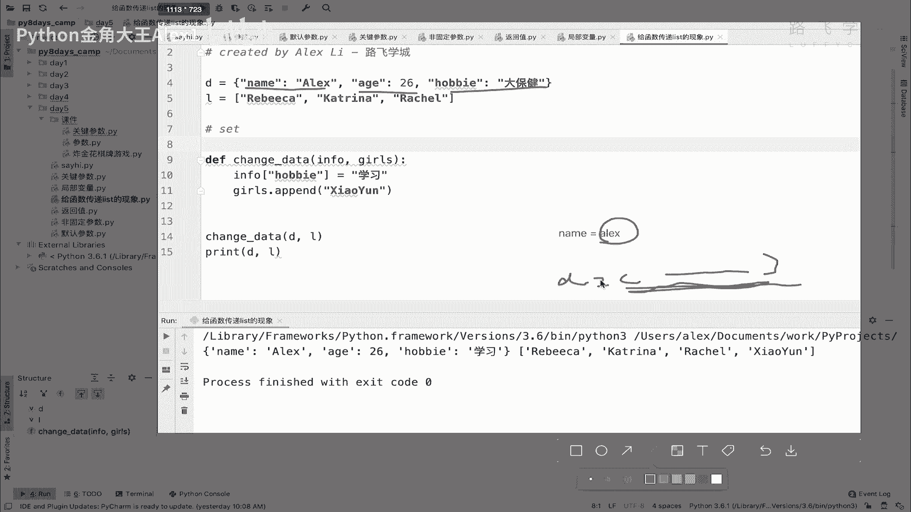
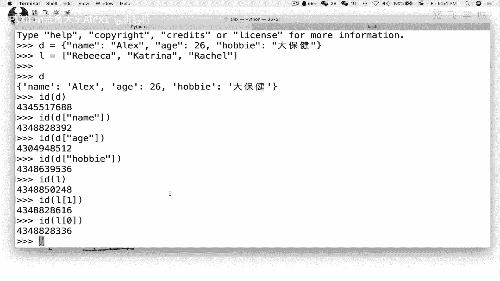
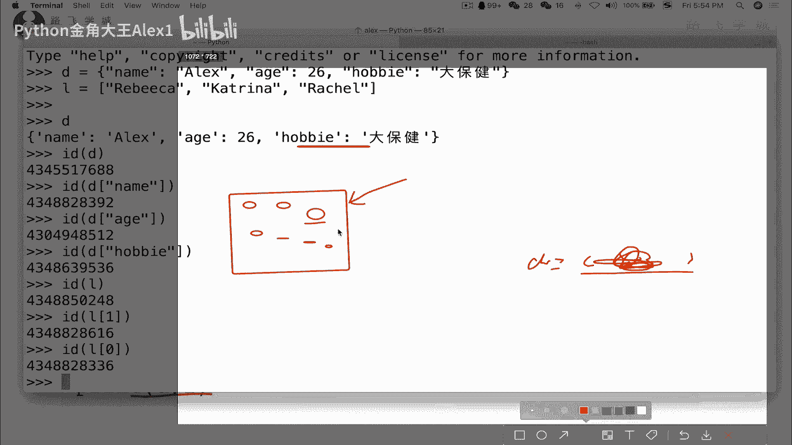
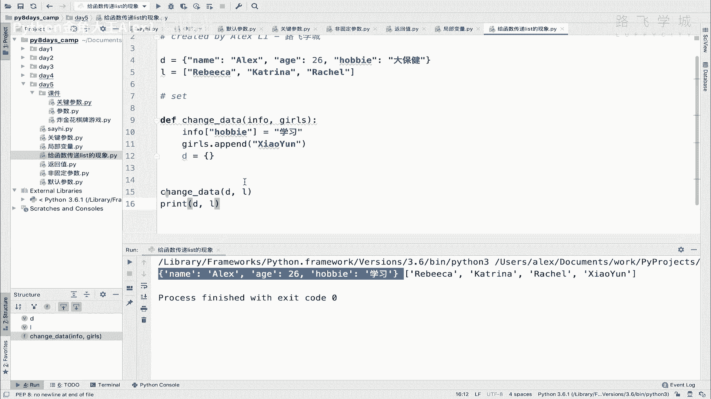
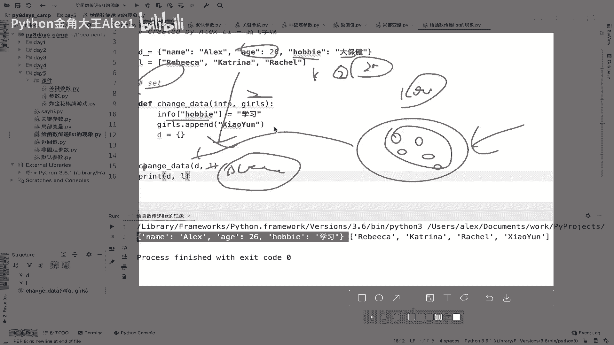
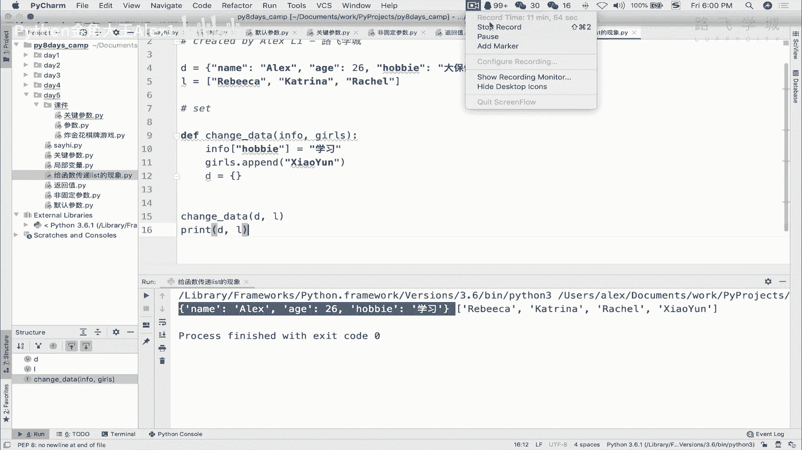

# 【2024年Python】8小时学会Excel数据分析、挖掘、清洗、可视化从入门到项目实战（完整版）学会可做项目 - P62：07 给函数传列表-字典时的特殊现象 - Python金角大王Alex1 - BV1gE421V7HF

OK同学们，这节课呢给大家讲一下啊，这个网函数里面传递列表，字典产生的一些特殊现象，那我这里有一个字典D1个列表啊，那这个然后呢这个函数里面对吧，我就把它当做两个参数传进来了啊，一个info。

一个girls，这个这个参数啊，这个L就是我的曾经的女朋友们，然后我就change data，把这个这个D和L都传进去，然后呢我在这里面干了一件事，把这个看啊，info其实就是这个D看到没有D吗。

对不对啊，D然后当做第一个参数就是这个info，然后我在里面加了一个，把那个hobby改掉了，把hobby从大保健改成了爱学习，是不是啊，我的爱好，然后把这个girls里面就是这个列表里面L里面。

对不对，给他加上了一个什么呀，给他加了一个小云啊，加上一个小云，是我的一个新的姑娘啊，哼泡泡的姑娘们，REBERKATRINA还真是哎，Anyway，那大家看如果是这样的话啊，这个结果会怎样。

也就打印出来，这个结果会怎样，同志们啊，短信结果就是说到底能不能改啊，如果按照我们之前上节课写的逻辑的话，也就是说在局部变量里面啊，局部在函数里面是默认不能改。

外面全局变量里的内容的对吧，但实际上能不能改呢。

啊我竟然在这给你讲了，那应该是可能能改，对不对，我们先看一下这个现象啊，就是啊给函数传递什么列表的现象啊，列表和字典啊，那我就把这个给他copy过来，来看啊，咱们直接执行，看看加进去了没有，大家看。

首先我是不是大保健改成了爱学习，然后这个列表里面又添加了一个小云这个名字，对不对，发现确实是可以改的，那不对呀，不是应不是说不能改吗，你这怎么又又又又能改了，这不这不乱了吗，对不对。

唉这个东西就是说你你你当遇到像列表啊，像字典呀，包括以后你们可能会与学到的什么这个集合呀，啊什么集合就是set啊，包括一些其他的数据类型，特殊数据它就非字符串的，非数字的啊。

这种数据类型你会发现它会遇到一它，它它它就出现这种可以改的情况，那现象是这样，但是我想知道原理是为什么，也就是说它为什么是啊可以改，那首先要先从啊，这个啊这两个数据类型的，这个这个这个这个特点来看齐啊。

特点看齐，就是说呃咱们知道如果是一个变量的话。

一个变量啊就普通一个字符串，那就是这是在内存里的话啊，sorry在内存里的话。

那可能，可能啊比如说这个还是name的值，对不对啊，name的一个ALEX在内存里，它其实怎么讲，就直接一块内存地址把它存下来就行了，然后这个变量名指向这个内存地址，对不对，就这么简单。

但是呢你这里就是个字典，这是个字典的话，我告诉你，表面上你以为说啊，那是不是也就是一个D对吧，也就是一个D，然后呢指向一个内存地址对吧，指向那么一个内存地址，一堆东西就完了啊，这个内存地址是一块。

就一个内存地址吧，对吧啊，存这些值，但实际上不是的，实际上，这里面每一组数据都是一个独立的内存地址，那你不相信，你看一下，我们直接呃把这段话给他copy到这里来。

把这两个都可以copy过来，你你看一下就知道了啊，Oh sorry，好的好的好的，我把它copy过来，然后我这两个啊，大家看，首先我id我的这个D是一个就是这个字典名啊。

字典这个整个字典它是一个内存地址，然后我IDD里面的一个东西啊，比如说name，大家看他是不是一个独立的内存地址，然后再看一下edge啊，它又是一个独立的内存地址，然后再看一下这个hobby。

哎你会发现它里面每一个都是独立内存知识，包括这个什么呀，包括我这个L啊，L是一个独立的，然后L下面的每一个元素看到没有，它又是都是sorry，又是完全不一样的，明白吗，哎同学们讲说这个怎么去解释啊。

我明明想到的，我明明以为没画，我明明以为他是怎么讲，是这个。

是就像我们刚才画的对吧，你这个地对吧，就是一个统一的内存地址，但是怎么变成了那么多个了呢，这个怎么去解释呢，我给大家举一个例子，哎大家知道这个这个叫叫什么叫鱼缸，是不是哎大家看，比如说这是一个方的鱼缸。

这个鱼缸里面是不是放很多鱼啊对吧，放很多小鱼唉，这个鱼可以很多小鱼好，那我们这里面的每一个小圆圈小鱼，其实就相当于这字典或者列表里的每个元素啊，字典和列表里的这种每个元素，然后这个鱼缸sorry啊。

这个鱼缸它本身是sorry，它是本身有内存地址的，然后里面这个鱼是完全独立的，他是完全独立的，OK吧，他跟那个鱼缸是两块地址，鱼缸是一个地址，这个鱼是一个地址，它俩都是实体，对不对，他俩都占的内存空间。

明白我意思吧啊所以呢他们怎么讲，就是你要先理解这个东西之后，你哎那你就呃这个这个就这个明白了啊，这个明白了，那我们再来去讲这个回到函数那个地方啊，这里有什么不明白的吗，对吧，每一个鱼是存在的，对吧啊。

是实实在在的物体，然后鱼缸有个又是个实实在在的物体，不要把它们混在一块，只不过是鱼缸里面装的鱼而已啊，鱼缸里面装的鱼而已，你也可以把这个鱼杀死，拿出去放到另外一个地方也都可以，但它是实实在在存在的东西。

所以它在内存里也单独占空间啊，而不是像你想的是字符串，因为字符串它本身它只是本身就是一块，它没有呃这个字符串它就是一个整体，它不是分开的，但是字典和这个里面的元素是分开的，它不是以对吧。

它只是一个一个鱼缸，把这些东西包起来而已好吗，理解完了这个之后，那我们回到这个呃这个这个地方，也就是说你会发现诶，在函数里面它是可以改鱼缸里的这些鱼的，也就是改元素这个字典列表里的这些元素的。

那但是呃这个这个是可以改的，但是它能不能改鱼缸呢，比如说我直接在这里把这个D给它赋值了，把D给它呃，给它改成一个空的，行不行啊，哎把对吧，直接在局部变量函数里面改了局部全局变量了，直接改行不行呢。

在外面打印D啊，你会发现它改不了的啊，就他依然改不了，那这个就是至少这个呃，这个情况是符合我们上节课的现象的，也就是说呃你你你对吧，你没办法改全局变量，那这个咱们通过现象先来说，也就是说它能改鱼缸。

也就是说sorry sorry，说错了，也就是说他不能改鱼缸的这个啊。

这个这个这个这个呃直对不对，也就是这个鱼缸它是改不动的，但是看到的这个现象是说里面的这些鱼，它是可以动的，对不对，鱼缸不能动啊，这里面的这些鱼是可以动的，没错吧，这是这个现象，好对。

这就是这个把列表字典传进去的那么一个现象，然后我接下来再说，他为什么要这样，为什么说让我改能能动这个鱼，但是不能动这个鱼缸，明白意思吧，你记住啊，他在这里把这个地和这个L看到没有，给它传到这个函数里。

你以为就你以为你就是你以为我是说怎么讲，就就直接copy了一份这个字典copy的一个列表，把这个对吧，直接扔到函数里面，其实并不是，他只是把这个什么呢，把这个鱼缸的内存地址。

也就是把这个鱼缸的内存地址扔给了这个函数，然后这个函数，相当于就拿到了这个鱼缸的内存地址，他接下来要改里面的东西的话，就直接通过鱼缸的内存地址去找到了鱼鱼缸，然后到里面去改里面的每条鱼。

比如说我把一条鱼拿出来给弄死了，或者把一个鱼干嘛干嘛干嘛，他都是可以的啊，也就是在函数里面，通过这个鱼缸的内存地址找到鱼缸，然后改里面的这个鱼，明白意思吧，改里面这个余。

所以就是说其实你把这个字典传给函数，这个字典本身在内存里没有发生任何变化，它就静止在那个地方没有任何变化，另外一个没有任何变化，你只是把这个什么呀，把这个这个这个这个内存地址扔给他了。

扔扔到这个函数里面了，并没有copy1份新的数据，明白意思吗，他并没有copy1份新的数据，好这个跟你传一个字符串可不一样，如果你传一个字符串进去，比如说你在这里传了一个说ALEX的这种字符串。

那可就不一样了，那就是说它直接是相当于创建了一个字符串，在内存里给你扔到这个里面了，你在里面想对这个字符串任何操作都可以，跟外面的那个啊字符串都没关系了，明白吗，但是像这种字典啊列表啊。

包括以后学到的集合呀，啊这种的话它只是传内存地址啊，传的地址，然后为什么要这么做啊，为什么不直接copy1份，大家思考一下，你现在这典里列表里如果有100万个数据，100万个数据啊。

那100万个数据如果你调用一次，就是往那个函数里传一次，那就是copy1000000份，那即便里面每一个K每一个value对吧，就只有一个字符，一个字符，英文字符也至少占一个字节，对不对啊。

那一对那就是至少两个字节，那两个字节一个就是两个字节，那两一百万个就是200万字节，200万字节是多少啊，两兆还是20兆啊，自己换算一下，那至少是两兆，那两兆的空间你看着好像不大。

但是你这样其实来回copy已经占了，相当于其实是很很消耗资源的对吧，我要有一百一千万条呢，那就200兆，那就慢起来了，对不对啊，我传进去，我只为了调用其中那么一个值。

结果把他们200兆都传到这个字典函数里，这不是多余吗，对不对，这不是多此一举吗，明白意思吗，OK所以为了这样的一些优化啊，他设计的这种情况，也就是说只把内存地址传进去啊，这些里面的鱼啊。

静止在原地不动的，明白这意思吗。

好你们理解这个原理了之后，自己可以试一下，改一下好不好，OK啊，这个原理要理解，后面我们应该可能会遇到类似的这种情况。

