# 【2024年Python】8小时学会Excel数据分析、挖掘、清洗、可视化从入门到项目实战（完整版）学会可做项目 - P63：08 常用内置函数_1 - Python金角大王Alex1 - BV1gE421V7HF

OK同学们，这一小节我们学这个Python的内置函数，那所谓Python所谓内置函数，就是说Python解释器自带的一些函数，那是什么呢，比如说我们可以用这个print，我们可以用LEN。

我们可以用id这样的一些这个调用，这些一些方法，一些函数为什么，是因为Python解释器已经帮我们封装好了，它跟我们自己写的函数其实是一样的，这也是定义一个函数对吧，只不过人家Python解释器。

帮你把那些常用的啊功能给你写好了，不用你自己从头到文字好吗，那Python的这个内置函数到底有多少啊。

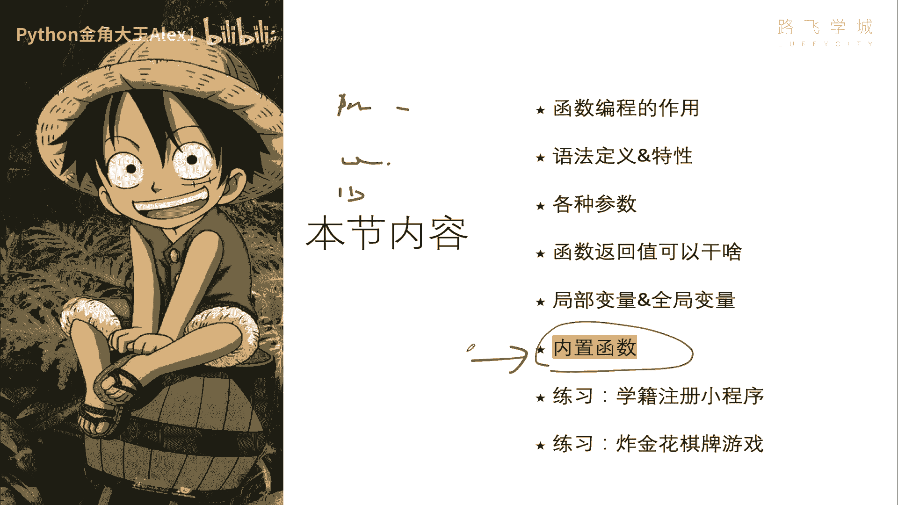

看这么一大这么一大堆啊，差不多有个估计有个小50个啊，小50个，然后呢我们看我呃，咱们这个集训营，集训营只会给大家讲这些标红线的，这些重点的啊，这是咱们常用的，也就是说这个集训营里可能会涉及到的啊。

那其他的也不是说不重要啊，而是说咱们这个课啊用不到，所以我们就不讲了，当然我们的正式课程里会啊，每个都会细讲，Anyway，那我们就快速的把每一个这个标红的方法，快速过一下，看看它的一些用法好不好啊。

我在这里创建一个文件，先从abs or和ending开始看起，看一下这个abs啊，abs是干嘛呢，取绝对值啊，它是这个什么absolute这个英文的简写嘛，对不对，Absolute。

absolute就是这个叫什么呀，呃这个绝对的意思对不对啊，绝对值对不对，然后数学里咱们也学过啊，取绝对值就是对吧，你这个比如说十的绝对值，那肯定就是正值，是不是啊，OK没问题吧，哎在一些特定编码场呃。

就是编程场景下会用到这个绝对值，你知道就行了，接下来我们来看这个or啊，这个all是干嘛的，or是干嘛的，给大家看一下啊，啊help all一下啊，算了，不不不不不不不用help，直接在这里打。

直接在打，然后我们点进去看啊，他这个说了啊。

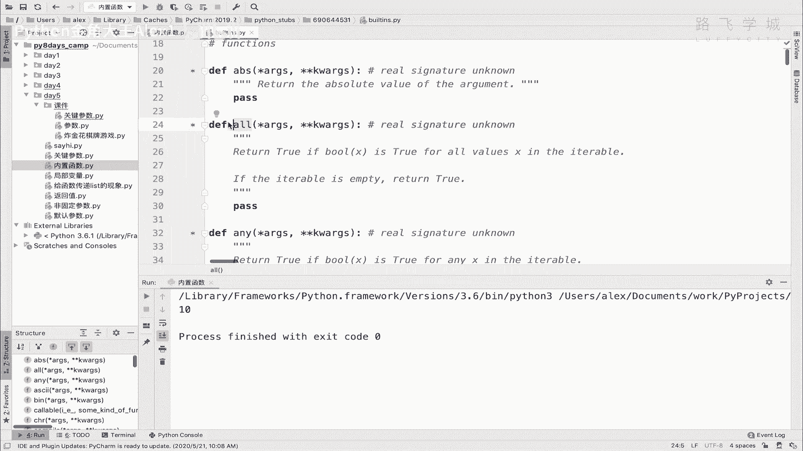

说这个意思就是说什么呢，说这个返回true啊，如果这个什么呢，就是呃如果什么布尔，这个就是一个布尔xx就是呃反正这是一个函数，然后is true什么什么的，看看注意看这句话。

for all values x in这个ITERABLE，ITERABLE就是可便利可循环的一个，你可以理解为它就是一个列表或字典，好吧，它就是循环这个列表，然后呢判断列表里的每一个变量啊。

每一个元素就是X拿着这个X交给这个布尔，去判断啊，去去调用，如果返布尔返回true的话，那整个也就这里面所有都返回TRU的话，那整个or也会返回true。

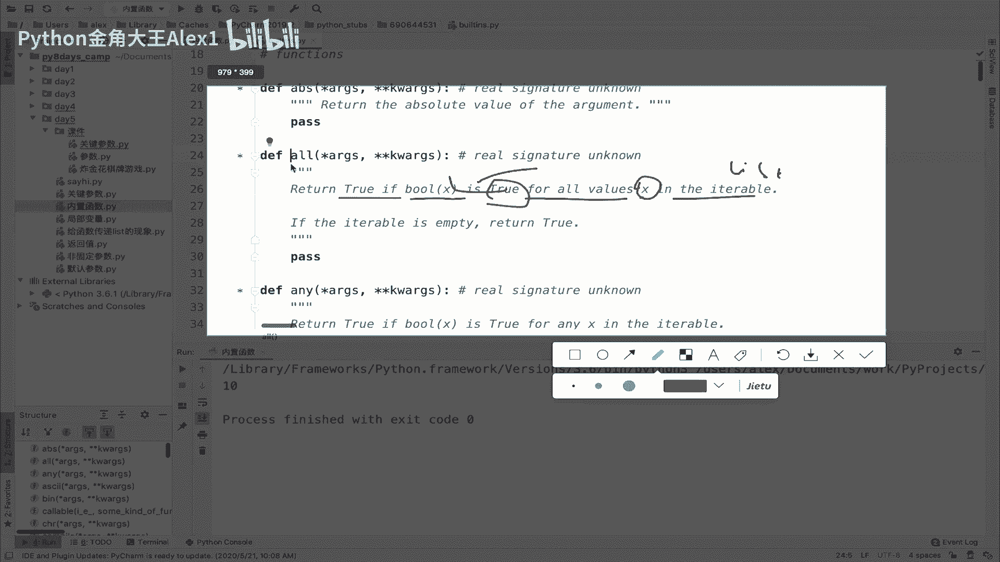

说在再说的直白一点，也就是说比如说我这里有一个啊，有一个啊这个列表123456对吧七，所以呢它就会大家哦，这顺这里还顺便也教一个吧，那这个布我没画横线，看来也是要用得到这个BOOL，其实就是干嘛呀。

判断啊，判就是做布尔值的判断，比如说这个值是否为真或者是否为假啊。

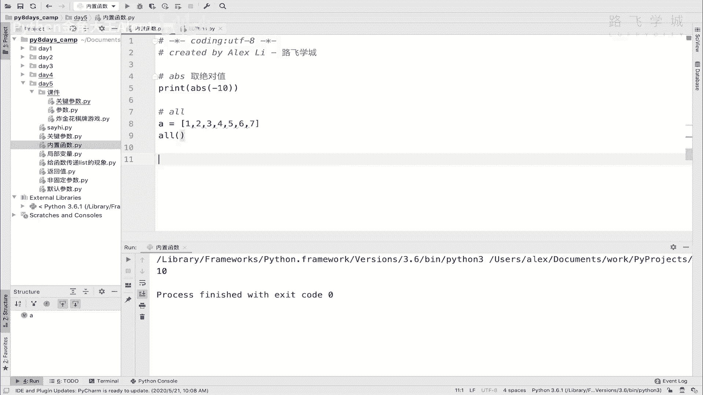

是否为真或是否为假，那我们这样，我我把这个sorry哎，诶U，怎么出不来呢。

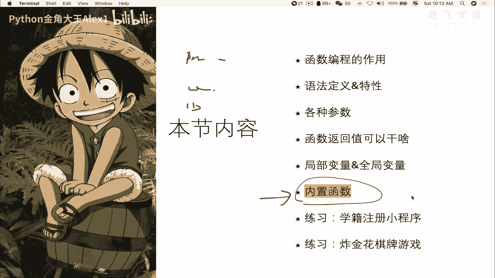

怎么出不来呢，我把那个想着把把我在这里吧，在这里也可以，Sorry，我们来看一下这个布尔啊，比如说呃我拿一个十进去，他肯定是处的对吧，我拿一个零进去，它就是甲，因为零它就是零，零就是零是false。

true是一啊对吧，只要是非零的都是true，然后呢零是false啊，零是空了，就什么也没有，然后我布尔这个什么呢，布尔这个NN它也是这个false啊，就是0none，它都是false。

然后我布尔这个什么呢，布尔一个赋值它也是true，看到没有，布尔一个值赋值，然后我布尔这个true是吧啊，它当然也是true，不是false，它就是false，所以它就是进行一个布尔值的一个啊。

判断这个这个这个布尔的这个函数啊，布尔值的一个判断，大家可以啊，哎呀呀呀呀呀呀呀呀呀呵呵，好长好长是吧啊，return true v when这个argument is true，也就是说返回true。

只要这里面的这个传的参数是true好吗，那也就是说它all这个函数干的事情，就是说把这列表里的每一个值进行循环，循环循环，然后拿着每一个值进行一个布尔判断，如果这个布尔返回true，对吧啊。

每一个布尔全都返回true的话，那整个or整个啊整个这个or也会返回TRU，所以大家来看，我要是去all这个A的话，你告诉我它会返回true还是返回false啊，他当然会返回true。

因为这里面每一个值都是true，对不对，但是如果我把它改成一个零，看到没有啊，这个值就是false，其他的都是true，也没有用了，因为只要有一个有一个不是true，那整个都不是true。

来同学们说这个有什么用，有什么场景下用，其实还有的时候特别特定情况下还挺有用的。

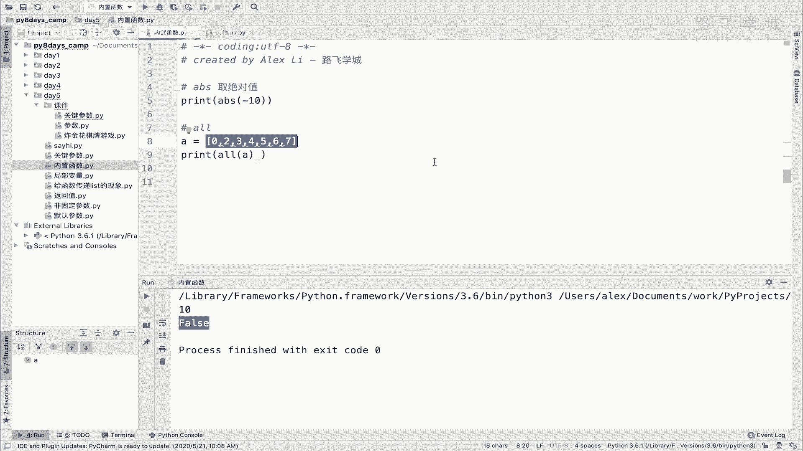

比如说包括现在这个疫情，是不是啊，现在疫情呢像这个飞机对吧，从国外飞回来的飞机，然后全机组人员都要进行核酸检测，是不是啊，要确保每机场每一个人都是啊，这个什么呀，没有问题的啊，检测没问题啊，没有得新冠。

那比如说你要把它变成一个，也就是说机上300人，每一个人检测完，每一个人检测完了之后放到列表里，每一个放到列表里，也说最后你只需要凹一下这个列表，然后对吧，如果检测为阳性，也就是说得了新冠的话。

你就给它变成一嘛啊，这对变成变成sorry，得得了，就变成零或变成一嘛，你反正定好嘛对吧，也就是说最后这里面有任何一个值不为证，对不对，那你就什么呀，是全机组都隔离，你说是不是啊，全全全飞机的人都隔离。

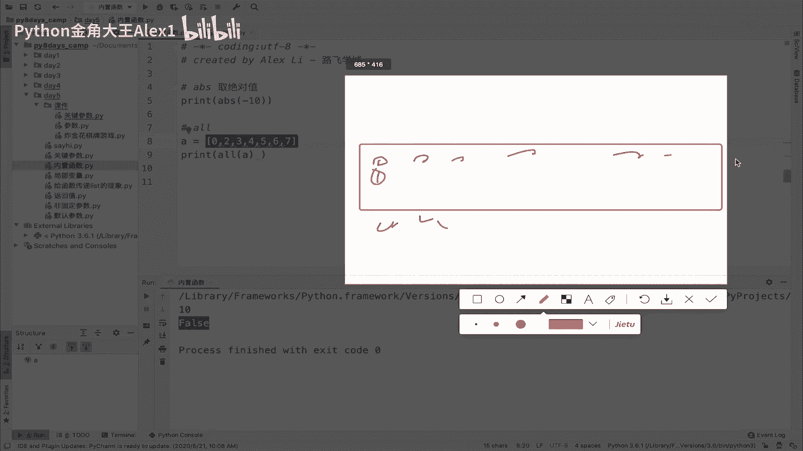

所以你通过all就一下子可以判断，这飞机上这几百人的检测结果，是不是统一一致的，符合条件，明白意思吗，哎这这是举了一个场景啊，这就是or大家知道就行了，然后呢接下来大家看看这个ending。

Any ing，正好跟这个all是相反的，or是说要求全部为true啊，全部为true，ending是说任意一个值为true啊，啊对吧，要求啊，这个这个这个这个啊任意第一个值为true就可以，知道吧。

任意一个，也就是说这里面你同样的这个数据，你拿你交给ending来去运行的话，他就是没有问题的啊，X a sorry，有单机执行，大家看哎哎哦还是还是这个on，大家看是不是true啊，对吧啊。

你这里面只要有任意一个，如果这些全都不为true，那不行了啊，全都不为true，比如说全都是零，那那那那是不可以的，那是不可以的对吧，只要有一个为零啊，有一个true就可以了。

OK好这个所以跟这个正好相反哦，那知道这个之后，我们再来看啊，布尔相当于已经讲了，我们来看这个CHRCHHRCHR很简单，c hr其实就是啊打印你这个什么呀，打印你这个你往里边输入一个数字啊。

把比如说输入一个90，他就把这个对应的阿斯克码上的那个值，给它打印出来，比如说是Z，我记得97应该是A看着小写的，对不对，40还是60啊，是多少，67还是多少，是大写的吧，啊60是小小这个这个小于号。

它总之是打印阿斯克码上的那个字符啊，所以没什么用，知道就行了，dict dictor是干嘛的呢，dict是生成一个空字典啊，生成一个空字典，大家来看一下啊，这个DICTOR，然后help一下啊。

直接dict一下吧，大家点进去可以看一下它是干嘛的，它首先你看直接你这样一括号，它就会生成一个空字典，当然它还还有好几种用法，好几种用法，这些呢我们不用去深究，因为啊我们也现在也不怎么用得到。

你先知道两种用法就行了，你可以给他传非固定参数，然后呢他就把它变成一个key，一个value啊，key value的一个结构，然后这个怎么讲。

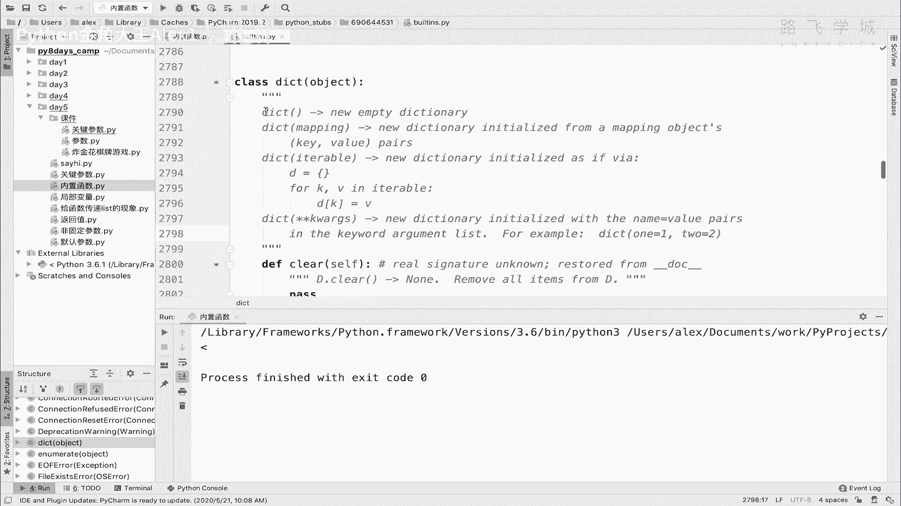

就是还有一个这种结构啊，你知道这两种就行了。

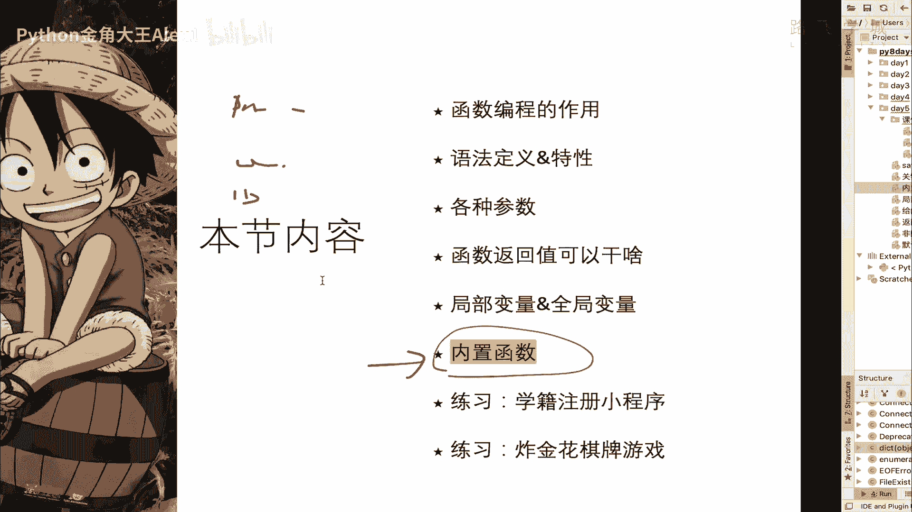

那我们可以来试一下啊，sorry可以来试一下，就是你比如说啊我们在这print一个dict，然后这是生成一个空列表，OK吧，我们也可以print，你也可以给它传值，比如说啊name等于一个ALEX。

然后H等于一个22，这样的话它就会生成把它当做key value生成，看到没有明白吗，哎这就生成一个新的就空字典好吧，哎dict，然后有有些同学说我直接加括号，不加这个中括号不就行了，我还用这个吗。

可以没问题啊，这个可以没问题，但是他就给你提供了这种用法了对吧，OKDIRDIR给大家看一下是干嘛的啊，DIR是呃，这样啊，加括号啊，大家看他是干嘛的，大家看他打印了一个列表，这列表里面有一堆的。

这个好像是变量啊，好像是哎，这是两个下划线开头的，这是什么东西，那这样大家看啊，我我在这里生成一个name，等一个ALEX，然后AH等于一个22，看看啊，你一执行哎，是不是这个name和age。

这两个变量名也在这个列表里了，对不对，这是干嘛呢，它会打印当前这个程序环境下，所有的这个什么在内存里的这些变量，所有在内存里的变量，这两个变量是我们自定义的。

这些带下划线的变量是Python解释器自带的，你不相信的话，你看一下，你这里你虽然没有定义这个杠杠file是不是啊，但是你可以打印它，你看是不是打印了一个杠file啊。

杠杠file这个变量其实就是打印它，显示了这个当前这个程序所在的这个绝对路径，看到没有啊，显示当前程序所在的这么一个路径，那这不是我定义的，这是Python解释器自带的啊，也就是说。

有的时候Python解释器自己可能也要用一些变量，它就临时给它定义好了OK吗，所以啊打印这个叫什么呀，啊第一IR是打印这个啊，当前程序的所有变量名，变量名OK吗，啊这个可能在一些特定场景下。

你会用先知道就行了好吧，然后接下来看这个什么呀啊help不错了，id input int都不说了啊，LEN也不说了对吧，list就是生成一个空列表，没有别的，你就执行一下它。

就你就像加一个中括号是一样的啊，加一个中括号空列表是一样的啊，locals啊，locals大，看一下locals，我们在讲函数的时候其实已经讲过了，对不对，咱们来看一下啊，locals是干嘛的呢。

我把这个呃sorry，我把这个，我把这个什么呀啊呃给它copy过来，大家看看这个效果，哎我在这里生成了两个变量，是不是啊，生成了两个变量，然后我们打印locals，大家看它返回一个字典。

这个字典里面也是，你看有变量名啊，有变量名有这个变量对应的值吧，应该是你看它对应的key是什么东西，你看有一堆啊，有一堆，咱们看看这个file是不是把这个对应的变量名也，变量值也给打印出来了。

包括我这个age name alex age，也就是说它跟DIR不一样的，是DIR只会打印变量名，但它会打印所有这个当前程序的所有变量名，and变量值，对不对，变量值对吧，当前程序的所有啊。

变量名和变量值是吧，OK或者是说我们如果在这个函数里面用这个logo，它会打印当前作用域，其实应该叫当前作用域，可能会更加的啊这个严谨一些对吧，当前作用域的所有啊，对吧，当前作用域OK吧。

哎这个是知道一下就行了，然后呢接下来给大家看你这个叫什么呀，呃map啊，我觉得这个呃，这个这个这个这个map还是有点用的啊，map我觉得还有点意思，给大家来看一下啊，这个map是干嘛的啊，top1啊。

我们直接写这个map，然后呢点进去看一下啊，它是干嘛呢。

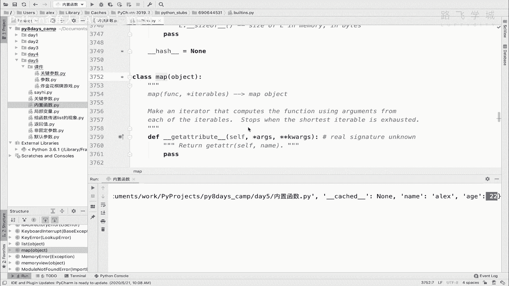

哎呀写那么一堆，我们不理解是吧，我就不给大家解释英文了，大家就看这个function，这是一个函数，这里面ITERITERABLE，大家只要一看到ITERABLE，它就叫可迭代，可便利，也就是可循环。

基本上我就讲了什么列表啊，字典呀，就是这种可循环的这种对象啊，可存循环的这种数据对象，所以就是说你放一个它的参数，是放一个函数在这放一个可循环的，比如说列表在这，那这干嘛用呢干嘛用呢，很简单。

就是把列表里的每一个元素交给这个function去运算，返回的结果就是整个map返回的结果，明白这意思吗，里边每一个元素交给function去运算，然后返回的结果就是就是整个map。

map运行的一个结果啊，每个元素都交给function运行一遍。

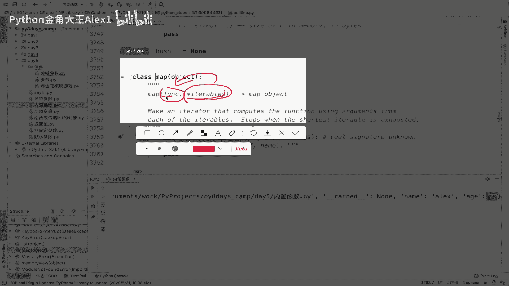

比如说十个元素就运行十遍，明这意思吧，那这个时候如果我这里有一个列表啊，就是比如说我有一个列表，然后呢就是直接是range等于一个啊，range等于一个十吧啊range等于一个十，list一下。

对吧这是一个呃，这是一个对吧，从0~9的那么一个列表，然后呢，我在这里写一个函数DRCLC计算X等于把，也就是因因，因为我一会要把这个列表里的每一个元素，交给这个函数去运算。

那就是return一下这个X乘一个啊，X的二次方行不行，X的二次方也就是两次方，然后这个时候啊啊怎么讲，我用这个map方法啊，用这个map方法去运行一下，看map，然后直接第一个是函数名，注意了。

不要加括号，这个地方一定不要加括号，它会自动调用，只需要把函数名放到这就行了，OK吗，哎这个地方我要讲一讲，就是咱们涉及到函数的时候，你如果在这里值，你看我们讲讲函数，是说你如果加上了这个啊括号。

它就是调用，如果你不加括号的话，大家看它是干嘛呢，它只会打印这个函数所在的内存地址，看到没有啊，来啧大家看是不是它会打印一个函数，什么什么是在这个000，这是打印这个函数所在内存里的这个地址OK吗。

所以他并没有调用OK吗，那现在map的话，你在这里不要加括号，你只需要加上这个内函数内存地址就行了，然后他一会他会自己调用的时候加括号，那接下来把这个L直接放到这就完了，看到没有哎。

那你他就会拿着列表里的每一个元素，扔给这个函数去调用，当做一个参数，明白吗，执行一下，大家看哎，同学说你打印了一个什么呀，打印了一个map map object对象，map对象。

也就是说它只是打印出来的这个内存地址，唉并没有产生这种所谓的对吧，交给函数每一个啊去运行的那么一个什么，注意了啊，这是它的一种特殊的一个玩法，也就是说你只是这样了之后，它并没有啊。

并没有真正开始去呀去运算，也就是说他们并没有执行啊，并没有真正调用，什么时候才开始执行呢，当你开始在当你开始取里那循环的时候啊，呃hold on，我在这先给它赋一个变量啊，有同学你不要蒙啊。

在这附一个变量，就是呃M吧，好这个时候它其实并没有啊执行啊，并没有执行，什么时候开始执行呢，循环它的时候，for i in这个M比如说这个时候你print哈I哈，然后执行，看同学们。

当你真正啊像当你真正去这个啊循环它的时候，它才会它才开始去把这个里面的元素，每一个元素每循环一次，他就把一个元素扔给这个函数去运行，每循环一次它就扔给它，所以最终得出来是不是求出来的平方了，明白吗。

所以啊这个是啊，每循环一次，每循环一次啊，这个啊去就把列表里的每一个啊元素对吧，扔给啊，扔给cl函数运行啊，这个啊调执行对吧，并并返回结果，OK这个就是它的一个实际的一个啊表现形式啊。

有同学说为什么说我这里没有执行，然后这这些东西我现在没有办法给你讲，因为这里涉及到一个咱们啊集训营利，不涉及的新知识，叫做什么呀，迭代器啊，迭代器是吧，这个呢在咱们的正式课程里会讲啊，你现在就知道。

但是没关系是吧，讲迭代器你就明白这啊，为什么他现在不执行，而是说每次循环才执行，但这个都不影响我们现在使用，你知道这个现象就行，现在你就只知其然，知其所以然的事交给以后啊，先知其然好吧。

这个就是map的一个作用，对不对啊，map的作用OK能明白这个意思吧，可以吧，哦注意了，这个时候你这个map，你的这个CALC只能定一个参数，你不能定多个啊，它也就是说他会把这个列表里的每一个元素。

扔给这个啊，扔给这个函数当做参数，但是他只会扔一次，只会扔一个参数，你这里如果有多个参数的话，比如说这里有Y什么的，它就会直接报错了，明白吗，所以这里啊只能定义一个参数啊，只能啊定义一个参数OK吗。

好这种这个就是map在什么场景下用的，我跟你讲还是挺有用处的，你看你这种你就可以快速的对吧，去做一些事情，我现在只是简单的做了一个它的求平方，是不是啊，那你你可以做很多其他的事啊对吧。

你可以让他这个干点别的呀，对吧啊，都行啊，反正要return啊，你不return就是N了啊，好吗啊，return好，这个就是把map给大家讲完了，讲完map之后再给大家讲一个max啊。

max max是干嘛呀，求一个列表里面的最大啊，这个可迭代对象里面的最大值啊是吧，就max嘛，对不对呃，大家看这个时候我print max啊，直接把这个L扔进去啊，这个里面大家看他就会打印，看到没有啊。

他就会把这个列表里最大值给你打印出来，对你这里面扔的啊，这个数据是要你扔的这个列表里面的这个值啊，要是可运算的，比如说他确实能判断大小是吧，确实能判断大概你扔了一堆乱七八糟的对吧。

这个这个这个中文什么进去，他就他就判断不了，他就报错了啊，好吧，自己可以试一下这个max啊，就求最大值，求最大值跟这个max对应的，那肯定有一个叫什么呀啊最小值最小值叫min，看到没有ARMIN。

然后呢执行一下，大家看对吧，哎你看就是求最小值，所以就可以快速的用啊，快速用，还有一个是可以干嘛呢，叫求和，我就直接给大家讲了啊，求和是什么呀，直接sum，然后把这个什么呢。

把这个L列表里的每一个值给它加起来，把列表里的每一个从0~9啊，执行加起来啊，0~9加起来是45，自己不相信算一下啊，所以你就很容易的把列表里边这些元素给他，求个和，还有同学说还可以求平均值哦。

不好意思，求平均值，这个没有啊，求平均值的话，比如说列表里的这个所有元素加起来求平均值，这个你得自己算了好吗，OK这个就是啊这些好，那这一小节咱们就先到这。

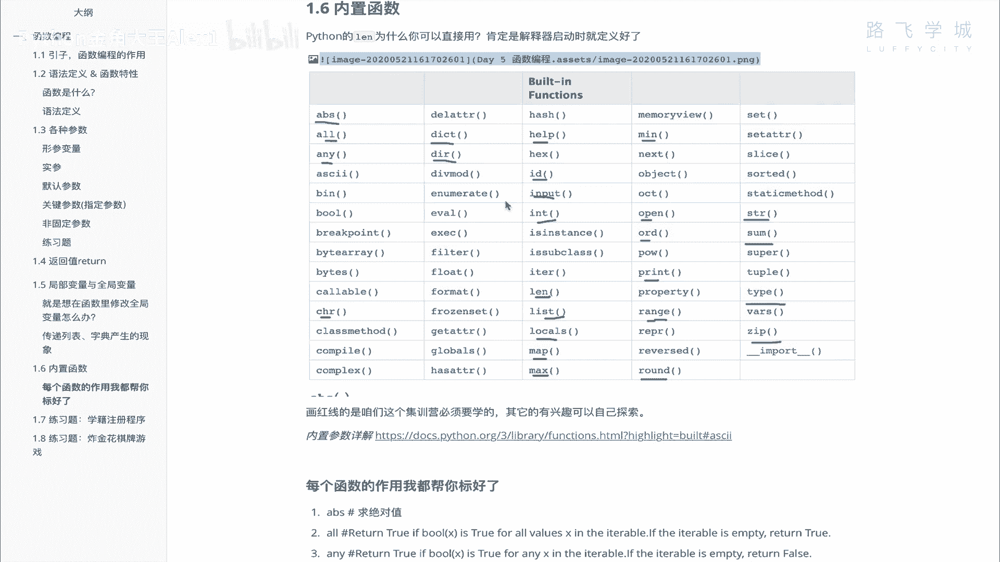