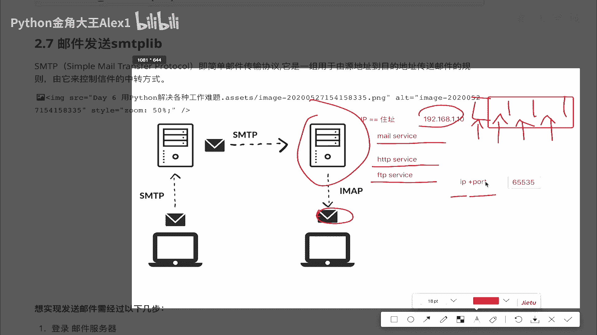
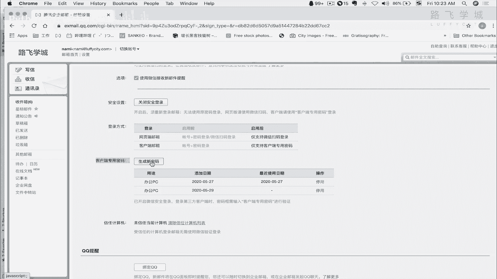
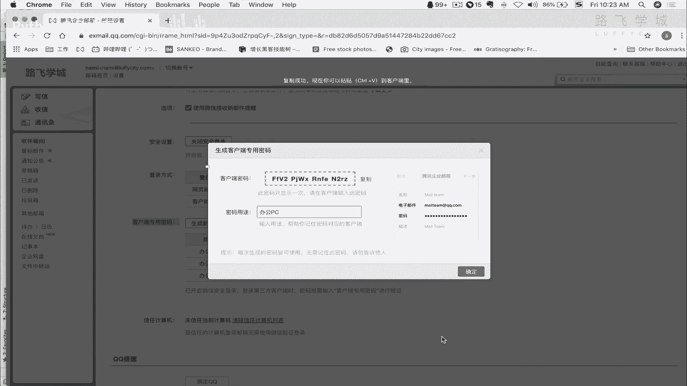
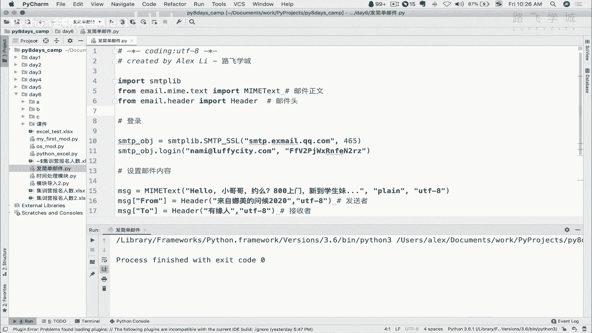
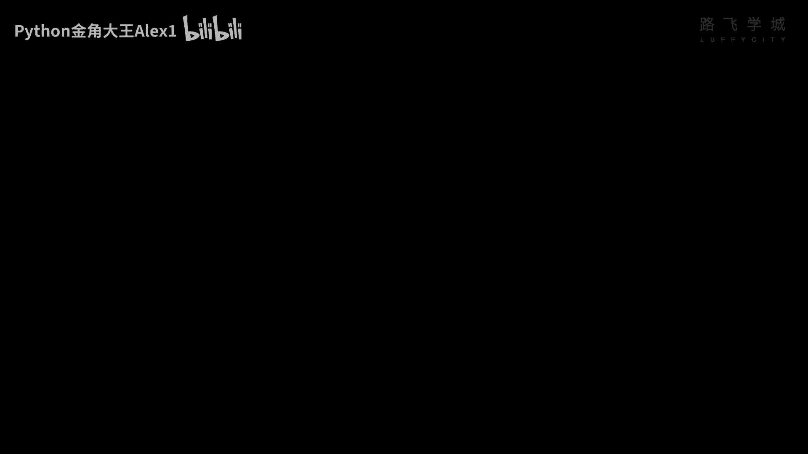
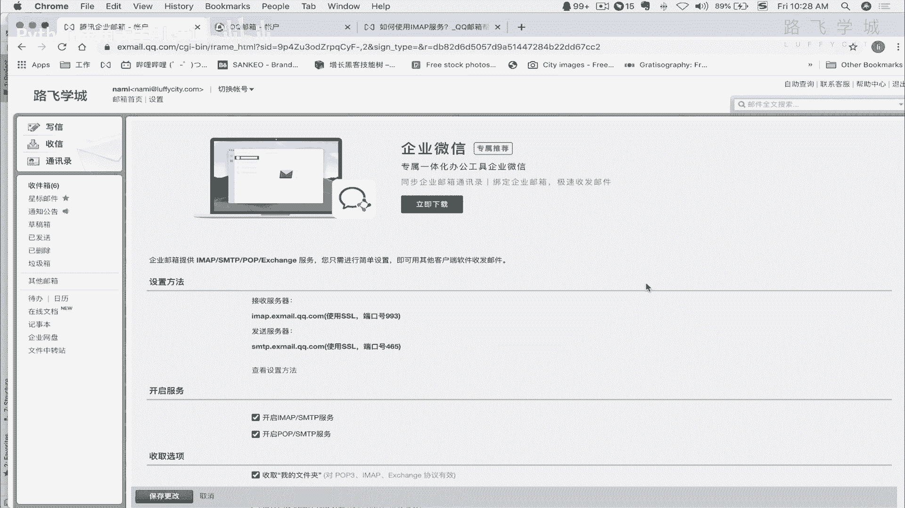
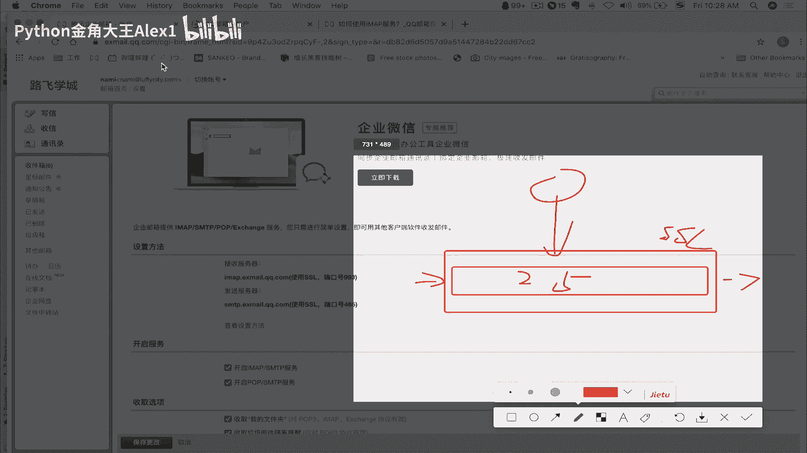

# 【2024年Python】8小时学会Excel数据分析、挖掘、清洗、可视化从入门到项目实战（完整版）学会可做项目 - P79：12 用Python发邮件 - Python金角大王Alex1 - BV1gE421V7HF

OK同学们，这一小节呢我们来学习这个邮件发送，用Python啊，发邮件自动学完，这个你就可以自动的来做很多，比如说给你这个邮箱发一些报表啊，这些东西，OK吧，那咱们来看一下这个咱们要学哪些东西啊。

学这个s t m t SMTP lab这种模块啊，我们要用它来实现发一个简单的邮件，发HTML格式的发，并且在里面可以带附件或者带图片好吗，那首先呢我们要先了解啊，这个发邮件是一个什么样的流程，好不好。

诶，大家看这个啊，首先呢一个发邮件，咱们要了解一个叫SMTP这个东西，SMTP呢，它就是一个发邮件要用到的一个协议啊，他那叫simple male transfer protocol。

就是简单邮件传输协议啊，干嘛用的呢，也就是说它规定了在互联网上，两台这个电脑之间，你想实现邮件的这种传递对吧，从你的邮箱发到他的邮箱，那你必须遵循这个协议，用这个协议才能实现啊。

这个啊相当于邮件消息的一个发送，你可以理解，即便你是小白也没关系啊，你可以理解这个协议是什么，就跟咱人类的语言一样，中国人和日本人之所以互相听不懂，是因为他语言不通，也可以成为协议不同对吧。

日本人是用他那种片假名乱七八糟的一堆，中国人是用我们的汉字，是不是啊，哎写的字说的话啊都不太一样，所以他互相不通，这就是协议不通，但是中国北方和南方的人对吧，他这个协议是通的，所以他们互相说话是能听懂。

当然粤语就不算了啊对吧，哎但是即便是粤语，你写的这个文字也依然是一样的，是不是啊啊OK所以这就是协议相同，那在互联网里也一样啊，这个呃你想发邮件，对不对，你就要有这种邮件的这种协议啊，邮件的这种语言。

你想实现这个，比如说浏览网页啊，其实就有浏览网页的语言，所以我们管这个浏览网页叫什么HTTP是吧，你想还有很多其他的，比如说你想传输文件啊，那就又要用到什么FTP唉，总之以后我们会学很多的协议。

先来看一下这个啊，S m t p，它呢是一组啊，用于原地址到目的地址传送邮件的一个规则，说白了协议就是定义了一些规则是吧，你想发消息到对方服务器上啊，对方那个电脑上，那你得遵循这种规则，遵循这种规则。

比如说你要有这种邮件头对吧，就表头你发给你就收件人地址，是不是啊，然后呢这个邮件的这种内容，一些按遵遵守什么样的这个这个文本格式，这都是他定义的规则里的内容好了，那咱们来看一下这张图。

这张图呢其实就是啊两个服务器，两个服务器呢，哎这是你的电脑，你发一个邮件，你看他这里点上了，就SMTP，比如说对他为什么有两台，但不是说我把邮件直接发到从这个电脑发到啊。

稍等我直接从这个电脑发到这个电脑吗，为什么还要经过这个啊，同志们啊，注意了，你你你们看咱们是不是有用这种什么QQ邮箱，有什么用，163邮箱是不是也就是说你电脑上用的，如果是。

比如说我在这里是一个QQ邮箱，我在这里是一个163的邮箱啊，这个意思吧，那其实是怎么讲啊，你你这个邮箱其实只是一个客户端，也就是说你收发邮件，也就是说你你在这里通过你电脑上那个客户端，把这个邮件发出去。

但是他注意了，他只是客户端，它肯定还有服务器，也就是说你把你的邮件到底发到哪了，你不是直接发到这了，No no no，不是你是先发到自己的服务器上，所以你把你的这个QQ邮件先发到了。

通过这个SMTP先发到了这个QQ的，QQ的这个邮箱服务器，明白吗，哎所以它是有一个服务器的，这个服务器负责一个什么事呢，负责消息的中转，负责邮件中转，它干了一个事，你把消息发给他，把邮件发给他。

他进行去检测，说哎你这个是不是符合规则，你如果符合规则，比如说你里面肯定写的收件人啦，那我就去检测这个收件人是否存在，如果收件人是存在对吧，我就发给他哦，Sorry sorry，说错了。

它它不是检测收件，它是检测你这个收件就是发的内容，这个规则是不是合适，收件人是否存在呢，是发到对方服务器上啊，人家对方服务器检查，因为你也不知道对方服务器，比如说有没有一个叫张三的人，明白吗。

所以他只要检查你符合邮件的这种基本规则，他就把消息发出去了，他发给谁呢，他一看你是发给163的，所以他就去找163的这个邮箱服务器，明白吗，通过SMTP8这个内容，把你的邮件直接中转给163服务器。

然后到了163服务器上之后，同志们，163服务器就会检测说哎，这个我这个服务器有没有，你比如说他要发消息给张三，那我这里就要检测，我这里有没有一个叫张三的人啊，诶他一看有有的话呢。

哎我就把这个就就把这个消息邮件给他，收下来了啊，收下来了，如果没有干嘛，如果没有的话，同志们，我就会给这个服务器返回，就拒收，说我这里没有这个人，然后这个啊你自己QQ服务器收到这个啊。

U163的这个服务器的响应，它就会拒收的这个响应，然后就会再告诉你这个什么呀，告诉你这个自己电脑说哎你这个什么呀，这个叫叫叫叫收件人不可达，收件人没有这个收件人，所以他发不过去，明白这意思吧。

那如果也就是说如果有刚才讲了，在这台服务器上有张三这个人，他就把这个邮件给收下来了，收下来了之后注意了，他并不会直接转发给这个客户端，什么意思为为为什么不会直接啊，那那我们这个收邮件不是立刻就收到了吗。

就就就就比如说我这个要求，就是QQ给我发一个邮件，我163不就立刻收到了，不是他不会就服务器不会主动发给这个叫呃啊，这个这个客户端，而是客户端主动去拉取，明白吗，明白这个顺序啊，他客户端主动去拉取。

如果你没拉取，它就在这个邮箱服务器里，就在这个这个人的账户，张三这个账户下存着，明白这意思吧，哎这个张三这个比如说这个是张三，张三自己定时去这个邮箱服务券服务器上去，拉取他的邮件，明白OK吗。

好这个就是一个大概的基本的流程啊，当然实际情况比这个要复杂很多，但是我们理解这个大概流程之后，你就要知道了，说我要发邮件给163是吧，我得先发到我自己的服务器上，你发到自己的服务器上是吧。

你就得有一个用户认证的过程，他不可能让谁都随便发，是不是，所以他就必须要有用户名密码，哎你的邮箱的用户密码，你要登录这个邮件服务器，然后输入你的用户名密码，还验证成功了之后，你才可以发邮件。

明白这意思吗，哎发邮件给对方好，这个就是说他肯定有一个认证的过程，明白吗，那第二个是什么呢，就是你肯定写的这个邮件内容，是要符合这个人家的这个规则的，你不能随便写，对吧啊，这个协议是有规则的啊。

要不然就像你跟日本人说话，那你不不符合日日语的这个规则，他是听不懂的，所以你要按照这个规则来去构造你的邮件内容，OK第三个就是登录了，构造好邮件内容了，第三步就是发送一点发送就OK了，能理解吧。

所以我们总结一下，你要发送邮件分现在这几步，第一步你要登录邮件服务器，没错吧，啊，构造符合邮件协议要求的这个邮件协议规则啊，规格要求的这个邮件内容，对不对啊，你人家这个只支持日语，你就得说日语。

是不是啊啊这个意思，然后呢接下来就来发送，就这么简单的几步，OK好，那我们知道了这个步骤之后呢，咱们接下来看用Python的这个代码，怎么实现上面的这几步，好吧。

那在Python里面对邮件发送有两个模块支持，第一个是sm TP lab啊，S第二个是email，那首先说email这个模块是负责干嘛的，他构造邮件的这个啊内容构造邮件内容。

也就是说其实它是符合它是第二步要干的事，就是构造符合这个呃邮件协议的这种邮件内容，那叫email模块，OK然后sm TP lab呢干这两件事，登录服务器做这个用户认证啊，第三步就是发送邮件，明白吗。

OK那好咱们来看一下这个，这里有一个最简单的，我写的这个咱们的语代代码，咱们一块来学习一下，首先你要导入啊这个sm lab，从并且从email里面啊，这里面一堆写导入一个叫MIEMIE这个TT。

这个是负责干嘛呢，构造邮件正文的啊，邮件正文，然后呢这个是负责干嘛的呢，负责邮件的header就是表，就是邮件头嘛是吧，邮件头比如说你发给谁，收件人地址啊，从哪里发的，类似这些信息好。

接下来呢咱们就要先看第一步，登录邮件服务器是吧，登录邮件服务器呢，你执行一个SSMTPSSL啊，然后去这个干嘛呢，输入这个邮件邮件服务器的这个地址，然后呢输入一个叫什么呀，这个东西是什么，是一个端口号。

哎讲到这我就要给大家扫扫盲啊，那个小白可能不懂啊，不懂这个什么IP地址这样的一些啊一些东西啊，一些东西咱们首先说你在网络上啊，这台电脑要跟这电脑要通信，它肯定要互相知道地址。

就像你你这个现实生活中发快递，你不得你发到哪，你不得有有地址吗，互联网里也一样，互联网里它它这个定义，它这个怎么去记录这个地址，大家都知道啊，稍微懂点IT的就是知道这是通过IP地址，是不是啊。

啊那IP地址其实你可以理解为就是等于约等于，其实你家里的这个叫什么呀，啊家庭地址是吧啊，住址对不对，住址也就是说你现实生活中的住址，相当于计算机网络里的这个IP地址，IP地址格式一般是这样写啊。

就是什么192。168点，什么1。0102对吧啊，类似这样的，你家里边不能上网对吧，那个技术支持人员先跟你说，哎你个IP地址配的是不是有问题呀，啊对吧，就是这样，那知道IP地址之后。

咱们现在这个问题就来了，说你看啊，你这在服务器上，你在服务器上现在是支持邮件服务对吧，所以我们呢这个邮件服务就叫mile server and mail service，啊对吧。

起了一个启动的一个邮件服务，但是我说我这个服务器，如果也想支持A这个网站服务，那就是htp service，A t p service，并且我还支持这个网盘共享，那就是FTP service。

就文件共享啊对吧，当然还会有很多啊，还会有很多，咱们就不说了，假如这三个服务问题就来了，说我现在是我，我我现在发要发一个邮件啊，到你这个服务器上，但到你这个服务器上呢，你你相当于你现在找到你这个地址了。

找到你这个地址呢，相当于找到你家了，找到你家呢，问题就来了，我现在只有一个就是你加你加加，相当于就是现在只有一个一个门对吧，我我就直接把这个，把我这个消息送到你这个门这了，送到你家门口。

但是问题在于你不知道，你没办法分辨，我这个发过来的这个消息到底是一个发给，到底是一个邮件还是一个什么呀，网页的请求还是一个扔来扔过来一个文件啊，你不好分辨的，还有同学说怎么不好分辨我。

我这个所有的快递扔到我家门口，我就直接拆了，不就知道是什么了吗，那是你人类肉眼的，你可以对吧，通过打开看一看啊，这个就就就就就OK，但是即便你打开看一看，我问你拆的话，需不需要花时间。

如果所有送过来的箱子，这个快递的箱子外面包装都一样，那你每拆一个快递，可能需要2分钟是吧，啊那个这个这个呃这个对吧，你手慢啊，一个手在自己搞自己的时候，另一个手拆的时候，那更难拆5分钟。

那总之拆的过程需要耗时间，那在计算机里，你你你说如果我我我发过来一个包，然后呢我就要先拆开再检测一下，看看里面到底是邮件还是网页还是文件的话，不是不行，但是效率非常低对吧，所以怎么办。

能高效的去去去去去解决这个问题，也就是说让我呃消息发过来，如果你是邮件啊，我都不用检测，立刻就知道你就是一个邮件啊，我不用说拆开你这个发过来的数据包啊，这个打开看一看哦，里边具具备这样的一些规则。

就代表你是文件，明白这意思吗，所以解决问题的方法是怎么办呢，就像你家一样，你家现在有一个门是吧，那你只能是每个快递拆开来，那可以这样啊，可以这样，你在你家门口啊放一个叫什么呀，放一个。

你家在你家门口放一个叫快递投放投放柜行吧，同方棍呢，你这得拆多少格，对不对啊，拆多少格你就规定了，唉如果是邮件就给我扔到这个格里，如果是网页就扔到这里，如果是FTP就扔到这里，明白吗。

你可以拆很多这样的歌啊，所以这样的话就能快速的分辨出来诶，你是邮件还是什么还是什么诶，那这个快递格，其实就是咱们啊要引入的这个东西，就是IP加端口啊，叫IP加P对吧，刚才我看到那个465。

其实就是这个端口，其实就是这个端口，明白意思就是这个邮件专门的这个端口，OK所以咱们啊就你大家理解啊，这个端口号相当于在你家门口开了很多个小门，理解吧啊就是快递小哥好。

那能一共一台电脑能开多少个快递小哥呢，一共能开6万565535个，65535个啊，65535个这个端口也就是说你同时对吧，你你家门口可以嗯放那么多不同类型的快递啊。

然后计算机里就是说可以支持同时一台电脑，理论上可以开6万多个服务啊，同时6万多个服务啊，当然真正的这个实际情况下不可能开那么多，这个一台服务器就开一两个，但anyway这个端口大家理解是什么意思了。

好不好，所以呢我们在这里写一个叫啊465这个端口，然后接下来你就写你的用户名和密码好吧，然后这个是显示一个调试信息啊，这个就是一会儿可以看，不重要啊，不重要，那这个呃设置设置这些认证信息之后。

接下来呢你就可以可以干嘛，第二步就是构造符合邮件规则的啊，这个这个邮件内容，这些内容就是直接呃看着啊，就这个先写，先写这个正文，对不对，M e text，然后一个函数把它包裹起来。

里面你就可以写你这个内容，这可是主题对吧，Hello，小哥哥，约莫半百上门，先找学生妹，哼想到这不说了，然后注意了这第二个参数plan plan是说什么呢，文本格式纯文本，就像你电脑上那个记事本一样。

明白了那个你电脑上那个记事本，它是不是它只能写文字，不能写插入图片，不能表情啊什么的这些东西，但是你如果是word的话，你就可以插入图片什么的，是不是还可以还可以这个这个叫叫叫什么来着。

来进行这个这个排列对吧，这个负责什么什么排列解，就整个可以可以加很多东西在word里面，但是纯文本就只能是文字，明白这是纯文本，然后编码是UTM8格式就不说了，哎这就是构造了一个邮件正文。

然后接下来你要构造消息就有邮件头，就是用这个header导入进来的，看说哎这是来自娜美的问候from，看到没有，大家写邮件，那个邮件上面不都有，有一个就是发件人，发件人就是from收件人就是to啊。

叫有发给谁，发给有缘人，注意在这个地方不一定写这个，不用不一定非得写这个叫叫叫叫什么呀，有收件人的邮件地址，这个只是说你收到邮件之后，它的它的啊，我给大家直接看这个图可能会更深一些。

诶我怎么怎么怎么怎么怎么拷贝过来，稍等啊，好在这大家来看一下啊，我这个收件箱里啊啊这个什么呀，在这诶这个发件人刚才那个from就是这个东西，看到没有啊，这个是你自己可以定义的啊。

定义的这个名字看到没有啊，名字就可以定义，另外这个收件人看到没有，他这个是写的企业腾讯邮箱口，他并没有在这里写你的邮箱地址，看到没有，那并没有写你的邮箱地址，所以咱们也可以自己定义啊。

自定义真正在哪里写这个收件人的地址呢，收件人地址呢啊嗯一会说先说这个subject，就是主题啊，就是就是你这个发的邮件的这个这个什么呀，这个这个主题吧，看到没有，Subject，这是好吗。

然后这样你的一个邮件的正文和消息文，邮件头就都设计好了，接下来就第三步就发送发送，直接是啊，在这里你你现在已经登录好这个服务器之后，给它生成了一个变量，相当于接下来你就通过这个变量来去操作。

就是SMTPOBJ点send mail啊，这是看着这个地方注意了，这个是发件人，这个是发件人，也就是说你用哪个邮箱去往远程发对吧，用哪个邮箱是往远程发，这个是收件人，看到没有，这是发件人，这是收件人。

注意了，接下来把你消息发在哪了，看着这就是i message嘛，你刚才设置了邮件正文存成一个变量message，然后呢给他给这个message设置啊，表头对吧，邮件头啊，然后主题。

然后最后把这个message给它干嘛呢，干嘛呢，变成一个字符串as string，然后就压缩成字符串，然后就发出去了，这样就解决了，明白这意思吗，那好同志们，我们可以来试一下好不好，我们可以来试一下啊。

来晚了就直接嗯算了吧，我自己写，但是记不住的，我就会copy copy嗯，SMTV发邮件，发简单邮件，OK然后呢我们是from这个from SMTP哎，S m t v import usm s s m。

算了吧，我也记不住啊，记不住啊，因为你说白了你也不天天写这个啊，不天天写这个，很多时候就copy过来，接下来我们第一步要干嘛，先去登录是吧，先去登录啊，那我们就是SMTPOBJ啊，给它赋一个值。

然后等于SMTP点，注意了，SMDSMTPSL看到没有要写这个啊，写这个一会儿我解释这个SSL是什么东西啊，一会儿说就直接这样写，写完之后呢，先写这个啊，邮箱地址，例如我这个我用的是我的这个企业邮箱啊。

就是呃sorry，我用的是我腾讯企业邮箱好吗，你可能你用163，你就得写163的地址，一会怎么去看这个地址，我一会儿告诉你啊，我告诉你，然后接下来你就写这个什么呀，写你的用户名和密码。

写你的用户名密码在这，我这是这个邮箱密码的话呢，我得去拿过来，怎么去拿呢，我就打开我的这个网站，打开我的网站，注意了啊，你这个个人邮箱可能不太一样，我企业邮箱呢注意在这个地方。

QQ邮箱应该在这里也有一个设置，看到没有，点击设置之后呢，注意了，我们再看一下啊，呃应该是在账户这个地方，在账户这个地方呢，注意了啊，呃我看一下啊，看一下看一下看一下在哪呢，邮箱绑定应该是邮箱绑定。

对邮箱绑定这个地方啊，注意了，你不能，你，你你你以为可能是说，我直接在这里写我邮箱登录的密码就可以了，呃一般有的邮箱是可以，但是像呃你就就很多邮箱是，你可以直接写你的这个邮箱登录密码。

但是啊这个有些邮箱呢他为了安全他干嘛呢，他给你在这里搞了一个叫什么客户端专用密码，什么意思，也就是说你在这里咱们不说收邮，收邮箱，你你你得用客户端吗，咱们用可以用outlook是吧，可以用这个。

你像我这个Mac是用微软自带的，而且Mac自带的还有可以用这个fox mile，腾讯的fox mail，还还还有很多邮箱客户端是吧，那你这个邮箱客户端输入邮箱，然后所以你邮箱客户端就得登。

你这个邮箱服务器对吧，你就得把这个密码配到邮箱客户端这个地方，那有的这个邮箱供应商呢，他就为了你这个保证你安全了，就在这里生成一个随机密码，相当于给你生成一个随机码，就是你用客户端来搜密码的话。

就是你不是直接通过网站登录，不是通过网页直接登录他的啊，这个邮箱服务器的话呢，你要用客户端来登的话，你就在这里给你生成一个随机密码啊，临时密码你写到你的配置，到你的邮箱服务器上啊。

就邮箱客户端上明白这意思吧，所以这个地方就是客户端专用密码，你的邮箱不一定有，但是QQ的是有的啊，16363好像也有啊，然后你在这里点生成一个新密码，看着生成新密码。

它就会给你弹出来，看到没有弹出来，你就把这个啊给你复制复制。

然后呢我就把这个放到放到放到这个地方，所以相当于我在这里放的这个密码，它只是给我生成的临时密码，就是即便你们知道也没有关系，你们我随时都可以把它换掉改掉，这样的话我把这个代码写在这。

你也看不到我的真实这个人的这个密码，明白吗，我用这个也能登录好，这个写完了之后，接下来咱们来看设置这个什么呀，设置邮箱，设置邮件内容是不是啊，那你要先写这个邮啊，就是这个表就是邮件正文。

是不是邮件正文的话应该是am i text，然后里面有几个参数啊，几个参数，第一个呢就是第一个啊，这里有一大堆啊一大堆，首先就这个吧，这个就是SM用不用管，就是你的文本内容，然后接下来是plan。

然后呃接下来就是你这个叫什么呀，编码格式，第一个就是，咱们可以给他copy过来，Hello，小哥哥，哎哎哎哎对，我就直接给他copy过来吧，直接把这几个都copy过来吧，好吧。

反正咱也解释了什么意思行吗，看了小哥哥约吗，然后呢不会给我屏蔽了吧，第三步你就是干嘛呀，发邮件啊，说的够简单了吧，发邮件你直接是s m t v lib，send mail就可以了啊。

send mail把这个拷贝过来让大家看啊，这个是发件人地址，注意了，这个是我给你加了一个列表，列表里面他是同时可以发给好几个人的，现在是发给我ALEX啊，这个邮箱，然后呢发给我的一个QQ邮箱。

同你还可以再继续加，看到没有，然后在这个地方加上你刚才的这个写的，这个邮件内容，明白这意思吗，你这样一搞啊，这样一搞啊，来自娜美的问候嗯，这个2020是吧，好诶，Sorry，Sorry sorry。

还是娜美的问候，这个地方写2020，这个写标记2020的系可以吗，同志们，这就没问题了，我直接右单击执行，大家看啊，没有报错，没有报错，就代表发出去了。

就代表发出去了，这个时候我打开我的个人邮箱，哎大家看看到这个了吗。

是不是收到了一封邮件啊，这个to什么有缘人，是不是啊，然后呢来自娜美的信，看到没有，这个就把邮件发送成功了，我的另外一个，我的另外一个这个QQ也收到了这个邮件，肯定也收到这个邮件。

就是mail qq点com，然后大家都进去看一下诶，怎么没有收到，怎么没有收到诶，难道写错了吗，写错了啊，写错了写错了呃，我这个IP这个QQ号不对，33178223328，131782332是吧。

这好像是332啊，我忘记了啊，我的一个QQ，总之这个地址不对，总之收到了一个明白这意思吗，收到一个那个肯定QQ号，发到人家不知道哪去了啊，发到人家那个QQ邮箱里，好同志们，到此你就可以自己来试一下好吗。

那接下来告诉大家怎么去找这个啊，这个这个三就服务器的地址啊，服务器的地址啊，你们可能是不同的邮箱，所以不太一样，我给大家看一下啊，如果你是QQ邮箱的话，在这个设置这里啊，QQ的设置里。

这里面应该有一个啊收信规则，QQ的话是在收信规则的账户，看下是不是在账户对，在这啊，在这的话你到时候注意点啊，你点一个叫什么开启，这个，开启，这个这个这个这个他应该我这是已经开启了啊。

开启的话它就出现了，你看就是SMTP啊，这些服务啊，这些服务怎么去设置呢，我看看啊，来设置，我看它会显示吗，在这里啊，对他在这里应该用，唉看到没有，你点进来告诉你了啊，发送的服务器，接收的服务器的地址。

这是QQ的，明白吗，哎这是QQ的，那我的这个企业邮箱呢是在这里啊，收发信规则应该是看到没有，他已经告诉我了，看是不是写上端口号，是这个，明白吗，啊，这里他说了一个使用SSL给大家解释一下吧。

其实正常的话，邮箱服务器SMTP协议的端口号是25，不是465，是25，但是这里加了一个SSL，SLSL是什么呢，就是一个叫网上的安全通道。

安全通道什么意思，也就是说如果我直接是通过这个什么呢，通过25这个端25来去就是这个隧道啊，这个管道吧，协议管道来去发邮件的话，会这是明文的，铭文呢就会在网上被截取对吧，被一个第三方黑客截取之后。

那这个邮件内容就暴露了，所以为了保证邮件安全，在上面又加了一个管道，你可以理解为这个管道就是SSLS，这个管道就是SSL啊，就是秘密通道，所以即便黑客它截到它也破解不了，这里面是什么数据，都是加密的。

明白吗，所以现在邮箱都用SSL，包括我们的网站。

你看前面加了一个这个东西，是不是这个代表也是通过SL的，你访问这些网，你看这个就是不安全的啊，这是一个网页不安全啊，不安全，包括这都是安全的啊，你包括我们路飞的这个网站，它也是安全的，看到没有。

但有些网站它不加这个要锁的话，它就不安全，不安全，就是在网上传输都是明文的，你在这里输入用户名密码被黑客截到了，黑客就知道你网站的用户名密码了，理解吧，这是SSL啊，大概知道就行了，原理我就不说了。

总之啊就这样你就可以去发送邮件了。

